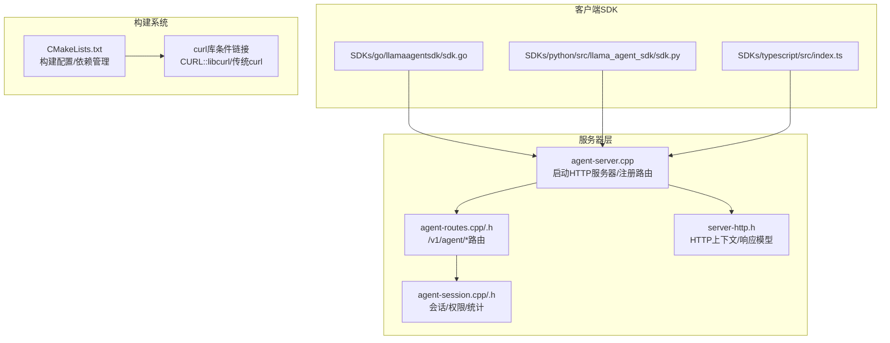
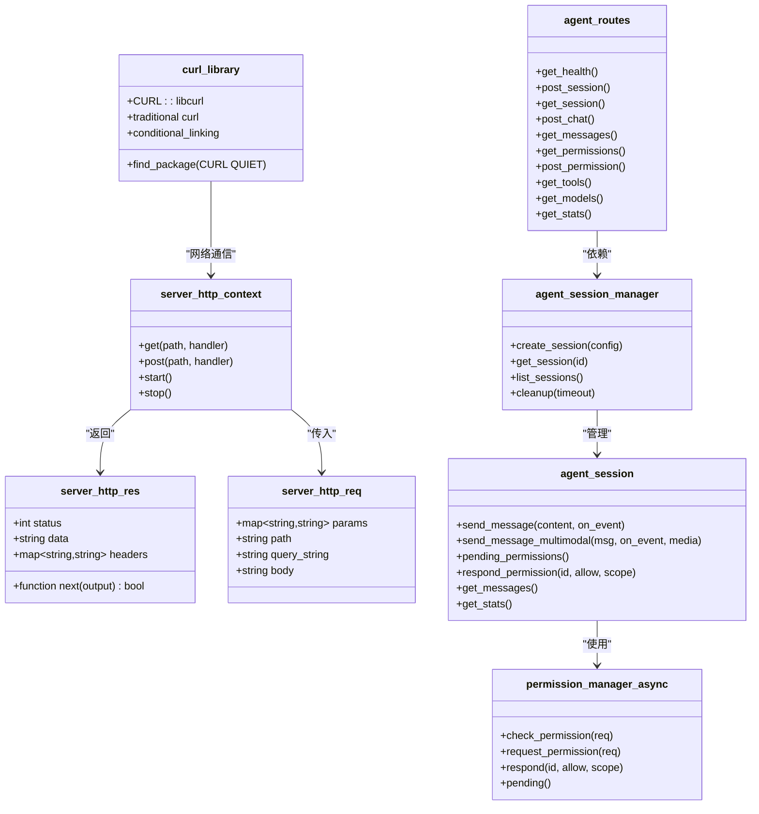

# HTTP 服务器和 API

<cite>
**本文引用的文件**
- [agent-server.cpp](file://agent/server/agent-server.cpp)
- [agent-routes.cpp](file://agent/server/agent-routes.cpp)
- [agent-routes.h](file://agent/server/agent-routes.h)
- [agent-session.cpp](file://agent/server/agent-session.cpp)
- [agent-session.h](file://agent/server/agent-session.h)
- [server-http.h](file://third_party/llama.cpp/tools/server/server-http.h)
- [http-agent.cpp](file://agent/sdk/http-agent.cpp)
- [http-agent.h](file://agent/sdk/http-agent.h)
- [sdk-types.h](file://agent/sdk/sdk-types.h)
- [permission-async.h](file://agent/permission-async.h)
- [sdk.go](file://SDKs/go/llamaagentsdk/sdk.go)
- [sdk.py](file://SDKs/python/src/llama_agent_sdk/sdk.py)
- [index.ts](file://SDKs/typescript/src/index.ts)
- [CMakeLists.txt](file://CMakeLists.txt)
- [CMakeLists.txt](file://agent/CMakeLists.txt)
- [CMakeLists.txt](file://third_party/qwen3-tts-cpp/cpp/CMakeLists.txt)
- [embedding_client.cpp](file://third_party/qwen3-tts-cpp/cpp/embedding_client.cpp)
- [embedding_client.h](file://third_party/qwen3-tts-cpp/cpp/embedding_client.h)
</cite>

## 更新摘要
**所做更改**
- 新增CMake构建系统中的curl库条件链接配置说明
- 添加跨平台兼容性改进的详细说明
- 更新依赖关系分析以反映curl库的条件链接机制
- 增强构建配置的兼容性说明

## 目录
1. [简介](#简介)
2. [项目结构](#项目结构)
3. [核心组件](#核心组件)
4. [架构总览](#架构总览)
5. [详细组件分析](#详细组件分析)
6. [依赖关系分析](#依赖关系分析)
7. [性能考量](#性能考量)
8. [故障排查指南](#故障排查指南)
9. [结论](#结论)
10. [附录](#附录)

## 简介
本文件面向 HTTP 服务器与 API 的使用者与维护者，系统性梳理了基于 C++ 实现的 HTTP 服务器、RESTful API 设计、SSE 流式传输、会话管理、权限控制、多 SDK 客户端支持（Go/Python/TypeScript）以及安全与性能实践。文档覆盖端点定义、请求/响应模式、认证方法、错误处理策略、速率限制与版本信息，并提供常见使用场景、迁移与兼容性建议。

**更新** 本版本特别关注CMake构建系统中的curl库条件链接改进，增强了跨环境兼容性和构建稳定性。

## 项目结构
- 服务器入口与路由注册：在服务器主程序中初始化 HTTP 上下文、注册 OpenAI 兼容端点与自研 /v1/agent/* 端点，并支持可选的 TTS/ASR 音频服务端点。
- 会话与事件：通过会话管理器与会话对象承载对话状态、权限请求、统计信息；聊天接口采用 SSE 流式返回事件。
- 客户端 SDK：提供 Go/Python/TypeScript 三套 SDK，统一实现 OpenAI 兼容的流式与非流式聊天完成接口，支持工具调用与权限事件。
- **构建系统**：采用CMake作为主要构建工具，支持curl库的条件链接以增强跨平台兼容性。



**图表来源**
- [agent-server.cpp](file://agent/server/agent-server.cpp)
- [agent-routes.cpp](file://agent/server/agent-routes.cpp)
- [agent-routes.h](file://agent/server/agent-routes.h)
- [agent-session.cpp](file://agent/server/agent-session.cpp)
- [agent-session.h](file://agent/server/agent-session.h)
- [server-http.h](file://third_party/llama.cpp/tools/server/server-http.h)
- [sdk.go](file://SDKs/go/llamaagentsdk/sdk.go)
- [sdk.py](file://SDKs/python/src/llama_agent_sdk/sdk.py)
- [index.ts](file://SDKs/typescript/src/index.ts)
- [CMakeLists.txt](file://CMakeLists.txt)
- [CMakeLists.txt](file://agent/CMakeLists.txt)

**章节来源**
- [agent-server.cpp](file://agent/server/agent-server.cpp)
- [server-http.h](file://third_party/llama.cpp/tools/server/server-http.h)
- [CMakeLists.txt](file://CMakeLists.txt)

## 核心组件
- HTTP 服务器上下文：封装底层 HTTP 框架，提供 get/post 注册、线程与就绪状态管理、监听地址等能力。
- 代理路由与模型路由：在"路由器"模式下将 /v1/* 请求代理到后端模型；在"工作节点"模式下提供 /v1/agent/* 会话与聊天接口。
- 会话管理器与会话：负责会话生命周期、消息历史、权限请求、统计信息与清理。
- SSE 流式响应：将内部事件转换为标准 SSE 事件流，支持文本增量、推理内容、工具开始/结果、权限请求/已决、迭代开始、完成/错误等事件类型。
- 权限异步管理：非阻塞式权限队列，支持一次性与会话级授权、外部路径检测、重复调用防护等。
- 多语言 SDK：统一实现 OpenAI 兼容的 /v1/chat/completions 接口，支持流式与非流式两种模式。
- **构建系统**：采用CMake 3.20+，支持curl库的条件链接，增强跨平台兼容性。

**章节来源**
- [server-http.h](file://third_party/llama.cpp/tools/server/server-http.h)
- [agent-routes.cpp](file://agent/server/agent-routes.cpp)
- [agent-routes.h](file://agent/server/agent-routes.h)
- [agent-session.cpp](file://agent/server/agent-session.cpp)
- [agent-session.h](file://agent/server/agent-session.h)
- [permission-async.h](file://agent/permission-async.h)
- [http-agent.cpp](file://agent/sdk/http-agent.cpp)
- [http-agent.h](file://agent/sdk/http-agent.h)
- [sdk-types.h](file://agent/sdk/sdk-types.h)
- [CMakeLists.txt](file://CMakeLists.txt)

## 架构总览
服务器启动后，先启动 HTTP 服务，再加载模型或进入路由器模式。根据是否为路由器，注册不同的端点集合。会话相关的 /v1/agent/* 端点通过 agent_routes 将请求分发至 agent_session_manager，后者驱动 agent_session 执行推理与工具调用，并通过 SSE 回传事件。

```mermaid
sequenceDiagram
participant Client as "客户端"
participant HTTP as "HTTP服务器"
participant Routes as "agent-routes"
participant Manager as "agent_session_manager"
participant Session as "agent_session"
participant Loop as "agent_loop"
Client->>HTTP : POST /v1/agent/session
HTTP->>Routes : post_session
Routes->>Manager : create_session(config)
Manager-->>Routes : session_id
Routes-->>Client : {session_id}
Client->>HTTP : POST /v1/agent/session/ : id/chat
HTTP->>Routes : post_chat
Routes->>Manager : get_session(id)
Manager-->>Routes : session*
Routes->>Session : send_message_multimodal(user_message, on_event)
Session->>Loop : run_streaming_multimodal(...)
Loop-->>Session : 事件回调(文本/推理/工具/权限/完成/错误)
Session-->>Routes : SSE事件流
Routes-->>Client : text/event-stream
```

**图表来源**
- [agent-server.cpp](file://agent/server/agent-server.cpp)
- [agent-routes.cpp](file://agent/server/agent-routes.cpp)
- [agent-session.cpp](file://agent/server/agent-session.cpp)

## 详细组件分析

### HTTP 服务器与路由
- 启动流程：初始化 server_http_context，注册健康检查、指标、模型列表、补全、聊天、嵌入、重排、分词/反分词、LoRA 适配器、插槽等 OpenAI 兼容端点；在"工作节点"模式下注册 /v1/agent/* 会话与聊天端点；在"路由器"模式下将 /v1/* 代理到后端模型。
- 异常包装：ex_wrapper 统一捕获异常并返回 JSON 错误体，优先映射为 4xx/5xx。
- SSE 支持：/v1/agent/session/:id/chat 返回 text/event-stream，按事件类型发送数据块。

**章节来源**
- [agent-server.cpp](file://agent/server/agent-server.cpp)
- [server-http.h](file://third_party/llama.cpp/tools/server/server-http.h)

### 会话管理与权限
- 会话配置：允许工具白名单、Yolo 模式、最大迭代次数、工具超时、工作目录、系统提示、技能与 AGENTS.md 开关、子代理深度等。
- 会话状态：空闲/运行/等待权限/完成/错误。
- 权限管理：支持一次性与会话级授权；对外部路径访问与重复调用进行检测；支持取消与等待响应。
- 统计信息：累计输入/输出/缓存 token 数与提示/预测耗时。

**章节来源**
- [agent-session.h](file://agent/server/agent-session.h)
- [agent-session.cpp](file://agent/server/agent-session.cpp)
- [permission-async.h](file://agent/permission-async.h)

### SSE 流式传输
- SSE 响应对象：包含队列、互斥锁、条件变量与 done 标志；next 回调按需生成数据块；finish 触发结束。
- 事件类型：text_delta、reasoning_delta、tool_start、tool_result、permission_required、permission_resolved、iteration_start、completed、error。
- 生命周期：通过共享指针确保响应对象在 HTTP 框架与工作线程均存活。

**章节来源**
- [agent-routes.cpp](file://agent/server/agent-routes.cpp)
- [agent-routes.h](file://agent/server/agent-routes.h)

### OpenAI 兼容聊天完成（SDK 与服务器）
- 服务器端：/v1/chat/completions 支持流式与非流式；支持 include_usage；解析工具调用增量并合并。
- 客户端 SDK：Go/Python/TypeScript 三套 SDK 均实现相同行为：构造消息数组、发送 POST、解析 choices/delta、累积 content/reasoning/tool_calls、可选 usage。
- 认证：支持 Authorization: Bearer <api_key>。

**章节来源**
- [agent-server.cpp](file://agent/server/agent-server.cpp)
- [http-agent.cpp](file://agent/sdk/http-agent.cpp)
- [http-agent.h](file://agent/sdk/http-agent.h)
- [sdk-types.h](file://agent/sdk/sdk-types.h)
- [sdk.go](file://SDKs/go/llamaagentsdk/sdk.go)
- [sdk.py](file://SDKs/python/src/llama_agent_sdk/sdk.py)
- [index.ts](file://SDKs/typescript/src/index.ts)

### 端点清单与规范

- 健康检查
  - 方法与路径：GET /health, GET /v1/health
  - 响应：{"status":"ok"} 或 {"status":"ok","version":"..."}
  - 认证：无需
  - 用途：服务可用性探测

- 指标与属性
  - GET /metrics：指标导出
  - GET /props, POST /props：属性查询/更新

- 模型与槽位
  - GET /models, GET /v1/models, GET /api/tags：列出可用模型
  - GET /lora-adapters, POST /lora-adapters：LoRA 管理
  - GET /slots, POST /slots, POST /slots/:id_slot：资源槽位管理

- 补全与聊天
  - POST /completion, POST /completions, POST /v1/completions：通用补全
  - POST /chat/completions, POST /v1/chat/completions, POST /api/chat：聊天完成
  - POST /v1/responses, POST /v1/messages, POST /v1/messages/count_tokens：Anthropic 兼容
  - POST /infill, POST /embedding, POST /embeddings, POST /v1/embeddings：填充与嵌入
  - POST /rerank, POST /reranking, POST /rerank：重排
  - POST /tokenize, POST /detokenize, POST /apply-template：分词/反分词/模板应用

- 会话与聊天（工作节点）
  - POST /v1/agent/session：创建会话
  - GET /v1/agent/session/:id：获取会话信息
  - GET /v1/agent/sessions：列出会话
  - POST /v1/agent/session/:id/chat：发送消息（SSE 流）
  - GET /v1/agent/session/:id/messages：获取历史
  - GET /v1/agent/session/:id/permissions：获取待处理权限
  - POST /v1/agent/permission/:id：响应权限请求
  - GET /v1/agent/tools：列出可用工具
  - GET /v1/models：当前模型信息
  - GET /v1/agent/session/:id/stats：会话统计

- 会话与聊天（路由器）
  - GET/POST /v1/agent/*：需要 ?model=MODEL_ID 或请求体包含 "model" 字段
  - GET /models, POST /models/load, POST /models/unload：模型装载/卸载

- 音频服务（可选）
  - POST /v1/audio/speech：TTS 语音合成（占位实现）
  - POST /v1/audio/transcriptions：ASR 语音转写（占位实现）

- 认证
  - Authorization: Bearer <api_key>（SDK 默认添加）
  - 可通过环境变量或参数启用/禁用音频服务

- 版本与兼容
  - /v1/* 与 OpenAI 兼容
  - /v1/agent/* 为自研扩展

**章节来源**
- [agent-server.cpp](file://agent/server/agent-server.cpp)
- [agent-routes.cpp](file://agent/server/agent-routes.cpp)

### 请求/响应模式与事件流
- 非流式：服务器返回完整 JSON，包含 choices[0].message 与可选 usage。
- 流式：服务器返回 text/event-stream，事件类型包括 text_delta、reasoning_delta、tool_start、tool_result、permission_required、permission_resolved、iteration_start、completed、error。
- 客户端 SDK：解析 data: 行，合并 content/reasoning/tool_calls，累积 usage。

**章节来源**
- [agent-routes.cpp](file://agent/server/agent-routes.cpp)
- [http-agent.cpp](file://agent/sdk/http-agent.cpp)
- [sdk.go](file://SDKs/go/llamaagentsdk/sdk.go)
- [sdk.py](file://SDKs/python/src/llama_agent_sdk/sdk.py)
- [index.ts](file://SDKs/typescript/src/index.ts)

### 错误处理策略
- 服务器端：统一异常包装，映射 invalid_argument 为 4xx，其他异常为 5xx；错误体包含 code 与 error 字段。
- 客户端 SDK：检查 HTTP 状态码，解析错误体；TypeScript SDK 在 fetch 失败时收集底层错误细节。
- 权限相关：当权限未满足或被拒绝时，服务器通过 SSE 发送 permission_required/permission_resolved 事件，客户端据此决定后续行为。

**章节来源**
- [agent-server.cpp](file://agent/server/agent-server.cpp)
- [http-agent.cpp](file://agent/sdk/http-agent.cpp)
- [index.ts](file://SDKs/typescript/src/index.ts)

### 安全考虑
- 认证：建议始终使用 Bearer Token；生产环境建议启用 TLS。
- 权限：默认阻断外部路径访问与重复调用；可通过 Yolo 模式跳过提示但不推荐。
- 工具白名单：仅允许授权工具执行。
- 输入校验：对 JSON 与必填字段进行严格校验，缺失或格式错误返回 4xx。

**章节来源**
- [permission-async.h](file://agent/permission-async.h)
- [agent-session.cpp](file://agent/server/agent-session.cpp)
- [http-agent.cpp](file://agent/sdk/http-agent.cpp)

### 速率限制与并发
- 当前实现未内置全局速率限制；可通过网关/反向代理层实现。
- 并发：每个会话独立线程处理；SSE 使用队列与互斥保证线程安全。
- 超时：请求/工具/权限超时可配置；建议根据负载调整。

**章节来源**
- [agent-session.h](file://agent/server/agent-session.h)
- [http-agent.h](file://agent/sdk/http-agent.h)

### 常见使用场景
- 单轮问答：POST /v1/chat/completions（stream=false）
- 流式对话：POST /v1/chat/completions（stream=true），客户端逐行解析 data: 块
- 会话式聊天：先 POST /v1/agent/session 创建会话，再 POST /v1/agent/session/:id/chat 发送消息
- 工具调用：助手返回 tool_calls，客户端执行工具并回传结果
- 权限交互：当出现 permission_required 事件时，客户端向 /v1/agent/permission/:id 提交响应

**章节来源**
- [agent-routes.cpp](file://agent/server/agent-routes.cpp)
- [http-agent.cpp](file://agent/sdk/http-agent.cpp)

### 客户端实现指南
- Go：使用 NewHttpAgentSession，ChatCompletions/ChatCompletionsStream 分别对应非流式与流式；自动设置 Authorization 头。
- Python：HttpAgentSession.chat_completions_stream 支持增量回调；自动处理 SSE 数据行。
- TypeScript：HttpAgentSession.chatCompletionsStream 返回累积后的 content/reasoning/toolCallsByIndex/usage。

**章节来源**
- [sdk.go](file://SDKs/go/llamaagentsdk/sdk.go)
- [sdk.py](file://SDKs/python/src/llama_agent_sdk/sdk.py)
- [index.ts](file://SDKs/typescript/src/index.ts)

### 性能优化技巧
- 合理设置 max_iterations 与工具超时，避免长时间阻塞。
- 使用流式接口降低首字延迟，提升用户体验。
- 控制消息历史长度，定期清理旧会话。
- 在路由器模式下按需装载/卸载模型，减少内存占用。

**章节来源**
- [agent-session.h](file://agent/server/agent-session.h)
- [agent-session.cpp](file://agent/server/agent-session.cpp)

### 协议调试与监控
- 健康检查：GET /health 或 /v1/health
- 指标：GET /metrics
- 日志：服务器启动日志包含已注册端点与音频服务状态
- 监控：结合 /v1/agent/session/:id/stats 获取 token 用量与耗时

**章节来源**
- [agent-server.cpp](file://agent/server/agent-server.cpp)

### API 迁移指南与向后兼容
- 从 /v1/* 到 /v1/agent/*：会话相关能力迁移至 /v1/agent/*，保持 /v1/* 与 OpenAI 兼容不变。
- 权限模型：新增 permission_required/permission_resolved 事件，旧版客户端可忽略。
- 工具调用：保持 OpenAI 格式，客户端需累积 tool_calls 并回传结果。
- 版本标识：/v1/* 为稳定兼容层；/v1/agent/* 为扩展层，未来可能引入变更但会尽量保持向后兼容。

**章节来源**
- [agent-server.cpp](file://agent/server/agent-server.cpp)
- [agent-routes.cpp](file://agent/server/agent-routes.cpp)

### 构建系统与依赖管理

**更新** 本节新增CMake构建系统中curl库条件链接的详细说明。

- **CMake版本要求**：最低要求 CMake 3.20，确保支持现代C++特性和包管理功能。
- **curl库条件链接**：
  - 使用 `find_package(CURL QUIET)` 进行检测，避免构建失败
  - 优先使用现代目标 `CURL::libcurl`（CMake 3.17+）
  - 降级使用传统 `curl` 库目标以保持向后兼容
  - 条件链接确保在不同平台和CMake版本间的稳定性
- **构建配置**：
  - 支持CUDA后端的条件编译
  - 自动检测WSL和Apple平台的特殊配置
  - 可选的llama.cpp源码目录覆盖机制
- **第三方库集成**：
  - cpp-httplib内置于llama.cpp项目中
  - qwen3-tTS组件使用独立的curl库配置
  - 统一的线程库和网络库链接策略

**章节来源**
- [CMakeLists.txt](file://CMakeLists.txt)
- [CMakeLists.txt](file://agent/CMakeLists.txt)
- [CMakeLists.txt](file://third_party/qwen3-tts-cpp/cpp/CMakeLists.txt)

## 依赖关系分析



**图表来源**
- [server-http.h](file://third_party/llama.cpp/tools/server/server-http.h)
- [agent-routes.h](file://agent/server/agent-routes.h)
- [agent-session.h](file://agent/server/agent-session.h)
- [permission-async.h](file://agent/permission-async.h)
- [CMakeLists.txt](file://agent/CMakeLists.txt)

**章节来源**
- [server-http.h](file://third_party/llama.cpp/tools/server/server-http.h)
- [agent-routes.h](file://agent/server/agent-routes.h)
- [agent-session.h](file://agent/server/agent-session.h)
- [permission-async.h](file://agent/permission-async.h)
- [CMakeLists.txt](file://agent/CMakeLists.txt)

## 性能考量
- 流式传输优先：在长文本生成场景显著改善首字延迟。
- 会话复用：通过 /v1/agent/session 与消息历史减少重复提示成本。
- 工具调用异步化：避免阻塞主线程，结合权限回调实现非阻塞交互。
- 资源清理：定期清理空闲会话，避免内存泄漏。
- **构建优化**：条件链接减少不必要的依赖，提高构建效率和跨平台兼容性。

## 故障排查指南
- 404 缺少会话 ID：确认 /v1/agent/session/:id/chat 中的 :id 是否正确传递。
- 400 JSON 解析失败：检查请求体是否为合法 JSON，字段是否齐全。
- 503 音频服务不可用：确认 TTS/ASR 模型路径与加载状态。
- 权限阻断：收到 permission_required 事件后，及时提交 /v1/agent/permission/:id 响应。
- 超时问题：适当增大 request_timeout_ms、tool_timeout_ms、permission_timeout_ms。
- **构建问题**：curl库找不到时，检查系统curl开发包安装和CMake版本兼容性。

**章节来源**
- [agent-server.cpp](file://agent/server/agent-server.cpp)
- [agent-routes.cpp](file://agent/server/agent-routes.cpp)
- [http-agent.cpp](file://agent/sdk/http-agent.cpp)
- [CMakeLists.txt](file://agent/CMakeLists.txt)

## 结论
该 HTTP 服务器与 API 以 OpenAI 兼容为核心，同时提供强大的会话管理、SSE 流式传输与细粒度权限控制。通过多语言 SDK，开发者可以快速集成流式对话、工具调用与权限交互。建议在生产环境中启用认证、TLS 与限流，并结合指标监控持续优化性能与稳定性。

**更新** 新的CMake构建系统通过curl库的条件链接机制，显著提升了跨平台兼容性和构建稳定性，为不同环境提供了更好的支持。

## 附录

### API 调用示例（路径与要点）
- 创建会话：POST /v1/agent/session（请求体可包含 tools、working_dir、enable_skills、skill_paths、enable_agents_md、max_subagent_depth 等）
- 发送消息（流式）：POST /v1/agent/session/:id/chat（请求体包含 content；SSE 返回 text_delta/reasoning_delta/tool_* 等事件）
- 获取权限：GET /v1/agent/session/:id/permissions（返回 permission_required 事件详情）
- 回答权限：POST /v1/agent/permission/:id（请求体 {allow: true/false, scope: "once"|"session"}）
- 聊天完成（OpenAI 兼容）：POST /v1/chat/completions（stream: true/false）

**章节来源**
- [agent-routes.cpp](file://agent/server/agent-routes.cpp)
- [agent-server.cpp](file://agent/server/agent-server.cpp)
- [http-agent.cpp](file://agent/sdk/http-agent.cpp)

### 构建配置参考

**更新** 新增curl库条件链接的具体配置示例。

- **基础构建**：
  ```cmake
  find_package(CURL QUIET)
  if(CURL_FOUND)
      target_link_libraries(target PRIVATE CURL::libcurl)
  else()
      target_link_libraries(target PRIVATE curl)
  endif()
  ```
- **CMake版本要求**：CMake 3.20+
- **平台支持**：Windows、Linux、macOS
- **依赖检测**：自动检测curl库可用性
- **兼容性**：支持现代CURL::libcurl和传统curl目标

**章节来源**
- [CMakeLists.txt](file://agent/CMakeLists.txt)
- [CMakeLists.txt](file://third_party/qwen3-tts-cpp/cpp/CMakeLists.txt)