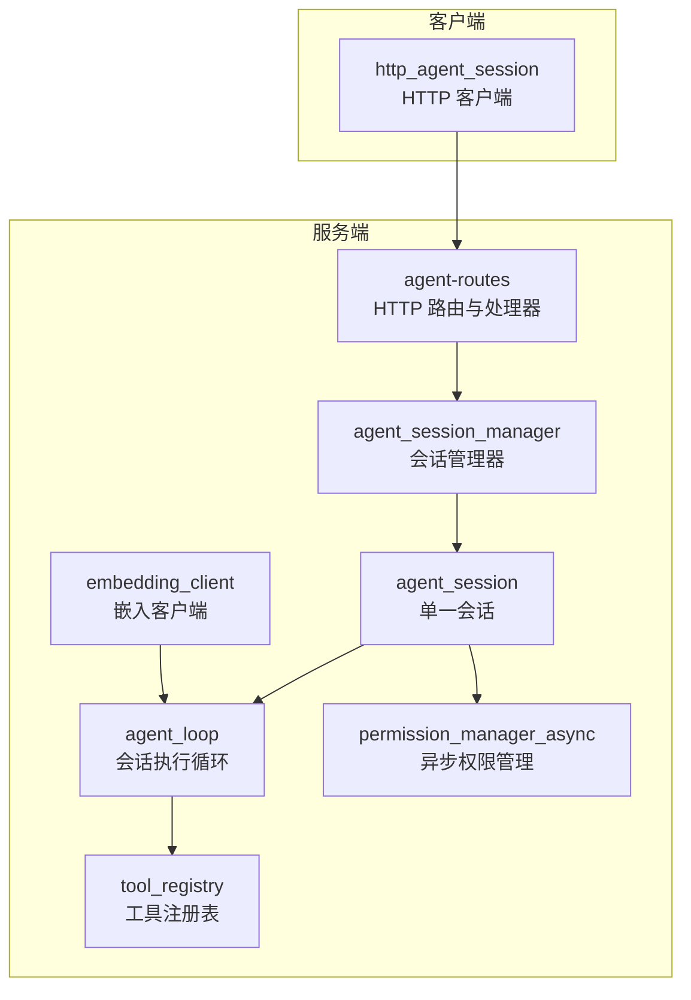
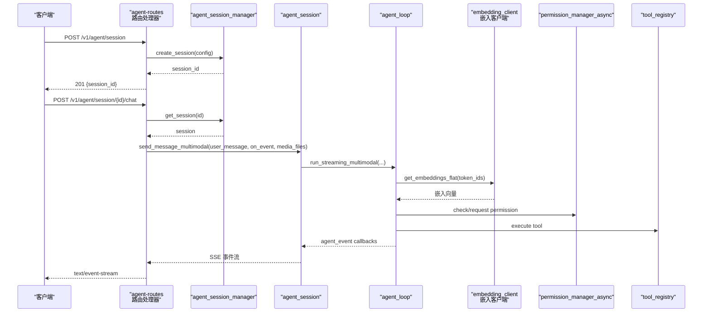
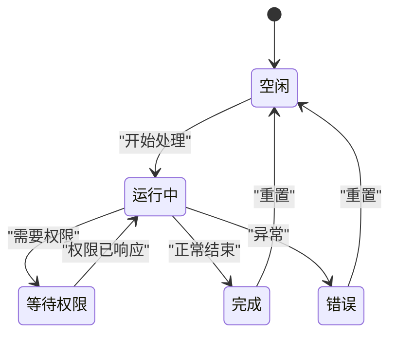
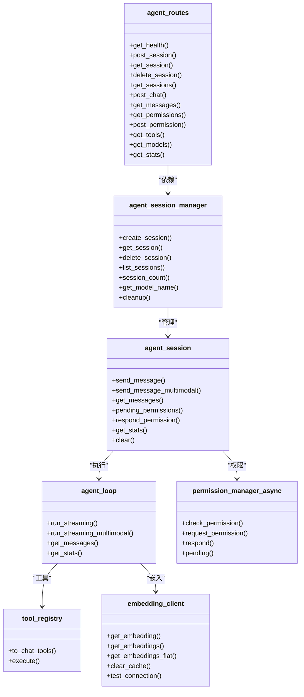

# 代理会话管理

<cite>
**本文引用的文件**
- [agent-routes.h](file://agent/server/agent-routes.h)
- [agent-routes.cpp](file://agent/server/agent-routes.cpp)
- [agent-session.h](file://agent/server/agent-session.h)
- [agent-session.cpp](file://agent/server/agent-session.cpp)
- [agent-loop.h](file://agent/agent-loop.h)
- [permission-async.h](file://agent/permission-async.h)
- [permission-async.cpp](file://agent/permission-async.cpp)
- [tool-registry.h](file://agent/tool-registry.h)
- [tool-registry.cpp](file://agent/tool-registry.cpp)
- [http-agent.h](file://agent/sdk/http-agent.h)
- [sdk-cli.cpp](file://agent/sdk/sdk-cli.cpp)
- [embedding_client.h](file://third_party/qwen3-tts-cpp/cpp/embedding_client.h)
- [embedding_client.cpp](file://third_party/qwen3-tts-cpp/cpp/embedding_client.cpp)
- [qwen3_talker_llm.cpp](file://third_party/qwen3-tts-cpp/cpp/qwen3_talker_llm.cpp)
- [CMakeLists.txt](file://agent/CMakeLists.txt)
</cite>

## 更新摘要
**变更内容**
- 新增嵌入客户端功能模块，增强 TTS/ASR 多模态处理能力
- 更新构建系统以包含 embedding_client.cpp 和相关 TTS 组件
- 扩展代理系统对远程嵌入服务的支持
- 增强多模态消息处理和媒体文件支持

## 目录
1. [简介](#简介)
2. [项目结构](#项目结构)
3. [核心组件](#核心组件)
4. [架构总览](#架构总览)
5. [详细组件分析](#详细组件分析)
6. [嵌入客户端功能](#嵌入客户端功能)
7. [依赖关系分析](#依赖关系分析)
8. [性能考量](#性能考量)
9. [故障排查指南](#故障排查指南)
10. [结论](#结论)
11. [附录](#附录)

## 简介
本文件为代理会话管理 API 的全面技术文档，覆盖会话生命周期、消息存储与检索、权限控制、统计信息采集以及多模态消息处理能力。重点围绕以下端点进行规范说明：
- 创建会话：POST /v1/agent/session
- 获取会话：GET /v1/agent/session/{id}
- 删除会话：DELETE /v1/agent/session/{id}
- 列出会话：GET /v1/agent/sessions
- 发送消息（流式）：POST /v1/agent/session/{id}/chat
- 获取消息历史：GET /v1/agent/session/{id}/messages
- 权限请求查询：GET /v1/agent/session/{id}/permissions
- 权限响应提交：POST /v1/agent/permission/{id}
- 工具列表：GET /v1/agent/tools
- 模型列表：GET /v1/models
- 会话统计：GET /v1/agent/session/{id}/stats

**新增功能**：嵌入客户端支持远程嵌入服务，用于 TTS/ASR 多模态处理，增强代理系统的多媒体能力。

同时提供会话状态管理最佳实践与常见使用场景的参考路径。

## 项目结构
该模块位于 agent/server 子目录中，核心由路由层、会话管理层、会话执行引擎与权限管理器构成，并通过 SDK 对外提供 HTTP 客户端能力。新增的嵌入客户端功能通过 CMakeLists.txt 集成到构建系统中。



**更新**：新增嵌入客户端模块，支持远程嵌入服务调用和缓存机制。

图表来源
- [agent-routes.cpp:475-494](file://agent/server/agent-routes.cpp#L475-L494)
- [agent-session.h:148-185](file://agent/server/agent-session.h#L148-L185)
- [agent-session.cpp:258-347](file://agent/server/agent-session.cpp#L258-L347)
- [agent-loop.h:167-276](file://agent/agent-loop.h#L167-L276)
- [permission-async.h:43-142](file://agent/permission-async.h#L43-L142)
- [tool-registry.h:58-103](file://agent/tool-registry.h#L58-L103)
- [http-agent.h:56-121](file://agent/sdk/http-agent.h#L56-L121)
- [embedding_client.h:11-16](file://third_party/qwen3-tts-cpp/cpp/embedding_client.h#L11-L16)

章节来源
- [agent-routes.h:14-68](file://agent/server/agent-routes.h#L14-L68)
- [agent-routes.cpp:475-494](file://agent/server/agent-routes.cpp#L475-L494)
- [CMakeLists.txt:80-81](file://agent/CMakeLists.txt#L80-L81)

## 核心组件
- 路由与处理器（agent-routes）
  - 提供 /v1/agent/* 全量端点映射与错误/JSON/SSE 响应封装。
  - 支持健康检查、会话 CRUD、聊天流式输出、消息历史、权限查询与响应、工具与模型列表、会话统计。
- 会话管理器（agent_session_manager）
  - 负责会话创建、查找、删除、列举、清理空闲会话。
  - 生成会话 ID，维护会话集合。
- 单一会话（agent_session）
  - 封装一次会话的状态、消息历史、统计信息、权限请求与结果。
  - 支持文本与多模态消息处理，后台线程执行，事件回调驱动流式输出。
- 执行循环（agent_loop）
  - 实际运行推理、工具调用、权限等待与迭代控制。
  - 提供同步与流式两种执行模式，支持子代理与多模态媒体注入。
- 异步权限管理（permission_manager_async）
  - 非阻塞权限队列，支持一次性与会话级授权范围。
  - 提供权限请求、响应、待处理查询与超时等待。
- 工具注册表（tool_registry）
  - 统一注册与分发工具定义，转换为对话可用的工具描述。
- HTTP 客户端 SDK（http_agent_session）
  - 提供本地 SDK 访问服务端 API 的能力，支持流式事件与权限响应。
- **嵌入客户端（embedding_client）**
  - **远程嵌入服务客户端，支持 OpenAI 兼容的 /v1/embeddings API。**
  - **提供缓存机制，避免重复的 HTTP 调用。**
  - **支持批量嵌入获取和扁平化向量输出。**

**更新**：新增嵌入客户端组件，用于 TTS/ASR 多模态处理中的嵌入向量获取。

章节来源
- [agent-routes.h:14-68](file://agent/server/agent-routes.h#L14-L68)
- [agent-routes.cpp:104-472](file://agent/server/agent-routes.cpp#L104-L472)
- [agent-session.h:65-185](file://agent/server/agent-session.h#L65-L185)
- [agent-session.cpp:36-347](file://agent/server/agent-session.cpp#L36-L347)
- [agent-loop.h:167-276](file://agent/agent-loop.h#L167-L276)
- [permission-async.h:43-142](file://agent/permission-async.h#L43-L142)
- [tool-registry.h:58-103](file://agent/tool-registry.h#L58-L103)
- [http-agent.h:56-121](file://agent/sdk/http-agent.h#L56-L121)
- [embedding_client.h:17-56](file://third_party/qwen3-tts-cpp/cpp/embedding_client.h#L17-L56)

## 架构总览
下图展示从 HTTP 请求到会话执行与事件流式的整体流程，包括新增的嵌入客户端处理：



**更新**：新增嵌入客户端在多模态消息处理中的调用流程，用于 TTS/ASR 功能的嵌入向量获取。

图表来源
- [agent-routes.cpp:111-424](file://agent/server/agent-routes.cpp#L111-L424)
- [agent-session.cpp:103-211](file://agent/server/agent-session.cpp#L103-L211)
- [agent-loop.h:198-211](file://agent/agent-loop.h#L198-L211)
- [permission-async.h:124-144](file://agent/permission-async.h#L124-L144)
- [tool-registry.cpp:31-50](file://agent/tool-registry.cpp#L31-L50)
- [embedding_client.cpp:196-211](file://third_party/qwen3-tts-cpp/cpp/embedding_client.cpp#L196-L211)

## 详细组件分析

### 会话生命周期管理
- 创建会话
  - 方法与路径：POST /v1/agent/session
  - 请求体可选字段：tools（允许的工具名数组）、yolo（跳过权限提示）、working_dir（工作目录）、enable_skills、skill_paths、enable_agents_md、max_subagent_depth（0-5）。
  - 返回：201 Created，包含 session_id。
- 获取会话
  - 方法与路径：GET /v1/agent/session/{id}
  - 返回：session_id、state、message_count、stats（输入/输出/缓存 token 数）。
- 列出会话
  - 方法与路径：GET /v1/agent/sessions
  - 返回：所有会话的简要信息数组。
- 删除会话
  - 方法与路径：DELETE /v1/agent/session/{id}
  - 返回：200 成功或 404 未找到。
- 清理空闲会话
  - 管理器提供清理方法，按空闲时间阈值移除处于空闲状态的会话。

章节来源
- [agent-routes.cpp:111-198](file://agent/server/agent-routes.cpp#L111-L198)
- [agent-session.cpp:275-314](file://agent/server/agent-session.cpp#L275-L314)

### 聊天与消息历史
- 发送消息（流式）
  - 方法与路径：POST /v1/agent/session/{id}/chat
  - 支持内容类型：
    - 纯文本：content 为字符串。
    - 多模态：content 为数组，元素类型包括 text、image_url（支持 dataURL base64）、input_audio（base64）。
  - 流式事件类型（SSE 事件名）：text_delta、reasoning_delta、tool_start、tool_result、permission_required、permission_resolved、iteration_start、completed、error。
  - 媒体文件：当出现 image_url 或 input_audio 时，解析 base64 并注入到多模态处理链路。
  - **嵌入处理**：在 TTS/ASR 场景中，系统会调用嵌入客户端获取 token 的嵌入向量，用于音频合成。
- 获取消息历史
  - 方法与路径：GET /v1/agent/session/{id}/messages
  - 返回：messages 数组（由 agent_loop 维护）。
- 会话统计
  - 方法与路径：GET /v1/agent/session/{id}/stats
  - 返回：input_tokens、output_tokens、cached_tokens、prompt_ms、predicted_ms。

**更新**：增强多模态消息处理，新增嵌入客户端在 TTS/ASR 场景中的嵌入向量获取功能。

章节来源
- [agent-routes.cpp:199-362](file://agent/server/agent-routes.cpp#L199-L362)
- [agent-session.cpp:158-211](file://agent/server/agent-session.cpp#L158-L211)
- [agent-loop.h:83-162](file://agent/agent-loop.h#L83-L162)
- [embedding_client.cpp:196-211](file://third_party/qwen3-tts-cpp/cpp/embedding_client.cpp#L196-L211)

### 权限控制
- 查询待处理权限
  - 方法与路径：GET /v1/agent/session/{id}/permissions
  - 返回：每个权限请求的 request_id、tool 名称、details、dangerous 标记。
- 提交权限响应
  - 方法与路径：POST /v1/agent/permission/{id}
  - 请求体必须包含 allow（布尔），可选 scope（"once" 或 "session"）。
  - 返回：200 {status: "success"} 或 404 未找到。
- 会话内权限响应
  - 在会话内部，当状态为 WAITING_PERMISSION 且成功响应后，状态切换回 RUNNING。

章节来源
- [agent-routes.cpp:364-424](file://agent/server/agent-routes.cpp#L364-L424)
- [agent-session.cpp:220-231](file://agent/server/agent-session.cpp#L220-L231)
- [permission-async.h:21-33](file://agent/permission-async.h#L21-L33)

### 工具与模型
- 工具列表
  - 方法与路径：GET /v1/agent/tools
  - 返回：每个工具的 name、description、parameters（JSON Schema 字符串）。
- 模型列表
  - 方法与路径：GET /v1/models
  - 返回：OpenAI 兼容格式的模型对象列表（当前返回一个模型条目）。

章节来源
- [agent-routes.cpp:425-450](file://agent/server/agent-routes.cpp#L425-L450)
- [tool-registry.cpp:31-48](file://agent/tool-registry.cpp#L31-L48)

### 数据结构与状态机
- 会话状态
  - IDLE、RUNNING、WAITING_PERMISSION、COMPLETED、ERROR。
- 事件类型
  - TEXT_DELTA、REASONING_DELTA、TOOL_START、TOOL_RESULT、PERMISSION_REQUIRED、PERMISSION_RESOLVED、ITERATION_START、COMPLETED、ERROR。
- 统计信息
  - total_input、total_output、total_cached、total_prompt_ms、total_predicted_ms；以及子代理相关统计。



图表来源
- [agent-session.h:46-52](file://agent/server/agent-session.h#L46-L52)
- [agent-loop.h:31-36](file://agent/agent-loop.h#L31-L36)

## 嵌入客户端功能

### 功能概述
嵌入客户端是新增的核心功能模块，专门用于处理远程嵌入服务调用，支持 TTS（文本转语音）和 ASR（自动语音识别）功能中的嵌入向量获取。

### 主要特性
- **远程服务调用**：支持 OpenAI 兼容的 `/v1/embeddings` API
- **缓存机制**：内置内存缓存，避免重复的 HTTP 请求
- **批量处理**：支持批量获取多个 token 的嵌入向量
- **扁平化输出**：提供适合张量操作的扁平化向量格式
- **错误处理**：完善的错误报告和诊断信息

### 接口定义
```cpp
class EmbeddingClient {
public:
    struct Config {
        std::string base_url = "http://127.0.0.1:8112";  // 嵌入服务基础 URL
        std::string model = "multilingual-e5-large-instruct-f16.gguf";  // 模型名称
        int embedding_dim = 1024;  // 嵌入维度
        int timeout_ms = 5000;  // 超时时间（毫秒）
        bool use_cache = true;  // 是否启用缓存
        int max_cache_size = 100000;  // 最大缓存大小
    };

    // 获取单个 token 的嵌入向量
    bool get_embedding(int32_t token_id, std::vector<float>& embedding);
    
    // 批量获取嵌入向量
    bool get_embeddings(const std::vector<int32_t>& token_ids, 
                       std::vector<std::vector<float>>& embeddings);
    
    // 获取扁平化的嵌入向量（适合张量操作）
    bool get_embeddings_flat(const std::vector<int32_t>& token_ids,
                            std::vector<float>& flat_embeddings);
    
    // 清空缓存
    void clear_cache();
    
    // 测试连接
    bool test_connection();
};
```

### 集成方式
嵌入客户端通过 CMakeLists.txt 集成到代理服务器构建系统中，使用 libcurl 进行 HTTP 通信，并与 Qwen3 TTS 系统紧密协作。

**章节来源**
- [embedding_client.h:17-85](file://third_party/qwen3-tts-cpp/cpp/embedding_client.h#L17-L85)
- [embedding_client.cpp:61-224](file://third_party/qwen3-tts-cpp/cpp/embedding_client.cpp#L61-L224)
- [CMakeLists.txt:80-81](file://agent/CMakeLists.txt#L80-L81)

## 依赖关系分析
- 路由层依赖会话管理器以完成会话 CRUD 与查询。
- 会话层依赖执行循环与异步权限管理器以实现流式事件与工具调用。
- 执行循环依赖工具注册表以解析与执行工具。
- **嵌入客户端依赖 libcurl 进行 HTTP 通信，与 Qwen3 TTS 系统集成。**
- SDK 层通过 HTTP 访问服务端 API，复用相同的事件与权限语义。



**更新**：新增嵌入客户端类及其依赖关系，扩展代理系统的多模态处理能力。

图表来源
- [agent-routes.h:14-68](file://agent/server/agent-routes.h#L14-L68)
- [agent-session.h:148-185](file://agent/server/agent-session.h#L148-L185)
- [agent-session.cpp:258-347](file://agent/server/agent-session.cpp#L258-L347)
- [agent-loop.h:167-276](file://agent/agent-loop.h#L167-L276)
- [permission-async.h:43-142](file://agent/permission-async.h#L43-L142)
- [tool-registry.h:58-103](file://agent/tool-registry.h#L58-L103)
- [embedding_client.h:17-56](file://third_party/qwen3-tts-cpp/cpp/embedding_client.h#L17-L56)

## 性能考量
- 流式输出采用 SSE，避免长连接阻塞，事件粒度细，便于前端实时渲染。
- 后台线程执行会话任务，主线程仅负责事件投递，降低延迟。
- 统计信息包含 prompt 与预测耗时，可用于性能监控与优化。
- 空闲会话清理策略可配置，建议结合业务负载设置合理的超时阈值。
- **嵌入客户端缓存机制**：通过内存缓存减少远程服务调用次数，提高响应速度。
- **批量处理优化**：支持批量获取嵌入向量，减少网络往返开销。
- **HTTP 超时配置**：可配置的超时时间和连接参数，适应不同网络环境。

**更新**：新增嵌入客户端相关的性能优化考虑，包括缓存机制和批量处理优化。

## 故障排查指南
- 400 错误
  - 缺少必要字段（如 content、allow）或 JSON 解析失败。
  - 多模态 content 类型不合法。
- 404 错误
  - 会话不存在或权限请求未找到。
- 权限相关
  - 若出现 WAITING_PERMISSION 状态，请确认已调用权限响应接口并正确设置 scope。
- 媒体文件
  - base64 解码失败会导致 400，检查 dataURL 格式与编码是否正确。
- **嵌入客户端相关**
  - **HTTP 连接失败**：检查嵌入服务 URL 和网络连通性。
  - **缓存问题**：使用 clear_cache() 清空缓存，重新获取嵌入向量。
  - **维度不匹配**：确认嵌入维度配置与远程服务一致。
  - **批量处理错误**：检查 token ID 数组的有效性和数量限制。

**更新**：新增嵌入客户端相关的故障排查指导。

章节来源
- [agent-routes.cpp:199-298](file://agent/server/agent-routes.cpp#L199-L298)
- [agent-routes.cpp:387-424](file://agent/server/agent-routes.cpp#L387-L424)
- [embedding_client.cpp:100-106](file://third_party/qwen3-tts-cpp/cpp/embedding_client.cpp#L100-L106)
- [embedding_client.cpp:162-168](file://third_party/qwen3-tts-cpp/cpp/embedding_client.cpp#L162-L168)

## 结论
本 API 以清晰的端点设计与事件驱动的流式输出为核心，覆盖了会话全生命周期管理、多模态消息处理、细粒度权限控制与统计信息采集。**新增的嵌入客户端功能进一步增强了代理系统的多媒体处理能力，特别是 TTS/ASR 场景中的嵌入向量获取和缓存机制。**配合 SDK 可快速构建本地代理应用，满足开发、测试与生产环境的多样化需求。

## 附录

### 接口规范摘要

- 创建会话
  - 方法：POST
  - 路径：/v1/agent/session
  - 请求体字段：tools、yolo、working_dir、enable_skills、skill_paths、enable_agents_md、max_subagent_depth
  - 响应：201 {session_id}
- 获取会话
  - 方法：GET
  - 路径：/v1/agent/session/{id}
  - 响应：{session_id, state, message_count, stats}
- 删除会话
  - 方法：DELETE
  - 路径：/v1/agent/session/{id}
  - 响应：200 或 404
- 列出会话
  - 方法：GET
  - 路径：/v1/agent/sessions
  - 响应：{sessions: [{session_id, state, message_count}]}
- 发送消息（流式）
  - 方法：POST
  - 路径：/v1/agent/session/{id}/chat
  - 请求体：{content: string | array}
  - 响应：text/event-stream（事件类型见"聊天与消息历史"）
- 获取消息历史
  - 方法：GET
  - 路径：/v1/agent/session/{id}/messages
  - 响应：{messages}
- 查询权限
  - 方法：GET
  - 路径：/v1/agent/session/{id}/permissions
  - 响应：{permissions: [{request_id, tool, details, dangerous}]}
- 提交权限响应
  - 方法：POST
  - 路径：/v1/agent/permission/{id}
  - 请求体：{allow: boolean, scope: "once"|"session"}
  - 响应：200 {status: "success"} 或 404
- 工具列表
  - 方法：GET
  - 路径：/v1/agent/tools
  - 响应：{tools: [{name, description, parameters}]}
- 模型列表
  - 方法：GET
  - 路径：/v1/models
  - 响应：OpenAI 兼容模型对象列表
- 会话统计
  - 方法：GET
  - 路径：/v1/agent/session/{id}/stats
  - 响应：{input_tokens, output_tokens, cached_tokens, prompt_ms, predicted_ms}

**更新**：接口规范保持不变，但新增了嵌入客户端相关的功能说明。

章节来源
- [agent-routes.cpp:111-472](file://agent/server/agent-routes.cpp#L111-L472)

### 最佳实践与常见场景

- 会话状态管理
  - 使用 GET /v1/agent/session/{id} 获取当前状态，避免重复提交。
  - 在 WAITING_PERMISSION 期间，及时调用权限响应接口，防止长时间阻塞。
- 流式聊天
  - 建议前端监听 text_delta 与 reasoning_delta，实时更新 UI。
  - 出现 permission_required 时，弹窗提示用户选择 once/session/deny。
- 多模态消息
  - 图像与音频请使用 dataURL base64，确保逗号分隔后的数据有效。
  - 合理设置 working_dir 与工具白名单，提升安全性。
- 统计与监控
  - 定期拉取 /v1/agent/session/{id}/stats，关注 prompt_ms/predicted_ms 与 token 使用趋势。
- SDK 使用
  - 参考 SDK 示例，使用 http_agent_session.run_streaming/on_event 处理事件与权限请求。
- **嵌入客户端使用**
  - **合理配置缓存参数，平衡内存使用和网络请求频率。**
  - **监控嵌入服务的可用性和响应时间，设置合适的超时参数。**
  - **在 TTS/ASR 场景中，确保嵌入维度与模型配置一致。**
  - **定期清理缓存，避免内存泄漏。**

**更新**：新增嵌入客户端使用的最佳实践和注意事项。

章节来源
- [http-agent.h:56-121](file://agent/sdk/http-agent.h#L56-L121)
- [sdk-cli.cpp:62-157](file://agent/sdk/sdk-cli.cpp#L62-L157)
- [embedding_client.h:19-26](file://third_party/qwen3-tts-cpp/cpp/embedding_client.h#L19-L26)
- [embedding_client.cpp:170-177](file://third_party/qwen3-tts-cpp/cpp/embedding_client.cpp#L170-L177)