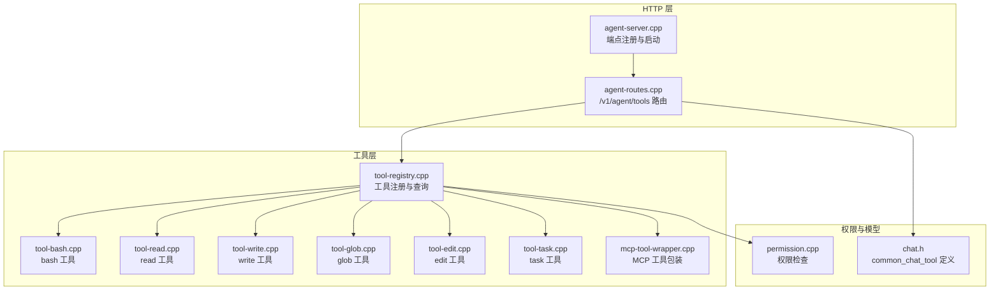
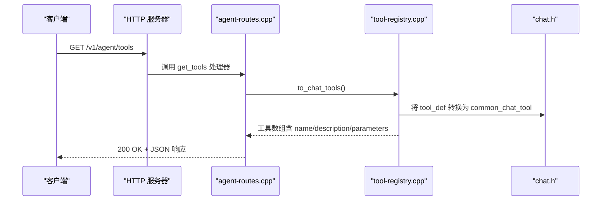
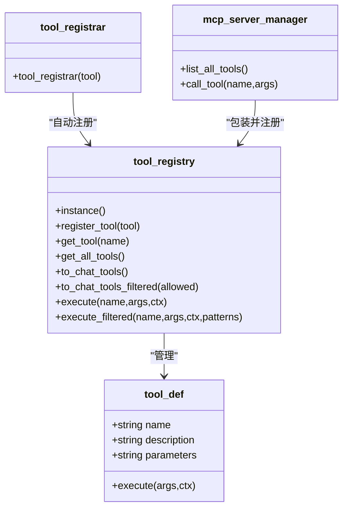
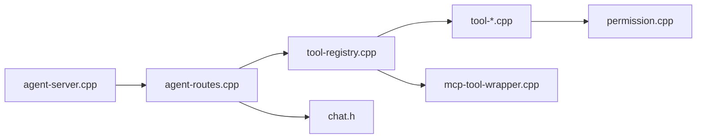

# 代理工具发现

<cite>
**本文引用的文件**
- [agent-routes.h](file://agent/server/agent-routes.h)
- [agent-routes.cpp](file://agent/server/agent-routes.cpp)
- [tool-registry.h](file://agent/tool-registry.h)
- [tool-registry.cpp](file://agent/tool-registry.cpp)
- [tool-bash.cpp](file://agent/tools/tool-bash.cpp)
- [tool-read.cpp](file://agent/tools/tool-read.cpp)
- [tool-write.cpp](file://agent/tools/tool-write.cpp)
- [tool-glob.cpp](file://agent/tools/tool-glob.cpp)
- [tool-edit.cpp](file://agent/tools/tool-edit.cpp)
- [tool-task.cpp](file://agent/tools/tool-task.cpp)
- [permission.h](file://agent/permission.h)
- [permission.cpp](file://agent/permission.cpp)
- [mcp-tool-wrapper.cpp](file://agent/mcp/mcp-tool-wrapper.cpp)
- [mcp-tool-wrapper.h](file://agent/mcp/mcp-tool-wrapper.h)
- [agent-server.cpp](file://agent/server/agent-server.cpp)
- [chat.h](file://third_party/llama.cpp/common/chat.h)
</cite>

## 目录
1. [简介](#简介)
2. [项目结构](#项目结构)
3. [核心组件](#核心组件)
4. [架构总览](#架构总览)
5. [详细组件分析](#详细组件分析)
6. [依赖关系分析](#依赖关系分析)
7. [性能考虑](#性能考虑)
8. [故障排查指南](#故障排查指南)
9. [结论](#结论)
10. [附录](#附录)

## 简介
本文件面向“代理工具发现 API”，聚焦于 /v1/agent/tools 端点的工具列表查询能力，系统性阐述工具元数据格式、参数定义、描述信息与使用示例；同时覆盖工具注册机制、动态工具发现与工具分类管理，以及与代理系统的集成方式与扩展机制。文档还提供工具使用的最佳实践、参数验证规则与错误处理策略。

## 项目结构
围绕工具发现与注册的关键目录与文件如下：
- 服务器路由与端点注册：agent/server/agent-routes.{h,cpp}
- 工具注册中心：agent/tool-registry.{h,cpp}
- 具体工具实现：agent/tools/*.cpp（bash、read、write、glob、edit、task）
- 权限控制：agent/permission.{h,cpp}
- MCP 工具包装器：agent/mcp/mcp-tool-wrapper.{h,cpp}
- 服务启动与端点挂载：agent/server/agent-server.cpp
- 通用工具模型定义：third_party/llama.cpp/common/chat.h

**图表来源**
- [agent-routes.cpp:425-435](file://agent/server/agent-routes.cpp#L425-L435)
- [tool-registry.cpp:31-48](file://agent/tool-registry.cpp#L31-L48)
- [tool-bash.cpp:260-281](file://agent/tools/tool-bash.cpp#L260-L281)
- [tool-read.cpp:95-120](file://agent/tools/tool-read.cpp#L95-L120)
- [tool-write.cpp:59-80](file://agent/tools/tool-write.cpp#L59-L80)
- [tool-glob.cpp:158-181](file://agent/tools/tool-glob.cpp#L158-L181)
- [tool-edit.cpp:166-196](file://agent/tools/tool-edit.cpp#L166-L196)
- [tool-task.cpp:210-257](file://agent/tools/tool-task.cpp#L210-L257)
- [mcp-tool-wrapper.cpp:7-63](file://agent/mcp/mcp-tool-wrapper.cpp#L7-L63)
- [permission.cpp:108-140](file://agent/permission.cpp#L108-L140)
- [chat.h:169-173](file://third_party/llama.cpp/common/chat.h#L169-L173)

**章节来源**
- [agent-routes.cpp:425-435](file://agent/server/agent-routes.cpp#L425-L435)
- [tool-registry.cpp:31-48](file://agent/tool-registry.cpp#L31-L48)
- [agent-server.cpp:338-350](file://agent/server/agent-server.cpp#L338-L350)

## 核心组件
- 工具注册中心：提供单例注册、查询、过滤与执行接口，并可将工具转换为通用 chat 工具格式。
- 工具实现：每个工具以 tool_def 形式注册，包含名称、描述、JSON Schema 参数、执行函数。
- 权限控制：统一的权限检查与危险模式识别，保障工具调用安全。
- 路由与端点：/v1/agent/tools 返回所有可用工具及其参数 Schema。
- MCP 扩展：运行时从 MCP 服务器发现工具并通过包装器注册到工具中心。

**章节来源**
- [tool-registry.h:58-97](file://agent/tool-registry.h#L58-L97)
- [tool-registry.cpp:11-86](file://agent/tool-registry.cpp#L11-L86)
- [permission.h:40-101](file://agent/permission.h#L40-L101)
- [permission.cpp:34-140](file://agent/permission.cpp#L34-L140)
- [agent-routes.cpp:425-435](file://agent/server/agent-routes.cpp#L425-L435)
- [mcp-tool-wrapper.cpp:7-63](file://agent/mcp/mcp-tool-wrapper.cpp#L7-L63)

## 架构总览
/v1/agent/tools 的请求处理流程如下：

**图表来源**
- [agent-routes.cpp:425-435](file://agent/server/agent-routes.cpp#L425-L435)
- [tool-registry.cpp:31-48](file://agent/tool-registry.cpp#L31-L48)
- [chat.h:169-173](file://third_party/llama.cpp/common/chat.h#L169-L173)

## 详细组件分析

### /v1/agent/tools 端点
- 功能：返回当前可用工具清单，每项包含名称、描述与参数 Schema（JSON 对象）。
- 实现要点：
  - 使用工具注册中心的 to_chat_tools() 获取工具集合。
  - 将每个工具的 parameters 字符串解析为 JSON 对象后返回。
  - 返回结构包含 tools 数组，数组元素为对象，字段包括 name、description、parameters。
- 错误处理：该处理器未显式抛出异常，整体错误通过上层异常包装器统一处理（见服务启动文件）。

**章节来源**
- [agent-routes.cpp:425-435](file://agent/server/agent-routes.cpp#L425-L435)

### 工具元数据与参数定义
- 元数据结构：common_chat_tool（来自 chat.h），包含 name、description、parameters（JSON Schema 字符串）。
- 工具定义：tool_def（来自 tool-registry.h），包含 name、description、parameters（JSON Schema 字符串）、execute 函数指针。
- 参数 Schema：各工具以 JSON Schema 描述参数，用于前端或 SDK 进行参数校验与提示。

示例工具（名称、描述、参数 Schema）：
- bash：执行 shell 命令，参数包含 command（必填）与 timeout（可选）。
- read：读取文件内容，参数包含 file_path（必填）、offset（可选）、limit（可选）。
- write：写入文件，参数包含 file_path（必填）、content（必填）。
- glob：按通配符查找文件，参数包含 pattern（必填）、path（可选，默认工作目录）。
- edit：编辑文件文本，参数包含 file_path（必填）、old_string（必填）、new_string（必填）、replace_all（可选）。
- task：派生子代理执行任务，参数包含 subagent_type（枚举）、prompt（可选，新任务必填）、description（可选）、run_in_background（可选）、resume（可选）。

**章节来源**
- [chat.h:169-173](file://third_party/llama.cpp/common/chat.h#L169-L173)
- [tool-registry.h:43-56](file://agent/tool-registry.h#L43-L56)
- [tool-bash.cpp:260-281](file://agent/tools/tool-bash.cpp#L260-L281)
- [tool-read.cpp:95-120](file://agent/tools/tool-read.cpp#L95-L120)
- [tool-write.cpp:59-80](file://agent/tools/tool-write.cpp#L59-L80)
- [tool-glob.cpp:158-181](file://agent/tools/tool-glob.cpp#L158-L181)
- [tool-edit.cpp:166-196](file://agent/tools/tool-edit.cpp#L166-L196)
- [tool-task.cpp:210-257](file://agent/tools/tool-task.cpp#L210-L257)

### 工具注册机制与动态发现
- 单例注册中心：通过工具注册中心的 register_tool() 注册工具；提供 get_tool()、get_all_tools() 查询接口。
- 自动注册宏：REGISTER_TOOL(name, tool_instance) 在全局静态区创建 tool_registrar 实例，触发注册。
- 动态 MCP 发现：运行时加载 MCP 配置，扫描 MCP 服务器工具，通过 register_mcp_tools() 包装为 tool_def 并注册到注册中心。
- 过滤执行：支持根据允许工具集合进行过滤执行（如只读模式限制 bash 命令）。

**图表来源**
- [tool-registry.h:58-97](file://agent/tool-registry.h#L58-L97)
- [tool-registry.cpp:11-86](file://agent/tool-registry.cpp#L11-L86)
- [mcp-tool-wrapper.cpp:7-63](file://agent/mcp/mcp-tool-wrapper.cpp#L7-L63)

**章节来源**
- [tool-registry.h:92-102](file://agent/tool-registry.h#L92-L102)
- [tool-registry.cpp:11-86](file://agent/tool-registry.cpp#L11-L86)
- [mcp-tool-wrapper.cpp:7-63](file://agent/mcp/mcp-tool-wrapper.cpp#L7-L63)

### 工具分类与权限控制
- 分类维度：工具类型（文件读写、命令执行、搜索、编辑、任务派生等）。
- 权限策略：
  - 默认状态：不同工具类型有不同的默认许可状态（如文件读取默认允许、写入与 bash 需要询问）。
  - 危险模式：内置危险 bash 模式匹配列表，命中则强制询问。
  - 会话覆盖：用户可在会话内选择“始终允许/拒绝”。
  - 敏感文件保护：禁止读写敏感文件名与扩展名。
  - 外部路径限制：禁止在工作目录之外操作。
- 只读模式：对 bash 工具执行白名单模式，仅允许特定前缀的命令。

**章节来源**
- [permission.h:40-101](file://agent/permission.h#L40-L101)
- [permission.cpp:34-140](file://agent/permission.cpp#L34-L140)
- [permission.cpp:108-140](file://agent/permission.cpp#L108-L140)
- [permission.cpp:230-304](file://agent/permission.cpp#L230-L304)
- [tool-registry.cpp:62-85](file://agent/tool-registry.cpp#L62-L85)

### 工具使用示例与最佳实践
- 示例场景：
  - 列出工具：GET /v1/agent/tools，得到工具清单与参数 Schema。
  - 读取文件：调用 read 工具，设置 file_path、可选 offset/limit。
  - 写入文件：调用 write 工具，设置 file_path 与 content。
  - 查找文件：调用 glob 工具，设置 pattern 与可选 path。
  - 编辑文件：调用 edit 工具，设置 file_path、old_string、new_string，必要时 replace_all=true。
  - 执行命令：调用 bash 工具，设置 command 与可选 timeout。
  - 派生任务：调用 task 工具，设置 subagent_type、prompt，可后台运行并用 resume 查询结果。
- 最佳实践：
  - 使用参数 Schema 进行参数校验与提示，避免无效输入。
  - 对敏感文件与外部路径进行防护，遵循最小权限原则。
  - 合理设置超时时间，防止长时间阻塞。
  - 在只读模式下谨慎使用 bash，尽量使用白名单命令。
  - 使用 task 工具进行复杂任务分解，提升可维护性与可观测性。

**章节来源**
- [tool-read.cpp:17-93](file://agent/tools/tool-read.cpp#L17-L93)
- [tool-write.cpp:10-57](file://agent/tools/tool-write.cpp#L10-L57)
- [tool-glob.cpp:72-156](file://agent/tools/tool-glob.cpp#L72-L156)
- [tool-edit.cpp:69-164](file://agent/tools/tool-edit.cpp#L69-L164)
- [tool-bash.cpp:50-258](file://agent/tools/tool-bash.cpp#L50-L258)
- [tool-task.cpp:71-208](file://agent/tools/tool-task.cpp#L71-L208)

### 错误处理策略
- 路由层：统一异常包装，捕获无效参数与未知异常，返回标准化错误响应。
- 工具层：工具执行返回 tool_result（success、output、error），便于上层判断与展示。
- 权限层：权限检查失败时返回相应错误信息，支持用户交互决策。

**章节来源**
- [agent-server.cpp:70-103](file://agent/server/agent-server.cpp#L70-L103)
- [tool-registry.cpp:49-60](file://agent/tool-registry.cpp#L49-L60)
- [permission.cpp:108-140](file://agent/permission.cpp#L108-L140)

## 依赖关系分析
- /v1/agent/tools 依赖工具注册中心导出通用工具模型（common_chat_tool）。
- 工具实现依赖权限模块进行安全检查。
- MCP 工具通过包装器注入到注册中心，实现动态发现与统一管理。
- 服务启动文件负责端点注册与异常包装。

**图表来源**
- [agent-routes.cpp:425-435](file://agent/server/agent-routes.cpp#L425-L435)
- [tool-registry.cpp:31-48](file://agent/tool-registry.cpp#L31-L48)
- [tool-bash.cpp:260-281](file://agent/tools/tool-bash.cpp#L260-L281)
- [tool-read.cpp:95-120](file://agent/tools/tool-read.cpp#L95-L120)
- [tool-write.cpp:59-80](file://agent/tools/tool-write.cpp#L59-L80)
- [tool-glob.cpp:158-181](file://agent/tools/tool-glob.cpp#L158-L181)
- [tool-edit.cpp:166-196](file://agent/tools/tool-edit.cpp#L166-L196)
- [tool-task.cpp:210-257](file://agent/tools/tool-task.cpp#L210-L257)
- [mcp-tool-wrapper.cpp:7-63](file://agent/mcp/mcp-tool-wrapper.cpp#L7-L63)
- [permission.cpp:108-140](file://agent/permission.cpp#L108-L140)
- [chat.h:169-173](file://third_party/llama.cpp/common/chat.h#L169-L173)
- [agent-server.cpp:338-350](file://agent/server/agent-server.cpp#L338-L350)

**章节来源**
- [agent-routes.cpp:425-435](file://agent/server/agent-routes.cpp#L425-L435)
- [tool-registry.cpp:31-48](file://agent/tool-registry.cpp#L31-L48)
- [mcp-tool-wrapper.cpp:7-63](file://agent/mcp/mcp-tool-wrapper.cpp#L7-L63)
- [agent-server.cpp:338-350](file://agent/server/agent-server.cpp#L338-L350)

## 性能考虑
- 工具列表查询为内存操作，复杂度近似 O(N)，其中 N 为已注册工具数量。
- 工具执行涉及 I/O 或进程创建，建议合理设置超时与输出截断，避免阻塞与资源耗尽。
- MCP 工具调用可能引入网络延迟，建议缓存与重用连接，减少握手开销。

## 故障排查指南
- 无法访问 /v1/agent/tools：
  - 检查服务是否启动成功与端点是否正确注册。
  - 查看异常包装器返回的错误码与消息。
- 工具返回空列表：
  - 确认工具是否已通过 REGISTER_TOOL 注册或 MCP 是否成功加载。
  - 检查工具注册中心的 to_chat_tools() 是否正常。
- 权限被拒绝：
  - 检查权限默认策略与会话覆盖设置。
  - 确认是否命中危险模式或敏感文件/外部路径。
- bash 执行失败：
  - 检查命令是否在只读模式白名单中。
  - 设置合理的 timeout，避免超时导致的中断。

**章节来源**
- [agent-server.cpp:70-103](file://agent/server/agent-server.cpp#L70-L103)
- [tool-registry.cpp:31-48](file://agent/tool-registry.cpp#L31-L48)
- [permission.cpp:108-140](file://agent/permission.cpp#L108-L140)
- [tool-bash.cpp:50-258](file://agent/tools/tool-bash.cpp#L50-L258)

## 结论
/v1/agent/tools 提供了统一、可扩展的工具发现入口，结合工具注册中心、权限控制与 MCP 动态发现机制，能够满足多样化的代理工具管理需求。通过规范的元数据与参数 Schema，前端与 SDK 可实现一致的参数校验与用户体验；配合只读模式与敏感文件保护，确保系统安全可控。

## 附录

### API 规范：/v1/agent/tools
- 方法：GET
- 路径：/v1/agent/tools
- 成功响应：200 OK
- 响应体：
  - tools：数组，元素为对象，包含以下字段：
    - name：字符串，工具名称
    - description：字符串，工具描述
    - parameters：对象，JSON Schema，描述工具参数结构
- 错误响应：500 Internal Server Error（由上层异常包装器统一处理）

**章节来源**
- [agent-routes.cpp:425-435](file://agent/server/agent-routes.cpp#L425-L435)