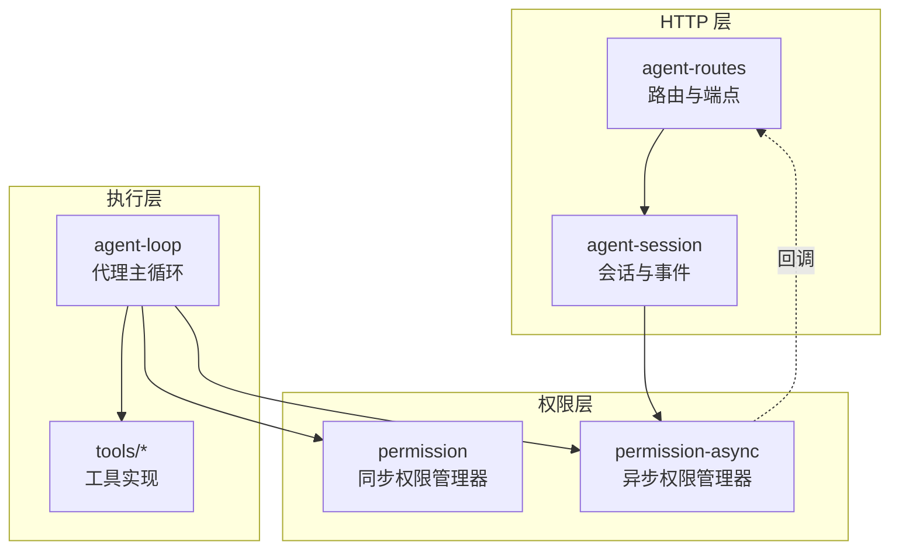
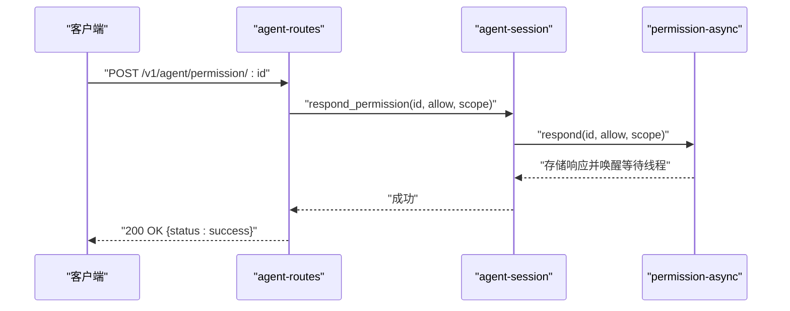
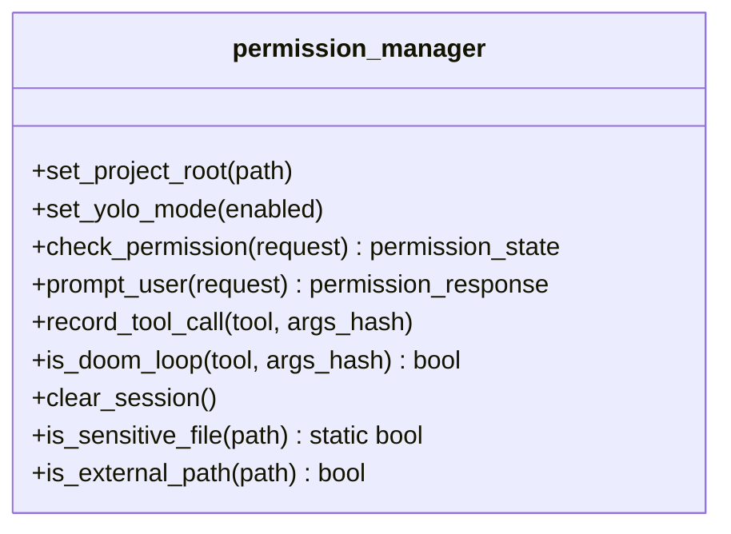
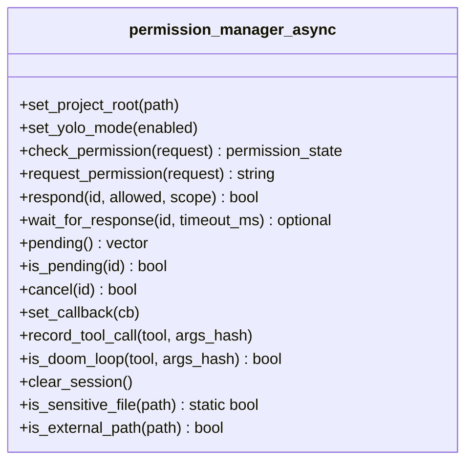
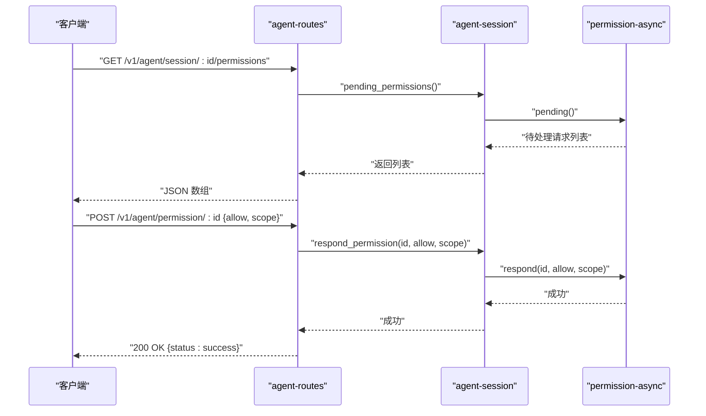
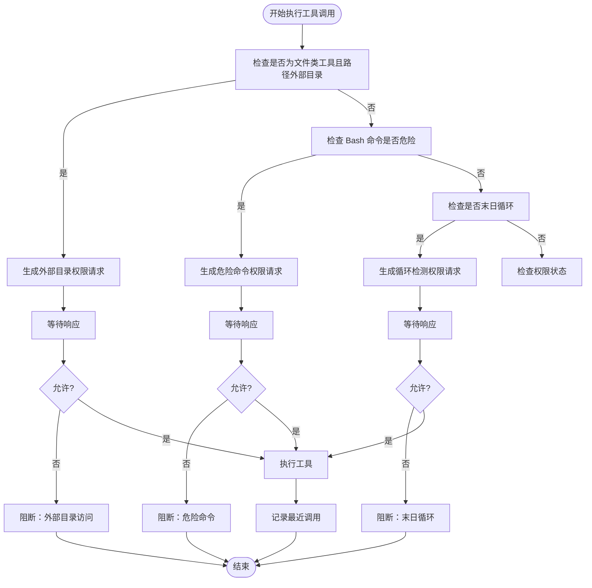
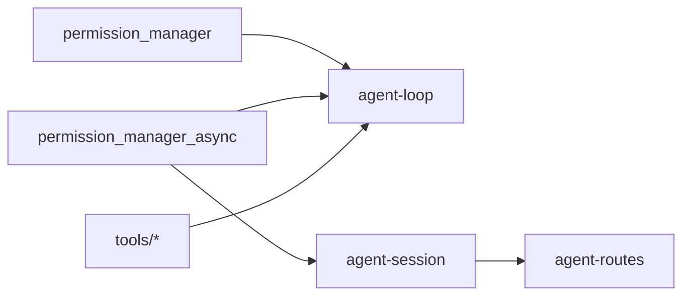

# 代理权限控制

<cite>
**本文引用的文件**
- [agent/permission.h](file://agent/permission.h)
- [agent/permission.cpp](file://agent/permission.cpp)
- [agent/permission-async.h](file://agent/permission-async.h)
- [agent/permission-async.cpp](file://agent/permission-async.cpp)
- [agent/server/agent-routes.h](file://agent/server/agent-routes.h)
- [agent/server/agent-routes.cpp](file://agent/server/agent-routes.cpp)
- [agent/server/agent-session.h](file://agent/server/agent-session.h)
- [agent/agent-loop.cpp](file://agent/agent-loop.cpp)
- [agent/tools/tool-read.cpp](file://agent/tools/tool-read.cpp)
- [agent/tools/tool-write.cpp](file://agent/tools/tool-write.cpp)
- [agent/tools/tool-glob.cpp](file://agent/tools/tool-glob.cpp)
- [agent/sdk/http-agent.cpp](file://agent/sdk/http-agent.cpp)
</cite>

## 目录
1. [简介](#简介)
2. [项目结构](#项目结构)
3. [核心组件](#核心组件)
4. [架构总览](#架构总览)
5. [详细组件分析](#详细组件分析)
6. [依赖关系分析](#依赖关系分析)
7. [性能考虑](#性能考虑)
8. [故障排除指南](#故障排除指南)
9. [结论](#结论)
10. [附录](#附录)

## 简介
本文件为代理权限控制 API 的详细技术文档，聚焦于 /v1/agent/permission/:id 端点的权限确认与管理能力。该端点用于在异步权限模式下，由外部系统或用户通过 HTTP 接口对代理发起的工具调用进行授权决策。文档涵盖以下内容：
- 权限请求的触发机制（何时需要授权）
- 用户确认流程（交互式与 API 异步两种模式）
- 权限状态管理（默认策略、会话覆盖、危险/敏感识别）
- 循环检测功能（重复相同工具调用的防护）
- 权限验证规则、安全策略与异常处理
- 配置选项、使用示例与故障排除
- 权限系统与工具执行的安全集成

## 项目结构
围绕权限控制的关键模块与文件如下：
- 同步权限管理器：定义权限类型、请求/响应模型与交互式确认逻辑
- 异步权限管理器：支持 API 触发、回调通知、超时等待与会话覆盖
- 服务器路由：暴露 /v1/agent/permission/:id 端点，提供权限响应接口
- 会话管理：封装权限请求队列、回调与事件推送
- 工具执行：在工具调用前进行权限检查与安全过滤
- 代理主循环：在流式执行中插入权限请求与循环检测

**图表来源**
- [agent/server/agent-routes.cpp:364-424](file://agent/server/agent-routes.cpp#L364-L424)
- [agent/server/agent-session.h:65-145](file://agent/server/agent-session.h#L65-L145)
- [agent/permission.h:40-101](file://agent/permission.h#L40-L101)
- [agent/permission-async.h:43-141](file://agent/permission-async.h#L43-L141)
- [agent/agent-loop.cpp:1293-1358](file://agent/agent-loop.cpp#L1293-L1358)

**章节来源**
- [agent/server/agent-routes.cpp:364-424](file://agent/server/agent-routes.cpp#L364-L424)
- [agent/server/agent-session.h:65-145](file://agent/server/agent-session.h#L65-L145)
- [agent/permission.h:40-101](file://agent/permission.h#L40-L101)
- [agent/permission-async.h:43-141](file://agent/permission-async.h#L43-L141)
- [agent/agent-loop.cpp:1293-1358](file://agent/agent-loop.cpp#L1293-L1358)

## 核心组件
- 权限类型与状态
  - 类型：BASH、FILE_READ、FILE_WRITE、FILE_EDIT、GLOB、EXTERNAL_DIR
  - 状态：ALLOW（自动允许）、ASK（需要确认）、DENY（直接拒绝）、ALLOW_SESSION/DENY_SESSION（会话内记忆）
- 请求/响应模型
  - 请求：包含类型、工具名、描述、细节（如命令或路径）、是否危险标记
  - 响应：允许/拒绝一次或会话级记忆
- 默认策略
  - BASH/FILE_WRITE/FILE_EDIT/EXTERNAL_DIR 默认要求确认；FILE_READ/GLOB 默认允许；可被会话覆盖
- 危险/安全模式
  - 危险模式（YOLO）：跳过所有权限提示
  - 危险模式（危险 Bash 模式）：匹配特定高危命令片段时强制确认
  - 安全文件识别：对敏感文件名/扩展名进行阻断
  - 外部目录访问：超出工作目录的文件操作需授权

**章节来源**
- [agent/permission.h:8-38](file://agent/permission.h#L8-L38)
- [agent/permission.cpp:35-71](file://agent/permission.cpp#L35-L71)
- [agent/permission-async.h:21-33](file://agent/permission-async.h#L21-L33)
- [agent/permission-async.cpp:10-45](file://agent/permission-async.cpp#L10-L45)

## 架构总览
/v1/agent/permission/:id 是权限控制 API 的核心入口。当代理在执行工具调用时，若遇到需要授权的情况（如危险命令、外部目录访问、重复调用），会生成一个权限请求并返回给客户端。客户端通过该端点提交允许/拒绝及作用域（一次/会话），从而完成授权闭环。

**图表来源**
- [agent/server/agent-routes.cpp:387-424](file://agent/server/agent-routes.cpp#L387-L424)
- [agent/server/agent-session.h:106-108](file://agent/server/agent-session.h#L106-L108)
- [agent/permission-async.cpp:146-178](file://agent/permission-async.cpp#L146-L178)

**章节来源**
- [agent/server/agent-routes.cpp:387-424](file://agent/server/agent-routes.cpp#L387-L424)
- [agent/server/agent-session.h:106-108](file://agent/server/agent-session.h#L106-L108)
- [agent/permission-async.cpp:146-178](file://agent/permission-async.cpp#L146-L178)

## 详细组件分析

### 组件 A：同步权限管理器（permission_manager）
- 职责
  - 提供默认权限策略与危险/安全模式识别
  - 支持交互式用户确认（读取单字符输入）
  - 记录最近工具调用并检测“末日循环”
  - 判断敏感文件与外部路径
- 关键行为
  - 检查会话覆盖优先于默认策略
  - Bash 命令按危险/安全模式匹配决定是否需要确认
  - 允许/拒绝后更新会话覆盖表
  - 记录最近调用并限制窗口大小

**图表来源**
- [agent/permission.h:40-101](file://agent/permission.h#L40-L101)

**章节来源**
- [agent/permission.cpp:35-140](file://agent/permission.cpp#L35-L140)
- [agent/permission.cpp:199-228](file://agent/permission.cpp#L199-L228)
- [agent/permission.cpp:230-304](file://agent/permission.cpp#L230-L304)

### 组件 B：异步权限管理器（permission_manager_async）
- 职责
  - 在无交互式终端的环境中替代同步确认
  - 生成唯一请求 ID，维护待处理请求与响应队列
  - 支持回调通知、超时等待、取消与清理
  - 会话覆盖支持“会话级”记忆
- 关键行为
  - request_permission：入队请求并触发回调
  - respond：写入响应并移除待处理项
  - wait_for_response：带超时的阻塞等待
  - is_doom_loop：基于最近调用统计判断循环

**图表来源**
- [agent/permission-async.h:43-141](file://agent/permission-async.h#L43-L141)

**章节来源**
- [agent/permission-async.cpp:10-45](file://agent/permission-async.cpp#L10-L45)
- [agent/permission-async.cpp:124-178](file://agent/permission-async.cpp#L124-L178)
- [agent/permission-async.cpp:180-209](file://agent/permission-async.cpp#L180-L209)
- [agent/permission-async.cpp:237-264](file://agent/permission-async.cpp#L237-L264)

### 组件 C：HTTP 路由与会话（agent-routes 与 agent-session）
- /v1/agent/permission/:id
  - 解析请求体中的 allow 与 scope 字段
  - 遍历会话查找对应请求并调用会话层响应方法
  - 返回成功或未找到错误
- /v1/agent/session/:id/permissions
  - 查询当前会话的待处理权限列表
- 会话层
  - pending_permissions：返回异步权限管理器中的待处理请求
  - respond_permission：委托异步权限管理器写入响应

**图表来源**
- [agent/server/agent-routes.cpp:364-385](file://agent/server/agent-routes.cpp#L364-L385)
- [agent/server/agent-routes.cpp:387-424](file://agent/server/agent-routes.cpp#L387-L424)
- [agent/server/agent-session.h:103-108](file://agent/server/agent-session.h#L103-L108)

**章节来源**
- [agent/server/agent-routes.cpp:364-385](file://agent/server/agent-routes.cpp#L364-L385)
- [agent/server/agent-routes.cpp:387-424](file://agent/server/agent-routes.cpp#L387-L424)
- [agent/server/agent-session.h:103-108](file://agent/server/agent-session.h#L103-L108)

### 组件 D：代理主循环与工具执行（agent-loop 与 tools/*）
- 权限触发点
  - 外部目录访问：对 read/write/edit 的文件路径进行外部目录检测
  - 危险命令：Bash 命令包含高危片段时标记为危险
  - 末日循环：检测连续三次相同的工具调用
- 执行流程
  - 同步模式：直接 prompt_user 并根据结果放行或阻断
  - 异步模式：request_permission → 等待 wait_for_response → 根据允许与否放行或阻断
- 工具安全
  - read：阻断敏感文件
  - write：写入成功后返回简要信息
  - glob：路径合法性与模式有效性校验

**图表来源**
- [agent/agent-loop.cpp:1293-1358](file://agent/agent-loop.cpp#L1293-L1358)
- [agent/agent-loop.cpp:561-584](file://agent/agent-loop.cpp#L561-L584)
- [agent/tools/tool-read.cpp:42-45](file://agent/tools/tool-read.cpp#L42-L45)
- [agent/tools/tool-write.cpp:44-56](file://agent/tools/tool-write.cpp#L44-L56)
- [agent/tools/tool-glob.cpp:72-155](file://agent/tools/tool-glob.cpp#L72-L155)

**章节来源**
- [agent/agent-loop.cpp:1293-1358](file://agent/agent-loop.cpp#L1293-L1358)
- [agent/agent-loop.cpp:561-584](file://agent/agent-loop.cpp#L561-L584)
- [agent/tools/tool-read.cpp:42-45](file://agent/tools/tool-read.cpp#L42-L45)
- [agent/tools/tool-write.cpp:44-56](file://agent/tools/tool-write.cpp#L44-L56)
- [agent/tools/tool-glob.cpp:72-155](file://agent/tools/tool-glob.cpp#L72-L155)

## 依赖关系分析
- 权限层
  - permission_manager 与 permission_manager_async 共享权限类型、请求/响应模型与默认策略
  - 异步版本在同步基础上增加线程安全、回调与超时等待
- 会话层
  - 会话持有 permission_manager_async 实例，并通过回调与 HTTP 路由联动
- 路由层
  - 通过 agent-session 将 HTTP 请求映射到权限响应
- 工具层
  - 工具在执行前进行敏感文件与外部路径的前置检查
- 主循环
  - 在工具调用前后插入权限检查与循环检测

**图表来源**
- [agent/permission.h:40-101](file://agent/permission.h#L40-L101)
- [agent/permission-async.h:43-141](file://agent/permission-async.h#L43-L141)
- [agent/server/agent-session.h:125-126](file://agent/server/agent-session.h#L125-L126)
- [agent/server/agent-routes.cpp:387-424](file://agent/server/agent-routes.cpp#L387-L424)
- [agent/agent-loop.cpp:1293-1358](file://agent/agent-loop.cpp#L1293-L1358)

**章节来源**
- [agent/permission.h:40-101](file://agent/permission.h#L40-L101)
- [agent/permission-async.h:43-141](file://agent/permission-async.h#L43-L141)
- [agent/server/agent-session.h:125-126](file://agent/server/agent-session.h#L125-L126)
- [agent/server/agent-routes.cpp:387-424](file://agent/server/agent-routes.cpp#L387-L424)
- [agent/agent-loop.cpp:1293-1358](file://agent/agent-loop.cpp#L1293-L1358)

## 性能考虑
- 异步等待超时：默认 300 秒，可根据场景调整
- 最近调用窗口：仅保留最近 10 次调用，避免内存膨胀
- 线程安全：异步版本使用互斥锁与条件变量，避免竞态
- 回调通知：通过回调减少轮询成本，提升实时性
- 文件系统与正则：glob 搜索限制结果数量，降低 IO 压力

[本节为通用建议，不直接分析具体文件]

## 故障排除指南
- 症状：POST /v1/agent/permission/:id 返回 404
  - 可能原因：请求 ID 不存在或已过期；会话中无此请求
  - 处理：先调用 GET /v1/agent/session/:id/permissions 获取最新待处理列表
- 症状：工具执行被阻断但未收到权限事件
  - 可能原因：未启用异步权限或未设置回调
  - 处理：确保在流式聊天中使用异步权限管理器并正确订阅事件
- 症状：重复相同工具调用被阻断
  - 可能原因：检测到末日循环
  - 处理：在权限响应中选择允许，或调整工具调用逻辑
- 症状：读取敏感文件失败
  - 可能原因：敏感文件名/扩展名命中阻断规则
  - 处理：避免直接读取凭证/密钥文件，改用受控方式

**章节来源**
- [agent/server/agent-routes.cpp:387-424](file://agent/server/agent-routes.cpp#L387-L424)
- [agent/agent-loop.cpp:1327-1343](file://agent/agent-loop.cpp#L1327-L1343)
- [agent/tools/tool-read.cpp:42-45](file://agent/tools/tool-read.cpp#L42-L45)

## 结论
/v1/agent/permission/:id 端点为代理权限控制提供了统一的 API 入口，结合同步与异步权限管理器，实现了从默认策略、危险识别、循环检测到会话覆盖的完整闭环。通过 HTTP 路由与会话层的协作，外部系统可以以事件驱动的方式对代理的工具调用进行授权决策，既保证了安全性，又提升了可用性与可扩展性。

[本节为总结性内容，不直接分析具体文件]

## 附录

### API 定义：/v1/agent/permission/:id
- 方法：POST
- 路径参数：id（权限请求 ID）
- 请求体字段
  - allow: boolean（必须）
  - scope: string（可选，"once" 或 "session"）
- 成功响应：200 OK，{status: "success"}
- 错误响应：
  - 400：缺少 allow 字段或 JSON 解析失败
  - 404：请求 ID 不存在或未找到

**章节来源**
- [agent/server/agent-routes.cpp:387-424](file://agent/server/agent-routes.cpp#L387-L424)

### 权限状态与默认策略
- 默认策略（异步版本与同步版本一致）
  - BASH/FILE_WRITE/FILE_EDIT/EXTERNAL_DIR：ASK
  - FILE_READ/GLOB：ALLOW
- 会话覆盖
  - 选择“总是”可在当前会话内记住允许/拒绝
- 危险模式
  - YOLO：跳过所有权限提示
  - 危险 Bash 模式：匹配高危命令片段时强制确认

**章节来源**
- [agent/permission.cpp:35-71](file://agent/permission.cpp#L35-L71)
- [agent/permission-async.cpp:10-45](file://agent/permission-async.cpp#L10-L45)

### 使用示例（概念性）
- 步骤
  1) 发起聊天并启用异步权限管理器
  2) 监听 permission_required 事件，获取 request_id
  3) 调用 POST /v1/agent/permission/:id {allow: true, scope: "session"}
  4) 监听 permission_resolved 事件确认结果
- 注意
  - 若未设置 scope，默认为一次性允许
  - 会话结束后，会话级覆盖将被清除

[本节为概念性示例，不直接分析具体文件]