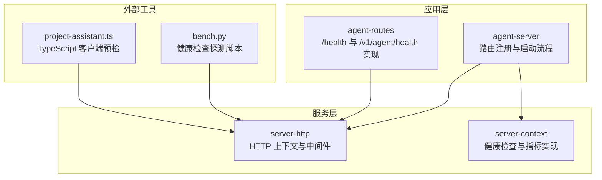
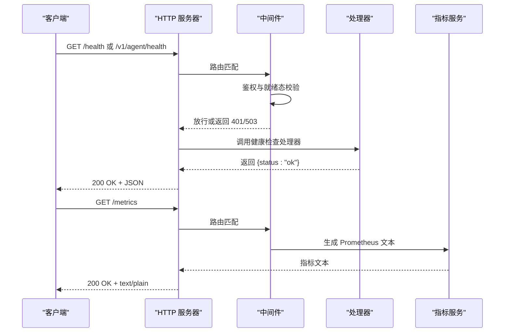
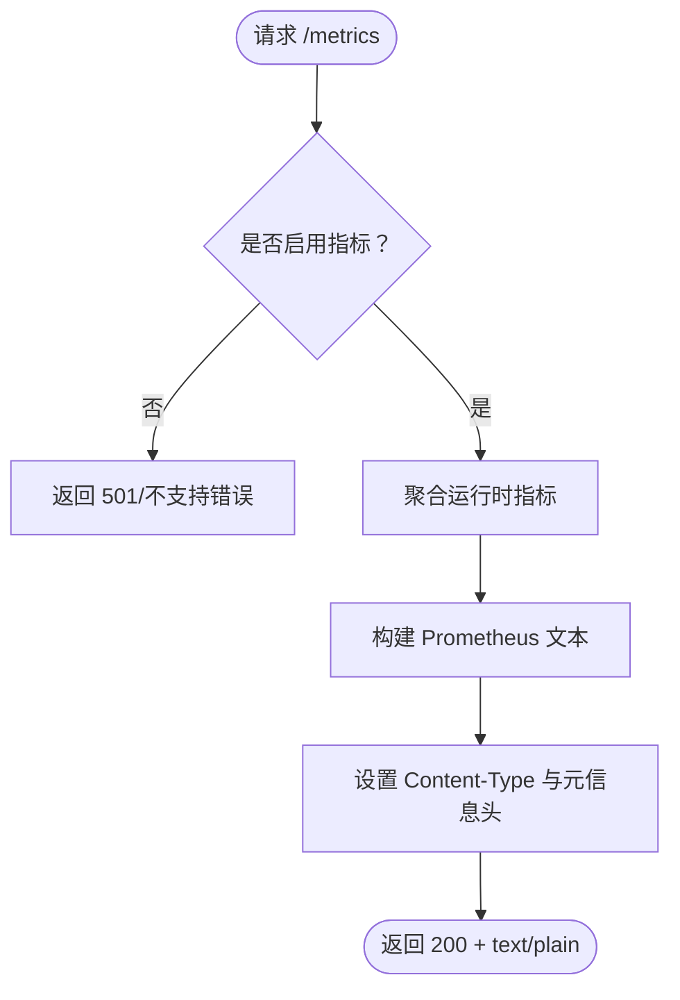
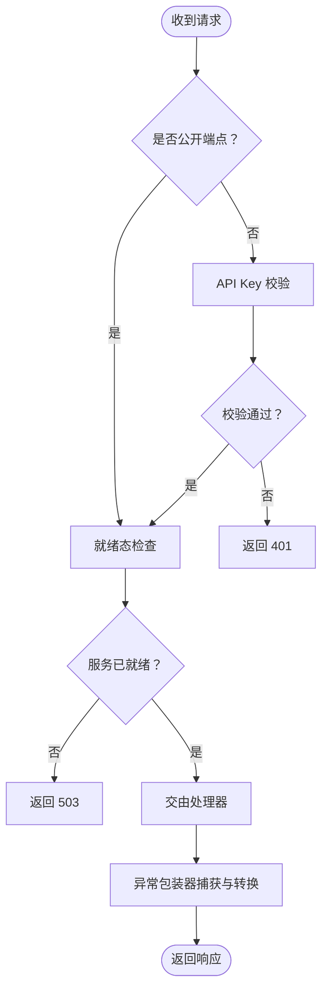
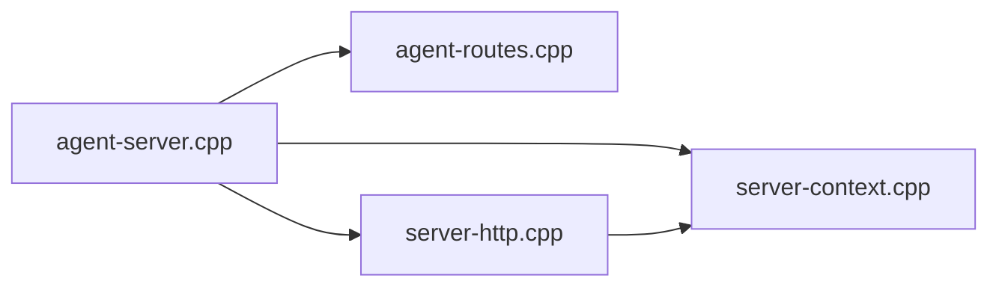

# 健康检查和监控

<cite>
**本文引用的文件**
- [agent-routes.cpp](file://agent/server/agent-routes.cpp)
- [agent-server.cpp](file://agent/server/agent-server.cpp)
- [server-http.cpp](file://third_party/llama.cpp/tools/server/server-http.cpp)
- [server-context.cpp](file://third_party/llama.cpp/tools/server/server-context.cpp)
- [arg.cpp](file://third_party/llama.cpp/common/arg.cpp)
- [bench.py](file://third_party/llama.cpp/tools/server/bench/bench.py)
- [project-assistant.ts](file://SDKs/typescript/src/project-assistant.ts)
</cite>

## 目录
1. [简介](#简介)
2. [项目结构](#项目结构)
3. [核心组件](#核心组件)
4. [架构总览](#架构总览)
5. [详细组件分析](#详细组件分析)
6. [依赖关系分析](#依赖关系分析)
7. [性能考量](#性能考量)
8. [故障排查指南](#故障排查指南)
9. [结论](#结论)
10. [附录](#附录)

## 简介
本文件面向健康检查与监控 API，聚焦于 /health 与 /v1/agent/health 两个端点的系统状态检查能力，覆盖以下内容：
- 端点行为与返回格式
- 状态码语义与异常处理
- 指标采集与 Prometheus 兼容监控
- 错误日志与故障诊断
- 监控集成方案与告警配置建议
- 分布式部署下的健康检查最佳实践

## 项目结构
围绕健康检查与监控的关键模块分布如下：
- HTTP 层：基于 cpp-httplib 的 HTTP 服务器上下文，负责路由注册、中间件（鉴权、就绪态校验）、请求日志与异常处理。
- 服务层：统一的健康检查与指标接口实现，支持 Prometheus 格式的 /metrics 输出。
- 应用层：代理路由与会话管理，提供 /v1/agent/health 与 /v1/agent/* 系列端点。



**图表来源**
- [agent-server.cpp:303-339](file://agent/server/agent-server.cpp#L303-L339)
- [agent-routes.cpp:105-109](file://agent/server/agent-routes.cpp#L105-L109)
- [server-http.cpp:30-48](file://third_party/llama.cpp/tools/server/server-http.cpp#L30-L48)
- [server-context.cpp:3294-3397](file://third_party/llama.cpp/tools/server/server-context.cpp#L3294-L3397)

**章节来源**
- [agent-server.cpp:303-339](file://agent/server/agent-server.cpp#L303-L339)
- [agent-routes.cpp:105-109](file://agent/server/agent-routes.cpp#L105-L109)
- [server-http.cpp:30-48](file://third_party/llama.cpp/tools/server/server-http.cpp#L30-L48)
- [server-context.cpp:3294-3397](file://third_party/llama.cpp/tools/server/server-context.cpp#L3294-L3397)

## 核心组件
- 健康检查端点
  - /health：通用健康检查，返回固定结构的 JSON，表示服务可用。
  - /v1/agent/health：代理模式下的健康检查，与 /health 行为一致。
- 指标端点
  - /metrics：以 Prometheus 文本格式输出运行时指标，需通过命令行参数启用。
- 中间件与异常处理
  - 鉴权中间件：对非公开端点进行 API Key 校验。
  - 就绪态中间件：在模型加载完成前对非公开端点返回 503。
  - 异常包装器：捕获未处理异常并转换为标准错误响应。

**章节来源**
- [agent-routes.cpp:105-109](file://agent/server/agent-routes.cpp#L105-L109)
- [agent-server.cpp:303-339](file://agent/server/agent-server.cpp#L303-L339)
- [server-http.cpp:126-206](file://third_party/llama.cpp/tools/server/server-http.cpp#L126-L206)
- [server-context.cpp:3294-3397](file://third_party/llama.cpp/tools/server/server-context.cpp#L3294-L3397)

## 架构总览
健康检查与监控在请求链路中的位置如下：



**图表来源**
- [agent-server.cpp:303-339](file://agent/server/agent-server.cpp#L303-L339)
- [server-http.cpp:126-206](file://third_party/llama.cpp/tools/server/server-http.cpp#L126-L206)
- [server-context.cpp:3294-3397](file://third_party/llama.cpp/tools/server/server-context.cpp#L3294-L3397)

## 详细组件分析

### 健康检查端点
- 端点列表
  - GET /health
  - GET /v1/agent/health
- 处理逻辑
  - 返回固定 JSON 对象，包含 status 字段，值为字符串 "ok"。
- 使用场景
  - 容器编排健康探针（如 Kubernetes liveness/readiness）
  - 自动化脚本预检与集成测试
- 可观测性
  - 请求会被轻量记录（非高频端点），便于审计与排障。

```mermaid
flowchart TD
Start(["请求进入"]) --> Match["匹配 /health 或 /v1/agent/health"]
Match --> MW["中间件放行公开端点"]
MW --> Handler["执行健康检查处理器"]
Handler --> Resp["构造 {status: \"ok\"}"]
Resp --> End(["返回 200 OK"])
```

**图表来源**
- [agent-routes.cpp:105-109](file://agent/server/agent-routes.cpp#L105-L109)
- [agent-server.cpp:303-339](file://agent/server/agent-server.cpp#L303-L339)

**章节来源**
- [agent-routes.cpp:105-109](file://agent/server/agent-routes.cpp#L105-L109)
- [agent-server.cpp:303-339](file://agent/server/agent-server.cpp#L303-L339)
- [project-assistant.ts:161-172](file://SDKs/typescript/src/project-assistant.ts#L161-L172)
- [bench.py:311-314](file://third_party/llama.cpp/tools/server/bench/bench.py#L311-L314)

### 指标端点与监控数据格式
- 端点
  - GET /metrics
- 启用方式
  - 通过命令行参数启用 Prometheus 兼容指标端点。
- 数据格式
  - Prometheus 文本格式，包含帮助信息与类型声明。
  - 主要指标类别：
    - counter（计数器）：提示令牌总数、提示耗时、生成令牌总数、生成耗时、解码调用次数、最大令牌数、每解码平均忙碌槽位数。
    - gauge（仪表盘）：提示吞吐（tokens/s）、生成吞吐（tokens/s）、处理中请求数、延迟请求数。
- 元数据
  - 包含进程启动时间等元信息头字段。



**图表来源**
- [server-context.cpp:3294-3397](file://third_party/llama.cpp/tools/server/server-context.cpp#L3294-L3397)
- [arg.cpp:2958-2964](file://third_party/llama.cpp/common/arg.cpp#L2958-L2964)

**章节来源**
- [server-context.cpp:3294-3397](file://third_party/llama.cpp/tools/server/server-context.cpp#L3294-L3397)
- [arg.cpp:2958-2964](file://third_party/llama.cpp/common/arg.cpp#L2958-L2964)

### 中间件与异常处理
- 鉴权中间件
  - 公开端点白名单：/health、/v1/health、/models、/v1/models、/api/tags。
  - 非公开端点要求携带有效 API Key（支持多种头部）。
  - 缺失或无效时返回 401。
- 就绪态中间件
  - 在模型加载完成前，除静态页面与公开端点外，其余请求返回 503。
- 异常包装器
  - 统一捕获处理器异常，按类型映射为 4xx/5xx，并记录警告日志。



**图表来源**
- [server-http.cpp:126-206](file://third_party/llama.cpp/tools/server/server-http.cpp#L126-L206)

**章节来源**
- [server-http.cpp:126-206](file://third_party/llama.cpp/tools/server/server-http.cpp#L126-L206)

## 依赖关系分析
- 路由注册
  - 应用层与服务层分别注册 /health 与 /v1/agent/health。
- 处理器实现
  - 应用层处理器直接返回固定 JSON。
  - 服务层处理器委托底层上下文实现健康检查与指标。
- 中间件耦合
  - 鉴权与就绪态中间件横切所有请求，影响健康检查端点的可用性。



**图表来源**
- [agent-server.cpp:303-339](file://agent/server/agent-server.cpp#L303-L339)
- [agent-routes.cpp:105-109](file://agent/server/agent-routes.cpp#L105-L109)
- [server-http.cpp:30-48](file://third_party/llama.cpp/tools/server/server-http.cpp#L30-L48)
- [server-context.cpp:3294-3397](file://third_party/llama.cpp/tools/server/server-context.cpp#L3294-L3397)

**章节来源**
- [agent-server.cpp:303-339](file://agent/server/agent-server.cpp#L303-L339)
- [agent-routes.cpp:105-109](file://agent/server/agent-routes.cpp#L105-L109)
- [server-http.cpp:30-48](file://third_party/llama.cpp/tools/server/server-http.cpp#L30-L48)
- [server-context.cpp:3294-3397](file://third_party/llama.cpp/tools/server/server-context.cpp#L3294-L3397)

## 性能考量
- 健康检查开销
  - 固定 JSON 返回，无模型推理参与，开销极低。
- 指标生成
  - 指标端点需要聚合运行时统计，建议仅在必要时拉取，避免频繁抓取造成额外负载。
- 并发与线程
  - HTTP 服务器线程池大小可配置，默认根据并发与硬件核心数动态调整。

**章节来源**
- [agent-routes.cpp:105-109](file://agent/server/agent-routes.cpp#L105-L109)
- [server-http.cpp:228-240](file://third_party/llama.cpp/tools/server/server-http.cpp#L228-L240)

## 故障排查指南
- 常见问题与定位
  - 401 未授权：确认请求头中携带有效的 API Key；检查中间件对 Authorization/X-Api-Key 的解析。
  - 503 服务不可用：模型尚未加载完成，等待就绪后再试；或检查就绪态中间件逻辑。
  - 501 不支持指标：未启用指标端点，请使用相应命令行参数开启。
  - /health 无法访问：确认路由已正确注册，且未被中间件拦截。
- 日志与审计
  - 非公开端点的请求与响应体默认记录，有助于定位问题。
  - 异常包装器会记录警告日志，便于发现未捕获错误。
- 自动化探测
  - Python 脚本与 TypeScript 客户端均提供健康检查探测示例，可用于集成测试与预检。

**章节来源**
- [server-http.cpp:30-48](file://third_party/llama.cpp/tools/server/server-http.cpp#L30-L48)
- [server-http.cpp:77-92](file://third_party/llama.cpp/tools/server/server-http.cpp#L77-L92)
- [bench.py:311-314](file://third_party/llama.cpp/tools/server/bench/bench.py#L311-L314)
- [project-assistant.ts:161-172](file://SDKs/typescript/src/project-assistant.ts#L161-L172)

## 结论
- /health 与 /v1/agent/health 提供了轻量、稳定的健康检查能力，适合容器编排与自动化集成。
- /metrics 以 Prometheus 文本格式输出关键运行指标，便于接入监控体系。
- 中间件确保在模型加载期间的安全与一致性，异常包装器提升可观测性与稳定性。
- 建议在生产环境启用 API Key 与就绪态保护，并结合指标端点建立告警策略。

## 附录

### API 定义概览
- 健康检查
  - 方法与路径：GET /health, GET /v1/agent/health
  - 成功响应：200 OK, JSON: {"status":"ok"}
- 指标
  - 方法与路径：GET /metrics
  - 成功响应：200 OK, Content-Type: text/plain; version=0.0.4
  - 指标类别：counter/gauge，包含吞吐、令牌数、槽位占用等

**章节来源**
- [agent-routes.cpp:105-109](file://agent/server/agent-routes.cpp#L105-L109)
- [server-context.cpp:3294-3397](file://third_party/llama.cpp/tools/server/server-context.cpp#L3294-L3397)

### 监控集成与告警示例
- Prometheus 抓取
  - job 名称：llama-agent-server
  - scrape_interval：建议 15s~30s
  - 指标过滤：关注 llamacpp:prompt_* 与 llamacpp:tokens_* 等
- 告警规则示例（基于指标名称）
  - 请求失败率过高：基于 HTTP 错误计数器
  - 吞吐骤降：基于生成吞吐指标阈值
  - 进程长时间未重启：基于进程启动时间与存活时间
- 分布式部署建议
  - 多副本部署时，每个实例暴露独立 /metrics 端点
  - 使用服务发现与标签区分实例与版本
  - 将 /health 作为就绪探针，/metrics 作为拉取目标

**章节来源**
- [server-context.cpp:3325-3390](file://third_party/llama.cpp/tools/server/server-context.cpp#L3325-L3390)
- [arg.cpp:2958-2964](file://third_party/llama.cpp/common/arg.cpp#L2958-L2964)