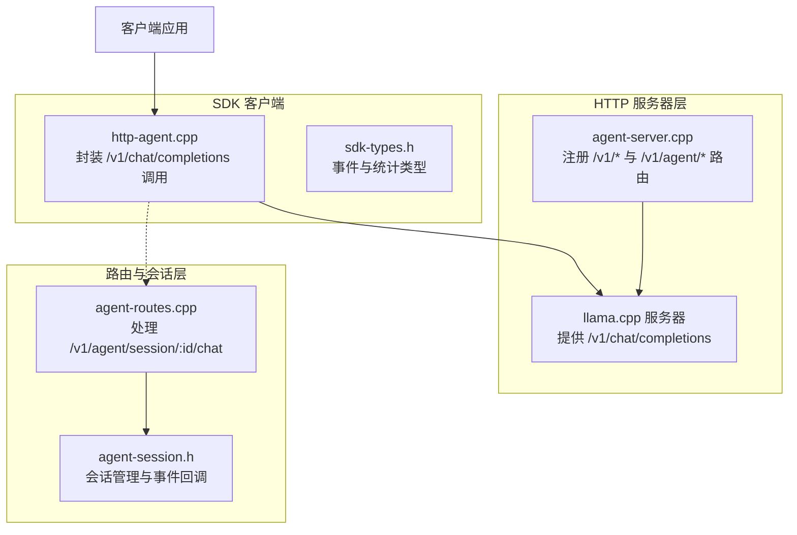
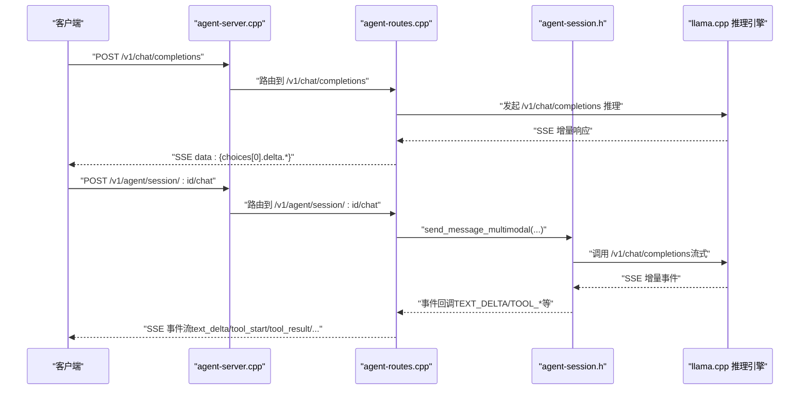
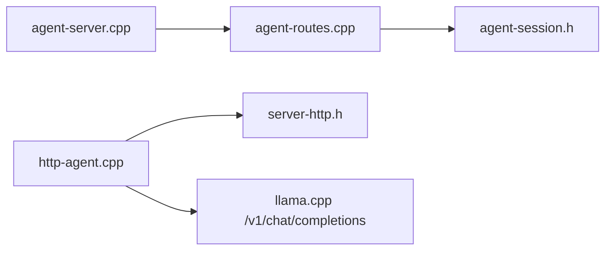

# 聊天补全 API

<cite>
**本文引用的文件**
- [agent-server.cpp](file://agent/server/agent-server.cpp)
- [agent-routes.cpp](file://agent/server/agent-routes.cpp)
- [agent-routes.h](file://agent/server/agent-routes.h)
- [agent-session.h](file://agent/server/agent-session.h)
- [http-agent.cpp](file://agent/sdk/http-agent.cpp)
- [http-agent.h](file://agent/sdk/http-agent.h)
- [sdk-types.h](file://agent/sdk/sdk-types.h)
- [SDK.md](file://agent/sdk/SDK.md)
- [server-http.h](file://third_party/llama.cpp/tools/server/server-http.h)
</cite>

## 目录
1. [简介](#简介)
2. [项目结构](#项目结构)
3. [核心组件](#核心组件)
4. [架构总览](#架构总览)
5. [详细组件分析](#详细组件分析)
6. [依赖关系分析](#依赖关系分析)
7. [性能考量](#性能考量)
8. [故障排查指南](#故障排查指南)
9. [结论](#结论)
10. [附录](#附录)

## 简介
本文件为聊天补全 API 的详细技术文档，聚焦于 /v1/chat/completions 端点的 HTTP 方法、URL 模式、请求/响应模式与认证方法；涵盖请求参数说明（messages、temperature、max_tokens 等）、响应格式定义、流式传输（SSE）实现细节；提供单轮与多轮对话的调用示例；记录错误处理策略、速率限制与版本信息；并给出与 OpenAI 兼容的 API 设计说明与最佳实践。

## 项目结构
本项目在 llama.cpp 基础之上扩展了 HTTP 服务器与代理路由，对外提供 OpenAI 兼容的 /v1/chat/completions 推理能力，并在 SDK 层实现“HTTP 版 agent loop”，支持工具调用、权限控制与多轮对话。

图表来源
- [agent-server.cpp:303-336](file://agent/server/agent-server.cpp#L303-L336)
- [agent-routes.cpp:475-494](file://agent/server/agent-routes.cpp#L475-L494)
- [http-agent.cpp:163-212](file://agent/sdk/http-agent.cpp#L163-L212)

章节来源
- [agent-server.cpp:303-336](file://agent/server/agent-server.cpp#L303-L336)
- [agent-routes.cpp:475-494](file://agent/server/agent-routes.cpp#L475-L494)
- [http-agent.cpp:163-212](file://agent/sdk/http-agent.cpp#L163-L212)

## 核心组件
- HTTP 服务器与路由
  - /v1/chat/completions：OpenAI 兼容的聊天补全端点，支持流式与非流式两种模式。
  - /v1/agent/session/:id/chat：内部代理聊天端点，支持 SSE 流式事件推送。
- 会话与事件
  - agent_session：维护消息历史、权限与统计信息，支持多轮对话与工具调用。
  - 事件类型：文本增量、推理内容增量、工具调用、权限请求/解决、迭代开始、完成、错误等。
- SDK 客户端
  - http_agent_session：封装 /v1/chat/completions 的调用，支持流式与非流式，聚合工具调用与权限交互。

章节来源
- [agent-session.h:65-145](file://agent/server/agent-session.h#L65-L145)
- [sdk-types.h:33-58](file://agent/sdk/sdk-types.h#L33-L58)
- [http-agent.cpp:163-212](file://agent/sdk/http-agent.cpp#L163-L212)

## 架构总览
下图展示了从客户端到推理引擎的整体调用链路，以及 SSE 事件在代理层的转发机制。

图表来源
- [agent-server.cpp:315-317](file://agent/server/agent-server.cpp#L315-L317)
- [agent-routes.cpp:201-348](file://agent/server/agent-routes.cpp#L201-L348)
- [agent-session.h:81-92](file://agent/server/agent-session.h#L81-L92)

## 详细组件分析

### 端点定义与路由
- /v1/chat/completions
  - 方法：POST
  - URL：/v1/chat/completions
  - 功能：OpenAI 兼容聊天补全，支持 stream=true 的流式返回。
- /v1/agent/session/:id/chat
  - 方法：POST
  - URL：/v1/agent/session/:id/chat
  - 功能：内部代理聊天端点，支持 SSE 事件流，推送 TEXT_DELTA、REASONING_DELTA、TOOL_START、TOOL_RESULT、PERMISSION_REQUIRED、PERMISSION_RESOLVED、ITERATION_START、COMPLETED、ERROR 等事件。

章节来源
- [agent-server.cpp:315-317](file://agent/server/agent-server.cpp#L315-L317)
- [agent-routes.cpp:475-494](file://agent/server/agent-routes.cpp#L475-L494)

### 请求参数与消息格式
- 通用参数（OpenAI 兼容）
  - model：模型标识符（Router 模式下按请求选择模型）。
  - messages：消息数组，每条消息包含 role 与 content。
  - stream：布尔值，true 表示启用流式返回。
  - tools/tool_choice：函数工具定义与选择策略（需启用 --jinja）。
  - 其他：temperature、top_p、max_tokens、presence_penalty、frequency_penalty 等（由 llama.cpp server 支持）。
- /v1/agent/session/:id/chat 特有
  - content：支持字符串（纯文本）或数组（OpenAI 多模态格式，含 text、image_url、input_audio 等）。
  - 媒体文件：当 content 为数组时，支持 base64 编码的图片与音频，服务端解码后参与推理。

章节来源
- [SDK.md:25-45](file://agent/sdk/SDK.md#L25-L45)
- [agent-routes.cpp:212-298](file://agent/server/agent-routes.cpp#L212-L298)

### 响应格式与流式传输（SSE）
- 非流式（stream=false）
  - 返回一次性 JSON，包含 choices[0].message（role、content、reasoning_content、tool_calls 等）。
- 流式（stream=true 或 /v1/agent/session/:id/chat）
  - SSE 数据行格式：data: <JSON>\n\n，结束行：data: [DONE]\n\n。
  - 增量字段：
    - choices[0].delta.content：文本增量。
    - choices[0].delta.reasoning_content：推理内容增量（llama.cpp 扩展）。
    - choices[0].delta.tool_calls：工具调用增量（按 index 聚合 arguments）。
  - SDK 聚合规则：
    - content/reasoning_content：按顺序追加。
    - tool_calls：按 index 聚合，function.arguments 以字符串增量拼接，直至 [DONE] 或结束条件。

章节来源
- [SDK.md:46-63](file://agent/sdk/SDK.md#L46-L63)
- [http-agent.cpp:300-365](file://agent/sdk/http-agent.cpp#L300-L365)

### 事件流（SSE 事件类型）
代理层 SSE 事件类型与负载：
- text_delta：{ "delta": "..." }
- reasoning_delta：{ "delta": "..." }
- tool_start：{ "name": "...", "arguments": "{...}" }
- tool_result：{ "name": "...", "success": true/false, "output": "...", "error": "", "elapsed_ms": 12 }
- permission_required：{ "request_id": "...", "tool": "...", "details": "{...}", "is_dangerous": true }
- permission_resolved：{ "request_id": "...", "allowed": true }
- iteration_start：{ "iteration": 1, "max_iterations": 50 }
- completed：{ "reason": "...", "stats": { ... } }
- error：{ "message": "..." }

章节来源
- [SDK.md:146-158](file://agent/sdk/SDK.md#L146-L158)
- [agent-routes.cpp:309-347](file://agent/server/agent-routes.cpp#L309-L347)

### 多轮对话与工具调用
- 多轮对话：SDK 维护 messages 数组，每轮将历史消息与当前 user 消息一起发送至 /v1/chat/completions。
- 工具调用：当 assistant 返回 tool_calls 时，SDK 在本地执行工具（按权限策略），并将工具结果以 role=tool 的消息回填至 messages，形成“HTTP 版 agent loop”。

章节来源
- [SDK.md:64-106](file://agent/sdk/SDK.md#L64-L106)
- [http-agent.cpp:617-700](file://agent/sdk/http-agent.cpp#L617-L700)

### 认证与安全
- /v1/chat/completions：支持 Authorization: Bearer <api_key>（与 llama.cpp server 的 API Key 中间件一致）。
- /v1/agent/*：未显式实现 API Key 校验，建议在网关或反向代理层进行鉴权。

章节来源
- [server-http.h:17-30](file://third_party/llama.cpp/tools/server/server-http.h#L17-L30)
- [agent-server.cpp:303-336](file://agent/server/agent-server.cpp#L303-L336)

### 错误处理策略
- 服务器异常包装：统一捕获异常并返回 JSON 错误响应，包含错误类型与消息。
- 请求校验：缺失必要字段（如 content、model、tools 等）时返回 4xx 错误。
- SSE 错误事件：当发生错误时，SSE 事件流会推送 error 事件并结束。

章节来源
- [agent-server.cpp:70-103](file://agent/server/agent-server.cpp#L70-L103)
- [agent-routes.cpp:19-34](file://agent/server/agent-routes.cpp#L19-L34)
- [agent-routes.cpp:296-298](file://agent/server/agent-routes.cpp#L296-L298)

### 速率限制与并发
- 代码中未发现显式的速率限制实现。
- 建议在网关或反向代理层实施限流策略，或在业务层通过会话并发控制与队列管理实现。

[本节为通用指导，无需列出具体文件来源]

### 版本信息
- 构建信息：通过 CMake 生成构建号、提交哈希、编译器与目标平台信息（由 llama.cpp common 子系统提供）。
- 项目版本：仓库根目录 CMakeLists 控制 llama.cpp 子模块与构建选项。

章节来源
- [CMakeLists.txt:1-44](file://CMakeLists.txt#L1-L44)

## 依赖关系分析
- 组件耦合
  - agent-server.cpp 通过 register_agent_routes 将 /v1/* 与 /v1/agent/* 路由绑定到 agent-routes。
  - agent-routes 依赖 agent_session_manager 与 agent_session，负责会话生命周期与事件回调。
  - SDK http-agent.cpp 依赖 server-http.h 的 HTTP 请求/响应抽象，封装 /v1/chat/completions 调用。
- 外部依赖
  - llama.cpp server 提供 /v1/chat/completions 推理能力。
  - cpp-httplib 用于 SDK 的 HTTP 客户端调用。

图表来源
- [agent-server.cpp:303-336](file://agent/server/agent-server.cpp#L303-L336)
- [agent-routes.cpp:475-494](file://agent/server/agent-routes.cpp#L475-L494)
- [http-agent.cpp:163-212](file://agent/sdk/http-agent.cpp#L163-L212)

章节来源
- [agent-server.cpp:303-336](file://agent/server/agent-server.cpp#L303-L336)
- [agent-routes.cpp:475-494](file://agent/server/agent-routes.cpp#L475-L494)
- [http-agent.cpp:163-212](file://agent/sdk/http-agent.cpp#L163-L212)

## 性能考量
- 流式传输：SSE 增量返回显著降低首字节延迟，适合实时对话场景。
- 工具调用：本地执行工具会增加额外开销，建议合理设置 max_iterations 与工具白名单。
- 模型选择：Router 模式下按请求切换模型，注意模型加载与上下文切换成本。
- 超时配置：SDK 提供 request_timeout_ms、tool_timeout_ms 等超时参数，建议根据场景调整。

[本节为通用指导，无需列出具体文件来源]

## 故障排查指南
- 常见错误
  - 缺少 content 字段：返回 400，提示缺少 content。
  - JSON 解析失败：返回 400，提示无效 JSON。
  - 会话不存在：返回 404，提示会话未找到。
  - 服务器异常：统一返回 500，包含错误详情。
- 排查步骤
  - 确认 /health 与 /v1/models 可用性。
  - 检查 Authorization 头与 API Key 设置。
  - 观察 SSE 事件流中的 error 事件定位问题。
  - 在 SDK 层打印/记录 usage 与工具调用耗时。

章节来源
- [agent-routes.cpp:19-34](file://agent/server/agent-routes.cpp#L19-L34)
- [agent-routes.cpp:296-298](file://agent/server/agent-routes.cpp#L296-L298)
- [agent-server.cpp:70-103](file://agent/server/agent-server.cpp#L70-L103)

## 结论
本项目在 llama.cpp 基础上提供了 OpenAI 兼容的 /v1/chat/completions 推理能力，并通过 SDK 实现了“HTTP 版 agent loop”。其 /v1/agent/session/:id/chat 端点以 SSE 事件流形式提供丰富的交互体验，适用于多轮对话、工具调用与权限控制等复杂场景。建议结合网关层实施鉴权与限流策略，并根据实际负载调整超时与并发参数。

[本节为总结性内容，无需列出具体文件来源]

## 附录

### API 调用示例（概念性说明）
- 单轮对话（非流式）
  - POST /v1/chat/completions
  - Body：包含 model、messages、tools、tool_choice、stream=false
  - 返回：一次性 JSON，choices[0].message 包含 content/reasoning_content/tool_calls
- 单轮对话（流式）
  - POST /v1/chat/completions
  - Body：包含 model、messages、tools、tool_choice、stream=true
  - 返回：SSE 流，data: {choices[0].delta.*}，最后 data: [DONE]
- 多轮对话（代理端点）
  - POST /v1/agent/session/:id/chat
  - Body：包含 content（字符串或数组，支持多模态）
  - 返回：SSE 事件流，推送 text_delta、tool_start、tool_result、permission_*、completed/error 等

章节来源
- [SDK.md:25-45](file://agent/sdk/SDK.md#L25-L45)
- [SDK.md:46-63](file://agent/sdk/SDK.md#L46-L63)
- [agent-routes.cpp:201-348](file://agent/server/agent-routes.cpp#L201-L348)

### OpenAI 兼容设计说明与最佳实践
- 兼容性
  - /v1/chat/completions 严格遵循 OpenAI Chat Completions 协议，支持 tools/tool_choice、stream、usage 等。
  - /v1/agent/* 为扩展端点，提供更丰富的事件流与权限控制。
- 最佳实践
  - 使用 tools 与 tool_choice 精准控制工具暴露范围。
  - 在 SDK 层聚合 tool_calls，确保 arguments 的 JSON 解析与执行。
  - 通过 include_usage 与 stats 字段监控 token 使用与耗时。
  - 在生产环境通过网关层实施 API Key 与速率限制。

章节来源
- [SDK.md:17-45](file://agent/sdk/SDK.md#L17-L45)
- [http-agent.cpp:702-800](file://agent/sdk/http-agent.cpp#L702-L800)