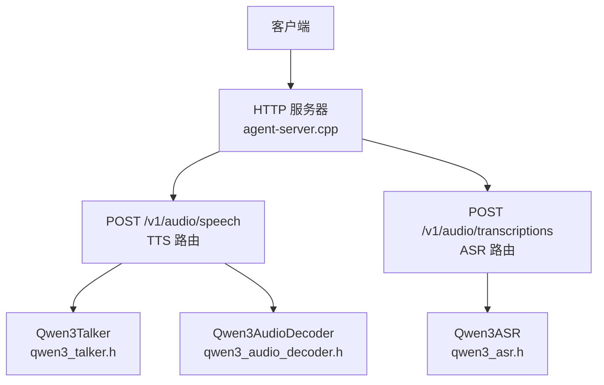
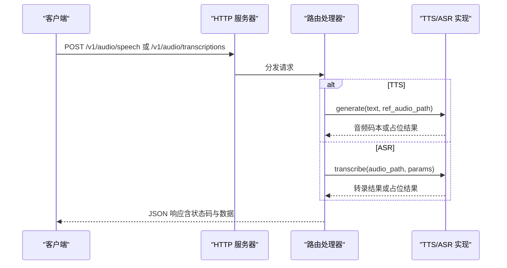
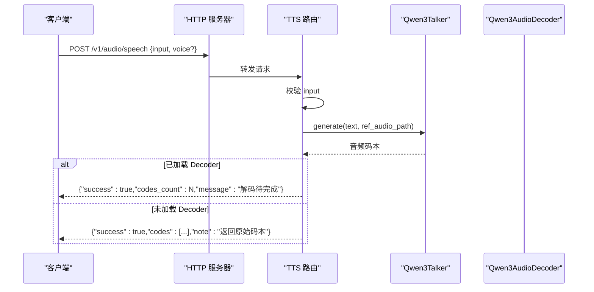
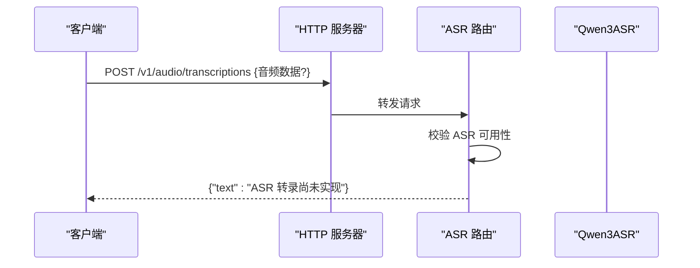
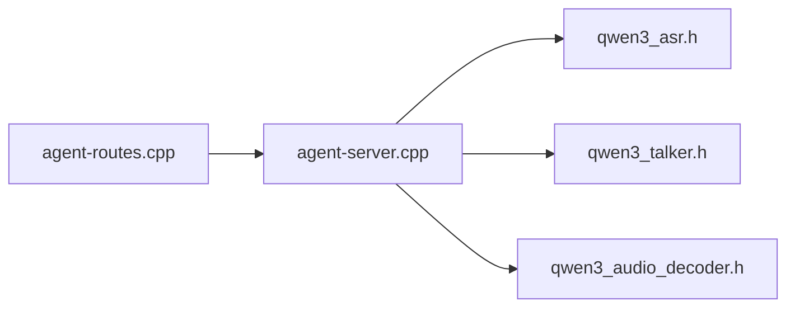

# 音频服务 API

<cite>
**本文引用的文件**
- [agent-server.cpp](file://agent/server/agent-server.cpp)
- [agent-routes.cpp](file://agent/server/agent-routes.cpp)
- [qwen3_talker.h](file://third_party/qwen3-tts-cpp/cpp/qwen3_talker.h)
- [qwen3_audio_decoder.h](file://third_party/qwen3-tts-cpp/cpp/qwen3_audio_decoder.h)
- [qwen3_asr.h](file://third_party/qwen3-asr.cpp/src/qwen3_asr.h)
- [README.md（Qwen3-TTS.cpp）](file://third_party/qwen3-tts-cpp/README.md)
- [README.md（Qwen3-ASR.cpp）](file://third_party/qwen3-asr.cpp/README.md)
</cite>

## 目录
1. [简介](#简介)
2. [项目结构](#项目结构)
3. [核心组件](#核心组件)
4. [架构总览](#架构总览)
5. [详细组件分析](#详细组件分析)
6. [依赖关系分析](#依赖关系分析)
7. [性能考量](#性能考量)
8. [故障排查指南](#故障排查指南)
9. [结论](#结论)
10. [附录](#附录)

## 简介
本文件为音频服务 API 的详细技术文档，聚焦于以下两个端点：
- POST /v1/audio/speech：文本转语音（TTS）能力
- POST /v1/audio/transcriptions：语音转文字（ASR）能力

文档内容涵盖：
- 输入参数定义与校验
- 音频生成与转录流程
- 输出格式与质量控制要点
- 当前实现状态与限制
- 配置选项、错误处理策略
- 与代理系统（Agent Server）的集成方式与扩展建议

## 项目结构
音频服务由主服务进程加载第三方模型库，并通过 HTTP 路由暴露 OpenAI 兼容的 /v1 音频接口。核心文件与职责如下：
- agent/server/agent-server.cpp：HTTP 服务入口，注册 /v1/audio/* 路由，初始化 ASR/TTS 模型实例
- third_party/qwen3-asr.cpp/src/qwen3_asr.h：ASR 主类与推理接口
- third_party/qwen3-tts-cpp/cpp/qwen3_talker.h：TTS Talker（文本到音频码本）
- third_party/qwen3-tts-cpp/cpp/qwen3_audio_decoder.h：TTS Tokenizer（音频码本到波形）
- agent/server/agent-routes.cpp：通用代理路由（非本次重点，但展示了 SSE 流式响应模式）

图表来源
- [agent-server.cpp:428-497](file://agent/server/agent-server.cpp#L428-L497)
- [qwen3_talker.h:1-24](file://third_party/qwen3-tts-cpp/cpp/qwen3_talker.h#L1-L24)
- [qwen3_audio_decoder.h:1-37](file://third_party/qwen3-tts-cpp/cpp/qwen3_audio_decoder.h#L1-L37)
- [qwen3_asr.h:1-116](file://third_party/qwen3-asr.cpp/src/qwen3_asr.h#L1-L116)

章节来源
- [agent-server.cpp:428-497](file://agent/server/agent-server.cpp#L428-L497)

## 核心组件
- TTS Talker（文本到音频码本）
  - 接口：generate(text, ref_audio_path) → 返回音频码本序列
  - 用途：将输入文本与参考音频转换为音频码本
- TTS Tokenizer（音频码本到波形）
  - 接口：load_weights(...)；build_graph(codes) → 计算图
  - 用途：将码本解码为可播放的 PCM 波形（当前路由返回占位结果）
- ASR（语音转文字）
  - 接口：load_model(...)；transcribe(audio_path/samples, params) → 结果对象
  - 用途：对 WAV（16kHz 单声道）进行转录，当前路由返回占位实现

章节来源
- [qwen3_talker.h:1-24](file://third_party/qwen3-tts-cpp/cpp/qwen3_talker.h#L1-L24)
- [qwen3_audio_decoder.h:1-37](file://third_party/qwen3-tts-cpp/cpp/qwen3_audio_decoder.h#L1-L37)
- [qwen3_asr.h:1-116](file://third_party/qwen3-asr.cpp/src/qwen3_asr.h#L1-L116)

## 架构总览
音频服务在启动时根据命令行参数加载 ASR/TTS 模型，并注册 /v1/audio/* 路由。请求到达后，服务进行参数解析与校验，调用对应模型执行推理，最终以 JSON 响应返回。

图表来源
- [agent-server.cpp:428-497](file://agent/server/agent-server.cpp#L428-L497)
- [qwen3_talker.h:15-17](file://third_party/qwen3-tts-cpp/cpp/qwen3_talker.h#L15-L17)
- [qwen3_asr.h:60-69](file://third_party/qwen3-asr.cpp/src/qwen3_asr.h#L60-L69)

## 详细组件分析

### POST /v1/audio/speech（TTS）
- 请求体字段
  - input（必需）：待合成的文本
  - voice（可选，默认值）：声线标识（当前未做具体解析，保留默认行为）
- 处理流程
  - 解析 JSON，校验 input 是否为空
  - 调用 Qwen3Talker.generate(text, ref_audio_path) 生成音频码本
  - 若已加载 Qwen3AudioDecoder，则返回“解码待完成”的占位信息；否则直接返回原始码本
- 输出
  - 成功时返回 JSON，包含 success、codes_count 或 codes 列表，以及提示信息
  - 失败时返回 500 与错误信息
- 质量与格式控制
  - 参考音频路径用于风格迁移（若模型支持）
  - 当前路由未实现音频解码，因此无法直接返回 WAV/PCM 文件流

图表来源
- [agent-server.cpp:429-481](file://agent/server/agent-server.cpp#L429-L481)
- [qwen3_talker.h:15-17](file://third_party/qwen3-tts-cpp/cpp/qwen3_talker.h#L15-L17)
- [qwen3_audio_decoder.h:23-25](file://third_party/qwen3-tts-cpp/cpp/qwen3_audio_decoder.h#L23-L25)

章节来源
- [agent-server.cpp:429-481](file://agent/server/agent-server.cpp#L429-L481)
- [qwen3_talker.h:15-17](file://third_party/qwen3-tts-cpp/cpp/qwen3_talker.h#L15-L17)

### POST /v1/audio/transcriptions（ASR）
- 请求体字段
  - 当前路由未解析请求体（占位实现）
- 处理流程
  - 校验 ASR 模型是否已启用与加载成功
  - 返回占位响应（尚未实现实际转录逻辑）
- 输出
  - 成功时返回 JSON，包含占位文本
  - 未启用或未加载时返回 503 与错误信息

图表来源
- [agent-server.cpp:483-497](file://agent/server/agent-server.cpp#L483-L497)
- [qwen3_asr.h:60-69](file://third_party/qwen3-asr.cpp/src/qwen3_asr.h#L60-L69)

章节来源
- [agent-server.cpp:483-497](file://agent/server/agent-server.cpp#L483-L497)
- [qwen3_asr.h:60-69](file://third_party/qwen3-asr.cpp/src/qwen3_asr.h#L60-L69)

### 与代理系统的集成与扩展
- 集成方式
  - 在 agent-server.cpp 中注册 /v1/audio/* 路由，统一由 HTTP 上下文处理
  - 通过命令行参数启用/加载 ASR/TTS 模型，并在启动阶段初始化全局实例
- 扩展可能性
  - 将 ASR/TTS 实现封装为工具（Tools），供代理会话调用
  - 在代理消息中携带 input_audio 字段，结合多模态处理链路
  - 提供 SSE 流式输出（参考代理路由中的 SSE 实现模式）

章节来源
- [agent-server.cpp:150-212](file://agent/server/agent-server.cpp#L150-L212)
- [agent-routes.cpp:266-286](file://agent/server/agent-routes.cpp#L266-L286)

## 依赖关系分析
- 组件耦合
  - agent-server.cpp 直接依赖第三方头文件（ASR/TTS 类声明）
  - 路由层仅负责参数解析与错误处理，推理逻辑由第三方库承担
- 外部依赖
  - ASR/TTS 模型以 GGUF 格式加载，需准备对应权重文件
  - 服务启动时通过命令行参数指定模型路径

图表来源
- [agent-server.cpp:42-46](file://agent/server/agent-server.cpp#L42-L46)
- [agent-routes.cpp:1-10](file://agent/server/agent-routes.cpp#L1-L10)

章节来源
- [agent-server.cpp:42-46](file://agent/server/agent-server.cpp#L42-L46)
- [agent-routes.cpp:1-10](file://agent/server/agent-routes.cpp#L1-L10)

## 性能考量
- ASR 性能特性（来自第三方实现说明）
  - 支持 Flash Attention、Metal 加速、加速库 vDSP/Accelerate 等优化
  - 对 92 秒音频的基准耗时与内存占用有明确统计
- TTS 性能特性（来自第三方实现说明）
  - 使用 llama.cpp 与 GGML 后端，支持量化与多平台优化
  - 当前处于早期开发阶段，音频解码器仍在实现中
- 建议
  - 在生产环境优先使用量化模型以降低内存占用
  - 合理设置线程数与批处理参数，避免过度并发导致抖动
  - 对于 TTS，尽量提前加载模型并复用实例，减少冷启动开销

章节来源
- [README.md（Qwen3-ASR.cpp）:127-151](file://third_party/qwen3-asr.cpp/README.md#L127-L151)
- [README.md（Qwen3-TTS.cpp）:7-8](file://third_party/qwen3-tts-cpp/README.md#L7-L8)

## 故障排查指南
- 常见错误与处理
  - 503 服务不可用：ASR/TTS 未启用或模型加载失败
  - 400 缺少参数：POST /v1/audio/speech 未提供 input
  - 500 服务器内部错误：模型推理异常或参数解析失败
- 排查步骤
  - 确认命令行参数已正确传入模型路径
  - 检查模型文件是否存在且为有效 GGUF 格式
  - 查看服务日志中的模型加载与推理阶段耗时
  - 对于 TTS，确认已加载 Tokenizer 模型以获得完整音频输出

章节来源
- [agent-server.cpp:430-480](file://agent/server/agent-server.cpp#L430-L480)

## 结论
- /v1/audio/speech 当前实现了从文本到音频码本的生成，并在已加载解码器时返回“解码待完成”的占位信息；未加载解码器时返回原始码本，便于上层进一步处理。
- /v1/audio/transcriptions 当前为占位实现，尚未接入实际转录逻辑。
- 建议在后续版本中完善 ASR 的请求体解析与响应格式，同时实现 TTS 的完整音频解码与流式输出。

## 附录

### API 定义与参数说明
- POST /v1/audio/speech
  - 请求体字段
    - input（字符串，必填）：待合成的文本
    - voice（字符串，可选）：声线标识（当前未做具体解析）
  - 响应
    - 成功：返回包含 success、codes_count 或 codes 的 JSON
    - 失败：返回包含 error 的 JSON，状态码 500 或 400

- POST /v1/audio/transcriptions
  - 请求体字段
    - 当前占位：尚未解析请求体
  - 响应
    - 成功：返回占位文本
    - 失败：返回错误信息，状态码 503

章节来源
- [agent-server.cpp:429-497](file://agent/server/agent-server.cpp#L429-L497)

### 配置选项
- 启用与加载
  - --asr-model <路径>：启用并加载 ASR 模型
  - --tts-model <路径>：启用并加载 TTS Talker 模型
  - --tts-tokenizer-model <路径>：加载 TTS Tokenizer 模型（用于音频解码）
  - --tts-ref-audio <路径>：设置参考音频路径（用于风格迁移）
- 行为
  - 未提供模型路径时，对应服务将以 503 响应拒绝请求
  - 路由层对参数进行基础校验（如 input 必填）

章节来源
- [agent-server.cpp:150-212](file://agent/server/agent-server.cpp#L150-L212)

### 错误处理与返回码
- 503：服务不可用（ASR/TTS 未启用或未加载）
- 400：请求参数无效（如缺少 input）
- 500：服务器内部错误（模型推理异常）

章节来源
- [agent-server.cpp:430-480](file://agent/server/agent-server.cpp#L430-L480)

### 使用示例（基于现有实现）
- TTS（占位）
  - 请求：POST /v1/audio/speech，Body 包含 { "input": "你好世界" }
  - 响应：包含 success 与 codes_count 或 codes 的 JSON
- ASR（占位）
  - 请求：POST /v1/audio/transcriptions
  - 响应：包含占位文本的 JSON

章节来源
- [agent-server.cpp:429-497](file://agent/server/agent-server.cpp#L429-L497)