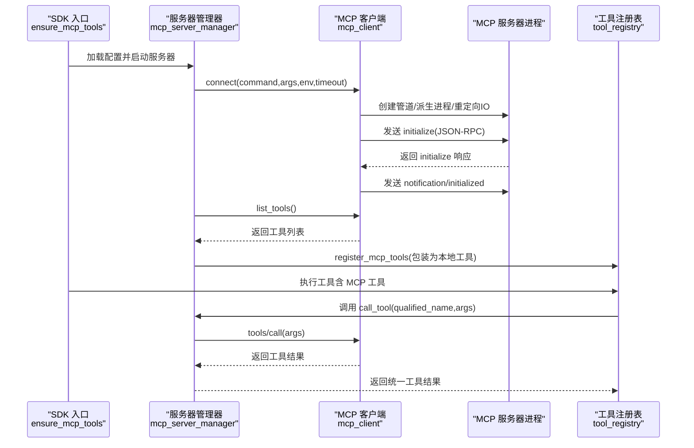
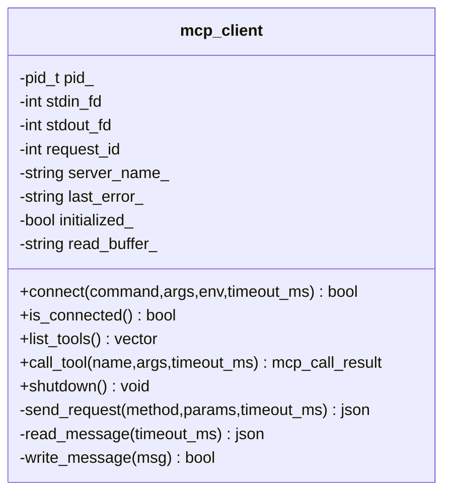
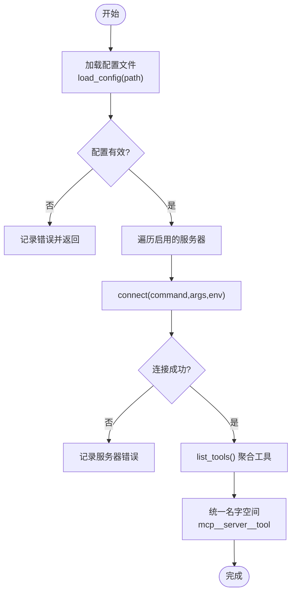
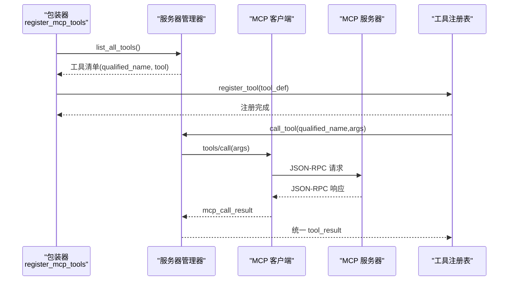
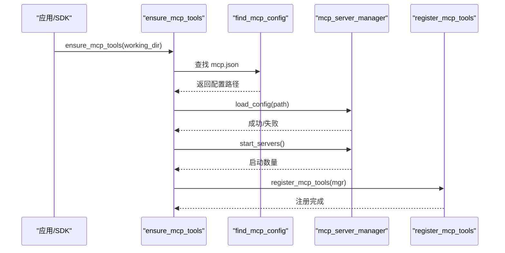
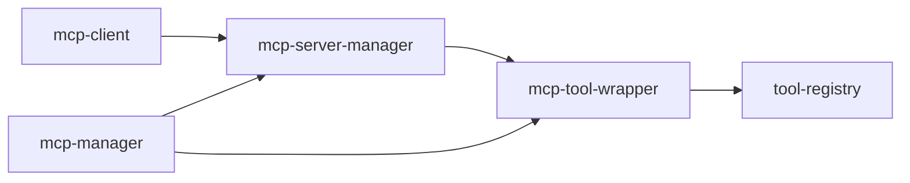

# MCP 协议支持

<cite>
**本文引用的文件**
- [mcp-client.h](file://agent/mcp/mcp-client.h)
- [mcp-client.cpp](file://agent/mcp/mcp-client.cpp)
- [mcp-server-manager.h](file://agent/mcp/mcp-server-manager.h)
- [mcp-server-manager.cpp](file://agent/mcp/mcp-server-manager.cpp)
- [mcp-tool-wrapper.h](file://agent/mcp/mcp-tool-wrapper.h)
- [mcp-tool-wrapper.cpp](file://agent/mcp/mcp-tool-wrapper.cpp)
- [mcp-manager.h](file://agent/sdk/mcp-manager.h)
- [mcp-manager.cpp](file://agent/sdk/mcp-manager.cpp)
- [tool-registry.h](file://agent/tool-registry.h)
- [SDK.md](file://agent/sdk/SDK.md)
- [tool-read.cpp](file://agent/tools/tool-read.cpp)
- [tool-write.cpp](file://agent/tools/tool-write.cpp)
</cite>

## 目录
1. [简介](#简介)
2. [项目结构](#项目结构)
3. [核心组件](#核心组件)
4. [架构总览](#架构总览)
5. [详细组件分析](#详细组件分析)
6. [依赖关系分析](#依赖关系分析)
7. [性能考量](#性能考量)
8. [故障排查指南](#故障排查指南)
9. [结论](#结论)
10. [附录](#附录)

## 简介
本文件面向 MCP（Model Context Protocol）协议支持在本项目的实现，聚焦以下方面：
- MCP 客户端实现：基于标准输入/输出的 JSON-RPC 2.0 传输，负责启动外部 MCP 服务器进程、握手初始化、列出工具、调用工具以及优雅关闭。
- MCP 服务器管理：集中管理多个 MCP 服务器配置，按配置启动进程、发现工具、统一名字空间、转发工具调用。
- 工具包装器：将 MCP 工具注册为本地工具，桥接 MCP 内容输出到统一工具执行结果。
- 协议规范与消息格式：对接 MCP 协议版本、初始化握手、通知、工具列表与调用响应的消息结构。
- 使用场景与配置模板：提供 MCP 服务器配置文件位置、环境变量替换、工具命名规范与调用流程。
- 错误处理与调试：超时、断连、解析错误、进程生命周期管理等。

## 项目结构
围绕 MCP 的核心文件组织如下：
- agent/mcp：MCP 客户端、服务器管理器、工具包装器
- agent/sdk：SDK 管理入口（确保 MCP 工具可用）
- agent/tool-registry.h：工具注册与执行框架
- agent/tools：内置工具示例（与 MCP 工具协同工作）

```mermaid
graph TB
subgraph "MCP 子系统"
A["mcp-client<br/>JSON-RPC over stdio"] --> B["mcp-server-manager<br/>多服务器管理"]
B --> C["mcp-tool-wrapper<br/>注册 MCP 工具到工具注册表"]
end
subgraph "SDK 集成"
D["mcp-manager<br/>ensure_mcp_tools"] --> B
D --> C
end
subgraph "工具生态"
E["tool-registry<br/>工具注册/执行框架"] <-- "被包装器注册"
F["tool-read.cpp"]
G["tool-write.cpp"]
end
C --> E
E --> F
E --> G
```

图表来源
- [mcp-client.h:34-96](file://agent/mcp/mcp-client.h#L34-L96)
- [mcp-client.cpp:21-122](file://agent/mcp/mcp-client.cpp#L21-L122)
- [mcp-server-manager.h:21-67](file://agent/mcp/mcp-server-manager.h#L21-L67)
- [mcp-server-manager.cpp:82-107](file://agent/mcp/mcp-server-manager.cpp#L82-L107)
- [mcp-tool-wrapper.h:1-8](file://agent/mcp/mcp-tool-wrapper.h#L1-L8)
- [mcp-tool-wrapper.cpp:7-63](file://agent/mcp/mcp-tool-wrapper.cpp#L7-L63)
- [mcp-manager.h:1-11](file://agent/sdk/mcp-manager.h#L1-L11)
- [mcp-manager.cpp:12-34](file://agent/sdk/mcp-manager.cpp#L12-L34)
- [tool-registry.h:58-90](file://agent/tool-registry.h#L58-L90)

章节来源
- [mcp-client.h:1-97](file://agent/mcp/mcp-client.h#L1-L97)
- [mcp-client.cpp:1-364](file://agent/mcp/mcp-client.cpp#L1-L364)
- [mcp-server-manager.h:1-71](file://agent/mcp/mcp-server-manager.h#L1-L71)
- [mcp-server-manager.cpp:1-245](file://agent/mcp/mcp-server-manager.cpp#L1-L245)
- [mcp-tool-wrapper.h:1-8](file://agent/mcp/mcp-tool-wrapper.h#L1-L8)
- [mcp-tool-wrapper.cpp:1-64](file://agent/mcp/mcp-tool-wrapper.cpp#L1-L64)
- [mcp-manager.h:1-11](file://agent/sdk/mcp-manager.h#L1-L11)
- [mcp-manager.cpp:1-48](file://agent/sdk/mcp-manager.cpp#L1-L48)
- [tool-registry.h:1-103](file://agent/tool-registry.h#L1-L103)

## 核心组件
- MCP 客户端（mcp_client）
  - 通过管道连接外部 MCP 服务器进程，实现 JSON-RPC over stdio。
  - 完成初始化握手、发送“已初始化”通知、列出工具、调用工具、读取/写入消息、超时与断连处理、优雅关闭。
- MCP 服务器管理器（mcp_server_manager）
  - 加载 JSON 配置，按配置启动服务器，管理连接状态，统一名字空间（mcp__server__tool），转发工具调用。
  - 支持环境变量占位符替换与配置校验。
- MCP 工具包装器（register_mcp_tools）
  - 将 MCP 工具注册为本地工具，转换 MCP 内容为统一输出，桥接到工具执行结果。
- SDK 管理入口（ensure_mcp_tools）
  - 在 SDK 初始化阶段按需加载 MCP 配置、启动服务器并注册工具。
- 工具注册表（tool_registry）
  - 统一的工具注册、查找、执行与导出接口，支撑 MCP 工具与内置工具共存。

章节来源
- [mcp-client.h:34-96](file://agent/mcp/mcp-client.h#L34-L96)
- [mcp-client.cpp:21-122](file://agent/mcp/mcp-client.cpp#L21-L122)
- [mcp-server-manager.h:21-67](file://agent/mcp/mcp-server-manager.h#L21-L67)
- [mcp-server-manager.cpp:21-107](file://agent/mcp/mcp-server-manager.cpp#L21-L107)
- [mcp-tool-wrapper.cpp:7-63](file://agent/mcp/mcp-tool-wrapper.cpp#L7-L63)
- [mcp-manager.cpp:12-34](file://agent/sdk/mcp-manager.cpp#L12-L34)
- [tool-registry.h:58-90](file://agent/tool-registry.h#L58-L90)

## 架构总览
MCP 协议支持在本项目中的整体交互如下：



图表来源
- [mcp-manager.cpp:12-34](file://agent/sdk/mcp-manager.cpp#L12-L34)
- [mcp-server-manager.cpp:82-107](file://agent/mcp/mcp-server-manager.cpp#L82-L107)
- [mcp-client.cpp:21-122](file://agent/mcp/mcp-client.cpp#L21-L122)
- [mcp-tool-wrapper.cpp:7-63](file://agent/mcp/mcp-tool-wrapper.cpp#L7-L63)
- [tool-registry.h:58-90](file://agent/tool-registry.h#L58-L90)

## 详细组件分析

### MCP 客户端（mcp_client）
- 连接与进程管理
  - 通过管道与外部 MCP 服务器建立 stdio 通道，重定向子进程的 stdin/stdout/stderr。
  - 支持环境变量注入与非阻塞读取以实现超时控制。
- 初始化握手
  - 发送 initialize 请求，包含协议版本、能力对象与客户端信息；收到响应后发送 notification/initialized。
- 工具管理
  - 调用 tools/list 获取工具清单；调用 tools/call 执行工具，解析 isError 与 content 数组。
- 消息读写
  - 按行读取 JSON 文本，解析失败跳过；写入时追加换行符。
- 超时与错误
  - send_request 中基于 steady_clock 计算剩余时间；read_message/poll/read/write 中处理超时、EINTR、断连等。
- 关闭流程
  - 优先关闭 stdin 触发服务器优雅退出，短暂等待后尝试 SIGTERM/SIGKILL 强制终止。



图表来源
- [mcp-client.h:34-96](file://agent/mcp/mcp-client.h#L34-L96)
- [mcp-client.cpp:17-363](file://agent/mcp/mcp-client.cpp#L17-L363)

章节来源
- [mcp-client.h:34-96](file://agent/mcp/mcp-client.h#L34-L96)
- [mcp-client.cpp:21-122](file://agent/mcp/mcp-client.cpp#L21-L122)
- [mcp-client.cpp:230-275](file://agent/mcp/mcp-client.cpp#L230-L275)
- [mcp-client.cpp:277-348](file://agent/mcp/mcp-client.cpp#L277-L348)
- [mcp-client.cpp:350-363](file://agent/mcp/mcp-client.cpp#L350-L363)

### MCP 服务器管理器（mcp_server_manager）
- 配置加载
  - 从 JSON 文件读取 servers 对象，校验命令、参数、环境变量、启用状态与超时配置；支持环境变量占位符替换。
- 启动与连接
  - 逐个启动启用的服务器，使用 mcp_client.connect 完成握手；记录连接状态。
- 工具聚合与调用
  - 聚合所有已连接服务器的工具，统一名字空间为“mcp__server__tool”，解析名称并转发调用。
- 名称规范
  - 将服务器与工具名中的双下划线替换为单下划线，避免歧义。
- 配置文件定位
  - 优先工作目录下的 mcp.json，其次用户配置目录 ~/.llama-agent/mcp.json。



图表来源
- [mcp-server-manager.cpp:21-80](file://agent/mcp/mcp-server-manager.cpp#L21-L80)
- [mcp-server-manager.cpp:82-107](file://agent/mcp/mcp-server-manager.cpp#L82-L107)
- [mcp-server-manager.cpp:110-124](file://agent/mcp/mcp-server-manager.cpp#L110-L124)
- [mcp-server-manager.cpp:173-188](file://agent/mcp/mcp-server-manager.cpp#L173-L188)

章节来源
- [mcp-server-manager.h:11-67](file://agent/mcp/mcp-server-manager.h#L11-L67)
- [mcp-server-manager.cpp:21-80](file://agent/mcp/mcp-server-manager.cpp#L21-L80)
- [mcp-server-manager.cpp:82-107](file://agent/mcp/mcp-server-manager.cpp#L82-L107)
- [mcp-server-manager.cpp:110-124](file://agent/mcp/mcp-server-manager.cpp#L110-L124)
- [mcp-server-manager.cpp:173-208](file://agent/mcp/mcp-server-manager.cpp#L173-L208)
- [mcp-server-manager.cpp:228-244](file://agent/mcp/mcp-server-manager.cpp#L228-L244)

### MCP 工具包装器（register_mcp_tools）
- 工具枚举与注册
  - 从 mcp_server_manager 获取所有工具，转换为本地工具定义（名称、描述、参数 schema）。
- 执行桥接
  - 包装执行函数，调用 mcp_server_manager.call_tool，将 MCP 内容项（text/image/resource）转换为统一输出字符串。
- 生命周期
  - 依赖管理器存活，确保回调持有有效指针。



图表来源
- [mcp-tool-wrapper.cpp:7-63](file://agent/mcp/mcp-tool-wrapper.cpp#L7-L63)
- [mcp-server-manager.cpp:126-158](file://agent/mcp/mcp-server-manager.cpp#L126-L158)
- [mcp-client.cpp:169-192](file://agent/mcp/mcp-client.cpp#L169-L192)

章节来源
- [mcp-tool-wrapper.h:1-8](file://agent/mcp/mcp-tool-wrapper.h#L1-L8)
- [mcp-tool-wrapper.cpp:7-63](file://agent/mcp/mcp-tool-wrapper.cpp#L7-L63)
- [mcp-server-manager.cpp:126-158](file://agent/mcp/mcp-server-manager.cpp#L126-L158)

### SDK 集成入口（ensure_mcp_tools）
- 单例与互斥
  - 使用静态变量与互斥锁保证初始化幂等性。
- 配置发现与加载
  - 查找 mcp.json，加载配置并启动服务器，注册工具。
- 平台差异
  - 非 Windows 平台启用 MCP；Windows 平台为空实现。



图表来源
- [mcp-manager.cpp:12-34](file://agent/sdk/mcp-manager.cpp#L12-L34)
- [mcp-server-manager.cpp:228-244](file://agent/mcp/mcp-server-manager.cpp#L228-L244)

章节来源
- [mcp-manager.h:1-11](file://agent/sdk/mcp-manager.h#L1-L11)
- [mcp-manager.cpp:12-34](file://agent/sdk/mcp-manager.cpp#L12-L34)

### 工具注册表（tool_registry）
- 工具定义与执行
  - tool_def 包含名称、描述、参数 schema 与执行函数；支持将工具转为通用 chat 工具格式。
- 注册与查找
  - 提供注册、按名查找、导出全部工具等功能。
- 与 MCP 的协作
  - MCP 工具经包装后以统一形式注册，与内置工具共享执行框架。

章节来源
- [tool-registry.h:44-90](file://agent/tool-registry.h#L44-L90)

## 依赖关系分析
- 组件耦合
  - mcp_server_manager 依赖 mcp_client；mcp_tool_wrapper 依赖 mcp_server_manager 与 tool_registry。
  - SDK 入口 mcp-manager 依赖 mcp-server-manager 与 mcp-tool-wrapper。
- 外部依赖
  - JSON 解析使用 nlohmann/json；进程与 IO 使用 POSIX 系列系统调用。
- 循环依赖
  - 未发现直接循环依赖；包装器通过回调持有管理器指针，需确保生命周期正确。



图表来源
- [mcp-client.h:3-8](file://agent/mcp/mcp-client.h#L3-L8)
- [mcp-server-manager.h:3-3](file://agent/mcp/mcp-server-manager.h#L3-L3)
- [mcp-tool-wrapper.h:3-3](file://agent/mcp/mcp-tool-wrapper.h#L3-L3)
- [mcp-manager.cpp:5-6](file://agent/sdk/mcp-manager.cpp#L5-L6)

章节来源
- [mcp-client.h:3-8](file://agent/mcp/mcp-client.h#L3-L8)
- [mcp-server-manager.h:3-3](file://agent/mcp/mcp-server-manager.h#L3-L3)
- [mcp-tool-wrapper.h:3-3](file://agent/mcp/mcp-tool-wrapper.h#L3-L3)
- [mcp-manager.cpp:5-6](file://agent/sdk/mcp-manager.cpp#L5-L6)

## 性能考量
- I/O 非阻塞与超时
  - 通过非阻塞 stdout 与 poll 实现超时控制，避免长时间阻塞导致的卡顿。
- 缓冲与解析
  - 行缓冲解析 JSON，减少内存占用；解析失败跳过，提高鲁棒性。
- 进程生命周期
  - 优雅关闭优先，随后强制终止，兼顾稳定性与资源回收。
- 工具调用并发
  - 当前实现为顺序调用；如需并发，可在管理器层引入任务队列与超时策略。

## 故障排查指南
- 连接失败
  - 检查命令是否存在、参数与环境变量是否正确、工作目录权限。
  - 查看 mcp_client 的 last_error 与 connect 返回值。
- 握手异常
  - 确认 MCP 服务器支持协议版本；检查 initialize 响应是否包含 serverInfo/name。
- 工具列表为空
  - 确认服务器已发送 notification/initialized；检查 tools/list 是否返回数组。
- 工具调用超时
  - 调整配置中的 timeout_ms；检查服务器处理能力与网络延迟。
- 断连与进程退出
  - 检查服务器日志（stderr 已重定向至 /dev/null）；确认父进程是否提前关闭 stdin。
- 名称解析错误
  - 确认工具名称格式为“mcp__server__tool”，且 server/tool 名称不含非法字符。

章节来源
- [mcp-client.cpp:21-122](file://agent/mcp/mcp-client.cpp#L21-L122)
- [mcp-client.cpp:230-275](file://agent/mcp/mcp-client.cpp#L230-L275)
- [mcp-client.cpp:277-348](file://agent/mcp/mcp-client.cpp#L277-L348)
- [mcp-server-manager.cpp:126-158](file://agent/mcp/mcp-server-manager.cpp#L126-L158)

## 结论
本实现以轻量、稳健为目标，通过 stdio 传输与 JSON-RPC 2.0 完成 MCP 协议交互，具备：
- 可靠的进程管理与超时控制
- 清晰的工具命名与注册机制
- 与现有工具注册表无缝集成
- 易于扩展的配置与环境变量支持

建议在生产环境中：
- 为 MCP 服务器单独输出日志以便调试
- 为工具调用设置合理的超时与重试策略
- 对工具名称进行白名单校验，防止恶意命名

## 附录

### MCP 协议要点与消息格式
- 协议版本
  - 初始化请求包含 protocolVersion 与 clientInfo。
- 初始化握手
  - 客户端发送 initialize；服务器返回 initialize 响应；客户端发送 notification/initialized。
- 工具列表与调用
  - tools/list 返回工具数组；tools/call 返回 isError 与 content 数组。
- 通知与请求
  - 服务器可发送无 id 的通知；客户端请求必须带 id，响应也必须匹配。

章节来源
- [mcp-client.cpp:94-118](file://agent/mcp/mcp-client.cpp#L94-L118)
- [mcp-client.cpp:142-150](file://agent/mcp/mcp-client.cpp#L142-L150)
- [mcp-client.cpp:179-191](file://agent/mcp/mcp-client.cpp#L179-L191)

### 配置文件与使用模板
- 配置文件位置
  - 优先工作目录下的 mcp.json；否则查找 ~/.llama-agent/mcp.json。
- 配置字段
  - servers: 对象，键为服务器名称；值包含 command、args（可选）、env（可选）、enabled（可选）、timeout_ms（可选）。
  - 支持环境变量占位符 ${VAR} 替换。
- 工具命名
  - 统一格式为“mcp__server__tool”，其中 server 与 tool 名称中的“__”将被替换为“_”。

章节来源
- [mcp-server-manager.cpp:21-80](file://agent/mcp/mcp-server-manager.cpp#L21-L80)
- [mcp-server-manager.cpp:228-244](file://agent/mcp/mcp-server-manager.cpp#L228-L244)
- [mcp-server-manager.cpp:173-188](file://agent/mcp/mcp-server-manager.cpp#L173-L188)

### 与内置工具的协同
- 内置工具示例
  - read：读取文件内容，支持偏移与限制；用于验证 MCP 工具输出与本地工具输出的一致性。
  - write：创建/覆盖文件，用于验证 MCP 工具写入能力。
- 注册与执行
  - MCP 工具经包装后注册到工具注册表，与内置工具共享执行框架与权限策略。

章节来源
- [tool-read.cpp:17-93](file://agent/tools/tool-read.cpp#L17-L93)
- [tool-write.cpp:10-57](file://agent/tools/tool-write.cpp#L10-L57)
- [mcp-tool-wrapper.cpp:7-63](file://agent/mcp/mcp-tool-wrapper.cpp#L7-L63)
- [tool-registry.h:58-90](file://agent/tool-registry.h#L58-L90)