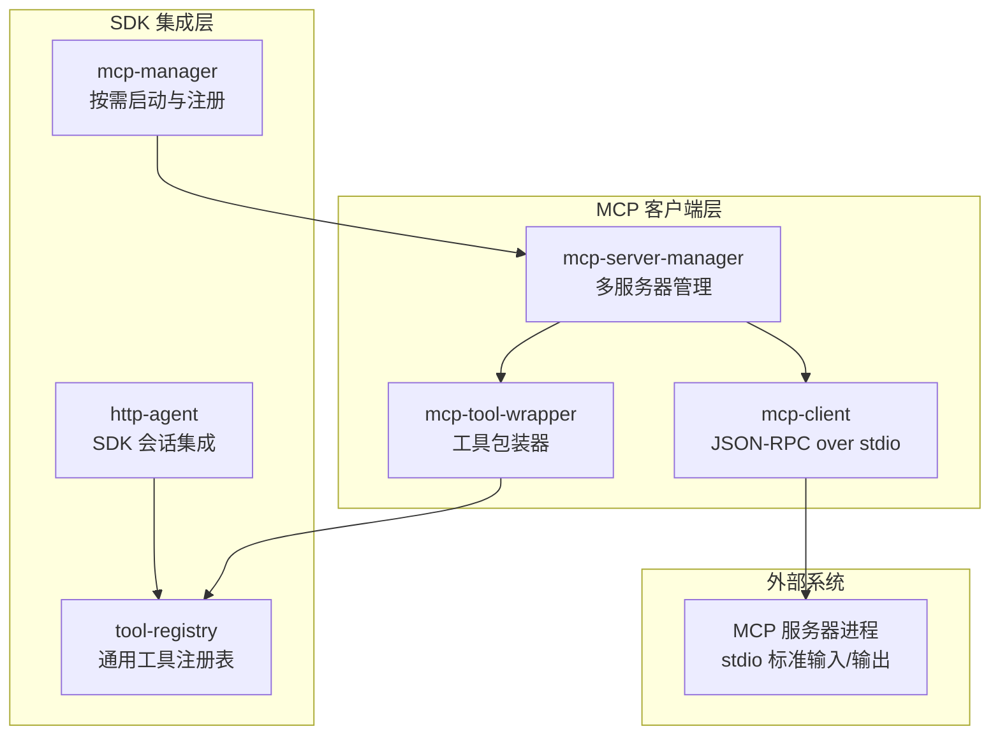
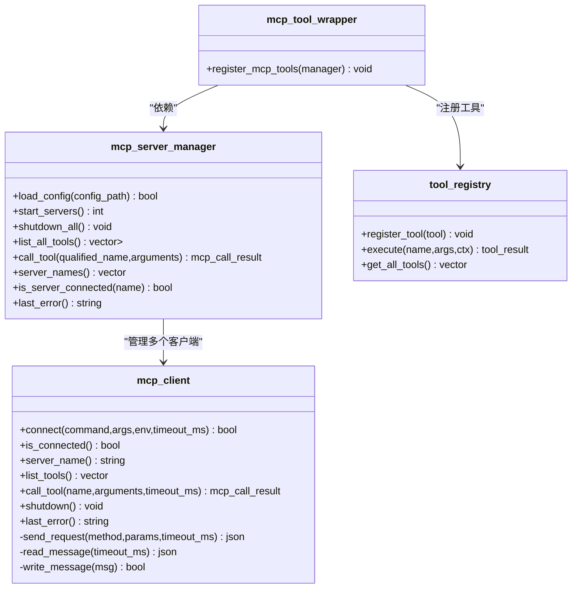
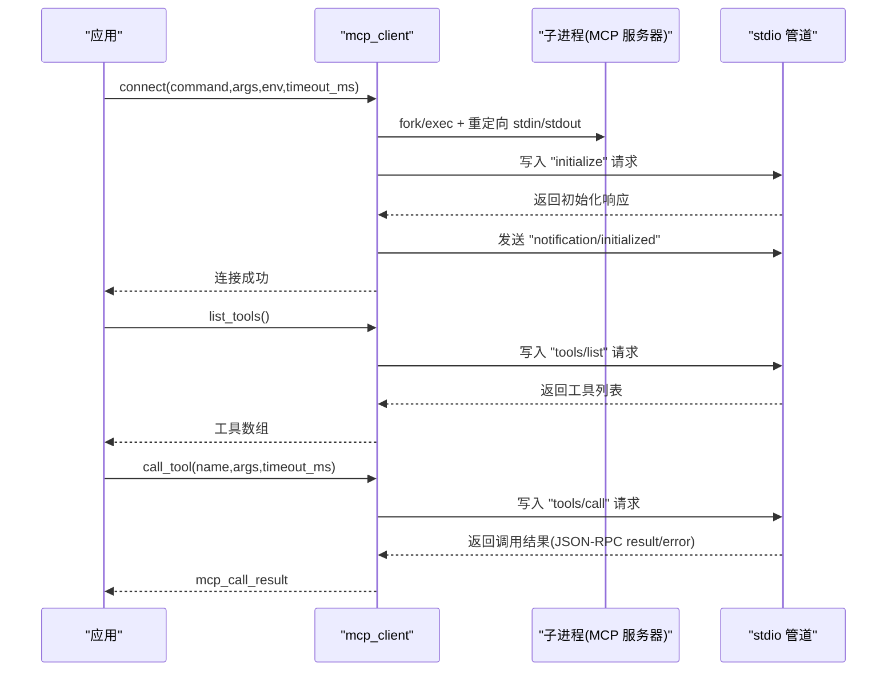
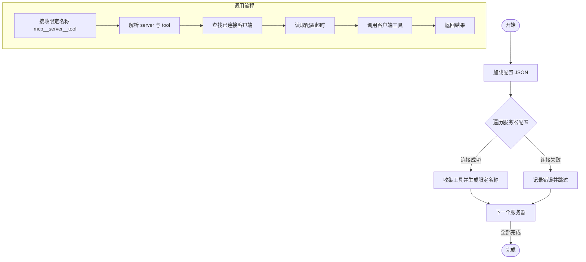
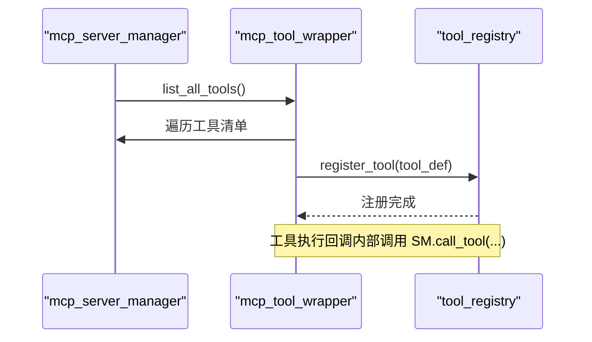
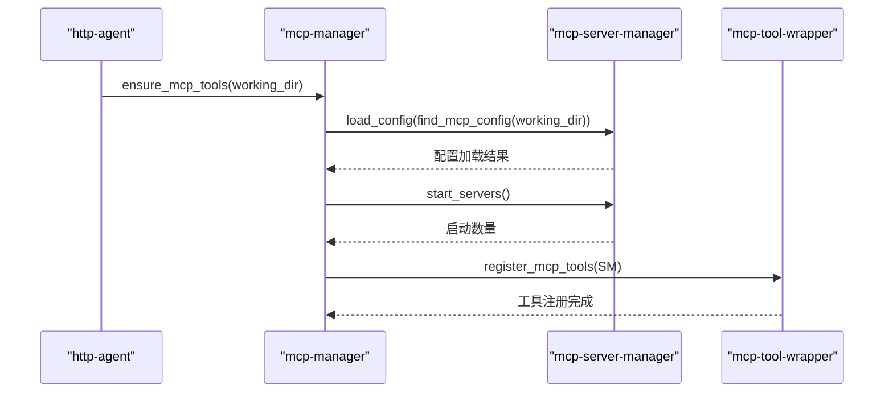
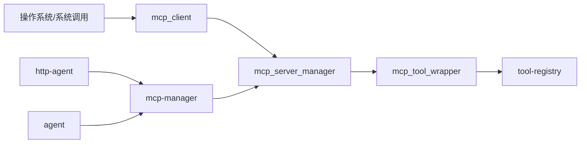

# MCP 客户端实现

<cite>
**本文档引用的文件**
- [mcp-client.h](file://agent/mcp/mcp-client.h)
- [mcp-client.cpp](file://agent/mcp/mcp-client.cpp)
- [mcp-server-manager.h](file://agent/mcp/mcp-server-manager.h)
- [mcp-server-manager.cpp](file://agent/mcp/mcp-server-manager.cpp)
- [mcp-tool-wrapper.h](file://agent/mcp/mcp-tool-wrapper.h)
- [mcp-tool-wrapper.cpp](file://agent/mcp/mcp-tool-wrapper.cpp)
- [mcp-manager.h](file://agent/sdk/mcp-manager.h)
- [mcp-manager.cpp](file://agent/sdk/mcp-manager.cpp)
- [tool-registry.h](file://agent/tool-registry.h)
- [agent.cpp](file://agent/agent.cpp)
- [http-agent.cpp](file://agent/sdk/http-agent.cpp)
</cite>

## 目录
1. [简介](#简介)
2. [项目结构](#项目结构)
3. [核心组件](#核心组件)
4. [架构总览](#架构总览)
5. [详细组件分析](#详细组件分析)
6. [依赖关系分析](#依赖关系分析)
7. [性能考虑](#性能考虑)
8. [故障排除指南](#故障排除指南)
9. [结论](#结论)
10. [附录](#附录)

## 简介
本文件为 MCP（Model Context Protocol）客户端实现的技术文档，聚焦于以下方面：
- MCP 客户端类的设计架构与职责边界
- JSON-RPC 2.0 协议在 stdio 传输上的实现细节
- 进程管理、stdio 管道、信号处理与优雅关闭
- 初始化握手、工具列表获取、工具调用的完整流程
- 错误处理、超时机制与状态管理
- 使用示例与配置参数说明
- 客户端接口规范、消息格式与状态流转

## 项目结构
MCP 客户端实现位于 agent/mcp 目录，围绕以下模块协同工作：
- mcp-client.*：单个 MCP 服务器的 JSON-RPC 客户端，负责 stdio 管道通信与协议编解码
- mcp-server-manager.*：多服务器管理器，负责配置加载、进程启动、工具聚合与调用路由
- mcp-tool-wrapper.*：将 MCP 工具包装为通用工具注册表中的工具，实现跨层适配
- mcp-manager.* 与 SDK 集成：在 SDK 初始化阶段按需启动 MCP 服务器并注册工具
- tool-registry.h：通用工具注册表接口，承载工具定义与执行回调

图表来源
- [mcp-client.cpp:21-122](file://agent/mcp/mcp-client.cpp#L21-L122)
- [mcp-server-manager.cpp:82-98](file://agent/mcp/mcp-server-manager.cpp#L82-L98)
- [mcp-tool-wrapper.cpp:7-63](file://agent/mcp/mcp-tool-wrapper.cpp#L7-L63)
- [mcp-manager.cpp:12-34](file://agent/sdk/mcp-manager.cpp#L12-L34)
- [tool-registry.h:58-90](file://agent/tool-registry.h#L58-L90)

章节来源
- [mcp-client.h:32-96](file://agent/mcp/mcp-client.h#L32-L96)
- [mcp-client.cpp:17-364](file://agent/mcp/mcp-client.cpp#L17-L364)
- [mcp-server-manager.h:21-67](file://agent/mcp/mcp-server-manager.h#L21-L67)
- [mcp-server-manager.cpp:21-245](file://agent/mcp/mcp-server-manager.cpp#L21-L245)
- [mcp-tool-wrapper.h:1-8](file://agent/mcp/mcp-tool-wrapper.h#L1-L8)
- [mcp-tool-wrapper.cpp:1-64](file://agent/mcp/mcp-tool-wrapper.cpp#L1-L64)
- [mcp-manager.h:1-11](file://agent/sdk/mcp-manager.h#L1-L11)
- [mcp-manager.cpp:1-48](file://agent/sdk/mcp-manager.cpp#L1-L48)
- [tool-registry.h:1-103](file://agent/tool-registry.h#L1-L103)

## 核心组件
- mcp_client：面向单个 MCP 服务器的客户端，封装进程创建、stdio 管道、JSON-RPC 2.0 编解码、超时与错误处理
- mcp_server_manager：管理多个 MCP 服务器配置与生命周期，聚合工具并提供按限定名称的调用路由
- mcp_tool_wrapper：将 MCP 工具转换为通用工具注册表中的工具，桥接 MCP 内容格式与 SDK 输出格式
- mcp_manager：在 SDK 初始化时按需加载配置、启动服务器并注册工具
- tool_registry：通用工具注册表，承载工具定义与执行回调

章节来源
- [mcp-client.h:34-96](file://agent/mcp/mcp-client.h#L34-L96)
- [mcp-server-manager.h:21-67](file://agent/mcp/mcp-server-manager.h#L21-L67)
- [mcp-tool-wrapper.h:1-8](file://agent/mcp/mcp-tool-wrapper.h#L1-L8)
- [mcp-manager.h:1-11](file://agent/sdk/mcp-manager.h#L1-L11)
- [tool-registry.h:58-90](file://agent/tool-registry.h#L58-L90)

## 架构总览
MCP 客户端采用“单客户端 + 多服务器管理器”的分层架构：
- mcp_client 负责与单个 MCP 服务器进行 JSON-RPC 2.0 通信，通过 stdio 管道实现
- mcp_server_manager 负责配置加载、进程启动、工具聚合与调用路由
- mcp_tool_wrapper 将 MCP 工具转换为通用工具注册表中的工具，便于 SDK 统一调度
- mcp_manager 在 SDK 初始化阶段触发 MCP 服务器的发现、启动与工具注册

图表来源
- [mcp-client.h:34-96](file://agent/mcp/mcp-client.h#L34-L96)
- [mcp-server-manager.h:21-67](file://agent/mcp/mcp-server-manager.h#L21-L67)
- [mcp-tool-wrapper.h:1-8](file://agent/mcp/mcp-tool-wrapper.h#L1-L8)
- [tool-registry.h:58-90](file://agent/tool-registry.h#L58-L90)

## 详细组件分析

### mcp_client：JSON-RPC over stdio
mcp_client 实现了与 MCP 服务器的 JSON-RPC 2.0 通信，核心特性包括：
- 进程管理：fork 子进程，dup2 重定向 stdin/stdout，stderr 重定向至 /dev/null
- stdio 传输：非阻塞读取 stdout，基于换行符解析 JSON 行
- 协议实现：请求/响应匹配（id 字段），通知消息（无 id）忽略
- 超时机制：基于 steady_clock 计算剩余时间，poll 轮询读取
- 错误处理：统一记录 last_error_，区分读写超时、解析错误、服务器断开等

图表来源
- [mcp-client.cpp:21-122](file://agent/mcp/mcp-client.cpp#L21-L122)
- [mcp-client.cpp:134-192](file://agent/mcp/mcp-client.cpp#L134-L192)
- [mcp-client.cpp:230-275](file://agent/mcp/mcp-client.cpp#L230-L275)

章节来源
- [mcp-client.h:34-96](file://agent/mcp/mcp-client.h#L34-L96)
- [mcp-client.cpp:17-364](file://agent/mcp/mcp-client.cpp#L17-L364)

### mcp_server_manager：多服务器管理与工具聚合
mcp_server_manager 负责：
- 配置加载：从 JSON 文件读取 servers 对象，支持环境变量替换
- 进程启动：逐个服务器调用 mcp_client::connect，记录连接状态
- 工具聚合：遍历已连接客户端，收集工具并生成限定名称（mcp__server__tool）
- 调用路由：根据限定名称解析 server 与 tool，转发到对应客户端
- 生命周期管理：提供 shutdown_all，统一关闭所有客户端

图表来源
- [mcp-server-manager.cpp:21-80](file://agent/mcp/mcp-server-manager.cpp#L21-L80)
- [mcp-server-manager.cpp:82-98](file://agent/mcp/mcp-server-manager.cpp#L82-L98)
- [mcp-server-manager.cpp:110-124](file://agent/mcp/mcp-server-manager.cpp#L110-L124)
- [mcp-server-manager.cpp:126-158](file://agent/mcp/mcp-server-manager.cpp#L126-L158)

章节来源
- [mcp-server-manager.h:21-67](file://agent/mcp/mcp-server-manager.h#L21-L67)
- [mcp-server-manager.cpp:21-245](file://agent/mcp/mcp-server-manager.cpp#L21-L245)

### mcp_tool_wrapper：工具包装与格式转换
mcp_tool_wrapper 将 MCP 工具注册为通用工具注册表中的工具：
- 从 mcp_server_manager 获取工具清单
- 将 MCP 输入 schema 转换为 JSON 字符串，作为工具参数模式
- 包装执行回调：调用 mcp_server_manager::call_tool，将 MCP 内容项转换为字符串输出
- 错误处理：捕获异常并返回工具执行结果

图表来源
- [mcp-tool-wrapper.cpp:7-63](file://agent/mcp/mcp-tool-wrapper.cpp#L7-L63)
- [tool-registry.h:58-90](file://agent/tool-registry.h#L58-L90)

章节来源
- [mcp-tool-wrapper.h:1-8](file://agent/mcp/mcp-tool-wrapper.h#L1-L8)
- [mcp-tool-wrapper.cpp:1-64](file://agent/mcp/mcp-tool-wrapper.cpp#L1-L64)
- [tool-registry.h:1-103](file://agent/tool-registry.h#L1-L103)

### SDK 集成：按需启动与注册
SDK 在初始化阶段通过 ensure_mcp_tools 触发 MCP 服务器的发现、启动与工具注册：
- 查找配置文件（工作目录优先，然后用户配置目录）
- 加载配置并启动服务器，注册工具
- 仅在 Unix 平台启用（依赖 fork/pipe）

图表来源
- [mcp-manager.cpp:12-34](file://agent/sdk/mcp-manager.cpp#L12-L34)
- [mcp-server-manager.cpp:228-244](file://agent/mcp/mcp-server-manager.cpp#L228-L244)
- [mcp-tool-wrapper.cpp:7-63](file://agent/mcp/mcp-tool-wrapper.cpp#L7-L63)

章节来源
- [mcp-manager.h:1-11](file://agent/sdk/mcp-manager.h#L1-L11)
- [mcp-manager.cpp:1-48](file://agent/sdk/mcp-manager.cpp#L1-L48)
- [http-agent.cpp:57-59](file://agent/sdk/http-agent.cpp#L57-L59)
- [agent.cpp:272-288](file://agent/agent.cpp#L272-L288)

## 依赖关系分析
- mcp_client 依赖 stdio 管道与系统调用（fork/exec/pipe/dup2/waitpid/poll），在 Windows 平台通过条件编译屏蔽
- mcp_server_manager 依赖 mcp_client，聚合多个客户端并提供统一工具视图
- mcp_tool_wrapper 依赖 mcp_server_manager 与 tool-registry，负责工具注册
- SDK 集成层通过 mcp-manager 与 mcp-server-manager 协作，实现按需启动与注册

图表来源
- [mcp-client.cpp:1-16](file://agent/mcp/mcp-client.cpp#L1-L16)
- [mcp-server-manager.cpp:1-14](file://agent/mcp/mcp-server-manager.cpp#L1-L14)
- [mcp-tool-wrapper.cpp:1-6](file://agent/mcp/mcp-tool-wrapper.cpp#L1-L6)
- [mcp-manager.cpp:1-7](file://agent/sdk/mcp-manager.cpp#L1-L7)
- [http-agent.cpp:50-70](file://agent/sdk/http-agent.cpp#L50-L70)
- [agent.cpp:272-288](file://agent/agent.cpp#L272-L288)

章节来源
- [mcp-client.cpp:1-364](file://agent/mcp/mcp-client.cpp#L1-L364)
- [mcp-server-manager.cpp:1-245](file://agent/mcp/mcp-server-manager.cpp#L1-L245)
- [mcp-tool-wrapper.cpp:1-64](file://agent/mcp/mcp-tool-wrapper.cpp#L1-L64)
- [mcp-manager.cpp:1-48](file://agent/sdk/mcp-manager.cpp#L1-L48)
- [http-agent.cpp:50-70](file://agent/sdk/http-agent.cpp#L50-L70)
- [agent.cpp:272-288](file://agent/agent.cpp#L272-L288)

## 性能考虑
- I/O 非阻塞：stdout 设置为非阻塞，结合 poll 实现超时控制，避免长时间阻塞
- 缓冲与增量解析：read_buffer_ 增量累积，按行解析 JSON，减少解析次数
- 进程隔离：每个服务器独立进程，避免相互影响；但进程创建与管道开销需关注
- 超时策略：请求级与读取级双重超时，防止死锁与资源占用
- 日志抑制：stderr 重定向至 /dev/null，减少日志干扰

## 故障排除指南
常见问题与定位方法：
- 连接失败
  - 检查命令是否存在、参数与环境变量是否正确
  - 查看 last_error_ 中的错误信息（如管道创建失败、fork 失败）
- 初始化握手失败
  - 确认服务器支持 protocolVersion "2024-11-05"
  - 检查服务器是否在超时时间内返回响应
- 工具列表为空
  - 确认服务器已发送 "notification/initialized"
  - 检查服务器是否实现 "tools/list" 方法
- 工具调用超时
  - 调整 timeout_ms 参数
  - 检查服务器处理能力与网络状况
- 服务器断开
  - 检查服务器进程状态与退出码
  - 确认未被系统信号中断或资源限制终止

章节来源
- [mcp-client.cpp:29-41](file://agent/mcp/mcp-client.cpp#L29-L41)
- [mcp-client.cpp:94-121](file://agent/mcp/mcp-client.cpp#L94-L121)
- [mcp-client.cpp:142-166](file://agent/mcp/mcp-client.cpp#L142-L166)
- [mcp-client.cpp:181-192](file://agent/mcp/mcp-client.cpp#L181-L192)
- [mcp-client.cpp:247-250](file://agent/mcp/mcp-client.cpp#L247-L250)
- [mcp-client.cpp:342-344](file://agent/mcp/mcp-client.cpp#L342-L344)

## 结论
MCP 客户端实现以清晰的分层架构与稳健的协议实现为核心，通过 stdio 传输与 JSON-RPC 2.0 协议实现了与 MCP 服务器的可靠通信。配合多服务器管理器与工具包装器，SDK 能够按需启动服务器并统一注册工具，满足复杂场景下的工具调度需求。在性能与稳定性方面，非阻塞 I/O、超时控制与错误处理机制提供了良好的工程实践。

## 附录

### 使用示例与配置参数说明
- 配置文件（mcp.json）
  - servers：对象，键为服务器名称，值包含以下字段：
    - command：字符串，服务器可执行文件路径
    - args：字符串数组，可选参数
    - env：键值对，可选环境变量（支持 ${VAR} 形式的环境变量替换）
    - enabled：布尔，默认 true
    - timeout_ms：整数，默认 60000，工具调用超时
- SDK 初始化
  - ensure_mcp_tools(working_dir)：在 SDK 初始化时按需加载配置并启动服务器
  - 仅在 Unix 平台生效（依赖 fork/pipe）
- 工具调用
  - 限定名称格式：mcp__<server>__<tool>
  - 调用时由 mcp_server_manager 解析 server 与 tool，并转发到对应客户端

章节来源
- [mcp-server-manager.cpp:21-80](file://agent/mcp/mcp-server-manager.cpp#L21-L80)
- [mcp-server-manager.cpp:210-226](file://agent/mcp/mcp-server-manager.cpp#L210-L226)
- [mcp-manager.cpp:12-34](file://agent/sdk/mcp-manager.cpp#L12-L34)
- [mcp-server-manager.cpp:173-208](file://agent/mcp/mcp-server-manager.cpp#L173-L208)