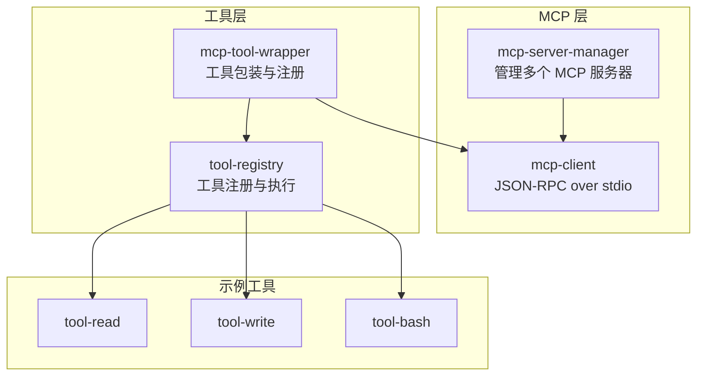
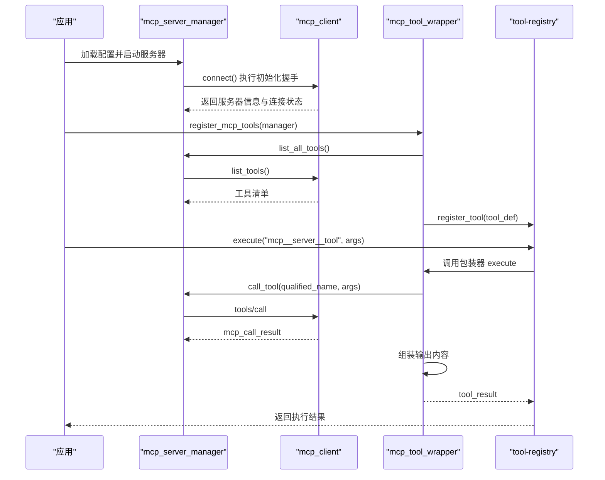
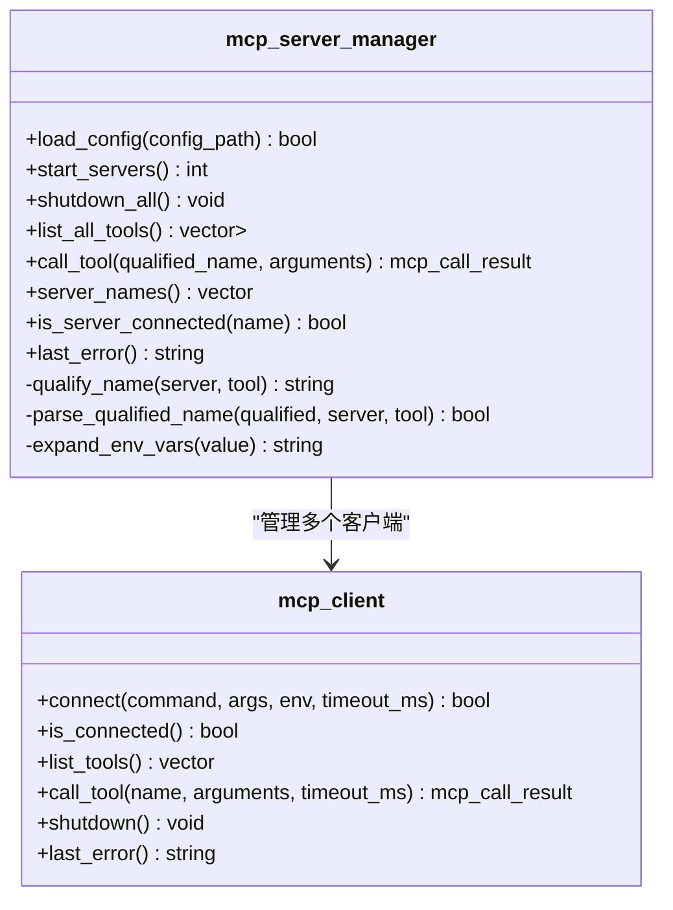
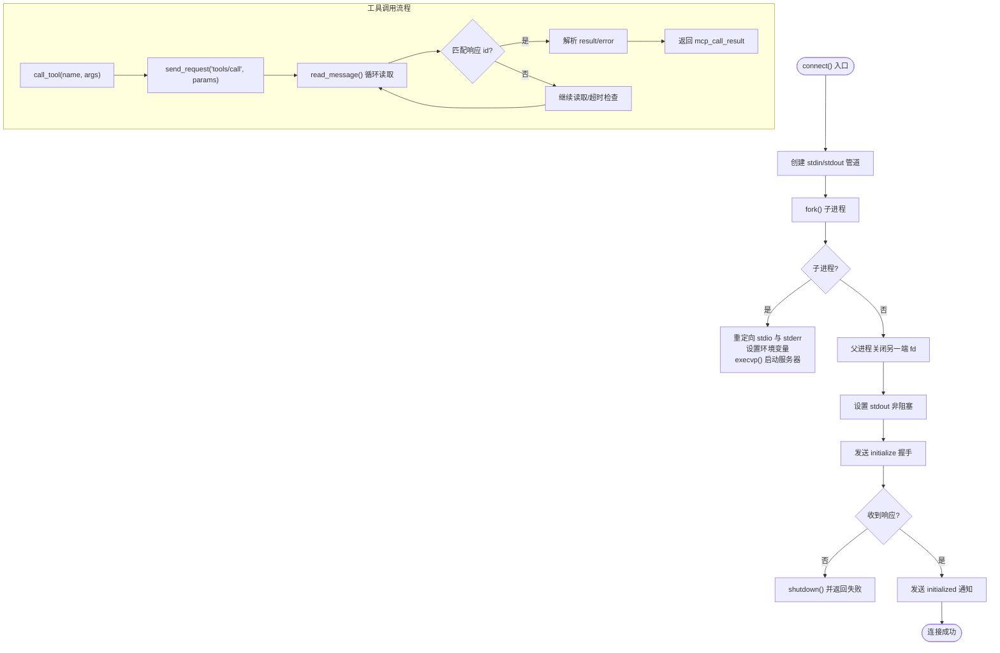
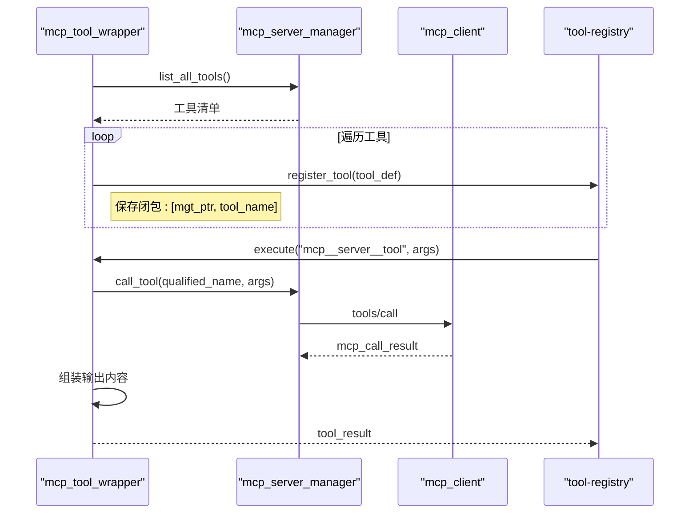
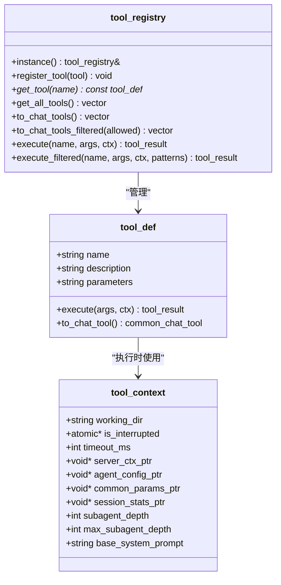
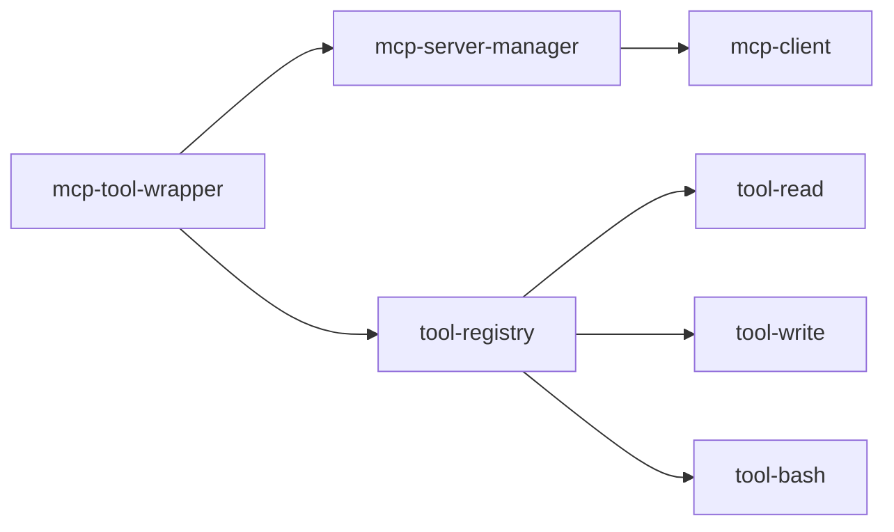

# MCP 工具包装器

<cite>
**本文档引用的文件**
- [mcp-tool-wrapper.h](file://agent/mcp/mcp-tool-wrapper.h)
- [mcp-tool-wrapper.cpp](file://agent/mcp/mcp-tool-wrapper.cpp)
- [mcp-client.h](file://agent/mcp/mcp-client.h)
- [mcp-client.cpp](file://agent/mcp/mcp-client.cpp)
- [mcp-server-manager.h](file://agent/mcp/mcp-server-manager.h)
- [mcp-server-manager.cpp](file://agent/mcp/mcp-server-manager.cpp)
- [tool-registry.h](file://agent/tool-registry.h)
- [tool-registry.cpp](file://agent/tool-registry.cpp)
- [tool-read.cpp](file://agent/tools/tool-read.cpp)
- [tool-write.cpp](file://agent/tools/tool-write.cpp)
- [tool-bash.cpp](file://agent/tools/tool-bash.cpp)
- [SDK.md](file://agent/sdk/SDK.md)
</cite>

## 目录
1. [简介](#简介)
2. [项目结构](#项目结构)
3. [核心组件](#核心组件)
4. [架构总览](#架构总览)
5. [详细组件分析](#详细组件分析)
6. [依赖关系分析](#依赖关系分析)
7. [性能考虑](#性能考虑)
8. [故障排查指南](#故障排查指南)
9. [结论](#结论)
10. [附录](#附录)

## 简介
本文件面向 MCP（Model Context Protocol）工具包装器，系统性阐述其设计架构、工具适配机制、参数转换与结果封装等核心功能。重点覆盖以下方面：
- 工具定义解析与输入输出格式转换
- 错误处理与类型验证
- 工具注册、动态加载与版本兼容性
- 工具包装接口、格式规范与性能优化
- 具体工具包装示例与配置模板

MCP 工具包装器通过 MCP 客户端连接外部 MCP 服务器，拉取工具清单，将其转换为统一的工具注册表条目，从而无缝接入现有工具执行框架。

## 项目结构
围绕 MCP 工具包装器的关键文件组织如下：
- mcp-server-manager：负责加载配置、启动/管理多个 MCP 服务器连接、聚合工具清单、执行工具调用
- mcp-client：实现标准 MCP 协议（JSON-RPC over stdio），完成握手、列出工具、调用工具与优雅关闭
- mcp-tool-wrapper：将 MCP 工具包装为统一工具注册表条目，完成参数与结果的格式转换
- tool-registry：统一的工具注册与执行框架，提供工具查找、执行与过滤能力
- 示例工具：read、write、bash，展示工具定义与参数校验、沙箱与权限控制

图表来源
- [mcp-server-manager.cpp:110-124](file://agent/mcp/mcp-server-manager.cpp#L110-L124)
- [mcp-client.cpp:134-167](file://agent/mcp/mcp-client.cpp#L134-L167)
- [mcp-tool-wrapper.cpp:7-62](file://agent/mcp/mcp-tool-wrapper.cpp#L7-L62)
- [tool-registry.cpp:11-21](file://agent/tool-registry.cpp#L11-L21)

章节来源
- [mcp-server-manager.h:21-67](file://agent/mcp/mcp-server-manager.h#L21-L67)
- [mcp-client.h:34-96](file://agent/mcp/mcp-client.h#L34-L96)
- [mcp-tool-wrapper.h:1-8](file://agent/mcp/mcp-tool-wrapper.h#L1-L8)
- [tool-registry.h:58-90](file://agent/tool-registry.h#L58-L90)

## 核心组件
- mcp_server_manager：负责加载 JSON 配置、启动 MCP 服务器、聚合工具清单、按限定名称调用工具、环境变量替换与工具名限定
- mcp_client：实现 MCP 初始化握手、工具列表与调用、超时与错误处理、进程生命周期管理
- mcp_tool_wrapper：将 MCP 工具转换为统一工具注册表条目，完成输入 JSON Schema 转换与输出内容封装
- tool_registry：统一工具注册、查找、执行与过滤，提供工具定义与执行上下文

章节来源
- [mcp-server-manager.cpp:21-80](file://agent/mcp/mcp-server-manager.cpp#L21-L80)
- [mcp-client.cpp:21-122](file://agent/mcp/mcp-client.cpp#L21-L122)
- [mcp-tool-wrapper.cpp:7-62](file://agent/mcp/mcp-tool-wrapper.cpp#L7-L62)
- [tool-registry.cpp:11-21](file://agent/tool-registry.cpp#L11-L21)

## 架构总览
MCP 工具包装器采用“服务器管理器 + 客户端 + 包装器 + 注册表”的分层架构：
- 服务器管理器负责配置加载与进程生命周期
- 客户端负责协议通信与工具发现
- 包装器负责将 MCP 工具适配为统一工具接口
- 注册表负责工具的统一注册与执行

图表来源
- [mcp-server-manager.cpp:82-98](file://agent/mcp/mcp-server-manager.cpp#L82-L98)
- [mcp-client.cpp:21-122](file://agent/mcp/mcp-client.cpp#L21-L122)
- [mcp-tool-wrapper.cpp:7-62](file://agent/mcp/mcp-tool-wrapper.cpp#L7-L62)
- [tool-registry.cpp:49-60](file://agent/tool-registry.cpp#L49-L60)

## 详细组件分析

### mcp_server_manager：服务器与工具管理
职责与特性：
- 配置加载：支持命令、参数、环境变量、启用开关与超时设置
- 进程管理：启动/关闭 MCP 服务器，检测存活状态
- 工具聚合：遍历已连接客户端，收集工具清单并进行命名限定
- 工具调用：根据限定名称解析服务器与工具名，转发调用并返回统一结果

关键实现要点：
- 命名限定：将“服务器名+工具名”转换为“mcp__server__tool”，避免双下划线冲突
- 环境变量替换：支持 ${VAR} 模式替换
- 超时控制：按服务器配置设置工具调用超时

图表来源
- [mcp-server-manager.h:21-67](file://agent/mcp/mcp-server-manager.h#L21-L67)
- [mcp-server-manager.cpp:110-158](file://agent/mcp/mcp-server-manager.cpp#L110-L158)
- [mcp-client.h:34-96](file://agent/mcp/mcp-client.h#L34-L96)

章节来源
- [mcp-server-manager.cpp:21-80](file://agent/mcp/mcp-server-manager.cpp#L21-L80)
- [mcp-server-manager.cpp:82-98](file://agent/mcp/mcp-server-manager.cpp#L82-L98)
- [mcp-server-manager.cpp:110-158](file://agent/mcp/mcp-server-manager.cpp#L110-L158)
- [mcp-server-manager.cpp:173-208](file://agent/mcp/mcp-server-manager.cpp#L173-L208)
- [mcp-server-manager.cpp:210-226](file://agent/mcp/mcp-server-manager.cpp#L210-L226)

### mcp_client：MCP 协议与进程通信
职责与特性：
- 进程启动：通过管道连接 stdio，重定向子进程输入输出，抑制调试日志
- 协议实现：JSON-RPC over 文本行，支持超时、通知忽略、错误码提取
- 工具发现与调用：tools/list 与 tools/call 方法
- 生命周期管理：优雅关闭与强制终止

关键实现要点：
- 初始化握手：发送 initialize 并接收 serverInfo，随后发送 initialized 通知
- 读写模型：按行读取 JSON，非阻塞读取配合 poll 超时
- 错误处理：统一记录 last_error，便于上层诊断

图表来源
- [mcp-client.cpp:21-122](file://agent/mcp/mcp-client.cpp#L21-L122)
- [mcp-client.cpp:230-275](file://agent/mcp/mcp-client.cpp#L230-L275)
- [mcp-client.cpp:277-348](file://agent/mcp/mcp-client.cpp#L277-L348)

章节来源
- [mcp-client.cpp:21-122](file://agent/mcp/mcp-client.cpp#L21-L122)
- [mcp-client.cpp:134-167](file://agent/mcp/mcp-client.cpp#L134-L167)
- [mcp-client.cpp:169-192](file://agent/mcp/mcp-client.cpp#L169-L192)
- [mcp-client.cpp:230-275](file://agent/mcp/mcp-client.cpp#L230-L275)
- [mcp-client.cpp:277-348](file://agent/mcp/mcp-client.cpp#L277-L348)

### mcp_tool_wrapper：工具包装与注册
职责与特性：
- 工具枚举：从服务器管理器获取工具清单
- 参数转换：将 MCP 输入 Schema 转换为 JSON Schema 字符串
- 结果封装：将 MCP 内容项（text/image/resource）转换为统一字符串输出
- 异常处理：捕获异常并返回错误信息

关键实现要点：
- 闭包捕获：保存服务器管理器指针与工具名，确保生命周期管理
- 输出组装：按类型拼接文本、图片 MIME 类型与资源 URI
- 错误传播：当 is_error 为真或异常发生时，返回错误结果

图表来源
- [mcp-tool-wrapper.cpp:7-62](file://agent/mcp/mcp-tool-wrapper.cpp#L7-L62)
- [mcp-server-manager.cpp:126-158](file://agent/mcp/mcp-server-manager.cpp#L126-L158)

章节来源
- [mcp-tool-wrapper.cpp:7-62](file://agent/mcp/mcp-tool-wrapper.cpp#L7-L62)

### tool-registry：工具注册与执行
职责与特性：
- 注册与查找：提供工具注册、按名查找与全量导出
- 执行与过滤：支持通用执行与按白名单过滤的执行
- 上下文传递：工作目录、中断标记、超时与子代理上下文指针

关键实现要点：
- 统一返回结构：tool_result(success, output, error)
- 异常捕获：捕获执行异常并转为错误结果
- 过滤策略：bash 工具支持命令白名单过滤

图表来源
- [tool-registry.h:58-90](file://agent/tool-registry.h#L58-L90)
- [tool-registry.cpp:11-21](file://agent/tool-registry.cpp#L11-L21)
- [tool-registry.cpp:49-60](file://agent/tool-registry.cpp#L49-L60)

章节来源
- [tool-registry.h:17-56](file://agent/tool-registry.h#L17-L56)
- [tool-registry.cpp:11-21](file://agent/tool-registry.cpp#L11-L21)
- [tool-registry.cpp:49-60](file://agent/tool-registry.cpp#L49-L60)
- [tool-registry.cpp:62-85](file://agent/tool-registry.cpp#L62-L85)

### 示例工具：read/write/bash
这些工具展示了工具定义、参数校验、沙箱与权限控制、输出格式化等实践，便于理解工具包装器的输入输出约定与错误处理风格。

章节来源
- [tool-read.cpp:17-93](file://agent/tools/tool-read.cpp#L17-L93)
- [tool-write.cpp:10-57](file://agent/tools/tool-write.cpp#L10-L57)
- [tool-bash.cpp:50-258](file://agent/tools/tool-bash.cpp#L50-L258)

## 依赖关系分析
- mcp-server-manager 依赖 mcp-client 实现协议通信与工具发现
- mcp-tool-wrapper 依赖 mcp-server-manager 获取工具清单并转发调用
- mcp-tool-wrapper 依赖 tool-registry 完成工具注册
- tool-registry 为所有工具（包括 MCP 包装工具）提供统一执行接口

图表来源
- [mcp-server-manager.cpp:110-158](file://agent/mcp/mcp-server-manager.cpp#L110-L158)
- [mcp-tool-wrapper.cpp:7-62](file://agent/mcp/mcp-tool-wrapper.cpp#L7-L62)
- [tool-registry.cpp:11-21](file://agent/tool-registry.cpp#L11-L21)

章节来源
- [mcp-server-manager.h:3-8](file://agent/mcp/mcp-server-manager.h#L3-L8)
- [mcp-tool-wrapper.h:1-8](file://agent/mcp/mcp-tool-wrapper.h#L1-L8)
- [tool-registry.h:1-14](file://agent/tool-registry.h#L1-L14)

## 性能考虑
- I/O 非阻塞：客户端对 stdout 设置非阻塞标志并使用 poll 实现超时控制，避免长时间阻塞
- 缓冲与拼接：读缓冲减少解析次数，按行解析 JSON，跳过空行与 CR
- 进程管理：优雅关闭优先，超时后强制终止，减少僵尸进程
- 输出截断：对长输出进行行数与长度截断，防止内存与带宽压力
- 命名限定：避免双下划线冲突，简化解析与查找

章节来源
- [mcp-client.cpp:89-91](file://agent/mcp/mcp-client.cpp#L89-L91)
- [mcp-client.cpp:277-348](file://agent/mcp/mcp-client.cpp#L277-L348)
- [mcp-client.cpp:194-228](file://agent/mcp/mcp-client.cpp#L194-L228)
- [tool-bash.cpp:28-48](file://agent/tools/tool-bash.cpp#L28-L48)

## 故障排查指南
常见问题与定位方法：
- 连接失败：检查命令、参数与环境变量；确认服务器可执行文件路径与权限
- 握手失败：查看 initialize 响应与 initialized 通知是否正确交换
- 工具不可用：确认服务器已连接且工具列表非空；检查限定名称格式
- 超时与中断：调整超时配置；确认 is_interrupted 标记被正确设置
- 输出异常：检查 MCP 服务器返回的 content 类型与字段；关注截断与错误标记

章节来源
- [mcp-client.cpp:21-122](file://agent/mcp/mcp-client.cpp#L21-L122)
- [mcp-client.cpp:134-167](file://agent/mcp/mcp-client.cpp#L134-L167)
- [mcp-client.cpp:169-192](file://agent/mcp/mcp-client.cpp#L169-L192)
- [mcp-server-manager.cpp:126-158](file://agent/mcp/mcp-server-manager.cpp#L126-L158)
- [mcp-tool-wrapper.cpp:57-59](file://agent/mcp/mcp-tool-wrapper.cpp#L57-L59)

## 结论
MCP 工具包装器通过清晰的分层设计与严格的协议实现，将外部 MCP 服务器的工具无缝接入统一工具执行框架。其核心优势在于：
- 统一的工具注册与执行接口
- 完整的参数与结果格式转换
- 健壮的错误处理与超时控制
- 可扩展的服务器管理与动态加载

## 附录

### 工具定义解析与输入输出格式转换
- 输入格式：MCP 工具的 inputSchema 为 JSON 对象，包装器将其 dump 为字符串存储于 tool_def.parameters
- 输出格式：MCP content 为数组，包含 text、image、resource 等类型；包装器统一转换为字符串输出

章节来源
- [mcp-tool-wrapper.cpp:16-21](file://agent/mcp/mcp-tool-wrapper.cpp#L16-L21)
- [mcp-tool-wrapper.cpp:34-51](file://agent/mcp/mcp-tool-wrapper.cpp#L34-L51)

### 错误处理与类型验证
- 连接与协议错误：通过 last_error 记录并传播
- 工具调用错误：当 isError 为真或异常发生时返回错误结果
- 类型验证：对 content 中的 type 字段进行判断与拼接

章节来源
- [mcp-client.cpp:169-192](file://agent/mcp/mcp-client.cpp#L169-L192)
- [mcp-tool-wrapper.cpp:53-59](file://agent/mcp/mcp-tool-wrapper.cpp#L53-L59)

### 工具注册、动态加载与版本兼容性
- 工具注册：通过 register_mcp_tools 将 MCP 工具批量注册到工具注册表
- 动态加载：通过 mcp-server-manager 的配置文件动态加载与启动服务器
- 版本兼容性：客户端固定协议版本字符串，确保与服务器握手兼容

章节来源
- [mcp-tool-wrapper.h:5-8](file://agent/mcp/mcp-tool-wrapper.h#L5-L8)
- [mcp-server-manager.cpp:21-80](file://agent/mcp/mcp-server-manager.cpp#L21-L80)
- [mcp-client.cpp:94-98](file://agent/mcp/mcp-client.cpp#L94-L98)

### 工具包装接口与格式规范
- 工具定义：包含 name、description、parameters(JSON Schema 字符串) 与 execute 回调
- 执行上下文：包含工作目录、中断标记、超时与子代理上下文指针
- 输出结构：success、output、error 三元组

章节来源
- [tool-registry.h:44-56](file://agent/tool-registry.h#L44-L56)
- [tool-registry.h:17-34](file://agent/tool-registry.h#L17-L34)
- [tool-registry.h:36-41](file://agent/tool-registry.h#L36-L41)

### 性能优化建议
- 合理设置超时：根据工具复杂度调整服务器配置中的 timeout_ms
- 控制输出大小：利用截断策略避免大输出影响性能
- 非阻塞 I/O：保持 stdout 非阻塞与合理的 poll 超时
- 进程生命周期：及时关闭不再使用的服务器连接

章节来源
- [mcp-server-manager.cpp:74-75](file://agent/mcp/mcp-server-manager.cpp#L74-L75)
- [mcp-client.cpp:89-91](file://agent/mcp/mcp-client.cpp#L89-L91)
- [mcp-client.cpp:277-348](file://agent/mcp/mcp-client.cpp#L277-L348)
- [tool-bash.cpp:25-26](file://agent/tools/tool-bash.cpp#L25-L26)

### 工具包装示例与配置模板
- 工具包装示例：参见 mcp-tool-wrapper 的 register_mcp_tools 实现
- 配置模板：mcp-server-manager 支持 servers 对象，包含 command、args、env、enabled、timeout_ms 等字段

章节来源
- [mcp-tool-wrapper.cpp:7-62](file://agent/mcp/mcp-tool-wrapper.cpp#L7-L62)
- [mcp-server-manager.cpp:21-80](file://agent/mcp/mcp-server-manager.cpp#L21-L80)