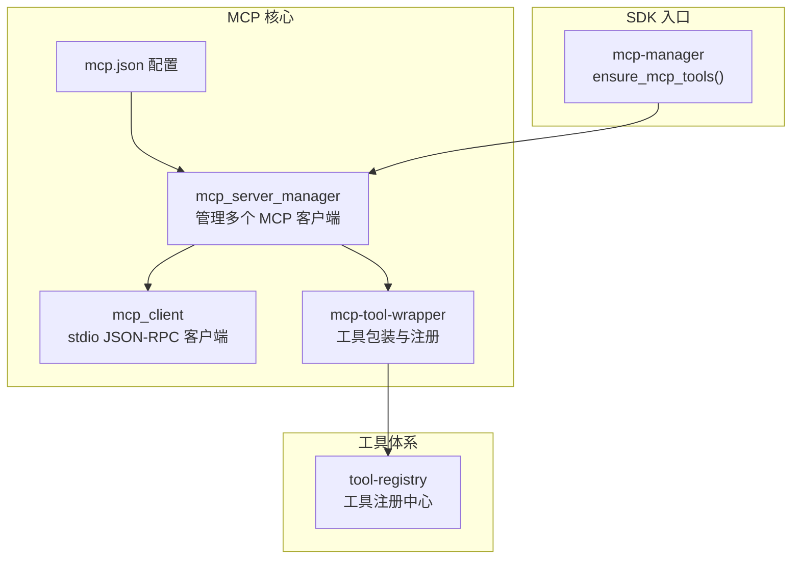
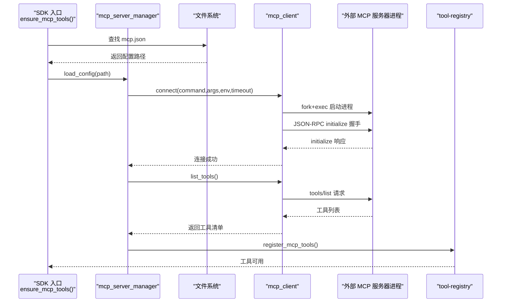
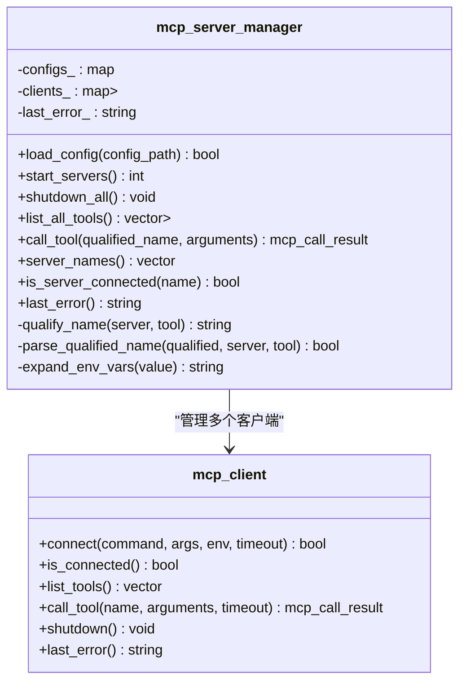
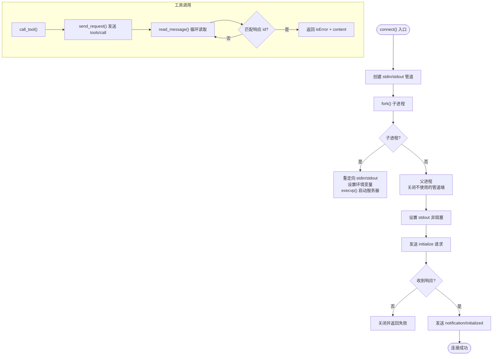
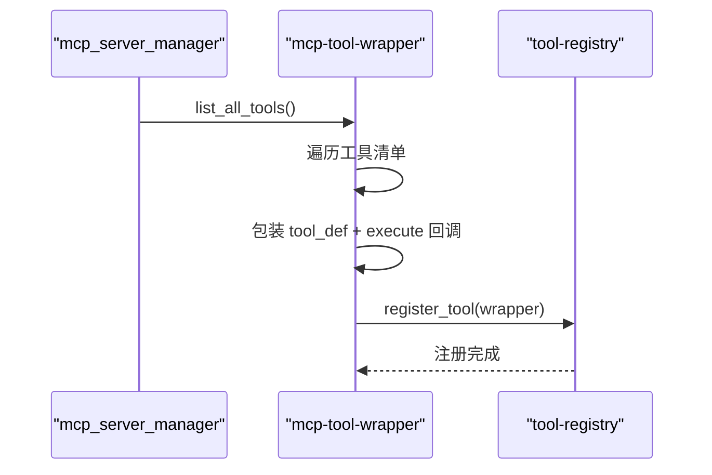
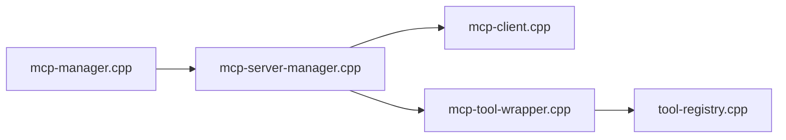

# MCP 服务器管理

<cite>
**本文引用的文件**
- [mcp-server-manager.h](file://agent/mcp/mcp-server-manager.h)
- [mcp-server-manager.cpp](file://agent/mcp/mcp-server-manager.cpp)
- [mcp-client.h](file://agent/mcp/mcp-client.h)
- [mcp-client.cpp](file://agent/mcp/mcp-client.cpp)
- [mcp-tool-wrapper.h](file://agent/mcp/mcp-tool-wrapper.h)
- [mcp-tool-wrapper.cpp](file://agent/mcp/mcp-tool-wrapper.cpp)
- [mcp-manager.h](file://agent/sdk/mcp-manager.h)
- [mcp-manager.cpp](file://agent/sdk/mcp-manager.cpp)
- [tool-registry.h](file://agent/tool-registry.h)
- [tool-registry.cpp](file://agent/tool-registry.cpp)
</cite>

## 目录
1. [简介](#简介)
2. [项目结构](#项目结构)
3. [核心组件](#核心组件)
4. [架构总览](#架构总览)
5. [详细组件分析](#详细组件分析)
6. [依赖关系分析](#依赖关系分析)
7. [性能考虑](#性能考虑)
8. [故障排查指南](#故障排查指南)
9. [结论](#结论)
10. [附录](#附录)

## 简介
本文件面向 MCP（Model Context Protocol）服务器管理场景，系统性阐述基于 C++ 的 MCP 服务器管理器设计与实现，包括多服务器生命周期管理、进程启动与监控、资源管理、故障恢复、工具注册与状态同步、性能监控等关键能力。文档同时给出配置示例、管理命令说明以及接口与运维工具的实现细节，帮助开发者快速集成与维护 MCP 工具链。

## 项目结构
围绕 MCP 的核心模块位于 agent/mcp 目录，配合工具注册中心与 SDK 初始化入口，形成“配置加载—进程启动—协议握手—工具发现—工具注册—统一调度”的完整闭环。

图表来源
- [mcp-server-manager.h:21-67](file://agent/mcp/mcp-server-manager.h#L21-L67)
- [mcp-server-manager.cpp:21-80](file://agent/mcp/mcp-server-manager.cpp#L21-L80)
- [mcp-client.h:34-96](file://agent/mcp/mcp-client.h#L34-L96)
- [mcp-tool-wrapper.cpp:7-63](file://agent/mcp/mcp-tool-wrapper.cpp#L7-L63)
- [mcp-manager.cpp:12-34](file://agent/sdk/mcp-manager.cpp#L12-L34)
- [tool-registry.h:58-90](file://agent/tool-registry.h#L58-L90)

章节来源
- [mcp-server-manager.h:1-71](file://agent/mcp/mcp-server-manager.h#L1-L71)
- [mcp-server-manager.cpp:1-245](file://agent/mcp/mcp-server-manager.cpp#L1-L245)
- [mcp-client.h:1-97](file://agent/mcp/mcp-client.h#L1-L97)
- [mcp-client.cpp:1-364](file://agent/mcp/mcp-client.cpp#L1-L364)
- [mcp-tool-wrapper.h:1-8](file://agent/mcp/mcp-tool-wrapper.h#L1-L8)
- [mcp-tool-wrapper.cpp:1-64](file://agent/mcp/mcp-tool-wrapper.cpp#L1-L64)
- [mcp-manager.h:1-11](file://agent/sdk/mcp-manager.h#L1-L11)
- [mcp-manager.cpp:1-48](file://agent/sdk/mcp-manager.cpp#L1-L48)
- [tool-registry.h:1-103](file://agent/tool-registry.h#L1-L103)
- [tool-registry.cpp:1-86](file://agent/tool-registry.cpp#L1-L86)

## 核心组件
- mcp_server_manager：负责从 JSON 配置加载服务器列表，按需启动进程，维护连接客户端集合，聚合工具清单并执行工具调用；支持环境变量展开、超时控制与错误信息回传。
- mcp_client：通过 stdio 实现 JSON-RPC over 文本协议，完成初始化握手、工具列举与调用；内置非阻塞读取、超时控制与优雅关闭流程。
- mcp-tool-wrapper：将 MCP 工具包装为通用工具注册中心条目，统一参数 Schema 与执行结果格式，注入到工具注册表中。
- tool-registry：集中管理工具定义与执行上下文，提供查询、过滤与执行能力。
- mcp-manager（SDK）：提供 ensure_mcp_tools 接口，按工作目录查找配置、加载并启动服务器，注册工具，保证单实例初始化。

章节来源
- [mcp-server-manager.h:21-67](file://agent/mcp/mcp-server-manager.h#L21-L67)
- [mcp-client.h:34-96](file://agent/mcp/mcp-client.h#L34-L96)
- [mcp-tool-wrapper.h:5-8](file://agent/mcp/mcp-tool-wrapper.h#L5-L8)
- [tool-registry.h:58-90](file://agent/tool-registry.h#L58-L90)
- [mcp-manager.h:7-10](file://agent/sdk/mcp-manager.h#L7-L10)

## 架构总览
下图展示 MCP 服务器管理的整体交互：SDK 初始化入口触发配置发现与加载，管理器启动各服务器进程并建立客户端连接，随后拉取工具清单并注册到工具中心，最终由统一调度层使用。

图表来源
- [mcp-manager.cpp:12-34](file://agent/sdk/mcp-manager.cpp#L12-L34)
- [mcp-server-manager.cpp:21-80](file://agent/mcp/mcp-server-manager.cpp#L21-L80)
- [mcp-client.cpp:21-122](file://agent/mcp/mcp-client.cpp#L21-L122)
- [mcp-tool-wrapper.cpp:7-63](file://agent/mcp/mcp-tool-wrapper.cpp#L7-L63)
- [tool-registry.cpp:11-13](file://agent/tool-registry.cpp#L11-L13)

## 详细组件分析

### mcp_server_manager 组件
职责与能力
- 配置加载：解析 JSON 中的 servers 对象，校验字段，支持布尔开关与超时配置，并进行环境变量展开。
- 服务器启动：遍历启用项，创建客户端并发起连接，统计成功启动数量。
- 工具聚合：遍历已连接客户端，收集工具清单并生成“mcp__server__tool”格式的限定名。
- 工具调用：解析限定名，定位对应客户端，按配置超时执行工具调用。
- 生命周期管理：提供连接状态查询与全部关闭接口。
- 错误处理：记录最后一次错误信息，便于上层诊断。

关键数据结构
- mcp_server_config：包含名称、命令、参数、环境变量、启用标志与工具调用超时。
- 内部存储：configs_ 记录配置，clients_ 维护已连接客户端。

图表来源
- [mcp-server-manager.h:21-67](file://agent/mcp/mcp-server-manager.h#L21-L67)
- [mcp-client.h:34-96](file://agent/mcp/mcp-client.h#L34-L96)

章节来源
- [mcp-server-manager.h:11-67](file://agent/mcp/mcp-server-manager.h#L11-L67)
- [mcp-server-manager.cpp:21-245](file://agent/mcp/mcp-server-manager.cpp#L21-L245)

### mcp_client 组件
职责与能力
- 进程管理：通过管道连接子进程的 stdin/stdout，设置非阻塞读取，支持超时控制。
- 协议实现：发送 JSON-RPC 请求，匹配响应 id，忽略通知消息；解析错误与结果。
- 连接状态：检测进程存活与初始化状态。
- 资源回收：优雅关闭时先关闭管道，尝试终止进程，必要时强制杀死并清理缓冲。

关键流程
- 初始化握手：发送 initialize 并等待响应，随后发送 notification/initialized。
- 工具调用：封装 tools/call 请求，返回 isError 与 content 数组。
- 关闭流程：关闭输入端，短暂等待后 SIGTERM/SIGKILL，确保资源释放。

图表来源
- [mcp-client.cpp:21-122](file://agent/mcp/mcp-client.cpp#L21-L122)
- [mcp-client.cpp:230-275](file://agent/mcp/mcp-client.cpp#L230-L275)
- [mcp-client.cpp:277-348](file://agent/mcp/mcp-client.cpp#L277-L348)

章节来源
- [mcp-client.h:34-96](file://agent/mcp/mcp-client.h#L34-L96)
- [mcp-client.cpp:1-364](file://agent/mcp/mcp-client.cpp#L1-L364)

### mcp-tool-wrapper 与 tool-registry
职责与能力
- 工具包装：遍历管理器提供的工具清单，转换输入 Schema 为 JSON 字符串，封装执行回调。
- 执行桥接：调用管理器的工具调用接口，将 MCP 的内容数组转换为统一输出字符串，区分文本、图片与资源类型。
- 注册中心：将包装后的工具注册到全局工具注册表，供上层统一调度。

图表来源
- [mcp-tool-wrapper.cpp:7-63](file://agent/mcp/mcp-tool-wrapper.cpp#L7-L63)
- [tool-registry.cpp:11-13](file://agent/tool-registry.cpp#L11-L13)

章节来源
- [mcp-tool-wrapper.h:5-8](file://agent/mcp/mcp-tool-wrapper.h#L5-L8)
- [mcp-tool-wrapper.cpp:1-64](file://agent/mcp/mcp-tool-wrapper.cpp#L1-L64)
- [tool-registry.h:58-90](file://agent/tool-registry.h#L58-L90)
- [tool-registry.cpp:1-86](file://agent/tool-registry.cpp#L1-L86)

### SDK 初始化入口（mcp-manager）
职责与能力
- 配置发现：优先在工作目录查找 mcp.json，否则在用户配置目录查找。
- 单实例保障：使用静态变量与互斥锁确保仅初始化一次。
- 流程编排：加载配置、启动服务器、注册工具。

章节来源
- [mcp-manager.h:7-10](file://agent/sdk/mcp-manager.h#L7-L10)
- [mcp-manager.cpp:12-34](file://agent/sdk/mcp-manager.cpp#L12-L34)

## 依赖关系分析
- mcp_server_manager 依赖 mcp_client 实现多进程连接与协议交互。
- mcp-tool-wrapper 依赖 mcp_server_manager 获取工具清单，并依赖 tool-registry 完成注册。
- SDK 的 ensure_mcp_tools 作为门面，串联配置发现、管理器初始化与工具注册。
- mcp_client 依赖标准库进行进程与 I/O 操作，实现非阻塞读取与超时控制。

图表来源
- [mcp-manager.cpp:12-34](file://agent/sdk/mcp-manager.cpp#L12-L34)
- [mcp-server-manager.cpp:82-98](file://agent/mcp/mcp-server-manager.cpp#L82-L98)
- [mcp-client.cpp:21-122](file://agent/mcp/mcp-client.cpp#L21-L122)
- [mcp-tool-wrapper.cpp:7-63](file://agent/mcp/mcp-tool-wrapper.cpp#L7-L63)
- [tool-registry.cpp:11-13](file://agent/tool-registry.cpp#L11-L13)

章节来源
- [mcp-manager.cpp:1-48](file://agent/sdk/mcp-manager.cpp#L1-L48)
- [mcp-server-manager.cpp:1-245](file://agent/mcp/mcp-server-manager.cpp#L1-L245)
- [mcp-client.cpp:1-364](file://agent/mcp/mcp-client.cpp#L1-L364)
- [mcp-tool-wrapper.cpp:1-64](file://agent/mcp/mcp-tool-wrapper.cpp#L1-L64)
- [tool-registry.cpp:1-86](file://agent/tool-registry.cpp#L1-L86)

## 性能考虑
- I/O 非阻塞：客户端对 stdout 设置非阻塞标志，结合 poll/select 实现可中断读取，避免长时间阻塞导致的无响应。
- 超时控制：请求级超时与连接级超时双层控制，防止死等与资源占用。
- 进程隔离：每个 MCP 服务器独立进程，避免相互影响；退出时采用优雅关闭策略，减少僵尸进程风险。
- 工具聚合：管理器在连接成功后一次性拉取工具清单，降低后续调用时的网络往返成本。
- 环境变量展开：在加载阶段完成，避免运行期重复计算。

## 故障排查指南
常见问题与定位
- 配置加载失败：检查 JSON 语法与 servers 字段是否存在；关注 last_error 返回值。
- 进程启动失败：确认命令可执行、参数正确、环境变量有效；查看子进程 stderr（当前被抑制以减少噪音）。
- 连接超时或握手失败：检查服务器是否监听、协议版本是否匹配、网络与权限；适当增大超时。
- 工具调用超时：根据业务调整工具超时配置；检查服务器处理耗时。
- 工具不可用：确认服务器已连接且工具列表非空；核对限定名格式（mcp__server__tool）。

定位建议
- 使用管理器的 last_error 与客户端的 last_error 获取最近错误信息。
- 在 SDK 层调用 ensure_mcp_tools 后，可通过工具注册中心查询已注册工具列表验证。
- 对于进程异常退出，检查父进程 waitpid 返回状态与信号。

章节来源
- [mcp-server-manager.cpp:21-80](file://agent/mcp/mcp-server-manager.cpp#L21-L80)
- [mcp-client.cpp:230-275](file://agent/mcp/mcp-client.cpp#L230-L275)
- [mcp-client.cpp:277-348](file://agent/mcp/mcp-client.cpp#L277-L348)
- [tool-registry.cpp:15-21](file://agent/tool-registry.cpp#L15-L21)

## 结论
该实现以清晰的分层架构实现了 MCP 服务器的全生命周期管理：从配置发现、进程启动、协议握手到工具注册与统一调度。通过非阻塞 I/O、超时控制与优雅关闭机制，系统在可靠性与性能之间取得平衡。配合 SDK 的单实例初始化门面，开发者可以便捷地将外部 MCP 工具无缝接入统一工具生态。

## 附录

### 配置示例（mcp.json）
- 位置优先级：工作目录下的 mcp.json 优先；若不存在，则尝试用户配置目录 ~/.llama-agent/mcp.json。
- 字段说明：
  - servers：对象，键为服务器名称，值包含以下字段：
    - command：字符串，必填，服务器可执行文件路径或命令。
    - args：数组，可选，字符串参数列表。
    - env：对象，可选，键值对形式的环境变量映射。
    - enabled：布尔，可选，默认 true。
    - timeout_ms：整数，可选，默认 60000，工具调用超时（毫秒）。
- 环境变量展开：支持 ${VAR_NAME} 形式的变量替换，未定义时为空字符串。

章节来源
- [mcp-server-manager.cpp:21-80](file://agent/mcp/mcp-server-manager.cpp#L21-L80)
- [mcp-server-manager.cpp:210-226](file://agent/mcp/mcp-server-manager.cpp#L210-L226)
- [mcp-server-manager.cpp:228-244](file://agent/mcp/mcp-server-manager.cpp#L228-L244)

### 管理命令与接口
- SDK 初始化：ensure_mcp_tools(working_dir)
  - 功能：查找并加载 mcp.json，启动服务器，注册工具。
  - 注意：Windows 平台不执行任何操作。
- 管理器方法：
  - load_config(path)：加载配置并校验。
  - start_servers()：启动所有启用的服务器，返回成功数量。
  - shutdown_all()：关闭所有连接。
  - list_all_tools()：返回限定名与工具定义的列表。
  - call_tool(qualified_name, arguments)：按限定名调用工具。
  - server_names()/is_server_connected(name)：查询服务器状态。
- 工具包装：
  - register_mcp_tools(manager)：将 MCP 工具注册到工具注册中心。

章节来源
- [mcp-manager.cpp:12-34](file://agent/sdk/mcp-manager.cpp#L12-L34)
- [mcp-server-manager.h:26-52](file://agent/mcp/mcp-server-manager.h#L26-L52)
- [mcp-tool-wrapper.h:5-8](file://agent/mcp/mcp-tool-wrapper.h#L5-L8)

### 监控指标与运维建议
- 连接健康：定期调用 is_server_connected(name) 判断服务器存活。
- 工具可用性：通过 list_all_tools() 获取工具清单，核对限定名与描述。
- 超时与错误：关注 last_error 与工具调用返回的 isError 标志，结合日志定位问题。
- 资源回收：在应用退出或异常时调用 shutdown_all()，确保进程与管道资源释放。

章节来源
- [mcp-server-manager.cpp:168-171](file://agent/mcp/mcp-server-manager.cpp#L168-L171)
- [mcp-client.cpp:124-132](file://agent/mcp/mcp-client.cpp#L124-L132)
- [mcp-client.cpp:194-228](file://agent/mcp/mcp-client.cpp#L194-L228)