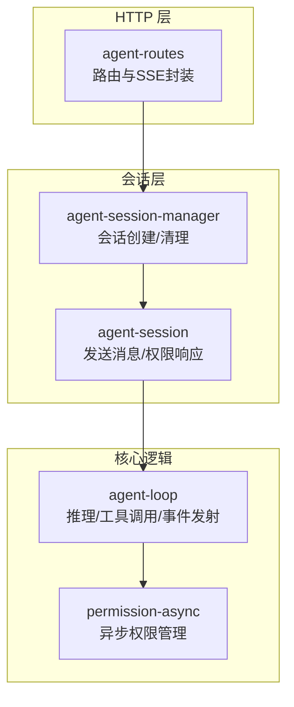
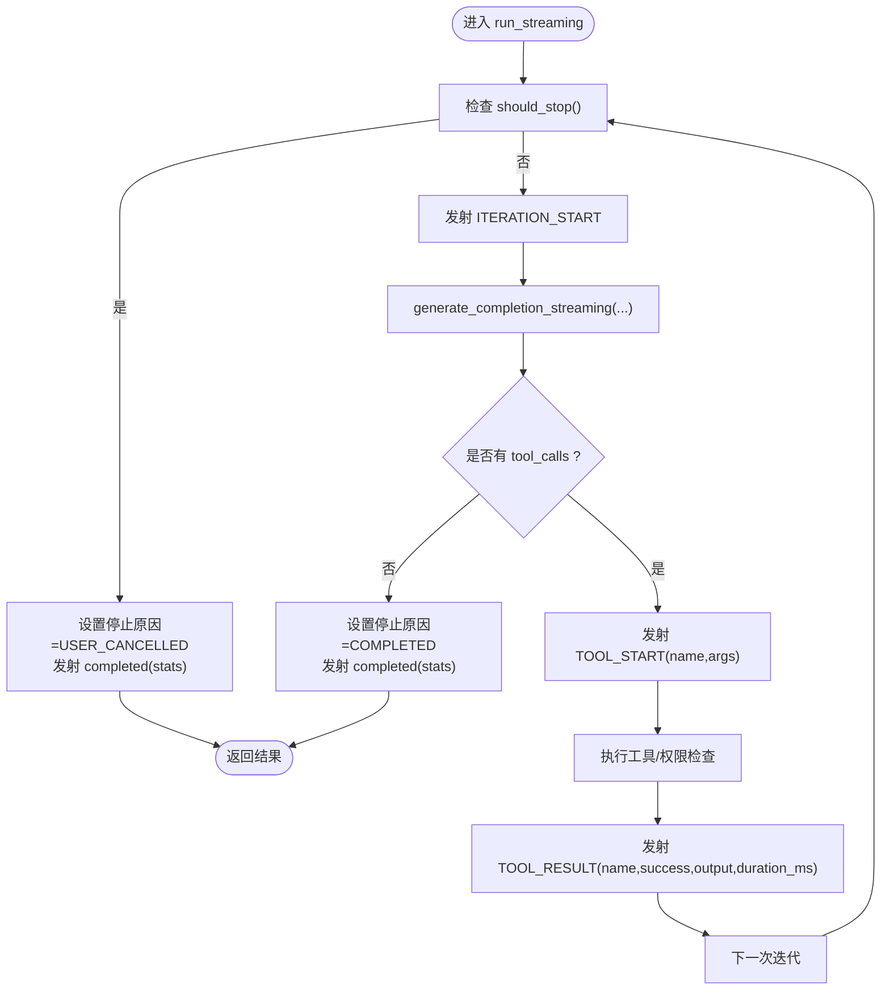
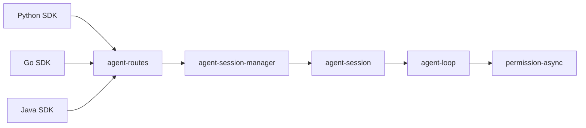
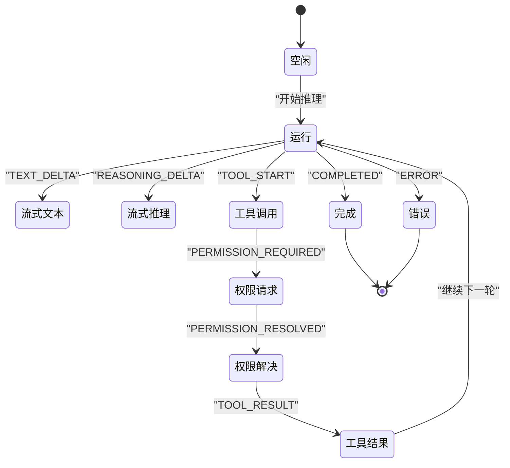

# 事件流式传输

<cite>
**本文引用的文件**
- [agent/agent-loop.h](file://agent/agent-loop.h)
- [agent/agent-loop.cpp](file://agent/agent-loop.cpp)
- [agent/server/agent-session.h](file://agent/server/agent-session.h)
- [agent/server/agent-session.cpp](file://agent/server/agent-session.cpp)
- [agent/server/agent-routes.h](file://agent/server/agent-routes.h)
- [agent/server/agent-routes.cpp](file://agent/server/agent-routes.cpp)
- [agent/permission-async.h](file://agent/permission-async.h)
- [agent/permission.h](file://agent/permission.h)
- [SDKs/python/src/llama_agent_sdk/sdk.py](file://SDKs/python/src/llama_agent_sdk/sdk.py)
- [SDKs/go/llamaagentsdk/sdk.go](file://SDKs/go/llamaagentsdk/sdk.go)
- [SDKs/java/src/main/java/ai/llama/agent/sdk/HttpAgentSession.java](file://SDKs/java/src/main/java/ai/llama/agent/sdk/HttpAgentSession.java)
</cite>

## 目录
1. [简介](#简介)
2. [项目结构](#项目结构)
3. [核心组件](#核心组件)
4. [架构总览](#架构总览)
5. [详细组件分析](#详细组件分析)
6. [依赖关系分析](#依赖关系分析)
7. [性能考量](#性能考量)
8. [故障排查指南](#故障排查指南)
9. [结论](#结论)
10. [附录](#附录)

## 简介
本技术文档围绕事件流式传输系统进行深入解析，重点覆盖以下方面：
- agent_event 结构体与事件类型定义
- 流式回调机制与 should_stop 中断机制
- 各类事件（TEXT_DELTA、REASONING_DELTA、TOOL_START、TOOL_RESULT、PERMISSION_REQUIRED 等）的触发时机与数据格式
- 异步权限处理与权限事件序列
- 实时通信、SSE（Server-Sent Events）集成与客户端连接管理
- 多语言 SDK 的事件监听与流式输出处理示例路径

## 项目结构
该系统采用分层架构：服务端通过 HTTP 路由暴露 /v1/agent/* 接口；会话管理器负责生命周期与并发控制；代理循环负责推理与工具执行，并通过回调事件驱动流式输出；权限模块支持同步与异步两种模式。



**图表来源**
- [agent/server/agent-routes.cpp:1-120](file://agent/server/agent-routes.cpp#L1-L120)
- [agent/server/agent-session.h:148-186](file://agent/server/agent-session.h#L148-L186)
- [agent/agent-loop.h:167-276](file://agent/agent-loop.h#L167-L276)
- [agent/permission-async.h:43-142](file://agent/permission-async.h#L43-L142)

**章节来源**
- [agent/server/agent-routes.h:1-68](file://agent/server/agent-routes.h#L1-L68)
- [agent/server/agent-session.h:64-186](file://agent/server/agent-session.h#L64-L186)
- [agent/agent-loop.h:83-166](file://agent/agent-loop.h#L83-L166)
- [agent/permission-async.h:43-142](file://agent/permission-async.h#L43-L142)

## 核心组件
- 事件模型与回调
  - 事件类型枚举与事件结构体定义于 agent_loop 模块，提供统一的事件载体与便捷构造器。
  - 回调类型 agent_event_callback 作为流式输出的唯一出口。
- 会话与运行循环
  - agent_session 将外部请求包装为后台线程任务，调用 agent_loop.run_streaming 并通过回调回传事件。
  - agent_loop.run_streaming 控制迭代次数、统计信息、工具调用与权限事件。
- 权限管理
  - permission_manager_async 支持非阻塞权限请求与响应，配合事件 PERMISSION_REQUIRED/PERMISSION_RESOLVED。
- HTTP 与 SSE
  - agent-routes 提供 make_sse_stream 生成 SSE 响应对象，按事件类型映射并推送数据。

**章节来源**
- [agent/agent-loop.h:83-166](file://agent/agent-loop.h#L83-L166)
- [agent/server/agent-session.h:64-156](file://agent/server/agent-session.h#L64-L156)
- [agent/server/agent-routes.cpp:36-97](file://agent/server/agent-routes.cpp#L36-L97)

## 架构总览
下图展示了从 HTTP 请求到事件流式输出的完整链路，包括权限事件与错误事件的处理。

```mermaid
sequenceDiagram
participant Client as "客户端"
participant Routes as "agent-routes"
participant Sess as "agent-session"
participant Loop as "agent-loop"
participant Perm as "permission-async"
Client->>Routes : "POST /v1/agent/session/ : id/chat (stream=true)"
Routes->>Sess : "创建/获取会话并绑定回调"
Sess->>Loop : "run_streaming(user_prompt, on_event, should_stop, async_perms)"
Loop->>Loop : "迭代 : 生成补全/发射TEXT/REASONING"
alt 需要工具调用
Loop->>Loop : "发射TOOL_START"
opt 需要权限
Loop->>Perm : "request_permission(...)"
Perm-->>Loop : "返回请求ID"
Loop->>Loop : "发射PERMISSION_REQUIRED"
Routes-->>Client : "SSE : permission_required"
Client->>Routes : "POST /v1/agent/permissions/ : id (allow/deny)"
Routes->>Sess : "respond_permission(request_id, scope)"
Sess->>Loop : "继续执行"
Loop->>Loop : "发射PERMISSION_RESOLVED"
end
Loop->>Loop : "执行工具/发射TOOL_RESULT"
end
Loop-->>Sess : "completed/stats 或 error"
Sess-->>Routes : "结束SSE"
Routes-->>Client : "SSE : completed/error"
```

**图表来源**
- [agent/server/agent-routes.cpp:280-356](file://agent/server/agent-routes.cpp#L280-L356)
- [agent/server/agent-session.cpp:103-156](file://agent/server/agent-session.cpp#L103-L156)
- [agent/agent-loop.cpp:886-1007](file://agent/agent-loop.cpp#L886-L1007)
- [agent/permission-async.h:57-82](file://agent/permission-async.h#L57-L82)

## 详细组件分析

### 事件类型与数据格式
- 事件类型
  - TEXT_DELTA：流式文本输出片段
  - REASONING_DELTA：流式推理/思考内容
  - TOOL_START：工具调用开始
  - TOOL_RESULT：工具调用完成（含成功标志、输出、耗时）
  - PERMISSION_REQUIRED：需要权限（携带请求ID、工具名、详情、是否危险）
  - PERMISSION_RESOLVED：权限已解决（携带请求ID、允许与否）
  - ITERATION_START：新迭代开始（携带当前轮次与最大轮次）
  - COMPLETED：完成（携带原因与统计）
  - ERROR：错误（携带错误信息）

- 数据字段
  - TEXT_DELTA/REASONING_DELTA：content
  - TOOL_START：name, args
  - TOOL_RESULT：name, success, output, duration_ms
  - PERMISSION_REQUIRED：required_id, tool, details, dangerous
  - PERMISSION_RESOLVED：required_id, allowed
  - ITERATION_START：iteration, max_iterations
  - COMPLETED：reason, stats{input_tokens, output_tokens, cached_tokens}
  - ERROR：message

- 触发时机
  - 文本/推理：在 generate_completion_streaming 过程中逐段发射
  - 工具调用：在解析到 tool_calls 后，先发射 TOOL_START，再执行工具，最后发射 TOOL_RESULT
  - 权限：当异步权限检查返回“需要确认”时发射 PERMISSION_REQUIRED；收到响应后发射 PERMISSION_RESOLVED
  - 结束：无 tool_calls 时发射 COMPLETED；达到最大迭代或用户取消时发射 COMPLETED；异常时发射 ERROR

**章节来源**
- [agent/agent-loop.h:83-166](file://agent/agent-loop.h#L83-L166)
- [agent/agent-loop.cpp:911-1006](file://agent/agent-loop.cpp#L911-L1006)

### 流式回调与 should_stop 中断机制
- 回调函数
  - agent_event_callback 是唯一的事件输出通道，由 agent_session 在后台线程中调用。
  - 回调在每次事件产生时被调用，确保事件顺序与实时性。
- should_stop
  - 默认策略：若未提供 should_stop，则默认检查 is_interrupted_ 原子变量。
  - 客户端可通过自定义 should_stop 实现取消、超时或业务中断逻辑。
  - 在每次迭代、工具调用前后均会轮询 should_stop，以保证及时退出。



**图表来源**
- [agent/agent-loop.cpp:886-1007](file://agent/agent-loop.cpp#L886-L1007)
- [agent/server/agent-session.cpp:140-155](file://agent/server/agent-session.cpp#L140-L155)

**章节来源**
- [agent/agent-loop.h:198-211](file://agent/agent-loop.h#L198-L211)
- [agent/agent-loop.cpp:886-907](file://agent/agent-loop.cpp#L886-L907)

### 异步权限处理与事件序列
- 异步权限管理
  - permission_manager_async 提供 request_permission、respond、wait_for_response、pending 等接口。
  - 事件 PERMISSION_REQUIRED 携带 required_id，客户端通过该 ID 发起权限响应。
  - 权限作用域 permission_scope 支持一次性与会话级记忆。
- 事件序列与时序
  - 当工具调用需要权限时，系统发出 PERMISSION_REQUIRED，随后等待客户端响应。
  - 客户端在 /v1/agent/permissions/:id 提交响应后，系统继续执行并发出 PERMISSION_RESOLVED。
  - 若客户端长时间不响应，可结合超时策略与 should_stop 实现优雅退出。

```mermaid
sequenceDiagram
participant Loop as "agent-loop"
participant Perm as "permission-async"
participant Routes as "agent-routes"
participant Client as "客户端"
Loop->>Perm : "request_permission(...)"
Perm-->>Loop : "返回 required_id"
Loop->>Client : "SSE : permission_required(required_id, ...)"
Client->>Routes : "POST /v1/agent/permissions/ : id"
Routes->>Loop : "respond_permission(request_id, allow, scope)"
Loop->>Client : "SSE : permission_resolved(required_id, allowed)"
Loop->>Loop : "继续工具执行"
```

**图表来源**
- [agent/permission-async.h:57-82](file://agent/permission-async.h#L57-L82)
- [agent/server/agent-routes.cpp:318-345](file://agent/server/agent-routes.cpp#L318-L345)

**章节来源**
- [agent/permission-async.h:14-142](file://agent/permission-async.h#L14-L142)
- [agent/server/agent-routes.cpp:318-345](file://agent/server/agent-routes.cpp#L318-L345)

### 实时通信与 WebSocket 集成建议
- SSE（Server-Sent Events）
  - 服务器端通过 make_sse_stream 与 sse_stream_res 实现事件推送，事件类型映射与数据封装在 agent-routes 中完成。
  - 客户端需按事件类型与数据格式解析，参考各 SDK 的 SSE 解析逻辑。
- WebSocket 集成
  - 可在现有 SSE 基础上扩展 WebSocket 路由，复用事件模型与权限响应流程。
  - 建议保持事件命名一致（如 permission_required、permission_resolved），以便多协议兼容。
- 连接管理
  - 使用共享指针 sse_shared_wrapper 确保 SSE 对象生命周期与 HTTP 响应一致。
  - 会话状态机（IDLE/RUNNING/WAITING_PERMISSION/COMPLETED/ERROR）用于跟踪会话健康度。

**章节来源**
- [agent/server/agent-routes.cpp:36-97](file://agent/server/agent-routes.cpp#L36-L97)
- [agent/server/agent-session.h:45-52](file://agent/server/agent-session.h#L45-L52)

### 多模态流式输出
- agent_loop 提供 run_streaming_multimodal，支持用户消息包含图片/音频等多模态内容。
- 会话层 send_message_multimodal 将媒体文件传递给 agent_loop，媒体数据在首次生成时消费并清空。

**章节来源**
- [agent/agent-loop.h:203-211](file://agent/agent-loop.h#L203-L211)
- [agent/agent-loop.cpp:1009-1079](file://agent/agent-loop.cpp#L1009-L1079)
- [agent/server/agent-session.cpp:158-200](file://agent/server/agent-session.cpp#L158-L200)

## 依赖关系分析
- 组件耦合
  - agent-routes 依赖 agent-session-manager 与 agent-session，负责路由与 SSE 输出。
  - agent-session 依赖 agent-loop 与 permission-async，负责会话生命周期与权限响应。
  - agent-loop 依赖工具注册表、权限管理器、聊天模板等，负责推理与事件发射。
- 外部依赖
  - SDKs 提供 Python/Go/Java 的 SSE 解析与事件监听示例，便于客户端集成。



**图表来源**
- [agent/server/agent-routes.h:14-47](file://agent/server/agent-routes.h#L14-L47)
- [agent/server/agent-session.h:148-186](file://agent/server/agent-session.h#L148-L186)
- [agent/agent-loop.h:167-179](file://agent/agent-loop.h#L167-L179)
- [agent/permission-async.h:43-142](file://agent/permission-async.h#L43-L142)

**章节来源**
- [agent/server/agent-routes.h:14-47](file://agent/server/agent-routes.h#L14-L47)
- [SDKs/python/src/llama_agent_sdk/sdk.py:41-99](file://SDKs/python/src/llama_agent_sdk/sdk.py#L41-L99)
- [SDKs/go/llamaagentsdk/sdk.go:150-265](file://SDKs/go/llamaagentsdk/sdk.go#L150-L265)
- [SDKs/java/src/main/java/ai/llama/agent/sdk/HttpAgentSession.java:176-205](file://SDKs/java/src/main/java/ai/llama/agent/sdk/HttpAgentSession.java#L176-L205)

## 性能考量
- 事件发射频率
  - TEXT_DELTA/REASONING_DELTA 应避免过密的发射间隔，建议在缓冲区满或超时阈值到达时批量推送。
- 统计与指标
  - session_stats 记录输入/输出/缓存令牌数与耗时，可用于性能监控与优化。
- 并发与资源
  - 会话使用独立工作线程与原子变量控制状态，避免阻塞主线程。
- 超时与中断
  - should_stop 与工具超时配置（tool_timeout_ms）共同保障长尾任务的可控性。

## 故障排查指南
- 常见问题
  - 事件未到达客户端：检查 SSE 响应头与 keep-alive 逻辑，确认事件类型映射正确。
  - 权限请求卡住：确认客户端是否在 /v1/agent/permissions/:id 提交响应，或检查异步管理器的等待超时。
  - 用户取消无效：确认 should_stop 返回值与 is_interrupted_ 的联动。
- 错误事件
  - 系统在异常情况下发射 ERROR 事件，客户端应捕获并提示用户或重试。
- 日志与诊断
  - 在 agent-routes 与 agent-session 中添加必要日志，定位事件丢失或权限响应延迟。

**章节来源**
- [agent/server/agent-routes.cpp:338-345](file://agent/server/agent-routes.cpp#L338-L345)
- [agent/server/agent-session.cpp:103-156](file://agent/server/agent-session.cpp#L103-L156)

## 结论
该事件流式传输系统以 agent_event 为核心，通过 agent_event_callback 将推理、工具调用与权限决策解耦为可观察的事件序列。结合 SSE 与异步权限管理，系统实现了高实时性与强安全性的统一。多语言 SDK 提供了清晰的事件监听与流式输出示例，便于快速集成。

## 附录

### 事件监听与处理示例（代码示例路径）
- Python SDK
  - SSE 行解析与事件提取：[SDKs/python/src/llama_agent_sdk/sdk.py:41-99](file://SDKs/python/src/llama_agent_sdk/sdk.py#L41-L99)
  - 流式对话处理与工具调用聚合：[SDKs/python/src/llama_agent_sdk/sdk.py:146-224](file://SDKs/python/src/llama_agent_sdk/sdk.py#L146-L224)
- Go SDK
  - SSE 扫描与事件解析：[SDKs/go/llamaagentsdk/sdk.go:150-265](file://SDKs/go/llamaagentsdk/sdk.go#L150-L265)
- Java SDK
  - SSE 数据行解析与工具调用累积：[SDKs/java/src/main/java/ai/llama/agent/sdk/HttpAgentSession.java:176-205](file://SDKs/java/src/main/java/ai/llama/agent/sdk/HttpAgentSession.java#L176-L205)

### 事件序列时序图（概念示意）
