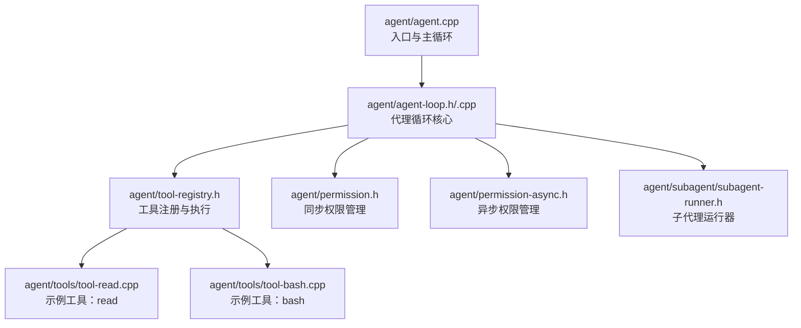
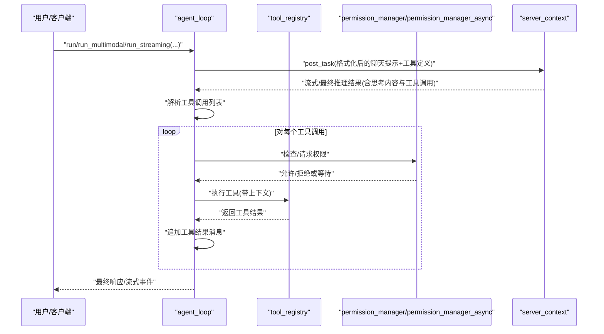
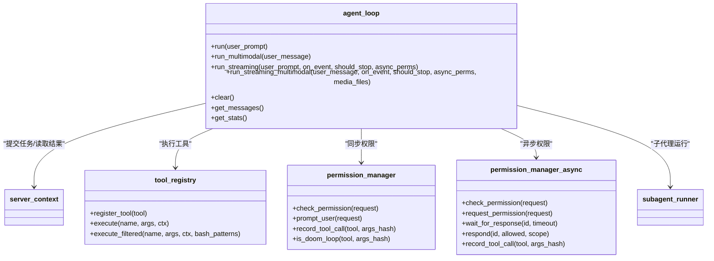

# 代理循环核心

<cite>
**本文引用的文件**
- [agent-loop.h](file://agent/agent-loop.h)
- [agent-loop.cpp](file://agent/agent-loop.cpp)
- [agent.cpp](file://agent/agent.cpp)
- [tool-registry.h](file://agent/tool-registry.h)
- [permission.h](file://agent/permission.h)
- [permission-async.h](file://agent/permission-async.h)
- [subagent-runner.h](file://agent/subagent/subagent-runner.h)
- [tool-read.cpp](file://agent/tools/tool-read.cpp)
- [tool-bash.cpp](file://agent/tools/tool-bash.cpp)
</cite>

## 目录
1. [简介](#简介)
2. [项目结构](#项目结构)
3. [核心组件](#核心组件)
4. [架构总览](#架构总览)
5. [详细组件分析](#详细组件分析)
6. [依赖关系分析](#依赖关系分析)
7. [性能考虑](#性能考虑)
8. [故障排查指南](#故障排查指南)
9. [结论](#结论)
10. [附录](#附录)

## 简介
本文件聚焦于代理循环核心（agent_loop）的技术文档，系统阐述其设计架构、消息处理流程与迭代控制机制。重点覆盖以下方面：
- agent_loop 类的设计与职责边界
- 构造函数参数与初始化策略（主代理与子代理）
- run 方法系列（标准、多模态、流式）的实现差异与适用场景
- 工具调用执行链路、权限校验与异步权限处理
- agent_config、agent_loop_result、session_stats 等关键数据结构
- 停止条件与错误处理机制
- 性能优化建议与调试技巧

## 项目结构
围绕代理循环的核心文件与周边模块如下：
- 核心类与接口：agent/agent-loop.{h,cpp}
- 工具体系：agent/tool-registry.h、agent/tools/*.cpp
- 权限体系：agent/permission.h、agent/permission-async.h
- 子代理支持：agent/subagent/subagent-runner.h
- 入口与集成：agent/agent.cpp（命令行交互与主循环）

图表来源
- [agent.cpp:101-588](file://agent/agent.cpp#L101-L588)
- [agent-loop.h:167-276](file://agent/agent-loop.h#L167-L276)
- [agent-loop.cpp:49-296](file://agent/agent-loop.cpp#L49-L296)
- [tool-registry.h:58-90](file://agent/tool-registry.h#L58-L90)
- [permission.h:40-102](file://agent/permission.h#L40-L102)
- [permission-async.h:43-142](file://agent/permission-async.h#L43-L142)
- [subagent-runner.h:64-114](file://agent/subagent/subagent-runner.h#L64-L114)
- [tool-read.cpp:95-120](file://agent/tools/tool-read.cpp#L95-L120)
- [tool-bash.cpp:260-281](file://agent/tools/tool-bash.cpp#L260-L281)

章节来源
- [agent.cpp:101-588](file://agent/agent.cpp#L101-L588)
- [agent-loop.h:167-276](file://agent/agent-loop.h#L167-L276)
- [agent-loop.cpp:49-296](file://agent/agent-loop.cpp#L49-L296)

## 核心组件
- agent_loop：负责一次完整的对话循环，包括消息构建、模型推理、工具解析与执行、权限校验、统计收集与事件流输出。
- tool_registry：统一注册与分发工具执行，提供过滤版工具集以支持子代理。
- permission_manager / permission_manager_async：同步/异步权限决策与会话状态管理。
- subagent_runner：子代理运行器，复用父代理的 server_context 并通过工具过滤实现受限能力。

章节来源
- [agent-loop.h:167-276](file://agent/agent-loop.h#L167-L276)
- [tool-registry.h:58-90](file://agent/tool-registry.h#L58-L90)
- [permission.h:40-102](file://agent/permission.h#L40-L102)
- [permission-async.h:43-142](file://agent/permission-async.h#L43-L142)
- [subagent-runner.h:64-114](file://agent/subagent/subagent-runner.h#L64-L114)

## 架构总览
代理循环采用“消息历史 + 工具选择 + 模型推理 + 工具执行”的迭代范式，支持：
- 文本模式与多模态模式（文本+图片/音频）
- 同步与异步两种权限处理路径
- 流式事件输出（便于 API 与前端实时渲染）

图表来源
- [agent-loop.cpp:333-480](file://agent/agent-loop.cpp#L333-L480)
- [agent-loop.cpp:887-1007](file://agent/agent-loop.cpp#L887-L1007)
- [agent-loop.cpp:1144-1240](file://agent/agent-loop.cpp#L1144-L1240)
- [agent-loop.cpp:1244-1390](file://agent/agent-loop.cpp#L1244-L1390)

## 详细组件分析

### agent_loop 类设计与职责
- 责任边界
  - 维护消息历史与系统提示
  - 将消息与工具集合格式化为服务器可接受的聊天模板
  - 发起推理任务、接收增量/最终结果
  - 解析工具调用、执行工具、记录结果
  - 收集会话统计、触发事件回调
  - 支持子代理（工具过滤、系统提示定制、深度限制）
- 关键成员
  - server_context 引用、配置、中断标志
  - 消息数组、默认任务参数、权限管理器、工具上下文、会话统计
  - 子代理相关：允许工具集合、bash 前缀白名单、工具调用回调
  - 多模态支持：当前请求携带的媒体文件缓存

章节来源
- [agent-loop.h:250-275](file://agent/agent-loop.h#L250-L275)
- [agent-loop.cpp:49-296](file://agent/agent-loop.cpp#L49-L296)

### 构造函数与初始化
- 主代理构造
  - 初始化默认任务参数（采样、推测、n_predict、反向提示、流式、逐令牌计时）
  - 设置工具上下文（工作目录、超时、指针传递给子代理共享）
  - 初始化权限管理器（项目根、YOLO 模式）
  - 构建系统提示（工具清单、指南、示例），并按配置注入 AGENTS.md 与技能段落
  - 记录基础系统提示用于子代理 KV 缓存前缀共享
- 子代理构造
  - 使用自定义系统提示
  - 保存允许工具集合与 bash 前缀白名单
  - 标记 is_subagent，设置最大嵌套深度

章节来源
- [agent-loop.cpp:49-296](file://agent/agent-loop.cpp#L49-L296)

### 运行方法族（run 系列）
- run(const std::string&)
  - 添加用户消息 → 循环最多 max_iterations 次
  - 生成补全（含思考内容与工具调用）→ 追加助手消息
  - 若无工具调用则结束；否则逐一执行工具，追加工具结果消息
  - 统计输入/输出/缓存令牌与耗时
  - 停止原因：完成、达到最大迭代、用户取消、中断
- run_multimodal(const json&)
  - 与 run 类似，但用户消息可包含多模态内容（如图片/音频）
  - 在首次生成时传入媒体文件
- run_streaming(...)
  - 与 run 类似，但在每一步：
    - 发射“迭代开始”事件
    - 生成补全时发射“文本增量/思考增量”事件
    - 工具调用前发射“工具开始”事件，完成后发射“工具结果”事件
    - 可选异步权限管理器，遇权限需求时发射“权限需要/已解决”事件
- run_streaming_multimodal(...)
  - 多模态版本的流式执行，行为同上

章节来源
- [agent-loop.cpp:695-788](file://agent/agent-loop.cpp#L695-L788)
- [agent-loop.cpp:790-884](file://agent/agent-loop.cpp#L790-L884)
- [agent-loop.cpp:887-1007](file://agent/agent-loop.cpp#L887-L1007)
- [agent-loop.cpp:1009-1141](file://agent/agent-loop.cpp#L1009-L1141)

### 工具执行与权限校验
- 工具解析与执行
  - 从模型输出中提取工具调用列表
  - 解析参数 JSON，按名称查找工具定义
  - 执行工具（支持 bash 前缀白名单过滤的子代理）
  - 记录耗时并在非子代理场景打印摘要
- 权限校验
  - 同步路径：permission_manager
    - 文件操作检测外部路径、敏感文件
    - bash 检测危险模式
    - 幽灵循环（重复相同调用）检测
    - 用户交互式确认或会话级覆盖
  - 异步路径：permission_manager_async
    - 请求权限并返回唯一请求 ID
    - 通过回调/轮询等待响应，支持超时与取消
    - 用于 API 场景避免阻塞

章节来源
- [agent-loop.cpp:482-666](file://agent/agent-loop.cpp#L482-L666)
- [agent-loop.cpp:1244-1390](file://agent/agent-loop.cpp#L1244-L1390)
- [permission.h:40-102](file://agent/permission.h#L40-L102)
- [permission-async.h:43-142](file://agent/permission-async.h#L43-L142)

### 数据结构详解
- agent_config
  - max_iterations：最大迭代次数
  - tool_timeout_ms：工具执行超时
  - working_dir：工作目录
  - verbose/yolo_mode：日志与免审模式
  - skills/agents.md 开关与注入内容
  - max_subagent_depth：子代理最大嵌套深度
- agent_loop_result
  - stop_reason：停止原因（完成/达到最大迭代/用户取消/代理错误）
  - final_response：最终回复文本
  - iterations：实际迭代次数
- session_stats
  - 总体与子代理专用的输入/输出/缓存令牌统计
  - 提示评估与生成阶段耗时累计
- agent_event / agent_event_type
  - 文本增量、思考增量、工具开始/结果、权限需要/已解决、迭代开始、完成、错误
  - 提供便捷构造器，便于 API 输出

章节来源
- [agent-loop.h:39-162](file://agent/agent-loop.h#L39-L162)

### 停止条件与错误处理
- 停止条件
  - COMPLETED：模型推理完成且未产生工具调用
  - MAX_ITERATIONS：超过配置的最大迭代次数
  - USER_CANCELLED：用户中断（SIGINT/ESC 或 should_stop 回调）
  - AGENT_ERROR：推理错误或工具执行失败
- 错误处理
  - 推理错误：通过事件或控制台输出错误信息
  - 工具执行失败：记录输出与错误，继续对话循环
  - 中断检测：在生成与工具执行过程中轮询 is_interrupted

章节来源
- [agent-loop.h:31-36](file://agent/agent-loop.h#L31-L36)
- [agent-loop.cpp:398-406](file://agent/agent-loop.cpp#L398-L406)
- [agent-loop.cpp:1190-1196](file://agent/agent-loop.cpp#L1190-L1196)

### 示例：初始化代理与执行对话循环
- 初始化
  - 创建 server_context 并加载模型
  - 构造 agent_config（工作目录、迭代上限、工具超时、技能/agents.md 注入、子代理深度）
  - 构造 agent_loop
- 执行
  - 调用 agent.run(prompt) 获取 agent_loop_result
  - 根据 stop_reason 与 final_response 决策后续动作
- 多模态
  - 使用 run_multimodal(json 用户消息) 传入图片/音频
- 流式
  - 使用 run_streaming(...) 注册事件回调，按事件类型渲染 UI 或转发到客户端

章节来源
- [agent.cpp:328-346](file://agent/agent.cpp#L328-L346)
- [agent.cpp:538-562](file://agent/agent.cpp#L538-L562)
- [agent-loop.cpp:695-788](file://agent/agent-loop.cpp#L695-L788)
- [agent-loop.cpp:790-884](file://agent/agent-loop.cpp#L790-L884)
- [agent-loop.cpp:887-1007](file://agent/agent-loop.cpp#L887-L1007)

### 子代理与工具过滤
- 子代理通过构造函数传入 allowed_tools 与 bash_patterns 实现能力裁剪
- 子代理运行器复用父代理 server_context，仅在工具层面隔离
- 子代理统计独立计入 session_stats 的子代理字段

章节来源
- [agent-loop.h:173-179](file://agent/agent-loop.h#L173-L179)
- [agent-loop.cpp:253-296](file://agent/agent-loop.cpp#L253-L296)
- [subagent-runner.h:64-114](file://agent/subagent/subagent-runner.h#L64-L114)

## 依赖关系分析
- agent_loop 依赖
  - server_context：提交推理任务、读取结果
  - tool_registry：工具注册、执行与过滤
  - permission_manager / permission_manager_async：权限判定与会话状态
  - 工具实现：read、bash 等具体工具
- 事件驱动
  - 流式 API 通过 agent_event_callback 将中间结果暴露给上层
- 多模态
  - 将媒体文件作为 raw_buffer 传入推理任务

图表来源
- [agent-loop.h:167-276](file://agent/agent-loop.h#L167-L276)
- [tool-registry.h:58-90](file://agent/tool-registry.h#L58-L90)
- [permission.h:40-102](file://agent/permission.h#L40-L102)
- [permission-async.h:43-142](file://agent/permission-async.h#L43-L142)
- [subagent-runner.h:64-114](file://agent/subagent/subagent-runner.h#L64-L114)

## 性能考虑
- KV 缓存前缀共享
  - 主代理与子代理共享基础系统提示前缀，提升多轮与子代理场景的 KV 命中率
- 令牌与时间统计
  - 精确统计输入/输出/缓存令牌与提示/生成耗时，便于优化与成本控制
- 流式输出
  - 逐步发射增量文本与思考内容，降低端到端延迟感知
- 工具超时与截断
  - 工具执行超时与输出行数/长度截断，避免长时间阻塞与内存膨胀
- 并发与互斥
  - 推理任务提交路径使用互斥保护，避免竞态
- 建议
  - 合理设置 max_iterations 与 tool_timeout_ms
  - 对大文件/长输出工具启用 offset/limit 参数
  - 在 API 场景优先使用异步权限管理器，避免阻塞

章节来源
- [agent-loop.cpp:83-104](file://agent/agent-loop.cpp#L83-L104)
- [agent-loop.cpp:1150-1178](file://agent/agent-loop.cpp#L1150-L1178)
- [tool-bash.cpp:25-48](file://agent/tools/tool-bash.cpp#L25-L48)

## 故障排查指南
- 常见问题
  - 工具执行超时：检查 tool_timeout_ms 与命令复杂度；必要时拆分任务
  - 权限被拒绝：查看是否为外部路径访问或危险 bash 模式；调整策略或手动授权
  - 多模态不生效：确认传入的媒体文件与 JSON 结构符合多模态要求
  - 事件未到达：检查 should_stop 回调与异步权限响应是否及时
- 调试技巧
  - 启用 verbose 查看迭代日志
  - 使用 /stats 查看令牌与耗时统计
  - 使用 /tools /skills /agents 查看可用能力与注入内容
  - 在流式场景订阅事件回调，定位卡顿点

章节来源
- [agent.cpp:445-497](file://agent/agent.cpp#L445-L497)
- [agent-loop.cpp:372-378](file://agent/agent-loop.cpp#L372-L378)
- [agent-loop.cpp:1185-1227](file://agent/agent-loop.cpp#L1185-L1227)

## 结论
agent_loop 通过清晰的消息-工具-权限-统计闭环，实现了可控、可观测、可扩展的本地智能体对话循环。其多模态、流式与子代理能力满足复杂工程场景需求；完善的权限与统计机制保障安全与可观测性。结合合理的配置与调试手段，可在保证安全的前提下获得良好的性能与体验。

## 附录

### API 定义与使用要点
- 初始化代理
  - 创建 server_context 并加载模型
  - 构造 agent_config（工作目录、迭代上限、工具超时、技能/agents.md 注入、子代理深度）
  - 构造 agent_loop
- 执行对话
  - 文本：agent.run(prompt)
  - 多模态：agent.run_multimodal(json 用户消息)
  - 流式：agent.run_streaming(..., on_event=回调, should_stop=回调, async_perms=可选)
- 获取结果
  - 从 agent_loop_result 读取 stop_reason、final_response、iterations
  - 从 agent.get_stats() 读取 session_stats

章节来源
- [agent.cpp:328-346](file://agent/agent.cpp#L328-L346)
- [agent.cpp:538-562](file://agent/agent.cpp#L538-L562)
- [agent-loop.h:182-211](file://agent/agent-loop.h#L182-L211)