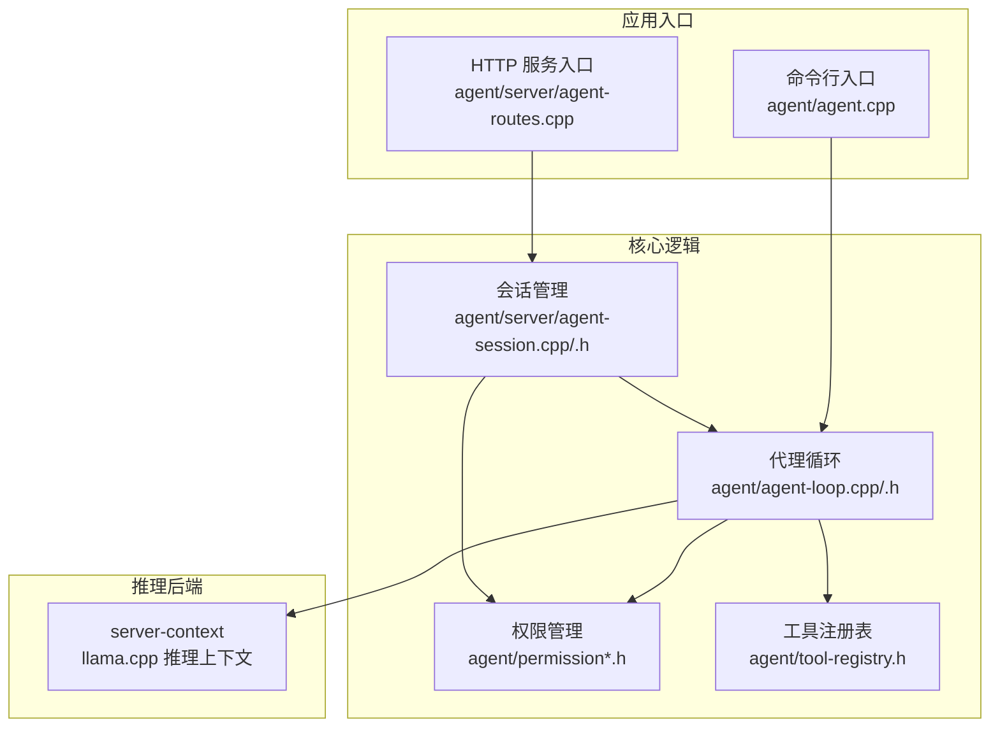
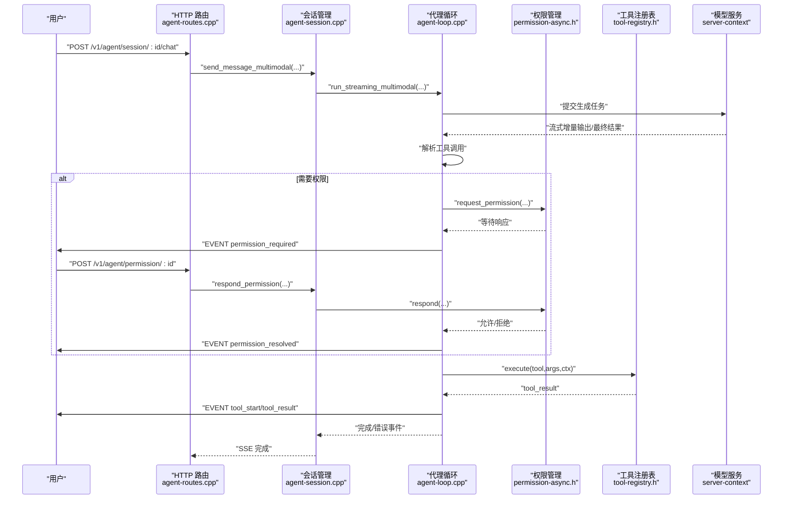
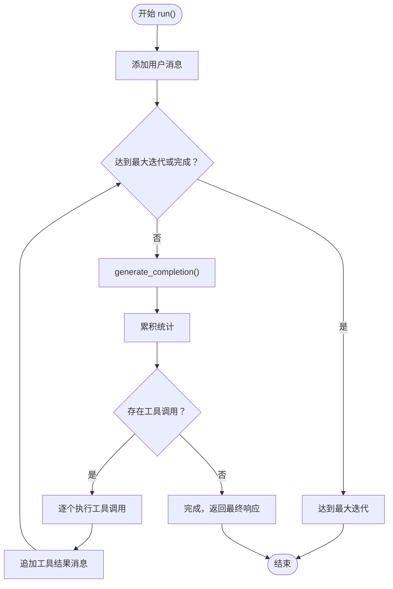
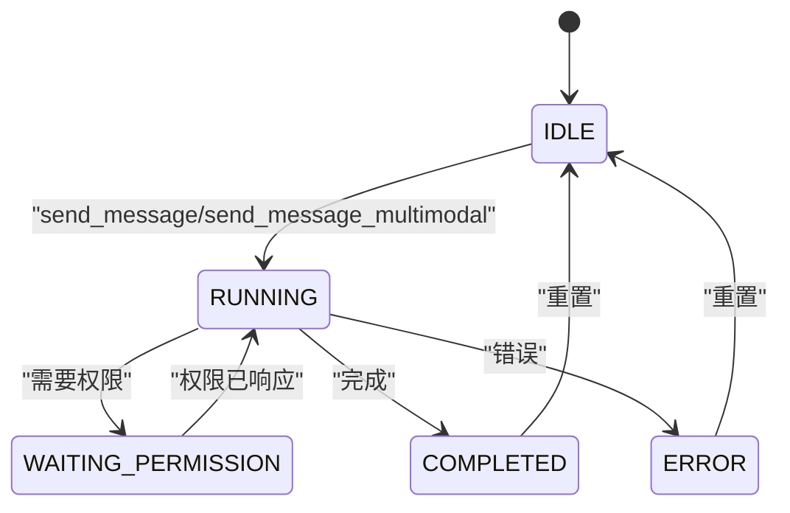
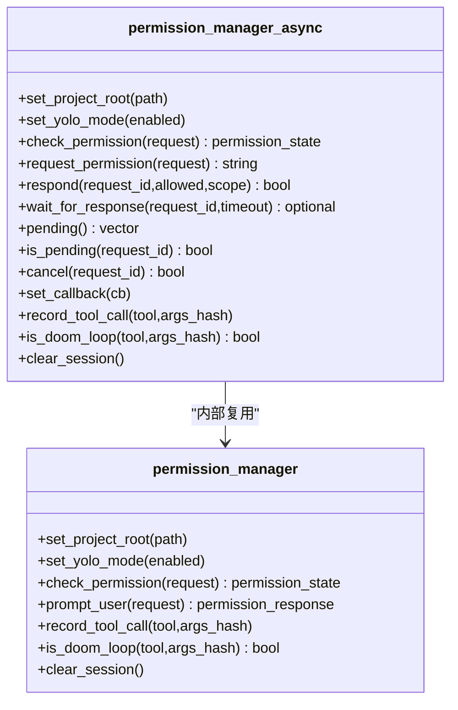
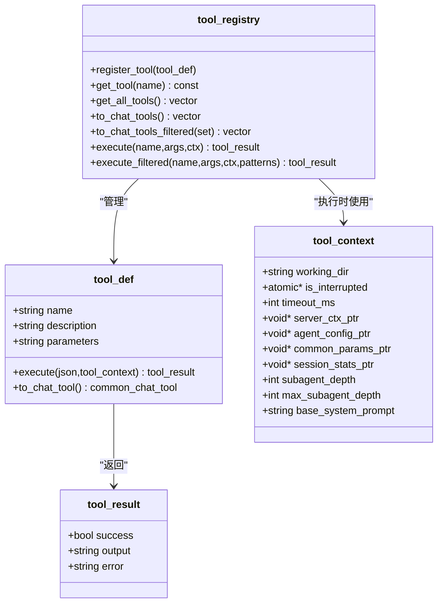
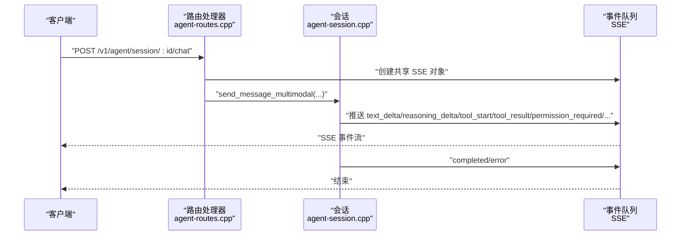
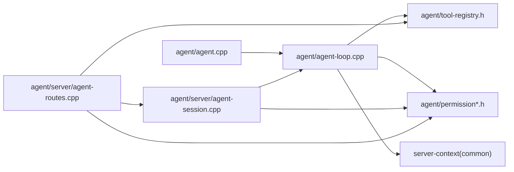

# 代理核心系统

<cite>
**本文引用的文件**
- [agent/agent-loop.cpp](file://agent/agent-loop.cpp)
- [agent/agent-loop.h](file://agent/agent-loop.h)
- [agent/agent.cpp](file://agent/agent.cpp)
- [agent/server/agent-session.cpp](file://agent/server/agent-session.cpp)
- [agent/server/agent-session.h](file://agent/server/agent-session.h)
- [agent/server/agent-routes.cpp](file://agent/server/agent-routes.cpp)
- [agent/server/agent-routes.h](file://agent/server/agent-routes.h)
- [agent/permission.h](file://agent/permission.h)
- [agent/permission-async.h](file://agent/permission-async.h)
- [agent/tool-registry.h](file://agent/tool-registry.h)
- [agent/tools/tool-bash.cpp](file://agent/tools/tool-bash.cpp)
- [agent/tools/tool-read.cpp](file://agent/tools/tool-read.cpp)
- [CMakeLists.txt](file://CMakeLists.txt)
- [agent/CMakeLists.txt](file://agent/CMakeLists.txt)
</cite>

## 目录
1. [简介](#简介)
2. [项目结构](#项目结构)
3. [核心组件](#核心组件)
4. [架构总览](#架构总览)
5. [详细组件分析](#详细组件分析)
6. [依赖关系分析](#依赖关系分析)
7. [性能考量](#性能考量)
8. [故障排查指南](#故障排查指南)
9. [结论](#结论)
10. [附录](#附录)

## 简介
本文件面向“代理核心系统”的技术文档，聚焦于代理循环（agent loop）的实现与运行机制、会话管理、统计信息收集、权限与安全控制、错误处理与中断机制、消息处理流程、性能优化策略以及与服务器端路由与SDK的集成关系。文档以循序渐进的方式组织，既适合初学者理解整体工作流，也为有经验的开发者提供深入的实现细节与最佳实践。

## 项目结构
该项目基于 llama.cpp 的推理后端，提供命令行交互与 HTTP 服务两种入口，并通过工具注册表（tool registry）扩展能力。核心模块包括：
- 代理循环与主程序：负责对话历史维护、消息生成、工具调用、权限检查与统计收集
- 会话管理：支持多会话并发、异步权限响应、SSE 流式事件推送
- 权限与安全：同步与异步权限管理器，危险操作检测与外部路径访问控制
- 工具集：文件读写、编辑、搜索、任务执行等本地工具
- 构建系统：通过 CMake 配置编译目标与依赖

图表来源
- [agent/agent.cpp:101-588](file://agent/agent.cpp#L101-L588)
- [agent/server/agent-routes.cpp:104-494](file://agent/server/agent-routes.cpp#L104-L494)
- [agent/server/agent-session.cpp:37-348](file://agent/server/agent-session.cpp#L37-L348)
- [agent/agent-loop.cpp:49-251](file://agent/agent-loop.cpp#L49-L251)
- [agent/tool-registry.h:58-90](file://agent/tool-registry.h#L58-L90)
- [agent/permission.h:40-102](file://agent/permission.h#L40-L102)

章节来源
- [CMakeLists.txt:1-44](file://CMakeLists.txt#L1-L44)
- [agent/CMakeLists.txt:11-61](file://agent/CMakeLists.txt#L11-L61)

## 核心组件
- 代理循环（agent_loop）
  - 负责单轮或多轮对话、消息历史维护、生成补全、解析工具调用、执行工具、权限校验、统计收集与中断处理
  - 支持文本与多模态输入（图片/音频），提供阻塞式与流式接口
- 会话管理（agent_session / agent_session_manager）
  - 多会话生命周期管理、后台线程执行、SSE 事件推送、异步权限响应、空闲清理
- 权限管理（permission_manager / permission_manager_async）
  - 同步与异步权限检查、危险模式识别、外部目录访问控制、重复调用检测（doom loop）
- 工具注册表（tool_registry）
  - 工具定义、注册、过滤、执行与超时控制；支持子代理的 Bash 命令白名单
- 构建与集成
  - CMake 控制编译目标（CLI、HTTP 服务、SDK），链接 server-context 与 common

章节来源
- [agent/agent-loop.h:167-276](file://agent/agent-loop.h#L167-L276)
- [agent/server/agent-session.h:65-186](file://agent/server/agent-session.h#L65-L186)
- [agent/permission.h:40-102](file://agent/permission.h#L40-L102)
- [agent/permission-async.h:43-142](file://agent/permission-async.h#L43-L142)
- [agent/tool-registry.h:58-103](file://agent/tool-registry.h#L58-L103)

## 架构总览
下图展示从用户输入到模型生成再到工具执行与事件推送的整体流程，涵盖同步与异步权限路径。

图表来源
- [agent/server/agent-routes.cpp:200-348](file://agent/server/agent-routes.cpp#L200-L348)
- [agent/server/agent-session.cpp:103-211](file://agent/server/agent-session.cpp#L103-L211)
- [agent/agent-loop.cpp:333-480](file://agent/agent-loop.cpp#L333-L480)
- [agent/permission-async.h:53-82](file://agent/permission-async.h#L53-L82)
- [agent/tool-registry.h:78-86](file://agent/tool-registry.h#L78-L86)

## 详细组件分析

### 代理循环（agent_loop）
- 初始化与系统提示注入
  - 构造函数根据配置注入技能与 AGENTS.md 内容，设置默认任务参数与工具上下文
  - 子代理支持：可传入允许工具集合、Bash 白名单、自定义系统提示与回调
- 消息与生成
  - 将历史消息转换为聊天模板参数，构建 OAI 兼容工具描述，提交生成任务
  - 支持 ESC 中断与全局中断标志；流式输出思考内容与文本增量
- 工具调用与权限
  - 解析工具调用参数，进行权限检查（文件/目录/命令危险性、重复调用）
  - 子代理可限制 Bash 命令前缀，避免破坏性操作
- 统计与结果
  - 累加输入/输出/缓存令牌数与耗时；记录迭代次数与停止原因
  - 返回最终响应与迭代统计

图表来源
- [agent/agent-loop.cpp:695-788](file://agent/agent-loop.cpp#L695-L788)
- [agent/agent-loop.cpp:333-480](file://agent/agent-loop.cpp#L333-L480)
- [agent/agent-loop.cpp:482-666](file://agent/agent-loop.cpp#L482-L666)

章节来源
- [agent/agent-loop.h:39-82](file://agent/agent-loop.h#L39-L82)
- [agent/agent-loop.h:167-276](file://agent/agent-loop.h#L167-L276)
- [agent/agent-loop.cpp:49-251](file://agent/agent-loop.cpp#L49-L251)
- [agent/agent-loop.cpp:298-310](file://agent/agent-loop.cpp#L298-L310)
- [agent/agent-loop.cpp:311-331](file://agent/agent-loop.cpp#L311-L331)
- [agent/agent-loop.cpp:333-480](file://agent/agent-loop.cpp#L333-L480)
- [agent/agent-loop.cpp:482-666](file://agent/agent-loop.cpp#L482-L666)
- [agent/agent-loop.cpp:668-693](file://agent/agent-loop.cpp#L668-L693)
- [agent/agent-loop.cpp:695-788](file://agent/agent-loop.cpp#L695-L788)

### 会话管理（agent_session / agent_session_manager）
- 生命周期与并发
  - 单会话拥有独立 agent_loop 实例与异步权限管理器
  - 后台线程执行消息处理，避免阻塞 HTTP/SSE
- 事件与状态
  - 状态机：IDLE/RUNNING/WAITING_PERMISSION/COMPLETED/ERROR
  - 支持查询消息、统计、取消、权限响应与清理
- 清理策略
  - 可按空闲时间清理长时间无活动的会话

图表来源
- [agent/server/agent-session.h:46-52](file://agent/server/agent-session.h#L46-L52)
- [agent/server/agent-session.cpp:103-211](file://agent/server/agent-session.cpp#L103-L211)
- [agent/server/agent-session.cpp:333-348](file://agent/server/agent-session.cpp#L333-L348)

章节来源
- [agent/server/agent-session.h:65-186](file://agent/server/agent-session.h#L65-L186)
- [agent/server/agent-session.cpp:37-82](file://agent/server/agent-session.cpp#L37-L82)
- [agent/server/agent-session.cpp:103-211](file://agent/server/agent-session.cpp#L103-L211)
- [agent/server/agent-session.cpp:213-256](file://agent/server/agent-session.cpp#L213-L256)
- [agent/server/agent-session.cpp:259-348](file://agent/server/agent-session.cpp#L259-L348)

### 权限与安全（permission_manager / permission_manager_async）
- 同步权限（交互式）
  - 通过控制台提示用户决定是否允许一次性或会话级权限
  - 检测危险 Bash 模式与外部目录访问，防止越权操作
- 异步权限（API）
  - 以请求 ID 管理待决权限，支持 SSE 通知与外部响应
  - 记录最近工具调用，检测重复调用（doom loop）

图表来源
- [agent/permission.h:40-102](file://agent/permission.h#L40-L102)
- [agent/permission-async.h:43-142](file://agent/permission-async.h#L43-L142)

章节来源
- [agent/permission.h:8-38](file://agent/permission.h#L8-L38)
- [agent/permission.h:40-102](file://agent/permission.h#L40-L102)
- [agent/permission-async.h:14-38](file://agent/permission-async.h#L14-L38)
- [agent/permission-async.h:43-142](file://agent/permission-async.h#L43-L142)

### 工具注册表与工具实现
- 工具注册表
  - 统一管理工具定义、参数 Schema、过滤与执行
  - 支持子代理 Bash 白名单执行
- 典型工具
  - 文件读取：安全检查、行号输出、分页显示
  - Bash 执行：跨平台进程管理、超时控制、输出截断

图表来源
- [agent/tool-registry.h:58-103](file://agent/tool-registry.h#L58-L103)

章节来源
- [agent/tool-registry.h:18-41](file://agent/tool-registry.h#L18-L41)
- [agent/tool-registry.h:58-103](file://agent/tool-registry.h#L58-L103)
- [agent/tools/tool-read.cpp:17-93](file://agent/tools/tool-read.cpp#L17-L93)
- [agent/tools/tool-bash.cpp:50-200](file://agent/tools/tool-bash.cpp#L50-L200)

### HTTP 路由与 SSE 事件
- 路由设计
  - 会话管理：创建、查询、删除、列表
  - 消息与权限：发送消息（文本/多模态）、获取消息、查询权限、响应权限
  - 工具与模型：列出可用工具、模型信息
  - 统计：获取会话统计
- SSE 实现
  - 使用队列与条件变量实现事件流，支持 keep-alive 与完成标记

图表来源
- [agent/server/agent-routes.cpp:200-348](file://agent/server/agent-routes.cpp#L200-L348)
- [agent/server/agent-session.cpp:103-211](file://agent/server/agent-session.cpp#L103-L211)

章节来源
- [agent/server/agent-routes.h:14-68](file://agent/server/agent-routes.h#L14-L68)
- [agent/server/agent-routes.cpp:104-494](file://agent/server/agent-routes.cpp#L104-L494)

## 依赖关系分析
- 组件耦合
  - agent_loop 依赖 server-context 进行推理，依赖 tool-registry 执行工具，依赖 permission 管理权限
  - agent-session 封装 agent_loop 并引入异步权限与线程模型
  - HTTP 路由通过 agent-session 管理器协调会话生命周期
- 外部依赖
  - llama.cpp 推理后端（server-context、common）
  - C++ 标准库与线程库
  - 可选：ASR/TTS 第三方库（qwen3-asr/tts）

图表来源
- [agent/agent.cpp:101-588](file://agent/agent.cpp#L101-L588)
- [agent/server/agent-routes.cpp:104-494](file://agent/server/agent-routes.cpp#L104-L494)
- [agent/server/agent-session.cpp:37-348](file://agent/server/agent-session.cpp#L37-L348)
- [agent/agent-loop.cpp:49-251](file://agent/agent-loop.cpp#L49-L251)

章节来源
- [CMakeLists.txt:1-44](file://CMakeLists.txt#L1-L44)
- [agent/CMakeLists.txt:54-61](file://agent/CMakeLists.txt#L54-L61)
- [agent/CMakeLists.txt:132-148](file://agent/CMakeLists.txt#L132-L148)
- [agent/CMakeLists.txt:186-208](file://agent/CMakeLists.txt#L186-L208)

## 性能考量
- KV 缓存与前缀共享
  - 主代理与子代理共享基础系统提示前缀，提升 KV 缓存命中率，减少重复计算
- 流式输出与增量渲染
  - 通过流式事件与增量内容拼接，降低首字节延迟，改善交互体验
- 统计与指标
  - 会话级统计包含输入/输出令牌数、缓存命中、提示与生成耗时，便于性能分析与优化
- I/O 与超时
  - 工具执行设置超时阈值，避免阻塞；输出截断与行数限制控制内存占用
- 并发与中断
  - 后台线程执行与原子中断标志，确保高并发下的可控取消

章节来源
- [agent/agent-loop.cpp:83-104](file://agent/agent-loop.cpp#L83-L104)
- [agent/agent-loop.cpp:380-388](file://agent/agent-loop.cpp#L380-L388)
- [agent/agent-loop.h:68-81](file://agent/agent-loop.h#L68-L81)
- [agent/tools/tool-bash.cpp:25-27](file://agent/tools/tool-bash.cpp#L25-L27)
- [agent/tools/tool-read.cpp:14-15](file://agent/tools/tool-read.cpp#L14-L15)

## 故障排查指南
- 用户中断与 ESC
  - ESC 键或中断信号触发 is_interrupted 标志，代理循环在关键点检查并提前退出
- 权限被拒
  - 若权限被拒绝或用户选择“永远拒绝”，工具执行直接返回错误；可通过会话权限接口重新响应
- 工具执行失败
  - Bash 工具超时、进程创建失败、输出过大均会被捕获并返回错误；建议缩短命令或分批执行
- 外部目录访问
  - 跨工作目录的文件操作会被拦截并要求确认；请调整工作目录或使用受信任路径
- 重复调用检测
  - 检测到相同工具与参数的重复调用会触发警告并要求确认，避免死循环

章节来源
- [agent/agent-loop.cpp:368-378](file://agent/agent-loop.cpp#L368-L378)
- [agent/agent-loop.cpp:533-565](file://agent/agent-loop.cpp#L533-L565)
- [agent/permission.h:56-62](file://agent/permission.h#L56-L62)
- [agent/permission-async.h:84-89](file://agent/permission-async.h#L84-L89)
- [agent/tools/tool-bash.cpp:62-90](file://agent/tools/tool-bash.cpp#L62-L90)
- [agent/tools/tool-read.cpp:42-45](file://agent/tools/tool-read.cpp#L42-L45)

## 结论
代理核心系统通过清晰的职责划分与事件驱动的流式处理，实现了从消息生成、工具调用到权限控制与统计收集的完整闭环。会话管理与异步权限为多用户与高并发场景提供了稳健支撑；KV 缓存前缀共享与流式增量渲染显著提升了性能与交互体验。建议在生产环境中结合会话清理策略与日志监控，持续优化工具链与权限策略。

## 附录

### 关键数据结构与类型
- 代理配置（agent_config）
  - 字段：最大迭代次数、工具超时、工作目录、详细日志、YOLO 模式、技能与 AGENTS.md 开关、子代理深度
- 会话配置（agent_session_config）
  - 字段：允许工具集合、YOLO 模式、最大迭代、工具超时、工作目录、自定义系统提示、技能与 AGENTS.md 路径、子代理深度
- 会话统计（session_stats）
  - 字段：输入/输出/缓存令牌总数、提示与生成总耗时、子代理统计与计数
- 事件类型（agent_event_type）
  - 文本增量、思考内容、工具开始/结果、权限请求/已决、迭代开始、完成、错误

章节来源
- [agent/agent-loop.h:39-58](file://agent/agent-loop.h#L39-L58)
- [agent/server/agent-session.h:26-43](file://agent/server/agent-session.h#L26-L43)
- [agent/agent-loop.h:68-81](file://agent/agent-loop.h#L68-L81)
- [agent/agent-loop.h:84-94](file://agent/agent-loop.h#L84-L94)

### API 与使用模式
- 命令行模式
  - 启动后加载模型与推理线程，进入交互循环；支持 /clear、/stats、/tools、/skills、/agents 等命令
- HTTP 服务模式
  - 创建会话，发送消息（文本或多模态），通过 SSE 获取事件流；可查询权限并进行响应
- 子代理模式
  - 通过受限工具集与 Bash 白名单，实现只读探索或受限执行

章节来源
- [agent/agent.cpp:101-588](file://agent/agent.cpp#L101-L588)
- [agent/server/agent-routes.cpp:111-158](file://agent/server/agent-routes.cpp#L111-L158)
- [agent/server/agent-routes.cpp:200-348](file://agent/server/agent-routes.cpp#L200-L348)
- [agent/server/agent-session.cpp:103-211](file://agent/server/agent-session.cpp#L103-L211)