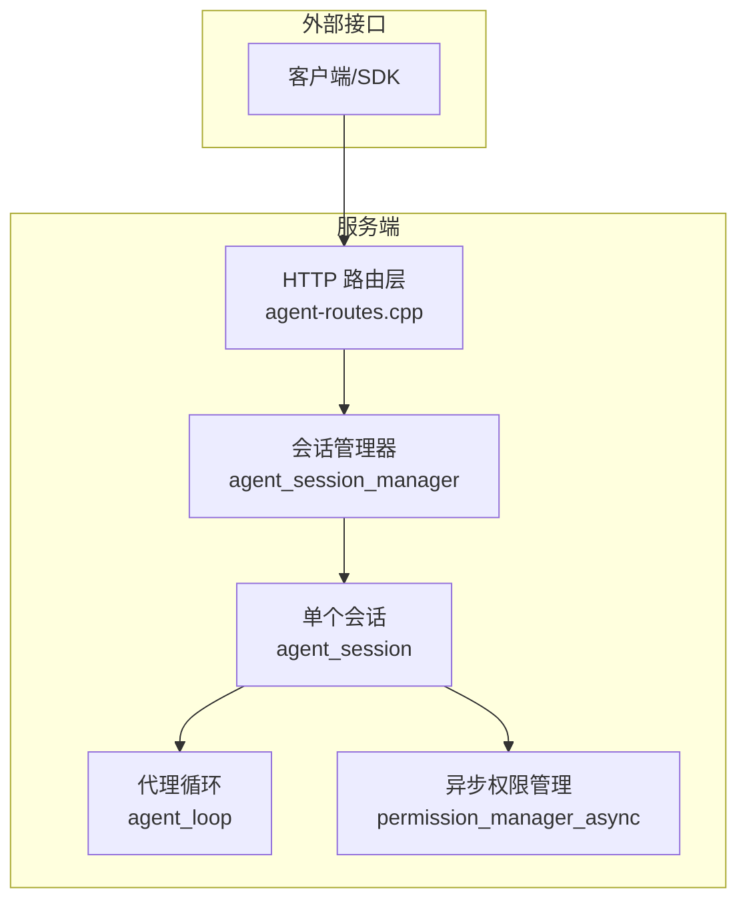
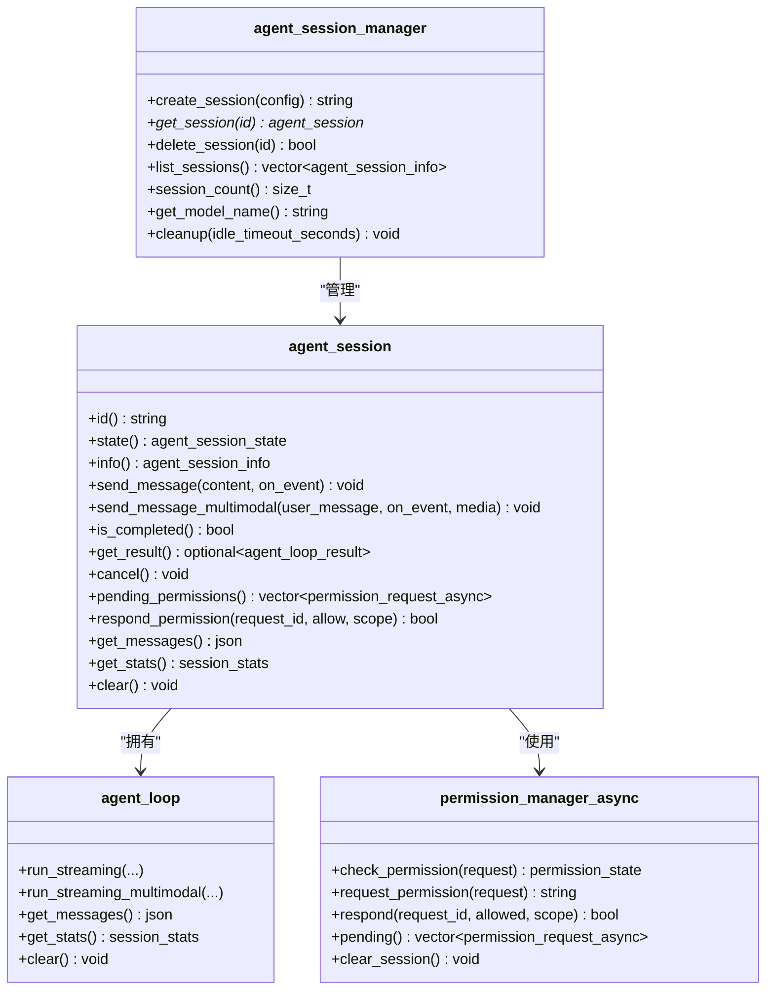
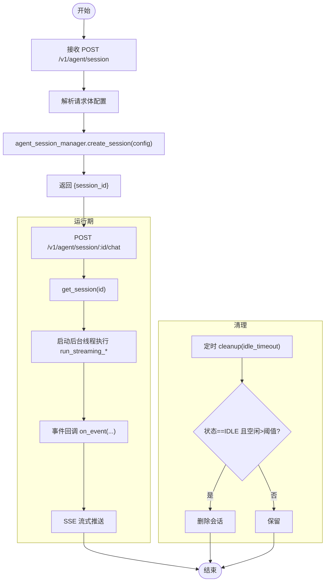
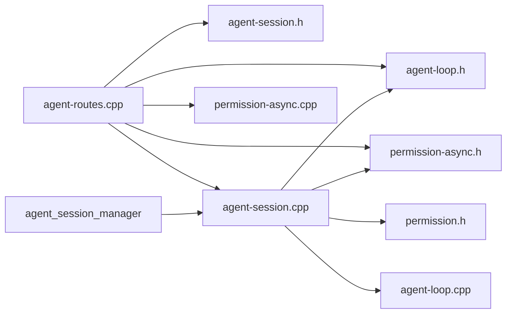

# 会话管理

<cite>
**本文引用的文件列表**
- [agent-session.h](file://agent/server/agent-session.h)
- [agent-session.cpp](file://agent/server/agent-session.cpp)
- [agent-loop.h](file://agent/agent-loop.h)
- [agent-loop.cpp](file://agent/agent-loop.cpp)
- [agent-routes.h](file://agent/server/agent-routes.h)
- [agent-routes.cpp](file://agent/server/agent-routes.cpp)
- [permission-async.h](file://agent/permission-async.h)
- [permission-async.cpp](file://agent/permission-async.cpp)
- [permission.h](file://agent/permission.h)
</cite>

## 目录
1. [简介](#简介)
2. [项目结构](#项目结构)
3. [核心组件](#核心组件)
4. [架构总览](#架构总览)
5. [详细组件分析](#详细组件分析)
6. [依赖关系分析](#依赖关系分析)
7. [性能考量](#性能考量)
8. [故障排查指南](#故障排查指南)
9. [结论](#结论)
10. [附录](#附录)

## 简介
本文件面向会话管理系统，系统性阐述会话生命周期管理、状态持久化、并发控制、权限与安全、消息历史管理、会话与代理循环的关系、数据隔离机制、监控与清理策略，并提供最佳实践与常见问题解决方案。重点围绕 agent_session 类的设计与实现，覆盖从创建、运行、权限处理到销毁的完整流程；同时解释会话配置项、超时与清理策略，以及与 HTTP 路由层的集成方式。

## 项目结构
会话管理位于 agent/server 子模块中，核心文件包括：
- 会话与会话管理器：agent-session.h/.cpp
- 代理循环与事件模型：agent-loop.h/.cpp
- HTTP 路由与 SSE 流式响应：agent-routes.h/.cpp
- 权限异步管理：permission-async.h/.cpp 与同步版本 permission.h



图表来源
- [agent-routes.cpp:104-494](file://agent/server/agent-routes.cpp#L104-L494)
- [agent-session.h:148-185](file://agent/server/agent-session.h#L148-L185)
- [agent-session.cpp:258-347](file://agent/server/agent-session.cpp#L258-L347)
- [agent-loop.h:167-276](file://agent/agent-loop.h#L167-L276)
- [permission-async.h:43-142](file://agent/permission-async.h#L43-L142)

章节来源
- [agent-routes.h:14-68](file://agent/server/agent-routes.h#L14-L68)
- [agent-routes.cpp:104-494](file://agent/server/agent-routes.cpp#L104-L494)
- [agent-session.h:64-185](file://agent/server/agent-session.h#L64-L185)
- [agent-session.cpp:36-347](file://agent/server/agent-session.cpp#L36-L347)
- [agent-loop.h:167-276](file://agent/agent-loop.h#L167-L276)
- [permission-async.h:43-142](file://agent/permission-async.h#L43-L142)

## 核心组件
- 会话配置 agent_session_config：工具白名单、YOLO 模式、最大迭代次数、工具超时、工作目录、自定义系统提示、技能与 AGENTS.md 开关、子代理深度限制等。
- 会话状态 agent_session_state：空闲、运行中、等待权限、已完成、错误。
- 单个会话 agent_session：封装 agent_loop、异步权限管理、线程、时间戳、消息历史与统计信息。
- 会话管理器 agent_session_manager：负责会话创建、查询、删除、列举、清理与模型名获取。
- 代理循环 agent_loop：执行推理、工具调用、权限检查、消息历史维护、统计收集与流式事件输出。
- 异步权限管理 permission_manager_async：非阻塞权限请求队列、回调通知、会话级覆盖、危险模式检测与外部路径判断。

章节来源
- [agent-session.h:26-52](file://agent/server/agent-session.h#L26-L52)
- [agent-session.h:64-145](file://agent/server/agent-session.h#L64-L145)
- [agent-session.h:148-185](file://agent/server/agent-session.h#L148-L185)
- [agent-loop.h:39-81](file://agent/agent-loop.h#L39-L81)
- [agent-loop.h:167-276](file://agent/agent-loop.h#L167-L276)
- [permission-async.h:14-99](file://agent/permission-async.h#L14-L99)

## 架构总览
会话管理采用“HTTP 路由层 -> 会话管理器 -> 单个会话 -> 代理循环”的分层设计。HTTP 层负责解析请求、构造 SSE 流式响应；会话管理器负责会话生命周期与并发安全；单个会话负责消息历史、权限与后台线程；代理循环负责推理、工具执行与事件流。

```mermaid
sequenceDiagram
participant Client as "客户端"
participant Routes as "HTTP 路由"
participant Manager as "会话管理器"
participant Session as "agent_session"
participant Loop as "agent_loop"
participant Perm as "权限管理"
Client->>Routes : POST /v1/agent/session
Routes->>Manager : create_session(config)
Manager-->>Routes : session_id
Routes-->>Client : {session_id}
Client->>Routes : POST /v1/agent/session/ : id/chat
Routes->>Manager : get_session(id)
Manager-->>Routes : agent_session*
Routes->>Session : send_message_multimodal(user_message, on_event, media)
Session->>Loop : run_streaming_multimodal(...)
Loop->>Perm : check_permission()/request_permission()
Loop-->>Session : agent_event (TEXT_DELTA/TOOL_START/PERMISSION_REQUIRED/...)
Session-->>Routes : SSE 事件
Routes-->>Client : text/event-stream
Client->>Routes : POST /v1/agent/permission/ : id
Routes->>Manager : 遍历会话
Manager-->>Routes : agent_session*
Routes->>Session : respond_permission(...)
Session->>Perm : respond(...)
Session-->>Routes : {status : success}
Routes-->>Client : {status : success}
```

图表来源
- [agent-routes.cpp:111-424](file://agent/server/agent-routes.cpp#L111-L424)
- [agent-session.cpp:103-211](file://agent/server/agent-session.cpp#L103-L211)
- [agent-loop.h:198-211](file://agent/agent-loop.h#L198-L211)
- [permission-async.cpp:124-178](file://agent/permission-async.cpp#L124-L178)

## 详细组件分析

### agent_session 类设计与实现
- 关键职责
  - 维护会话状态（原子状态机）、运行标志、中断标志与最近活动时间。
  - 封装 agent_loop，按需延迟初始化，支持文本与多模态消息。
  - 使用后台线程执行推理，避免阻塞 HTTP 处理。
  - 通过 permission_manager_async 实现非阻塞权限请求与响应。
  - 提供消息历史、统计信息查询与清空能力。
- 并发与线程安全
  - 状态字段使用原子类型；结果读取使用互斥锁保护。
  - 会话管理器内部使用互斥锁保护会话表。
  - 后台线程在每次新消息前 join 上次线程，确保串行化运行。
- 生命周期
  - 创建：构造函数根据配置初始化权限管理与技能/AGENTS.md 内容缓存。
  - 运行：send_message/send_message_multimodal -> 启动后台线程 -> run_streaming/run_streaming_multimodal -> 更新状态与活动时间。
  - 销毁：析构中取消当前任务并等待线程结束；管理器删除时清理会话容器。



图表来源
- [agent-session.h:64-145](file://agent/server/agent-session.h#L64-L145)
- [agent-session.h:148-185](file://agent/server/agent-session.h#L148-L185)
- [agent-loop.h:167-276](file://agent/agent-loop.h#L167-L276)
- [permission-async.h:43-142](file://agent/permission-async.h#L43-L142)

章节来源
- [agent-session.h:64-145](file://agent/server/agent-session.h#L64-L145)
- [agent-session.cpp:36-89](file://agent/server/agent-session.cpp#L36-L89)
- [agent-session.cpp:103-211](file://agent/server/agent-session.cpp#L103-L211)
- [agent-session.cpp:220-256](file://agent/server/agent-session.cpp#L220-L256)

### 会话创建与销毁流程
- 创建
  - HTTP 路由解析请求体中的会话配置，调用会话管理器创建会话并返回 session_id。
  - 会话构造函数根据配置设置工作目录、YOLO 模式、技能与 AGENTS.md 发现与缓存。
- 销毁
  - 管理器删除会话或析构函数中取消任务并等待线程结束。
  - 清理策略：按空闲超时清理 IDLE 状态且超过阈值的会话。



图表来源
- [agent-routes.cpp:111-158](file://agent/server/agent-routes.cpp#L111-L158)
- [agent-session.cpp:275-280](file://agent/server/agent-session.cpp#L275-L280)
- [agent-session.cpp:333-347](file://agent/server/agent-session.cpp#L333-L347)

章节来源
- [agent-routes.cpp:111-158](file://agent/server/agent-routes.cpp#L111-L158)
- [agent-session.cpp:275-280](file://agent/server/agent-session.cpp#L275-L280)
- [agent-session.cpp:333-347](file://agent/server/agent-session.cpp#L333-L347)

### 消息历史管理机制
- 历史存储
  - agent_loop 维护 messages_ JSON 数组，包含系统提示与用户/助手/工具消息。
  - 会话层提供 get_messages() 返回当前历史。
- 清理策略
  - clear() 保留系统提示，清空其余消息并重置统计。
  - 会话管理器的 cleanup() 基于空闲时间与状态进行回收。
- 多模态支持
  - 用户消息可包含文本、图像与音频内容，经预处理后注入消息历史。

章节来源
- [agent-loop.h:216-221](file://agent/agent-loop.h#L216-L221)
- [agent-loop.cpp:298-309](file://agent/agent-loop.cpp#L298-L309)
- [agent-session.cpp:233-256](file://agent/server/agent-session.cpp#L233-L256)
- [agent-routes.cpp:212-298](file://agent/server/agent-routes.cpp#L212-L298)

### 会话与代理循环的关系
- 会话持有 agent_loop 的唯一指针，按需创建；配置透传至 agent_loop。
- 会话状态机与 agent_loop 的停止原因相互映射（完成、最大迭代、用户取消、错误）。
- 会话负责事件流式回调与权限响应的桥接，代理循环负责实际推理与工具执行。

章节来源
- [agent-session.cpp:115-137](file://agent/server/agent-session.cpp#L115-L137)
- [agent-loop.h:61-66](file://agent/agent-loop.h#L61-L66)
- [agent-loop.h:31-36](file://agent/agent-loop.h#L31-L36)

### 数据隔离机制
- 会话级隔离
  - 每个 agent_session 拥有独立的 agent_loop、权限管理器与消息历史。
  - 会话管理器以 map<string, unique_ptr<agent_session>> 管理，互斥锁保护。
- 工作目录与外部路径
  - 权限管理器基于项目根目录判断外部路径访问，防止越权操作。
- 子代理隔离
  - 子代理继承父会话配置但受工具白名单与 Bash 模式限制，深度受限。

章节来源
- [agent-session.h:125-126](file://agent/server/agent-session.h#L125-L126)
- [agent-session.cpp:44-47](file://agent/server/agent-session.cpp#L44-L47)
- [permission-async.cpp:280-282](file://agent/permission-async.cpp#L280-L282)
- [agent-loop.h:261-266](file://agent/agent-loop.h#L261-L266)

### 并发控制与权限处理
- 并发模型
  - 会话内串行化：每次发送消息前 join 上次后台线程，确保同一时刻仅有一个运行中的任务。
  - 会话管理器使用互斥锁保护会话表。
  - 事件回调在会话后台线程中触发，通过 SSE 推送至客户端。
- 权限模型
  - 同步版本 permission_manager 与异步版本 permission_manager_async 共存。
  - 异步权限通过队列与回调实现非阻塞；支持一次性与会话级授权范围。
  - 危险命令与重复调用检测，外部路径访问控制。

章节来源
- [agent-session.cpp:105-108](file://agent/server/agent-session.cpp#L105-L108)
- [agent-session.cpp:220-231](file://agent/server/agent-session.cpp#L220-L231)
- [permission-async.h:43-99](file://agent/permission-async.h#L43-L99)
- [permission-async.cpp:89-122](file://agent/permission-async.cpp#L89-L122)

### 会话配置选项、超时与清理策略
- 会话配置项
  - allowed_tools：工具白名单（空集表示全部允许）
  - yolo_mode：跳过权限提示
  - max_iterations：最大迭代次数
  - tool_timeout_ms：工具执行超时（毫秒）
  - working_dir：工作目录
  - system_prompt：自定义系统提示
  - enable_skills/enable_agents_md：技能与 AGENTS.md 开关
  - extra_skills_paths：额外技能搜索路径
  - max_subagent_depth：子代理最大嵌套深度（0-5）
- 超时与清理
  - 工具超时：在 agent_loop 中传递给工具上下文。
  - 会话空闲超时：会话管理器 cleanup(idle_timeout_seconds)，仅清理 IDLE 且超过阈值的会话。

章节来源
- [agent-session.h:26-43](file://agent/server/agent-session.h#L26-L43)
- [agent-session.cpp:117-133](file://agent/server/agent-session.cpp#L117-L133)
- [agent-session.cpp:333-347](file://agent/server/agent-session.cpp#L333-L347)

### 会话监控与统计
- 会话统计
  - 输入/输出/缓存令牌数、提示与生成耗时。
  - 子代理专用统计（输入/输出/缓存令牌与运行次数）。
- HTTP 接口
  - GET /v1/agent/session/:id/stats 返回会话统计。
  - GET /v1/agent/session/:id/messages 获取消息历史。
  - GET /v1/agent/sessions 列举所有会话基本信息。

章节来源
- [agent-loop.h:68-81](file://agent/agent-loop.h#L68-L81)
- [agent-routes.cpp:452-471](file://agent/server/agent-routes.cpp#L452-L471)
- [agent-routes.cpp:350-362](file://agent/server/agent-routes.cpp#L350-L362)
- [agent-routes.cpp:187-198](file://agent/server/agent-routes.cpp#L187-L198)

## 依赖关系分析



图表来源
- [agent-routes.cpp:1-17](file://agent/server/agent-routes.cpp#L1-L17)
- [agent-session.cpp:1-7](file://agent/server/agent-session.cpp#L1-L7)
- [agent-loop.h:1-16](file://agent/agent-loop.h#L1-L16)
- [permission-async.h:1-13](file://agent/permission-async.h#L1-L13)
- [permission.h:1-14](file://agent/permission.h#L1-L14)

章节来源
- [agent-routes.cpp:1-17](file://agent/server/agent-routes.cpp#L1-L17)
- [agent-session.cpp:1-7](file://agent/server/agent-session.cpp#L1-L7)
- [agent-loop.h:1-16](file://agent/agent-loop.h#L1-L16)
- [permission-async.h:1-13](file://agent/permission-async.h#L1-L13)
- [permission.h:1-14](file://agent/permission.h#L1-L14)

## 性能考量
- 线程与串行化
  - 会话内串行化运行，避免竞争条件；后台线程 join 保证资源释放及时。
- 统计与计时
  - 代理循环累计输入/输出/缓存令牌与耗时，便于性能分析与优化。
- SSE 流式传输
  - 事件驱动推送，降低内存占用与延迟。
- 子代理与缓存前缀共享
  - 子代理继承系统提示前缀，提升 KV 缓存命中率。

章节来源
- [agent-session.cpp:105-108](file://agent/server/agent-session.cpp#L105-L108)
- [agent-loop.cpp:719-731](file://agent/agent-loop.cpp#L719-L731)
- [agent-routes.cpp:36-85](file://agent/server/agent-routes.cpp#L36-L85)
- [agent-loop.cpp:83-104](file://agent/agent-loop.cpp#L83-L104)

## 故障排查指南
- 会话未找到
  - 检查 session_id 是否正确传递；确认会话是否被清理。
- 权限相关
  - 若出现 PERMISSION_REQUIRED 事件，需通过 POST /v1/agent/permission/:id 响应。
  - 检查 yolo_mode 与 allowed_tools 设置。
- 超时与中断
  - 工具超时可通过 tool_timeout_ms 调整；用户可取消当前任务。
- 多模态内容
  - 确认 content 类型为字符串或数组；base64 解码失败会导致 400。
- 清理策略
  - 定期调用 cleanup(idle_timeout_seconds) 清理空闲会话，避免资源泄漏。

章节来源
- [agent-routes.cpp:160-185](file://agent/server/agent-routes.cpp#L160-L185)
- [agent-routes.cpp:387-424](file://agent/server/agent-routes.cpp#L387-L424)
- [agent-routes.cpp:296-298](file://agent/server/agent-routes.cpp#L296-L298)
- [agent-session.cpp:333-347](file://agent/server/agent-session.cpp#L333-L347)

## 结论
该会话管理系统通过清晰的分层设计与严格的并发控制，实现了高可用、可观测、可扩展的会话生命周期管理。agent_session 将权限、消息历史、统计与事件流整合为一体，配合 agent_session_manager 的生命周期与清理策略，满足生产环境下的稳定性与性能需求。建议在部署时结合业务场景合理配置工具白名单、超时与清理策略，并通过 SSE 事件与统计接口进行持续监控。

## 附录
- 代码示例路径（不直接展示代码内容）
  - 创建会话：[agent-routes.cpp:111-158](file://agent/server/agent-routes.cpp#L111-L158)
  - 发送消息（文本/多模态）：[agent-session.cpp:103-211](file://agent/server/agent-session.cpp#L103-L211)
  - 权限响应：[agent-routes.cpp:387-424](file://agent/server/agent-routes.cpp#L387-L424)
  - 获取消息历史：[agent-routes.cpp:350-362](file://agent/server/agent-routes.cpp#L350-L362)
  - 获取统计：[agent-routes.cpp:452-471](file://agent/server/agent-routes.cpp#L452-L471)
  - 清理空闲会话：[agent-session.cpp:333-347](file://agent/server/agent-session.cpp#L333-L347)