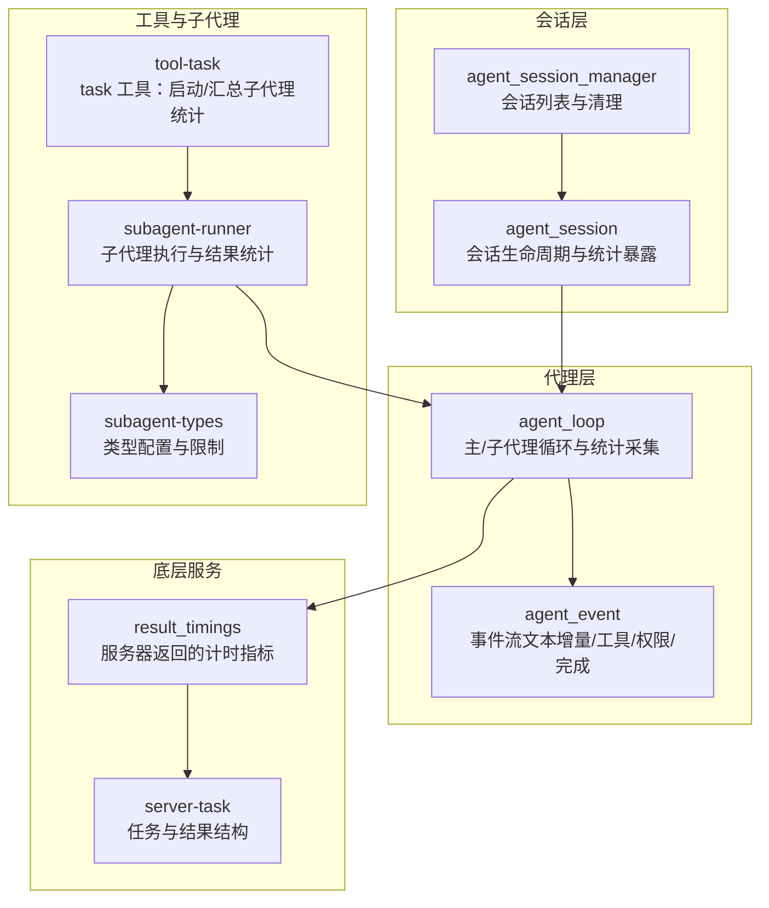
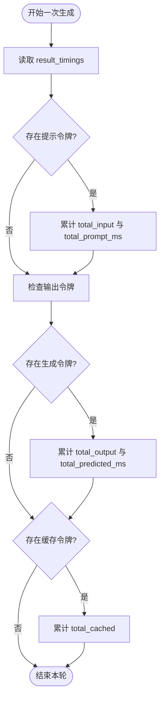
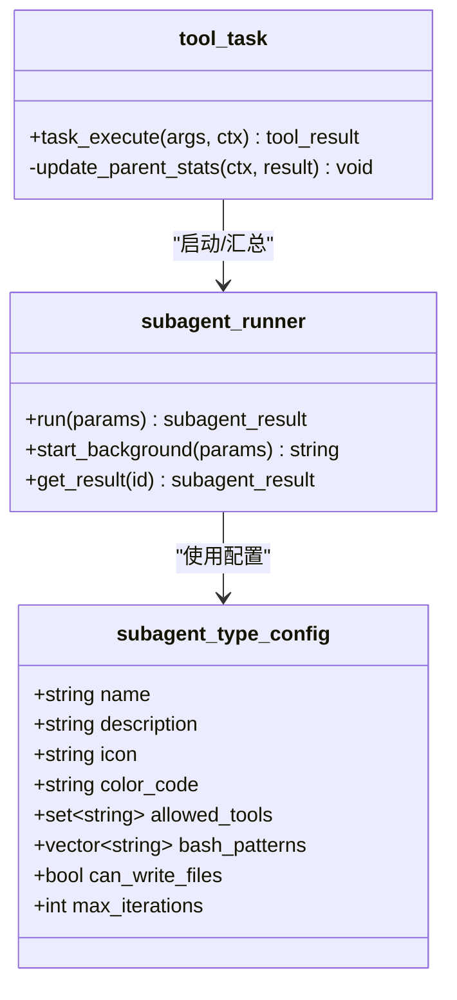
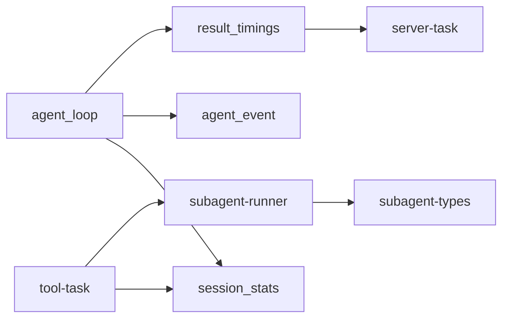

# 统计监控

<cite>
**本文引用的文件**
- [agent-loop.h](file://agent/agent-loop.h)
- [agent-loop.cpp](file://agent/agent-loop.cpp)
- [agent-session.h](file://agent/server/agent-session.h)
- [agent-session.cpp](file://agent/server/agent-session.cpp)
- [tool-task.cpp](file://agent/tools/tool-task.cpp)
- [subagent-runner.cpp](file://agent/subagent/subagent-runner.cpp)
- [subagent-types.h](file://agent/subagent/subagent-types.h)
- [subagent-types.cpp](file://agent/subagent/subagent-types.cpp)
- [server-task.h](file://third_party/llama.cpp/tools/server/server-task.h)
- [server-task.cpp](file://third_party/llama.cpp/tools/server/server-task.cpp)
- [test_completion.py](file://third_party/qwen3-tts-cpp/third_party/llama.cpp/tools/server/tests/unit/test_completion.py)
</cite>

## 目录
1. [简介](#简介)
2. [项目结构](#项目结构)
3. [核心组件](#核心组件)
4. [架构总览](#架构总览)
5. [详细组件分析](#详细组件分析)
6. [依赖关系分析](#依赖关系分析)
7. [性能考量](#性能考量)
8. [故障排查指南](#故障排查指南)
9. [结论](#结论)
10. [附录](#附录)

## 简介
本技术文档围绕统计监控系统进行深入解析，重点覆盖以下方面：
- session_stats 结构体设计与字段含义
- 输入令牌、输出令牌、缓存令牌的统计逻辑
- 提示处理时间（prompt_ms）与生成时间（predicted_ms）的测量机制
- 子代理（subagent）统计的特殊处理与聚合方式
- 实时监控与事件流的实现方法
- 性能优化与瓶颈识别策略
- 监控仪表板集成、告警配置与基准测试实践

## 项目结构
统计监控能力贯穿主代理循环、会话管理、工具执行、子代理运行器等多个模块，形成“从模型推理到工具调用”的全链路统计闭环。



图表来源
- [agent-session.h:65-145](file://agent/server/agent-session.h#L65-L145)
- [agent-session.cpp:258-347](file://agent/server/agent-session.cpp#L258-L347)
- [agent-loop.h:68-82](file://agent/agent-loop.h#L68-L82)
- [agent-loop.cpp:695-788](file://agent/agent-loop.cpp#L695-L788)
- [tool-task.cpp:50-69](file://agent/tools/tool-task.cpp#L50-L69)
- [subagent-runner.cpp:133-244](file://agent/subagent/subagent-runner.cpp#L133-L244)
- [subagent-types.h:8-26](file://agent/subagent/subagent-types.h#L8-L26)
- [server-task.h:258-278](file://third_party/llama.cpp/tools/server/server-task.h#L258-L278)
- [server-task.cpp:519-540](file://third_party/llama.cpp/tools/server/server-task.cpp#L519-L540)

章节来源
- [agent-session.h:65-145](file://agent/server/agent-session.h#L65-L145)
- [agent-session.cpp:258-347](file://agent/server/agent-session.cpp#L258-L347)
- [agent-loop.h:68-82](file://agent/agent-loop.h#L68-L82)
- [agent-loop.cpp:695-788](file://agent/agent-loop.cpp#L695-L788)
- [tool-task.cpp:50-69](file://agent/tools/tool-task.cpp#L50-L69)
- [subagent-runner.cpp:133-244](file://agent/subagent/subagent-runner.cpp#L133-L244)
- [subagent-types.h:8-26](file://agent/subagent/subagent-types.h#L8-L26)
- [server-task.h:258-278](file://third_party/llama.cpp/tools/server/server-task.h#L258-L278)
- [server-task.cpp:519-540](file://third_party/llama.cpp/tools/server/server-task.cpp#L519-L540)

## 核心组件
- session_stats：会话级令牌与时间统计聚合结构，包含主代理与子代理两套维度。
- agent_loop：主/子代理循环，负责构建提示、发起推理、解析响应、执行工具调用，并累计统计。
- agent_event：事件流接口，支持文本增量、推理内容、工具调用、权限请求/解决、迭代开始、完成、错误等事件。
- tool-task：task 工具入口，负责启动子代理并在完成后将子代理统计合并到父会话。
- subagent-runner：子代理执行器，按类型构建受限系统提示，执行任务并返回令牌统计。
- result_timings：服务器返回的计时指标，包含 prompt_n/predicted_n/cache_n 及对应耗时。

章节来源
- [agent-loop.h:68-82](file://agent/agent-loop.h#L68-L82)
- [agent-loop.cpp:695-788](file://agent/agent-loop.cpp#L695-L788)
- [agent-loop.cpp:886-1007](file://agent/agent-loop.cpp#L886-L1007)
- [tool-task.cpp:50-69](file://agent/tools/tool-task.cpp#L50-L69)
- [subagent-runner.cpp:133-244](file://agent/subagent/subagent-runner.cpp#L133-L244)
- [server-task.h:258-278](file://third_party/llama.cpp/tools/server/server-task.h#L258-L278)

## 架构总览
统计监控以“主代理循环”为核心，通过以下路径实现端到端统计：
- 模型推理阶段：每次生成完成后，从 result_timings 中读取 prompt_n/predicted_n/cache_n 与对应毫秒数，累加到 session_stats。
- 工具调用阶段：工具执行前记录起始时间，结束后计算耗时并通过事件或回调上报；同时更新工具调用计数。
- 子代理阶段：子代理独立运行，其 session_stats 被汇总到父会话，形成“主代理 = 总计 - 子代理”的对比视图。

```mermaid
sequenceDiagram
participant Client as "客户端"
participant Session as "agent_session"
participant Loop as "agent_loop"
participant Server as "服务器任务"
participant Tool as "工具执行"
participant Sub as "子代理"
Client->>Session : 发送消息
Session->>Loop : run_streaming(...)
Loop->>Server : 提交推理任务
Server-->>Loop : 返回部分/最终结果含计时
Loop->>Loop : 累计 total_input/output/cached 与 prompt_ms/predicted_ms
Loop->>Tool : 执行工具调用
Tool-->>Loop : 返回结果与耗时
Loop->>Loop : 记录工具调用次数
Tool->>Sub : 启动子代理
Sub-->>Tool : 返回子代理统计
Tool->>Loop : 汇总子代理统计到父会话
Loop-->>Session : 事件流文本增量/工具/完成
Session-->>Client : 返回统计摘要
```

图表来源
- [agent-session.cpp:103-156](file://agent/server/agent-session.cpp#L103-L156)
- [agent-loop.cpp:886-1007](file://agent/agent-loop.cpp#L886-L1007)
- [agent-loop.cpp:1144-1240](file://agent/agent-loop.cpp#L1144-L1240)
- [tool-task.cpp:71-208](file://agent/tools/tool-task.cpp#L71-L208)
- [subagent-runner.cpp:133-244](file://agent/subagent/subagent-runner.cpp#L133-L244)

## 详细组件分析

### session_stats 结构体设计与字段语义
- 主代理统计（用于对外展示与聚合）
  - total_input：累计提示令牌数（prompt_n 累加）
  - total_output：累计输出令牌数（predicted_n 累加）
  - total_cached：累计从 KV 缓存复用的令牌数（cache_n 累加）
  - total_prompt_ms：累计提示处理总时长（毫秒）
  - total_predicted_ms：累计生成总时长（毫秒）
- 子代理统计（用于拆分与对比）
  - subagent_input/output/cached：子代理贡献的令牌统计
  - subagent_count：子代理执行次数
- 对外展示策略
  - “主代理 = 总计 - 子代理”：通过父会话统计减去子代理统计得到主代理的净值，便于区分资源消耗来源。

章节来源
- [agent-loop.h:68-82](file://agent/agent-loop.h#L68-L82)
- [agent-loop.cpp:719-731](file://agent/agent-loop.cpp#L719-L731)
- [agent-loop.cpp:920-932](file://agent/agent-loop.cpp#L920-L932)
- [agent-loop.cpp:1054-1066](file://agent/agent-loop.cpp#L1054-L1066)
- [tool-task.cpp:50-69](file://agent/tools/tool-task.cpp#L50-L69)

### 令牌统计逻辑与聚合方式
- 主代理循环在每次生成后，从 result_timings 中读取 prompt_n/predicted_n/cache_n 并累加到 session_stats。
- 子代理独立运行，其统计由子代理执行器收集后，通过工具上下文指针回写到父会话的 session_stats，实现“父子统计叠加”。



图表来源
- [agent-loop.cpp:719-731](file://agent/agent-loop.cpp#L719-L731)
- [agent-loop.cpp:920-932](file://agent/agent-loop.cpp#L920-L932)
- [agent-loop.cpp:1054-1066](file://agent/agent-loop.cpp#L1054-L1066)

章节来源
- [agent-loop.cpp:719-731](file://agent/agent-loop.cpp#L719-L731)
- [agent-loop.cpp:920-932](file://agent/agent-loop.cpp#L920-L932)
- [agent-loop.cpp:1054-1066](file://agent/agent-loop.cpp#L1054-L1066)

### 时间测量机制与事件流
- 时间测量
  - 生成阶段：服务器返回 result_timings，包含 prompt_ms 与 predicted_ms。
  - 工具调用阶段：在工具执行前后记录 steady_clock 时间差，得到单次工具耗时。
- 事件流
  - 文本增量、推理内容、工具开始/结果、权限请求/解决、迭代开始、完成、错误等事件，均携带统计相关信息（如工具耗时、最终统计）。

```mermaid
sequenceDiagram
participant Loop as "agent_loop"
participant Server as "服务器"
participant Tool as "工具"
participant Events as "事件回调"
Loop->>Server : 提交任务
Server-->>Loop : 部分结果含计时
Loop->>Loop : 累计 prompt_ms/predicted_ms
Loop->>Tool : 执行工具调用
Tool-->>Loop : 返回结果与耗时
Loop->>Events : 发送 tool_result(含耗时)
Loop-->>Events : 发送 completed(含统计)
```

图表来源
- [agent-loop.cpp:1144-1240](file://agent/agent-loop.cpp#L1144-L1240)
- [agent-loop.cpp:976-994](file://agent/agent-loop.cpp#L976-L994)
- [agent-loop.cpp:1112-1124](file://agent/agent-loop.cpp#L1112-L1124)

章节来源
- [agent-loop.cpp:1144-1240](file://agent/agent-loop.cpp#L1144-L1240)
- [agent-loop.cpp:976-994](file://agent/agent-loop.cpp#L976-L994)
- [agent-loop.cpp:1112-1124](file://agent/agent-loop.cpp#L1112-L1124)

### 子代理统计的特殊处理与聚合
- 子代理类型配置
  - 不同类型（探索、规划、通用、Bash）具有不同的工具白名单、最大迭代次数与 Bash 前缀限制，确保安全与可控。
- 子代理执行与统计
  - 子代理执行器构建受限系统提示，按类型注入行为约束；执行完成后返回 input/output/cached 令牌统计。
- 父会话统计合并
  - task 工具在子代理完成后，将子代理统计累加到父会话的 session_stats，并增加子代理计数，从而实现“主代理 = 总计 - 子代理”的对比视图。



图表来源
- [subagent-types.h:16-26](file://agent/subagent/subagent-types.h#L16-L26)
- [subagent-types.cpp:12-62](file://agent/subagent/subagent-types.cpp#L12-L62)
- [subagent-runner.cpp:133-244](file://agent/subagent/subagent-runner.cpp#L133-L244)
- [tool-task.cpp:50-69](file://agent/tools/tool-task.cpp#L50-L69)

章节来源
- [subagent-types.h:8-26](file://agent/subagent/subagent-types.h#L8-L26)
- [subagent-types.cpp:12-62](file://agent/subagent/subagent-types.cpp#L12-L62)
- [subagent-runner.cpp:133-244](file://agent/subagent/subagent-runner.cpp#L133-L244)
- [tool-task.cpp:50-69](file://agent/tools/tool-task.cpp#L50-L69)

### 会话统计的暴露与查询
- agent_session 提供 get_stats 接口，内部委托 agent_loop 获取当前会话的 session_stats。
- agent_session_info 将 stats 注入会话信息中，便于外部查询与展示。

章节来源
- [agent-session.h:113-114](file://agent/server/agent-session.h#L113-L114)
- [agent-session.cpp:240-245](file://agent/server/agent-session.cpp#L240-L245)
- [agent-session.cpp:91-101](file://agent/server/agent-session.cpp#L91-L101)

### 服务器计时指标与测试验证
- result_timings 定义了 cache_n、prompt_n/predicted_n、prompt_ms/predicted_ms 等字段，并提供 to_json 序列化。
- 单元测试验证了 prompt_n + cache_n 与 predicted_n 的正确性，确保统计口径一致。

章节来源
- [server-task.h:258-278](file://third_party/llama.cpp/tools/server/server-task.h#L258-L278)
- [server-task.cpp:519-540](file://third_party/llama.cpp/tools/server/server-task.cpp#L519-L540)
- [test_completion.py:596-608](file://third_party/qwen3-tts-cpp/third_party/llama.cpp/tools/server/tests/unit/test_completion.py#L596-L608)

## 依赖关系分析
- 组件耦合
  - agent_loop 依赖 server_context 与 server-task 提供的计时与任务执行能力。
  - tool-task 依赖 subagent-runner 与 session_stats 指针实现统计合并。
  - subagent-runner 依赖 subagent-types 的类型配置，确保工具与 Bash 前缀限制。
- 外部依赖
  - 第三方 llama.cpp 服务器提供计时指标与任务执行框架，测试用例验证统计一致性。



图表来源
- [agent-loop.cpp:695-788](file://agent/agent-loop.cpp#L695-L788)
- [tool-task.cpp:50-69](file://agent/tools/tool-task.cpp#L50-L69)
- [subagent-runner.cpp:133-244](file://agent/subagent/subagent-runner.cpp#L133-L244)
- [subagent-types.h:8-26](file://agent/subagent/subagent-types.h#L8-L26)
- [server-task.h:258-278](file://third_party/llama.cpp/tools/server/server-task.h#L258-L278)

章节来源
- [agent-loop.cpp:695-788](file://agent/agent-loop.cpp#L695-L788)
- [tool-task.cpp:50-69](file://agent/tools/tool-task.cpp#L50-L69)
- [subagent-runner.cpp:133-244](file://agent/subagent/subagent-runner.cpp#L133-L244)
- [subagent-types.h:8-26](file://agent/subagent/subagent-types.h#L8-L26)
- [server-task.h:258-278](file://third_party/llama.cpp/tools/server/server-task.h#L258-L278)

## 性能考量
- 统计粒度
  - 使用 prompt_n/predicted_n/cache_n 与对应毫秒数，可分别评估提示阶段与生成阶段的资源占用。
- 主子分离
  - 通过“主代理 = 总计 - 子代理”的对比，快速定位子代理是否过度消耗资源。
- 平滑与聚合
  - 在事件流中提供每轮迭代的统计快照，便于前端实时展示与历史趋势分析。
- 资源优化建议
  - 优先优化提示阶段（减少 prompt_n），其次关注生成阶段（降低 predicted_ms）。
  - 控制子代理数量与深度，避免重复提示与缓存未命中导致的额外开销。

## 故障排查指南
- 统计不增长
  - 检查是否正确读取 result_timings 并累加到 session_stats。
  - 确认工具执行路径是否记录耗时并上报事件。
- 子代理统计缺失
  - 确认 task 工具在子代理完成后调用 update_parent_stats。
  - 检查 session_stats 指针是否有效传递至工具上下文。
- 事件流异常
  - 确认 completed 事件包含 stats 字段，且包含 input/output/cached。
  - 检查权限异步流程是否阻塞或提前返回。

章节来源
- [agent-loop.cpp:719-731](file://agent/agent-loop.cpp#L719-L731)
- [agent-loop.cpp:920-932](file://agent/agent-loop.cpp#L920-L932)
- [agent-loop.cpp:1054-1066](file://agent/agent-loop.cpp#L1054-L1066)
- [tool-task.cpp:50-69](file://agent/tools/tool-task.cpp#L50-L69)
- [agent-loop.cpp:976-994](file://agent/agent-loop.cpp#L976-L994)

## 结论
该统计监控体系以 session_stats 为核心，结合主/子代理双层统计与事件流，实现了从模型推理到工具调用的全链路可观测性。通过“主代理 = 总计 - 子代理”的对比视图，能够清晰识别资源消耗来源，指导性能优化与瓶颈定位。配合仪表板与告警配置，可进一步实现自动化运维与持续性能治理。

## 附录
- 如何获取统计信息
  - 通过 agent_session::get_stats 或 agent_session_info::stats 获取当前会话统计。
  - 在事件流中订阅 completed 事件，读取 stats 字段。
- 监控代理性能
  - 关注 total_prompt_ms 与 total_predicted_ms 的变化趋势，识别推理阶段与生成阶段的异常波动。
  - 对比 subagent_count 与子代理统计，评估子代理并发与深度的影响。
- 分析资源使用情况
  - 利用 total_input、total_output、total_cached 的比例，判断缓存命中效率与提示长度合理性。
- 实时监控实现
  - 在 run_streaming 中逐轮发送事件，前端可基于事件流实时刷新令牌与时间指标。
- 告警配置建议
  - 基于平均吞吐（total_output / total_predicted_ms）与延迟（prompt_ms + predicted_ms）设置阈值告警。
- 性能基准测试
  - 使用单元测试风格的断言验证 prompt_n + cache_n 与 predicted_n 的一致性，确保统计口径稳定。

章节来源
- [agent-session.h:113-114](file://agent/server/agent-session.h#L113-L114)
- [agent-session.cpp:91-101](file://agent/server/agent-session.cpp#L91-L101)
- [agent-loop.cpp:140-158](file://agent/agent-loop.cpp#L140-L158)
- [test_completion.py:596-608](file://third_party/qwen3-tts-cpp/third_party/llama.cpp/tools/server/tests/unit/test_completion.py#L596-L608)