# Go SDK 技术文档

<cite>
**本文档引用的文件**
- [go.mod](file://SDKs/go/go.mod)
- [sdk.go](file://SDKs/go/llamaagentsdk/sdk.go)
- [SDK.md](file://agent/sdk/SDK.md)
</cite>

## 目录
1. [简介](#简介)
2. [项目结构](#项目结构)
3. [核心组件](#核心组件)
4. [架构概览](#架构概览)
5. [详细组件分析](#详细组件分析)
6. [依赖关系分析](#依赖关系分析)
7. [性能考虑](#性能考虑)
8. [故障排除指南](#故障排除指南)
9. [结论](#结论)
10. [附录](#附录)

## 简介

Go SDK 是 llama.cpp-agent 项目中的一个轻量级客户端库，专为与 HTTP 服务器进行智能代理交互而设计。该 SDK 提供了简洁的 API 接口，支持同步和异步（流式）对话补全功能，实现了 Go 语言特有的并发设计和错误处理模式。

该 SDK 的主要特点包括：
- 基于 Go 1.22+ 的现代 Go 语言特性
- 支持上下文取消和超时控制
- 实现了流式响应处理（SSE 兼容）
- 提供了完整的工具调用聚合机制
- 集成了系统提示管理和消息历史维护

## 项目结构

Go SDK 采用简洁的单文件架构设计，位于 `SDKs/go/llamaagentsdk/sdk.go` 中，配合 `go.mod` 进行模块管理。

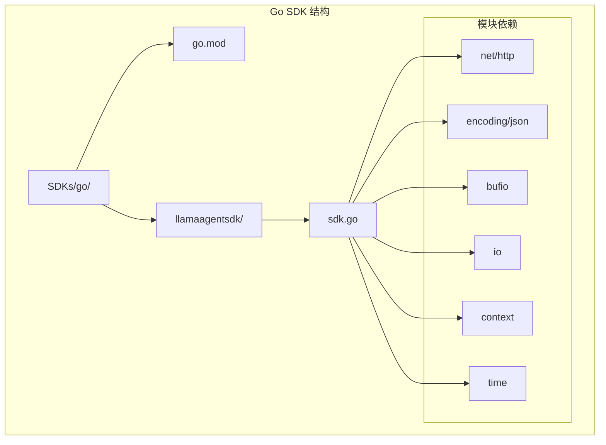

**图表来源**
- [go.mod:1-4](file://SDKs/go/go.mod#L1-L4)
- [sdk.go:3-13](file://SDKs/go/llamaagentsdk/sdk.go#L3-L13)

**章节来源**
- [go.mod:1-4](file://SDKs/go/go.mod#L1-L4)
- [sdk.go:1-267](file://SDKs/go/llamaagentsdk/sdk.go#L1-L267)

## 核心组件

Go SDK 的核心由四个主要组件构成：数据模型、配置结构、会话管理和 HTTP 客户端。

### 数据模型层

SDK 定义了两个核心数据结构来表示聊天消息和流式响应结果：

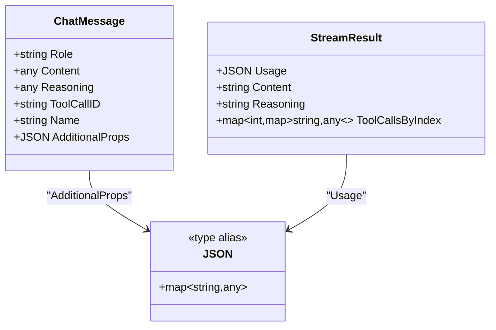

**图表来源**
- [sdk.go:15-24](file://SDKs/go/llamaagentsdk/sdk.go#L15-L24)
- [sdk.go:143-148](file://SDKs/go/llamaagentsdk/sdk.go#L143-L148)

### 配置管理层

SDK 提供了两个配置结构体来管理服务器连接和代理设置：

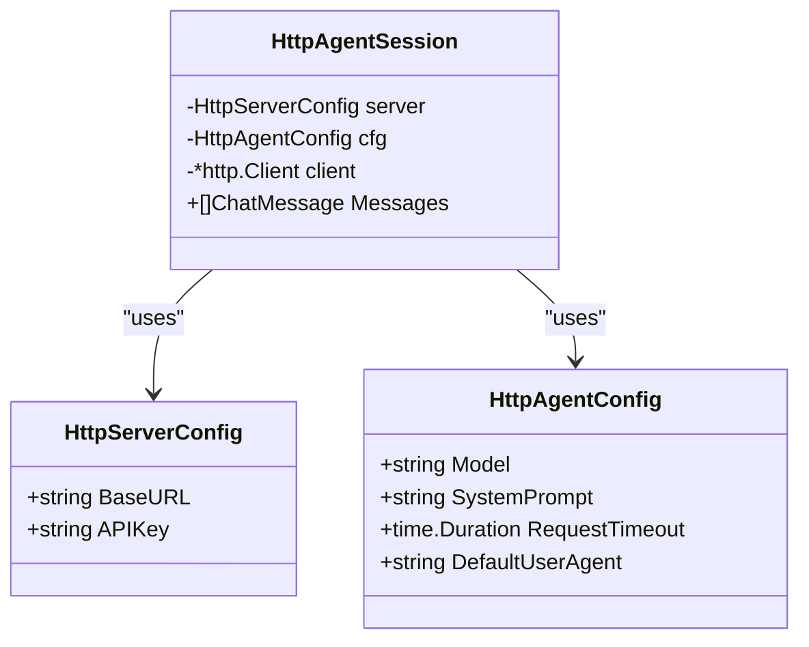

**图表来源**
- [sdk.go:26-36](file://SDKs/go/llamaagentsdk/sdk.go#L26-L36)
- [sdk.go:38-43](file://SDKs/go/llamaagentsdk/sdk.go#L38-L43)

**章节来源**
- [sdk.go:15-43](file://SDKs/go/llamaagentsdk/sdk.go#L15-L43)

## 架构概览

Go SDK 采用了分层架构设计，从底层的 HTTP 客户端到高层的会话管理，形成了清晰的职责分离。

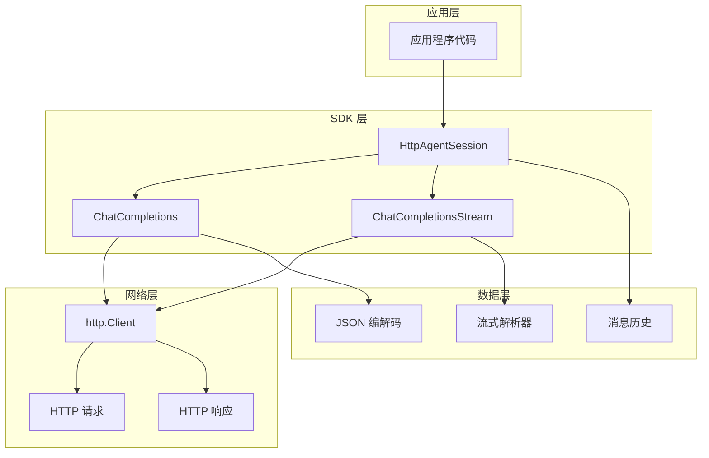

**图表来源**
- [sdk.go:45-59](file://SDKs/go/llamaagentsdk/sdk.go#L45-L59)
- [sdk.go:100-141](file://SDKs/go/llamaagentsdk/sdk.go#L100-L141)
- [sdk.go:150-265](file://SDKs/go/llamaagentsdk/sdk.go#L150-L265)

## 详细组件分析

### HttpAgentSession 类

HttpAgentSession 是 SDK 的核心类，负责管理与服务器的整个交互生命周期。

#### 初始化流程

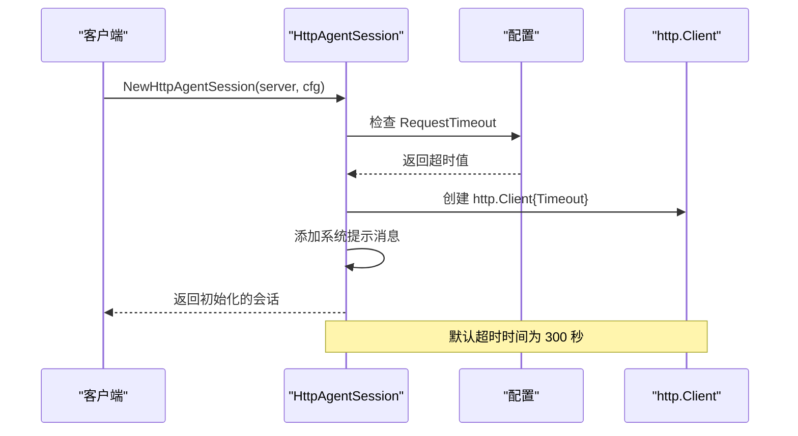

**图表来源**
- [sdk.go:45-59](file://SDKs/go/llamaagentsdk/sdk.go#L45-L59)

#### 同步对话补全流程

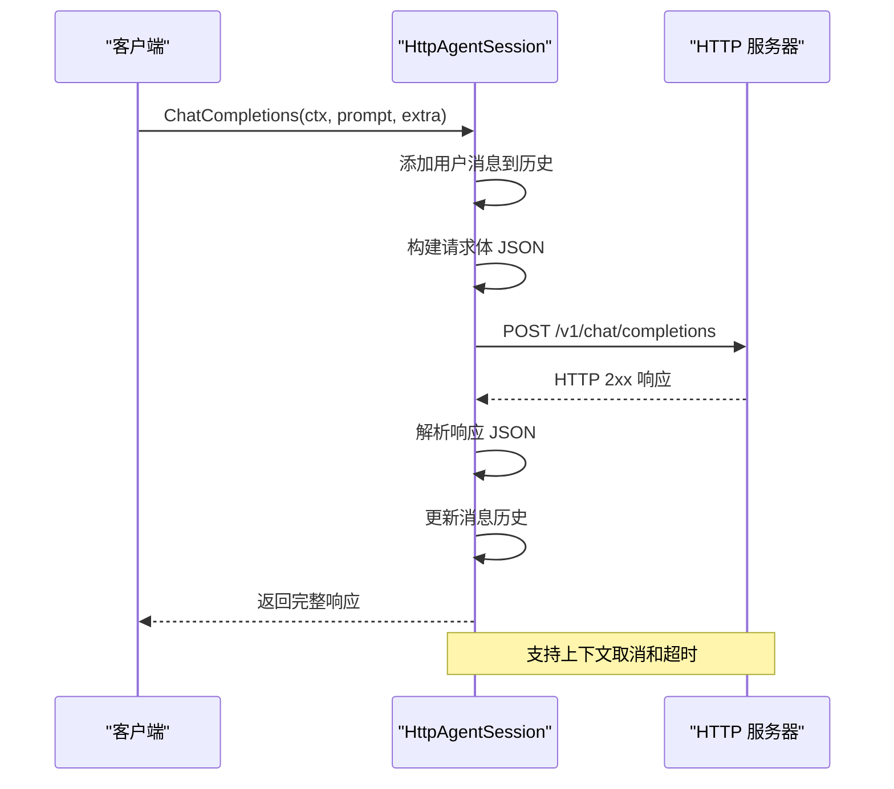

**图表来源**
- [sdk.go:100-141](file://SDKs/go/llamaagentsdk/sdk.go#L100-L141)

#### 流式对话补全流程

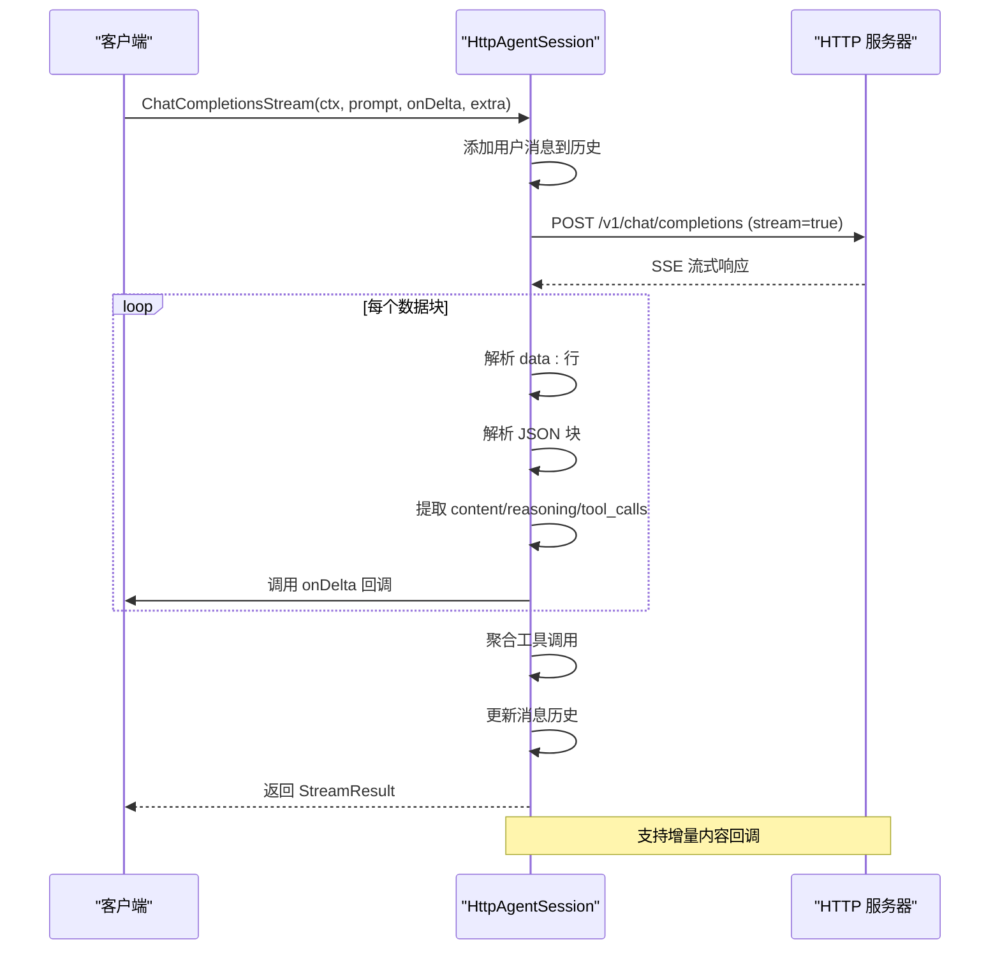

**图表来源**
- [sdk.go:150-265](file://SDKs/go/llamaagentsdk/sdk.go#L150-L265)

### 并发安全设计

Go SDK 在设计上充分考虑了并发安全性：

#### goroutine 管理

- **HTTP 客户端并发**: 使用标准库 `http.Client`，它内部已经实现了线程安全
- **上下文传播**: 所有操作都接受 `context.Context` 参数，支持取消和超时
- **流式处理**: 流式响应通过 `bufio.Scanner` 逐行处理，避免阻塞主 goroutine

#### 错误处理模式

SDK 采用了 Go 语言特有的错误处理模式：

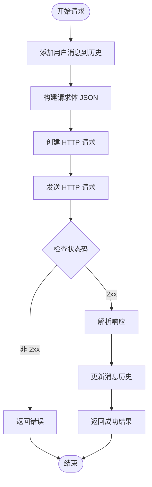

**图表来源**
- [sdk.go:100-141](file://SDKs/go/llamaagentsdk/sdk.go#L100-L141)

**章节来源**
- [sdk.go:45-265](file://SDKs/go/llamaagentsdk/sdk.go#L45-L265)

### 类型转换机制

Go SDK 实现了灵活的类型转换机制来处理动态 JSON 数据：

#### 动态类型断言

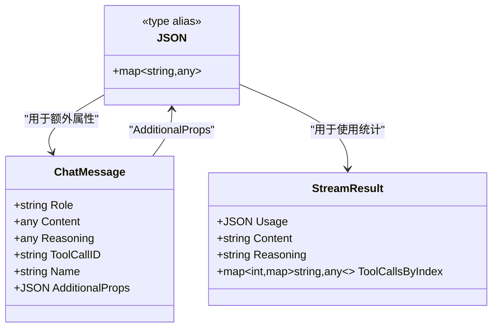

**图表来源**
- [sdk.go:15](file://SDKs/go/llamaagentsdk/sdk.go#L15)
- [sdk.go:17-24](file://SDKs/go/llamaagentsdk/sdk.go#L17-L24)
- [sdk.go:143-148](file://SDKs/go/llamaagentsdk/sdk.go#L143-L148)

#### 工具调用聚合逻辑

SDK 实现了复杂的工具调用聚合机制：

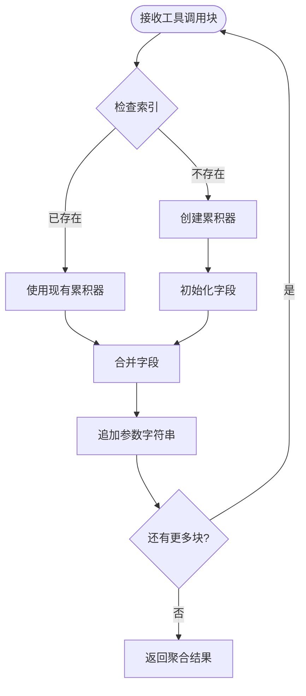

**图表来源**
- [sdk.go:220-253](file://SDKs/go/llamaagentsdk/sdk.go#L220-L253)

**章节来源**
- [sdk.go:15-148](file://SDKs/go/llamaagentsdk/sdk.go#L15-L148)
- [sdk.go:220-253](file://SDKs/go/llamaagentsdk/sdk.go#L220-L253)

## 依赖关系分析

Go SDK 的依赖关系非常简洁，仅依赖 Go 标准库的核心包。

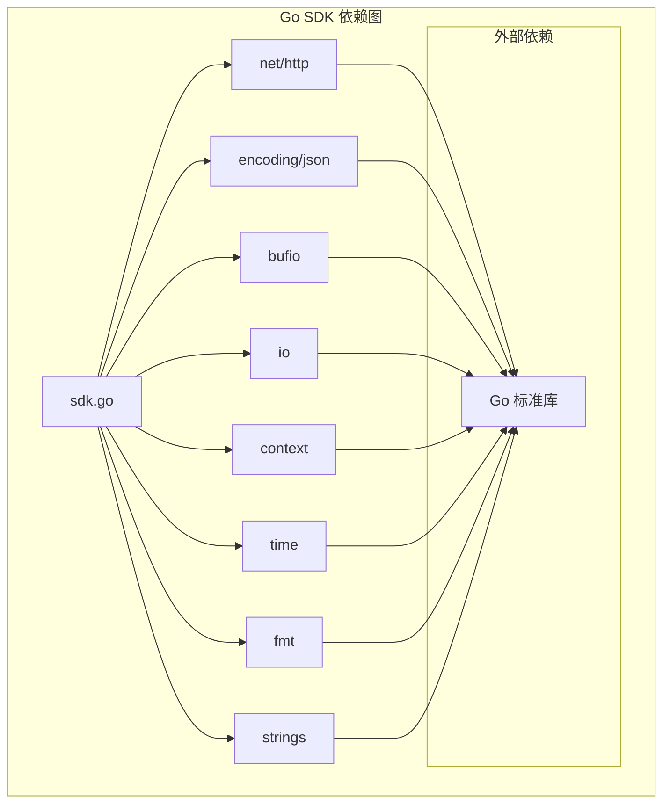

**图表来源**
- [sdk.go:3-13](file://SDKs/go/llamaagentsdk/sdk.go#L3-L13)

### 模块依赖管理

Go SDK 使用 Go 1.22+ 版本，确保了现代化的语言特性和性能优化：

- **Go 版本**: 1.22+
- **模块名称**: `llama-agent-sdk-go`
- **依赖管理**: 无外部依赖，纯标准库

**章节来源**
- [go.mod:1-4](file://SDKs/go/go.mod#L1-L4)
- [sdk.go:3-13](file://SDKs/go/llamaagentsdk/sdk.go#L3-L13)

## 性能考虑

### 内存管理优化

Go SDK 在内存管理方面采用了多项优化策略：

#### 流式响应处理

- **缓冲扫描器**: 使用 `bufio.Scanner` 逐行处理流式响应，避免一次性加载整个响应体
- **增量字符串拼接**: 使用 `strings.Builder` 或字符串切片进行增量拼接
- **零拷贝原则**: 尽量避免不必要的数据复制

#### HTTP 客户端优化

- **连接复用**: 利用 `http.Client` 的内置连接池
- **超时控制**: 通过 `RequestTimeout` 配置合理的超时时间
- **资源清理**: 正确关闭响应体，防止资源泄漏

### 并发性能优化

#### 上下文传播

- **取消信号**: 支持通过 `context.WithCancel` 实现快速取消
- **超时控制**: 使用 `context.WithTimeout` 自动超时
- **超时链路**: 通过 `context.Background()` 传递到 HTTP 请求

#### 流式处理性能

- **异步回调**: 通过 `onDelta` 回调实现异步增量处理
- **非阻塞 I/O**: 使用 `bufio.Scanner` 实现非阻塞读取
- **内存复用**: 重用切片和映射以减少分配

## 故障排除指南

### 常见问题诊断

#### HTTP 连接问题

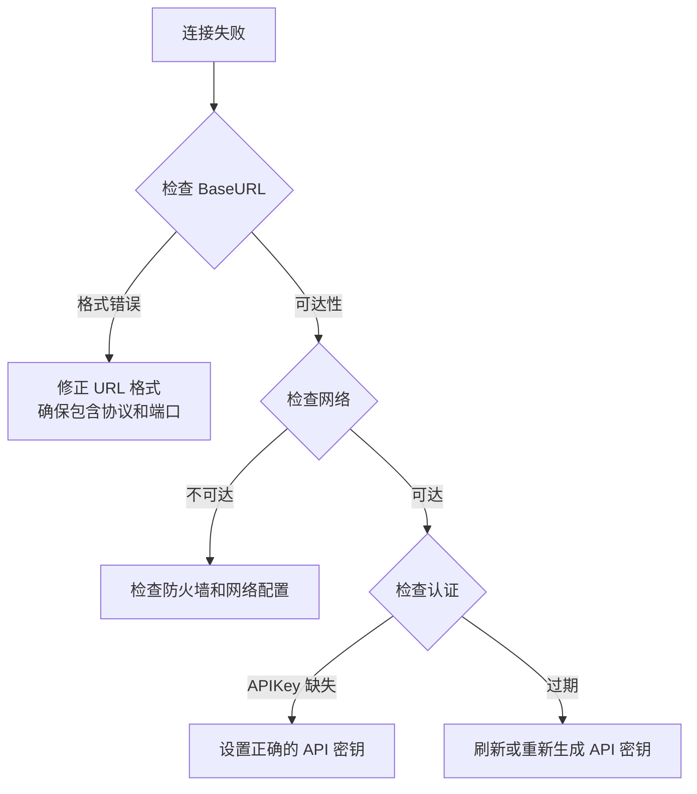

#### 超时问题

- **默认超时**: 300 秒（可通过 `RequestTimeout` 配置）
- **自定义超时**: 根据网络状况调整 `RequestTimeout`
- **上下文取消**: 使用 `context.WithCancel` 实现手动取消

#### 流式响应问题

- **SSE 兼容**: 确保服务器正确实现 SSE 协议
- **数据块解析**: 检查 JSON 解析错误
- **增量回调**: 确保 `onDelta` 回调函数正确实现

**章节来源**
- [sdk.go:45-59](file://SDKs/go/llamaagentsdk/sdk.go#L45-L59)
- [sdk.go:100-141](file://SDKs/go/llamaagentsdk/sdk.go#L100-L141)
- [sdk.go:150-265](file://SDKs/go/llamaagentsdk/sdk.go#L150-L265)

## 结论

Go SDK 提供了一个简洁、高效且线程安全的客户端库，专门针对 llama.cpp-agent 的 HTTP 服务器进行了优化。其设计特点包括：

### 主要优势

1. **简洁性**: 单文件实现，易于理解和维护
2. **并发安全**: 充分利用 Go 语言的并发特性
3. **流式处理**: 支持实时增量响应处理
4. **类型安全**: 使用 Go 的强类型系统和接口设计
5. **错误处理**: 遵循 Go 语言的错误处理最佳实践

### 技术亮点

- **上下文传播**: 完整支持 Go 语言的上下文取消和超时机制
- **流式响应**: 实现了标准的 SSE 兼容流式处理
- **工具调用聚合**: 提供了完整的工具调用结果聚合机制
- **内存优化**: 采用多种内存管理优化策略

### 适用场景

- **实时对话应用**: 支持流式响应的聊天机器人
- **批量处理**: 支持同步和异步两种模式
- **微服务集成**: 轻量级的 HTTP 客户端集成
- **边缘计算**: 低资源消耗的客户端实现

## 附录

### 安装和配置指南

#### 模块安装

```bash
# 使用 go mod
go get github.com/your-repo/llama.cpp-agent/SDKs/go/llamaagentsdk
```

#### 包导入方式

```go
import "github.com/your-repo/llama.cpp-agent/SDKs/go/llamaagentsdk"
```

#### 基本配置

```go
server := llamaagentsdk.HttpServerConfig{
    BaseURL: "http://127.0.0.1:8080",
    APIKey:  "your-api-key",
}

cfg := llamaagentsdk.HttpAgentConfig{
    Model:           "your-model-id",
    SystemPrompt:    "You are a helpful assistant.",
    RequestTimeout:  300 * time.Second,
    DefaultUserAgent: "llama-agent-sdk-go/1.0",
}

session := llamaagentsdk.NewHttpAgentSession(server, cfg)
```

### 最佳实践

#### 错误处理

```go
result, err := session.ChatCompletions(ctx, "hello", nil)
if err != nil {
    log.Printf("Error: %v", err)
    return
}
// 处理结果...
```

#### 超时控制

```go
ctx, cancel := context.WithTimeout(context.Background(), 30*time.Second)
defer cancel()

result, err := session.ChatCompletions(ctx, "hello", nil)
```

#### 流式处理

```go
err := session.ChatCompletionsStream(ctx, "hello", func(delta string) {
    fmt.Print(delta)
}, nil)
```

### 部署建议

- **生产环境**: 使用 HTTPS 和适当的 API 密钥管理
- **监控**: 实施请求计数、延迟和错误率监控
- **日志**: 记录关键操作和错误信息
- **缓存**: 对于重复请求考虑适当的缓存策略