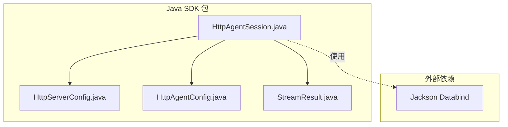
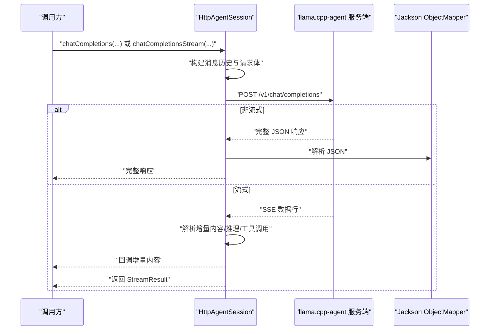
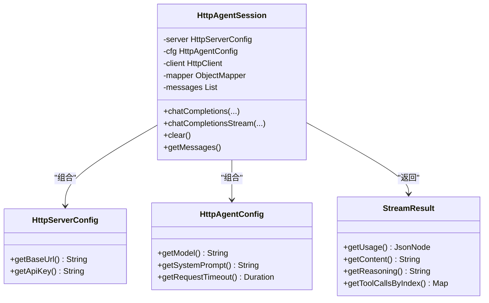
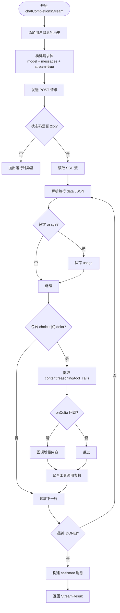
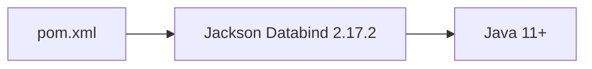

# Java SDK

<cite>
**本文引用的文件**
- [HttpAgentConfig.java](file://SDKs/java/src/main/java/ai/llama/agent/sdk/HttpAgentConfig.java)
- [HttpServerConfig.java](file://SDKs/java/src/main/java/ai/llama/agent/sdk/HttpServerConfig.java)
- [HttpAgentSession.java](file://SDKs/java/src/main/java/ai/llama/agent/sdk/HttpAgentSession.java)
- [StreamResult.java](file://SDKs/java/src/main/java/ai/llama/agent/sdk/StreamResult.java)
- [pom.xml](file://SDKs/java/pom.xml)
- [SDK.md](file://agent/sdk/SDK.md)
</cite>

## 目录
1. [简介](#简介)
2. [项目结构](#项目结构)
3. [核心组件](#核心组件)
4. [架构总览](#架构总览)
5. [详细组件分析](#详细组件分析)
6. [依赖分析](#依赖分析)
7. [性能考虑](#性能考虑)
8. [故障排查指南](#故障排查指南)
9. [结论](#结论)
10. [附录](#附录)

## 简介
本文件为 Java SDK 的技术文档，聚焦于面向对象设计、类继承体系、接口实现、核心类设计与使用方法、Maven 项目配置与依赖管理、版本兼容性、流式处理与回调机制、异步编程模式、Spring Boot 与微服务集成最佳实践以及性能优化建议。Java SDK 提供与 llama.cpp-agent 的 HTTP 协议兼容的会话封装，支持非流式与流式对话、工具调用聚合、消息历史维护与错误处理。

## 项目结构
Java SDK 位于 SDKs/java 目录，采用标准 Maven 结构，核心源码位于 src/main/java/ai/llama/agent/sdk，包含以下关键类：
- HttpServerConfig：服务端配置（基础 URL、API Key）
- HttpAgentConfig：会话配置（模型、系统提示、请求超时）
- HttpAgentSession：会话主体（消息历史、非流式/流式对话、工具调用聚合、回调）
- StreamResult：流式结果封装（用量、内容、推理内容、工具调用聚合）

图表来源
- [HttpAgentSession.java:1-257](file://SDKs/java/src/main/java/ai/llama/agent/sdk/HttpAgentSession.java#L1-L257)
- [HttpServerConfig.java:1-24](file://SDKs/java/src/main/java/ai/llama/agent/sdk/HttpServerConfig.java#L1-L24)
- [HttpAgentConfig.java:1-32](file://SDKs/java/src/main/java/ai/llama/agent/sdk/HttpAgentConfig.java#L1-L32)
- [StreamResult.java:1-71](file://SDKs/java/src/main/java/ai/llama/agent/sdk/StreamResult.java#L1-L71)
- [pom.xml:1-19](file://SDKs/java/pom.xml#L1-L19)

章节来源
- [pom.xml:1-19](file://SDKs/java/pom.xml#L1-L19)

## 核心组件
- HttpServerConfig：不可变配置，提供 baseUrl 与 apiKey，用于构造请求头与端点。
- HttpAgentConfig：不可变配置，提供 model、systemPrompt、requestTimeout，用于聊天补全请求体与超时控制。
- HttpAgentSession：会话主体，维护消息历史，封装非流式与流式聊天补全，负责 SSE 数据解析、工具调用聚合、消息回填与异常处理。
- StreamResult：不可变结果封装，包含用量、内容、推理内容与工具调用聚合，便于上层消费。

章节来源
- [HttpServerConfig.java:1-24](file://SDKs/java/src/main/java/ai/llama/agent/sdk/HttpServerConfig.java#L1-L24)
- [HttpAgentConfig.java:1-32](file://SDKs/java/src/main/java/ai/llama/agent/sdk/HttpAgentConfig.java#L1-L32)
- [HttpAgentSession.java:1-257](file://SDKs/java/src/main/java/ai/llama/agent/sdk/HttpAgentSession.java#L1-L257)
- [StreamResult.java:1-71](file://SDKs/java/src/main/java/ai/llama/agent/sdk/StreamResult.java#L1-L71)

## 架构总览
Java SDK 与服务端交互遵循 OpenAI 兼容的 /v1/chat/completions 接口，支持 SSE 流式响应。SDK 通过 HttpAgentSession 统一封装请求构建、发送、响应解析与消息历史维护，支持一次性响应与增量流式响应两种模式。

图表来源
- [HttpAgentSession.java:83-112](file://SDKs/java/src/main/java/ai/llama/agent/sdk/HttpAgentSession.java#L83-L112)
- [HttpAgentSession.java:114-245](file://SDKs/java/src/main/java/ai/llama/agent/sdk/HttpAgentSession.java#L114-L245)

## 详细组件分析

### HttpServerConfig
- 设计要点
  - 不可变配置类，提供 baseUrl 与 apiKey。
  - 构造函数支持默认参数，保证空值安全。
- 使用建议
  - 在多租户或多实例场景下，确保 baseUrl 正确指向服务端地址。
  - 如服务端启用鉴权，需正确设置 apiKey。

章节来源
- [HttpServerConfig.java:1-24](file://SDKs/java/src/main/java/ai/llama/agent/sdk/HttpServerConfig.java#L1-L24)

### HttpAgentConfig
- 设计要点
  - 不可变配置类，提供 model、systemPrompt、requestTimeout。
  - 默认 systemPrompt 为空字符串，requestTimeout 默认 300 秒。
- 使用建议
  - systemPrompt 会在会话初始化时作为第一条 system 消息加入消息历史。
  - requestTimeout 控制 HttpClient 的请求超时与聊天补全请求的超时。

章节来源
- [HttpAgentConfig.java:1-32](file://SDKs/java/src/main/java/ai/llama/agent/sdk/HttpAgentConfig.java#L1-L32)

### HttpAgentSession
- 设计要点
  - 组合式设计：持有 HttpServerConfig、HttpAgentConfig、HttpClient、ObjectMapper 与消息历史列表。
  - 不可变配置驱动：通过构造函数注入配置，保证线程安全与可预测行为。
  - 消息历史管理：支持 clear 保留 system 消息，维护 OAI 兼容的消息数组。
  - 端点拼接：endpointJoin 规范化 baseUrl 与路径拼接，避免多余斜杠。
  - 请求头构建：自动添加 Content-Type 与 Authorization（若提供 apiKey）。
  - 非流式聊天补全：构建请求体，发送并解析完整响应，回填 assistant 消息。
  - 流式聊天补全：解析 SSE 数据行，增量提取 content、reasoning_content、tool_calls，回调上层，最终聚合为 StreamResult。
  - 异常处理：对非 2xx 响应抛出运行时异常，包含状态码与响应体。
- 线程安全
  - 未使用共享可变状态，但内部消息列表为线程不安全。建议在单线程或受控并发场景使用。
- 资源管理
  - 流式读取使用 try-with-resources 确保 InputStream 正确关闭。
- 回调机制
  - 流式模式支持 Consumer<String> onDelta 回调，实时传递增量内容。
- 异步编程模式
  - 当前实现为同步阻塞调用。若需异步，可在上层线程池或 Reactor/CompletableFuture 中包装调用。

图表来源
- [HttpAgentSession.java:22-41](file://SDKs/java/src/main/java/ai/llama/agent/sdk/HttpAgentSession.java#L22-L41)
- [HttpServerConfig.java:3-22](file://SDKs/java/src/main/java/ai/llama/agent/sdk/HttpServerConfig.java#L3-L22)
- [HttpAgentConfig.java:5-29](file://SDKs/java/src/main/java/ai/llama/agent/sdk/HttpAgentConfig.java#L5-L29)
- [StreamResult.java:6-33](file://SDKs/java/src/main/java/ai/llama/agent/sdk/StreamResult.java#L6-L33)

图表来源
- [HttpAgentSession.java:114-245](file://SDKs/java/src/main/java/ai/llama/agent/sdk/HttpAgentSession.java#L114-L245)

章节来源
- [HttpAgentSession.java:1-257](file://SDKs/java/src/main/java/ai/llama/agent/sdk/HttpAgentSession.java#L1-L257)

### StreamResult
- 设计要点
  - 不可变结果封装，包含 usage、content、reasoning、toolCallsByIndex。
  - ToolCallAcc 为静态内部类，支持增量拼接 arguments，最终形成完整工具调用列表。
- 使用建议
  - 上层根据 content/reasoning/usage 进行 UI 展示与统计。
  - toolCallsByIndex 按索引排序后输出，保证顺序稳定。

章节来源
- [StreamResult.java:1-71](file://SDKs/java/src/main/java/ai/llama/agent/sdk/StreamResult.java#L1-L71)

## 依赖分析
- Maven 依赖
  - jackson-databind：用于 JSON 解析与树形节点操作。
- 编译与运行环境
  - Java 11+：maven.compiler.release 设置为 11。
  - UTF-8：项目编码统一为 UTF-8。
- 版本兼容性
  - Jackson 2.17.2：与 Java 11+ 兼容，建议在生产环境锁定版本以避免 ABI 变更。

图表来源
- [pom.xml:7-17](file://SDKs/java/pom.xml#L7-L17)

章节来源
- [pom.xml:1-19](file://SDKs/java/pom.xml#L1-L19)

## 性能考虑
- 连接与超时
  - HttpClient 连接超时：30 秒；聊天补全请求超时：由 HttpAgentConfig.requestTimeout 控制。
  - 建议根据网络与模型延迟调整 requestTimeout，避免长时间阻塞。
- 流式处理
  - 流式模式通过 SSE 增量返回，减少首字节延迟；回调 onDelta 应尽量轻量，避免阻塞 IO。
- 消息历史
  - 随着对话轮次增加，消息历史增长导致请求体增大，建议定期清理或截断历史，或在上层进行分页/压缩。
- 并发与线程安全
  - HttpAgentSession 内部消息列表为线程不安全，建议在单线程或受控并发场景使用；如需多线程，应在上层加锁或使用无共享状态的会话实例。
- 资源管理
  - 流式读取已使用 try-with-resources，确保 InputStream 正确释放；注意避免在回调中持有大对象引用导致 GC 压力。

## 故障排查指南
- HTTP 错误
  - 非 2xx 响应会抛出运行时异常，异常信息包含状态码与响应体。建议记录日志并重试或降级。
- SSE 解析失败
  - 流式解析忽略无法解析的行，但若持续出现，检查服务端 SSE 输出格式与网络稳定性。
- 工具调用缺失
  - 若 tool_calls 未完整聚合，检查 delta 中是否包含 function.name/id 与 arguments 的增量拼接逻辑。
- 认证问题
  - 若服务端启用鉴权，确保 HttpServerConfig.apiKey 正确设置。
- 超时问题
  - 若 requestTimeout 过短，可能导致请求被中断；适当延长超时时间并结合重试策略。

章节来源
- [HttpAgentSession.java:103-105](file://SDKs/java/src/main/java/ai/llama/agent/sdk/HttpAgentSession.java#L103-L105)
- [HttpAgentSession.java:136-139](file://SDKs/java/src/main/java/ai/llama/agent/sdk/HttpAgentSession.java#L136-L139)
- [HttpAgentSession.java:160-165](file://SDKs/java/src/main/java/ai/llama/agent/sdk/HttpAgentSession.java#L160-L165)

## 结论
Java SDK 以不可变配置为核心，围绕 HttpAgentSession 提供简洁易用的会话管理与流式处理能力。通过 Jackson 完成 JSON 解析，结合 SSE 增量输出与回调机制，满足实时对话与工具调用聚合需求。建议在生产环境中关注超时、资源与并发安全，并结合 Spring Boot 与微服务框架进行集成与监控。

## 附录

### Maven 项目配置与依赖管理
- 项目坐标与版本
  - groupId: ai.llama.agent
  - artifactId: llama-agent-sdk
  - version: 0.1.0
- 编译属性
  - maven.compiler.release: 11
  - project.build.sourceEncoding: UTF-8
- 依赖
  - com.fasterxml.jackson.core:jackson-databind: 2.17.2

章节来源
- [pom.xml:1-19](file://SDKs/java/pom.xml#L1-L19)

### 使用示例与最佳实践
- 基本用法
  - 创建 HttpServerConfig 与 HttpAgentConfig，初始化 HttpAgentSession。
  - 调用 chatCompletions 获取一次性响应，或 chatCompletionsStream 获取增量内容与工具调用。
- 流式处理
  - 提供 onDelta 回调以实时展示内容；在回调中避免阻塞 IO。
- 工具调用
  - 依据 StreamResult 中的 toolCallsByIndex 进行本地工具执行，并将结果以 role=tool 的消息回填至会话。
- Spring Boot 集成
  - 将 HttpAgentSession 作为单例 Bean 注入，使用 @Async 或线程池执行长耗时的 chatCompletionsStream。
  - 在控制器中接收用户输入，调用会话并返回增量事件或最终结果。
- 微服务架构
  - 将 SDK 作为通用依赖引入各服务模块；通过配置中心统一管理 baseUrl 与 apiKey。
  - 使用熔断与重试（如 Resilience4j）增强稳定性；结合链路追踪定位慢请求。

章节来源
- [SDK.md:421-441](file://agent/sdk/SDK.md#L421-L441)
- [HttpAgentSession.java:114-245](file://SDKs/java/src/main/java/ai/llama/agent/sdk/HttpAgentSession.java#L114-L245)