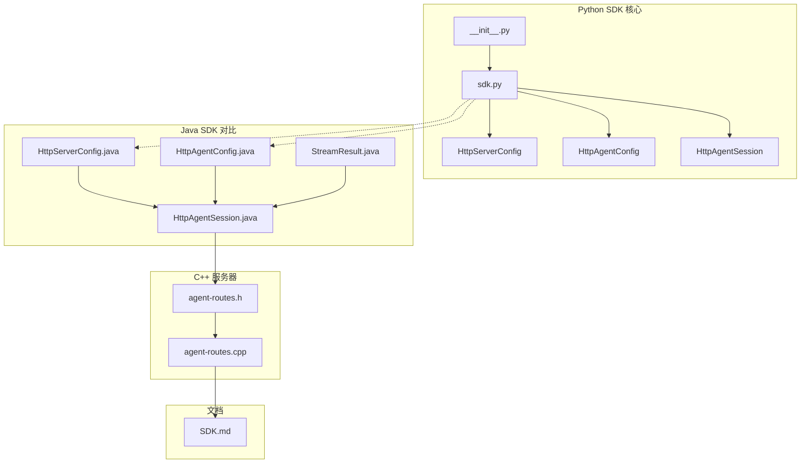
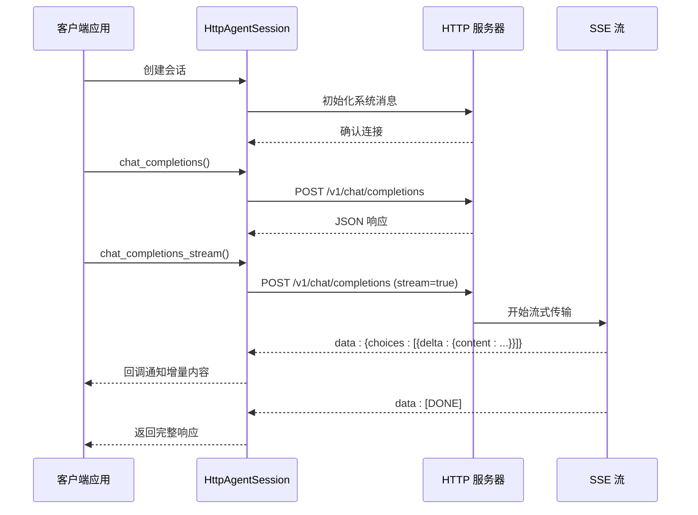
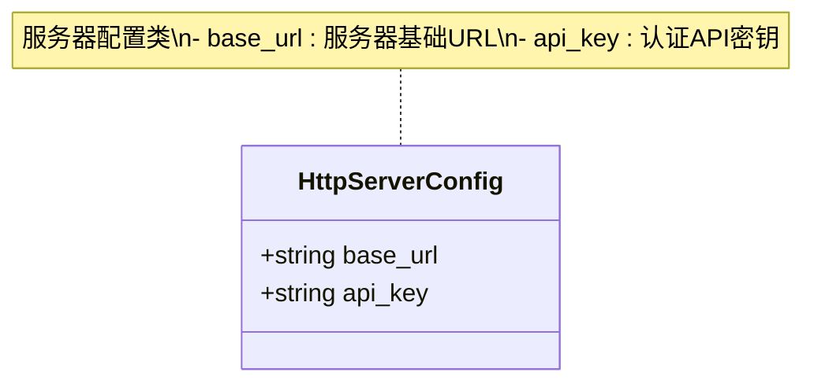
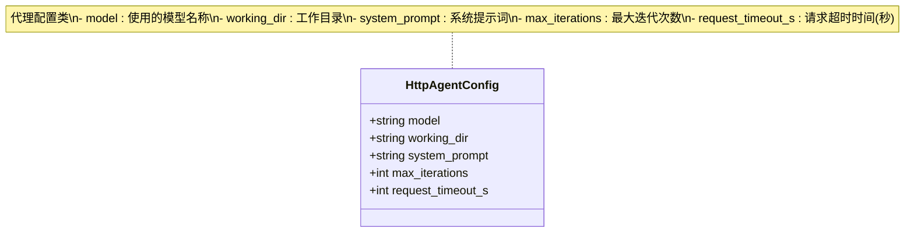
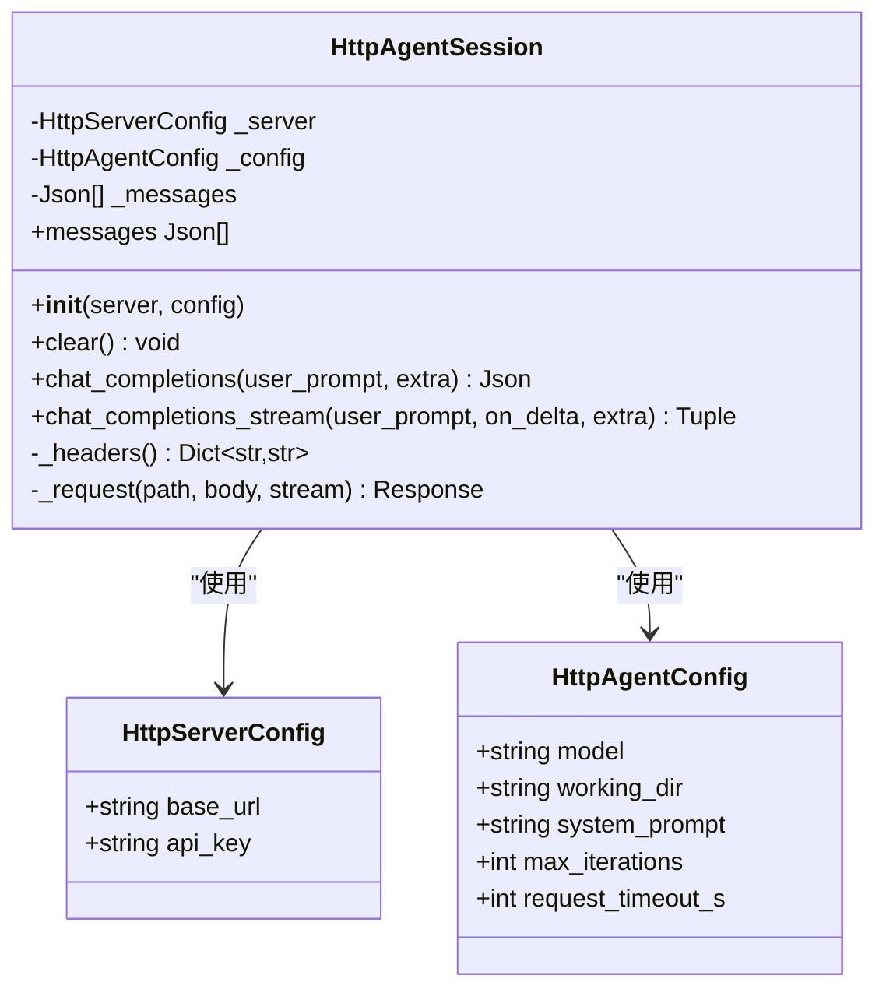
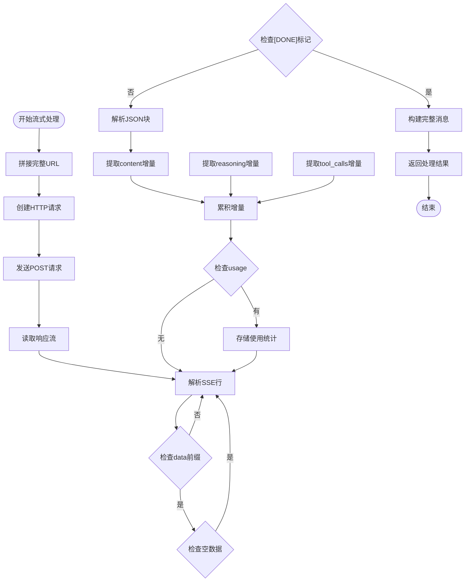
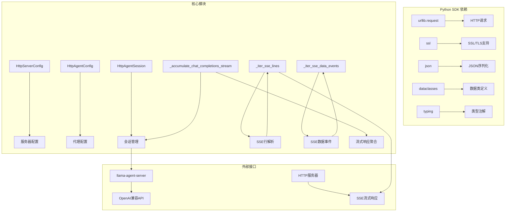

# Python SDK 技术文档

<cite>
**本文档引用的文件**
- [SDKs/python/src/llama_agent_sdk/__init__.py](file://SDKs/python/src/llama_agent_sdk/__init__.py)
- [SDKs/python/src/llama_agent_sdk/sdk.py](file://SDKs/python/src/llama_agent_sdk/sdk.py)
- [SDKs/python/pyproject.toml](file://SDKs/python/pyproject.toml)
- [SDKs/java/src/main/java/ai/llama/agent/sdk/HttpAgentConfig.java](file://SDKs/java/src/main/java/ai/llama/agent/sdk/HttpAgentConfig.java)
- [SDKs/java/src/main/java/ai/llama/agent/sdk/HttpServerConfig.java](file://SDKs/java/src/main/java/ai/llama/agent/sdk/HttpServerConfig.java)
- [SDKs/java/src/main/java/ai/llama/agent/sdk/HttpAgentSession.java](file://SDKs/java/src/main/java/ai/llama/agent/sdk/HttpAgentSession.java)
- [SDKs/java/src/main/java/ai/llama/agent/sdk/StreamResult.java](file://SDKs/java/src/main/java/ai/llama/agent/sdk/StreamResult.java)
- [agent/sdk/SDK.md](file://agent/sdk/SDK.md)
- [agent/server/agent-routes.h](file://agent/server/agent-routes.h)
- [agent/server/agent-routes.cpp](file://agent/server/agent-routes.cpp)
</cite>

## 目录
1. [简介](#简介)
2. [项目结构](#项目结构)
3. [核心组件](#核心组件)
4. [架构概览](#架构概览)
5. [详细组件分析](#详细组件分析)
6. [依赖关系分析](#依赖关系分析)
7. [性能考虑](#性能考虑)
8. [故障排除指南](#故障排除指南)
9. [结论](#结论)
10. [附录](#附录)

## 简介

Python SDK 是 llama.cpp-agent 项目中的一个轻量级客户端库，旨在为 Python 应用程序提供与 HTTP 服务器进行交互的能力。该 SDK 实现了 OpenAI 兼容的聊天补全接口，支持同步和异步（SSE）响应处理，以及工具调用的完整生命周期管理。

SDK 的主要特性包括：
- OpenAI 兼容的聊天补全 API
- SSE 流式响应处理
- 会话状态管理
- 工具调用聚合
- 错误处理和超时管理
- 多语言 SDK 一致性

## 项目结构



**图表来源**
- [SDKs/python/src/llama_agent_sdk/__init__.py:1-4](file://SDKs/python/src/llama_agent_sdk/__init__.py#L1-L4)
- [SDKs/python/src/llama_agent_sdk/sdk.py:102-224](file://SDKs/python/src/llama_agent_sdk/sdk.py#L102-L224)
- [SDKs/java/src/main/java/ai/llama/agent/sdk/HttpAgentSession.java:22-257](file://SDKs/java/src/main/java/ai/llama/agent/sdk/HttpAgentSession.java#L22-L257)

**章节来源**
- [SDKs/python/src/llama_agent_sdk/__init__.py:1-4](file://SDKs/python/src/llama_agent_sdk/__init__.py#L1-L4)
- [SDKs/python/src/llama_agent_sdk/sdk.py:1-224](file://SDKs/python/src/llama_agent_sdk/sdk.py#L1-L224)

## 核心组件

Python SDK 包含三个核心配置类和一个会话管理类：

### HttpServerConfig 配置类
负责服务器连接配置，包含基础 URL 和 API 密钥信息。

### HttpAgentConfig 配置类  
负责代理会话配置，包含模型信息、工作目录、系统提示词等参数。

### HttpAgentSession 会话类
核心会话管理类，负责与服务器的 HTTP 通信、消息管理和工具调用处理。

**章节来源**
- [SDKs/python/src/llama_agent_sdk/sdk.py:14-27](file://SDKs/python/src/llama_agent_sdk/sdk.py#L14-L27)
- [SDKs/python/src/llama_agent_sdk/sdk.py:102-113](file://SDKs/python/src/llama_agent_sdk/sdk.py#L102-L113)

## 架构概览



**图表来源**
- [SDKs/python/src/llama_agent_sdk/sdk.py:133-144](file://SDKs/python/src/llama_agent_sdk/sdk.py#L133-L144)
- [SDKs/python/src/llama_agent_sdk/sdk.py:146-223](file://SDKs/python/src/llama_agent_sdk/sdk.py#L146-L223)

## 详细组件分析

### HttpServerConfig 类分析



**图表来源**
- [SDKs/python/src/llama_agent_sdk/sdk.py:14-18](file://SDKs/python/src/llama_agent_sdk/sdk.py#L14-L18)

HttpServerConfig 是一个简单的数据类，包含以下属性：
- `base_url`: 服务器的基础 URL 地址
- `api_key`: 可选的认证 API 密钥

**章节来源**
- [SDKs/python/src/llama_agent_sdk/sdk.py:14-18](file://SDKs/python/src/llama_agent_sdk/sdk.py#L14-L18)

### HttpAgentConfig 类分析



**图表来源**
- [SDKs/python/src/llama_agent_sdk/sdk.py:20-27](file://SDKs/python/src/llama_agent_sdk/sdk.py#L20-L27)

HttpAgentConfig 提供了丰富的配置选项：
- `model`: 指定使用的 AI 模型
- `working_dir`: 设置工作目录，默认为当前目录
- `system_prompt`: 系统提示词，影响模型行为
- `max_iterations`: 最大对话迭代次数
- `request_timeout_s`: 请求超时时间，默认 300 秒

**章节来源**
- [SDKs/python/src/llama_agent_sdk/sdk.py:20-27](file://SDKs/python/src/llama_agent_sdk/sdk.py#L20-L27)

### HttpAgentSession 类分析

HttpAgentSession 是 SDK 的核心类，实现了完整的会话管理功能：



**图表来源**
- [SDKs/python/src/llama_agent_sdk/sdk.py:102-224](file://SDKs/python/src/llama_agent_sdk/sdk.py#L102-L224)

#### 核心功能

1. **会话初始化**: 自动添加系统消息到消息历史中
2. **消息管理**: 维护完整的对话历史记录
3. **同步请求**: 处理非流式的聊天补全请求
4. **流式请求**: 处理 SSE 流式响应，实时处理增量内容

**章节来源**
- [SDKs/python/src/llama_agent_sdk/sdk.py:102-113](file://SDKs/python/src/llama_agent_sdk/sdk.py#L102-L113)

### SSE 流式传输处理

SDK 实现了完整的 SSE（Server-Sent Events）流式传输处理机制：



**图表来源**
- [SDKs/python/src/llama_agent_sdk/sdk.py:41-60](file://SDKs/python/src/llama_agent_sdk/sdk.py#L41-L60)
- [SDKs/python/src/llama_agent_sdk/sdk.py:62-99](file://SDKs/python/src/llama_agent_sdk/sdk.py#L62-L99)

**章节来源**
- [SDKs/python/src/llama_agent_sdk/sdk.py:41-99](file://SDKs/python/src/llama_agent_sdk/sdk.py#L41-L99)

## 依赖关系分析



**图表来源**
- [SDKs/python/src/llama_agent_sdk/sdk.py:1-11](file://SDKs/python/src/llama_agent_sdk/sdk.py#L1-L11)

**章节来源**
- [SDKs/python/src/llama_agent_sdk/sdk.py:1-11](file://SDKs/python/src/llama_agent_sdk/sdk.py#L1-L11)

## 性能考虑

### 连接管理
- 使用 Python 标准库的 SSL 上下文确保安全连接
- 默认超时时间为 300 秒，可根据网络环境调整

### 内存管理
- 流式处理避免了大响应的内存峰值
- 增量累积内容，减少内存占用

### 网络优化
- 使用 urllib.request 的内置连接池
- 支持 HTTPS 和自定义 SSL 证书验证

## 故障排除指南

### 常见错误类型

1. **连接超时**: 检查网络连接和服务器可达性
2. **认证失败**: 验证 API 密钥配置
3. **JSON 解析错误**: 检查服务器响应格式
4. **SSE 流中断**: 网络不稳定或服务器关闭连接

### 调试建议

1. **启用详细日志**: 检查网络请求和响应
2. **验证配置**: 确认服务器 URL 和模型名称正确
3. **测试连接**: 使用简单请求验证服务器连通性
4. **监控资源**: 注意内存使用情况，特别是长对话场景

**章节来源**
- [SDKs/python/src/llama_agent_sdk/sdk.py:126-131](file://SDKs/python/src/llama_agent_sdk/sdk.py#L126-L131)

## 结论

Python SDK 提供了一个简洁而强大的客户端库，实现了与 llama.cpp-agent 服务器的完整交互能力。其设计遵循 OpenAI 兼容的 API 规范，支持同步和异步两种交互模式，能够有效处理复杂的工具调用场景。

SDK 的优势包括：
- 轻量级设计，易于集成
- 完整的 SSE 流式处理支持
- 清晰的配置分离
- 良好的错误处理机制

对于生产环境使用，建议：
- 根据实际网络环境调整超时设置
- 实施适当的重试机制
- 监控内存使用情况
- 实现适当的日志记录

## 附录

### 安装指南

```bash
# 从源码安装
pip install ./SDKs/python

# 或者使用 pip 直接安装
pip install llama-agent-sdk
```

**章节来源**
- [SDKs/python/pyproject.toml:1-16](file://SDKs/python/pyproject.toml#L1-L16)

### 基本使用示例

#### 同步聊天补全
```python
from llama_agent_sdk import HttpAgentConfig, HttpServerConfig, HttpAgentSession

# 配置服务器
server = HttpServerConfig(base_url="http://127.0.0.1:8080")

# 配置会话
cfg = HttpAgentConfig(model="your-model-id", system_prompt="You are a helpful assistant.")

# 创建会话
session = HttpAgentSession(server, cfg)

# 发送消息
response = session.chat_completions("Hello!")
print(response)
```

#### 流式聊天补全
```python
from llama_agent_sdk import HttpAgentConfig, HttpServerConfig, HttpAgentSession

def on_delta(text):
    print(text, end="", flush=True)

server = HttpServerConfig(base_url="http://127.0.0.1:8080")
cfg = HttpAgentConfig(model="your-model-id")
session = HttpAgentSession(server, cfg)

response = session.chat_completions_stream("Tell me a story", on_delta)
print(f"\n完整响应: {response}")
```

### 配置参数详解

#### HttpServerConfig 参数
- `base_url`: 服务器地址，如 "http://localhost:8080"
- `api_key`: 可选的认证密钥

#### HttpAgentConfig 参数
- `model`: 模型名称，必须与服务器配置匹配
- `working_dir`: 工作目录，默认当前目录
- `system_prompt`: 系统提示词，影响模型行为
- `max_iterations`: 最大对话轮数，默认 50
- `request_timeout_s`: 请求超时时间，默认 300 秒

### 与 Java SDK 的对比

| 特性 | Python SDK | Java SDK |
|------|------------|----------|
| HTTP 客户端 | urllib.request | java.net.http |
| JSON 处理 | json 标准库 | Jackson |
| 流式处理 | 内置支持 | 内置支持 |
| 异常处理 | Python 异常 | Java 异常 |
| 类型系统 | 动态类型 | 静态类型 |

**章节来源**
- [SDKs/java/src/main/java/ai/llama/agent/sdk/HttpServerConfig.java:1-24](file://SDKs/java/src/main/java/ai/llama/agent/sdk/HttpServerConfig.java#L1-L24)
- [SDKs/java/src/main/java/ai/llama/agent/sdk/HttpAgentConfig.java:1-32](file://SDKs/java/src/main/java/ai/llama/agent/sdk/HttpAgentConfig.java#L1-L32)
- [SDKs/java/src/main/java/ai/llama/agent/sdk/HttpAgentSession.java:1-257](file://SDKs/java/src/main/java/ai/llama/agent/sdk/HttpAgentSession.java#L1-L257)