# Rust SDK 技术文档

<cite>
**本文档引用的文件**
- [lib.rs](file://SDKs/rust/src/lib.rs)
- [Cargo.toml](file://SDKs/rust/Cargo.toml)
</cite>

## 目录
1. [简介](#简介)
2. [项目结构](#项目结构)
3. [核心组件](#核心组件)
4. [架构概览](#架构概览)
5. [详细组件分析](#详细组件分析)
6. [依赖关系分析](#依赖关系分析)
7. [性能考虑](#性能考虑)
8. [故障排除指南](#故障排除指南)
9. [结论](#结论)
10. [附录](#附录)

## 简介

Rust SDK 是一个基于 Rust 语言开发的客户端 SDK，用于与 Llama Agent 服务进行交互。该 SDK 充分利用了 Rust 语言的安全性和性能优势，提供了类型安全的 HTTP 客户端会话管理、流式响应处理和错误处理机制。

该 SDK 主要功能包括：
- HTTP 代理会话管理
- 阻塞式 HTTP 请求处理
- 流式响应解析和处理
- 类型安全的消息传递
- 基于 API 密钥的身份验证

## 项目结构

Rust SDK 采用简洁的单文件架构设计，所有核心功能都集中在 `lib.rs` 文件中，通过 `Cargo.toml` 进行依赖管理。

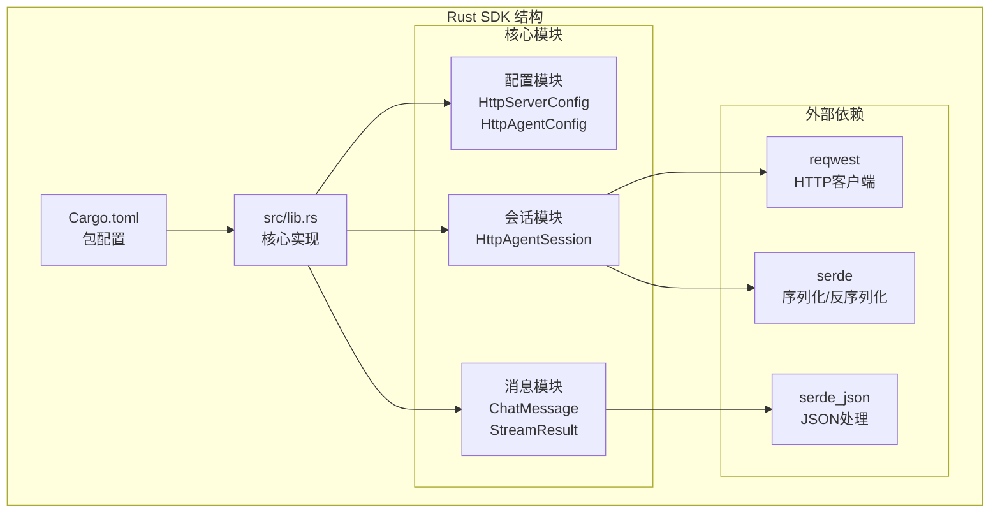

**图表来源**
- [Cargo.toml:1-14](file://SDKs/rust/Cargo.toml#L1-L14)
- [lib.rs:1-274](file://SDKs/rust/src/lib.rs#L1-L274)

**章节来源**
- [Cargo.toml:1-14](file://SDKs/rust/Cargo.toml#L1-L14)
- [lib.rs:1-274](file://SDKs/rust/src/lib.rs#L1-L274)

## 核心组件

### 配置系统

SDK 提供了两个核心配置结构体，用于管理服务器连接和代理设置：

#### HttpServerConfig
负责管理服务器连接配置，包括基础 URL 和可选的 API 密钥认证。

#### HttpAgentConfig  
管理代理会话的具体配置，包括模型名称、系统提示、请求超时时间等参数。

### 会话管理

`HttpAgentSession` 是 SDK 的核心组件，负责维护与服务器的连接状态和消息历史记录。

### 数据模型

SDK 定义了专门的数据结构来处理聊天消息和流式响应结果，确保类型安全和数据完整性。

**章节来源**
- [lib.rs:8-40](file://SDKs/rust/src/lib.rs#L8-L40)
- [lib.rs:58-63](file://SDKs/rust/src/lib.rs#L58-L63)

## 架构概览

Rust SDK 采用了模块化的架构设计，将功能清晰地分离到不同的模块中：

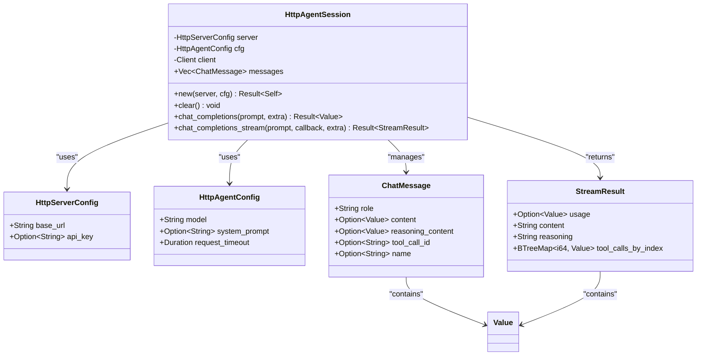

**图表来源**
- [lib.rs:8-40](file://SDKs/rust/src/lib.rs#L8-L40)
- [lib.rs:58-63](file://SDKs/rust/src/lib.rs#L58-L63)

## 详细组件分析

### HttpAgentSession 组件

`HttpAgentSession` 是 SDK 的核心类，实现了完整的会话管理和请求处理逻辑。

#### 生命周期管理

会话的生命周期从创建开始，通过 `new` 方法初始化，直到显式清理或销毁：

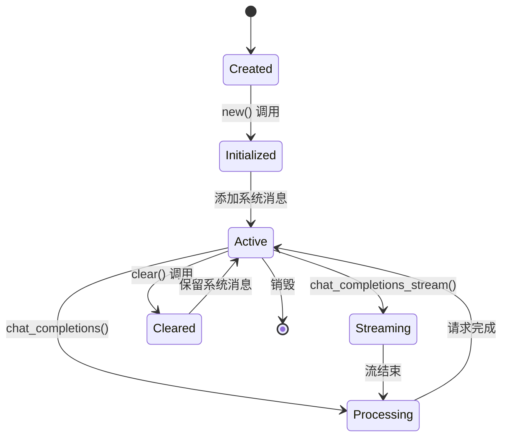

**图表来源**
- [lib.rs:65-86](file://SDKs/rust/src/lib.rs#L65-L86)
- [lib.rs:88-98](file://SDKs/rust/src/lib.rs#L88-L98)

#### 请求处理流程

SDK 支持两种主要的请求模式：非流式和流式响应处理。

##### 非流式请求处理

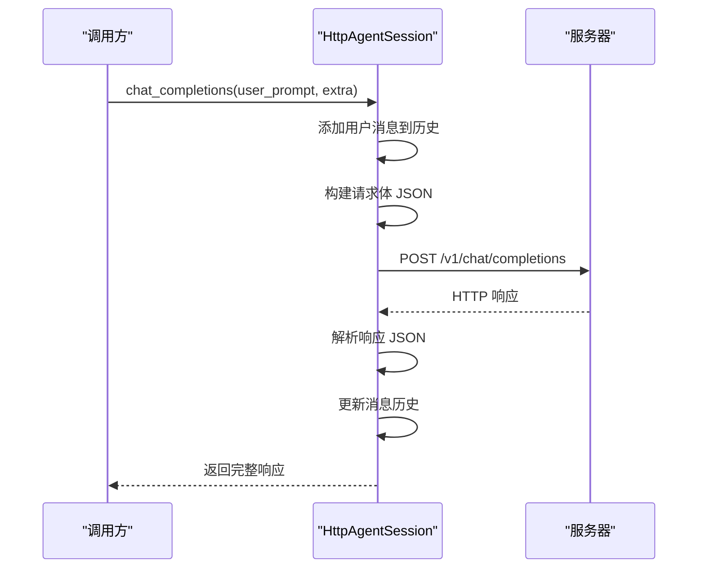

**图表来源**
- [lib.rs:108-144](file://SDKs/rust/src/lib.rs#L108-L144)

##### 流式响应处理

流式响应处理是 SDK 的核心特性之一，支持实时接收和处理服务器推送的数据：

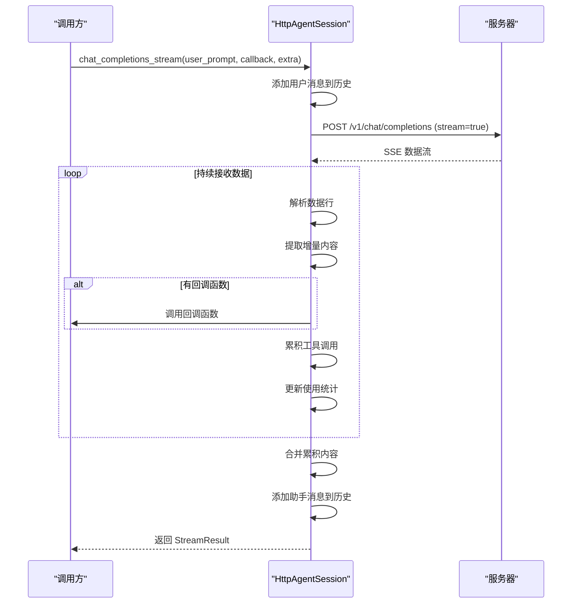

**图表来源**
- [lib.rs:146-271](file://SDKs/rust/src/lib.rs#L146-L271)

#### 错误处理机制

SDK 使用 Rust 的类型系统来提供强大的错误处理能力：

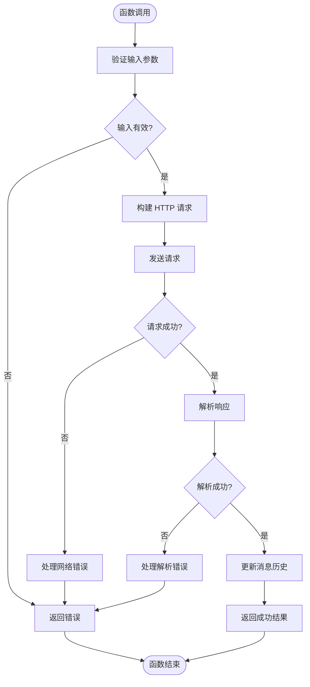

**图表来源**
- [lib.rs:108-144](file://SDKs/rust/src/lib.rs#L108-L144)
- [lib.rs:146-271](file://SDKs/rust/src/lib.rs#L146-L271)

**章节来源**
- [lib.rs:65-271](file://SDKs/rust/src/lib.rs#L65-L271)

### 数据模型设计

#### ChatMessage 结构

`ChatMessage` 结构体设计体现了 Rust 的 Option 类型优势，确保了可选字段的安全处理：

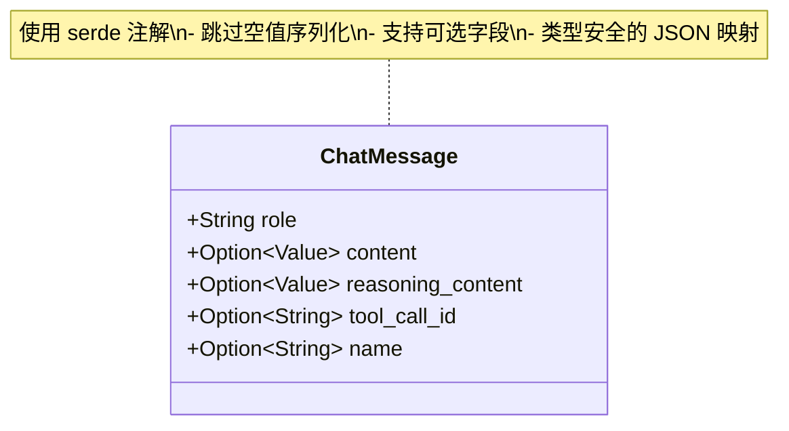

**图表来源**
- [lib.rs:21-32](file://SDKs/rust/src/lib.rs#L21-L32)

#### StreamResult 结构

`StreamResult` 结构体封装了流式响应的所有相关信息：

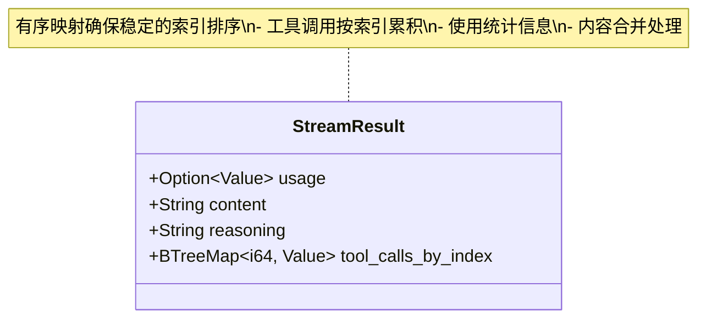

**图表来源**
- [lib.rs:34-40](file://SDKs/rust/src/lib.rs#L34-L40)

**章节来源**
- [lib.rs:21-40](file://SDKs/rust/src/lib.rs#L21-L40)

### 工具函数

#### endpoint_join 函数

`endpoint_join` 函数展示了 Rust 在字符串处理方面的强大能力：

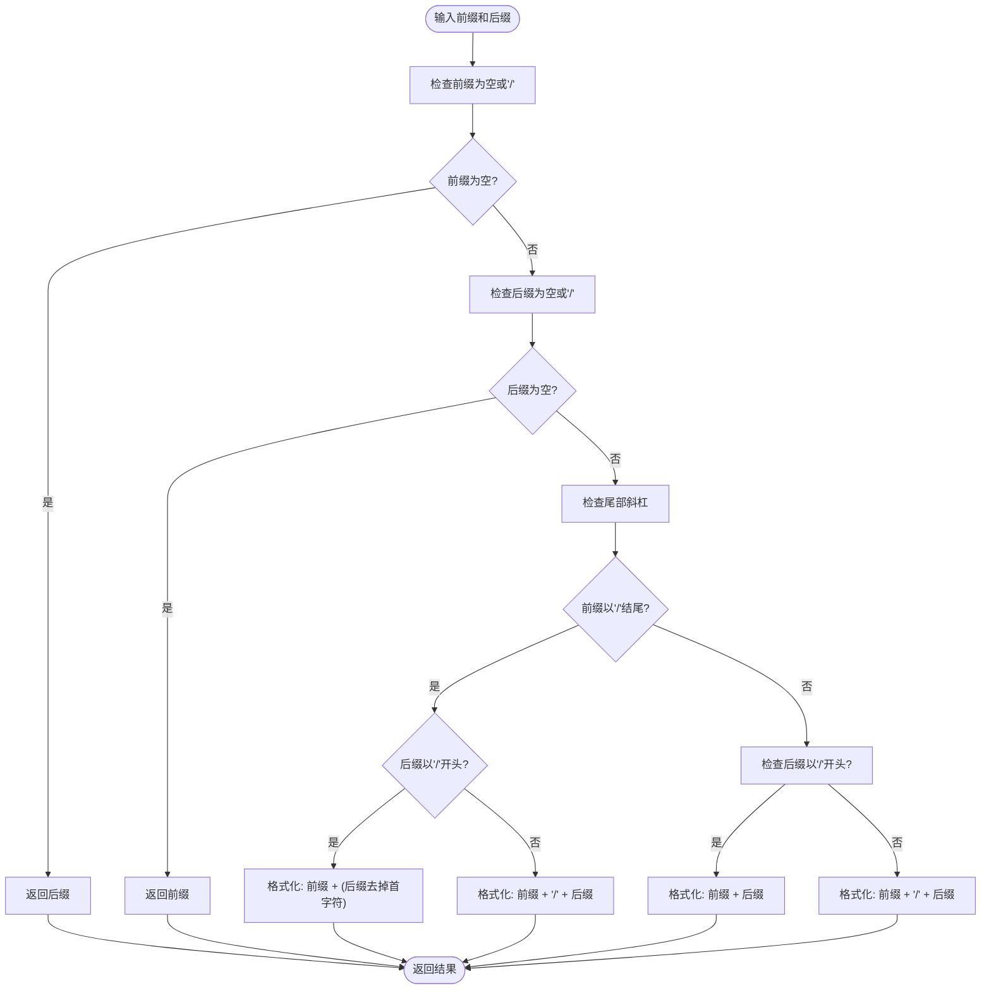

**图表来源**
- [lib.rs:42-56](file://SDKs/rust/src/lib.rs#L42-L56)

**章节来源**
- [lib.rs:42-56](file://SDKs/rust/src/lib.rs#L42-L56)

## 依赖关系分析

### 外部依赖

Rust SDK 依赖三个核心 crate 来实现其功能：

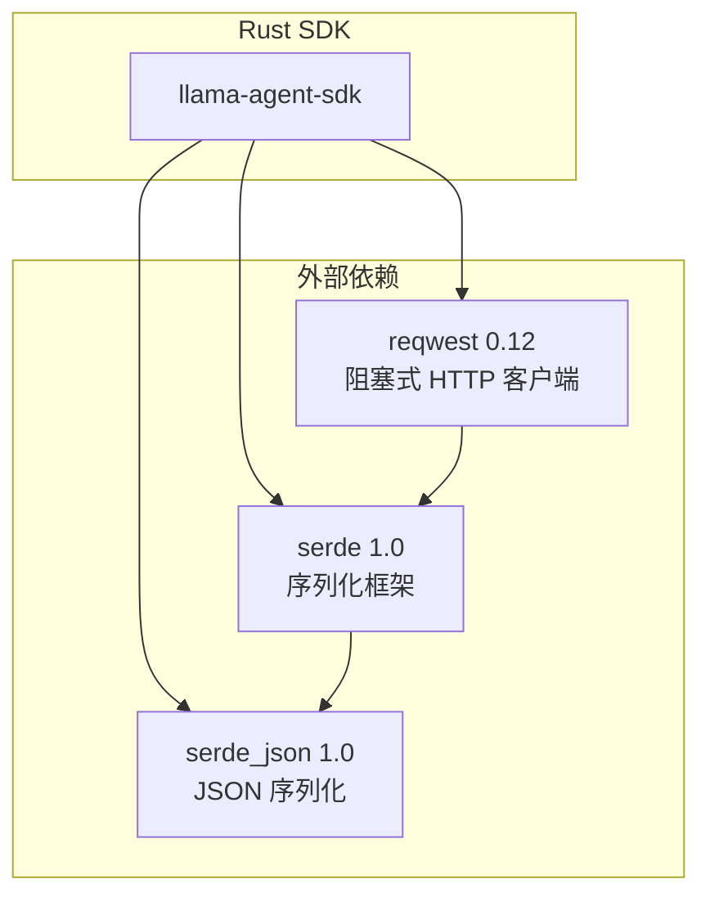

**图表来源**
- [Cargo.toml:10-13](file://SDKs/rust/Cargo.toml#L10-L13)

### 依赖特性

每个依赖都有特定的功能特性启用：

- **reqwest**: 启用了 `blocking` 和 `json` 特性，提供阻塞式 HTTP 请求和 JSON 支持
- **serde**: 启用了 `derive` 特性，自动生成序列化/反序列化实现
- **serde_json**: 提供 JSON 解析和序列化功能

**章节来源**
- [Cargo.toml:10-13](file://SDKs/rust/Cargo.toml#L10-L13)

## 性能考虑

### 内存管理优势

Rust SDK 充分利用了 Rust 的所有权系统，在以下方面提供了性能优势：

1. **零成本抽象**: 所有权检查在编译时完成，运行时无额外开销
2. **内存安全**: 避免了常见的内存泄漏和悬垂指针问题
3. **高效的数据结构**: 使用 `BTreeMap` 确保有序访问，使用 `Vec` 提供连续内存存储

### 并发模型

虽然当前版本使用阻塞式 HTTP 客户端，但 Rust 的并发模型为未来的异步实现提供了基础：

- **线程安全**: 所有共享数据都经过所有权检查
- **无数据竞争**: 编译器确保并发访问的安全性
- **零拷贝操作**: 通过引用和借用避免不必要的数据复制

### 优化建议

1. **异步迁移**: 考虑迁移到异步版本以提高并发性能
2. **连接池**: 实现 HTTP 连接复用以减少连接建立开销
3. **缓存策略**: 实现消息历史缓存以减少重复数据传输

## 故障排除指南

### 常见错误类型

#### 网络请求错误

当网络请求失败时，SDK 返回 `Box<dyn std::error::Error>` 类型的错误：

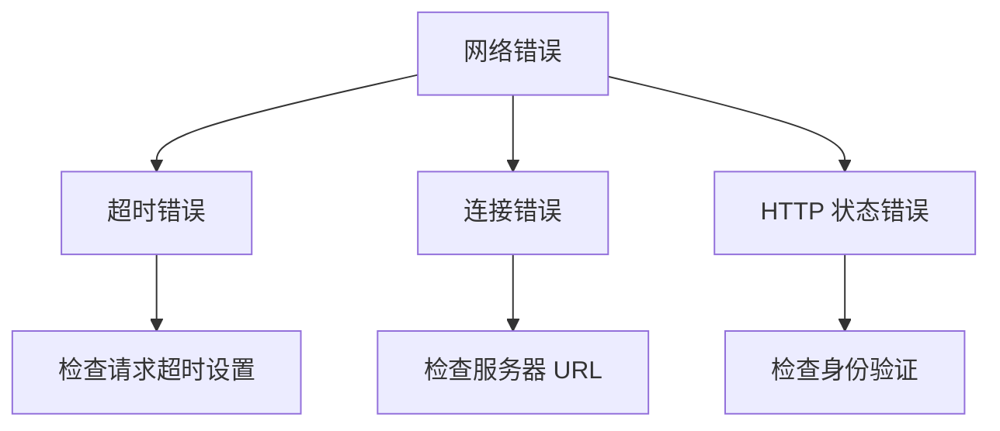

#### JSON 解析错误

流式响应解析过程中可能出现 JSON 解析错误：

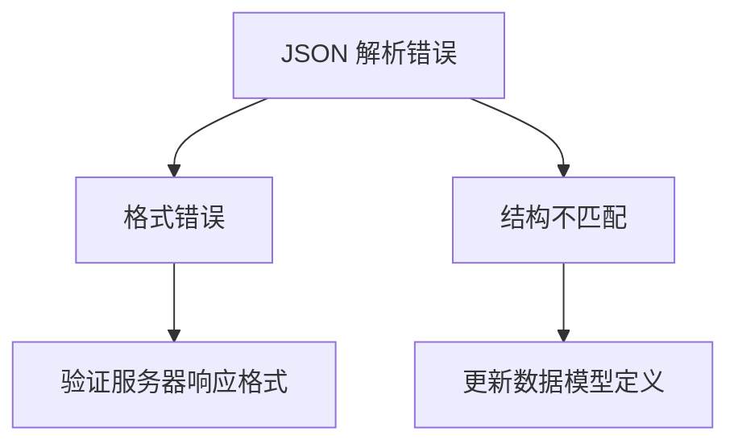

### 调试方法

1. **启用详细日志**: 使用 `Debug` trait 输出中间状态
2. **单元测试**: 为关键函数编写测试用例
3. **内存检查**: 使用 `cargo-miri` 进行内存安全检查
4. **性能分析**: 使用 `cargo-flamegraph` 分析性能瓶颈

**章节来源**
- [lib.rs:108-144](file://SDKs/rust/src/lib.rs#L108-L144)
- [lib.rs:146-271](file://SDKs/rust/src/lib.rs#L146-L271)

## 结论

Rust SDK 展示了 Rust 语言在构建安全、高性能客户端库方面的巨大优势。通过类型系统、所有权模型和零成本抽象，该 SDK 提供了可靠的错误处理、高效的内存管理和清晰的 API 设计。

主要优势包括：
- **类型安全**: 编译时错误检测，避免运行时崩溃
- **内存安全**: 防止内存泄漏和数据竞争
- **性能卓越**: 零成本抽象和高效的内存布局
- **生态系统集成**: 与 Rust 生态系统的无缝集成

未来发展方向：
- 迁移到异步版本以支持高并发场景
- 扩展 API 功能以支持更多模型和服务
- 实现更完善的错误处理和重试机制
- 添加更多的监控和诊断功能

## 附录

### Cargo 项目配置

#### 包配置
- **名称**: `llama-agent-sdk`
- **版本**: `0.1.0`
- **版本**: `2021`
- **库名称**: `llama_agent_sdk`

#### 依赖配置
- **reqwest**: `0.12` (阻塞式 HTTP 客户端)
- **serde**: `1.0` (序列化框架)
- **serde_json**: `1.0` (JSON 处理)

### 最佳实践

1. **错误处理**: 始终使用 `Result` 类型处理可能失败的操作
2. **资源管理**: 利用 Rust 的 RAII 模式自动管理资源生命周期
3. **类型安全**: 充分利用 Rust 的类型系统避免运行时错误
4. **性能优化**: 使用合适的集合类型和内存布局
5. **测试驱动**: 编写全面的单元测试和集成测试

### 异步编程准备

虽然当前版本使用阻塞式实现，但为未来的异步迁移做好了准备：

```rust
// 异步版本的接口设计思路
pub struct AsyncHttpAgentSession {
    // 异步客户端
    client: reqwest::Client,
    // 其他字段...
}

impl AsyncHttpAgentSession {
    // 异步方法签名
    pub async fn chat_completions_async(
        &mut self, 
        user_prompt: &str, 
        extra: Option<Value>
    ) -> Result<Value, Box<dyn std::error::Error>> {
        // 异步实现
    }
}
```