# TypeScript SDK 技术文档

<cite>
**本文档引用的文件**
- [SDKs/typescript/src/index.ts](file://SDKs/typescript/src/index.ts)
- [SDKs/typescript/src/minimemory.ts](file://SDKs/typescript/src/minimemory.ts)
- [SDKs/typescript/src/project-assistant.ts](file://SDKs/typescript/src/project-assistant.ts)
- [SDKs/typescript/package.json](file://SDKs/typescript/package.json)
- [SDKs/typescript/tsconfig.json](file://SDKs/typescript/tsconfig.json)
- [SDKs/typescript/dist/index.d.ts](file://SDKs/typescript/dist/index.d.ts)
- [SDKs/typescript/dist/minimemory.d.ts](file://SDKs/typescript/dist/minimemory.d.ts)
- [SDKs/typescript/dist/project-assistant.d.ts](file://SDKs/typescript/dist/project-assistant.d.ts)
</cite>

## 目录
1. [简介](#简介)
2. [项目结构](#项目结构)
3. [核心组件](#核心组件)
4. [架构概览](#架构概览)
5. [详细组件分析](#详细组件分析)
6. [依赖关系分析](#依赖关系分析)
7. [性能考虑](#性能考虑)
8. [故障排除指南](#故障排除指南)
9. [结论](#结论)
10. [附录](#附录)

## 简介

本项目是一个基于 TypeScript 的 SDK，专为 llama.cpp-Agent 生态系统设计。该 SDK 提供了完整的 HTTP 客户端封装、MiniMemory 集成、项目助手工具等功能，支持异步编程模式和流式数据处理。SDK 架构采用模块化设计，包含类型安全的接口定义、错误处理机制和高性能的数据传输协议。

## 项目结构

TypeScript SDK 采用清晰的模块化组织结构，主要包含以下核心模块：

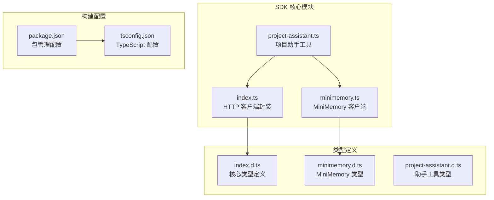

**图表来源**
- [SDKs/typescript/src/index.ts:1-221](file://SDKs/typescript/src/index.ts#L1-L221)
- [SDKs/typescript/src/minimemory.ts:1-183](file://SDKs/typescript/src/minimemory.ts#L1-L183)
- [SDKs/typescript/src/project-assistant.ts:1-442](file://SDKs/typescript/src/project-assistant.ts#L1-L442)

**章节来源**
- [SDKs/typescript/package.json:1-18](file://SDKs/typescript/package.json#L1-L18)
- [SDKs/typescript/tsconfig.json:1-15](file://SDKs/typescript/tsconfig.json#L1-L15)

## 核心组件

### 类型定义系统

SDK 提供了完整的 TypeScript 类型定义，确保类型安全和开发体验：

- **基础类型**：`Json`、`ChatMessage`、`ToolCall`、`ChatCompletionChunk`
- **配置类型**：`HttpServerConfig`、`HttpAgentConfig`
- **响应类型**：`RespValue`（RESP 协议响应）

这些类型定义支持：
- 严格的参数验证
- 智能代码补全
- 编译时错误检测
- 文档生成

**章节来源**
- [SDKs/typescript/src/index.ts:1-51](file://SDKs/typescript/src/index.ts#L1-L51)
- [SDKs/typescript/dist/index.d.ts:1-45](file://SDKs/typescript/dist/index.d.ts#L1-L45)

### HTTP 客户端封装

`HttpAgentSession` 是 SDK 的核心组件，提供了完整的 HTTP 通信能力：

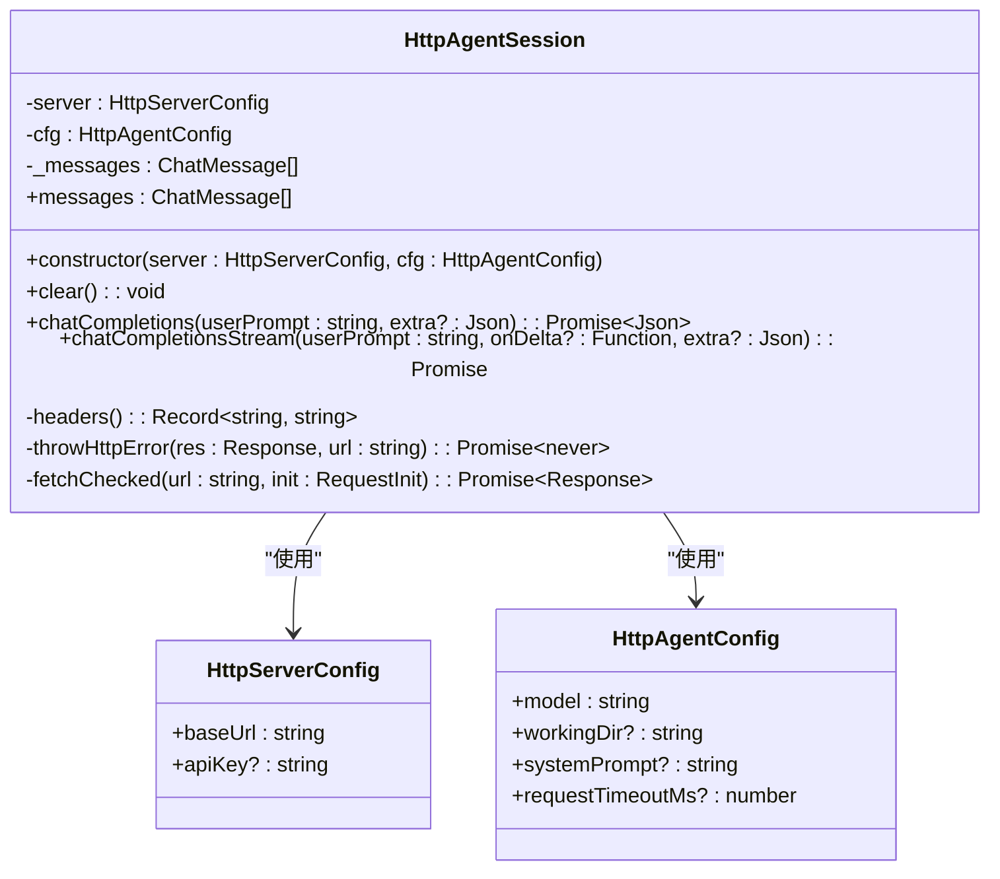

**图表来源**
- [SDKs/typescript/src/index.ts:83-218](file://SDKs/typescript/src/index.ts#L83-L218)

**章节来源**
- [SDKs/typescript/src/index.ts:83-218](file://SDKs/typescript/src/index.ts#L83-L218)

## 架构概览

SDK 采用分层架构设计，支持多种使用场景：

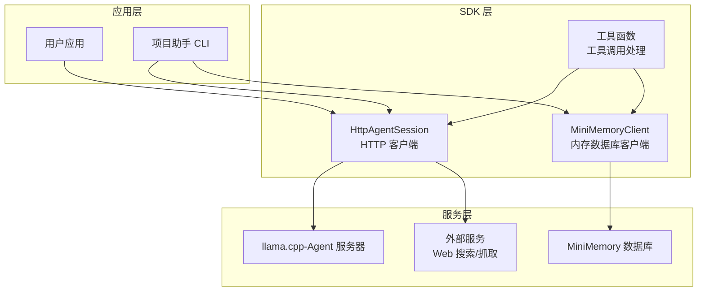

**图表来源**
- [SDKs/typescript/src/project-assistant.ts:240-273](file://SDKs/typescript/src/project-assistant.ts#L240-L273)
- [SDKs/typescript/src/minimemory.ts:101-181](file://SDKs/typescript/src/minimemory.ts#L101-L181)

## 详细组件分析

### HttpAgentSession 组件

`HttpAgentSession` 提供了完整的聊天对话功能，支持同步和流式两种模式：

#### 同步对话流程

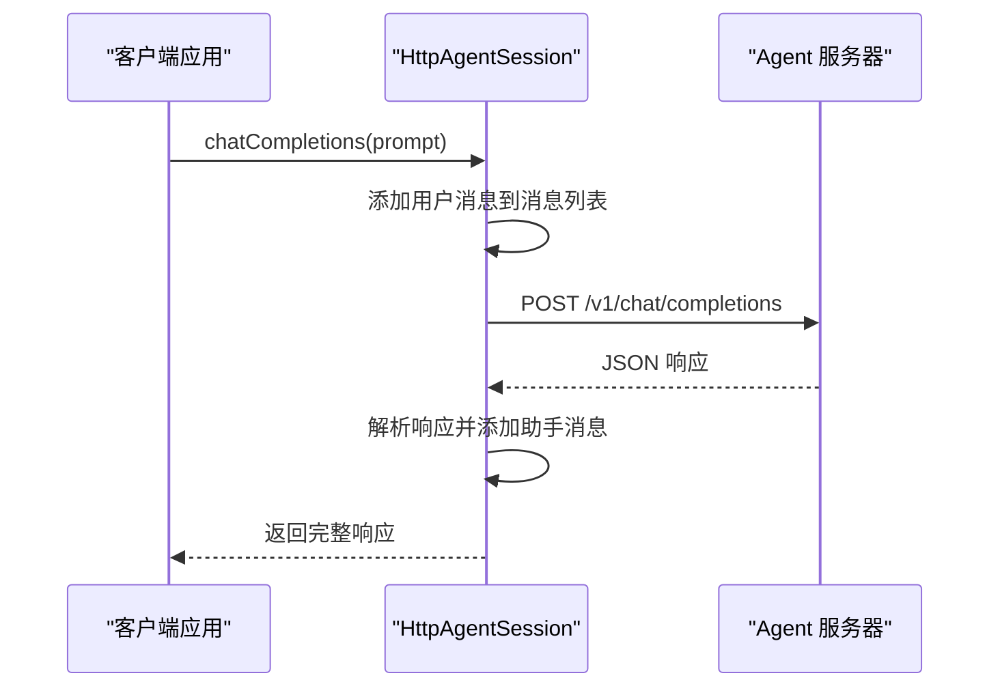

**图表来源**
- [SDKs/typescript/src/index.ts:139-155](file://SDKs/typescript/src/index.ts#L139-L155)

#### 流式对话处理

流式对话通过 Server-Sent Events (SSE) 实现实时数据传输：

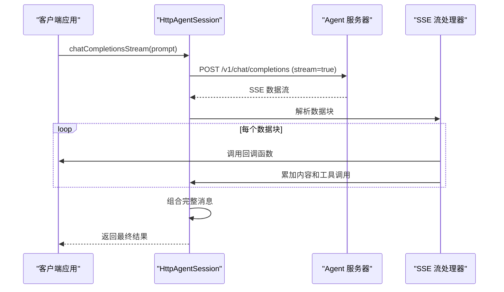

**图表来源**
- [SDKs/typescript/src/index.ts:157-217](file://SDKs/typescript/src/index.ts#L157-L217)

**章节来源**
- [SDKs/typescript/src/index.ts:139-217](file://SDKs/typescript/src/index.ts#L139-L217)

### MiniMemoryClient 组件

MiniMemoryClient 实现了完整的 Redis 兼容协议客户端：

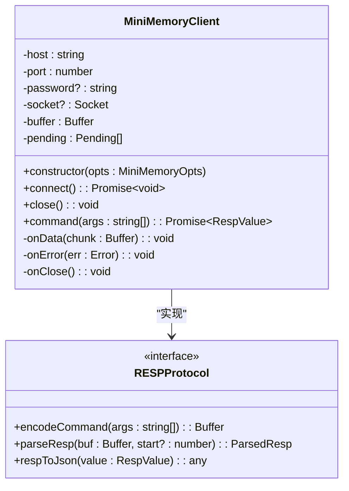

**图表来源**
- [SDKs/typescript/src/minimemory.ts:101-181](file://SDKs/typescript/src/minimemory.ts#L101-L181)

#### RESP 协议解析流程

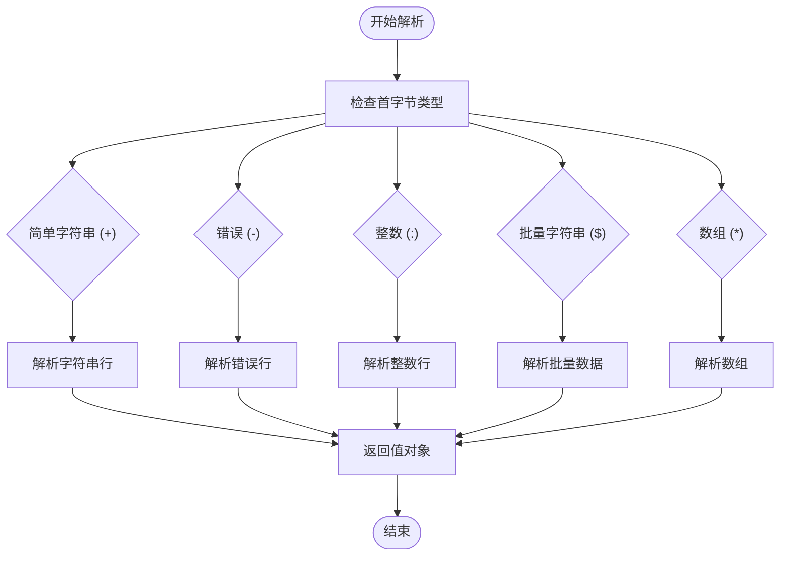

**图表来源**
- [SDKs/typescript/src/minimemory.ts:46-91](file://SDKs/typescript/src/minimemory.ts#L46-L91)

**章节来源**
- [SDKs/typescript/src/minimemory.ts:1-183](file://SDKs/typescript/src/minimemory.ts#L1-L183)

### 项目助手工具

项目助手工具集成了多个 AI 助手功能，包括 RAG 搜索、网络搜索、子代理执行等：

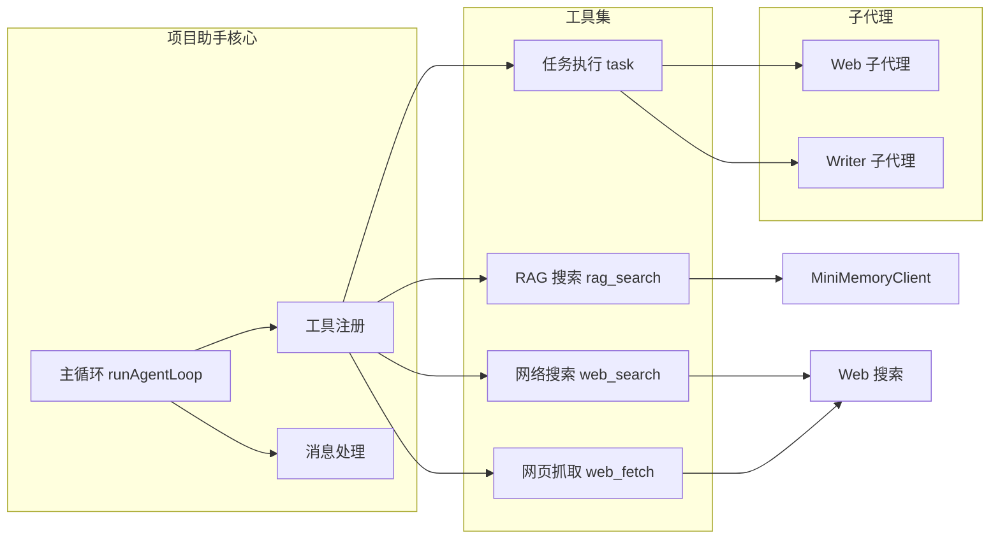

**图表来源**
- [SDKs/typescript/src/project-assistant.ts:240-273](file://SDKs/typescript/src/project-assistant.ts#L240-L273)

**章节来源**
- [SDKs/typescript/src/project-assistant.ts:240-442](file://SDKs/typescript/src/project-assistant.ts#L240-L442)

## 依赖关系分析

### 模块依赖图

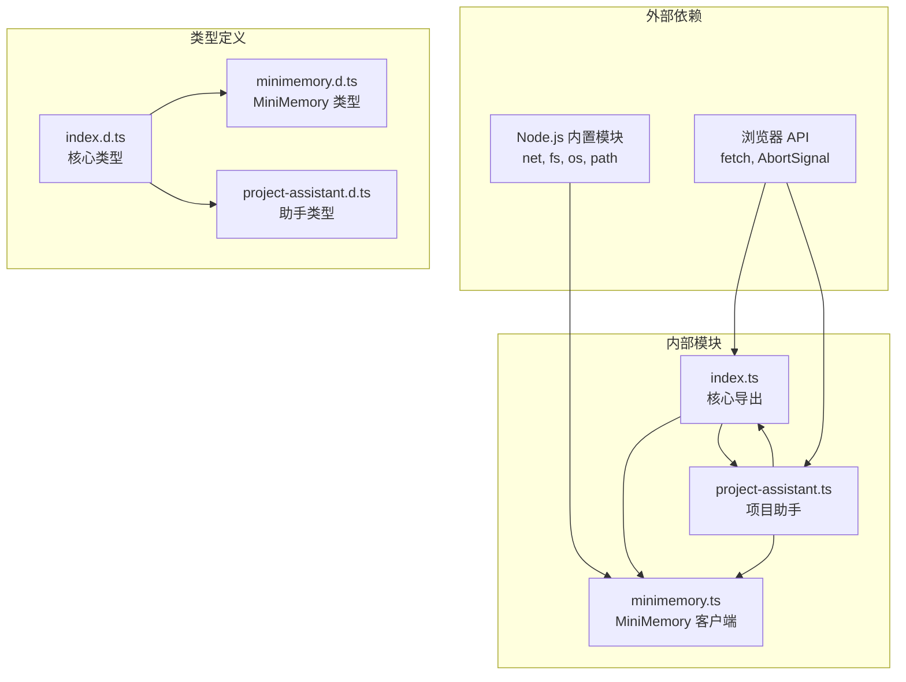

**图表来源**
- [SDKs/typescript/src/index.ts:1-221](file://SDKs/typescript/src/index.ts#L1-L221)
- [SDKs/typescript/src/minimemory.ts:1-21](file://SDKs/typescript/src/minimemory.ts#L1-L21)
- [SDKs/typescript/src/project-assistant.ts:1-6](file://SDKs/typescript/src/project-assistant.ts#L1-L6)

### 错误处理策略

SDK 实现了多层次的错误处理机制：

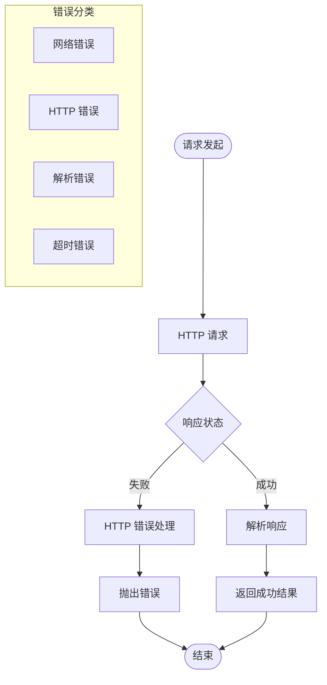

**图表来源**
- [SDKs/typescript/src/index.ts:112-137](file://SDKs/typescript/src/index.ts#L112-L137)

**章节来源**
- [SDKs/typescript/src/index.ts:112-137](file://SDKs/typescript/src/index.ts#L112-L137)

## 性能考虑

### 异步编程模式

SDK 采用现代异步编程模式，充分利用 JavaScript 的事件循环机制：

- **流式处理**：使用 `AsyncGenerator` 和 `ReadableStream` 实现高效的流式数据处理
- **Promise 链**：避免回调地狱，提高代码可读性和维护性
- **并发控制**：合理使用 `Promise.all` 和串行处理策略

### 内存管理

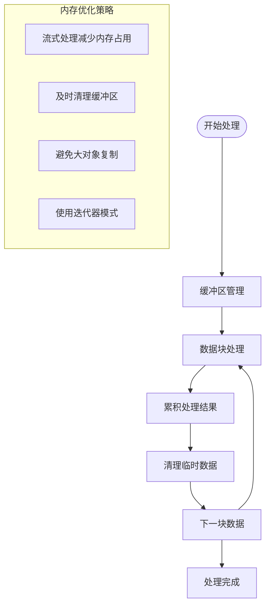

**图表来源**
- [SDKs/typescript/src/index.ts:61-81](file://SDKs/typescript/src/index.ts#L61-L81)

### 网络优化

- **连接复用**：HTTP 客户端支持连接池和重用
- **超时控制**：内置请求超时机制，防止长时间阻塞
- **错误重试**：智能的错误检测和重试策略

## 故障排除指南

### 常见问题及解决方案

#### 连接问题

**问题**：无法连接到 Agent 服务器
**解决方案**：
1. 检查 `baseUrl` 配置是否正确
2. 验证网络连通性
3. 确认服务器端口开放

#### 认证失败

**问题**：API 密钥认证失败
**解决方案**：
1. 验证 `apiKey` 配置
2. 检查密钥格式和有效期
3. 确认服务器端配置

#### 超时问题

**问题**：请求超时或响应缓慢
**解决方案**：
1. 调整 `requestTimeoutMs` 参数
2. 检查服务器性能
3. 优化网络环境

#### 数据解析错误

**问题**：JSON 解析失败或数据格式不正确
**解决方案**：
1. 检查响应格式
2. 验证数据完整性
3. 使用类型守卫进行安全访问

**章节来源**
- [SDKs/typescript/src/index.ts:112-137](file://SDKs/typescript/src/index.ts#L112-L137)
- [SDKs/typescript/src/project-assistant.ts:148-159](file://SDKs/typescript/src/project-assistant.ts#L148-L159)

## 结论

TypeScript SDK 提供了一个功能完整、类型安全、性能优异的开发框架。其模块化设计使得开发者可以灵活地选择所需功能，同时保持代码的可维护性和扩展性。通过合理的错误处理机制和性能优化策略，SDK 能够满足生产环境的各种需求。

## 附录

### 安装和配置指南

#### 基础安装

```bash
npm install llama-agent-sdk-ts
```

#### TypeScript 配置

```json
{
  "compilerOptions": {
    "target": "ES2022",
    "module": "NodeNext",
    "moduleResolution": "NodeNext",
    "declaration": true,
    "strict": true,
    "skipLibCheck": true,
    "lib": ["ES2022", "DOM"],
    "types": ["node"]
  }
}
```

#### 基本使用示例

```typescript
import { HttpAgentSession } from 'llama-agent-sdk-ts';

const session = new HttpAgentSession(
  { baseUrl: 'http://localhost:8080', apiKey: 'your-api-key' },
  { model: 'your-model-name' }
);

// 同步对话
const response = await session.chatCompletions('Hello');

// 流式对话
const result = await session.chatCompletionsStream('Hello', (delta) => {
  console.log(delta);
});
```

### API 参考

#### HttpAgentSession 方法

| 方法名 | 参数 | 返回值 | 描述 |
|--------|------|--------|------|
| `chatCompletions` | `userPrompt: string, extra?: Json` | `Promise<Json>` | 发送同步对话请求 |
| `chatCompletionsStream` | `userPrompt: string, onDelta?: Function, extra?: Json` | `Promise<object>` | 发送流式对话请求 |
| `clear` | `void` | `void` | 清空消息历史 |

#### MiniMemoryClient 方法

| 方法名 | 参数 | 返回值 | 描述 |
|--------|------|--------|------|
| `connect` | `void` | `Promise<void>` | 建立连接 |
| `command` | `args: string[]` | `Promise<RespValue>` | 执行命令 |
| `close` | `void` | `void` | 关闭连接 |

### 最佳实践

1. **类型安全**：始终使用 TypeScript 类型定义
2. **错误处理**：实现完善的错误捕获和处理机制
3. **资源管理**：及时释放连接和内存资源
4. **性能优化**：合理使用流式处理和缓存策略
5. **测试覆盖**：编写全面的单元测试和集成测试