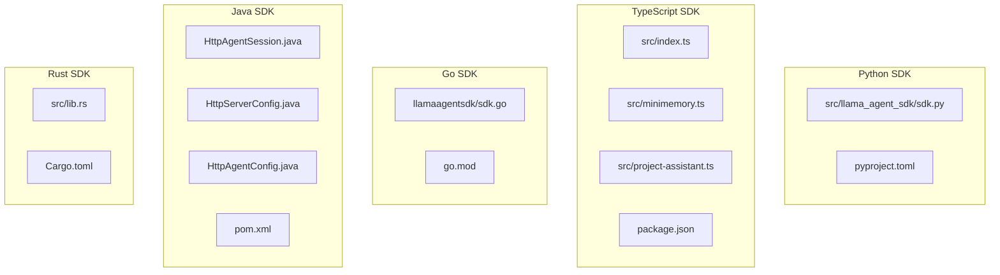
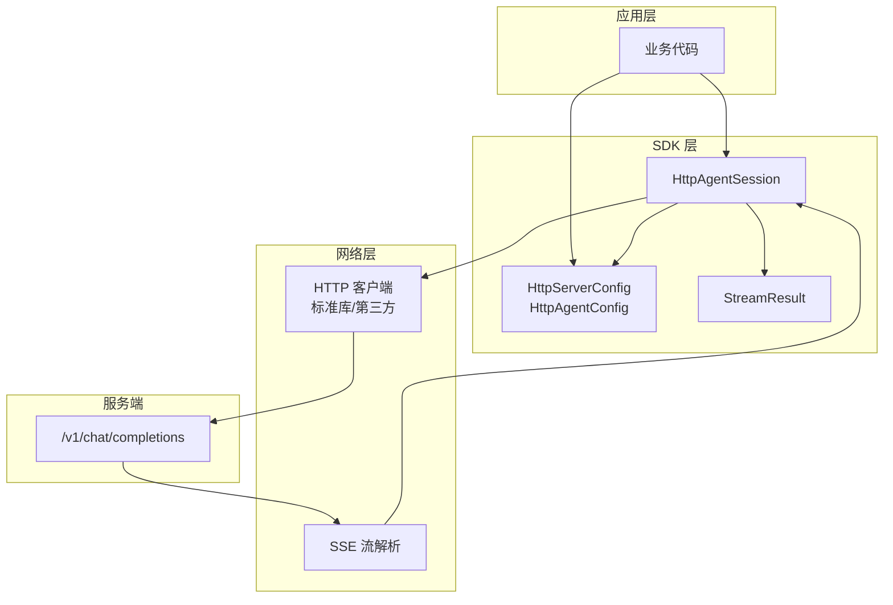
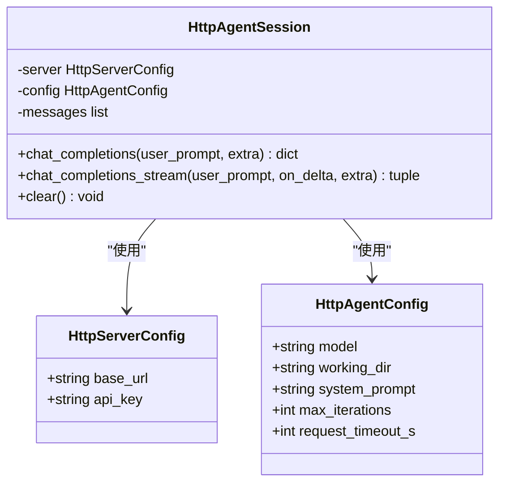
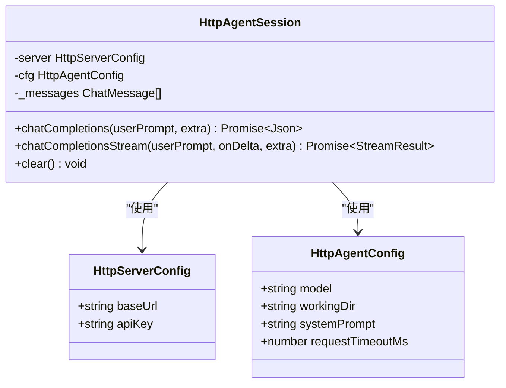
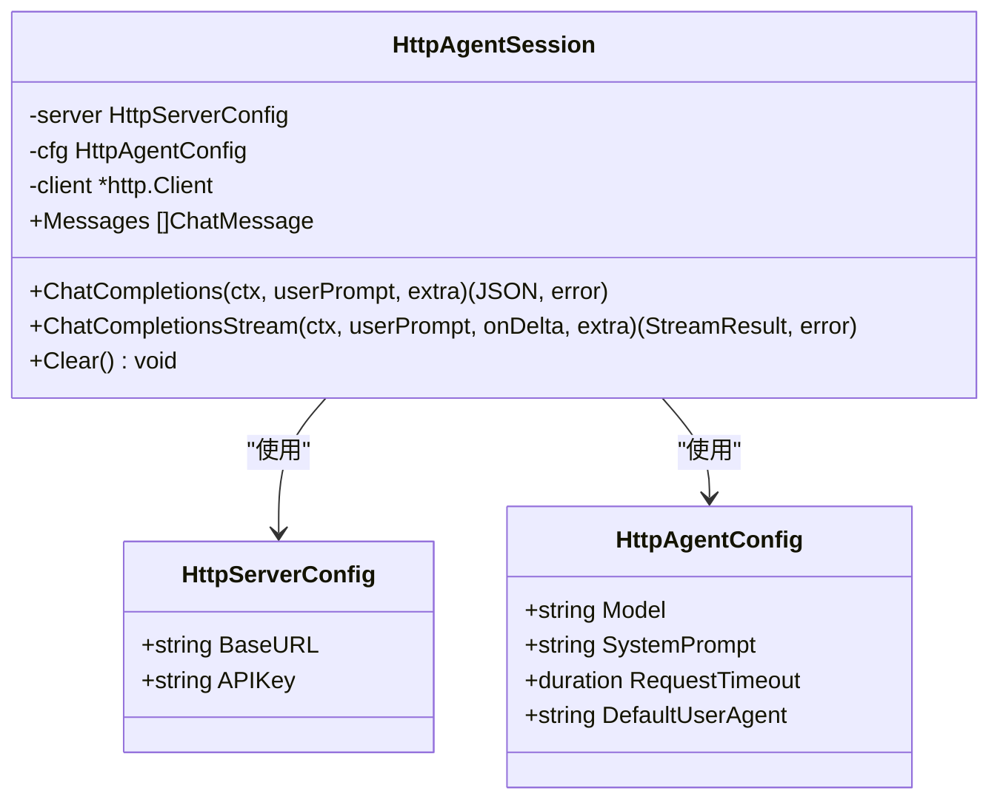
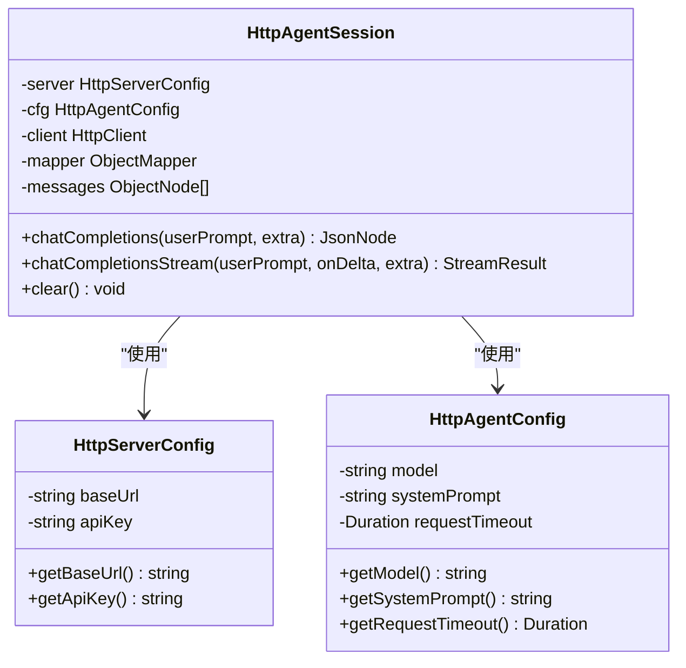
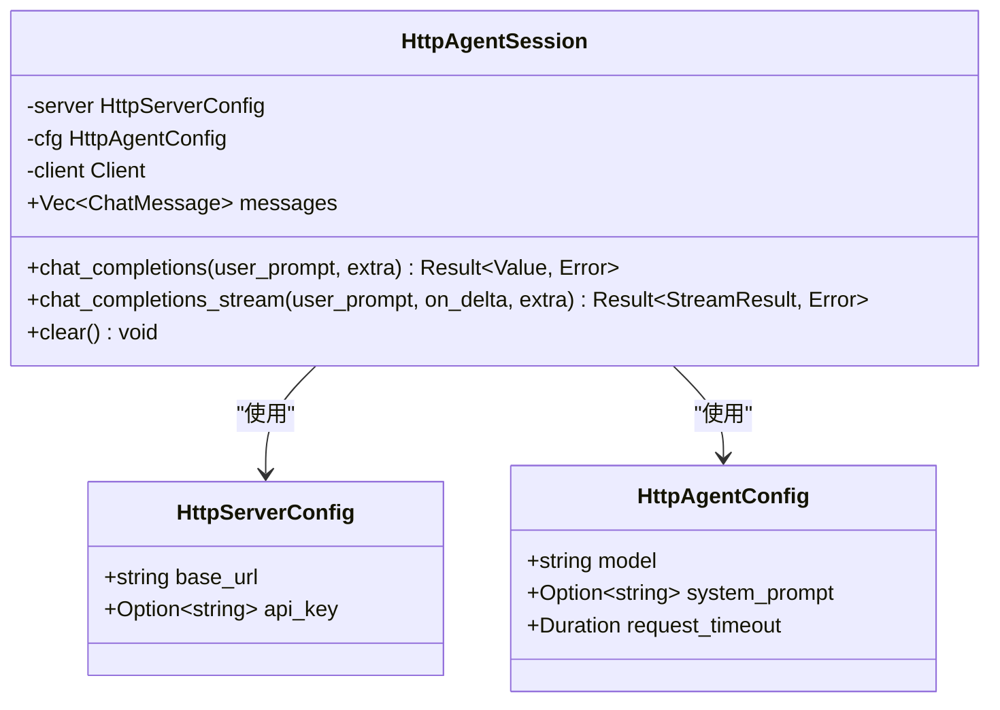
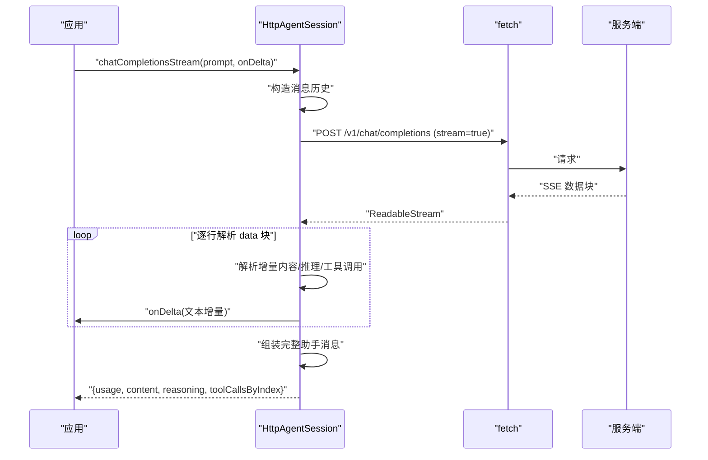
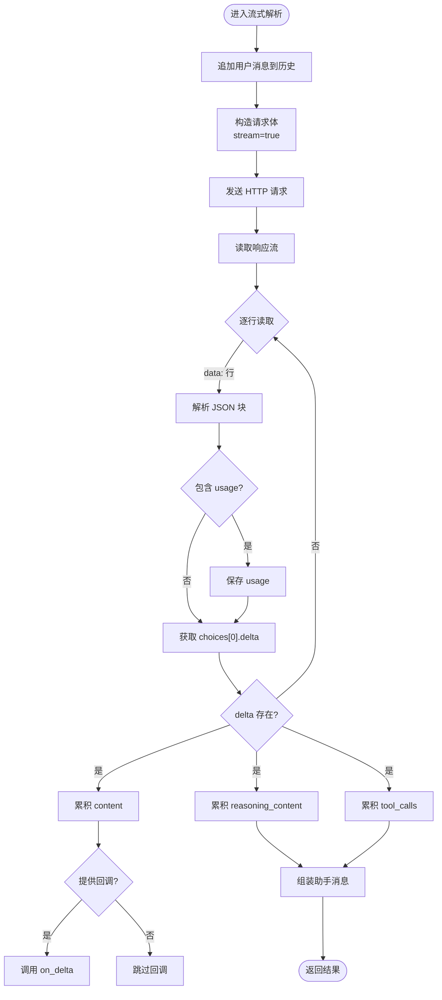
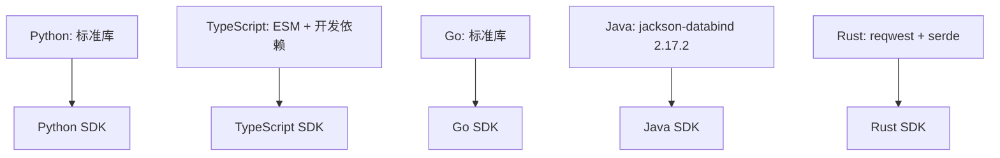

# 多语言 SDK

<cite>
**本文引用的文件**
- [Python SDK 核心实现](file://SDKs/python/src/llama_agent_sdk/sdk.py)
- [Python 包配置](file://SDKs/python/pyproject.toml)
- [TypeScript SDK 核心实现](file://SDKs/typescript/src/index.ts)
- [TypeScript 迷你内存客户端](file://SDKs/typescript/src/minimemory.ts)
- [TypeScript 项目助理示例](file://SDKs/typescript/src/project-assistant.ts)
- [TypeScript 包配置](file://SDKs/typescript/package.json)
- [Go SDK 核心实现](file://SDKs/go/llamaagentsdk/sdk.go)
- [Go 模块配置](file://SDKs/go/go.mod)
- [Java SDK 核心实现](file://SDKs/java/src/main/java/ai/llama/agent/sdk/HttpAgentSession.java)
- [Java 服务器配置](file://SDKs/java/src/main/java/ai/llama/agent/sdk/HttpServerConfig.java)
- [Java Agent 配置](file://SDKs/java/src/main/java/ai/llama/agent/sdk/HttpAgentConfig.java)
- [Java Maven 配置](file://SDKs/java/pom.xml)
- [Rust SDK 核心实现](file://SDKs/rust/src/lib.rs)
- [Rust Cargo 配置](file://SDKs/rust/Cargo.toml)
</cite>

## 目录
1. [简介](#简介)
2. [项目结构](#项目结构)
3. [核心组件](#核心组件)
4. [架构总览](#架构总览)
5. [详细组件分析](#详细组件分析)
6. [依赖分析](#依赖分析)
7. [性能考虑](#性能考虑)
8. [故障排除指南](#故障排除指南)
9. [结论](#结论)
10. [附录](#附录)

## 简介
本文件为多语言 SDK 技术文档，覆盖 Python、TypeScript、Go、Java、Rust 五种语言的 SDK 实现与使用方法。SDK 提供统一的 HTTP 客户端封装，支持 OpenAI 兼容的聊天补全接口（含流式 SSE），并内置会话管理、消息历史维护、工具调用聚合等功能。文档同时涵盖接口规范、参数配置、错误处理策略、性能优化建议以及各语言特有的注意事项与最佳实践。

## 项目结构
SDKs 目录按语言划分，每种语言包含独立的实现与构建配置：
- Python：基于标准库实现 HTTP 请求与 SSE 流解析
- TypeScript：基于 fetch 与可读流实现，支持浏览器与 Node 环境
- Go：基于 net/http 与 bufio 实现，支持 context 超时控制
- Java：基于 java.net.http 与 Jackson，支持流式解析与回调
- Rust：基于 reqwest blocking client，支持 serde 序列化与 SSE 解析

**图表来源**
- [Python SDK 核心实现:1-224](file://SDKs/python/src/llama_agent_sdk/sdk.py#L1-L224)
- [Python 包配置:1-16](file://SDKs/python/pyproject.toml#L1-L16)
- [TypeScript SDK 核心实现:1-221](file://SDKs/typescript/src/index.ts#L1-L221)
- [TypeScript 迷你内存客户端:1-183](file://SDKs/typescript/src/minimemory.ts#L1-L183)
- [TypeScript 项目助理示例:1-442](file://SDKs/typescript/src/project-assistant.ts#L1-L442)
- [TypeScript 包配置:1-18](file://SDKs/typescript/package.json#L1-L18)
- [Go SDK 核心实现:1-267](file://SDKs/go/llamaagentsdk/sdk.go#L1-L267)
- [Go 模块配置:1-4](file://SDKs/go/go.mod#L1-L4)
- [Java SDK 核心实现:1-257](file://SDKs/java/src/main/java/ai/llama/agent/sdk/HttpAgentSession.java#L1-L257)
- [Java 服务器配置:1-24](file://SDKs/java/src/main/java/ai/llama/agent/sdk/HttpServerConfig.java#L1-L24)
- [Java Agent 配置:1-32](file://SDKs/java/src/main/java/ai/llama/agent/sdk/HttpAgentConfig.java#L1-L32)
- [Java Maven 配置:1-19](file://SDKs/java/pom.xml#L1-L19)
- [Rust SDK 核心实现:1-274](file://SDKs/rust/src/lib.rs#L1-L274)
- [Rust Cargo 配置:1-14](file://SDKs/rust/Cargo.toml#L1-L14)

**章节来源**
- [Python SDK 核心实现:1-224](file://SDKs/python/src/llama_agent_sdk/sdk.py#L1-L224)
- [TypeScript SDK 核心实现:1-221](file://SDKs/typescript/src/index.ts#L1-L221)
- [Go SDK 核心实现:1-267](file://SDKs/go/llamaagentsdk/sdk.go#L1-L267)
- [Java SDK 核心实现:1-257](file://SDKs/java/src/main/java/ai/llama/agent/sdk/HttpAgentSession.java#L1-L257)
- [Rust SDK 核心实现:1-274](file://SDKs/rust/src/lib.rs#L1-L274)

## 核心组件
- 服务器配置（HttpServerConfig）：包含基础 URL 与可选 API Key
- Agent 配置（HttpAgentConfig）：模型名、工作目录、系统提示词、请求超时等
- 会话（HttpAgentSession）：维护消息历史、构造请求体、发送请求、解析响应
- 流式结果（StreamResult）：聚合 content、reasoning、工具调用索引与用量信息
- SSE 解析器：统一从服务端事件中提取增量数据

关键职责与交互：
- 会话在每次请求前追加用户消息，请求后将返回的助手消息加入历史
- 流式接口将增量文本、推理文本与工具调用片段聚合为最终消息
- 统一的端点拼接函数确保 URL 正确拼接，避免多余或缺失斜杠

**章节来源**
- [Python SDK 核心实现:14-224](file://SDKs/python/src/llama_agent_sdk/sdk.py#L14-L224)
- [Go SDK 核心实现:26-267](file://SDKs/go/llamaagentsdk/sdk.go#L26-L267)
- [Java SDK 核心实现:22-245](file://SDKs/java/src/main/java/ai/llama/agent/sdk/HttpAgentSession.java#L22-L245)
- [Rust SDK 核心实现:8-271](file://SDKs/rust/src/lib.rs#L8-L271)

## 架构总览
SDK 采用“配置 + 会话 + 请求”的分层设计，统一通过 /v1/chat/completions 端点进行交互。会话对象负责消息历史管理与请求头注入；底层 HTTP 客户端根据语言特性选择标准库或第三方库；SSE 流解析在各语言中以相似逻辑实现。

**图表来源**
- [Python SDK 核心实现:102-224](file://SDKs/python/src/llama_agent_sdk/sdk.py#L102-L224)
- [Go SDK 核心实现:38-267](file://SDKs/go/llamaagentsdk/sdk.go#L38-L267)
- [Java SDK 核心实现:22-245](file://SDKs/java/src/main/java/ai/llama/agent/sdk/HttpAgentSession.java#L22-L245)
- [Rust SDK 核心实现:58-271](file://SDKs/rust/src/lib.rs#L58-L271)
- [TypeScript SDK 核心实现:83-218](file://SDKs/typescript/src/index.ts#L83-L218)

## 详细组件分析

### Python SDK 分析
- 数据结构
  - HttpServerConfig：包含 base_url 与 api_key
  - HttpAgentConfig：包含 model、working_dir、system_prompt、max_iterations、request_timeout_s
  - HttpAgentSession：维护消息列表，提供非流式与流式聊天补全
- 关键流程
  - 非流式：构造请求体，发送 POST，解析 JSON，更新消息历史
  - 流式：逐行读取 SSE，解析 data 块，累积 content、reasoning、工具调用，最后生成完整消息
- 错误处理
  - 使用 urllib.request.urlopen 并设置超时；SSL 上下文启用默认信任链
  - SSE 行解码采用替换策略，忽略无效编码
- 性能与优化
  - 使用 SSL 上下文保证安全连接
  - 流式解析按行扫描，避免一次性加载大块数据

**图表来源**
- [Python SDK 核心实现:14-224](file://SDKs/python/src/llama_agent_sdk/sdk.py#L14-L224)

**章节来源**
- [Python SDK 核心实现:14-224](file://SDKs/python/src/llama_agent_sdk/sdk.py#L14-L224)

### TypeScript SDK 分析
- 数据结构
  - 类型定义：Json、ChatMessage、ToolCall、ToolCallDelta、ChatCompletionChunk
  - HttpServerConfig：baseUrl、apiKey
  - HttpAgentConfig：model、workingDir、systemPrompt、requestTimeoutMs
  - HttpAgentSession：维护消息数组，提供非流式与流式聊天补全
- 关键流程
  - 非流式：使用 fetch 发送请求，检查响应状态，解析 JSON，更新消息历史
  - 流式：通过 ReadableStream 读取字节，TextDecoder 解码，逐行提取 data 块，聚合增量
- 错误处理
  - fetchChecked 捕获底层网络异常并格式化错误信息
  - throwHttpError 将 HTTP 错误响应体截断输出，便于调试
- 性能与优化
  - 使用 AbortSignal.timeout 控制请求超时
  - 流式解析采用异步迭代器，内存占用低

**图表来源**
- [TypeScript SDK 核心实现:41-218](file://SDKs/typescript/src/index.ts#L41-L218)

**章节来源**
- [TypeScript SDK 核心实现:41-218](file://SDKs/typescript/src/index.ts#L41-L218)

### Go SDK 分析
- 数据结构
  - HttpServerConfig：BaseURL、APIKey
  - HttpAgentConfig：Model、SystemPrompt、RequestTimeout、DefaultUserAgent
  - HttpAgentSession：server、cfg、client、Messages
  - StreamResult：Usage、Content、Reasoning、ToolCallsByIndex
- 关键流程
  - 非流式：构造 JSON 请求体，使用 http.Client 发送，解析响应并更新消息
  - 流式：使用 bufio.Scanner 逐行读取响应体，解析 data 块，聚合增量
- 错误处理
  - 对非 2xx 状态码读取响应体并返回错误
  - 流式解析忽略无效 JSON，继续处理后续数据
- 性能与优化
  - 支持 context 控制超时
  - 默认超时时间可配置，未设置时使用 300 秒

**图表来源**
- [Go SDK 核心实现:26-267](file://SDKs/go/llamaagentsdk/sdk.go#L26-L267)

**章节来源**
- [Go SDK 核心实现:26-267](file://SDKs/go/llamaagentsdk/sdk.go#L26-L267)

### Java SDK 分析
- 数据结构
  - HttpServerConfig：baseUrl、apiKey
  - HttpAgentConfig：model、systemPrompt、requestTimeout
  - HttpAgentSession：client、messages、mapper
  - StreamResult：内部类 ToolCallAcc 聚合工具调用
- 关键流程
  - 非流式：使用 HttpClient 发送请求，Jackson 解析 JSON，更新消息历史
  - 流式：BufferedReader 逐行读取，解析 JSON，聚合 content、reasoning、工具调用
- 错误处理
  - 非 2xx 状态码抛出运行时异常，包含响应体
  - 工具调用解析失败时跳过该片段
- 性能与优化
  - Jackson ObjectMapper 提升 JSON 解析性能
  - 流式解析使用 Comparator 对工具调用排序

**图表来源**
- [Java SDK 核心实现:22-245](file://SDKs/java/src/main/java/ai/llama/agent/sdk/HttpAgentSession.java#L22-L245)
- [Java 服务器配置:3-23](file://SDKs/java/src/main/java/ai/llama/agent/sdk/HttpServerConfig.java#L3-L23)
- [Java Agent 配置:5-31](file://SDKs/java/src/main/java/ai/llama/agent/sdk/HttpAgentConfig.java#L5-L31)

**章节来源**
- [Java SDK 核心实现:22-245](file://SDKs/java/src/main/java/ai/llama/agent/sdk/HttpAgentSession.java#L22-L245)
- [Java 服务器配置:3-23](file://SDKs/java/src/main/java/ai/llama/agent/sdk/HttpServerConfig.java#L3-L23)
- [Java Agent 配置:5-31](file://SDKs/java/src/main/java/ai/llama/agent/sdk/HttpAgentConfig.java#L5-L31)

### Rust SDK 分析
- 数据结构
  - HttpServerConfig：base_url、api_key
  - HttpAgentConfig：model、system_prompt、request_timeout
  - ChatMessage：role、content、reasoning_content、tool_call_id、name
  - StreamResult：usage、content、reasoning、tool_calls_by_index
  - HttpAgentSession：server、cfg、client、messages
- 关键流程
  - 非流式：使用 reqwest blocking client 发送请求，error_for_status 检查状态，解析 JSON
  - 流式：BufReader 逐行读取，解析 data 块，聚合增量，使用 BTreeMap 有序存储工具调用
- 错误处理
  - 统一返回 Box<dyn std::error::Error>，便于上层处理
  - 流式解析忽略无效 JSON，继续处理后续数据
- 性能与优化
  - reqwest blocking client 提供简洁的同步 API
  - serde_json 高效序列化与反序列化

**图表来源**
- [Rust SDK 核心实现:8-271](file://SDKs/rust/src/lib.rs#L8-L271)

**章节来源**
- [Rust SDK 核心实现:8-271](file://SDKs/rust/src/lib.rs#L8-L271)

### API/服务组件时序图（TypeScript）

**图表来源**
- [TypeScript SDK 核心实现:157-217](file://SDKs/typescript/src/index.ts#L157-L217)

### 复杂逻辑组件流程图（Python 流式解析）

**图表来源**
- [Python SDK 核心实现:146-224](file://SDKs/python/src/llama_agent_sdk/sdk.py#L146-L224)

## 依赖分析
- Python：纯标准库依赖，无外部包
- TypeScript：ESM 模块，无运行时依赖，开发依赖为 TypeScript 与 Node 类型
- Go：标准库依赖
- Java：Jackson Databind 2.17.2
- Rust：reqwest（blocking/json）、serde、serde_json

**图表来源**
- [Python 包配置:1-16](file://SDKs/python/pyproject.toml#L1-L16)
- [TypeScript 包配置:1-18](file://SDKs/typescript/package.json#L1-L18)
- [Go 模块配置:1-4](file://SDKs/go/go.mod#L1-L4)
- [Java Maven 配置:11-16](file://SDKs/java/pom.xml#L11-L16)
- [Rust Cargo 配置:10-14](file://SDKs/rust/Cargo.toml#L10-L14)

**章节来源**
- [Python 包配置:1-16](file://SDKs/python/pyproject.toml#L1-L16)
- [TypeScript 包配置:1-18](file://SDKs/typescript/package.json#L1-L18)
- [Go 模块配置:1-4](file://SDKs/go/go.mod#L1-L4)
- [Java Maven 配置:11-16](file://SDKs/java/pom.xml#L11-L16)
- [Rust Cargo 配置:10-14](file://SDKs/rust/Cargo.toml#L10-L14)

## 性能考虑
- 超时控制
  - Python：urllib.request.urlopen 设置 timeout
  - TypeScript：AbortSignal.timeout 控制请求超时
  - Go：http.Client.Timeout 与 context 超时
  - Java：HttpClient.newBuilder().connectTimeout(...)
  - Rust：reqwest Client builder().timeout(...)
- 流式解析
  - 各语言均采用逐行/逐块读取，避免一次性加载大响应
  - TypeScript 使用 TextDecoder 与异步迭代器，内存友好
- 序列化/反序列化
  - Java 使用 Jackson，Rust 使用 serde，Python/Go/TS 使用各自内置或轻量库
- 网络安全
  - Python/Go/TypeScript/Java/Rust 均支持 SSL/TLS，建议生产环境强制使用 HTTPS

[本节为通用指导，无需特定文件来源]

## 故障排除指南
- HTTP 错误
  - Python：读取响应体并抛出异常
  - TypeScript：throwHttpError 截断响应体，包含 URL 与状态信息
  - Go：非 2xx 状态读取响应体并返回错误
  - Java：非 2xx 抛出运行时异常，包含响应体
  - Rust：error_for_status 返回错误
- 网络异常
  - TypeScript：fetchChecked 捕获底层错误并格式化，包含 errno/code 与 message
  - Java：捕获异常并转换为运行时异常
- SSE 解析失败
  - Python/Go/Java/Rust：忽略无效 JSON，继续处理后续数据
  - TypeScript：异步迭代器持续消费流，遇到无效行跳过
- 超时问题
  - 确认各语言的超时配置是否合理，必要时增大 requestTimeout 或使用 context 超时
- 认证失败
  - 确保 HttpServerConfig 中的 API Key 正确传递至 Authorization 头

**章节来源**
- [Python SDK 核心实现:126-144](file://SDKs/python/src/llama_agent_sdk/sdk.py#L126-L144)
- [TypeScript SDK 核心实现:112-137](file://SDKs/typescript/src/index.ts#L112-L137)
- [Go SDK 核心实现:122-125](file://SDKs/go/llamaagentsdk/sdk.go#L122-L125)
- [Java SDK 核心实现:103-105](file://SDKs/java/src/main/java/ai/llama/agent/sdk/HttpAgentSession.java#L103-L105)
- [Rust SDK 核心实现:133-143](file://SDKs/rust/src/lib.rs#L133-L143)

## 结论
本多语言 SDK 在保持一致的 API 设计与行为的同时，充分利用各语言的标准库或生态库，实现了高效的 HTTP 客户端封装与 SSE 流式解析。通过统一的会话管理与消息历史维护，开发者可以快速集成聊天补全能力，并在需要时扩展工具调用与 RAG 能力。建议在生产环境中启用 HTTPS、合理设置超时、监控 usage 信息，并根据具体场景选择最适合的语言实现。

[本节为总结，无需特定文件来源]

## 附录

### 接口规范与参数配置
- 服务器配置（HttpServerConfig）
  - Python/Go/Java/Rust：base_url、api_key（可选）
  - TypeScript：baseUrl、apiKey（可选）
- Agent 配置（HttpAgentConfig）
  - Python：model、working_dir、system_prompt、max_iterations、request_timeout_s
  - TypeScript：model、workingDir、systemPrompt、requestTimeoutMs
  - Go：Model、SystemPrompt、RequestTimeout、DefaultUserAgent
  - Java：model、systemPrompt、requestTimeout
  - Rust：model、system_prompt、request_timeout
- 会话方法
  - 非流式：chat_completions(user_prompt, extra)
  - 流式：chat_completions_stream(user_prompt, on_delta, extra)
  - 清空：clear()

**章节来源**
- [Python SDK 核心实现:14-224](file://SDKs/python/src/llama_agent_sdk/sdk.py#L14-L224)
- [TypeScript SDK 核心实现:41-218](file://SDKs/typescript/src/index.ts#L41-L218)
- [Go SDK 核心实现:26-267](file://SDKs/go/llamaagentsdk/sdk.go#L26-L267)
- [Java SDK 核心实现:22-245](file://SDKs/java/src/main/java/ai/llama/agent/sdk/HttpAgentSession.java#L22-L245)
- [Rust SDK 核心实现:8-271](file://SDKs/rust/src/lib.rs#L8-L271)

### 安装与配置指南
- Python
  - 使用 setuptools 构建，目标 Python 版本 ≥ 3.10
  - 参考路径：[Python 包配置:1-16](file://SDKs/python/pyproject.toml#L1-L16)
- TypeScript
  - ESM 模块，使用 TypeScript 编译为 dist
  - 参考路径：[TypeScript 包配置:1-18](file://SDKs/typescript/package.json#L1-L18)
- Go
  - Go 1.22，模块名为 llama-agent-sdk-go
  - 参考路径：[Go 模块配置:1-4](file://SDKs/go/go.mod#L1-L4)
- Java
  - JDK 11+，使用 Maven，依赖 Jackson Databind 2.17.2
  - 参考路径：[Java Maven 配置:11-16](file://SDKs/java/pom.xml#L11-L16)
- Rust
  - 使用 Cargo，默认启用 blocking 与 json 功能
  - 参考路径：[Rust Cargo 配置:10-14](file://SDKs/rust/Cargo.toml#L10-L14)

**章节来源**
- [Python 包配置:1-16](file://SDKs/python/pyproject.toml#L1-L16)
- [TypeScript 包配置:1-18](file://SDKs/typescript/package.json#L1-L18)
- [Go 模块配置:1-4](file://SDKs/go/go.mod#L1-L4)
- [Java Maven 配置:11-16](file://SDKs/java/pom.xml#L11-L16)
- [Rust Cargo 配置:10-14](file://SDKs/rust/Cargo.toml#L10-L14)

### 基本使用示例（路径指引）
- Python
  - 会话初始化与聊天补全：[Python SDK 核心实现:102-144](file://SDKs/python/src/llama_agent_sdk/sdk.py#L102-L144)
  - 流式聊天补全：[Python SDK 核心实现:146-224](file://SDKs/python/src/llama_agent_sdk/sdk.py#L146-L224)
- TypeScript
  - 会话初始化与聊天补全：[TypeScript SDK 核心实现:83-155](file://SDKs/typescript/src/index.ts#L83-L155)
  - 流式聊天补全：[TypeScript SDK 核心实现:157-217](file://SDKs/typescript/src/index.ts#L157-L217)
- Go
  - 会话初始化与聊天补全：[Go SDK 核心实现:45-141](file://SDKs/go/llamaagentsdk/sdk.go#L45-L141)
  - 流式聊天补全：[Go SDK 核心实现:150-265](file://SDKs/go/llamaagentsdk/sdk.go#L150-L265)
- Java
  - 会话初始化与聊天补全：[Java SDK 核心实现:29-112](file://SDKs/java/src/main/java/ai/llama/agent/sdk/HttpAgentSession.java#L29-L112)
  - 流式聊天补全：[Java SDK 核心实现:114-245](file://SDKs/java/src/main/java/ai/llama/agent/sdk/HttpAgentSession.java#L114-L245)
- Rust
  - 会话初始化与聊天补全：[Rust SDK 核心实现:65-144](file://SDKs/rust/src/lib.rs#L65-L144)
  - 流式聊天补全：[Rust SDK 核心实现:146-271](file://SDKs/rust/src/lib.rs#L146-L271)

**章节来源**
- [Python SDK 核心实现:102-224](file://SDKs/python/src/llama_agent_sdk/sdk.py#L102-L224)
- [TypeScript SDK 核心实现:83-218](file://SDKs/typescript/src/index.ts#L83-L218)
- [Go SDK 核心实现:45-265](file://SDKs/go/llamaagentsdk/sdk.go#L45-L265)
- [Java SDK 核心实现:29-245](file://SDKs/java/src/main/java/ai/llama/agent/sdk/HttpAgentSession.java#L29-L245)
- [Rust SDK 核心实现:65-271](file://SDKs/rust/src/lib.rs#L65-L271)

### 高级功能与最佳实践
- 工具调用聚合
  - Python/Go/Java/Rust：按索引聚合工具调用的 id 与 arguments
  - TypeScript：使用 Map 按索引聚合，最终转换为有序数组
- RAG 与 Web 工具
  - TypeScript 项目助理示例展示了 MiniMemory 客户端与嵌入向量检索的结合
  - 参考路径：[TypeScript 迷你内存客户端:101-181](file://SDKs/typescript/src/minimemory.ts#L101-L181)，[TypeScript 项目助理示例:174-238](file://SDKs/typescript/src/project-assistant.ts#L174-L238)
- 最佳实践
  - 统一设置超时，避免阻塞
  - 在流式场景中及时消费增量，避免缓冲区积压
  - 使用 HTTPS 并正确配置证书
  - 对于 Java/Rust，优先使用类型安全的 JSON 库（Jackson/serde）

**章节来源**
- [TypeScript 迷你内存客户端:101-181](file://SDKs/typescript/src/minimemory.ts#L101-L181)
- [TypeScript 项目助理示例:174-238](file://SDKs/typescript/src/project-assistant.ts#L174-L238)