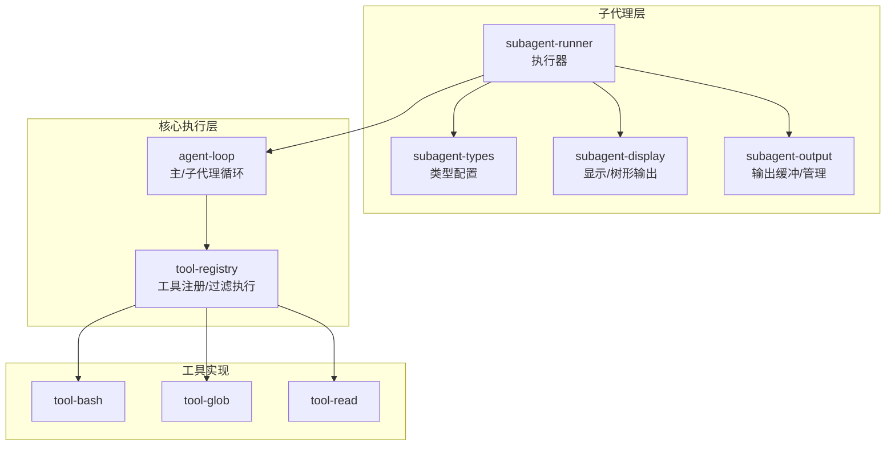
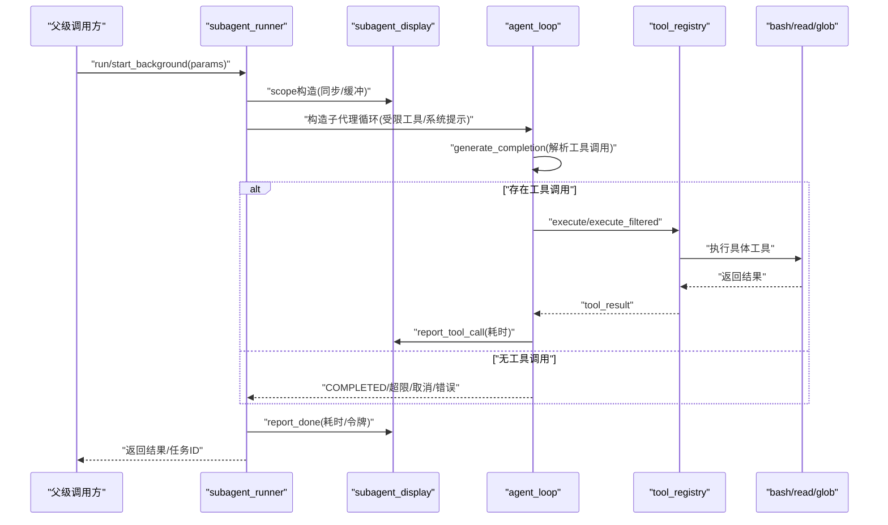
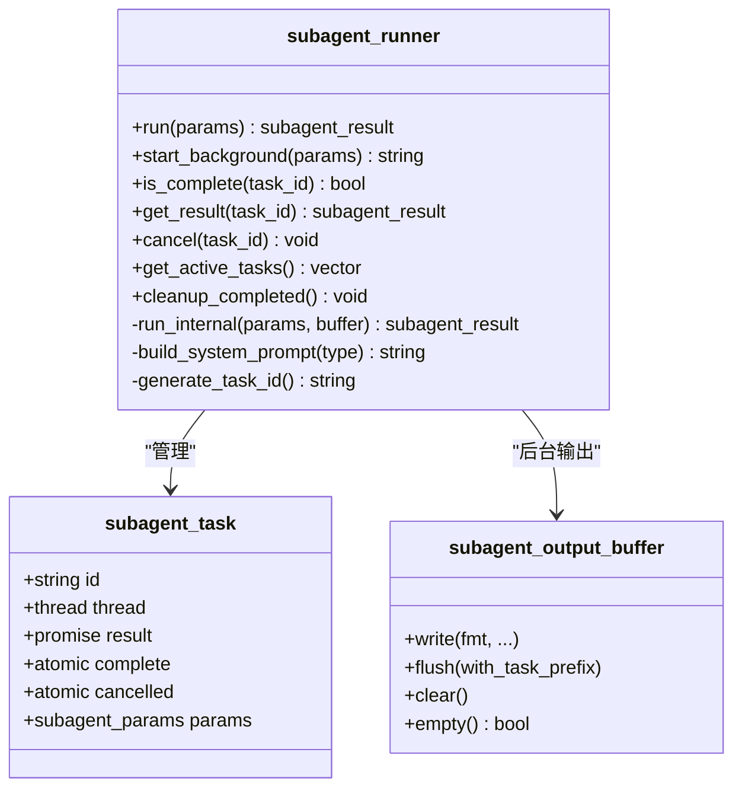
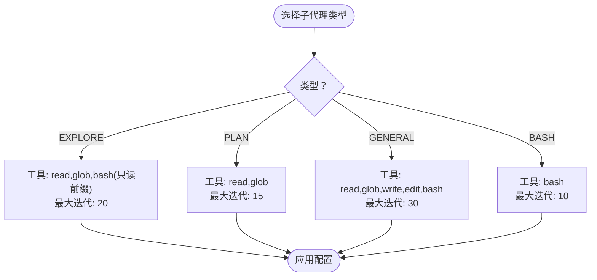
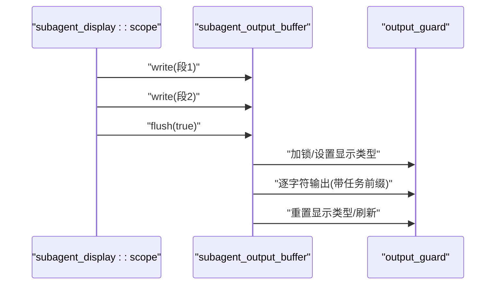
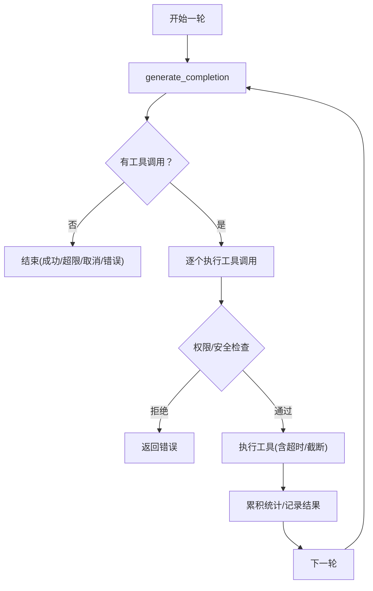
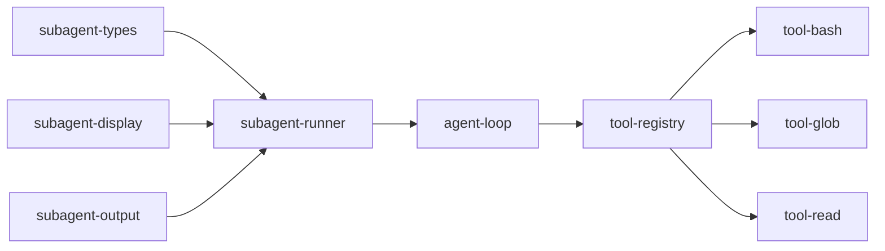

# 子代理执行器

<cite>
**本文引用的文件**
- [subagent-runner.h](file://agent/subagent/subagent-runner.h)
- [subagent-runner.cpp](file://agent/subagent/subagent-runner.cpp)
- [subagent-types.h](file://agent/subagent/subagent-types.h)
- [subagent-types.cpp](file://agent/subagent/subagent-types.cpp)
- [subagent-output.h](file://agent/subagent/subagent-output.h)
- [subagent-output.cpp](file://agent/subagent/subagent-output.cpp)
- [subagent-display.h](file://agent/subagent/subagent-display.h)
- [subagent-display.cpp](file://agent/subagent/subagent-display.cpp)
- [agent-loop.h](file://agent/agent-loop.h)
- [agent-loop.cpp](file://agent/agent-loop.cpp)
- [tool-registry.h](file://agent/tool-registry.h)
- [tool-registry.cpp](file://agent/tool-registry.cpp)
- [tool-bash.cpp](file://agent/tools/tool-bash.cpp)
- [tool-read.cpp](file://agent/tools/tool-read.cpp)
- [tool-glob.cpp](file://agent/tools/tool-glob.cpp)
</cite>

## 目录
1. [简介](#简介)
2. [项目结构](#项目结构)
3. [核心组件](#核心组件)
4. [架构总览](#架构总览)
5. [详细组件分析](#详细组件分析)
6. [依赖关系分析](#依赖关系分析)
7. [性能考虑](#性能考虑)
8. [故障排除指南](#故障排除指南)
9. [结论](#结论)
10. [附录](#附录)

## 简介
本文件面向“子代理执行器”的技术文档，聚焦以下目标：
- 解释子代理执行策略与任务分解算法
- 说明执行监控机制（状态、迭代次数、令牌统计）
- 描述执行器如何按子代理类型选择策略、处理工具调用、管理后台任务生命周期
- 汇总初始化流程、配置加载、错误处理与异常恢复
- 提供执行流程示例、性能优化建议、接口规范、调试与排障方法

## 项目结构
子代理执行器位于 agent/subagent 目录，围绕以下模块协作：
- 执行器主体：subagent-runner（对外暴露同步/异步运行、后台任务管理）
- 类型与配置：subagent-types（定义子代理类型、最大迭代、工具白名单、只读命令前缀等）
- 输出缓冲与显示：subagent-output、subagent-display（后台输出缓冲、前台原子输出、树形可视化）
- 核心循环：agent-loop（主/子代理循环、工具解析与执行、权限控制、统计）
- 工具注册与执行：tool-registry（工具注册、过滤执行、bash白名单校验）
- 具体工具：bash/read/glob（文件系统与命令执行）

图表来源
- [subagent-runner.cpp:1-388](file://agent/subagent/subagent-runner.cpp#L1-L388)
- [agent-loop.cpp:1-800](file://agent/agent-loop.cpp#L1-L800)
- [tool-registry.cpp:1-86](file://agent/tool-registry.cpp#L1-L86)

章节来源
- [subagent-runner.h:1-114](file://agent/subagent/subagent-runner.h#L1-L114)
- [subagent-runner.cpp:1-388](file://agent/subagent/subagent-runner.cpp#L1-L388)
- [subagent-types.h:1-36](file://agent/subagent/subagent-types.h#L1-L36)
- [subagent-types.cpp:1-99](file://agent/subagent/subagent-types.cpp#L1-L99)
- [subagent-output.h:1-107](file://agent/subagent/subagent-output.h#L1-L107)
- [subagent-output.cpp:1-207](file://agent/subagent/subagent-output.cpp#L1-L207)
- [subagent-display.h:1-88](file://agent/subagent/subagent-display.h#L1-L88)
- [subagent-display.cpp:1-246](file://agent/subagent/subagent-display.cpp#L1-L246)
- [agent-loop.h:1-276](file://agent/agent-loop.h#L1-L276)
- [agent-loop.cpp:1-800](file://agent/agent-loop.cpp#L1-L800)
- [tool-registry.h:1-103](file://agent/tool-registry.h#L1-L103)
- [tool-registry.cpp:1-86](file://agent/tool-registry.cpp#L1-L86)
- [tool-bash.cpp:1-281](file://agent/tools/tool-bash.cpp#L1-L281)
- [tool-read.cpp:1-120](file://agent/tools/tool-read.cpp#L1-L120)
- [tool-glob.cpp:1-181](file://agent/tools/tool-glob.cpp#L1-L181)

## 核心组件
- 子代理执行器（subagent_runner）
  - 同步/异步运行、后台任务管理、结果收集、清理
  - 构建系统提示词（继承父级基础提示以共享KV缓存）、限制工具集与bash只读模式
- 子代理类型与配置（subagent_types）
  - EXPLORE（只读探索）、PLAN（架构规划）、GENERAL（通用任务）、BASH（仅命令执行）
  - 配置项：名称、描述、图标、颜色、允许工具集、bash前缀白名单、是否可写、最大迭代
- 显示与输出（subagent_display、subagent_output）
  - 树形缩进输出、工具调用时间线、完成标记、后台缓冲原子刷新
- 执行循环（agent_loop）
  - 迭代上限、工具解析与执行、权限检查、统计收集、中断处理
- 工具注册与执行（tool_registry）
  - 工具注册、过滤执行、bash白名单校验（只读EXPLORE）

章节来源
- [subagent-runner.h:64-114](file://agent/subagent/subagent-runner.h#L64-L114)
- [subagent-runner.cpp:133-244](file://agent/subagent/subagent-runner.cpp#L133-L244)
- [subagent-types.h:8-36](file://agent/subagent/subagent-types.h#L8-L36)
- [subagent-types.cpp:12-99](file://agent/subagent/subagent-types.cpp#L12-L99)
- [subagent-display.h:14-88](file://agent/subagent/subagent-display.h#L14-L88)
- [subagent-display.cpp:33-246](file://agent/subagent/subagent-display.cpp#L33-L246)
- [subagent-output.h:25-107](file://agent/subagent/subagent-output.h#L25-L107)
- [subagent-output.cpp:50-207](file://agent/subagent/subagent-output.cpp#L50-L207)
- [agent-loop.h:167-276](file://agent/agent-loop.h#L167-L276)
- [agent-loop.cpp:695-788](file://agent/agent-loop.cpp#L695-L788)
- [tool-registry.h:58-103](file://agent/tool-registry.h#L58-L103)
- [tool-registry.cpp:49-86](file://agent/tool-registry.cpp#L49-L86)

## 架构总览
子代理执行器通过“执行器-循环-工具”三层协作：
- 执行器负责参数构建、系统提示词生成、工具白名单注入、后台任务生命周期管理
- 循环负责多轮推理、工具调用解析、权限与安全检查、统计与中断
- 工具负责具体能力（文件读取、目录搜索、命令执行），支持只读bash白名单

图表来源
- [subagent-runner.cpp:133-244](file://agent/subagent/subagent-runner.cpp#L133-L244)
- [agent-loop.cpp:333-480](file://agent/agent-loop.cpp#L333-L480)
- [tool-registry.cpp:49-86](file://agent/tool-registry.cpp#L49-L86)
- [tool-bash.cpp:50-258](file://agent/tools/tool-bash.cpp#L50-L258)
- [tool-read.cpp:17-93](file://agent/tools/tool-read.cpp#L17-L93)
- [tool-glob.cpp:72-156](file://agent/tools/tool-glob.cpp#L72-L156)

## 详细组件分析

### 子代理执行器（subagent_runner）
- 初始化与配置
  - 继承父级基础系统提示词，启用KV缓存前缀复用，提升子代理首轮推理效率
  - 依据类型配置设置最大迭代、禁用技能与agents.md注入、抑制冗余日志
- 执行策略
  - 同步：直接控制台输出；异步：使用输出缓冲与任务对象，后台线程执行
  - 构造子代理循环时注入工具白名单与bash只读前缀集合
- 监控与统计
  - 记录工具调用摘要（名称+耗时），汇总输入/输出/缓存令牌数
  - 完成后报告耗时与总令牌数
- 后台任务管理
  - 任务ID生成、活动任务跟踪、完成清理、取消信号传递（通过共享中断标志）
- 错误处理
  - 异常捕获并转为错误结果；后台任务完成后刷新缓冲并移除

图表来源
- [subagent-runner.h:64-114](file://agent/subagent/subagent-runner.h#L64-L114)
- [subagent-runner.cpp:22-388](file://agent/subagent/subagent-runner.cpp#L22-L388)
- [subagent-output.h:25-55](file://agent/subagent/subagent-output.h#L25-L55)

章节来源
- [subagent-runner.cpp:22-388](file://agent/subagent/subagent-runner.cpp#L22-L388)
- [subagent-runner.h:64-114](file://agent/subagent/subagent-runner.h#L64-L114)

### 子代理类型与配置（subagent_types）
- 类型定义与默认行为
  - EXPLORE：只读，允许read/glob/bash（特定前缀），最大迭代较低
  - PLAN：只读规划，允许read/glob，最大迭代中等
  - GENERAL：通用任务，允许read/glob/write/edit/bash，最大迭代较高
  - BASH：仅命令执行，最大迭代最低
- 白名单与只读约束
  - bash前缀白名单用于EXPLORE的只读保护
  - 工具白名单用于所有类型的工具访问控制

图表来源
- [subagent-types.cpp:12-62](file://agent/subagent/subagent-types.cpp#L12-L62)

章节来源
- [subagent-types.h:8-36](file://agent/subagent/subagent-types.h#L8-L36)
- [subagent-types.cpp:12-99](file://agent/subagent/subagent-types.cpp#L12-L99)

### 显示与输出（subagent_display、subagent_output）
- 可视化输出
  - 使用树形字符绘制嵌套层级，彩色/图标标识类型
  - 工具调用以“名称(耗时)”形式展示，完成时汇总耗时与令牌
- 后台输出缓冲
  - 多段输出原子刷新，支持任务ID前缀
  - 线程安全，避免并发输出交错

图表来源
- [subagent-display.cpp:38-197](file://agent/subagent/subagent-display.cpp#L38-L197)
- [subagent-output.cpp:111-155](file://agent/subagent/subagent-output.cpp#L111-L155)

章节来源
- [subagent-display.h:14-88](file://agent/subagent/subagent-display.h#L14-L88)
- [subagent-display.cpp:1-246](file://agent/subagent/subagent-display.cpp#L1-L246)
- [subagent-output.h:25-107](file://agent/subagent/subagent-output.h#L25-L107)
- [subagent-output.cpp:1-207](file://agent/subagent/subagent-output.cpp#L1-L207)

### 执行循环与工具执行（agent_loop、tool_registry）
- 循环逻辑
  - 每轮生成补全，解析工具调用；若无工具调用则结束；否则逐一执行工具调用
  - 支持中断（Ctrl+C/ESC）与最大迭代限制
  - 统计输入/输出/缓存令牌与耗时
- 权限与安全
  - 文件操作外部路径检测、敏感文件阻断、危险命令识别、重复调用防护
  - bash执行支持只读白名单过滤（EXPLORE）
- 工具执行
  - 工具注册与过滤执行；bash执行具备超时、截断、退出码处理

图表来源
- [agent-loop.cpp:695-788](file://agent/agent-loop.cpp#L695-L788)
- [agent-loop.cpp:482-666](file://agent/agent-loop.cpp#L482-L666)
- [tool-registry.cpp:49-86](file://agent/tool-registry.cpp#L49-L86)
- [tool-bash.cpp:50-258](file://agent/tools/tool-bash.cpp#L50-L258)

章节来源
- [agent-loop.h:167-276](file://agent/agent-loop.h#L167-L276)
- [agent-loop.cpp:333-480](file://agent/agent-loop.cpp#L333-L480)
- [tool-registry.h:58-103](file://agent/tool-registry.h#L58-L103)
- [tool-registry.cpp:1-86](file://agent/tool-registry.cpp#L1-L86)
- [tool-bash.cpp:1-281](file://agent/tools/tool-bash.cpp#L1-L281)

## 依赖关系分析
- 执行器依赖
  - 依赖类型配置（决定工具白名单、bash前缀、最大迭代）
  - 依赖显示/输出模块（前台/后台输出）
  - 依赖agent_loop（实际推理与工具执行）
- 循环依赖
  - agent_loop持有tool_registry指针，tool_registry不反向依赖执行器
- 并发与线程
  - 执行器内部使用互斥锁保护任务表；后台线程独立执行，结果通过promise回传

图表来源
- [subagent-runner.cpp:1-388](file://agent/subagent/subagent-runner.cpp#L1-L388)
- [agent-loop.cpp:1-800](file://agent/agent-loop.cpp#L1-L800)
- [tool-registry.cpp:1-86](file://agent/tool-registry.cpp#L1-L86)

章节来源
- [subagent-runner.cpp:1-388](file://agent/subagent/subagent-runner.cpp#L1-L388)
- [agent-loop.cpp:1-800](file://agent/agent-loop.cpp#L1-L800)
- [tool-registry.cpp:1-86](file://agent/tool-registry.cpp#L1-L86)

## 性能考虑
- KV缓存前缀共享
  - 子代理系统提示词以父级基础提示开头，最大化提示缓存命中率，降低首轮推理开销
- 输出缓冲与原子刷新
  - 后台任务使用缓冲与原子刷新，减少频繁控制台切换带来的抖动
- 工具执行截断与超时
  - bash输出截断与超时控制，避免长时间阻塞与内存膨胀
- 最大迭代限制
  - 不同类型设置不同迭代上限，防止长尾任务占用资源

章节来源
- [subagent-runner.cpp:29-118](file://agent/subagent/subagent-runner.cpp#L29-L118)
- [subagent-output.cpp:111-155](file://agent/subagent/subagent-output.cpp#L111-L155)
- [tool-bash.cpp:25-258](file://agent/tools/tool-bash.cpp#L25-L258)
- [subagent-types.cpp:12-62](file://agent/subagent/subagent-types.cpp#L12-L62)

## 故障排除指南
- 子代理未响应或卡死
  - 检查是否达到最大迭代；确认父级中断标志是否被设置
  - 查看后台任务是否完成或被清理
- bash执行失败或被拒绝
  - EXPLORE模式下命令需在白名单前缀内；检查危险命令关键字
  - 超时/退出码会体现在结果中
- 文件读取失败
  - 检查路径是否存在、是否为常规文件、是否为敏感文件
- 输出错乱或缺失
  - 后台任务需调用flush；确认任务ID与缓冲映射

章节来源
- [agent-loop.cpp:695-788](file://agent/agent-loop.cpp#L695-L788)
- [tool-registry.cpp:62-86](file://agent/tool-registry.cpp#L62-L86)
- [tool-bash.cpp:50-258](file://agent/tools/tool-bash.cpp#L50-L258)
- [tool-read.cpp:17-93](file://agent/tools/tool-read.cpp#L17-L93)
- [subagent-output.cpp:111-155](file://agent/subagent/subagent-output.cpp#L111-L155)

## 结论
子代理执行器通过“类型驱动的策略、受限工具集、只读保护、后台输出缓冲与原子刷新、KV缓存共享与统计监控”，实现了高效、可控、可观测的子代理执行。结合权限与安全检查、超时与截断策略，能够在复杂工程场景中稳定地完成探索、规划、通用任务与命令执行。

## 附录

### 接口规范（子代理执行器）
- 同步运行
  - 输入：subagent_params（类型、提示、简短描述）
  - 输出：subagent_result（成功/失败、输出文本、错误信息、迭代次数、工具调用摘要、令牌统计）
- 异步运行
  - 输入：subagent_params
  - 输出：任务ID（字符串）
  - 查询：is_complete/get_result/cancel/get_active_tasks/cleanup_completed

章节来源
- [subagent-runner.h:64-114](file://agent/subagent/subagent-runner.h#L64-L114)
- [subagent-runner.cpp:133-388](file://agent/subagent/subagent-runner.cpp#L133-L388)

### 调试方法
- 启用父级verbose（在agent_config中）观察每轮迭代细节
- 使用子代理显示树形输出定位嵌套层级与工具调用
- 后台任务使用任务ID前缀输出，便于区分多个并行任务

章节来源
- [agent-loop.h:40-58](file://agent/agent-loop.h#L40-L58)
- [subagent-display.cpp:38-197](file://agent/subagent/subagent-display.cpp#L38-L197)
- [subagent-output.cpp:111-155](file://agent/subagent/subagent-output.cpp#L111-L155)