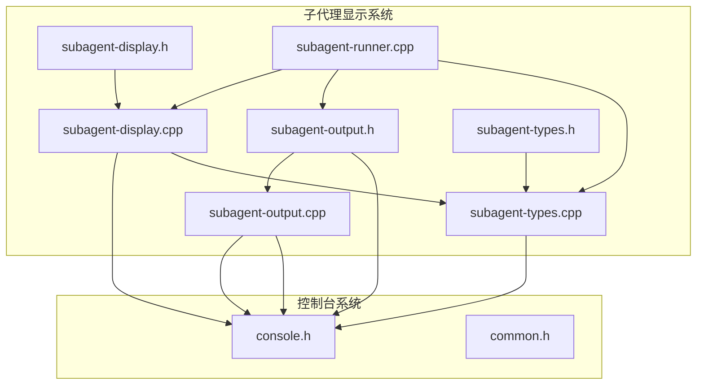
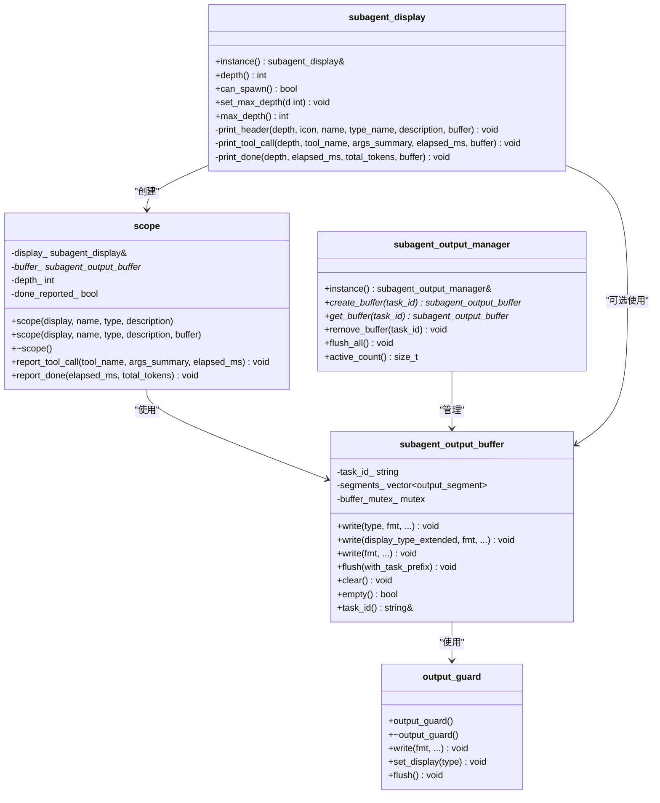
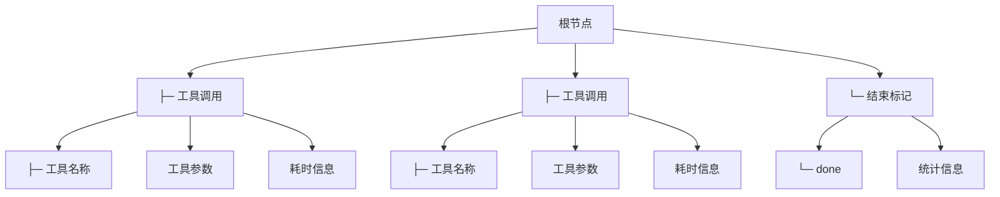
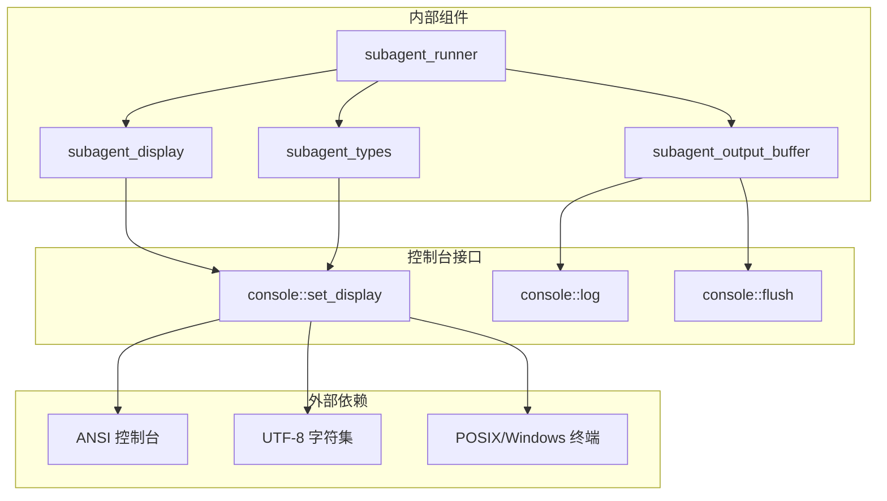

# 子代理显示系统

<cite>
**本文档引用的文件**
- [subagent-display.h](file://agent/subagent/subagent-display.h)
- [subagent-display.cpp](file://agent/subagent/subagent-display.cpp)
- [subagent-output.h](file://agent/subagent/subagent-output.h)
- [subagent-output.cpp](file://agent/subagent/subagent-output.cpp)
- [subagent-types.h](file://agent/subagent/subagent-types.h)
- [subagent-types.cpp](file://agent/subagent/subagent-types.cpp)
- [subagent-runner.cpp](file://agent/subagent/subagent-runner.cpp)
- [console.h](file://third_party/llama.cpp/common/console.h)
- [common.h](file://third_party/llama.cpp/common/common.h)
</cite>

## 目录
1. [简介](#简介)
2. [项目结构](#项目结构)
3. [核心组件](#核心组件)
4. [架构概览](#架构概览)
5. [详细组件分析](#详细组件分析)
6. [依赖关系分析](#依赖关系分析)
7. [性能考虑](#性能考虑)
8. [故障排除指南](#故障排除指南)
9. [结论](#结论)
10. [附录](#附录)

## 简介

子代理显示系统是 llama.cpp-agent 项目中的一个关键组件，负责可视化展示子代理（Subagent）的执行过程。该系统提供了层次化的树形结构显示、实时的状态更新、进度反馈以及用户友好的界面展示功能。

该系统的核心特性包括：
- 嵌套式树形结构显示，支持多层子代理嵌套
- 实时工具调用报告和进度跟踪
- 颜色编码和图标系统
- 同步和异步两种输出模式
- 线程安全的缓冲输出管理
- 可配置的显示深度限制

## 项目结构

子代理显示系统位于 `agent/subagent/` 目录下，主要包含以下核心文件：

**图表来源**
- [subagent-display.h:1-88](file://agent/subagent/subagent-display.h#L1-L88)
- [subagent-output.h:1-107](file://agent/subagent/subagent-output.h#L1-L107)
- [subagent-types.h:1-36](file://agent/subagent/subagent-types.h#L1-L36)

**章节来源**
- [subagent-display.h:1-88](file://agent/subagent/subagent-display.h#L1-L88)
- [subagent-output.h:1-107](file://agent/subagent/subagent-output.h#L1-L107)
- [subagent-types.h:1-36](file://agent/subagent/subagent-types.h#L1-L36)

## 核心组件

子代理显示系统由四个主要组件构成：

### 1. 显示管理器 (subagent_display)
负责管理整个显示系统的生命周期和状态，提供单例访问模式。

### 2. 输出缓冲区 (subagent_output_buffer)
实现线程安全的输出缓冲，支持批量输出和原子刷新。

### 3. 类型配置 (subagent_type_config)
定义不同类型的子代理及其显示属性，包括颜色、图标和工具权限。

### 4. 显示作用域 (scope)
RAII 类，用于管理单个子代理任务的显示生命周期。

**章节来源**
- [subagent-display.h:14-84](file://agent/subagent/subagent-display.h#L14-L84)
- [subagent-output.h:25-55](file://agent/subagent/subagent-output.h#L25-L55)
- [subagent-types.h:15-26](file://agent/subagent/subagent-types.h#L15-L26)

## 架构概览

**图表来源**
- [subagent-display.h:15-84](file://agent/subagent/subagent-display.h#L15-L84)
- [subagent-output.h:27-106](file://agent/subagent/subagent-output.h#L27-L106)

## 详细组件分析

### 显示管理器 (subagent_display)

显示管理器是整个系统的核心控制器，负责：

#### 主要功能
- **单例模式**: 提供全局唯一的显示实例
- **深度管理**: 跟踪当前嵌套深度，防止无限递归
- **输出格式化**: 生成树形结构的显示内容
- **颜色编码**: 使用 ANSI 颜色代码进行视觉区分

#### 树形结构显示
系统使用 UTF-8 字符构建树形结构：

**图表来源**
- [subagent-display.cpp:12-18](file://agent/subagent/subagent-display.cpp#L12-L18)

#### 输出模式
系统支持两种输出模式：

1. **直接模式 (Direct Mode)**: 同步输出到控制台
2. **缓冲模式 (Buffered Mode)**: 异步收集到缓冲区

**章节来源**
- [subagent-display.h:15-84](file://agent/subagent/subagent-display.h#L15-L84)
- [subagent-display.cpp:33-84](file://agent/subagent/subagent-display.cpp#L33-L84)

### 输出缓冲系统

输出缓冲系统确保了多线程环境下的输出一致性：

#### 缓冲区设计
- **线程安全**: 使用互斥锁保护缓冲区访问
- **分段存储**: 将输出内容分解为带样式的片段
- **原子刷新**: 支持整块输出的原子性

#### 显示类型映射
系统支持多种显示类型，通过 `display_type` 枚举定义：

| 类型 | 颜色 | 用途 |
|------|------|------|
| DISPLAY_TYPE_RESET | 默认 | 重置所有样式 |
| DISPLAY_TYPE_INFO | 紫色 | 子代理名称和重要信息 |
| DISPLAY_TYPE_PROMPT | 黄色 | 用户输入提示 |
| DISPLAY_TYPE_REASONING | 灰色 | 推理过程和说明 |
| DISPLAY_TYPE_USER_INPUT | 深绿色粗体 | 用户实际输入 |
| DISPLAY_TYPE_ERROR | 红色粗体 | 错误信息 |

**章节来源**
- [subagent-output.h:11-18](file://agent/subagent/subagent-output.h#L11-L18)
- [subagent-output.h:19-23](file://agent/subagent/subagent-output.h#L19-L23)
- [console.h:11-18](file://third_party/llama.cpp/common/console.h#L11-L18)

### 类型配置系统

不同类型子代理具有不同的显示属性：

#### 颜色编码系统
- **EXPLORE**: 靛蓝色闪电图标 ⚡
- **PLAN**: 品红色笔记本图标 📓
- **GENERAL**: 黄色扳手图标 ⚙️
- **BASH**: 绿色桌面电脑图标 💥

#### 工具权限控制
每种类型都有特定的工具白名单：
- **EXPLORE**: read, glob, bash (只读命令)
- **PLAN**: read, glob (仅文件读取)
- **GENERAL**: 所有工具 except task
- **BASH**: 仅 bash 命令

**章节来源**
- [subagent-types.cpp:6-11](file://agent/subagent/subagent-types.cpp#L6-L11)
- [subagent-types.cpp:12-62](file://agent/subagent/subagent-types.cpp#L12-L62)

### 显示作用域 (Scope)

RAII 类确保子代理显示的正确生命周期管理：

#### 生命周期管理
1. **构造**: 增加嵌套深度，显示头部信息
2. **工具调用**: 报告工具执行情况
3. **完成**: 显示统计信息和结束标记
4. **析构**: 自动减少深度，确保资源清理

#### 状态跟踪
- **深度计数**: 防止超过最大嵌套深度
- **完成状态**: 确保即使异常退出也能显示完成信息
- **时间统计**: 记录执行时间和令牌使用量

**章节来源**
- [subagent-display.h:18-47](file://agent/subagent/subagent-display.h#L18-L47)
- [subagent-display.cpp:201-245](file://agent/subagent/subagent-display.cpp#L201-L245)

## 依赖关系分析

**图表来源**
- [subagent-display.cpp:3-4](file://agent/subagent/subagent-display.cpp#L3-L4)
- [subagent-output.cpp:24-48](file://agent/subagent/subagent-output.cpp#L24-L48)

### 关键依赖关系

1. **控制台系统依赖**: 所有显示功能都依赖于底层控制台接口
2. **类型配置依赖**: 显示外观完全由类型配置决定
3. **线程安全依赖**: 多线程环境下需要互斥锁保护
4. **内存管理依赖**: RAII 模式确保资源正确释放

**章节来源**
- [subagent-display.cpp:1-11](file://agent/subagent/subagent-display.cpp#L1-L11)
- [subagent-output.cpp:1-8](file://agent/subagent/subagent-output.cpp#L1-L8)

## 性能考虑

### 输出性能优化

1. **缓冲输出**: 异步缓冲避免频繁的系统调用
2. **原子刷新**: 整块输出减少竞争条件
3. **颜色缓存**: 只在颜色变化时发送 ANSI 序列
4. **字符串优化**: 预分配缓冲区避免重复分配

### 内存管理

- **RAII 模式**: 自动资源管理，避免内存泄漏
- **智能指针**: 使用 unique_ptr 管理临时对象
- **移动语义**: 减少不必要的字符串复制

### 并发安全性

- **互斥锁**: 保护共享数据结构
- **原子操作**: 嵌套深度使用原子变量
- **无锁设计**: 在可能的情况下避免锁竞争

## 故障排除指南

### 常见问题及解决方案

#### 1. 显示乱码问题
**症状**: 控制台出现乱码或特殊字符
**原因**: 终端不支持 UTF-8 或 ANSI 转义序列
**解决方案**: 
- 检查终端编码设置
- 确认控制台支持 ANSI 颜色
- 在不支持的环境中降级到简单模式

#### 2. 输出错乱问题
**症状**: 多个子代理输出混合在一起
**原因**: 缺少适当的同步机制
**解决方案**:
- 使用 `output_guard` 确保原子输出
- 检查缓冲区刷新时机
- 验证线程安全实现

#### 3. 嵌套深度限制问题
**症状**: 子代理无法创建新的子代理
**原因**: 达到最大嵌套深度限制
**解决方案**:
- 调整 `max_depth` 设置
- 重新设计子代理架构
- 使用扁平化策略

#### 4. 颜色显示异常
**症状**: 颜色不正确或不显示
**原因**: 控制台不支持颜色或配置错误
**解决方案**:
- 检查 `advanced_display` 设置
- 验证 ANSI 颜色代码
- 测试不同终端环境

**章节来源**
- [subagent-display.cpp:171-196](file://agent/subagent/subagent-display.cpp#L171-L196)
- [subagent-output.cpp:12-18](file://agent/subagent/subagent-output.cpp#L12-L18)

## 结论

子代理显示系统是一个设计精良的可视化组件，具有以下特点：

### 技术优势
- **模块化设计**: 清晰的职责分离和接口定义
- **线程安全**: 完善的并发控制机制
- **可扩展性**: 支持新的显示类型和输出模式
- **用户友好**: 直观的树形结构和颜色编码

### 应用场景
- **开发调试**: 实时监控子代理执行状态
- **生产监控**: 进度跟踪和性能分析
- **用户界面**: 提供丰富的执行反馈
- **日志记录**: 结构化的执行历史

### 改进建议
1. **国际化支持**: 添加多语言本地化
2. **样式定制**: 允许用户自定义显示样式
3. **导出功能**: 支持将显示内容导出为文件
4. **交互功能**: 添加用户交互能力

## 附录

### 显示配置选项

| 配置项 | 类型 | 默认值 | 描述 |
|--------|------|--------|------|
| max_depth | int | 0 | 最大嵌套深度限制 |
| advanced_display | bool | true | 是否启用高级显示功能 |
| simple_io | bool | false | 简化输入输出模式 |
| use_color | bool | false | 是否使用颜色编码 |

### 自定义配置方法

1. **修改类型配置**: 在 `subagent-types.cpp` 中添加新类型
2. **调整显示样式**: 修改 `console.cpp` 中的颜色映射
3. **扩展输出格式**: 在 `subagent-output.h` 中添加新的显示类型
4. **定制树形结构**: 修改 `subagent-display.cpp` 中的字符定义

### 国际化支持

系统目前支持：
- UTF-8 字符集
- ANSI 颜色编码
- 多平台终端兼容

未来可以添加：
- 多语言文本支持
- 本地化日期时间格式
- 区域设置感知的数字格式