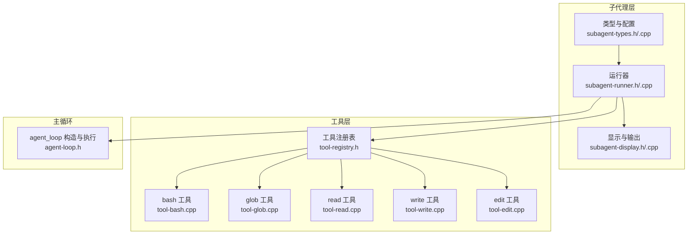
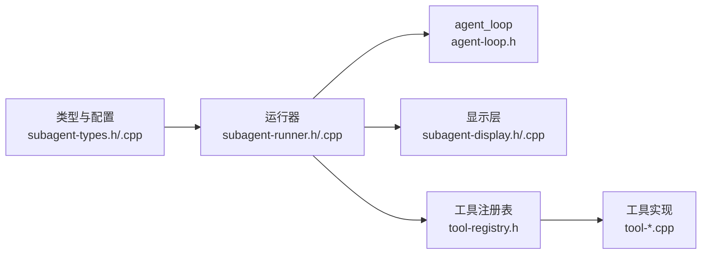

# 子代理类型定义

<cite>
**本文引用的文件**
- [subagent-types.h](file://agent/subagent/subagent-types.h)
- [subagent-types.cpp](file://agent/subagent/subagent-types.cpp)
- [subagent-runner.h](file://agent/subagent/subagent-runner.h)
- [subagent-runner.cpp](file://agent/subagent/subagent-runner.cpp)
- [subagent-display.h](file://agent/subagent/subagent-display.h)
- [subagent-display.cpp](file://agent/subagent/subagent-display.cpp)
- [tool-registry.h](file://agent/tool-registry.h)
- [agent-loop.h](file://agent/agent-loop.h)
- [tool-bash.cpp](file://agent/tools/tool-bash.cpp)
- [tool-read.cpp](file://agent/tools/tool-read.cpp)
- [tool-glob.cpp](file://agent/tools/tool-glob.cpp)
- [tool-write.cpp](file://agent/tools/tool-write.cpp)
- [tool-edit.cpp](file://agent/tools/tool-edit.cpp)
</cite>

## 目录
1. [简介](#简介)
2. [项目结构](#项目结构)
3. [核心组件](#核心组件)
4. [架构总览](#架构总览)
5. [详细组件分析](#详细组件分析)
6. [依赖关系分析](#依赖关系分析)
7. [性能考量](#性能考量)
8. [故障排查指南](#故障排查指南)
9. [结论](#结论)
10. [附录](#附录)

## 简介
本文件面向“子代理类型”（Subagent Type）的完整技术文档，围绕四种子代理类型（EXPLORE、PLAN、GENERAL、BASH）的设计理念、功能特性、工具集限制与执行策略进行深入说明，并系统阐述子代理配置结构体 subagent_type_config 的字段语义、默认值与可定制方式；同时提供接口规范（类型解析、字符串表示）、典型配置示例与最佳实践，以及常见问题的诊断与解决方案。

## 项目结构
子代理能力由 agent/subagent 目录下的类型定义、运行器、显示与输出管理组成，并通过工具注册表与具体工具实现解耦。关键文件如下：
- 类型与配置：subagent-types.h/.cpp
- 运行器：subagent-runner.h/.cpp
- 显示与输出：subagent-display.h/.cpp
- 工具注册与上下文：tool-registry.h
- 主循环与子代理构造：agent-loop.h
- 工具实现（供子代理使用）：tool-read.cpp、tool-glob.cpp、tool-write.cpp、tool-edit.cpp、tool-bash.cpp



图表来源
- [subagent-types.h:1-36](file://agent/subagent/subagent-types.h#L1-L36)
- [subagent-types.cpp:1-99](file://agent/subagent/subagent-types.cpp#L1-L99)
- [subagent-runner.h:1-114](file://agent/subagent/subagent-runner.h#L1-L114)
- [subagent-runner.cpp:1-388](file://agent/subagent/subagent-runner.cpp#L1-L388)
- [subagent-display.h:1-88](file://agent/subagent/subagent-display.h#L1-L88)
- [subagent-display.cpp:1-246](file://agent/subagent/subagent-display.cpp#L1-L246)
- [tool-registry.h:1-103](file://agent/tool-registry.h#L1-L103)
- [agent-loop.h:1-276](file://agent/agent-loop.h#L1-L276)
- [tool-bash.cpp:1-281](file://agent/tools/tool-bash.cpp#L1-L281)
- [tool-glob.cpp:1-181](file://agent/tools/tool-glob.cpp#L1-L181)
- [tool-read.cpp:1-120](file://agent/tools/tool-read.cpp#L1-L120)
- [tool-write.cpp:1-80](file://agent/tools/tool-write.cpp#L1-L80)
- [tool-edit.cpp:1-196](file://agent/tools/tool-edit.cpp#L1-L196)

章节来源
- [subagent-types.h:1-36](file://agent/subagent/subagent-types.h#L1-L36)
- [subagent-types.cpp:1-99](file://agent/subagent/subagent-types.cpp#L1-L99)
- [subagent-runner.h:1-114](file://agent/subagent/subagent-runner.h#L1-L114)
- [subagent-runner.cpp:1-388](file://agent/subagent/subagent-runner.cpp#L1-L388)
- [subagent-display.h:1-88](file://agent/subagent/subagent-display.h#L1-L88)
- [subagent-display.cpp:1-246](file://agent/subagent/subagent-display.cpp#L1-L246)
- [tool-registry.h:1-103](file://agent/tool-registry.h#L1-L103)
- [agent-loop.h:1-276](file://agent/agent-loop.h#L1-L276)
- [tool-bash.cpp:1-281](file://agent/tools/tool-bash.cpp#L1-L281)
- [tool-glob.cpp:1-181](file://agent/tools/tool-glob.cpp#L1-L181)
- [tool-read.cpp:1-120](file://agent/tools/tool-read.cpp#L1-L120)
- [tool-write.cpp:1-80](file://agent/tools/tool-write.cpp#L1-L80)
- [tool-edit.cpp:1-196](file://agent/tools/tool-edit.cpp#L1-L196)

## 核心组件
- 子代理类型枚举：EXPLORE、PLAN、GENERAL、BASH
- 配置结构体：subagent_type_config，包含名称、描述、图标、颜色、允许工具白名单、Bash 前缀模式、是否允许写文件、最大迭代次数
- 运行器：subagent_runner，负责构建受限系统提示、过滤工具、执行 agent_loop、收集统计与结果
- 显示与输出：subagent_display，支持嵌套显示、缓冲输出、工具调用与完成报告
- 工具注册与上下文：tool-registry 提供工具注册、过滤执行、上下文传递；agent-loop 支持子代理构造与权限控制

章节来源
- [subagent-types.h:8-26](file://agent/subagent/subagent-types.h#L8-L26)
- [subagent-types.cpp:12-62](file://agent/subagent/subagent-types.cpp#L12-L62)
- [subagent-runner.h:64-113](file://agent/subagent/subagent-runner.h#L64-L113)
- [subagent-runner.cpp:29-118](file://agent/subagent/subagent-runner.cpp#L29-L118)
- [subagent-display.h:15-84](file://agent/subagent/subagent-display.h#L15-L84)
- [tool-registry.h:58-90](file://agent/tool-registry.h#L58-L90)
- [agent-loop.h:167-275](file://agent/agent-loop.h#L167-L275)

## 架构总览
子代理运行时的关键流程：运行器根据类型配置生成受限系统提示，将父级 agent_config 复制并覆盖迭代上限，结合工具白名单与 Bash 前缀限制，构造子代理 agent_loop 并执行；期间通过回调向显示层汇报工具调用与耗时，最终汇总 token 统计与停止原因。

```mermaid
sequenceDiagram
participant Caller as "调用方"
participant Runner as "subagent_runner"
participant Display as "subagent_display"
participant Loop as "agent_loop"
participant Registry as "tool_registry"
participant Tools as "工具实现"
Caller->>Runner : "run(params)"
Runner->>Runner : "构建受限系统提示"
Runner->>Display : "创建显示作用域"
Runner->>Loop : "构造子代理 agent_loop(受限工具/前缀)"
Loop->>Registry : "过滤工具列表"
Loop->>Tools : "执行工具调用"
Tools-->>Loop : "返回工具结果"
Loop-->>Runner : "返回执行结果与统计"
Runner->>Display : "报告工具调用与完成"
Runner-->>Caller : "返回 subagent_result"
```

图表来源
- [subagent-runner.cpp:133-244](file://agent/subagent/subagent-runner.cpp#L133-L244)
- [subagent-display.cpp:199-245](file://agent/subagent/subagent-display.cpp#L199-L245)
- [agent-loop.h:173-179](file://agent/agent-loop.h#L173-L179)
- [tool-registry.h:78-85](file://agent/tool-registry.h#L78-L85)

## 详细组件分析

### 四种子代理类型设计与策略

- EXPLORE（只读探索）
  - 设计理念：在不修改任何文件的前提下，对代码库进行只读探索与理解
  - 允许工具：read、glob、bash（仅限特定前缀）
  - Bash 前缀限制：ls、cat、head、tail、grep、find、file、wc、git 系列命令、tree、which/type/pwd 等
  - 写文件：禁止
  - 最大迭代：20
  - 适用场景：代码审计、依赖扫描、变更影响评估、快速定位文件与片段
  - 执行策略：优先 glob 定位目标，再用 read 深入查看，必要时用 bash 只读命令辅助

- PLAN（架构与设计规划）
  - 设计理念：基于现有代码结构进行设计与实现路径规划
  - 允许工具：read、glob
  - Bash：不允许
  - 写文件：禁止
  - 最大迭代：15
  - 适用场景：需求拆分、模块边界设计、风险识别、方案对比
  - 执行策略：先 glob/ read 理解现状，再输出结构化计划

- GENERAL（通用任务执行）
  - 设计理念：多步骤任务的通用执行代理，具备更强的文件操作能力
  - 允许工具：read、glob、write、edit、bash
  - Bash：不限制前缀
  - 写文件：允许
  - 最大迭代：30
  - 适用场景：小步快跑的任务执行、文件创建/编辑、脚本执行
  - 执行策略：先 read/glob 获取上下文，再 write/edit 修改文件，最后 bash 辅助验证或构建

- BASH（命令执行）
  - 设计理念：专注于 shell 命令执行，适合构建、测试、部署等场景
  - 允许工具：bash
  - Bash：不限制前缀
  - 写文件：禁止
  - 最大迭代：10
  - 适用场景：CI/CD 步骤、系统运维、环境探测
  - 执行策略：严格按命令超时与输出截断策略执行，避免长时间阻塞

章节来源
- [subagent-types.cpp:12-62](file://agent/subagent/subagent-types.cpp#L12-L62)
- [subagent-runner.cpp:61-116](file://agent/subagent/subagent-runner.cpp#L61-L116)

### 配置结构体 subagent_type_config 字段说明
- name：类型名称（用于显示与日志）
- description：类型描述（用于系统提示）
- icon：Unicode 图标（用于可视化展示）
- color_code：ANSI 颜色码（用于终端高亮）
- allowed_tools：工具白名单（集合）
- bash_patterns：Bash 前缀模式列表（仅 EXPLORE 生效）
- can_write_files：是否允许写文件
- max_iterations：最大迭代次数（决定模型推理上限）

默认值与来源：
- 默认值来自内部常量映射（SUBAGENT_CONFIGS），见各字段在配置表中的初始化位置
- bash_patterns 仅 EXPLORE 类型生效，其他类型为空

自定义配置方法：
- 当前实现为静态配置表，不提供运行时动态扩展接口
- 若需定制行为，可在上层封装中：
  - 覆盖系统提示（通过传入自定义系统提示给子代理构造）
  - 限制工具集合（通过 allowed_tools 与 bash_patterns 参数）
  - 调整最大迭代次数（通过复制父配置并覆盖 max_iterations）

章节来源
- [subagent-types.h:16-26](file://agent/subagent/subagent-types.h#L16-L26)
- [subagent-types.cpp:12-62](file://agent/subagent/subagent-types.cpp#L12-L62)
- [subagent-runner.cpp:164-169](file://agent/subagent/subagent-runner.cpp#L164-L169)

### 接口规范与字符串表示
- 解析子代理类型：parse_subagent_type(const std::string&)
  - 输入："explore"、"plan"、"general"、"bash"
  - 输出：对应枚举值；未知字符串抛出异常
- 类型名称：subagent_type_name(subagent_type)
  - 返回值："explore"、"plan"、"general"、"bash" 或 "unknown"
- 配置查询：get_subagent_config(subagent_type)
  - 返回对应类型的配置引用

章节来源
- [subagent-types.h:29-35](file://agent/subagent/subagent-types.h#L29-L35)
- [subagent-types.cpp:72-99](file://agent/subagent/subagent-types.cpp#L72-L99)

### 工具集与限制机制
- 工具白名单：通过 agent_loop 的 allowed_tools 参数生效，未在白名单内的工具不可用
- Bash 前缀限制：仅 EXPLORE 类型生效，通过 bash_patterns 限定命令前缀；其他类型 bash_patterns 为空
- 写文件控制：由 can_write_files 控制；若为 false，则 write/edit 工具会被拒绝
- 权限与安全：工具执行前会经过权限检查（敏感文件保护），失败时直接返回错误

章节来源
- [agent-loop.h:173-179](file://agent/agent-loop.h#L173-L179)
- [tool-registry.h:82-85](file://agent/tool-registry.h#L82-L85)
- [tool-read.cpp:42-45](file://agent/tools/tool-read.cpp#L42-L45)
- [tool-write.cpp:24-27](file://agent/tools/tool-write.cpp#L24-L27)
- [tool-edit.cpp:98-103](file://agent/tools/tool-edit.cpp#L98-L103)

### 运行器与显示层协作
- 运行器职责：
  - 构建受限系统提示（含工具清单与行为指导）
  - 复制父配置并覆盖 max_iterations、关闭技能与 agents.md 注入
  - 创建子代理 agent_loop（传入 allowed_tools、bash_patterns、自定义系统提示）
  - 收集 token 统计、迭代次数与停止原因
  - 通过回调向显示层报告工具调用与完成
- 显示层职责：
  - 嵌套树形输出（支持缓冲与直接输出）
  - 报告工具调用耗时与结果摘要
  - 结束时输出完成信息与统计

```mermaid
classDiagram
class subagent_runner {
+run(params) subagent_result
+start_background(params) string
+is_complete(task_id) bool
+get_result(task_id) subagent_result
+cancel(task_id) void
+get_active_tasks() vector<string>
+cleanup_completed() void
-build_system_prompt(type) string
-run_internal(params, buffer) subagent_result
}
class subagent_display {
+instance() subagent_display&
+can_spawn() bool
+set_max_depth(d) void
+depth() int
class scope {
+report_tool_call(name, args, ms) void
+report_done(ms, tokens) void
}
}
class agent_loop {
+run(prompt) agent_loop_result
+get_stats() session_stats
}
subagent_runner --> agent_loop : "构造并执行"
subagent_runner --> subagent_display : "回调/显示"
```

图表来源
- [subagent-runner.h:64-113](file://agent/subagent/subagent-runner.h#L64-L113)
- [subagent-runner.cpp:133-244](file://agent/subagent/subagent-runner.cpp#L133-L244)
- [subagent-display.h:15-84](file://agent/subagent/subagent-display.h#L15-L84)
- [agent-loop.h:167-275](file://agent/agent-loop.h#L167-L275)

章节来源
- [subagent-runner.cpp:133-244](file://agent/subagent/subagent-runner.cpp#L133-L244)
- [subagent-display.cpp:199-245](file://agent/subagent/subagent-display.cpp#L199-L245)

### 典型配置示例与最佳实践
- 使用 EXPLORE 快速定位问题
  - 场景：需要在不改动代码的情况下，列出可疑目录、查看关键文件、执行只读命令
  - 建议：使用 glob 定位文件，read 查看内容，bash 仅使用允许的前缀命令
- 使用 PLAN 输出结构化方案
  - 场景：设计新模块或重构路径
  - 建议：先 glob/ read 了解现状，再输出包含“概述、涉及文件、步骤、风险”的结构化计划
- 使用 GENERAL 执行多步任务
  - 场景：创建新文件、修改现有文件、执行脚本验证
  - 建议：write/edit 与 bash 协作，先 read/glob 获取上下文，再精确修改
- 使用 BASH 执行系统命令
  - 场景：构建、测试、部署
  - 建议：设置合理超时，关注输出截断与退出码

最佳实践要点
- 合理设置 max_iterations，避免长耗时推理
- 在 GENERAL 中优先 read/glob 再 write/edit，降低误改风险
- EXPLORE 严格遵守只读约束，避免执行破坏性命令
- 使用工具回调记录工具调用与耗时，便于审计与优化

章节来源
- [subagent-types.cpp:12-62](file://agent/subagent/subagent-types.cpp#L12-L62)
- [subagent-runner.cpp:61-116](file://agent/subagent/subagent-runner.cpp#L61-L116)

## 依赖关系分析
- 子代理类型与配置：类型枚举与配置表相互独立，通过 get_subagent_config 关联
- 运行器依赖：工具注册表（过滤工具）、主循环（构造子代理）、显示层（可视化输出）
- 工具实现：read/glob/write/edit/bash 各自独立，受白名单与前缀限制约束
- 上下文传递：tool_context 携带工作目录、中断标志、超时、子代理深度等信息



图表来源
- [subagent-types.h:1-36](file://agent/subagent/subagent-types.h#L1-L36)
- [subagent-runner.h:1-114](file://agent/subagent/subagent-runner.h#L1-L114)
- [agent-loop.h:1-276](file://agent/agent-loop.h#L1-L276)
- [tool-registry.h:1-103](file://agent/tool-registry.h#L1-L103)
- [tool-bash.cpp:1-281](file://agent/tools/tool-bash.cpp#L1-L281)
- [tool-glob.cpp:1-181](file://agent/tools/tool-glob.cpp#L1-L181)
- [tool-read.cpp:1-120](file://agent/tools/tool-read.cpp#L1-L120)
- [tool-write.cpp:1-80](file://agent/tools/tool-write.cpp#L1-L80)
- [tool-edit.cpp:1-196](file://agent/tools/tool-edit.cpp#L1-L196)

章节来源
- [subagent-types.cpp:12-62](file://agent/subagent/subagent-types.cpp#L12-L62)
- [subagent-runner.cpp:133-244](file://agent/subagent/subagent-runner.cpp#L133-L244)
- [tool-registry.h:58-90](file://agent/tool-registry.h#L58-L90)

## 性能考量
- 迭代上限：不同类型的最大迭代不同，直接影响 token 消耗与响应时间
- 工具回调与显示：工具调用与完成报告会带来额外开销，建议在后台模式下使用缓冲输出
- Bash 输出截断：工具侧对输出长度与行数有限制，避免过长输出导致性能下降
- KV 缓存复用：运行器通过共享基础系统提示前缀，提升缓存命中率，减少重复计算

章节来源
- [subagent-runner.cpp:34-43](file://agent/subagent/subagent-runner.cpp#L34-L43)
- [tool-bash.cpp:25-48](file://agent/tools/tool-bash.cpp#L25-L48)

## 故障排查指南
- 无法找到工具
  - 检查 allowed_tools 是否包含所需工具名
  - 确认工具已注册（工具实现文件包含 REGISTER_TOOL 宏）
- Bash 命令被拒绝
  - EXPLORE 模式下仅允许 bash_patterns 列表中的命令前缀
  - 其他类型 bash_patterns 为空，可执行任意 bash 命令
- 写文件失败
  - 检查 can_write_files 与敏感文件检测逻辑
  - 确认目标路径存在且有写权限
- 超时或输出截断
  - 调整工具超时参数或减少一次性输出
  - 对于 bash，注意输出截断与退出码
- 子代理未结束
  - 检查 is_complete/get_result/cancel 的调用时机
  - 确保在后台模式下正确 flush 缓冲并清理任务

章节来源
- [tool-registry.h:62-85](file://agent/tool-registry.h#L62-L85)
- [tool-read.cpp:42-45](file://agent/tools/tool-read.cpp#L42-L45)
- [tool-write.cpp:24-27](file://agent/tools/tool-write.cpp#L24-L27)
- [tool-bash.cpp:25-48](file://agent/tools/tool-bash.cpp#L25-L48)
- [subagent-runner.cpp:246-348](file://agent/subagent/subagent-runner.cpp#L246-L348)

## 结论
子代理类型通过“类型 + 配置 + 限制”的组合，实现了在安全性与灵活性之间的平衡。EXPLORE 强调只读探索，PLAN 专注设计规划，GENERAL 支持多步任务，BASH 专精命令执行。借助工具白名单、Bash 前缀限制与写文件开关，系统在保证安全的同时提供了强大的工程化能力。建议在实际使用中结合场景选择合适类型，并遵循最佳实践以获得稳定高效的执行体验。

## 附录

### 子代理类型与工具集对照
- EXPLORE：read、glob、bash（前缀受限）
- PLAN：read、glob
- GENERAL：read、glob、write、edit、bash
- BASH：bash

章节来源
- [subagent-types.cpp:12-62](file://agent/subagent/subagent-types.cpp#L12-L62)