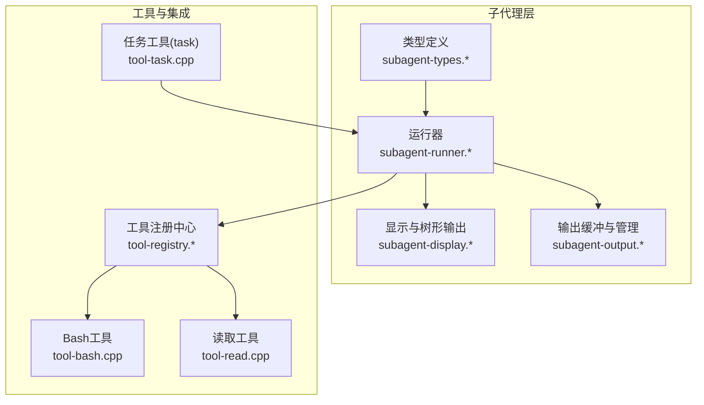
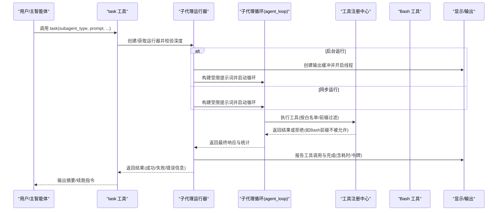
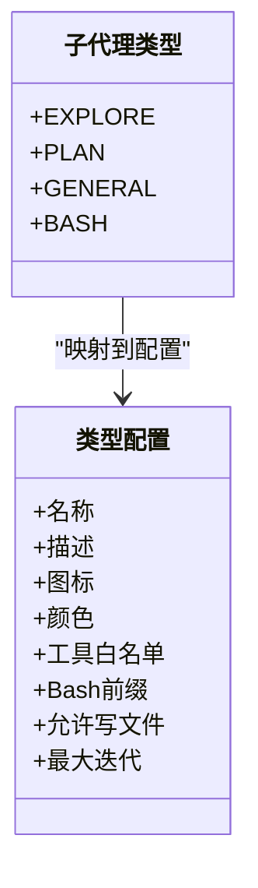
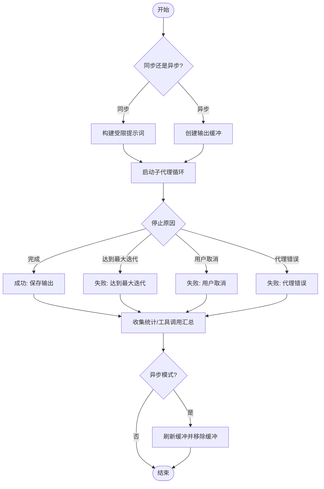
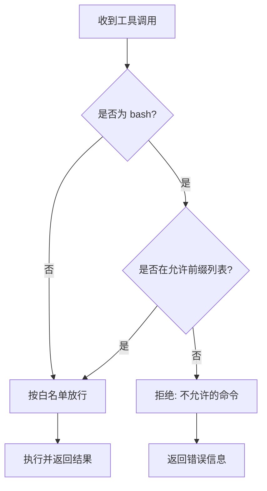
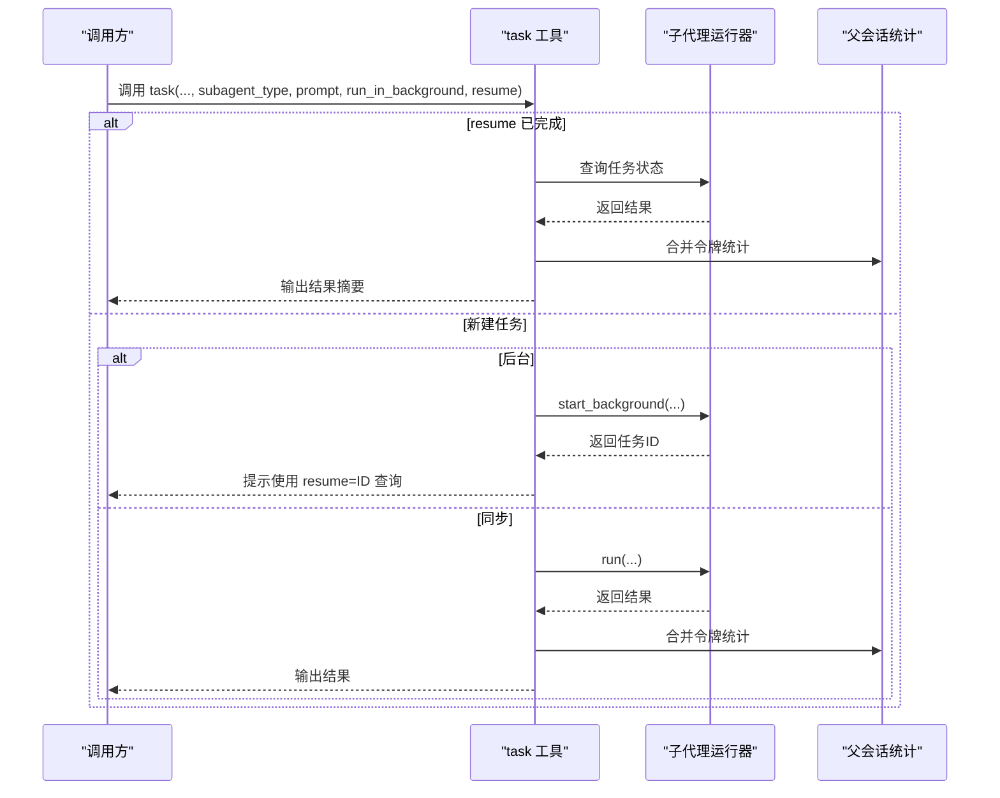
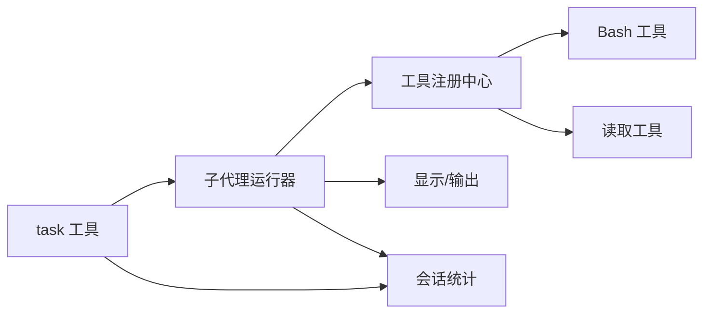

# 子代理系统

<cite>
**本文引用的文件**
- [subagent-types.h](file://agent/subagent/subagent-types.h)
- [subagent-types.cpp](file://agent/subagent/subagent-types.cpp)
- [subagent-runner.h](file://agent/subagent/subagent-runner.h)
- [subagent-runner.cpp](file://agent/subagent/subagent-runner.cpp)
- [subagent-display.h](file://agent/subagent/subagent-display.h)
- [subagent-display.cpp](file://agent/subagent/subagent-display.cpp)
- [subagent-output.h](file://agent/subagent/subagent-output.h)
- [subagent-output.cpp](file://agent/subagent/subagent-output.cpp)
- [tool-task.cpp](file://agent/tools/tool-task.cpp)
- [tool-registry.h](file://agent/tool-registry.h)
- [tool-registry.cpp](file://agent/tool-registry.cpp)
- [tool-bash.cpp](file://agent/tools/tool-bash.cpp)
- [tool-read.cpp](file://agent/tools/tool-read.cpp)
</cite>

## 目录
1. [简介](#简介)
2. [项目结构](#项目结构)
3. [核心组件](#核心组件)
4. [架构总览](#架构总览)
5. [详细组件分析](#详细组件分析)
6. [依赖关系分析](#依赖关系分析)
7. [性能考量](#性能考量)
8. [故障排查指南](#故障排查指南)
9. [结论](#结论)
10. [附录](#附录)

## 简介
本文件面向“子代理系统”的使用者与维护者，系统性阐述子代理类型定义、执行策略配置、任务分解机制、性能优化与安全控制等核心能力，并给出不同子代理类型的适用场景、配置示例、接口规范、性能指标与调试方法。通过分层讲解与图示，帮助读者快速掌握如何在主智能体中以受限工具集、受控迭代次数与可视化输出的方式，安全高效地委派复杂任务。

## 项目结构
子代理系统位于 agent/subagent 目录，围绕“类型定义、运行器、显示与输出缓冲、任务编排”四个维度构建；同时与工具注册中心、具体工具实现以及主智能体循环紧密协作。



图表来源
- [subagent-types.h:1-36](file://agent/subagent/subagent-types.h#L1-L36)
- [subagent-runner.h:1-114](file://agent/subagent/subagent-runner.h#L1-L114)
- [subagent-display.h:1-88](file://agent/subagent/subagent-display.h#L1-L88)
- [subagent-output.h:1-107](file://agent/subagent/subagent-output.h#L1-L107)
- [tool-registry.h:1-103](file://agent/tool-registry.h#L1-L103)
- [tool-task.cpp:72-217](file://agent/tools/tool-task.cpp#L72-L217)
- [tool-bash.cpp:50-200](file://agent/tools/tool-bash.cpp#L50-L200)
- [tool-read.cpp:17-120](file://agent/tools/tool-read.cpp#L17-L120)

章节来源
- [subagent-types.h:1-36](file://agent/subagent/subagent-types.h#L1-L36)
- [subagent-runner.h:1-114](file://agent/subagent/subagent-runner.h#L1-L114)
- [subagent-display.h:1-88](file://agent/subagent/subagent-display.h#L1-L88)
- [subagent-output.h:1-107](file://agent/subagent/subagent-output.h#L1-L107)
- [tool-registry.h:1-103](file://agent/tool-registry.h#L1-L103)
- [tool-task.cpp:72-217](file://agent/tools/tool-task.cpp#L72-L217)
- [tool-bash.cpp:50-200](file://agent/tools/tool-bash.cpp#L50-L200)
- [tool-read.cpp:17-120](file://agent/tools/tool-read.cpp#L17-L120)

## 核心组件
- 类型与配置：定义四类子代理类型及其工具白名单、最大迭代次数、是否允许写文件、Bash前缀限制等。
- 运行器：负责构建受限系统提示词、启动同步或异步子代理任务、统计令牌用量、报告工具调用与完成状态。
- 显示与输出：提供树形缩进输出、彩色显示、工具调用时间统计、后台任务输出缓冲与原子刷新。
- 工具与过滤：通过工具注册中心与 Bash 模式匹配，确保 EXPLORE 类型仅允许只读命令，其他类型按白名单放行。
- 任务编排：task 工具作为入口，解析参数、检查深度限制、支持前台同步与后台异步两种模式，并可续跑已完成任务。

章节来源
- [subagent-types.cpp:12-62](file://agent/subagent/subagent-types.cpp#L12-L62)
- [subagent-runner.cpp:29-118](file://agent/subagent/subagent-runner.cpp#L29-L118)
- [subagent-display.cpp:38-197](file://agent/subagent/subagent-display.cpp#L38-L197)
- [subagent-output.cpp:50-155](file://agent/subagent/subagent-output.cpp#L50-L155)
- [tool-registry.cpp:62-85](file://agent/tool-registry.cpp#L62-L85)
- [tool-task.cpp:72-217](file://agent/tools/tool-task.cpp#L72-L217)

## 架构总览
下图展示从 task 工具到子代理运行器、工具过滤与显示输出的整体流程。



图表来源
- [tool-task.cpp:72-217](file://agent/tools/tool-task.cpp#L72-L217)
- [subagent-runner.cpp:133-244](file://agent/subagent/subagent-runner.cpp#L133-L244)
- [tool-registry.cpp:62-85](file://agent/tool-registry.cpp#L62-L85)
- [tool-bash.cpp:50-200](file://agent/tools/tool-bash.cpp#L50-L200)
- [subagent-display.cpp:199-246](file://agent/subagent/subagent-display.cpp#L199-L246)

## 详细组件分析

### 子代理类型与配置
- 类型定义：EXPLORE（只读探索）、PLAN（架构规划）、GENERAL（通用多步任务）、BASH（仅限命令执行）。
- 配置字段：名称、描述、图标、颜色、工具白名单、Bash前缀列表、是否允许写文件、最大迭代次数。
- 默认行为：EXPLORE 仅允许特定只读命令前缀；PLAN 仅允许读取与枚举；GENERAL 放行除 task 外常用工具；BASH 仅 bash。



图表来源
- [subagent-types.h:8-26](file://agent/subagent/subagent-types.h#L8-L26)
- [subagent-types.cpp:12-62](file://agent/subagent/subagent-types.cpp#L12-L62)

章节来源
- [subagent-types.h:8-36](file://agent/subagent/subagent-types.h#L8-L36)
- [subagent-types.cpp:12-62](file://agent/subagent/subagent-types.cpp#L12-L62)

### 子代理运行器与任务生命周期
- 同步运行：直接输出到控制台，无缓冲。
- 异步运行：创建输出缓冲，后台线程执行，完成后刷新缓冲并存储结果。
- 任务管理：生成唯一任务ID、跟踪完成状态、取消标记、清理已完成任务。
- 统计与报告：记录输入/输出/缓存令牌数、迭代次数、工具调用汇总、耗时与令牌格式化输出。



图表来源
- [subagent-runner.cpp:133-244](file://agent/subagent/subagent-runner.cpp#L133-L244)
- [subagent-runner.cpp:246-348](file://agent/subagent/subagent-runner.cpp#L246-L348)

章节来源
- [subagent-runner.h:24-113](file://agent/subagent/subagent-runner.h#L24-L113)
- [subagent-runner.cpp:133-244](file://agent/subagent/subagent-runner.cpp#L133-L244)
- [subagent-runner.cpp:246-348](file://agent/subagent/subagent-runner.cpp#L246-L348)

### 可视化与输出缓冲
- 树形缩进：根据嵌套深度绘制分支字符，清晰展示子代理层级。
- 彩色显示：区分子代理标题、推理文本、信息内容等。
- 输出缓冲：后台任务将输出分段缓冲，统一原子刷新，支持任务ID前缀。
- 输出守卫：保证多片段输出的原子性，避免交错。

```mermaid
classDiagram
class 显示管理 {
+深度
+最大深度
+打印头部/工具调用/完成
}
class 作用域(scope) {
+构造/析构
+报告工具调用
+报告完成
}
class 输出缓冲 {
+写入(带/不带类型)
+刷新/清空/判空
+任务ID
}
class 输出管理器 {
+创建/获取/移除缓冲
+刷新全部/统计活跃数
}
class 输出守卫 {
+写入/设置类型/刷新
}
显示管理 --> 作用域 : "创建作用域"
作用域 --> 输出缓冲 : "后台模式使用"
输出管理器 --> 输出缓冲 : "管理多个缓冲"
输出缓冲 --> 输出守卫 : "原子刷新"
```

图表来源
- [subagent-display.h:14-84](file://agent/subagent/subagent-display.h#L14-L84)
- [subagent-display.cpp:38-197](file://agent/subagent/subagent-display.cpp#L38-L197)
- [subagent-output.h:26-107](file://agent/subagent/subagent-output.h#L26-L107)
- [subagent-output.cpp:50-155](file://agent/subagent/subagent-output.cpp#L50-L155)

章节来源
- [subagent-display.h:14-84](file://agent/subagent/subagent-display.h#L14-L84)
- [subagent-display.cpp:38-197](file://agent/subagent/subagent-display.cpp#L38-L197)
- [subagent-output.h:26-107](file://agent/subagent/subagent-output.h#L26-L107)
- [subagent-output.cpp:50-155](file://agent/subagent/subagent-output.cpp#L50-L155)

### 工具过滤与安全控制
- EXPLORE 专用：Bash 前缀白名单严格限制，仅允许只读命令；若命令包含非允许前缀则拒绝执行。
- 其他类型：按类型配置的工具白名单放行；未在白名单中的工具会被注册中心拒绝。
- 中断与超时：工具执行过程中尊重中断标志与超时设置，保障交互体验与资源控制。



图表来源
- [tool-registry.cpp:62-85](file://agent/tool-registry.cpp#L62-L85)
- [tool-bash.cpp:50-200](file://agent/tools/tool-bash.cpp#L50-L200)
- [subagent-types.cpp:20-23](file://agent/subagent/subagent-types.cpp#L20-L23)

章节来源
- [tool-registry.cpp:62-85](file://agent/tool-registry.cpp#L62-L85)
- [tool-bash.cpp:50-200](file://agent/tools/tool-bash.cpp#L50-L200)
- [subagent-types.cpp:20-23](file://agent/subagent/subagent-types.cpp#L20-L23)

### 任务编排与接口规范
- 入口工具：task 工具负责解析参数、检查最大嵌套深度、选择同步/异步模式、处理续跑逻辑。
- 参数约定：subagent_type、prompt、description、run_in_background、resume。
- 结果格式：成功/失败标识、工具调用汇总、最终输出、错误信息、迭代次数与令牌统计。
- 续跑机制：当 resume 指定的任务ID完成时，可直接获取结果并更新父会话统计。



图表来源
- [tool-task.cpp:72-217](file://agent/tools/tool-task.cpp#L72-L217)
- [subagent-runner.h:70-91](file://agent/subagent/subagent-runner.h#L70-L91)

章节来源
- [tool-task.cpp:72-217](file://agent/tools/tool-task.cpp#L72-L217)
- [subagent-runner.h:24-91](file://agent/subagent/subagent-runner.h#L24-L91)

## 依赖关系分析
- 子代理运行器依赖工具注册中心进行工具筛选与执行；同时依赖显示与输出模块进行可视化与缓冲。
- task 工具持有运行器单例，负责参数解析与深度控制；与会话统计共享令牌使用情况。
- Bash 工具与工具注册中心配合，实现 EXPLORE 的只读命令前缀校验。



图表来源
- [tool-task.cpp:72-217](file://agent/tools/tool-task.cpp#L72-L217)
- [subagent-runner.cpp:190-202](file://agent/subagent/subagent-runner.cpp#L190-L202)
- [tool-registry.cpp:62-85](file://agent/tool-registry.cpp#L62-L85)
- [tool-bash.cpp:50-200](file://agent/tools/tool-bash.cpp#L50-L200)

章节来源
- [tool-task.cpp:72-217](file://agent/tools/tool-task.cpp#L72-L217)
- [subagent-runner.cpp:190-202](file://agent/subagent/subagent-runner.cpp#L190-L202)
- [tool-registry.cpp:62-85](file://agent/tool-registry.cpp#L62-L85)
- [tool-bash.cpp:50-200](file://agent/tools/tool-bash.cpp#L50-L200)

## 性能考量
- 提示词前缀复用：子代理系统提示词以父提示词为前缀，利用模型KV缓存提升推理效率。
- 令牌统计：记录输入、输出与缓存令牌，便于成本控制与性能分析。
- 迭代限制：每种类型设定最大迭代次数，避免长尾任务占用资源。
- 输出缓冲与原子刷新：后台任务使用缓冲减少控制台竞争，统一刷新降低I/O开销。
- Bash 超时与中断：为外部进程执行设置超时与中断信号，防止阻塞与资源泄漏。

章节来源
- [subagent-runner.cpp:29-44](file://agent/subagent/subagent-runner.cpp#L29-L44)
- [subagent-runner.cpp:210-216](file://agent/subagent/subagent-runner.cpp#L210-L216)
- [subagent-output.cpp:111-155](file://agent/subagent/subagent-output.cpp#L111-L155)
- [tool-bash.cpp:50-200](file://agent/tools/tool-bash.cpp#L50-L200)

## 故障排查指南
- 无法创建子代理：检查最大嵌套深度配置，确认当前深度未超过限制。
- Bash 命令被拒绝：确认命令前缀是否在 EXPLORE 的允许列表中。
- 后台任务无输出：检查输出缓冲是否已刷新，或使用 resume 查看任务状态。
- 任务长时间运行：查看最大迭代次数与令牌统计，必要时调整类型配置或任务提示。
- 任务取消无效：当前实现依赖共享中断标志，需确保父级循环正确传递中断信号。

章节来源
- [tool-task.cpp:72-82](file://agent/tools/tool-task.cpp#L72-L82)
- [tool-registry.cpp:62-85](file://agent/tool-registry.cpp#L62-L85)
- [subagent-runner.cpp:246-348](file://agent/subagent/subagent-runner.cpp#L246-L348)
- [subagent-output.cpp:111-155](file://agent/subagent/subagent-output.cpp#L111-L155)

## 结论
子代理系统通过“类型化配置 + 工具白名单 + Bash 前缀过滤 + 令牌统计 + 可视化输出”的组合，实现了在主智能体内安全、可控且可观测的任务委派。不同类型的子代理适用于探索、规划、通用任务与命令执行等场景；通过同步/异步模式与续跑机制，兼顾了易用性与可扩展性。建议在生产环境中结合令牌预算、迭代上限与日志输出进行持续优化。

## 附录

### 使用场景与配置模板
- 探索型(explore)：适用于代码库只读扫描、文件定位与变更审计。建议将工作目录设为仓库根，使用 glob 与 read 定位目标文件，Bash 仅用于只读命令。
- 规划型(plan)：适用于设计与实现方案制定。建议聚焦于现有代码结构与约束，输出结构化计划。
- 通用型(general)：适用于多步骤修改、编辑与验证。注意先读取再修改，保留测试与回滚策略。
- Bash 专用(bash)：适用于系统运维与环境诊断。建议配合超时与最小权限原则。

配置模板（参数说明）
- subagent_type：选择 explore/plan/general/bash
- prompt：子代理需要执行的具体任务描述
- description：简短描述，用于显示
- run_in_background：是否后台运行（默认 false）
- resume：续跑已完成任务的ID（可选）

章节来源
- [tool-task.cpp:84-89](file://agent/tools/tool-task.cpp#L84-L89)
- [subagent-types.cpp:12-62](file://agent/subagent/subagent-types.cpp#L12-L62)

### 接口规范与性能指标
- 接口：task 工具提供统一入口；子代理运行器提供同步/异步运行与任务管理。
- 指标：输入/输出/缓存令牌数、迭代次数、工具调用耗时与汇总、完成状态与错误信息。
- 显示：树形缩进、彩色标签、工具调用时间、完成统计（耗时/令牌）。

章节来源
- [tool-task.cpp:184-207](file://agent/tools/tool-task.cpp#L184-L207)
- [subagent-runner.cpp:31-43](file://agent/subagent/subagent-runner.cpp#L31-L43)
- [subagent-display.cpp:135-197](file://agent/subagent/subagent-display.cpp#L135-L197)