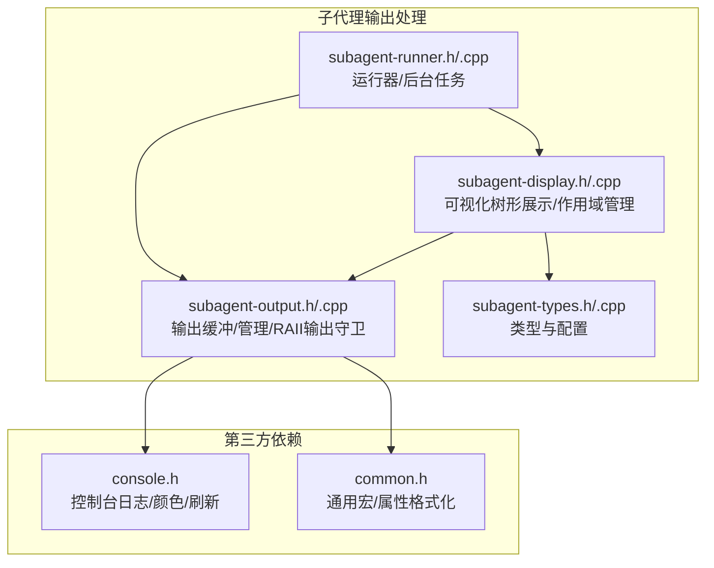
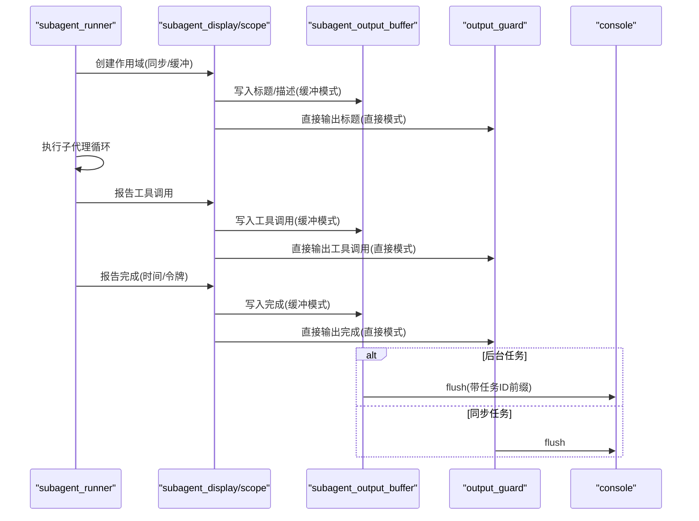
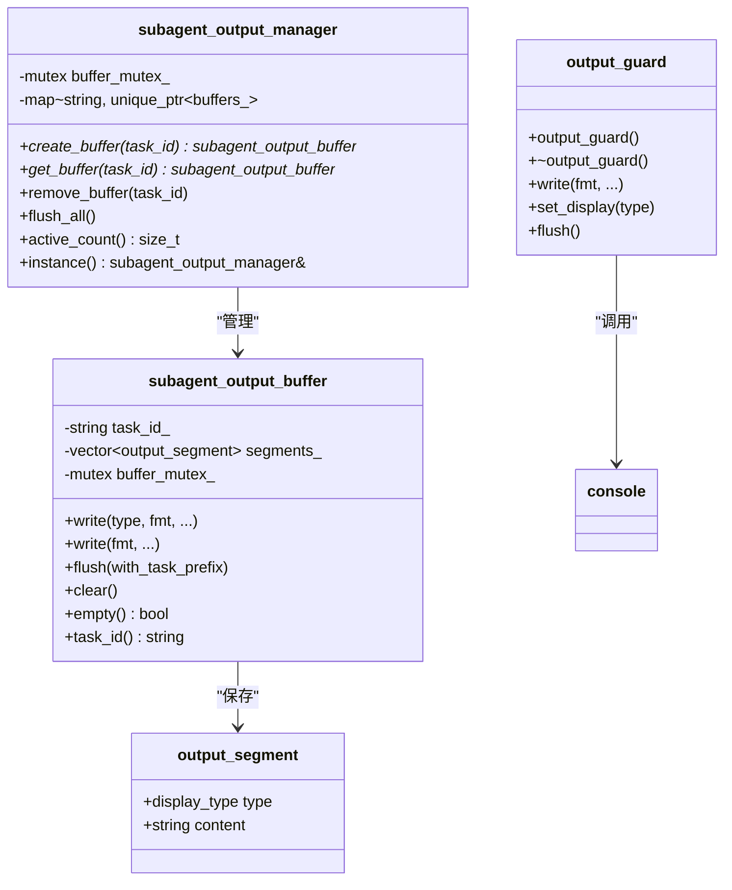
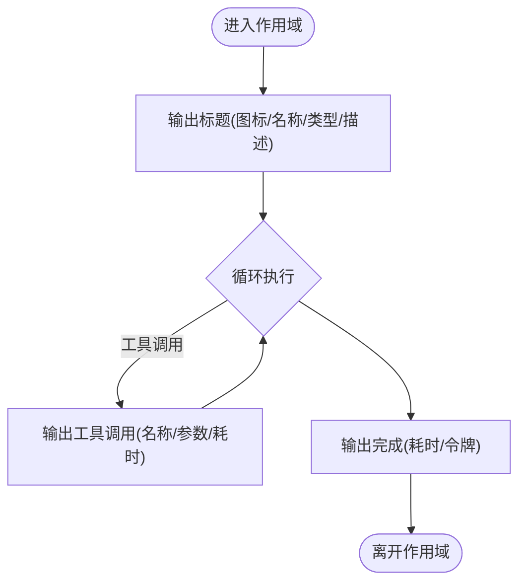
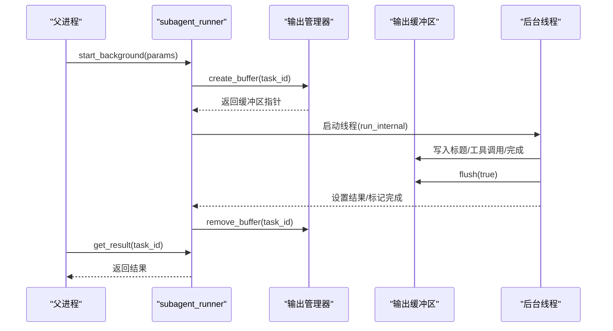
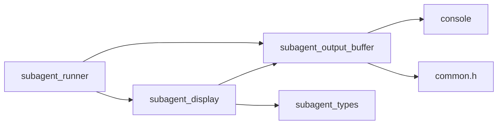

# 子代理输出处理

<cite>
**本文引用的文件**
- [subagent-output.h](file://agent/subagent/subagent-output.h)
- [subagent-output.cpp](file://agent/subagent/subagent-output.cpp)
- [subagent-display.h](file://agent/subagent/subagent-display.h)
- [subagent-display.cpp](file://agent/subagent/subagent-display.cpp)
- [subagent-types.h](file://agent/subagent/subagent-types.h)
- [subagent-types.cpp](file://agent/subagent/subagent-types.cpp)
- [subagent-runner.h](file://agent/subagent/subagent-runner.h)
- [subagent-runner.cpp](file://agent/subagent/subagent-runner.cpp)
- [console.h](file://third_party/llama.cpp/common/console.h)
- [common.h](file://third_party/llama.cpp/common/common.h)
</cite>

## 目录
1. [简介](#简介)
2. [项目结构](#项目结构)
3. [核心组件](#核心组件)
4. [架构总览](#架构总览)
5. [详细组件分析](#详细组件分析)
6. [依赖关系分析](#依赖关系分析)
7. [性能考虑](#性能考虑)
8. [故障排查指南](#故障排查指南)
9. [结论](#结论)
10. [附录](#附录)

## 简介
本技术文档聚焦于“子代理输出处理”模块，系统性阐述子代理在执行过程中如何进行输出格式化、缓冲与刷新、显示控制以及结果聚合。文档覆盖以下关键点：
- 输出缓冲与原子刷新：通过缓冲区收集输出片段并在合适时机一次性刷新到控制台，避免并发输出交错。
- 显示类型与颜色：基于统一的显示类型枚举，结合扩展类型映射，实现不同语义（如子代理信息、推理文本）的颜色与样式区分。
- 可视化树形展示：以树形结构展示子代理的嵌套调用、工具调用与完成状态，支持直接输出与缓冲输出两种模式。
- 后台任务与输出管理：后台子代理任务通过输出缓冲管理器集中管理，确保输出顺序与一致性。
- 错误处理与异常：在后台运行中捕获异常并将其转化为可读的错误信息，同时保证缓冲内容最终刷新。
- 性能与内存：缓冲区按需分配与释放，锁粒度控制在必要范围内，避免阻塞主线程。

## 项目结构
子代理输出处理相关代码位于 agent/subagent 目录，主要由以下文件组成：
- 输出缓冲与管理：subagent-output.h/.cpp
- 可视化显示与树形结构：subagent-display.h/.cpp
- 类型定义与配置：subagent-types.h/.cpp
- 运行器与后台任务：subagent-runner.h/.cpp
- 控制台接口：console.h（来自第三方 llamacpp）
- 通用工具与宏：common.h（来自第三方 llamacpp）

**图表来源**
- [subagent-output.h:1-107](file://agent/subagent/subagent-output.h#L1-L107)
- [subagent-output.cpp:1-207](file://agent/subagent/subagent-output.cpp#L1-L207)
- [subagent-display.h:1-88](file://agent/subagent/subagent-display.h#L1-L88)
- [subagent-display.cpp:1-246](file://agent/subagent/subagent-display.cpp#L1-L246)
- [subagent-types.h:1-36](file://agent/subagent/subagent-types.h#L1-L36)
- [subagent-types.cpp:1-99](file://agent/subagent/subagent-types.cpp#L1-L99)
- [subagent-runner.h:1-114](file://agent/subagent/subagent-runner.h#L1-L114)
- [subagent-runner.cpp:1-388](file://agent/subagent/subagent-runner.cpp#L1-L388)
- [console.h:1-47](file://third_party/llama.cpp/common/console.h#L1-L47)
- [common.h:695-703](file://third_party/llama.cpp/common/common.h#L695-L703)

**章节来源**
- [subagent-output.h:1-107](file://agent/subagent/subagent-output.h#L1-L107)
- [subagent-output.cpp:1-207](file://agent/subagent/subagent-output.cpp#L1-L207)
- [subagent-display.h:1-88](file://agent/subagent/subagent-display.h#L1-L88)
- [subagent-display.cpp:1-246](file://agent/subagent/subagent-display.cpp#L1-L246)
- [subagent-types.h:1-36](file://agent/subagent/subagent-types.h#L1-L36)
- [subagent-types.cpp:1-99](file://agent/subagent/subagent-types.cpp#L1-L99)
- [subagent-runner.h:1-114](file://agent/subagent/subagent-runner.h#L1-L114)
- [subagent-runner.cpp:1-388](file://agent/subagent/subagent-runner.cpp#L1-L388)
- [console.h:1-47](file://third_party/llama.cpp/common/console.h#L1-L47)
- [common.h:695-703](file://third_party/llama.cpp/common/common.h#L695-L703)

## 核心组件
- 输出缓冲区 subagent_output_buffer
  - 职责：收集带显示类型的输出片段；线程安全地写入；在刷新时按行前缀与显示类型逐字符输出。
  - 关键能力：格式化字符串生成、显示类型映射、任务ID短名前缀、逐字符刷新与换行检测。
- 输出管理器 subagent_output_manager
  - 职责：单例管理所有活动的输出缓冲区；创建/获取/移除缓冲区；统一刷新与计数。
- RAII 输出守卫 output_guard
  - 职责：持有全局控制台互斥锁，在构造时锁定，在析构时解锁；提供格式化写入与显示类型切换。
- 可视化显示 subagent_display 与作用域 scope
  - 职责：绘制树形结构（含分支字符）、输出标题/工具调用/完成信息；支持直接输出与缓冲输出两种模式；维护嵌套深度与最大深度限制。
- 类型与配置 subagent_types
  - 职责：定义子代理类型、图标、颜色、允许工具集、只读 bash 前缀集合、最大迭代次数等；提供解析与名称查询。
- 运行器 subagent_runner
  - 职责：同步/异步运行子代理；构建受限工具集与系统提示；回调工具调用并聚合统计；后台任务生命周期管理与结果返回。

**章节来源**
- [subagent-output.h:25-107](file://agent/subagent/subagent-output.h#L25-L107)
- [subagent-output.cpp:50-207](file://agent/subagent/subagent-output.cpp#L50-L207)
- [subagent-display.h:14-88](file://agent/subagent/subagent-display.h#L14-L88)
- [subagent-display.cpp:33-246](file://agent/subagent/subagent-display.cpp#L33-L246)
- [subagent-types.h:7-36](file://agent/subagent/subagent-types.h#L7-L36)
- [subagent-types.cpp:12-99](file://agent/subagent/subagent-types.cpp#L12-L99)
- [subagent-runner.h:62-114](file://agent/subagent/subagent-runner.h#L62-L114)
- [subagent-runner.cpp:22-388](file://agent/subagent/subagent-runner.cpp#L22-L388)

## 架构总览
子代理输出处理的整体流程如下：
- 运行器启动子代理，根据是否后台选择直接输出或缓冲输出。
- 可视化显示负责输出树形结构标题、工具调用与完成信息。
- 输出缓冲区收集片段并按需刷新；后台任务在结束前强制刷新缓冲。
- 控制台接口负责实际的终端写入、颜色设置与刷新。

**图表来源**
- [subagent-runner.cpp:133-244](file://agent/subagent/subagent-runner.cpp#L133-L244)
- [subagent-display.cpp:38-197](file://agent/subagent/subagent-display.cpp#L38-L197)
- [subagent-output.cpp:111-155](file://agent/subagent/subagent-output.cpp#L111-L155)
- [console.h:20-46](file://third_party/llama.cpp/common/console.h#L20-L46)

**章节来源**
- [subagent-runner.cpp:133-244](file://agent/subagent/subagent-runner.cpp#L133-L244)
- [subagent-display.cpp:38-197](file://agent/subagent/subagent-display.cpp#L38-L197)
- [subagent-output.cpp:111-155](file://agent/subagent/subagent-output.cpp#L111-L155)
- [console.h:20-46](file://third_party/llama.cpp/common/console.h#L20-L46)

## 详细组件分析

### 组件一：输出缓冲与管理（subagent_output_buffer 与 subagent_output_manager）
- 数据结构
  - 输出片段 output_segment：包含显示类型与内容字符串。
  - 缓冲区 segments_：按顺序保存片段，保证输出顺序。
  - 互斥量 buffer_mutex_：保护缓冲区的并发访问。
- 关键流程
  - 写入：格式化变参字符串，推入片段；扩展类型会映射为标准显示类型。
  - 刷新：加锁后遍历片段，逐字符输出；遇到换行符重置行首标记；支持任务ID短名前缀。
  - 清空与检查：清空缓冲或判断是否为空。
  - 单例管理器：创建/获取/删除缓冲区；统一刷新与统计活跃数量。
- 并发与原子性
  - 写入与刷新均使用锁保护；输出守卫在直接模式下持有全局控制台互斥锁，确保多部分输出的原子性。

**图表来源**
- [subagent-output.h:13-107](file://agent/subagent/subagent-output.h#L13-L107)
- [subagent-output.cpp:10-207](file://agent/subagent/subagent-output.cpp#L10-L207)
- [console.h:20-46](file://third_party/llama.cpp/common/console.h#L20-L46)

**章节来源**
- [subagent-output.h:13-107](file://agent/subagent/subagent-output.h#L13-L107)
- [subagent-output.cpp:50-207](file://agent/subagent/subagent-output.cpp#L50-L207)

### 组件二：可视化显示与树形结构（subagent_display 与 scope）
- 功能要点
  - 树形字符：使用 UTF-8 分隔符绘制树形结构，支持顶角、竖线、T 型连接与水平线。
  - 作用域 scope：构造时增加嵌套深度，析构时减少；支持报告工具调用与完成信息。
  - 模式切换：直接模式（立即输出到控制台）与缓冲模式（写入缓冲区）。
  - 时间与令牌格式化：将毫秒转换为秒，或将大数值格式化为“X.Xk tk”。
- 关键流程
  - 标题输出：打印前缀、图标、名称与类型；若提供描述则另起一行。
  - 工具调用：打印工具名、参数摘要与耗时；耗时小于 1 秒显示毫秒，否则显示秒。
  - 完成信息：打印“done”，并可选显示耗时与令牌统计。
- 最大深度控制：通过 set_max_depth 限制子代理嵌套层级，防止无限递归。

**图表来源**
- [subagent-display.cpp:38-197](file://agent/subagent/subagent-display.cpp#L38-L197)
- [subagent-display.h:14-88](file://agent/subagent/subagent-display.h#L14-L88)

**章节来源**
- [subagent-display.h:14-88](file://agent/subagent/subagent-display.h#L14-L88)
- [subagent-display.cpp:38-197](file://agent/subagent/subagent-display.cpp#L38-L197)

### 组件三：类型与配置（subagent_types）
- 类型定义：EXPLORE（只读探索）、PLAN（设计规划）、GENERAL（通用任务）、BASH（命令执行）。
- 配置字段：名称、描述、图标、颜色、允许工具集、只读 bash 前缀、是否可写文件、最大迭代次数。
- 解析与名称：提供从字符串解析类型与类型名称查询。

**章节来源**
- [subagent-types.h:7-36](file://agent/subagent/subagent-types.h#L7-L36)
- [subagent-types.cpp:12-99](file://agent/subagent/subagent-types.cpp#L12-L99)

### 组件四：运行器与后台任务（subagent_runner）
- 同步运行：直接输出到控制台，不使用缓冲区。
- 异步运行：为后台任务创建唯一任务ID与输出缓冲区；在线程中运行内部逻辑；结束后刷新缓冲并清理。
- 结果聚合：统计迭代次数、工具调用摘要、输入/输出/缓存令牌数；根据停止原因设置成功标志与错误信息。
- 生命周期管理：存储活动任务与已完成结果；提供查询、取消、清理等操作。

**图表来源**
- [subagent-runner.cpp:246-348](file://agent/subagent/subagent-runner.cpp#L246-L348)
- [subagent-output.cpp:111-155](file://agent/subagent/subagent-output.cpp#L111-L155)

**章节来源**
- [subagent-runner.h:62-114](file://agent/subagent/subagent-runner.h#L62-L114)
- [subagent-runner.cpp:246-348](file://agent/subagent/subagent-runner.cpp#L246-L348)

## 依赖关系分析
- 组件耦合
  - subagent_output_buffer 依赖 console 接口进行实际输出；通过互斥量保证线程安全。
  - subagent_display 依赖 subagent_output_buffer（缓冲模式）或 output_guard（直接模式）进行输出。
  - subagent_runner 依赖 subagent_display 与 subagent_output_manager，协调输出与任务生命周期。
- 外部依赖
  - console.h 提供日志、颜色与刷新接口；common.h 提供格式化属性宏（用于变参格式化）。
- 循环依赖
  - 未发现循环依赖；各组件职责清晰，通过接口解耦。

**图表来源**
- [subagent-runner.cpp:1-388](file://agent/subagent/subagent-runner.cpp#L1-L388)
- [subagent-display.cpp:1-246](file://agent/subagent/subagent-display.cpp#L1-L246)
- [subagent-output.cpp:1-207](file://agent/subagent/subagent-output.cpp#L1-L207)
- [console.h:1-47](file://third_party/llama.cpp/common/console.h#L1-L47)
- [common.h:695-703](file://third_party/llama.cpp/common/common.h#L695-L703)

**章节来源**
- [subagent-runner.cpp:1-388](file://agent/subagent/subagent-runner.cpp#L1-L388)
- [subagent-display.cpp:1-246](file://agent/subagent/subagent-display.cpp#L1-L246)
- [subagent-output.cpp:1-207](file://agent/subagent/subagent-output.cpp#L1-L207)
- [console.h:1-47](file://third_party/llama.cpp/common/console.h#L1-L47)
- [common.h:695-703](file://third_party/llama.cpp/common/common.h#L695-L703)

## 性能考虑
- 输出路径选择
  - 同步模式：直接使用输出守卫，避免缓冲开销，适合短时、即时输出。
  - 后台模式：使用缓冲区，便于批量刷新与任务ID前缀，但需要额外的格式化与拷贝成本。
- 锁粒度
  - 缓冲区写入与刷新分别加锁，尽量缩短持锁时间；输出守卫在整个输出块内持有全局锁，确保多段输出原子性。
- 字符级输出
  - 刷新时逐字符输出并检测换行，有利于在长行中插入任务ID前缀，但可能带来一定 CPU 开销；可通过批量合并输出减少刷新次数。
- 内存管理
  - 输出片段采用移动语义减少拷贝；缓冲区在刷新后清空，降低长期占用；后台任务结束后及时移除缓冲区。
- I/O 影响
  - console.log 在推理线程上使用可能影响性能，建议仅在专用 CLI 线程中使用；后台任务刷新应避免在热路径频繁触发。

[本节为通用性能讨论，无需特定文件来源]

## 故障排查指南
- 输出错乱或交错
  - 确认使用输出守卫或缓冲区刷新，避免多线程直接调用控制台接口。
  - 检查 flush 是否在后台任务结束前调用，确保缓冲内容被写出。
- 无颜色或样式异常
  - 检查显示类型映射与扩展类型转换；确认控制台初始化与颜色支持。
- 后台任务无输出
  - 确认已创建缓冲区并传入 run_internal；检查 flush(true) 是否被调用；核对任务ID与管理器映射。
- 异常导致结果缺失
  - 后台线程中捕获异常并写入错误信息；确保缓冲区在异常后仍被刷新与清理。
- 嵌套过深
  - 调整最大深度限制；检查作用域析构是否正确减少深度。

**章节来源**
- [subagent-output.cpp:111-155](file://agent/subagent/subagent-output.cpp#L111-L155)
- [subagent-runner.cpp:261-279](file://agent/subagent/subagent-runner.cpp#L261-L279)
- [subagent-display.cpp:226-232](file://agent/subagent/subagent-display.cpp#L226-L232)

## 结论
子代理输出处理模块通过“缓冲+树形可视化+RAII守卫”的组合，实现了高并发、可读性强且可扩展的输出体系。同步与后台两种输出路径满足不同场景需求；类型与配置驱动的显示风格提升了可观测性；管理器与作用域机制保障了资源生命周期与输出一致性。在性能方面，建议根据任务特性选择合适的输出路径，并注意控制台 I/O 的线程安全与开销。

[本节为总结性内容，无需特定文件来源]

## 附录

### 输出接口规范
- 输出缓冲区
  - 写入接口：支持带显示类型与扩展类型的格式化写入；支持无类型写入（默认重置）。
  - 刷新接口：可选择是否添加任务ID前缀；逐字符输出并维护行首状态。
  - 状态接口：清空、判空、获取任务ID。
- 输出管理器
  - 创建/获取/删除缓冲区；统一刷新与统计活跃数量。
- 输出守卫
  - 构造时锁定全局控制台互斥锁；析构时解锁；提供格式化写入与显示类型切换。
- 可视化显示
  - 标题/工具调用/完成信息的树形输出；支持直接与缓冲两种模式；格式化时间与令牌数。

**章节来源**
- [subagent-output.h:25-107](file://agent/subagent/subagent-output.h#L25-L107)
- [subagent-output.cpp:10-207](file://agent/subagent/subagent-output.cpp#L10-L207)
- [subagent-display.h:14-88](file://agent/subagent/subagent-display.h#L14-L88)
- [subagent-display.cpp:38-197](file://agent/subagent/subagent-display.cpp#L38-L197)

### 输出示例与格式化配置
- 示例场景
  - 同步子代理：直接输出标题、工具调用与完成信息，适合短时任务。
  - 后台子代理：缓冲输出并统一刷新，适合长时间任务与多任务并发。
- 格式化配置
  - 任务ID短名：当ID以“task-”开头且长度足够时，提取中间四位作为短名。
  - 时间格式：小于 1 秒显示毫秒，否则显示小数秒。
  - 令牌格式：千位以上显示“X.Xk tk”。

**章节来源**
- [subagent-output.cpp:120-155](file://agent/subagent/subagent-output.cpp#L120-L155)
- [subagent-display.cpp:124-133](file://agent/subagent/subagent-display.cpp#L124-L133)