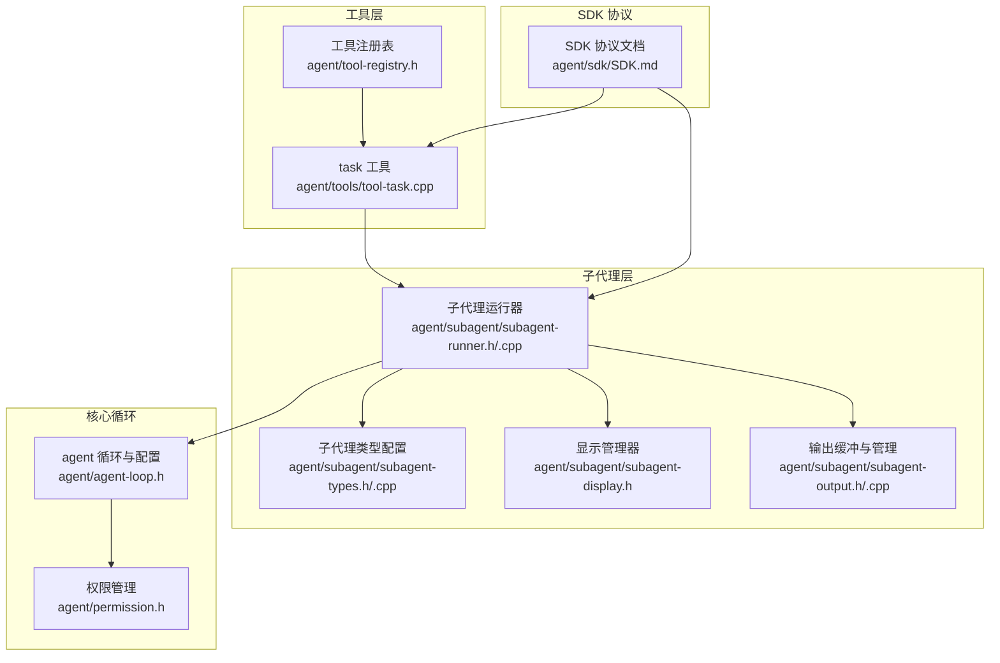
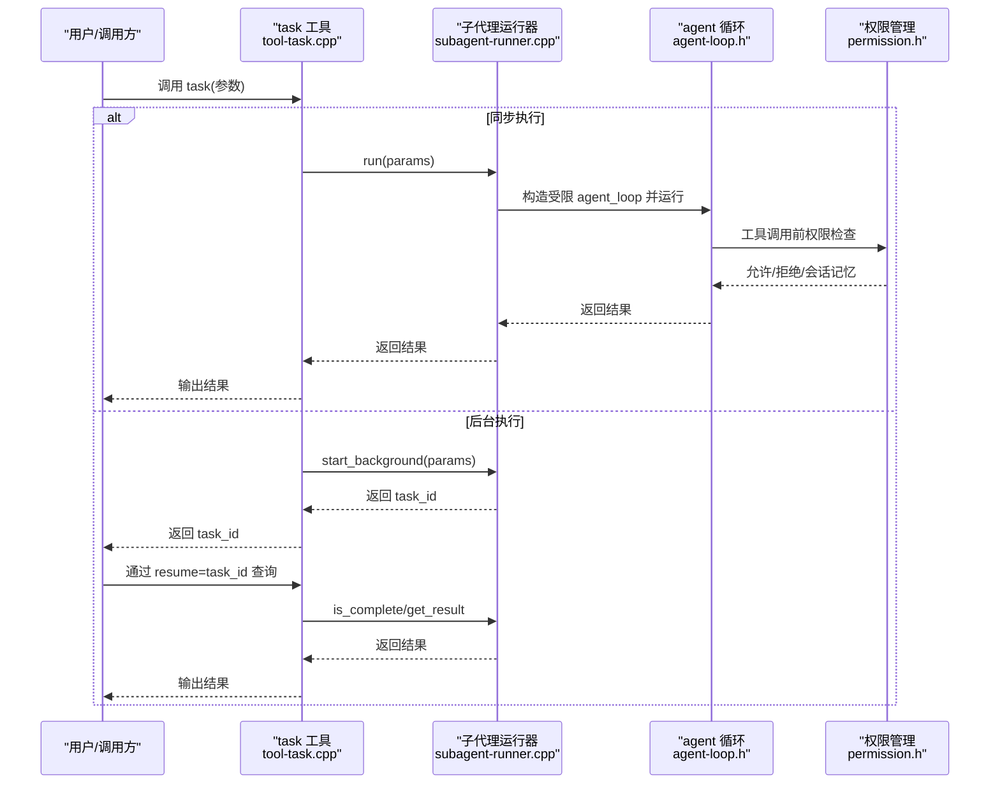
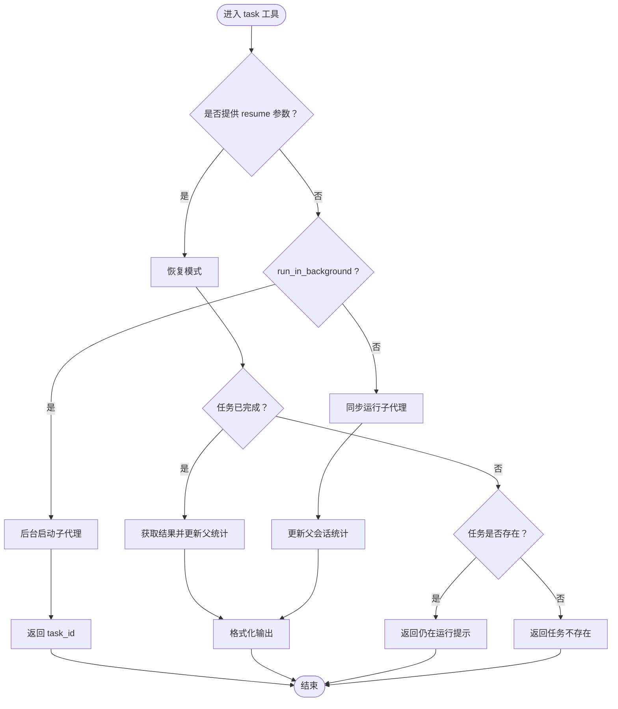
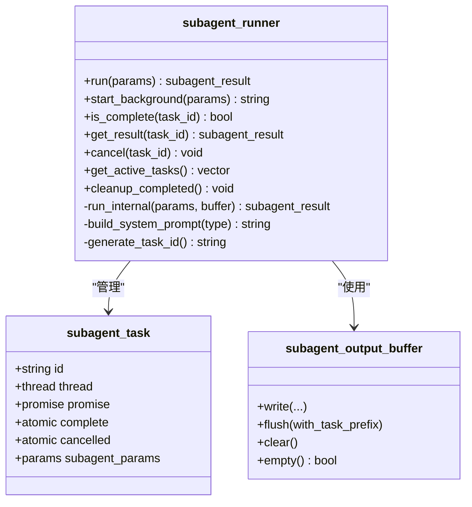
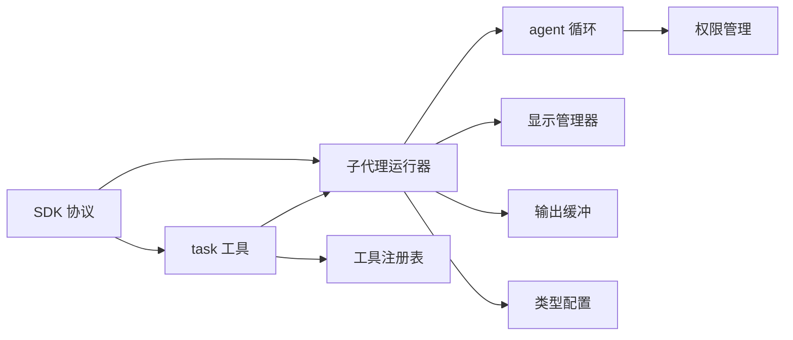

# 任务管理工具

<cite>
**本文引用的文件**
- [agent/tools/tool-task.cpp](file://agent/tools/tool-task.cpp)
- [agent/subagent/subagent-runner.cpp](file://agent/subagent/subagent-runner.cpp)
- [agent/subagent/subagent-runner.h](file://agent/subagent/subagent-runner.h)
- [agent/subagent/subagent-types.cpp](file://agent/subagent/subagent-types.cpp)
- [agent/subagent/subagent-types.h](file://agent/subagent/subagent-types.h)
- [agent/subagent/subagent-display.h](file://agent/subagent/subagent-display.h)
- [agent/subagent/subagent-output.cpp](file://agent/subagent/subagent-output.cpp)
- [agent/subagent/subagent-output.h](file://agent/subagent/subagent-output.h)
- [agent/agent-loop.h](file://agent/agent-loop.h)
- [agent/tool-registry.h](file://agent/tool-registry.h)
- [agent/permission.h](file://agent/permission.h)
- [agent/sdk/SDK.md](file://agent/sdk/SDK.md)
- [docs/llama-cpp-usage-guide.md](file://docs/llama-cpp-usage-guide.md)
</cite>

## 目录
1. [简介](#简介)
2. [项目结构](#项目结构)
3. [核心组件](#核心组件)
4. [架构总览](#架构总览)
5. [详细组件分析](#详细组件分析)
6. [依赖分析](#依赖分析)
7. [性能考虑](#性能考虑)
8. [故障排查指南](#故障排查指南)
9. [结论](#结论)
10. [附录](#附录)

## 简介
本技术文档围绕任务管理工具进行系统化说明，重点涵盖以下方面：
- 设计目的：通过“子代理（subagent）”模式，将复杂任务委托给受限工具集的子会话，实现可并行、可追踪、可恢复的任务执行。
- 任务定义格式：通过工具参数（JSON Schema）定义任务类型、提示词、描述、后台运行与恢复参数。
- 任务调度机制：同步/异步两种执行模式；后台任务采用独立线程与输出缓冲，支持任务状态查询与结果获取。
- 状态跟踪：会话级统计（输入/输出/缓存令牌、耗时）与子代理统计聚合。
- 生命周期管理：创建、执行、监控、取消、清理。
- 高级功能：任务类型（探索、规划、通用、Shell）、工具白名单、只读 Bash 命令前缀、深度限制、权限控制、输出缓冲与原子刷新。
- 应用场景：代码库探索、架构设计规划、多步骤文件编辑、Shell 命令执行与自动化修复。
- 运维内容：任务持久化（内存中）、错误恢复（异常捕获与错误信息）、性能监控（令牌统计、耗时统计）。

## 项目结构
任务管理工具位于 agent 子模块中，围绕工具注册、子代理运行器、显示与输出缓冲、权限控制以及 agent 循环展开。核心文件如下：
- 工具层：task 工具负责任务创建与恢复查询。
- 子代理层：子代理运行器封装 agent 循环，提供同步/后台执行、结果收集与状态管理。
- 显示与输出：RAII 显示作用域、输出缓冲与原子刷新，保障并发输出一致性。
- 权限与配置：权限检查、工作目录沙箱、迭代次数限制、系统提示词构造。
- SDK 协议：与 llama-server 的 HTTP 协议、事件流、权限交互、子代理配置复用策略。

**图表来源**
- [agent/tools/tool-task.cpp:1-257](file://agent/tools/tool-task.cpp#L1-L257)
- [agent/subagent/subagent-runner.h:1-114](file://agent/subagent/subagent-runner.h#L1-L114)
- [agent/subagent/subagent-runner.cpp:1-388](file://agent/subagent/subagent-runner.cpp#L1-L388)
- [agent/subagent/subagent-types.h:1-36](file://agent/subagent/subagent-types.h#L1-L36)
- [agent/subagent/subagent-types.cpp:1-99](file://agent/subagent/subagent-types.cpp#L1-L99)
- [agent/subagent/subagent-display.h:1-88](file://agent/subagent/subagent-display.h#L1-L88)
- [agent/subagent/subagent-output.h:1-107](file://agent/subagent/subagent-output.h#L1-L107)
- [agent/subagent/subagent-output.cpp:1-207](file://agent/subagent/subagent-output.cpp#L1-L207)
- [agent/agent-loop.h:1-276](file://agent/agent-loop.h#L1-L276)
- [agent/permission.h:1-102](file://agent/permission.h#L1-L102)
- [agent/sdk/SDK.md:1-467](file://agent/sdk/SDK.md#L1-L467)

**章节来源**
- [agent/tools/tool-task.cpp:1-257](file://agent/tools/tool-task.cpp#L1-L257)
- [agent/subagent/subagent-runner.h:1-114](file://agent/subagent/subagent-runner.h#L1-L114)
- [agent/subagent/subagent-runner.cpp:1-388](file://agent/subagent/subagent-runner.cpp#L1-L388)
- [agent/subagent/subagent-types.h:1-36](file://agent/subagent/subagent-types.h#L1-L36)
- [agent/subagent/subagent-types.cpp:1-99](file://agent/subagent/subagent-types.cpp#L1-L99)
- [agent/subagent/subagent-display.h:1-88](file://agent/subagent/subagent-display.h#L1-L88)
- [agent/subagent/subagent-output.h:1-107](file://agent/subagent/subagent-output.h#L1-L107)
- [agent/subagent/subagent-output.cpp:1-207](file://agent/subagent/subagent-output.cpp#L1-L207)
- [agent/agent-loop.h:1-276](file://agent/agent-loop.h#L1-L276)
- [agent/permission.h:1-102](file://agent/permission.h#L1-L102)
- [agent/sdk/SDK.md:1-467](file://agent/sdk/SDK.md#L1-L467)

## 核心组件
- 任务工具（task 工具）
  - 参数：子代理类型、提示词、描述、后台运行标志、恢复任务 ID。
  - 行为：同步执行或启动后台任务；恢复模式根据任务 ID 查询状态与结果。
- 子代理运行器
  - 同步执行：直接输出到控制台，无缓冲。
  - 后台执行：创建输出缓冲、独立线程、Promise/Future 收集结果、清理与去重。
  - 状态管理：活跃任务列表、已完成结果缓存、取消标记。
- 子代理类型配置
  - 四种类型：探索（只读）、规划（只读）、通用（多工具）、Shell（只 Bash）。
  - 工具白名单、Bash 前缀限制、最大迭代次数、是否可写文件。
- 显示与输出
  - 显示作用域：RAII 管理嵌套输出头、工具调用报告、完成报告。
  - 输出缓冲：按段落缓冲，支持原子刷新与任务 ID 前缀。
- 权限与配置
  - 权限策略：默认策略、会话覆盖、危险命令检测、工作目录越界检测。
  - agent 配置：最大迭代次数、工具超时、技能注入、agents.md 注入、子代理最大深度。
- SDK 协议
  - 与 llama-server 的 HTTP 协议、事件流、权限交互、子代理配置复用策略。

**章节来源**
- [agent/tools/tool-task.cpp:71-208](file://agent/tools/tool-task.cpp#L71-L208)
- [agent/subagent/subagent-runner.h:64-114](file://agent/subagent/subagent-runner.h#L64-L114)
- [agent/subagent/subagent-runner.cpp:133-244](file://agent/subagent/subagent-runner.cpp#L133-L244)
- [agent/subagent/subagent-types.cpp:12-62](file://agent/subagent/subagent-types.cpp#L12-L62)
- [agent/subagent/subagent-types.h:8-36](file://agent/subagent/subagent-types.h#L8-L36)
- [agent/subagent/subagent-display.h:15-88](file://agent/subagent/subagent-display.h#L15-L88)
- [agent/subagent/subagent-output.h:27-107](file://agent/subagent/subagent-output.h#L27-L107)
- [agent/agent-loop.h:40-94](file://agent/agent-loop.h#L40-L94)
- [agent/permission.h:40-102](file://agent/permission.h#L40-L102)
- [agent/sdk/SDK.md:107-160](file://agent/sdk/SDK.md#L107-L160)

## 架构总览
任务管理工具的整体架构围绕“工具 -> 子代理运行器 -> agent 循环 -> 工具执行 -> 权限检查 -> 输出显示/缓冲”的闭环展开。后台任务通过独立线程与 Promise/Future 保证结果可获取性与线程安全。

**图表来源**
- [agent/tools/tool-task.cpp:71-208](file://agent/tools/tool-task.cpp#L71-L208)
- [agent/subagent/subagent-runner.cpp:133-244](file://agent/subagent/subagent-runner.cpp#L133-L244)
- [agent/agent-loop.h:167-276](file://agent/agent-loop.h#L167-L276)
- [agent/permission.h:40-102](file://agent/permission.h#L40-L102)

## 详细组件分析

### 任务工具（task 工具）
- 参数与校验
  - 子代理类型解析与校验。
  - 提示词必填校验。
  - 恢复模式：根据 task_id 查询状态，区分“仍在运行”“已完成”“不存在”。
- 执行模式
  - 同步：直接运行子代理，更新父会话统计，格式化输出。
  - 后台：启动独立线程，返回 task_id，后续通过 resume 查询。
- 深度限制
  - 基于会话级最大深度与全局显示最大深度，防止无限递归。

**图表来源**
- [agent/tools/tool-task.cpp:71-208](file://agent/tools/tool-task.cpp#L71-L208)

**章节来源**
- [agent/tools/tool-task.cpp:71-208](file://agent/tools/tool-task.cpp#L71-L208)

### 子代理运行器（subagent-runner）
- 同步执行
  - 构建系统提示词（继承父会话 base prompt，最大化 KV 缓存复用）。
  - 限制工具集与 Bash 前缀（EXPLORE 模式）。
  - 记录工具调用摘要、统计令牌用量、报告完成状态。
- 后台执行
  - 生成唯一 task_id，创建输出缓冲，启动独立线程。
  - 通过 Promise/Future 收集结果，线程结束前刷新缓冲并移除缓冲。
  - 管理活跃任务与已完成结果，支持取消标记（共享中断标志）。
- 状态查询与清理
  - is_complete：检查完成或活跃。
  - get_result：获取结果并清理。
  - cleanup_completed：定期清理已完成任务与线程。

**图表来源**
- [agent/subagent/subagent-runner.h:64-114](file://agent/subagent/subagent-runner.h#L64-L114)
- [agent/subagent/subagent-runner.cpp:246-388](file://agent/subagent/subagent-runner.cpp#L246-L388)
- [agent/subagent/subagent-output.h:27-107](file://agent/subagent/subagent-output.h#L27-L107)

**章节来源**
- [agent/subagent/subagent-runner.h:64-114](file://agent/subagent/subagent-runner.h#L64-L114)
- [agent/subagent/subagent-runner.cpp:133-244](file://agent/subagent/subagent-runner.cpp#L133-L244)
- [agent/subagent/subagent-runner.cpp:246-388](file://agent/subagent/subagent-runner.cpp#L246-L388)

### 子代理类型与配置（subagent-types）
- 四种类型及其工具白名单与 Bash 前缀
  - 探索：只读工具（read、glob、bash 只读命令前缀）。
  - 规划：只读工具（read、glob）。
  - 通用：多工具（含文件写入）。
  - Shell：仅 Bash。
- 最大迭代次数与可写文件控制，确保任务可控与安全。

**章节来源**
- [agent/subagent/subagent-types.cpp:12-62](file://agent/subagent/subagent-types.cpp#L12-L62)
- [agent/subagent/subagent-types.h:8-36](file://agent/subagent/subagent-types.h#L8-L36)

### 显示与输出（subagent-display 与 subagent-output）
- 显示作用域
  - 同步模式：直接输出到控制台。
  - 后台模式：输出写入缓冲，支持工具调用报告与完成报告。
- 输出缓冲
  - 段落式缓冲，支持原子刷新、任务 ID 前缀、类型映射。
  - 管理器负责创建、获取、移除与批量刷新。

**章节来源**
- [agent/subagent/subagent-display.h:15-88](file://agent/subagent/subagent-display.h#L15-L88)
- [agent/subagent/subagent-output.h:27-107](file://agent/subagent/subagent-output.h#L27-L107)
- [agent/subagent/subagent-output.cpp:50-207](file://agent/subagent/subagent-output.cpp#L50-L207)

### 权限与配置（permission 与 agent-loop）
- 权限策略
  - 默认策略、会话覆盖、危险命令检测、工作目录越界检测。
- agent 配置
  - 最大迭代次数、工具超时、技能注入、agents.md 注入、子代理最大深度。

**章节来源**
- [agent/permission.h:40-102](file://agent/permission.h#L40-L102)
- [agent/agent-loop.h:40-94](file://agent/agent-loop.h#L40-L94)

### SDK 协议（SDK.md）
- 与 llama-server 的 HTTP 协议、事件流、权限交互、子代理配置复用策略。
- 事件类型与负载：文本增量、推理增量、工具开始/结果、权限请求/解决、迭代开始、完成、错误。
- 子代理作为“另一个 SDK 会话”，仅改变系统提示词、工具白名单与迭代限制。

**章节来源**
- [agent/sdk/SDK.md:107-160](file://agent/sdk/SDK.md#L107-L160)
- [agent/sdk/SDK.md:184-223](file://agent/sdk/SDK.md#L184-L223)

## 依赖分析
- 组件耦合
  - task 工具依赖子代理运行器与工具注册表。
  - 子代理运行器依赖 agent 循环、显示管理器、输出缓冲、类型配置。
  - agent 循环依赖权限管理、工具上下文、会话统计。
- 外部依赖
  - llama.cpp 推理框架（通过 common 与 server 上下文）。
  - 多语言 SDK（Go/Java/Python/TypeScript/Rust）复用协议与事件流。

**图表来源**
- [agent/tools/tool-task.cpp:1-257](file://agent/tools/tool-task.cpp#L1-L257)
- [agent/subagent/subagent-runner.cpp:1-388](file://agent/subagent/subagent-runner.cpp#L1-L388)
- [agent/agent-loop.h:1-276](file://agent/agent-loop.h#L1-L276)
- [agent/permission.h:1-102](file://agent/permission.h#L1-102)
- [agent/tool-registry.h:1-103](file://agent/tool-registry.h#L1-L103)
- [agent/sdk/SDK.md:1-467](file://agent/sdk/SDK.md#L1-L467)

**章节来源**
- [agent/tools/tool-task.cpp:1-257](file://agent/tools/tool-task.cpp#L1-L257)
- [agent/subagent/subagent-runner.cpp:1-388](file://agent/subagent/subagent-runner.cpp#L1-L388)
- [agent/agent-loop.h:1-276](file://agent/agent-loop.h#L1-L276)
- [agent/permission.h:1-102](file://agent/permission.h#L1-L102)
- [agent/tool-registry.h:1-103](file://agent/tool-registry.h#L1-L103)
- [agent/sdk/SDK.md:1-467](file://agent/sdk/SDK.md#L1-L467)

## 性能考虑
- KV 缓存复用
  - 子代理系统提示词以父会话 base prompt 为前缀，最大化 KV 缓存复用，减少重复解码开销。
- 并发与线程
  - 后台任务使用独立线程与 Promise/Future，避免阻塞主线程；定期清理已完成任务与线程，防止资源泄漏。
- 输出原子性
  - 输出缓冲与原子刷新，避免并发输出交错。
- 统计与可观测性
  - 会话级与子代理级令牌统计、耗时统计，便于性能分析与成本控制。
- 迭代限制
  - 不同类型的最大迭代次数限制，防止长尾任务占用资源。

**章节来源**
- [agent/subagent/subagent-runner.cpp:29-118](file://agent/subagent/subagent-runner.cpp#L29-L118)
- [agent/subagent/subagent-runner.cpp:246-388](file://agent/subagent/subagent-runner.cpp#L246-L388)
- [agent/subagent/subagent-output.cpp:111-155](file://agent/subagent/subagent-output.cpp#L111-L155)
- [agent/agent-loop.h:68-81](file://agent/agent-loop.h#L68-L81)
- [agent/subagent/subagent-types.cpp:12-62](file://agent/subagent/subagent-types.cpp#L12-L62)

## 故障排查指南
- 任务无法启动
  - 检查提示词是否为空（新建任务必须提供）。
  - 检查子代理类型是否有效。
- 任务卡住或长时间运行
  - 查看最大迭代次数限制与当前类型配置。
  - 检查是否存在危险命令或越界路径触发权限阻塞。
- 后台任务未返回结果
  - 使用 resume 参数查询任务状态；确认任务是否存在或仍在运行。
  - 检查异常捕获与错误信息（异常转为错误字符串）。
- 输出错乱或缺失
  - 确认后台任务使用输出缓冲与原子刷新。
  - 检查显示作用域是否正确创建与销毁。
- 权限问题
  - 检查权限策略与会话覆盖；确认危险命令前缀与工作目录越界检测。

**章节来源**
- [agent/tools/tool-task.cpp:148-162](file://agent/tools/tool-task.cpp#L148-L162)
- [agent/subagent/subagent-runner.cpp:261-279](file://agent/subagent/subagent-runner.cpp#L261-L279)
- [agent/subagent/subagent-output.cpp:111-155](file://agent/subagent/subagent-output.cpp#L111-L155)
- [agent/permission.h:40-102](file://agent/permission.h#L40-L102)

## 结论
本任务管理工具通过“工具 + 子代理运行器 + agent 循环 + 权限控制 + 显示/输出缓冲”的组合，实现了：
- 可靠的任务生命周期管理（创建、执行、监控、取消、清理）。
- 可扩展的任务类型与工具白名单，兼顾安全性与灵活性。
- 并发与可观测性（后台任务、令牌统计、耗时统计、原子输出）。
- 与 llama-server 的 SDK 协议对齐，便于多语言复用与集成。

## 附录
- 任务优先级与并发控制
  - 当前实现未显式提供任务优先级字段；可通过任务类型与最大迭代次数间接控制资源占用。
  - 并发控制通过独立线程与互斥锁管理，建议结合业务场景合理设置最大子代理深度与迭代上限。
- 资源分配与进度报告
  - 令牌统计与耗时统计可用于资源分配与进度报告；建议在上层 SDK 中将这些指标映射为进度事件。
- 持久化与错误恢复
  - 任务状态与结果存储于内存；建议在上层 SDK 或服务端实现持久化与恢复机制。
- 性能监控
  - 建议结合会话级统计与子代理统计，建立告警与日志记录，监控长尾任务与高开销工具调用。

**章节来源**
- [agent/agent-loop.h:68-81](file://agent/agent-loop.h#L68-L81)
- [agent/sdk/SDK.md:140-160](file://agent/sdk/SDK.md#L140-L160)
- [docs/llama-cpp-usage-guide.md:14-76](file://docs/llama-cpp-usage-guide.md#L14-L76)