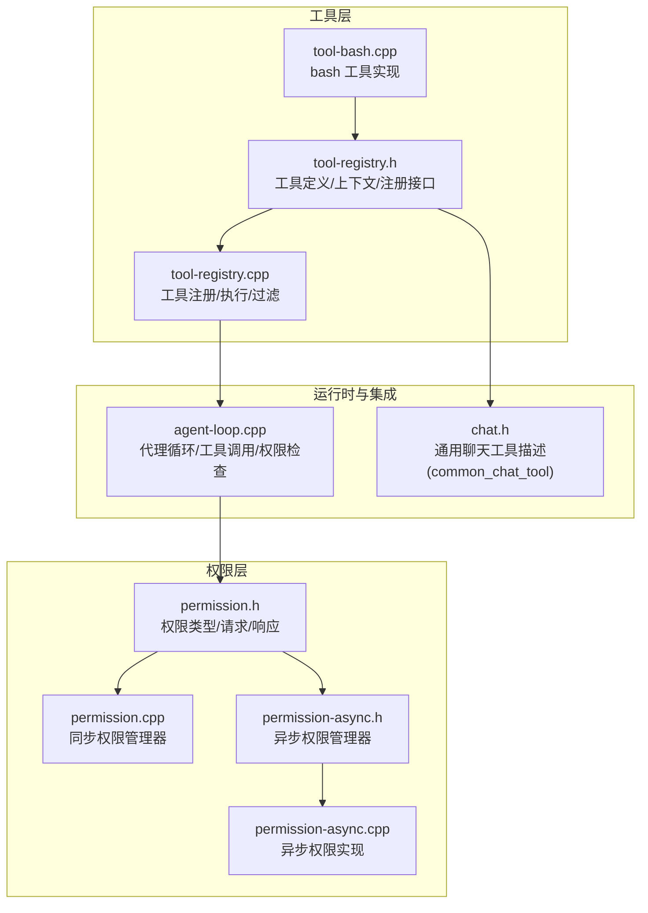
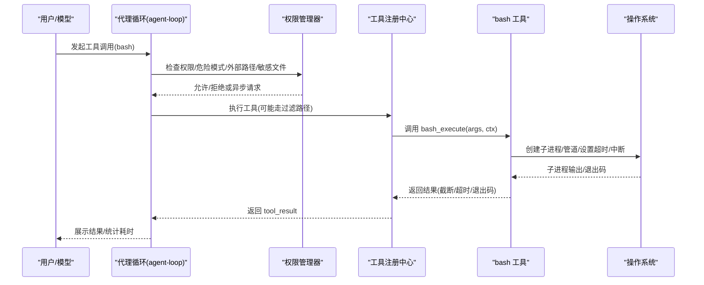
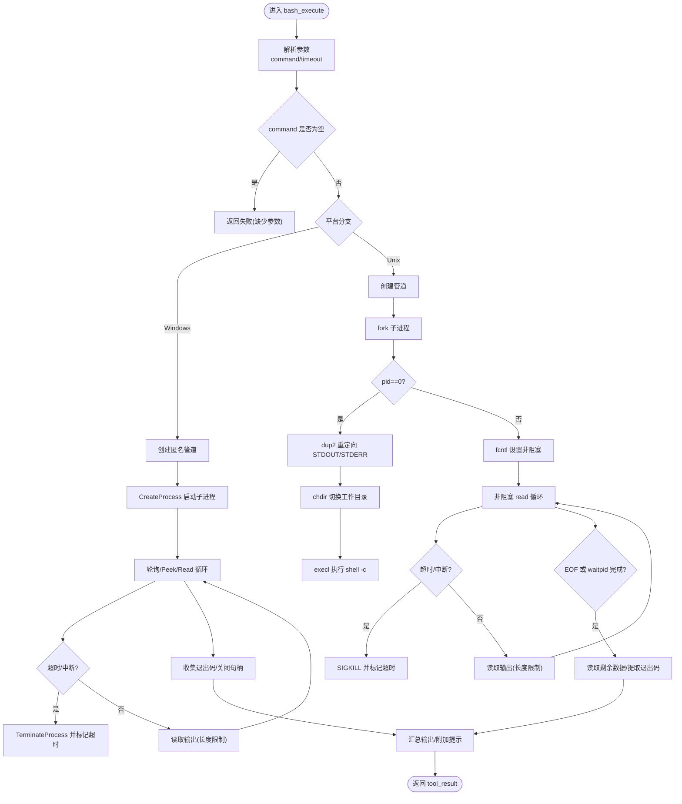
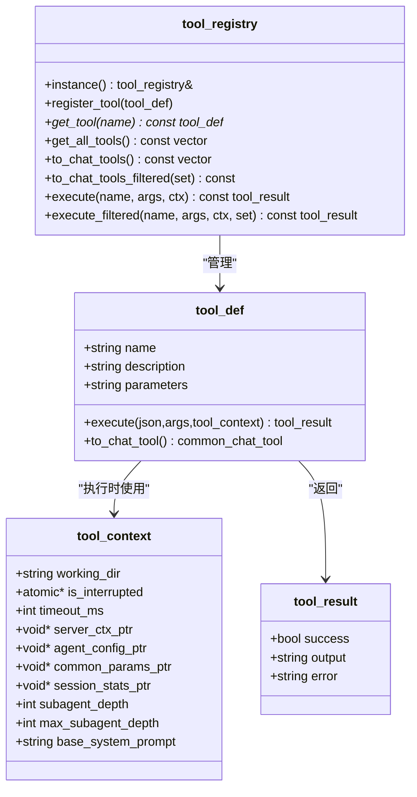
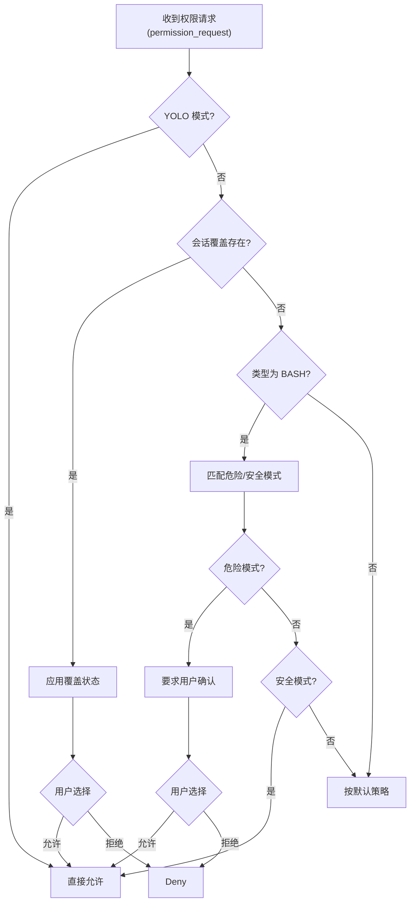
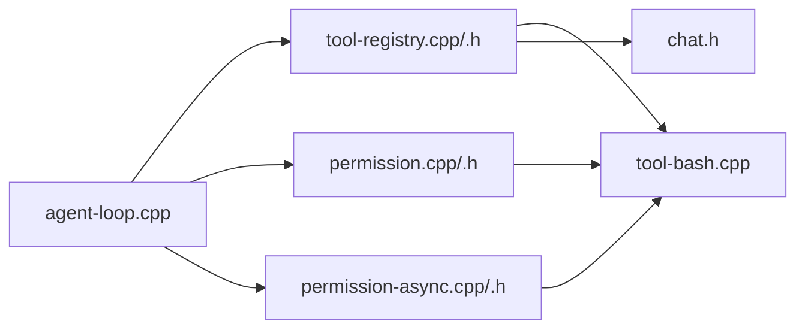

# 命令执行工具

<cite>
**本文引用的文件**
- [tool-bash.cpp](file://agent/tools/tool-bash.cpp)
- [tool-registry.h](file://agent/tool-registry.h)
- [tool-registry.cpp](file://agent/tool-registry.cpp)
- [permission.h](file://agent/permission.h)
- [permission.cpp](file://agent/permission.cpp)
- [permission-async.h](file://agent/permission-async.h)
- [permission-async.cpp](file://agent/permission-async.cpp)
- [agent-loop.cpp](file://agent/agent-loop.cpp)
- [chat.h](file://third_party/llama.cpp/common/chat.h)
</cite>

## 目录
1. [简介](#简介)
2. [项目结构](#项目结构)
3. [核心组件](#核心组件)
4. [架构总览](#架构总览)
5. [详细组件分析](#详细组件分析)
6. [依赖关系分析](#依赖关系分析)
7. [性能考量](#性能考量)
8. [故障排除指南](#故障排除指南)
9. [结论](#结论)
10. [附录](#附录)

## 简介
本文件为“命令执行工具”的技术文档，聚焦于 bash 工具的实现原理与工程实践，涵盖命令解析、执行环境配置、跨平台执行流程、超时与中断控制、输出截断与聚合、以及安全与稳定性保障（白名单机制、路径验证、敏感文件拦截、权限管理、异步权限流等）。文档同时提供最佳实践、性能优化建议与故障排除指南，并说明与系统环境的集成方式与兼容性。

## 项目结构
该工具位于 agent/tools 目录下，通过统一的工具注册中心进行管理，并与权限系统、代理循环、聊天协议等模块协同工作。

图示来源
- [tool-bash.cpp:1-281](file://agent/tools/tool-bash.cpp#L1-L281)
- [tool-registry.h:1-103](file://agent/tool-registry.h#L1-L103)
- [tool-registry.cpp:1-86](file://agent/tool-registry.cpp#L1-L86)
- [permission.h:1-102](file://agent/permission.h#L1-L102)
- [permission.cpp:1-310](file://agent/permission.cpp#L1-L310)
- [permission-async.h:1-142](file://agent/permission-async.h#L1-L142)
- [permission-async.cpp:1-283](file://agent/permission-async.cpp#L1-L283)
- [agent-loop.cpp:1-200](file://agent/agent-loop.cpp#L1-L200)
- [chat.h:169-182](file://third_party/llama.cpp/common/chat.h#L169-L182)

章节来源
- [tool-bash.cpp:1-281](file://agent/tools/tool-bash.cpp#L1-L281)
- [tool-registry.h:1-103](file://agent/tool-registry.h#L1-L103)
- [tool-registry.cpp:1-86](file://agent/tool-registry.cpp#L1-L86)
- [permission.h:1-102](file://agent/permission.h#L1-L102)
- [permission.cpp:1-310](file://agent/permission.cpp#L1-L310)
- [permission-async.h:1-142](file://agent/permission-async.h#L1-L142)
- [permission-async.cpp:1-283](file://agent/permission-async.cpp#L1-L283)
- [agent-loop.cpp:1-200](file://agent/agent-loop.cpp#L1-L200)
- [chat.h:169-182](file://third_party/llama.cpp/common/chat.h#L169-L182)

## 核心组件
- bash 工具：负责跨平台命令执行、管道读取、超时与中断控制、输出截断与汇总。
- 工具注册中心：提供工具注册、查询、执行与“bash 白名单”过滤执行。
- 权限管理器：同步与异步两种模式，支持危险/安全命令模式匹配、外部路径检测、敏感文件拦截、会话级覆盖与防死循环检测。
- 代理循环：组装工具上下文（工作目录、超时、中断原子标志）、发起工具调用、处理权限请求与结果展示。
- 聊天协议适配：将工具定义转换为通用聊天工具描述，供上层模型调用。

章节来源
- [tool-bash.cpp:50-258](file://agent/tools/tool-bash.cpp#L50-L258)
- [tool-registry.h:44-103](file://agent/tool-registry.h#L44-L103)
- [tool-registry.cpp:49-85](file://agent/tool-registry.cpp#L49-L85)
- [permission.h:40-102](file://agent/permission.h#L40-L102)
- [permission.cpp:35-140](file://agent/permission.cpp#L35-L140)
- [permission-async.h:43-142](file://agent/permission-async.h#L43-L142)
- [permission-async.cpp:10-178](file://agent/permission-async.cpp#L10-L178)
- [agent-loop.cpp:66-82](file://agent/agent-loop.cpp#L66-L82)
- [chat.h:169-182](file://third_party/llama.cpp/common/chat.h#L169-L182)

## 架构总览
bash 工具通过统一注册中心被代理循环调用；在执行前可结合权限系统与白名单策略进行前置校验；执行阶段采用跨平台子进程与非阻塞管道读取，配合超时与中断信号实现可控的资源消耗；最终将结果按行截断与长度限制进行汇总返回。

图示来源
- [agent-loop.cpp:596-629](file://agent/agent-loop.cpp#L596-L629)
- [tool-registry.cpp:49-85](file://agent/tool-registry.cpp#L49-L85)
- [tool-bash.cpp:50-258](file://agent/tools/tool-bash.cpp#L50-L258)
- [permission.cpp:108-140](file://agent/permission.cpp#L108-L140)
- [permission-async.cpp:124-178](file://agent/permission-async.cpp#L124-L178)

## 详细组件分析

### bash 工具实现（跨平台命令执行）
- 参数与上下文
  - 必填参数：command；可选参数：timeout（毫秒，默认取自上下文）。
  - 上下文字段：working_dir（工作目录）、is_interrupted（原子中断标志）、timeout_ms、会话统计指针等。
- 执行流程
  - Windows：创建匿名管道，启动子进程，轮询等待与 Peek 命中，按超时与中断终止进程，读取输出并汇总。
  - Unix：创建管道，fork 子进程，子进程重定向标准输出/错误至管道，切换工作目录后 exec shell -c 命令；父进程以非阻塞方式读取，结合 waitpid/WNOHANG 处理 EOF 与退出码。
- 输出与截断
  - 行数上限与字符长度上限；超过则截断并附加提示信息。
- 结果封装
  - success 字段由退出码与超时状态共同决定；输出追加超时/退出码提示；错误路径返回空成功但携带错误信息。

图示来源
- [tool-bash.cpp:50-258](file://agent/tools/tool-bash.cpp#L50-L258)

章节来源
- [tool-bash.cpp:50-258](file://agent/tools/tool-bash.cpp#L50-L258)
- [tool-registry.h:18-41](file://agent/tool-registry.h#L18-L41)

### 工具注册中心与 bash 白名单过滤
- 工具注册与查询
  - 单例注册中心维护工具字典；提供按名称获取、全部导出、过滤导出等能力。
- 过滤执行（bash 白名单）
  - 当调用名为 bash 的工具且传入非空 bash_patterns 集合时，会对命令字符串进行模式匹配（前缀或词边界），若未命中任何模式则直接拒绝，避免在只读/受限场景下执行不受控命令。
- 统一执行入口
  - execute 与 execute_filtered 提供一致的异常捕获与错误包装。

图示来源
- [tool-registry.h:58-103](file://agent/tool-registry.h#L58-L103)
- [tool-registry.cpp:49-85](file://agent/tool-registry.cpp#L49-L85)

章节来源
- [tool-registry.h:44-103](file://agent/tool-registry.h#L44-L103)
- [tool-registry.cpp:49-85](file://agent/tool-registry.cpp#L49-L85)

### 权限系统与安全沙箱
- 同步权限管理器
  - 默认策略：BASH/FILE_WRITE/FILE_EDIT/EXTERNAL_DIR 等类型默认 ASK；部分类型默认 ALLOW。
  - 危险/安全模式匹配：内置多组危险与安全 bash 前缀列表；命中危险模式直接要求确认；命中安全模式自动允许。
  - 外部路径检测：基于项目根绝对路径前缀判断是否越界。
  - 敏感文件识别：根据文件名/扩展名与常见凭证文件特征识别敏感文件。
  - 会话覆盖：支持“本次/永久”覆盖；防死循环检测（最近多次相同调用）。
- 异步权限管理器
  - 与同步版本共享规则，但不阻塞标准输入；提供 request_permission/ respond/wait_for_response/cancel 等异步接口，适合 API/SSE 场景。
- 代理循环中的应用
  - 在工具调用前后进行权限检查：外部路径、危险命令、重复调用；支持同步与异步两种模式。

图示来源
- [permission.cpp:108-140](file://agent/permission.cpp#L108-L140)
- [permission-async.cpp:89-122](file://agent/permission-async.cpp#L89-L122)
- [agent-loop.cpp:542-553](file://agent/agent-loop.cpp#L542-L553)
- [agent-loop.cpp:1315-1325](file://agent/agent-loop.cpp#L1315-L1325)

章节来源
- [permission.h:40-102](file://agent/permission.h#L40-L102)
- [permission.cpp:35-140](file://agent/permission.cpp#L35-L140)
- [permission-async.h:43-142](file://agent/permission-async.h#L43-L142)
- [permission-async.cpp:10-178](file://agent/permission-async.cpp#L10-L178)
- [agent-loop.cpp:542-553](file://agent/agent-loop.cpp#L542-L553)
- [agent-loop.cpp:1315-1325](file://agent/agent-loop.cpp#L1315-L1325)

### 与系统环境的集成与兼容性
- 工具描述与模型对接
  - 工具定义包含名称、描述与 JSON Schema 参数；注册中心将其转换为 common_chat_tool，便于上层模型识别与调用。
- 工作目录与超时
  - 代理循环初始化工具上下文，设置 working_dir、is_interrupted、timeout_ms，并作为 bash 工具执行的默认约束。
- 平台差异
  - Windows 使用 CreateProcess/匿名管道/PeekNamedPipe；Unix 使用 pipe/fork/exec 与非阻塞 IO，二者均实现超时与中断处理。

章节来源
- [tool-registry.h:52-56](file://agent/tool-registry.h#L52-L56)
- [chat.h:169-182](file://third_party/llama.cpp/common/chat.h#L169-L182)
- [agent-loop.cpp:66-82](file://agent/agent-loop.cpp#L66-L82)
- [tool-bash.cpp:62-141](file://agent/tools/tool-bash.cpp#L62-L141)
- [tool-bash.cpp:142-236](file://agent/tools/tool-bash.cpp#L142-L236)

## 依赖关系分析
- bash 工具依赖工具注册中心提供的上下文与执行接口。
- 代理循环在调用工具前整合权限检查与上下文装配。
- 权限系统独立于工具实现，既可同步也可异步，复用同一套规则集。
- 工具定义与聊天协议适配解耦，便于扩展新工具。

图示来源
- [agent-loop.cpp:596-629](file://agent/agent-loop.cpp#L596-L629)
- [tool-registry.cpp:49-85](file://agent/tool-registry.cpp#L49-L85)
- [tool-bash.cpp:50-258](file://agent/tools/tool-bash.cpp#L50-L258)
- [permission.cpp:108-140](file://agent/permission.cpp#L108-L140)
- [permission-async.cpp:124-178](file://agent/permission-async.cpp#L124-L178)
- [chat.h:169-182](file://third_party/llama.cpp/common/chat.h#L169-L182)

章节来源
- [agent-loop.cpp:596-629](file://agent/agent-loop.cpp#L596-L629)
- [tool-registry.cpp:49-85](file://agent/tool-registry.cpp#L49-L85)
- [tool-bash.cpp:50-258](file://agent/tools/tool-bash.cpp#L50-L258)
- [permission.cpp:108-140](file://agent/permission.cpp#L108-L140)
- [permission-async.cpp:124-178](file://agent/permission-async.cpp#L124-L178)
- [chat.h:169-182](file://third_party/llama.cpp/common/chat.h#L169-L182)

## 性能考量
- I/O 读取策略
  - Unix 使用非阻塞读取并短睡眠避免忙等；Windows 使用 Peek/WaitSingleObject 轮询，减少 CPU 占用。
- 输出截断
  - 行数与字符长度限制降低大输出带来的内存与传输压力。
- 超时与中断
  - 稳定的超时阈值与中断原子标志确保长时间命令不会无界占用资源。
- 工具上下文复用
  - 代理循环一次性装配工具上下文，避免重复计算；会话统计指针便于观测工具调用耗时与状态。

章节来源
- [tool-bash.cpp:174-225](file://agent/tools/tool-bash.cpp#L174-L225)
- [tool-bash.cpp:94-132](file://agent/tools/tool-bash.cpp#L94-L132)
- [agent-loop.cpp:66-82](file://agent/agent-loop.cpp#L66-L82)

## 故障排除指南
- 常见问题与定位
  - 命令为空：检查调用参数是否包含 command 字段。
  - 管道创建失败/进程创建失败：检查平台 API 返回值与权限；确认工作目录存在且可访问。
  - 超时：适当提高 timeout；检查命令是否陷入阻塞或长耗时操作。
  - 中断无效：确认 is_interrupted 原子标志正确传递并在外部触发。
  - 输出被截断：调整 MAX_OUTPUT_LINES/MAX_OUTPUT_LENGTH 或分批读取。
  - 白名单拒绝：核对 bash_patterns 集合与命令前缀匹配逻辑。
  - 外部路径/敏感文件：检查项目根设置与路径匹配规则。
- 排查步骤建议
  - 在代理循环中打印工具调用详情与耗时，定位慢点。
  - 使用异步权限模式时，确认回调与响应队列状态。
  - 对于 Unix 系统，确认非阻塞标志设置与 waitpid(WNOHANG) 逻辑。

章节来源
- [tool-bash.cpp:54-56](file://agent/tools/tool-bash.cpp#L54-L56)
- [tool-bash.cpp:144-154](file://agent/tools/tool-bash.cpp#L144-L154)
- [tool-registry.cpp:62-85](file://agent/tool-registry.cpp#L62-L85)
- [permission.cpp:108-140](file://agent/permission.cpp#L108-L140)
- [permission-async.cpp:180-209](file://agent/permission-async.cpp#L180-L209)
- [agent-loop.cpp:596-629](file://agent/agent-loop.cpp#L596-L629)

## 结论
该命令执行工具以“安全优先、可控执行、可观测反馈”为核心设计目标：通过白名单与权限系统实现最小授权，通过跨平台子进程与非阻塞 I/O 实现稳定执行，通过超时与中断控制保障资源安全，通过输出截断与汇总提升用户体验。配合异步权限与统一工具注册中心，可在复杂会话与多子代理场景中保持一致性与可扩展性。

## 附录
- 最佳实践
  - 明确工作目录与项目根，避免误操作外部路径。
  - 合理设置超时，对潜在长耗时命令预留缓冲。
  - 使用白名单限制 bash 命令范围，仅放行必要命令。
  - 对敏感文件与凭证路径进行严格拦截。
  - 在异步场景中及时响应权限请求，避免阻塞。
- 性能优化建议
  - 将大输出命令拆分为分页读取或分批处理。
  - 减少不必要的工具调用次数，合并独立操作。
  - 使用非阻塞读取与短睡眠策略平衡吞吐与 CPU 占用。
- 兼容性注意
  - Windows 与 Unix 的子进程/管道语义差异已在实现中分别处理。
  - 路径分隔符与大小写敏感性需遵循目标平台特性。