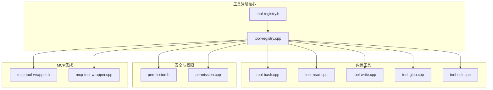
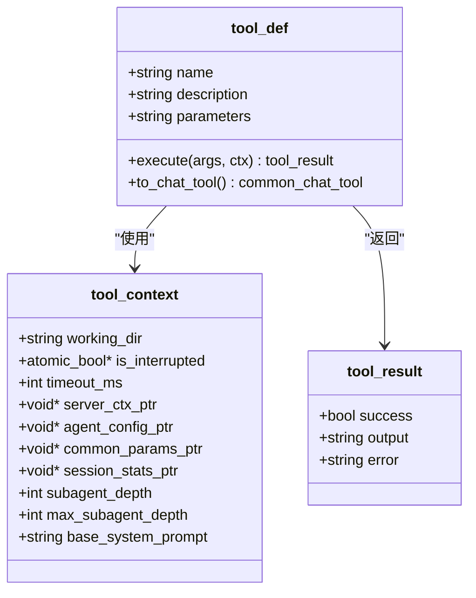
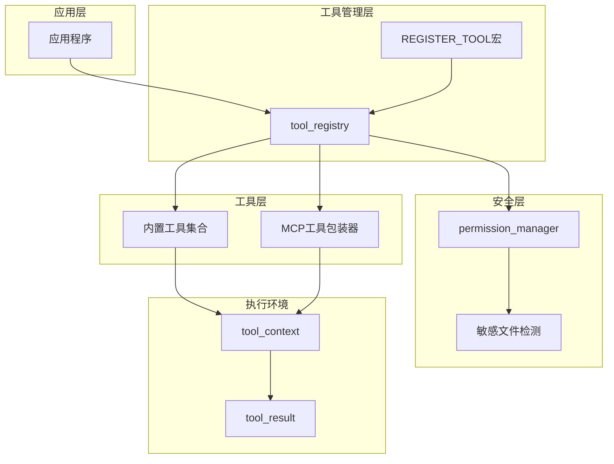
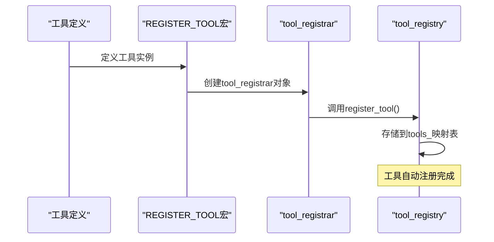
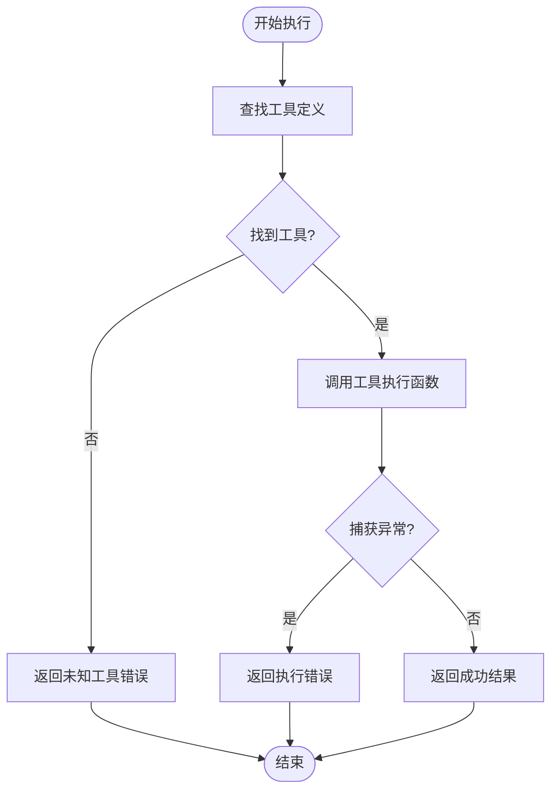
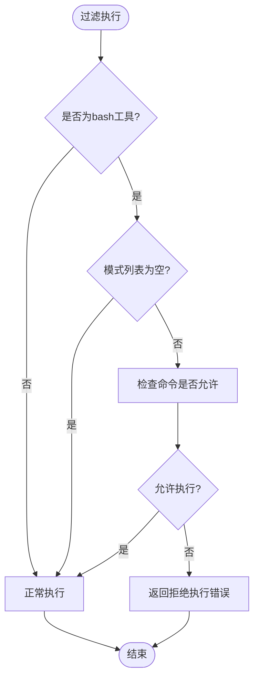
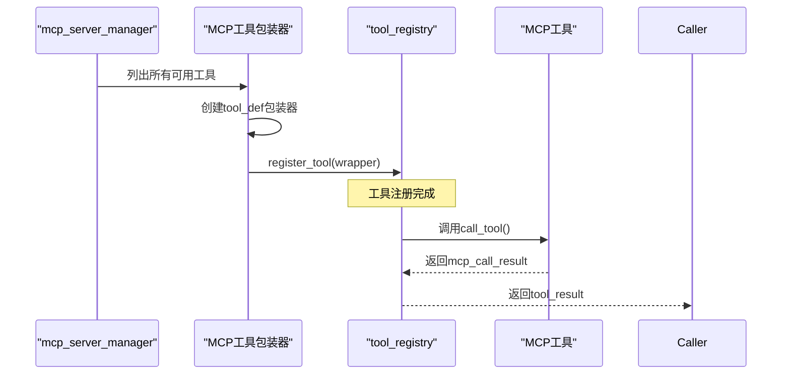
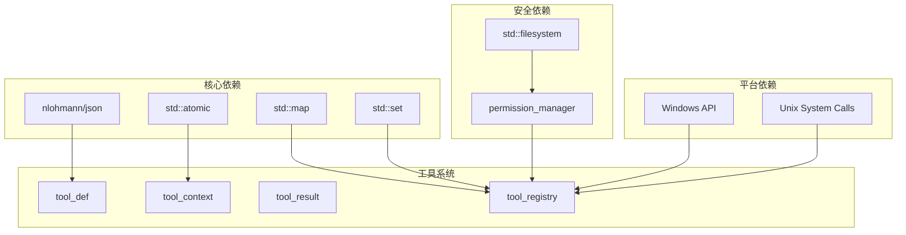

# 工具注册和执行机制

<cite>
**本文档引用的文件**
- [tool-registry.h](file://agent/tool-registry.h)
- [tool-registry.cpp](file://agent/tool-registry.cpp)
- [tool-bash.cpp](file://agent/tools/tool-bash.cpp)
- [tool-read.cpp](file://agent/tools/tool-read.cpp)
- [tool-write.cpp](file://agent/tools/tool-write.cpp)
- [tool-glob.cpp](file://agent/tools/tool-glob.cpp)
- [tool-edit.cpp](file://agent/tools/tool-edit.cpp)
- [permission.h](file://agent/permission.h)
- [permission.cpp](file://agent/permission.cpp)
- [mcp-tool-wrapper.h](file://agent/mcp/mcp-tool-wrapper.h)
- [mcp-tool-wrapper.cpp](file://agent/mcp/mcp-tool-wrapper.cpp)
</cite>

## 目录
1. [简介](#简介)
2. [项目结构](#项目结构)
3. [核心组件](#核心组件)
4. [架构概览](#架构概览)
5. [详细组件分析](#详细组件分析)
6. [依赖关系分析](#依赖关系分析)
7. [性能考虑](#性能考虑)
8. [故障排除指南](#故障排除指南)
9. [结论](#结论)
10. [附录](#附录)

## 简介

本文件详细阐述了llama.cpp-agent项目中的工具注册和执行机制。该机制提供了统一的工具抽象层，支持多种类型的工具（如shell命令、文件操作、模式匹配等），并通过宏注册机制实现了自动化的工具注册流程。系统设计注重安全性、可扩展性和易用性，支持工具权限控制、超时管理、中断处理和子代理功能。

## 项目结构

工具系统主要分布在以下目录中：

**图表来源**
- [tool-registry.h:1-103](file://agent/tool-registry.h#L1-L103)
- [tool-registry.cpp:1-86](file://agent/tool-registry.cpp#L1-L86)

**章节来源**
- [tool-registry.h:1-103](file://agent/tool-registry.h#L1-L103)
- [tool-registry.cpp:1-86](file://agent/tool-registry.cpp#L1-L86)

## 核心组件

### 工具定义结构（tool_def）

工具定义结构是所有工具的核心抽象，包含以下关键字段：

- **name**: 工具名称，用于唯一标识工具
- **description**: 工具功能描述
- **parameters**: JSON Schema字符串，定义工具参数规范
- **execute**: 执行函数指针，实现具体的工具逻辑

**图表来源**
- [tool-registry.h:44-56](file://agent/tool-registry.h#L44-L56)
- [tool-registry.h:18-41](file://agent/tool-registry.h#L18-L41)

### 工具注册表（tool_registry）

工具注册表采用单例模式实现，提供以下核心功能：

- **注册工具**: `register_tool()`
- **查询工具**: `get_tool()`
- **执行工具**: `execute()`
- **过滤执行**: `execute_filtered()`
- **批量转换**: `to_chat_tools()`

**章节来源**
- [tool-registry.h:58-90](file://agent/tool-registry.h#L58-L90)
- [tool-registry.cpp:6-86](file://agent/tool-registry.cpp#L6-L86)

## 架构概览

工具系统的整体架构采用分层设计：

**图表来源**
- [tool-registry.h:92-103](file://agent/tool-registry.h#L92-L103)
- [permission.h:40-102](file://agent/permission.h#L40-L102)

## 详细组件分析

### 工具宏注册机制（REGISTER_TOOL）

REGISTER_TOOL宏是工具系统自动注册的核心机制：

**图表来源**
- [tool-registry.h:92-103](file://agent/tool-registry.h#L92-L103)
- [tool-registry.cpp:11-13](file://agent/tool-registry.cpp#L11-L13)

**章节来源**
- [tool-registry.h:92-103](file://agent/tool-registry.h#L92-L103)

### 工具执行管道

工具执行采用统一的执行管道，确保所有工具具有相同的行为特征：

**图表来源**
- [tool-registry.cpp:49-60](file://agent/tool-registry.cpp#L49-L60)

**章节来源**
- [tool-registry.cpp:49-60](file://agent/tool-registry.cpp#L49-L60)

### 过滤工具集机制

系统支持基于白名单的工具过滤，特别用于只读模式下的bash命令限制：

**图表来源**
- [tool-registry.cpp:62-85](file://agent/tool-registry.cpp#L62-L85)

**章节来源**
- [tool-registry.cpp:62-85](file://agent/tool-registry.cpp#L62-L85)

### 内置工具详解

#### Bash工具（跨平台命令执行）

Bash工具支持Windows和Unix系统的命令执行，具备以下特性：

- **跨平台兼容**: Windows使用CreateProcess，Unix使用fork/exec
- **输出截断**: 限制最大输出长度和行数
- **超时控制**: 支持毫秒级超时设置
- **中断处理**: 响应Ctrl+C中断信号
- **工作目录**: 在指定工作目录下执行命令

**章节来源**
- [tool-bash.cpp:50-258](file://agent/tools/tool-bash.cpp#L50-L258)

#### 文件读取工具

文件读取工具提供安全的文件内容读取功能：

- **路径解析**: 自动处理相对路径，转换为绝对路径
- **权限检查**: 检测敏感文件（如.env、密钥文件）
- **内容截断**: 长行截断，防止内存溢出
- **分页读取**: 支持offset和limit参数进行分页
- **行号显示**: 输出带行号的文件内容

**章节来源**
- [tool-read.cpp:17-93](file://agent/tools/tool-read.cpp#L17-L93)

#### 文件写入工具

文件写入工具提供安全的文件写入功能：

- **目录创建**: 自动创建必要的父目录
- **敏感文件保护**: 阻止写入敏感文件
- **存在性报告**: 明确报告文件是新建还是更新
- **二进制支持**: 支持二进制文件写入

**章节来源**
- [tool-write.cpp:10-57](file://agent/tools/tool-write.cpp#L10-L57)

#### 文件匹配工具

文件匹配工具支持复杂的glob模式匹配：

- **模式转换**: 将glob模式转换为正则表达式
- **递归搜索**: 支持目录树递归遍历
- **时间排序**: 按修改时间降序排列结果
- **路径限制**: 限制最大结果数量（默认100个）

**章节来源**
- [tool-glob.cpp:72-156](file://agent/tools/tool-glob.cpp#L72-L156)

#### 文件编辑工具

文件编辑工具提供精确的文本替换功能：

- **精确匹配**: 要求old_string完全匹配（包括空白字符）
- **多处替换**: 支持replace_all选项进行批量替换
- **差异显示**: 使用彩色输出显示编辑前后的差异
- **安全检查**: 检测敏感文件并阻止编辑操作

**章节来源**
- [tool-edit.cpp:69-164](file://agent/tools/tool-edit.cpp#L69-L164)

### MCP工具集成

MCP（Model Context Protocol）工具通过包装器集成到工具系统中：

**图表来源**
- [mcp-tool-wrapper.cpp:7-63](file://agent/mcp-tool-wrapper.cpp#L7-L63)

**章节来源**
- [mcp-tool-wrapper.h:1-8](file://agent/mcp/mcp-tool-wrapper.h#L1-L8)
- [mcp-tool-wrapper.cpp:7-63](file://agent/mcp/mcp-tool-wrapper.cpp#L7-L63)

## 依赖关系分析

工具系统的依赖关系呈现清晰的层次结构：

**图表来源**
- [tool-registry.h:1-15](file://agent/tool-registry.h#L1-L15)
- [permission.h:1-14](file://agent/permission.h#L1-L14)

**章节来源**
- [tool-registry.h:1-15](file://agent/tool-registry.h#L1-L15)
- [permission.h:1-14](file://agent/permission.h#L1-L14)

## 性能考虑

### 时间复杂度分析

- **工具注册**: O(log n) - 基于std::map的插入操作
- **工具查找**: O(log n) - 基于std::map的查找操作
- **工具执行**: O(f) - f为具体工具的执行复杂度
- **过滤执行**: O(p + f) - p为模式数量，f为工具执行时间

### 内存管理

- **工具存储**: 使用std::map存储工具定义，内存占用与工具数量线性相关
- **输出缓冲**: 限制最大输出长度（30000字符）和行数（50行），防止内存溢出
- **文件读取**: 分页读取大文件，避免一次性加载到内存

### 并发安全

- **原子操作**: 使用std::atomic<bool>处理中断标志，保证线程安全
- **无锁数据结构**: 工具注册表在初始化后不再修改，读取操作无需同步
- **平台特定**: Windows使用进程句柄管理，Unix使用进程ID管理

## 故障排除指南

### 常见问题及解决方案

#### 工具未找到
**症状**: 执行工具时返回"Unknown tool"错误
**原因**: 工具未正确注册或名称不匹配
**解决**: 检查REGISTER_TOOL宏使用和工具名称

#### 权限被拒绝
**症状**: 工具执行被拒绝，特别是bash命令
**原因**: permission_manager检测到潜在危险操作
**解决**: 检查危险模式列表，使用安全模式或手动确认

#### 超时错误
**症状**: 工具执行超时，返回"Timed out"信息
**原因**: 命令执行时间过长或阻塞
**解决**: 增加timeout参数，优化命令执行效率

#### 输出截断
**症状**: 文件内容被截断显示
**原因**: 超过最大输出限制
**解决**: 使用分页参数（offset、limit）分批读取

**章节来源**
- [tool-registry.cpp:52-59](file://agent/tool-registry.cpp#L52-L59)
- [tool-bash.cpp:244-257](file://agent/tools/tool-bash.cpp#L244-L257)

## 结论

工具注册和执行机制为llama.cpp-agent提供了强大而灵活的工具抽象层。通过宏注册机制、统一的执行管道和完善的权限控制系统，系统实现了高可扩展性和安全性。各内置工具针对不同场景进行了专门优化，同时MCP集成确保了与其他工具生态系统的兼容性。

该机制的关键优势包括：
- **自动化注册**: 通过REGISTER_TOOL宏实现零样板代码的工具注册
- **统一接口**: 所有工具遵循相同的执行协议和错误处理机制
- **安全控制**: 多层次的安全检查和权限管理
- **跨平台支持**: 统一的API在不同平台上提供一致行为
- **性能优化**: 合理的内存管理和输出限制

## 附录

### 最佳实践

1. **工具命名**: 使用描述性强且唯一的工具名称
2. **参数验证**: 在工具执行前进行充分的参数验证
3. **错误处理**: 提供清晰的错误信息和回退策略
4. **资源管理**: 及时释放临时资源，避免内存泄漏
5. **测试覆盖**: 为每个工具编写单元测试和集成测试

### 常见陷阱避免

1. **死循环**: 确保工具不会陷入无限循环
2. **资源耗尽**: 实施适当的超时和资源限制
3. **权限滥用**: 严格遵守权限检查机制
4. **竞态条件**: 避免在工具执行期间修改共享状态
5. **异常传播**: 正确处理和包装异常信息