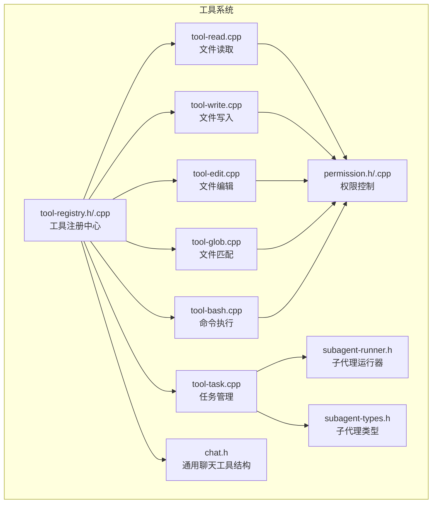
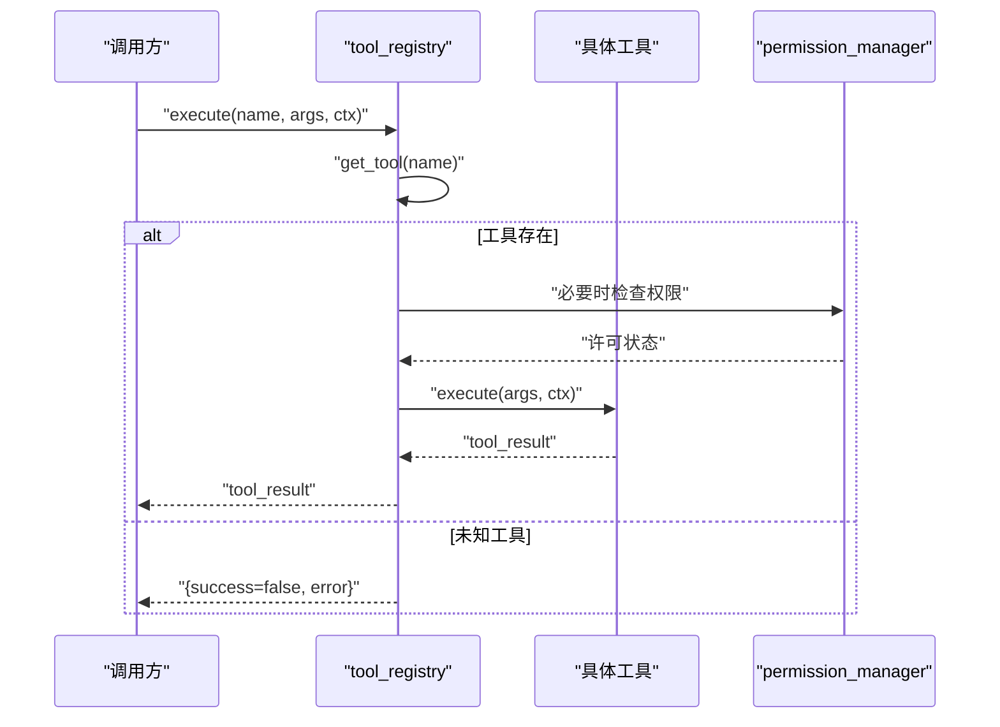
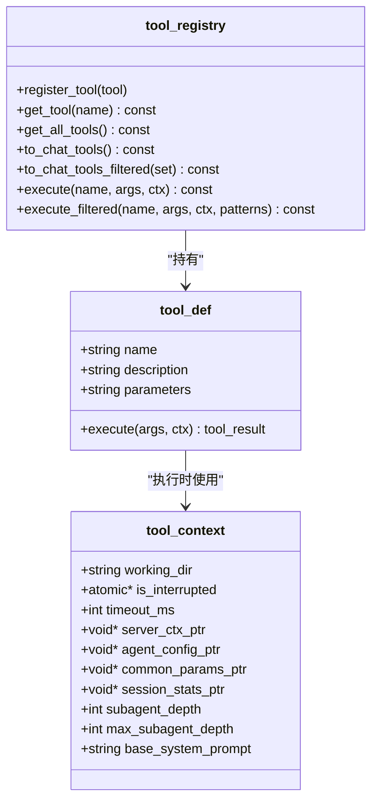
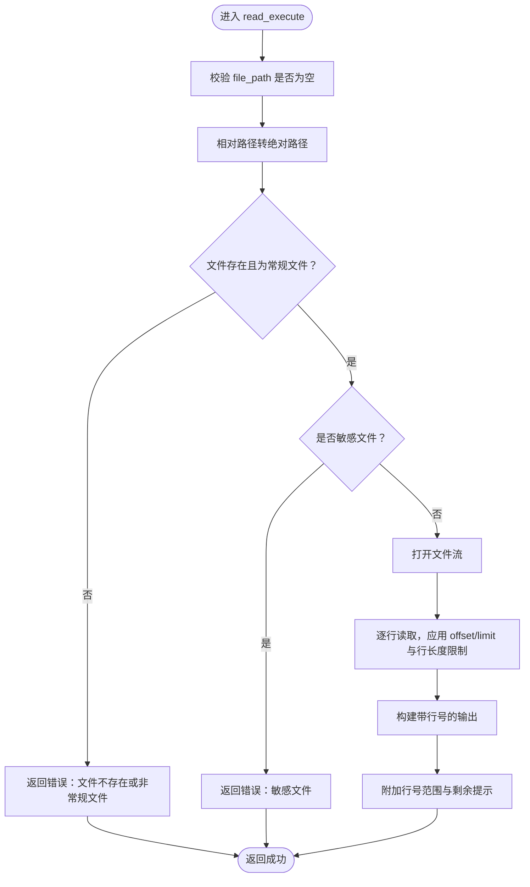
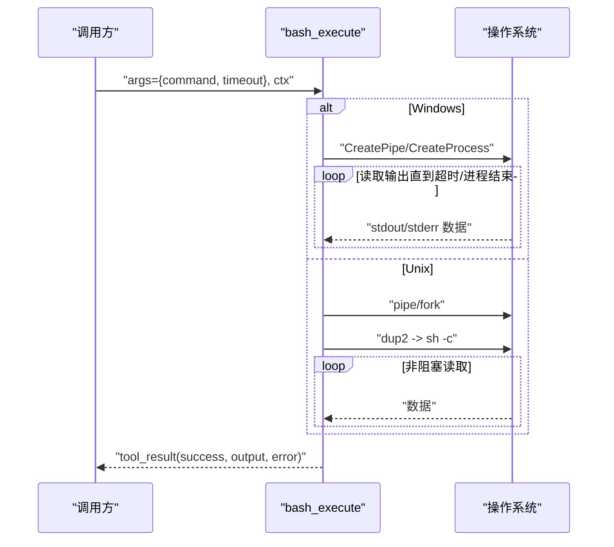
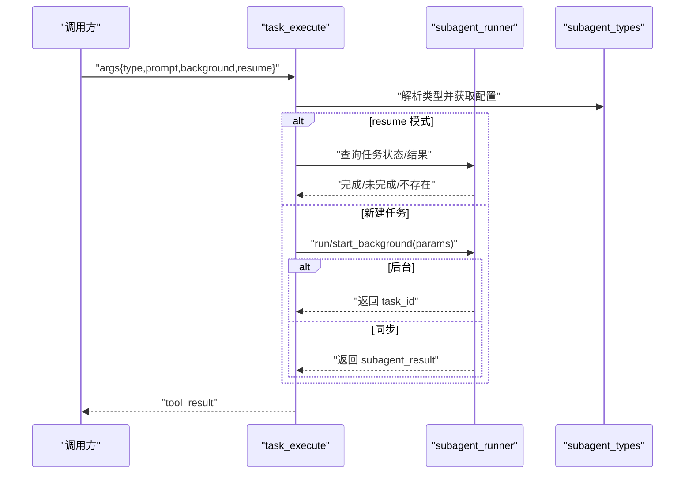
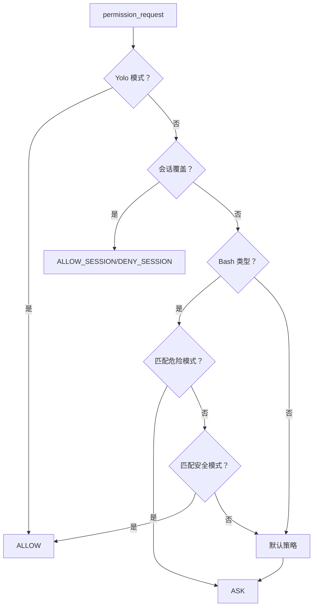
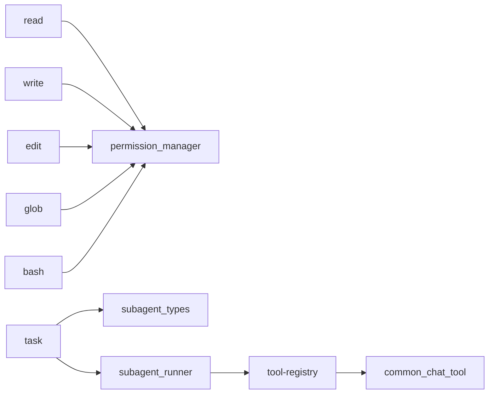

# 工具系统

<cite>
**本文引用的文件**
- [tool-registry.h](file://agent/tool-registry.h)
- [tool-registry.cpp](file://agent/tool-registry.cpp)
- [tool-read.cpp](file://agent/tools/tool-read.cpp)
- [tool-write.cpp](file://agent/tools/tool-write.cpp)
- [tool-edit.cpp](file://agent/tools/tool-edit.cpp)
- [tool-glob.cpp](file://agent/tools/tool-glob.cpp)
- [tool-bash.cpp](file://agent/tools/tool-bash.cpp)
- [tool-task.cpp](file://agent/tools/tool-task.cpp)
- [permission.h](file://agent/permission.h)
- [permission.cpp](file://agent/permission.cpp)
- [subagent-types.h](file://agent/subagent/subagent-types.h)
- [subagent-runner.h](file://agent/subagent/subagent-runner.h)
- [chat.h](file://third_party/llama.cpp/common/chat.h)
</cite>

## 目录
1. [简介](#简介)
2. [项目结构](#项目结构)
3. [核心组件](#核心组件)
4. [架构总览](#架构总览)
5. [详细组件分析](#详细组件分析)
6. [依赖关系分析](#依赖关系分析)
7. [性能考量](#性能考量)
8. [故障排查指南](#故障排查指南)
9. [结论](#结论)
10. [附录](#附录)

## 简介
本文件为工具系统的技术文档，覆盖工具注册与执行机制、文件操作工具（read、write、edit、glob）、命令执行工具（bash）、任务管理工具（task）等。文档解释工具定义、注册流程、执行上下文、结果处理、权限控制、子代理任务运行与后台任务管理等实现细节，并提供工具开发指南、自定义工具扩展方法、工具间协作模式、使用示例与最佳实践。

## 项目结构
工具系统位于 agent/tools 目录下，核心注册与上下文定义在 agent 目录中，权限控制与子代理任务管理分别在 agent/permission.* 与 agent/subagent/* 中实现。llama.cpp 的通用聊天工具结构 common_chat_tool 在 third_party/llama.cpp/common/chat.h 中定义，用于统一工具描述格式。

**图表来源**
- [tool-registry.h:58-97](file://agent/tool-registry.h#L58-L97)
- [tool-registry.cpp:11-85](file://agent/tool-registry.cpp#L11-L85)
- [tool-read.cpp:95-119](file://agent/tools/tool-read.cpp#L95-L119)
- [tool-write.cpp:59-79](file://agent/tools/tool-write.cpp#L59-L79)
- [tool-edit.cpp:166-195](file://agent/tools/tool-edit.cpp#L166-L195)
- [tool-glob.cpp:158-180](file://agent/tools/tool-glob.cpp#L158-L180)
- [tool-bash.cpp:260-280](file://agent/tools/tool-bash.cpp#L260-L280)
- [tool-task.cpp:210-256](file://agent/tools/tool-task.cpp#L210-L256)
- [permission.h:40-101](file://agent/permission.h#L40-L101)
- [permission.cpp:34-140](file://agent/permission.cpp#L34-L140)
- [subagent-types.h:8-35](file://agent/subagent/subagent-types.h#L8-L35)
- [subagent-runner.h:64-113](file://agent/subagent/subagent-runner.h#L64-L113)
- [chat.h:169-173](file://third_party/llama.cpp/common/chat.h#L169-L173)

**章节来源**
- [tool-registry.h:1-103](file://agent/tool-registry.h#L1-L103)
- [tool-registry.cpp:1-86](file://agent/tool-registry.cpp#L1-L86)
- [tool-read.cpp:1-120](file://agent/tools/tool-read.cpp#L1-L120)
- [tool-write.cpp:1-80](file://agent/tools/tool-write.cpp#L1-L80)
- [tool-edit.cpp:1-196](file://agent/tools/tool-edit.cpp#L1-L196)
- [tool-glob.cpp:1-181](file://agent/tools/tool-glob.cpp#L1-L181)
- [tool-bash.cpp:1-281](file://agent/tools/tool-bash.cpp#L1-L281)
- [tool-task.cpp:1-257](file://agent/tools/tool-task.cpp#L1-L257)
- [permission.h:1-102](file://agent/permission.h#L1-L102)
- [permission.cpp:1-310](file://agent/permission.cpp#L1-L310)
- [subagent-types.h:1-36](file://agent/subagent/subagent-types.h#L1-L36)
- [subagent-runner.h:1-114](file://agent/subagent/subagent-runner.h#L1-L114)
- [chat.h:1-309](file://third_party/llama.cpp/common/chat.h#L1-L309)

## 核心组件
- 工具注册中心：提供单例注册、查询、批量转换为通用聊天工具格式、执行与过滤执行能力。
- 工具定义与执行上下文：工具通过 tool_def 描述名称、描述、JSON Schema 参数与执行函数；执行时携带 tool_context（工作目录、超时、中断信号、子代理深度等）。
- 权限管理：对文件敏感性检测、外部路径判断、危险/安全 Bash 模式匹配、会话级允许/拒绝策略、循环调用检测。
- 子代理任务：按类型限制工具集、支持同步/后台运行、任务状态查询与统计汇总。

**章节来源**
- [tool-registry.h:44-97](file://agent/tool-registry.h#L44-L97)
- [tool-registry.cpp:11-85](file://agent/tool-registry.cpp#L11-L85)
- [permission.h:8-101](file://agent/permission.h#L8-L101)
- [permission.cpp:34-140](file://agent/permission.cpp#L34-L140)
- [subagent-types.h:8-35](file://agent/subagent/subagent-types.h#L8-L35)
- [subagent-runner.h:24-113](file://agent/subagent/subagent-runner.h#L24-L113)

## 架构总览
工具系统采用“注册中心 + 工具实现 + 上下文 + 权限控制”的分层设计。工具以静态定义+宏注册的方式自动加入全局注册表；执行时根据名称查找工具并调用其执行函数；权限管理贯穿文件与命令工具；任务工具通过子代理运行器隔离工具集并可后台执行。

**图表来源**
- [tool-registry.cpp:49-60](file://agent/tool-registry.cpp#L49-L60)
- [permission.h:50-54](file://agent/permission.h#L50-L54)
- [permission.cpp:108-140](file://agent/permission.cpp#L108-L140)

## 详细组件分析

### 工具注册与执行机制
- 工具定义：每个工具以 tool_def 结构体定义，包含名称、描述、参数 JSON Schema 与执行函数指针。
- 注册方式：通过 REGISTER_TOOL 宏在编译期自动构造 tool_registrar 实例，触发全局注册。
- 执行流程：根据名称从注册表获取工具，传入 JSON 参数与 tool_context 调用执行函数；支持过滤执行（如 bash 命令白名单）。
- 结果格式：统一返回 tool_result，包含 success、output、error 字段。

**图表来源**
- [tool-registry.h:44-97](file://agent/tool-registry.h#L44-L97)
- [tool-registry.cpp:11-85](file://agent/tool-registry.cpp#L11-L85)

**章节来源**
- [tool-registry.h:44-97](file://agent/tool-registry.h#L44-L97)
- [tool-registry.cpp:11-85](file://agent/tool-registry.cpp#L11-L85)

### 文件操作工具

#### 工具：read
- 功能：读取文件内容，带行号输出；支持偏移与限制行数；长行截断；统计总行数与分页提示。
- 参数：file_path（必填）、offset（默认0）、limit（默认2000）。
- 安全：相对路径转绝对路径（基于 working_dir）；仅允许常规文件；敏感文件阻断；权限检查。

**图表来源**
- [tool-read.cpp:17-93](file://agent/tools/tool-read.cpp#L17-L93)

**章节来源**
- [tool-read.cpp:17-93](file://agent/tools/tool-read.cpp#L17-L93)

#### 工具：write
- 功能：创建或覆盖文件；自动创建父目录；报告字节数。
- 参数：file_path（必填）、content（必填）。
- 安全：敏感文件阻断；父目录创建异常直接报错。

**章节来源**
- [tool-write.cpp:10-57](file://agent/tools/tool-write.cpp#L10-L57)

#### 工具：edit
- 功能：在文件中查找旧字符串并替换为新字符串；支持单次或全部替换；生成简单 diff 输出。
- 参数：file_path（必填）、old_string（必填）、new_string（必填）、replace_all（默认false）。
- 安全：敏感文件阻断；多处出现时要求更精确上下文或开启 replace_all。

**章节来源**
- [tool-edit.cpp:69-164](file://agent/tools/tool-edit.cpp#L69-L164)

#### 工具：glob
- 功能：将 glob 模式转换为正则进行匹配；递归遍历目录；按修改时间排序；限制返回数量。
- 参数：pattern（必填）、path（默认 working_dir）。
- 行为：支持 **、*、?、[] 等；对路径分隔符与通配符做区分匹配。

**章节来源**
- [tool-glob.cpp:72-156](file://agent/tools/tool-glob.cpp#L72-L156)

### 命令执行工具：bash
- 功能：跨平台执行 shell 命令；支持超时与中断；限制输出长度与行数；返回退出码与截断提示。
- 参数：command（必填）、timeout（默认使用 ctx.timeout_ms）。
- 平台差异：Windows 使用 CreateProcess/管道；Unix 使用 fork/exec/sh -c；非阻塞读取与 waitpid。

**图表来源**
- [tool-bash.cpp:50-258](file://agent/tools/tool-bash.cpp#L50-L258)

**章节来源**
- [tool-bash.cpp:50-258](file://agent/tools/tool-bash.cpp#L50-L258)

### 任务管理工具：task
- 功能：根据 subagent 类型创建受限工具集的子代理；支持同步与后台运行；任务状态轮询与结果汇总。
- 参数：subagent_type（默认 general）、prompt（新建任务必填）、description、run_in_background、resume。
- 子代理类型：explore（只读+有限 bash）、plan（只读+glob）、general（除 task 外所有工具）、bash（仅 bash）。
- 后台任务：通过全局 runner 映射与互斥保护；持久化 runner 以跨多次工具调用复用。

**图表来源**
- [tool-task.cpp:71-208](file://agent/tools/tool-task.cpp#L71-L208)
- [subagent-runner.h:64-113](file://agent/subagent/subagent-runner.h#L64-L113)
- [subagent-types.h:8-35](file://agent/subagent/subagent-types.h#L8-L35)

**章节来源**
- [tool-task.cpp:71-208](file://agent/tools/tool-task.cpp#L71-L208)
- [subagent-runner.h:64-113](file://agent/subagent/subagent-runner.h#L64-L113)
- [subagent-types.h:8-35](file://agent/subagent/subagent-types.h#L8-L35)

### 权限控制与安全
- 敏感文件检测：对常见密钥、凭证、证书等文件名与扩展名进行识别。
- 外部路径检测：结合项目根目录判断是否越界访问。
- Bash 模式：内置危险/安全模式列表，危险命令强制询问，安全命令自动放行。
- 会话级策略：用户可选择“本次允许/拒绝”、“总是允许/拒绝”，并有循环调用检测防止死循环。

**图表来源**
- [permission.cpp:108-140](file://agent/permission.cpp#L108-L140)
- [permission.cpp:34-71](file://agent/permission.cpp#L34-L71)
- [permission.h:108-140](file://agent/permission.h#L108-L140)

**章节来源**
- [permission.h:8-101](file://agent/permission.h#L8-L101)
- [permission.cpp:34-140](file://agent/permission.cpp#L34-L140)
- [permission.cpp:230-304](file://agent/permission.cpp#L230-L304)

## 依赖关系分析
- 工具注册中心依赖通用聊天工具结构 common_chat_tool，用于对外暴露工具清单。
- 文件与命令工具均依赖权限管理模块进行安全检查。
- 任务工具依赖子代理类型配置与运行器，实现工具集隔离与后台任务管理。
- 子代理运行器依赖服务器上下文与参数，确保模型资源复用。

**图表来源**
- [tool-registry.h:53-55](file://agent/tool-registry.h#L53-L55)
- [chat.h:169-173](file://third_party/llama.cpp/common/chat.h#L169-L173)
- [tool-read.cpp:43-45](file://agent/tools/tool-read.cpp#L43-L45)
- [tool-write.cpp:25-27](file://agent/tools/tool-write.cpp#L25-L27)
- [tool-edit.cpp:99-103](file://agent/tools/tool-edit.cpp#L99-L103)
- [tool-glob.cpp:42-44](file://agent/tools/tool-glob.cpp#L42-L44)
- [tool-bash.cpp:12-23](file://agent/tools/tool-bash.cpp#L12-L23)
- [tool-task.cpp:32-48](file://agent/tools/tool-task.cpp#L32-L48)
- [subagent-types.h:28-35](file://agent/subagent/subagent-types.h#L28-L35)
- [subagent-runner.h:64-113](file://agent/subagent/subagent-runner.h#L64-L113)

**章节来源**
- [tool-registry.h:53-55](file://agent/tool-registry.h#L53-L55)
- [chat.h:169-173](file://third_party/llama.cpp/common/chat.h#L169-L173)
- [tool-task.cpp:32-48](file://agent/tools/tool-task.cpp#L32-L48)

## 性能考量
- 输出截断：bash 工具限制最大输出字符数与行数，避免大输出阻塞；read 工具限制每行最大长度并提供分页提示。
- IO 限制：glob 限制匹配结果数量并按修改时间排序，减少无意义扫描。
- 过滤执行：bash 工具在只读模式下对命令进行白名单匹配，避免危险命令执行。
- 后台任务：task 工具通过全局 runner 复用子代理运行器，降低重复初始化开销。

**章节来源**
- [tool-bash.cpp:25-48](file://agent/tools/tool-bash.cpp#L25-L48)
- [tool-read.cpp:14-15](file://agent/tools/tool-read.cpp#L14-L15)
- [tool-glob.cpp:105-106](file://agent/tools/tool-glob.cpp#L105-L106)
- [tool-registry.cpp:62-85](file://agent/tool-registry.cpp#L62-L85)

## 故障排查指南
- 工具未找到：检查工具名称大小写与拼写，确认已通过 REGISTER_TOOL 注册。
- 文件读写失败：确认 file_path 是否为常规文件；检查敏感文件阻断；查看父目录创建权限。
- 编辑失败：old_string 必须完全匹配（含空白与缩进）；若有多处出现，需提供更明确上下文或设置 replace_all=true。
- glob 无结果：确认 pattern 与 path 正确；对于路径相关模式，匹配相对路径；适当缩小范围。
- bash 超时/被中断：调整 timeout；检查 is_interrupted 信号；避免长时间阻塞命令。
- 任务无法启动：检查子代理类型与工具白名单；确认未超过最大嵌套深度；后台任务需使用 resume 查询状态。

**章节来源**
- [tool-registry.cpp:51-59](file://agent/tool-registry.cpp#L51-L59)
- [tool-read.cpp:22-45](file://agent/tools/tool-read.cpp#L22-L45)
- [tool-write.cpp:14-51](file://agent/tools/tool-write.cpp#L14-L51)
- [tool-edit.cpp:75-133](file://agent/tools/tool-edit.cpp#L75-L133)
- [tool-glob.cpp:72-156](file://agent/tools/tool-glob.cpp#L72-L156)
- [tool-bash.cpp:181-258](file://agent/tools/tool-bash.cpp#L181-L258)
- [tool-task.cpp:71-208](file://agent/tools/tool-task.cpp#L71-L208)

## 结论
该工具系统以注册中心为核心，围绕文件与命令两大类工具提供安全可控的能力，并通过权限管理与子代理任务实现细粒度的安全与并发控制。通过 JSON Schema 统一参数约束、通过 tool_result 规范结果表达，便于上层集成与自动化编排。建议在生产环境启用权限策略与只读模式，合理设置超时与输出截断，谨慎使用 bash 工具并严格控制后台任务生命周期。

## 附录

### 工具接口规范与参数配置
- 工具定义字段
  - name：工具名称（唯一标识）
  - description：工具描述
  - parameters：JSON Schema 字符串，描述参数结构
  - execute：执行函数签名（接收 JSON 参数与 tool_context，返回 tool_result）
- 执行上下文字段
  - working_dir：工作目录
  - is_interrupted：原子中断信号
  - timeout_ms：默认超时（毫秒）
  - server_ctx_ptr/agent_config_ptr/common_params_ptr/session_stats_ptr：会话与统计信息指针
  - subagent_depth/max_subagent_depth：子代理嵌套深度限制
  - base_system_prompt：子代理系统提示前缀缓存

**章节来源**
- [tool-registry.h:18-56](file://agent/tool-registry.h#L18-L56)
- [chat.h:169-173](file://third_party/llama.cpp/common/chat.h#L169-L173)

### 自定义工具开发指南
- 定义工具
  - 实现执行函数（返回 tool_result）
  - 准备 JSON Schema 参数描述
  - 组装 tool_def 并使用 REGISTER_TOOL 注册
- 注意事项
  - 参数必须符合 JSON Schema；必要时进行输入校验
  - 对文件/命令操作务必调用权限检查
  - 对可能耗时的操作设置合理超时与中断处理
  - 输出应简洁明了，必要时提供分页或摘要

**章节来源**
- [tool-registry.h:93-103](file://agent/tool-registry.h#L93-L103)
- [permission.h:50-54](file://agent/permission.h#L50-L54)

### 工具间协作模式
- 读取-编辑-写入：先 read 获取上下文，再 edit 做局部替换，最后 write 写回；注意敏感文件与多处匹配场景。
- glob 辅助定位：先 glob 查找目标文件，再 read/编辑/写入。
- bash 协同：在只读模式下仅允许安全命令；需要写入时切换到允许模式或使用 write/edit 工具。
- 任务委派：复杂多步骤任务交由 task 创建子代理执行，利用类型化工具集与后台任务管理。

**章节来源**
- [tool-read.cpp:17-93](file://agent/tools/tool-read.cpp#L17-L93)
- [tool-edit.cpp:69-164](file://agent/tools/tool-edit.cpp#L69-L164)
- [tool-write.cpp:10-57](file://agent/tools/tool-write.cpp#L10-L57)
- [tool-glob.cpp:72-156](file://agent/tools/tool-glob.cpp#L72-L156)
- [tool-bash.cpp:50-258](file://agent/tools/tool-bash.cpp#L50-L258)
- [tool-task.cpp:71-208](file://agent/tools/tool-task.cpp#L71-L208)