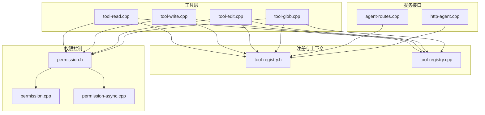
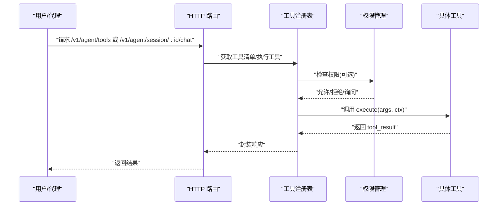
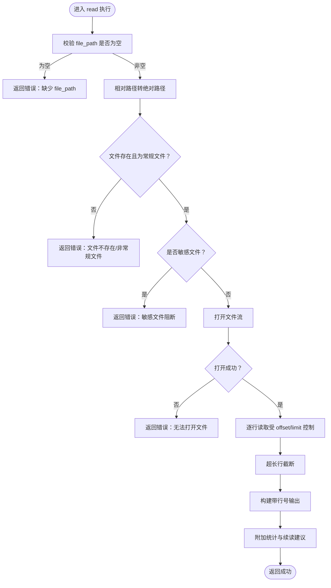
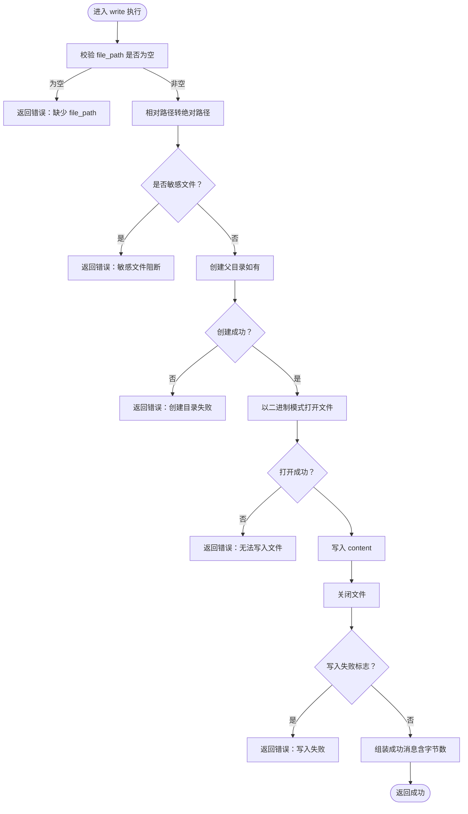
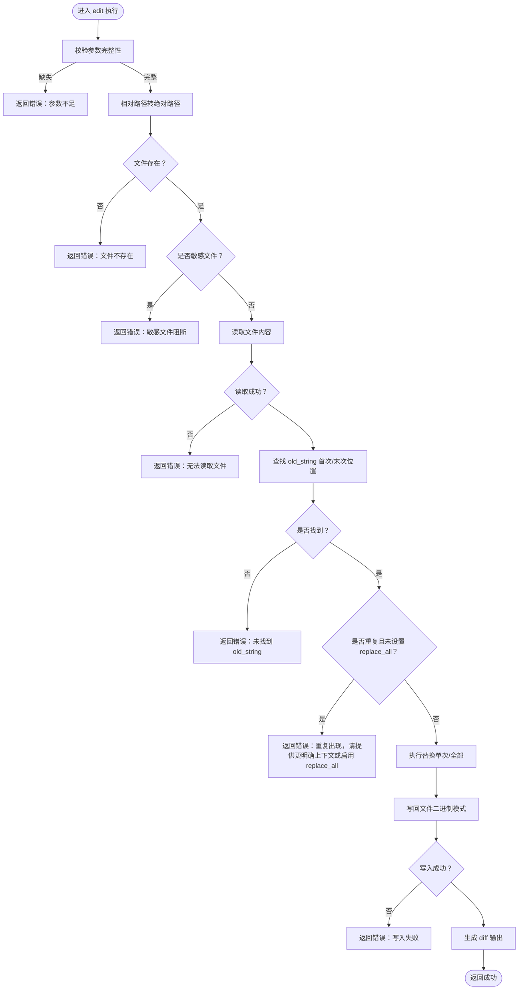
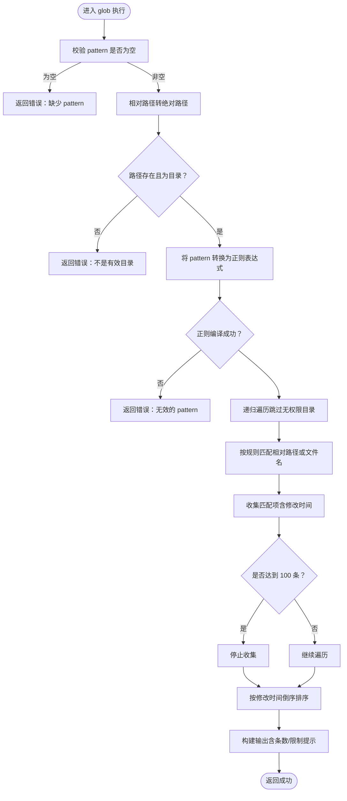
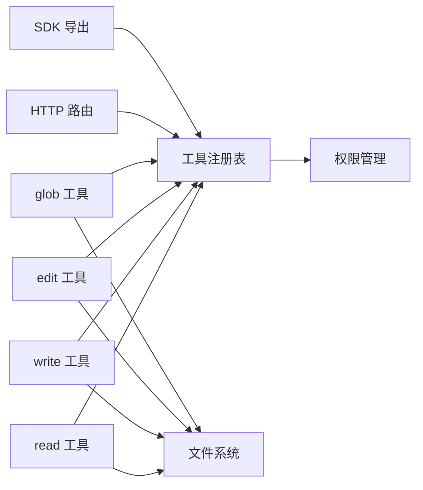

# 文件操作工具

<cite>
**本文引用的文件**
- [tool-read.cpp](file://agent/tools/tool-read.cpp)
- [tool-write.cpp](file://agent/tools/tool-write.cpp)
- [tool-edit.cpp](file://agent/tools/tool-edit.cpp)
- [tool-glob.cpp](file://agent/tools/tool-glob.cpp)
- [tool-registry.h](file://agent/tool-registry.h)
- [tool-registry.cpp](file://agent/tool-registry.cpp)
- [permission.h](file://agent/permission.h)
- [permission.cpp](file://agent/permission.cpp)
- [permission-async.cpp](file://agent/permission-async.cpp)
- [agent-routes.cpp](file://agent/server/agent-routes.cpp)
- [http-agent.cpp](file://agent/sdk/http-agent.cpp)
- [prompt.txt](file://agent/prompt.txt)
- [agent-loop.cpp](file://agent/agent-loop.cpp)
</cite>

## 目录
1. [简介](#简介)
2. [项目结构](#项目结构)
3. [核心组件](#核心组件)
4. [架构总览](#架构总览)
5. [详细组件分析](#详细组件分析)
6. [依赖关系分析](#依赖关系分析)
7. [性能考虑](#性能考虑)
8. [故障排查指南](#故障排查指南)
9. [结论](#结论)
10. [附录](#附录)

## 简介
本文件面向“文件操作工具”的技术文档，覆盖以下工具：
- 工具 read：读取文件内容，支持偏移与限制，输出带行号的文本，并提示剩余行数与续读建议。
- 工具 write：创建或覆写文件，自动创建父目录，报告字节数。
- 工具 edit：基于精确文本替换的文件编辑，支持单次或全部替换，并生成简单 diff 输出。
- 工具 glob：按通配符模式递归查找文件，支持多级路径匹配，结果按修改时间倒序排序。

文档将从架构、数据流、处理逻辑、错误处理、性能与安全等方面进行深入解析，并给出在代理对话中的使用示例与最佳实践。

## 项目结构
文件操作工具位于 agent/tools 目录下，通过统一的工具注册表进行管理，并由权限系统控制访问策略。HTTP 接口暴露工具清单与执行能力；SDK 将工具定义转换为外部可用的函数签名。

图表来源
- [tool-read.cpp:1-120](file://agent/tools/tool-read.cpp#L1-L120)
- [tool-write.cpp:1-80](file://agent/tools/tool-write.cpp#L1-L80)
- [tool-edit.cpp:1-196](file://agent/tools/tool-edit.cpp#L1-L196)
- [tool-glob.cpp:1-181](file://agent/tools/tool-glob.cpp#L1-L181)
- [tool-registry.h:1-103](file://agent/tool-registry.h#L1-L103)
- [tool-registry.cpp:1-86](file://agent/tool-registry.cpp#L1-L86)
- [permission.h:1-102](file://agent/permission.h#L1-L102)
- [permission.cpp:1-310](file://agent/permission.cpp#L1-L310)
- [permission-async.cpp:1-283](file://agent/permission-async.cpp#L1-L283)
- [agent-routes.cpp:409-424](file://agent/server/agent-routes.cpp#L409-L424)
- [http-agent.cpp:95-124](file://agent/sdk/http-agent.cpp#L95-L124)

章节来源
- [tool-read.cpp:1-120](file://agent/tools/tool-read.cpp#L1-L120)
- [tool-write.cpp:1-80](file://agent/tools/tool-write.cpp#L1-L80)
- [tool-edit.cpp:1-196](file://agent/tools/tool-edit.cpp#L1-L196)
- [tool-glob.cpp:1-181](file://agent/tools/tool-glob.cpp#L1-L181)
- [tool-registry.h:1-103](file://agent/tool-registry.h#L1-L103)
- [tool-registry.cpp:1-86](file://agent/tool-registry.cpp#L1-L86)
- [permission.h:1-102](file://agent/permission.h#L1-L102)
- [permission.cpp:1-310](file://agent/permission.cpp#L1-L310)
- [permission-async.cpp:1-283](file://agent/permission-async.cpp#L1-L283)
- [agent-routes.cpp:409-424](file://agent/server/agent-routes.cpp#L409-L424)
- [http-agent.cpp:95-124](file://agent/sdk/http-agent.cpp#L95-L124)

## 核心组件
- 工具上下文 tool_context：包含工作目录、超时、中断标记以及会话统计指针等，贯穿所有工具执行。
- 工具结果 tool_result：统一返回结构，包含 success、output、error 字段。
- 工具定义 tool_def：包含名称、描述、JSON 参数模式与执行函数指针。
- 工具注册表 tool_registry：提供注册、查询、执行与过滤后的工具列表导出。

章节来源
- [tool-registry.h:17-56](file://agent/tool-registry.h#L17-L56)
- [tool-registry.cpp:49-85](file://agent/tool-registry.cpp#L49-L85)

## 架构总览
工具执行流程概览如下：

图表来源
- [agent-routes.cpp:409-424](file://agent/server/agent-routes.cpp#L409-L424)
- [tool-registry.cpp:49-85](file://agent/tool-registry.cpp#L49-L85)
- [permission.cpp:108-140](file://agent/permission.cpp#L108-L140)

## 详细组件分析

### 工具 read（文件读取）
- 功能要点
  - 支持相对路径转绝对路径（基于工作目录）。
  - 校验目标为常规文件且存在。
  - 敏感文件拦截（如 .env、密钥文件等）。
  - 逐行读取，支持 offset 与 limit 控制输出范围。
  - 对超长行截断并在末尾追加省略号。
  - 输出带行号，末尾附加统计与续读建议。
- 参数
  - file_path：必填，文件路径（相对或绝对）。
  - offset：可选，起始行索引（0 基）。
  - limit：可选，最大行数，默认 2000。
- 返回值
  - success：布尔，是否成功。
  - output：字符串，带行号的文本块及统计信息。
  - error：字符串，错误消息（失败时）。
- 错误处理
  - 缺少 file_path、文件不存在、非常规文件、无法打开、敏感文件阻断。
- 性能与安全
  - 使用流式读取，避免一次性加载大文件。
  - 行长度上限与输出限制防止资源耗尽。
  - 敏感文件白名单阻断。

图表来源
- [tool-read.cpp:17-93](file://agent/tools/tool-read.cpp#L17-L93)

章节来源
- [tool-read.cpp:17-93](file://agent/tools/tool-read.cpp#L17-L93)

### 工具 write（文件写入）
- 功能要点
  - 支持相对路径转绝对路径。
  - 自动创建父目录（若需要）。
  - 二进制模式写入，确保字节级正确性。
  - 成功后返回创建/更新状态与字节数。
- 参数
  - file_path：必填，目标路径。
  - content：必填，写入内容。
- 返回值
  - success：布尔。
  - output：字符串，包含操作类型、路径与字节数。
  - error：字符串（失败时）。
- 错误处理
  - 缺少参数、目录创建失败、打开/写入失败、写入失败标志。
- 安全
  - 敏感文件阻断。
  - 二进制模式减少编码问题。

图表来源
- [tool-write.cpp:10-57](file://agent/tools/tool-write.cpp#L10-L57)

章节来源
- [tool-write.cpp:10-57](file://agent/tools/tool-write.cpp#L10-L57)

### 工具 edit（文本编辑）
- 功能要点
  - 支持相对路径转绝对路径。
  - 读取现有内容，校验可读性。
  - 精确匹配 old_string，若出现多次则要求 replace_all 或提供更明确上下文。
  - 单次替换或全部替换，写回文件。
  - 生成简单 diff 输出（颜色标记），便于审阅。
- 参数
  - file_path：必填。
  - old_string：必填，必须完全一致（包括空白与缩进）。
  - new_string：必填。
  - replace_all：可选，布尔，默认 false。
- 返回值
  - success：布尔。
  - output：字符串，包含替换次数与 diff。
  - error：字符串（失败时）。
- 错误处理
  - 缺少必要参数、文件不存在、不可读、未找到匹配、多次匹配未启用 replace_all、写入失败。
- 安全
  - 敏感文件阻断。
  - 严格文本匹配，避免误替换。

图表来源
- [tool-edit.cpp:69-164](file://agent/tools/tool-edit.cpp#L69-L164)

章节来源
- [tool-edit.cpp:69-164](file://agent/tools/tool-edit.cpp#L69-L164)

### 工具 glob（文件匹配）
- 功能要点
  - 将通配符模式转换为正则表达式，支持 *、**、?、[] 等。
  - 递归遍历目录（跳过无权限目录），收集常规文件。
  - 匹配规则：若模式包含路径分隔符或通配符，则匹配相对路径；否则仅匹配文件名。
  - 结果按最后修改时间倒序排序，最多返回 100 条，超出时提示更具体模式。
- 参数
  - pattern：必填，通配符模式。
  - path：可选，默认工作目录。
- 返回值
  - success：布尔。
  - output：字符串，匹配文件列表或“未找到”提示。
  - error：字符串（失败时）。
- 错误处理
  - 缺少 pattern、搜索路径不存在/非目录、正则无效、遍历异常（静默继续）。
- 性能与安全
  - 限制结果数量，避免大规模扫描导致性能问题。
  - 跳过无权限目录，降低异常风险。

图表来源
- [tool-glob.cpp:72-156](file://agent/tools/tool-glob.cpp#L72-L156)

章节来源
- [tool-glob.cpp:72-156](file://agent/tools/tool-glob.cpp#L72-L156)

## 依赖关系分析
- 工具到注册表
  - 各工具通过 REGISTER_TOOL 宏注册至全局注册表，注册表提供按名称查询与执行能力。
- 工具到权限系统
  - 工具在执行前会调用权限管理器判断是否允许，敏感文件检测由权限模块提供静态方法。
- 工具到文件系统
  - 使用 std::filesystem 进行路径解析、存在性与类型检查、递归遍历、创建目录等。
- HTTP 与 SDK 集成
  - HTTP 路由提供工具清单与聊天接口；SDK 将工具定义转换为外部可用的函数签名。

图表来源
- [tool-registry.cpp:11-21](file://agent/tool-registry.cpp#L11-L21)
- [permission.cpp:230-304](file://agent/permission.cpp#L230-L304)
- [agent-routes.cpp:409-424](file://agent/server/agent-routes.cpp#L409-L424)
- [http-agent.cpp:95-124](file://agent/sdk/http-agent.cpp#L95-L124)

章节来源
- [tool-registry.cpp:11-21](file://agent/tool-registry.cpp#L11-L21)
- [permission.cpp:230-304](file://agent/permission.cpp#L230-L304)
- [agent-routes.cpp:409-424](file://agent/server/agent-routes.cpp#L409-L424)
- [http-agent.cpp:95-124](file://agent/sdk/http-agent.cpp#L95-L124)

## 性能考虑
- 流式读取与输出
  - read 与 edit 在读取阶段采用流式处理，避免一次性加载大文件。
- 结果数量限制
  - glob 默认限制 100 条，防止大规模扫描造成延迟。
- 行长度与输出大小控制
  - read 对超长行进行截断，避免输出膨胀。
- 写入模式
  - write 与 edit 使用二进制模式写入，减少编码转换开销。
- 路径与权限
  - glob 跳过无权限目录，避免异常导致的额外开销。

## 故障排查指南
- 常见错误与定位
  - 缺少参数：检查调用时是否传入 file_path、content、old_string、pattern 等必需字段。
  - 文件不存在/非常规文件：确认路径与权限，必要时使用 glob 先定位。
  - 无法打开/写入：检查磁盘空间、权限与只读状态。
  - 敏感文件阻断：避免对 .env、密钥、证书等文件进行读写/编辑。
  - 正则模式无效：检查 glob 的 pattern 是否符合预期。
- 定位手段
  - 使用 glob 定位候选文件，再用 read 检查内容，最后用 edit 或 write 处理。
  - 在 SDK/HTTP 层查看工具清单与参数模式，确保调用格式正确。
- 交互式权限
  - 若触发权限弹窗，根据提示选择“一次允许/拒绝”或“本次会话始终允许/拒绝”。

章节来源
- [tool-read.cpp:22-51](file://agent/tools/tool-read.cpp#L22-L51)
- [tool-write.cpp:14-51](file://agent/tools/tool-write.cpp#L14-L51)
- [tool-edit.cpp:75-109](file://agent/tools/tool-edit.cpp#L75-L109)
- [tool-glob.cpp:76-101](file://agent/tools/tool-glob.cpp#L76-L101)
- [permission.cpp:108-140](file://agent/permission.cpp#L108-L140)

## 结论
文件操作工具通过统一的注册表与权限体系，提供了安全、可控且高效的文件读取、写入、编辑与匹配能力。结合 glob 与 read 的探索流程，配合 edit 的精准替换与 write 的幂等覆写，能够满足大多数代理自动化场景下的文件操作需求。建议在生产环境中启用权限拦截与敏感文件阻断，并合理设置 glob 的模式以控制扫描范围。

## 附录

### 使用示例（代理对话中的典型流程）
- 探索与阅读
  - 使用 glob 定位目标文件，再用 read 查看内容，最后决定是否需要编辑或重写。
- 精准编辑
  - 使用 edit 基于精确文本替换，确保变更最小化。
- 创建/覆写
  - 使用 write 创建新文件或覆写既有文件，注意敏感文件阻断。

示例参考
- [prompt.txt:55-86](file://agent/prompt.txt#L55-L86)
- [agent-loop.cpp:171-200](file://agent/agent-loop.cpp#L171-L200)

章节来源
- [prompt.txt:55-86](file://agent/prompt.txt#L55-L86)
- [agent-loop.cpp:171-200](file://agent/agent-loop.cpp#L171-L200)