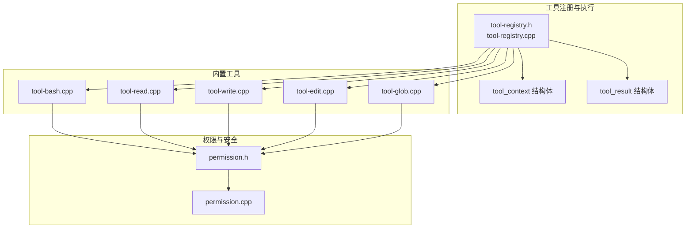
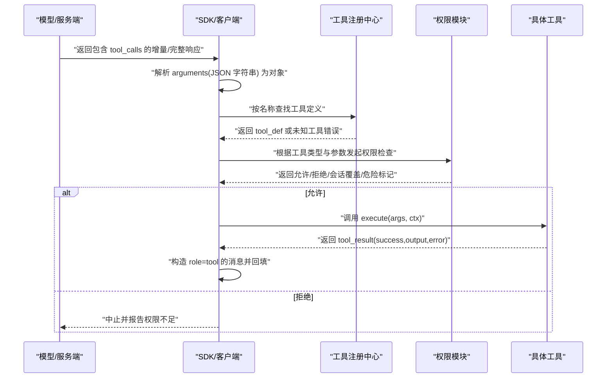
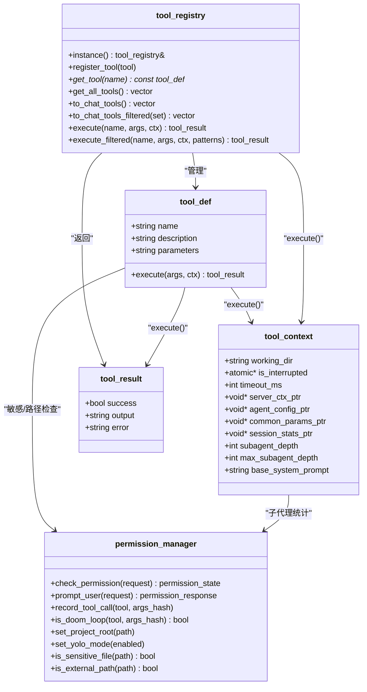

# 自定义工具开发指南

<cite>
**本文引用的文件**
- [tool-registry.h](file://agent/tool-registry.h)
- [tool-registry.cpp](file://agent/tool-registry.cpp)
- [tool-bash.cpp](file://agent/tools/tool-bash.cpp)
- [tool-read.cpp](file://agent/tools/tool-read.cpp)
- [tool-write.cpp](file://agent/tools/tool-write.cpp)
- [tool-glob.cpp](file://agent/tools/tool-glob.cpp)
- [tool-edit.cpp](file://agent/tools/tool-edit.cpp)
- [permission.h](file://agent/permission.h)
- [permission.cpp](file://agent/permission.cpp)
- [SDK.md](file://agent/sdk/SDK.md)
- [sdk-types.h](file://agent/sdk/sdk-types.h)
- [agent-loop.cpp](file://agent/agent-loop.cpp)
</cite>

## 目录
1. [简介](#简介)
2. [项目结构](#项目结构)
3. [核心组件](#核心组件)
4. [架构总览](#架构总览)
5. [详细组件分析](#详细组件分析)
6. [依赖关系分析](#依赖关系分析)
7. [性能考虑](#性能考虑)
8. [故障排查指南](#故障排查指南)
9. [结论](#结论)
10. [附录](#附录)

## 简介
本指南面向希望在本项目中开发自定义工具的工程师，系统讲解从工具定义到注册的完整流程，涵盖 tool_def 结构字段、参数 JSON Schema 编写规范、execute 函数实现要求、工具上下文 tool_context 的使用方法、工具结果 tool_result 的正确返回格式、错误处理最佳实践，并提供文件操作、网络请求、数据库查询等类型的工具开发示例思路与测试调试方法。文档中的所有技术细节均来源于仓库源码与文档，确保可落地与可验证。

## 项目结构
本项目的工具体系围绕工具注册中心与一组内置工具展开，工具注册中心负责工具的注册、查找、过滤与执行；内置工具包括 Bash 命令执行、文件读取/写入/编辑、文件匹配搜索等。权限模块负责安全策略与交互式许可。

图表来源
- [tool-registry.h:44-90](file://agent/tool-registry.h#L44-L90)
- [tool-registry.cpp:11-85](file://agent/tool-registry.cpp#L11-L85)
- [tool-bash.cpp:50-281](file://agent/tools/tool-bash.cpp#L50-L281)
- [tool-read.cpp:17-120](file://agent/tools/tool-read.cpp#L17-L120)
- [tool-write.cpp:10-80](file://agent/tools/tool-write.cpp#L10-L80)
- [tool-glob.cpp:72-181](file://agent/tools/tool-glob.cpp#L72-L181)
- [tool-edit.cpp:69-196](file://agent/tools/tool-edit.cpp#L69-L196)
- [permission.h:40-102](file://agent/permission.h#L40-L102)
- [permission.cpp:34-310](file://agent/permission.cpp#L34-L310)

章节来源
- [tool-registry.h:17-56](file://agent/tool-registry.h#L17-L56)
- [tool-registry.cpp:11-85](file://agent/tool-registry.cpp#L11-L85)
- [tool-bash.cpp:50-281](file://agent/tools/tool-bash.cpp#L50-L281)
- [tool-read.cpp:17-120](file://agent/tools/tool-read.cpp#L17-L120)
- [tool-write.cpp:10-80](file://agent/tools/tool-write.cpp#L10-L80)
- [tool-glob.cpp:72-181](file://agent/tools/tool-glob.cpp#L72-L181)
- [tool-edit.cpp:69-196](file://agent/tools/tool-edit.cpp#L69-L196)
- [permission.h:40-102](file://agent/permission.h#L40-L102)
- [permission.cpp:34-310](file://agent/permission.cpp#L34-L310)

## 核心组件
- 工具注册中心：提供单例访问、工具注册、按名称获取、全量导出、过滤导出、执行与受限执行等能力。
- 工具定义 tool_def：包含名称、描述、参数 JSON Schema 字符串、执行函数指针。
- 工具上下文 tool_context：传递工作目录、中断信号、超时、子代理相关指针与深度限制、系统提示前缀等。
- 工具结果 tool_result：包含成功标志、输出文本、错误信息。
- 权限模块 permission_manager：提供默认策略、交互许可、危险命令白/黑名单、外部路径检测、敏感文件识别、循环调用检测等。

章节来源
- [tool-registry.h:44-90](file://agent/tool-registry.h#L44-L90)
- [tool-registry.cpp:11-85](file://agent/tool-registry.cpp#L11-L85)
- [tool-registry.h:17-56](file://agent/tool-registry.h#L17-L56)
- [permission.h:40-102](file://agent/permission.h#L40-L102)
- [permission.cpp:34-310](file://agent/permission.cpp#L34-L310)

## 架构总览
工具开发遵循“定义-注册-执行-回填”的闭环：模型侧生成工具调用，SDK/客户端解析参数，工具注册中心定位工具并执行，权限模块进行安全检查，执行结果以 role=tool 的消息回填至对话历史，驱动下一轮推理。

图表来源
- [SDK.md:107-127](file://agent/sdk/SDK.md#L107-L127)
- [SDK.md:146-158](file://agent/sdk/SDK.md#L146-L158)
- [tool-registry.cpp:49-85](file://agent/tool-registry.cpp#L49-L85)
- [permission.cpp:108-140](file://agent/permission.cpp#L108-L140)

章节来源
- [SDK.md:107-127](file://agent/sdk/SDK.md#L107-L127)
- [SDK.md:146-158](file://agent/sdk/SDK.md#L146-L158)
- [tool-registry.cpp:49-85](file://agent/tool-registry.cpp#L49-L85)
- [permission.cpp:108-140](file://agent/permission.cpp#L108-L140)

## 详细组件分析

### 工具定义与注册（tool_def、tool_registry、REGISTER_TOOL）
- tool_def 字段
  - name：工具唯一标识，用于注册与调用。
  - description：工具功能描述，便于模型理解。
  - parameters：JSON Schema 字符串，描述参数结构与必填项。
  - execute：函数指针，签名接收 json 参数与 tool_context，返回 tool_result。
- 工具注册中心
  - 单例访问：instance()。
  - 注册：register_tool()。
  - 查找：get_tool()。
  - 导出：to_chat_tools()/to_chat_tools_filtered()，用于与模型侧兼容。
  - 执行：execute()/execute_filtered()，后者支持 Bash 白名单模式。
- 宏注册：REGISTER_TOOL(name, tool_instance)，在编译期自动注册。

章节来源
- [tool-registry.h:44-90](file://agent/tool-registry.h#L44-L90)
- [tool-registry.cpp:6-85](file://agent/tool-registry.cpp#L6-L85)
- [tool-registry.h:92-103](file://agent/tool-registry.h#L92-L103)

### 工具上下文（tool_context）
- working_dir：工作目录，相对路径解析与沙箱边界依据此目录。
- is_interrupted：原子布尔指针，用于外部中断信号。
- timeout_ms：默认超时时间（毫秒），可被工具参数覆盖。
- 子代理相关指针：server_ctx_ptr、agent_config_ptr、common_params_ptr、session_stats_ptr。
- 子代理深度控制：subagent_depth、max_subagent_depth。
- base_system_prompt：系统提示前缀，用于子代理场景最大化 KV 缓存复用。

章节来源
- [tool-registry.h:17-34](file://agent/tool-registry.h#L17-L34)

### 工具结果（tool_result）
- success：布尔值，表示执行是否成功。
- output：字符串，工具输出内容。
- error：字符串，错误信息（为空表示无错误）。

章节来源
- [tool-registry.h:36-41](file://agent/tool-registry.h#L36-L41)

### 参数 JSON Schema 编写规范
- 必须为 JSON Schema 对象，包含 properties 与 required。
- 使用 type: "object"，并在 properties 中声明每个参数的类型、描述与默认值。
- required 列表必须包含所有必填参数。
- 可参考内置工具的 parameters 字段，确保与模型侧期望一致。

章节来源
- [tool-bash.cpp:264-278](file://agent/tools/tool-bash.cpp#L264-L278)
- [tool-read.cpp:99-117](file://agent/tools/tool-read.cpp#L99-L117)
- [tool-write.cpp:62-77](file://agent/tools/tool-write.cpp#L62-L77)
- [tool-glob.cpp:163-178](file://agent/tools/tool-glob.cpp#L163-L178)
- [tool-edit.cpp:171-193](file://agent/tools/tool-edit.cpp#L171-L193)

### execute 函数实现要求
- 输入：args 为 JSON 对象，通过 value("key", default) 安全读取参数。
- 上下文：使用 tool_context 的 working_dir、timeout_ms、is_interrupted 等。
- 输出：返回 tool_result，success 表示是否成功，output 为人类可读结果，error 为空或错误描述。
- 错误处理：对异常捕获并返回失败结果；对非法参数立即返回失败。
- 超时与中断：在长耗时操作中轮询 is_interrupted 与超时，必要时终止进程或线程。
- 安全性：对敏感文件与外部路径进行检查，必要时触发权限请求。

章节来源
- [tool-bash.cpp:50-258](file://agent/tools/tool-bash.cpp#L50-L258)
- [tool-read.cpp:17-93](file://agent/tools/tool-read.cpp#L17-L93)
- [tool-write.cpp:10-57](file://agent/tools/tool-write.cpp#L10-L57)
- [tool-glob.cpp:72-156](file://agent/tools/tool-glob.cpp#L72-L156)
- [tool-edit.cpp:69-164](file://agent/tools/tool-edit.cpp#L69-L164)

### 权限模块（permission_manager）
- 默认策略：不同工具类型有不同的默认许可状态（允许/询问/拒绝）。
- 交互许可：ASK 状态下阻塞等待用户选择“本次允许/本次拒绝/会话内记住/永久拒绝”。
- 危险命令：内置危险 Bash 模式白名单，遇此类命令一律询问。
- 安全路径：相对路径解析到 working_dir，若绝对路径越界则视为外部目录，触发 EXTERNAL_DIR 权限请求。
- 敏感文件：识别常见密钥、证书、凭据文件名与扩展名，直接拒绝或强制询问。
- 循环检测：记录最近若干次工具调用，若相同工具+参数重复多次则拒绝。

章节来源
- [permission.h:40-102](file://agent/permission.h#L40-L102)
- [permission.cpp:34-310](file://agent/permission.cpp#L34-L310)

### 内置工具示例与实现要点

#### Bash 工具（命令执行）
- 参数：command（必填）、timeout（可选，默认使用 tool_context.timeout_ms）。
- 实现要点：跨平台管道读取、超时控制、进程终止、输出截断、退出码与超时标记。
- 安全：通过权限模块判断危险命令；受限模式下按白名单过滤。

章节来源
- [tool-bash.cpp:50-258](file://agent/tools/tool-bash.cpp#L50-L258)
- [tool-bash.cpp:260-281](file://agent/tools/tool-bash.cpp#L260-L281)

#### 文件读取工具（read）
- 参数：file_path（必填）、offset（默认 0）、limit（默认 2000）。
- 实现要点：相对路径转绝对路径；校验文件存在与类型；敏感文件拦截；按行读取并编号输出；限制单行长度与总字符数。

章节来源
- [tool-read.cpp:17-93](file://agent/tools/tool-read.cpp#L17-L93)
- [tool-read.cpp:95-120](file://agent/tools/tool-read.cpp#L95-L120)

#### 文件写入工具（write）
- 参数：file_path（必填）、content（必填）。
- 实现要点：相对路径转绝对路径；创建父目录；二进制写入；失败检测；返回创建/更新信息。

章节来源
- [tool-write.cpp:10-57](file://agent/tools/tool-write.cpp#L10-L57)
- [tool-write.cpp:59-80](file://agent/tools/tool-write.cpp#L59-L80)

#### 文件匹配工具（glob）
- 参数：pattern（必填）、path（默认 working_dir）。
- 实现要点：glob 到正则转换；递归遍历；按修改时间排序；限制返回数量；输出相对路径。

章节来源
- [tool-glob.cpp:72-156](file://agent/tools/tool-glob.cpp#L72-L156)
- [tool-glob.cpp:158-181](file://agent/tools/tool-glob.cpp#L158-L181)

#### 文件编辑工具（edit）
- 参数：file_path（必填）、old_string（必填）、new_string（必填）、replace_all（默认 false）。
- 实现要点：精确匹配（含空白与缩进）；多处匹配需明确上下文或设置 replace_all；生成简单 diff；写回文件并返回变更摘要。

章节来源
- [tool-edit.cpp:69-164](file://agent/tools/tool-edit.cpp#L69-L164)
- [tool-edit.cpp:166-196](file://agent/tools/tool-edit.cpp#L166-L196)

### 工具执行流程与事件
- SDK/客户端解析模型返回的 tool_calls，将 arguments 字符串解析为 JSON。
- 注册中心按名称查找工具，执行 execute 并返回 tool_result。
- SDK 将结果以 role=tool 的消息回填，形成“HTTP 版 agent loop”。

章节来源
- [SDK.md:107-127](file://agent/sdk/SDK.md#L107-L127)
- [SDK.md:146-158](file://agent/sdk/SDK.md#L146-L158)
- [tool-registry.cpp:49-85](file://agent/tool-registry.cpp#L49-L85)

## 依赖关系分析

图表来源
- [tool-registry.h:44-90](file://agent/tool-registry.h#L44-L90)
- [tool-registry.cpp:11-85](file://agent/tool-registry.cpp#L11-L85)
- [tool-registry.h:17-56](file://agent/tool-registry.h#L17-L56)
- [permission.h:40-102](file://agent/permission.h#L40-L102)
- [permission.cpp:34-310](file://agent/permission.cpp#L34-L310)

章节来源
- [tool-registry.h:44-90](file://agent/tool-registry.h#L44-L90)
- [tool-registry.cpp:11-85](file://agent/tool-registry.cpp#L11-L85)
- [tool-registry.h:17-56](file://agent/tool-registry.h#L17-L56)
- [permission.h:40-102](file://agent/permission.h#L40-L102)
- [permission.cpp:34-310](file://agent/permission.cpp#L34-L310)

## 性能考虑
- 输出截断：Bash 工具对输出行数与字符数进行限制，避免过长输出影响性能与显示。
- 超时控制：工具应定期检查超时与中断信号，及时终止长时间运行的任务。
- I/O 优化：文件读取/写入采用二进制模式与分块读取，减少内存占用。
- 权限检查：在执行前进行快速路径检查（如敏感文件、外部路径），避免无效执行。
- 子代理统计：子代理的 token 使用会累加到父会话统计中，便于整体性能监控。

章节来源
- [tool-bash.cpp:25-48](file://agent/tools/tool-bash.cpp#L25-L48)
- [tool-bash.cpp:174-226](file://agent/tools/tool-bash.cpp#L174-L226)
- [tool-read.cpp:14-15](file://agent/tools/tool-read.cpp#L14-L15)
- [tool-write.cpp:42-47](file://agent/tools/tool-write.cpp#L42-L47)
- [agent-loop.cpp:596-629](file://agent/agent-loop.cpp#L596-L629)

## 故障排查指南
- 工具未找到：检查工具名称是否与 tool_def.name 一致，确认已通过 REGISTER_TOOL 注册。
- 参数缺失：确保 parameters JSON Schema 的 required 列表包含必填字段，execute 内部使用 value("key", default) 读取。
- 权限拒绝：查看 permission_manager 的默认策略与交互许可流程，确认是否为危险命令或外部路径。
- Bash 超时/中断：检查 tool_context.timeout_ms 与 is_interrupted，确认工具是否正确轮询。
- 文件操作失败：检查 working_dir 解析、父目录创建、文件打开权限与失败检测。
- 循环调用：若出现反复调用同一工具，permission_manager 会阻止，需调整参数或逻辑。

章节来源
- [tool-registry.cpp:49-60](file://agent/tool-registry.cpp#L49-L60)
- [tool-registry.cpp:62-85](file://agent/tool-registry.cpp#L62-L85)
- [permission.cpp:108-140](file://agent/permission.cpp#L108-L140)
- [permission.cpp:217-223](file://agent/permission.cpp#L217-L223)
- [tool-bash.cpp:94-132](file://agent/tools/tool-bash.cpp#L94-L132)
- [tool-read.cpp:32-51](file://agent/tools/tool-read.cpp#L32-L51)
- [tool-write.cpp:29-51](file://agent/tools/tool-write.cpp#L29-L51)

## 结论
本指南提供了从工具定义到注册、从参数 Schema 编写到 execute 函数实现、从上下文使用到结果返回、从权限安全到性能优化的完整开发路径。内置工具展示了文件操作、命令执行、文件匹配与编辑等典型场景，开发者可据此扩展网络请求、数据库查询等自定义工具。建议在开发过程中严格遵循 JSON Schema 规范、做好错误处理与安全检查，并结合权限模块与超时/中断机制保障稳定性与安全性。

## 附录

### 工具开发步骤清单
- 定义 tool_def：name、description、parameters（JSON Schema 字符串）、execute。
- 实现 execute：安全读取参数、使用 tool_context、处理异常、返回 tool_result。
- 注册工具：使用 REGISTER_TOOL(name, tool_instance)。
- 编写测试：单元测试覆盖参数缺失、权限拒绝、超时中断、文件边界等场景。
- 文档与示例：为工具编写使用说明与调用示例，便于集成到 SDK/客户端。

章节来源
- [tool-registry.h:92-103](file://agent/tool-registry.h#L92-L103)
- [tool-bash.cpp:260-281](file://agent/tools/tool-bash.cpp#L260-L281)
- [tool-read.cpp:95-120](file://agent/tools/tool-read.cpp#L95-L120)
- [tool-write.cpp:59-80](file://agent/tools/tool-write.cpp#L59-L80)
- [tool-glob.cpp:158-181](file://agent/tools/tool-glob.cpp#L158-L181)
- [tool-edit.cpp:166-196](file://agent/tools/tool-edit.cpp#L166-L196)