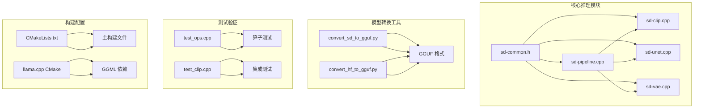
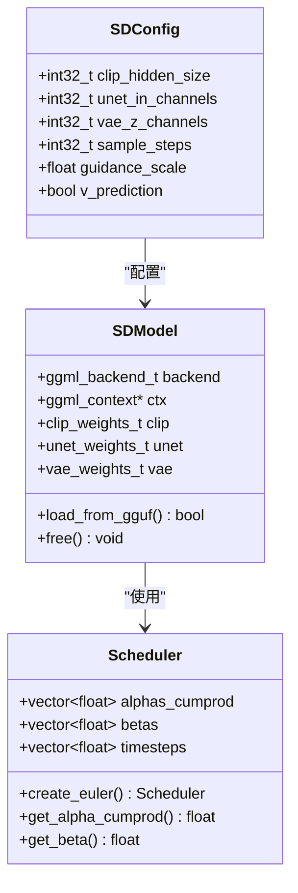
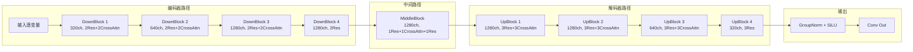
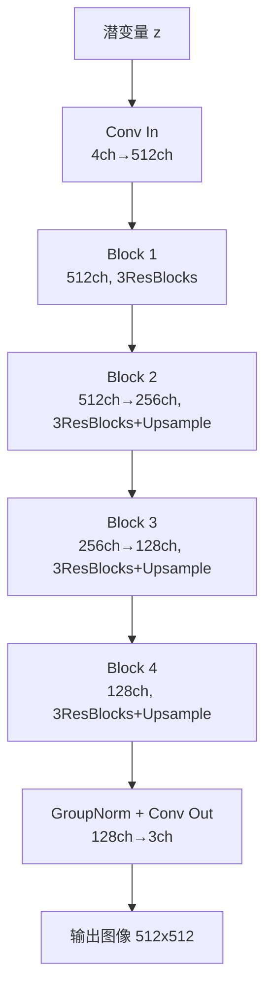
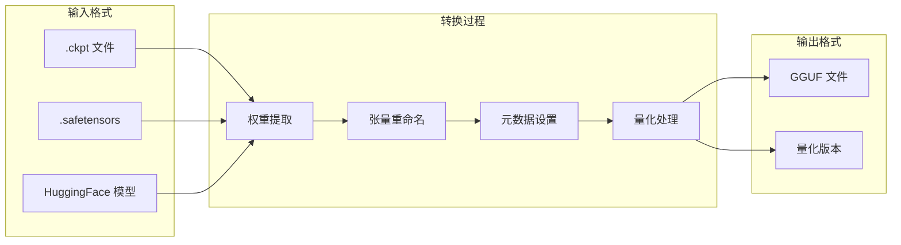
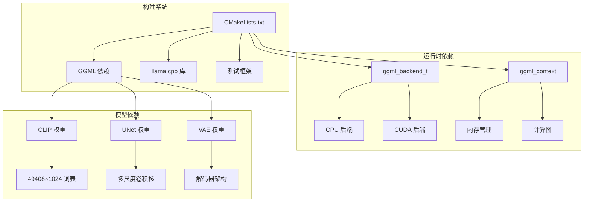
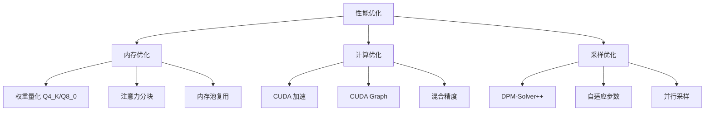
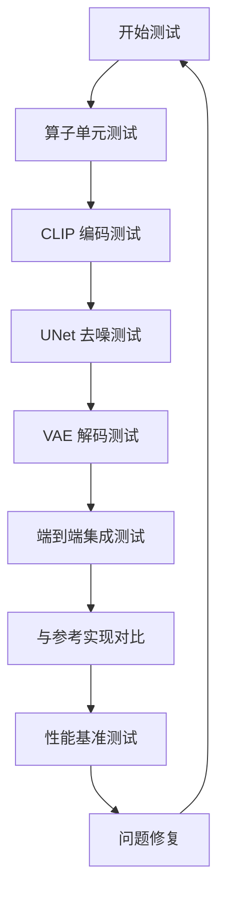

# Stable Diffusion 推理开发指南

<cite>
**本文档引用的文件**
- [sd-inference-development-guide.md](file://docs/sd-inference-development-guide.md)
- [CMakeLists.txt](file://third_party/llama.cpp/CMakeLists.txt)
- [convert_hf_to_gguf.py](file://third_party/llama.cpp/convert_hf_to_gguf.py)
- [qwen3_audio_decoder.cpp](file://third_party/qwen3-tts-cpp/cpp/qwen3_audio_decoder.cpp)
</cite>

## 目录
1. [简介](#简介)
2. [项目结构](#项目结构)
3. [核心组件](#核心组件)
4. [架构概览](#架构概览)
5. [详细组件分析](#详细组件分析)
6. [依赖关系分析](#依赖关系分析)
7. [性能考虑](#性能考虑)
8. [故障排除指南](#故障排除指南)
9. [结论](#结论)
10. [附录](#附录)

## 简介

本指南面向在 GGML/llama.cpp 框架上开发 Stable Diffusion 2.x 模型推理能力的开发者。该系统实现了完整的文生图工作流程，包括：

- **CLIP 文本编码器**：处理文本输入并生成条件嵌入
- **UNet 扩散去噪器**：在潜空间中执行多步去噪
- **VAE 解码器**：将潜变量转换为最终图像

系统采用 v-prediction 目标函数，支持 512x512 和 768x768 分辨率，默认采样步数为 20 步。

## 项目结构



**图表来源**
- [sd-inference-development-guide.md: 366-394:366-394](file://docs/sd-inference-development-guide.md#L366-L394)
- [CMakeLists.txt: 1596-1635:1596-1635](file://third_party/llama.cpp/CMakeLists.txt#L1596-L1635)

**章节来源**
- [sd-inference-development-guide.md: 366-394:366-394](file://docs/sd-inference-development-guide.md#L366-L394)
- [CMakeLists.txt: 1-200:1-200](file://third_party/llama.cpp/CMakeLists.txt#L1-L200)

## 核心组件

### 数据结构设计

系统采用模块化的数据结构设计，每个组件都有清晰的职责划分：



**图表来源**
- [sd-inference-development-guide.md: 611-739:611-739](file://docs/sd-inference-development-guide.md#L611-L739)

### 算子支持矩阵

| 算子类型 | GGML 算子 | SD 需求 | 支持状态 |
|----------|-----------|---------|----------|
| **卷积类** | `GGML_OP_CONV_2D` | Conv2d | ✅ 已支持 |
| | `GGML_OP_CONV_TRANSPOSE_2D` | Upsample Conv | ✅ 已支持 |
| | `GGML_OP_CONV_2D_DW` | Depthwise Conv | ✅ 已支持 |
| | `GGML_OP_IM2COL` | Conv im2col | ✅ 已支持 |
| **归一化** | `GGML_OP_GROUP_NORM` | GroupNorm | ✅ 已支持 |
| | `GGML_OP_NORM` | LayerNorm | ✅ 已支持 |
| **注意力** | `GGML_OP_SOFT_MAX` | Attention | ✅ 已支持 |
| | `GGML_OP_FLASH_ATTN_EXT` | Flash Attn | ✅ 已支持 |
| **激活函数** | `GGML_UNARY_OP_SILU` | SiLU/Swish | ✅ 已支持 |
| | `GGML_UNARY_OP_GELU` | GeGLU | ✅ 已支持 |
| | `GGML_UNARY_OP_SIGMOID` | Gating | ✅ 已支持 |
| **形状操作** | `GGML_OP_RESHAPE` | Reshape | ✅ 已支持 |
| | `GGML_OP_PERMUTE` | Permute | ✅ 已支持 |
| | `GGML_OP_TRANSPOSE` | Transpose | ✅ 已支持 |
| | `GGML_OP_VIEW` | View/Slice | ✅ 已支持 |
| **上下采样** | `GGML_OP_UPSCALE` | Upsample | ✅ 已支持 |
| | `GGML_OP_PAD` | Padding | ✅ 已支持 |
| | `GGML_OP_POOL_2D` | AvgPool | ✅ 已支持 |
| **时间步** | `GGML_OP_TIMESTEP_EMBEDDING` | Timestep | ✅ 已支持 |
| **基础运算** | `GGML_OP_ADD` | Add | ✅ 已支持 |
| | `GGML_OP_MUL` | Multiply | ✅ 已支持 |
| | `GGML_OP_SCALE` | Scale | ✅ 已支持 |
| | `GGML_OP_MUL_MAT` | Linear | ✅ 已支持 |

**章节来源**
- [sd-inference-development-guide.md: 240-277:240-277](file://docs/sd-inference-development-guide.md#L240-L277)

## 架构概览

```mermaid
sequenceDiagram
participant U as 用户
participant P as SDPipeline
participant C as CLIP
participant N as UNet
participant V as VAE
participant S as Scheduler
U->>P : 文本提示词
P->>P : tokenize()
P->>C : encode_text()
C-->>P : 文本嵌入
P->>P : init_random_noise()
loop 采样步数
P->>S : 获取时间步参数
P->>N : unet_forward()
N-->>P : 噪声预测
P->>P : classifier-free guidance
P->>S : euler_step()
end loop
P->>V : decode_latent()
V-->>P : 图像数据
P-->>U : 生成图像
```

**图表来源**
- [sd-inference-development-guide.md: 1127-1308:1127-1308](file://docs/sd-inference-development-guide.md#L1127-L1308)

## 详细组件分析

### CLIP 文本编码器

CLIP 文本编码器采用 32 层 Transformer 架构，支持 OpenCLIP ViT-H/14 或 ViT-bigG/14 模型：

```mermaid
flowchart TD
A[输入文本] --> B[Token Embedding]
B --> C[位置编码]
C --> D[Transformer 层 x32]
subgraph "单层结构"
D --> E[LayerNorm1]
E --> F[自注意力]
F --> G[残差连接]
G --> H[LayerNorm2]
H --> I[FFN (GeGLU)]
I --> J[残差连接]
end
D --> K[最终 LayerNorm]
K --> L[文本投影]
L --> M[输出嵌入 77x1024]
```

**图表来源**
- [sd-inference-development-guide.md: 73-110:73-110](file://docs/sd-inference-development-guide.md#L73-L110)

CLIP 编码器的关键实现要点：
- **注意力机制**：支持 16 个注意力头，隐藏维度 1024
- **FFN 结构**：中间维度 4096，使用 QuickGELU 激活函数
- **层归一化**：在注意力和 FFN 前后分别应用

**章节来源**
- [sd-inference-development-guide.md: 741-800:741-800](file://docs/sd-inference-development-guide.md#L741-L800)

### UNet 扩散去噪器

UNet 采用编码器-解码器架构，支持跳跃连接：



**图表来源**
- [sd-inference-development-guide.md: 115-152:115-152](file://docs/sd-inference-development-guide.md#L115-L152)

UNet 的关键特性：
- **时间嵌入**：1280 维时间步嵌入，通过两层线性变换
- **交叉注意力**：将文本条件注入到每个解码器层级
- **跳跃连接**：编码器特征直接传递到对应的解码器层级

**章节来源**
- [sd-inference-development-guide.md: 854-929:854-929](file://docs/sd-inference-development-guide.md#L854-L929)

### VAE 解码器

VAE 解码器采用渐进式上采样架构：



**图表来源**
- [sd-inference-development-guide.md: 199-234:199-234](file://docs/sd-inference-development-guide.md#L199-L234)

**章节来源**
- [sd-inference-development-guide.md: 197-234:197-234](file://docs/sd-inference-development-guide.md#L197-L234)

### 模型格式转换

系统支持多种模型格式转换，主要采用 GGUF 格式：



**图表来源**
- [sd-inference-development-guide.md: 455-507:455-507](file://docs/sd-inference-development-guide.md#L455-L507)

**章节来源**
- [sd-inference-development-guide.md: 397-403:397-403](file://docs/sd-inference-development-guide.md#L397-L403)

## 依赖关系分析



**图表来源**
- [CMakeLists.txt: 1596-1635:1596-1635](file://third_party/llama.cpp/CMakeLists.txt#L1596-L1635)

**章节来源**
- [CMakeLists.txt: 1596-1635:1596-1635](file://third_party/llama.cpp/CMakeLists.txt#L1596-L1635)

## 性能考虑

### 内存优化策略

系统采用多层次的内存优化策略：

1. **权重量化**：不同组件采用不同的量化策略
2. **注意力优化**：支持 Flash Attention 和分块注意力
3. **内存池管理**：复用计算图和张量缓冲区

### 计算优化技术



**图表来源**
- [sd-inference-development-guide.md: 1395-1477:1395-1477](file://docs/sd-inference-development-guide.md#L1395-L1477)

**章节来源**
- [sd-inference-development-guide.md: 1393-1477:1393-1477](file://docs/sd-inference-development-guide.md#L1393-L1477)

## 故障排除指南

### 常见问题诊断

1. **模型加载失败**
   - 检查 GGUF 文件完整性
   - 验证权重维度匹配
   - 确认后端初始化成功

2. **推理结果异常**
   - 验证注意力计算正确性
   - 检查时间步嵌入生成
   - 确认跳跃连接正确传递

3. **内存不足**
   - 调整量化策略
   - 优化批处理大小
   - 启用内存池复用

### 测试验证流程



**图表来源**
- [sd-inference-development-guide.md: 1483-1591:1483-1591](file://docs/sd-inference-development-guide.md#L1483-L1591)

**章节来源**
- [sd-inference-development-guide.md: 1481-1591:1481-1591](file://docs/sd-inference-development-guide.md#L1481-L1591)

## 结论

本指南提供了在 GGML/llama.cpp 框架上实现 Stable Diffusion 2.x 推理的完整开发方案。通过模块化的设计、完善的算子支持和优化的性能策略，系统能够在 CPU 和 GPU 平台上高效运行。

关键成功因素包括：
- 严格的组件边界设计
- 全面的测试验证体系
- 灵活的性能优化策略
- 清晰的模型转换流程

## 附录

### 开发环境配置

```bash
# 克隆 llama.cpp
git clone https://github.com/ggerganov/llama.cpp.git
cd llama.cpp

# 编译 (启用 CUDA 加速)
mkdir build && cd build
cmake .. -DGGML_CUDA=ON -DCMAKE_BUILD_TYPE=Release
make -j$(nproc)

# 验证 GGML 编译
./bin/llama-cli --help
```

### 模型权重准备

```bash
# 下载 SD2.1 模型
wget https://huggingface.co/stabilityai/stable-diffusion-2-1-base/resolve/main/v2-1_512-ema-pruned.ckpt
wget https://huggingface.co/stabilityai/stable-diffusion-2-1/resolve/main/v2-1_768-ema-pruned.ckpt
```

### 依赖工具安装

```bash
# Python 环境 (用于模型转换)
conda create -n sd_convert python=3.10
conda activate sd_convert

pip install torch torchvision safetensors transformers diffusers omegaconf
pip install gguf  # 用于 GGUF 格式写入
```

**章节来源**
- [sd-inference-development-guide.md: 328-364:328-364](file://docs/sd-inference-development-guide.md#L328-L364)