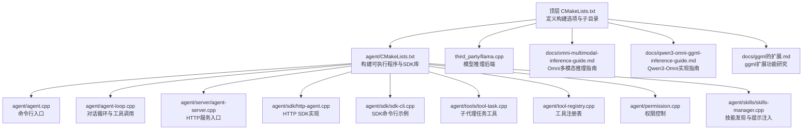
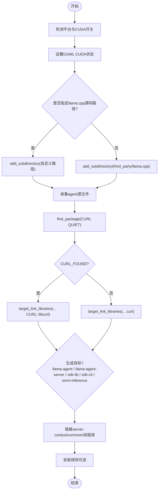
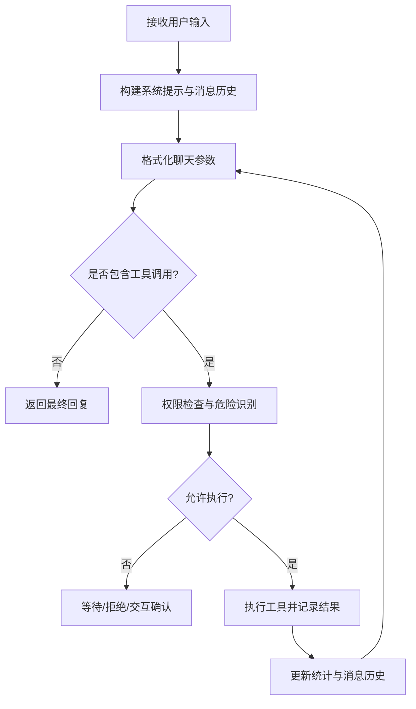
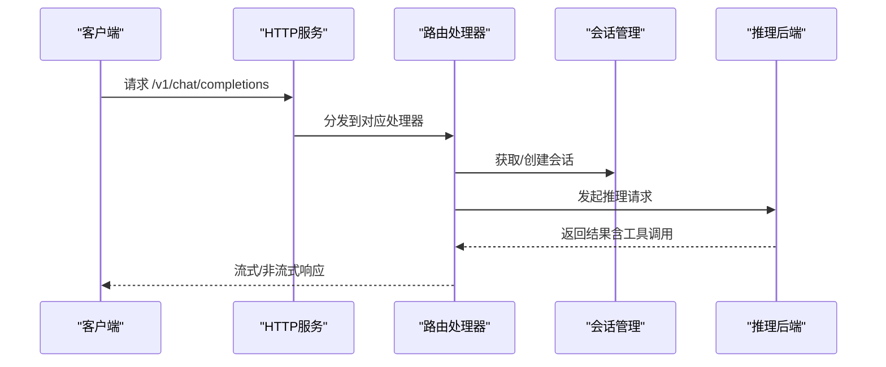
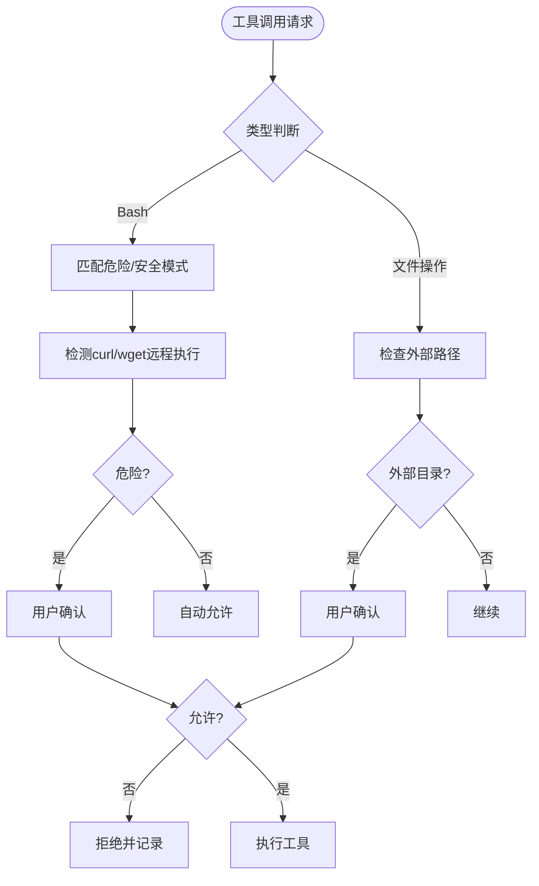
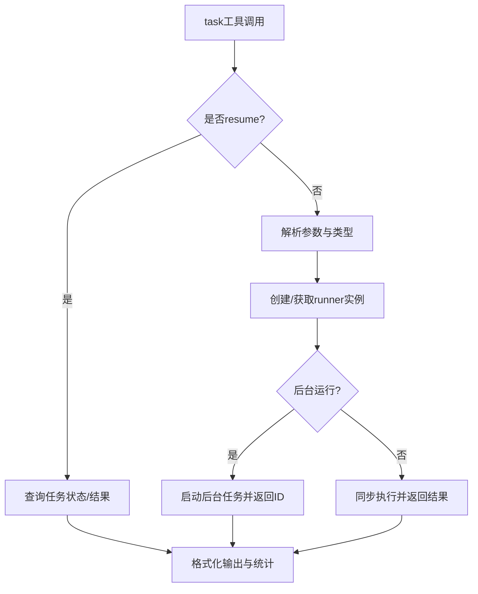
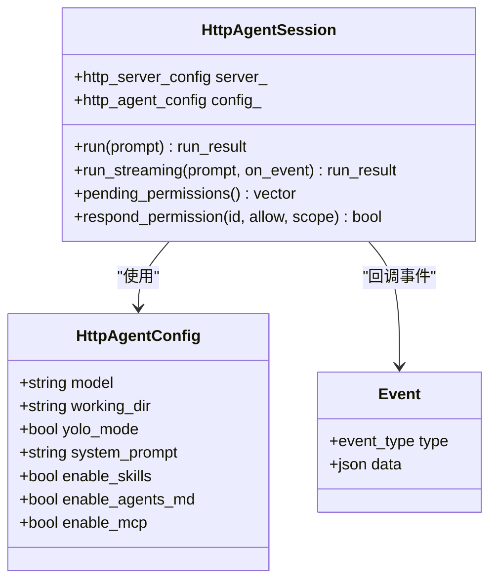
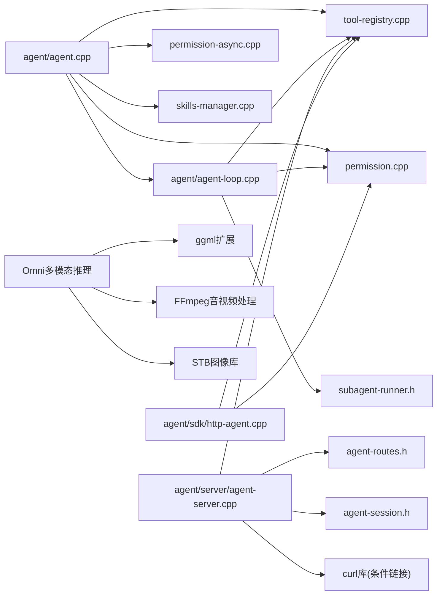

# 开发者指南

<cite>
**本文档引用的文件**
- [CMakeLists.txt](file://CMakeLists.txt)
- [agent/CMakeLists.txt](file://agent/CMakeLists.txt)
- [agent/agent.cpp](file://agent/agent.cpp)
- [agent/agent-loop.cpp](file://agent/agent-loop.cpp)
- [agent/server/agent-server.cpp](file://agent/server/agent-server.cpp)
- [agent/sdk/sdk-cli.cpp](file://agent/sdk/sdk-cli.cpp)
- [agent/sdk/http-agent.cpp](file://agent/sdk/http-agent.cpp)
- [agent/sdk/sdk-types.h](file://agent/sdk/sdk-types.h)
- [agent/tools/tool-task.cpp](file://agent/tools/tool-task.cpp)
- [agent/tool-registry.cpp](file://agent/tool-registry.cpp)
- [agent/permission.cpp](file://agent/permission.cpp)
- [agent/permission-async.cpp](file://agent/permission-async.cpp)
- [agent/skills/skills-manager.cpp](file://agent/skills/skills-manager.cpp)
- [SDKs/python/pyproject.toml](file://SDKs/python/pyproject.toml)
- [SDKs/go/go.mod](file://SDKs/go/go.mod)
- [SDKs/java/pom.xml](file://SDKs/java/pom.xml)
- [SDKs/rust/Cargo.toml](file://SDKs/rust/Cargo.toml)
- [SDKs/typescript/package.json](file://SDKs/typescript/package.json)
- [docs/sd-inference-development-guide.md](file://docs/sd-inference-development-guide.md)
- [docs/omni-multimodal-inference-guide.md](file://docs/omni-multimodal-inference-guide.md)
- [docs/qwen3-omni-ggml-inference-guide.md](file://docs/qwen3-omni-ggml-inference-guide.md)
- [docs/ggml的扩展.md](file://docs/ggml的扩展.md)
- [third_party/llama.cpp/src/llama.cpp](file://third_party/llama.cpp/src/llama.cpp)
</cite>

## 更新摘要
**变更内容**
- 新增Qwen3-Omni多模态推理完整实现指南，包括GGML扩展使用、模型架构详解、GGUF格式转换
- 整合Omni多模态推理开发内容，涵盖文本、图像、音频、视频统一处理架构
- 补充高级ggml扩展功能，包括LoRA支持、注意力机制扩展、运行时管理等
- 更新构建系统以支持Omni推理和多模态扩展
- 增强权限与安全机制，完善多模态输入处理的安全检查

## 目录
1. [简介](#简介)
2. [项目结构](#项目结构)
3. [核心组件](#核心组件)
4. [架构总览](#架构总览)
5. [详细组件分析](#详细组件分析)
6. [Qwen3-Omni多模态推理开发](#qwen3-omni多模态推理开发)
7. [高级ggml扩展功能](#高级ggml扩展功能)
8. [Omni多模态推理实现](#omni多模态推理实现)
9. [依赖关系分析](#依赖关系分析)
10. [性能考虑](#性能考虑)
11. [故障排除指南](#故障排除指南)
12. [结论](#结论)
13. [附录](#附录)

## 简介
本指南面向开发者，帮助您完成环境搭建、编译配置、调试与扩展开发。内容涵盖构建系统（CMake）、依赖管理、多语言SDK（Python/Go/Java/Rust/TypeScript）、权限与安全机制、子代理（Subagent）能力、Qwen3-Omni多模态推理开发、高级ggml扩展使用、Omni模型集成等相关技术内容。文档同时提供开发示例与最佳实践，确保从入门到进阶的完整体验。

## 项目结构
该项目采用模块化设计，核心在 agent 子目录，顶层通过 CMake 组织构建；SDKs 提供多语言客户端封装；third_party 集成 llama.cpp 及相关工具库；docs 目录包含多模态推理开发指南等技术文档。



**图表来源**
- [CMakeLists.txt:1-44](file://CMakeLists.txt#L1-L44)
- [agent/CMakeLists.txt:1-216](file://agent/CMakeLists.txt#L1-L216)

**章节来源**
- [CMakeLists.txt:1-44](file://CMakeLists.txt#L1-L44)
- [agent/CMakeLists.txt:1-216](file://agent/CMakeLists.txt#L1-L216)

## 核心组件
- 构建系统与依赖
  - 顶层 CMakeLists 定义构建选项（CUDA 启用、llama.cpp 源码路径覆盖），并添加 agent 子目录。
  - agent/CMakeLists 负责生成可执行文件（llama-agent、llama-agent-server）、静态库（llama-agent-sdk-lib）与可执行SDK（llama-agent-sdk），并根据平台条件选择性编译工具与MCP支持。
  - **新增** Omni推理支持：在CMake中添加omni-inference目标，支持多模态推理编译。
  - **增强** 条件curl库链接配置，支持CURL::libcurl和传统curl的兼容性处理。
- 运行时核心
  - agent/agent.cpp：命令行交互入口，加载模型、初始化服务器上下文、启动推理线程、解析参数与命令、展示统计信息。
  - agent/agent-loop.cpp：对话主循环，负责构建系统提示、格式化聊天消息、调用推理后端、处理工具调用、权限校验与输出显示。
  - agent/server/agent-server.cpp：HTTP服务入口，提供 OpenAI 兼容接口、会话管理、音频ASR/TTS端点、MCP工具集成。
- 工具与权限
  - agent/tool-registry.cpp：统一注册与执行工具，支持过滤与受限模式。
  - agent/permission.cpp：权限策略（危险命令识别、外部路径检测、重复调用防护、curl/wget远程代码执行检测）、用户交互式确认。
  - agent/permission-async.cpp：异步权限管理，支持并发场景下的权限请求与响应处理。
  - agent/tools/tool-task.cpp：子代理任务工具，支持同步/异步后台任务、结果汇总与统计。
- 多语言SDK
  - agent/sdk/http-agent.cpp：HTTP SDK，封装请求构建、SSE流式事件、权限异步响应、工具调用执行。
  - agent/sdk/sdk-cli.cpp：SDK命令行示例，演示如何连接远程服务、发起会话、处理权限事件。
  - SDKs/python/go/java/rust/typescript：各语言包配置，便于在不同生态中快速集成。

**章节来源**
- [agent/agent.cpp:101-588](file://agent/agent.cpp#L101-L588)
- [agent/agent-loop.cpp:49-788](file://agent/agent-loop.cpp#L49-L788)
- [agent/server/agent-server.cpp:105-731](file://agent/server/agent-server.cpp#L105-L731)
- [agent/tool-registry.cpp:1-86](file://agent/tool-registry.cpp#L1-L86)
- [agent/permission.cpp:35-310](file://agent/permission.cpp#L35-L310)
- [agent/permission-async.cpp:25-224](file://agent/permission-async.cpp#L25-L224)
- [agent/tools/tool-task.cpp:71-257](file://agent/tools/tool-task.cpp#L71-L257)
- [agent/sdk/http-agent.cpp:44-800](file://agent/sdk/http-agent.cpp#L44-L800)
- [agent/sdk/sdk-cli.cpp:62-157](file://agent/sdk/sdk-cli.cpp#L62-L157)

## 架构总览
下图展示了从命令行或HTTP请求进入，到模型推理与工具执行的整体流程，以及SDK层的抽象。

```mermaid
sequenceDiagram
participant CLI as "命令行/SDK"
participant Agent as "agent/agent.cpp"
participant Loop as "agent/agent-loop.cpp"
participant Server as "agent/server/agent-server.cpp"
participant Model as "llama.cpp 推理后端"
participant Tools as "工具注册表/权限"
participant Omni as "Omni多模态推理"
CLI->>Agent : 解析参数/读取提示
Agent->>Loop : 初始化会话与系统提示
alt 命令行模式
Agent->>Model : 加载模型/启动推理线程
Agent->>Loop : 进入主循环
else HTTP服务模式
Server->>Model : 加载模型/启动推理线程
Server->>Loop : 注册路由与会话管理
end
Loop->>Model : 生成补全含工具调用
Model-->>Loop : 返回文本与工具调用
Loop->>Tools : 权限检查/危险命令识别/curl安全检测
Tools-->>Loop : 允许/拒绝/交互确认
Loop->>Tools : 执行工具文件/命令/编辑等
Tools-->>Loop : 返回工具结果
Loop->>Omni : 多模态输入处理与推理
Omni-->>Loop : 返回多模态结果
Loop-->>CLI : 输出最终回复/统计信息
```

**图表来源**
- [agent/agent.cpp:101-588](file://agent/agent.cpp#L101-L588)
- [agent/agent-loop.cpp:333-480](file://agent/agent-loop.cpp#L333-L480)
- [agent/server/agent-server.cpp:256-426](file://agent/server/agent-server.cpp#L256-L426)

## 详细组件分析

### 构建系统与CMake配置
- 顶层配置
  - 启用导出编译命令（用于clangd/VSCode等IDE）。
  - 控制是否启用 CUDA（自动判断平台并在WSL/APPLE上禁用），并影响 ggml 的 CUDA 开关。
  - 支持覆盖 llama.cpp 源码目录，便于本地定制或版本切换。
- agent 子目录
  - 动态收集源文件列表，按平台条件选择性包含工具与MCP实现。
  - 生成多个目标：llama-agent（命令行）、llama-agent-server（HTTP服务）、llama-agent-sdk-lib（静态库）、llama-agent-sdk（命令行SDK）。
  - **新增** Omni推理目标：omni-inference，支持多模态推理编译。
  - **增强** 条件curl库链接配置：使用 `find_package(CURL QUIET)` 检测curl库，优先使用现代CMake目标 `CURL::libcurl`，如未找到则回退到传统 `curl` 库。
  - 链接 server-context、common、线程库与第三方HTTP库（Windows需ws2_32）。



**图表来源**
- [CMakeLists.txt:11-39](file://CMakeLists.txt#L11-L39)
- [agent/CMakeLists.txt:11-61](file://agent/CMakeLists.txt#L11-L61)
- [agent/CMakeLists.txt:133-139](file://agent/CMakeLists.txt#L133-L139)
- [agent/CMakeLists.txt:150-207](file://agent/CMakeLists.txt#L150-L207)

**章节来源**
- [CMakeLists.txt:1-44](file://CMakeLists.txt#L1-L44)
- [agent/CMakeLists.txt:1-216](file://agent/CMakeLists.txt#L1-L216)

### 命令行入口与主循环
- 参数解析与信号处理：支持 --yolo、--no-skills、--no-agents-md、--max-iterations、--max-subagent-depth 等；注册SIGINT/SIGTERM处理，支持ESC中断生成。
- 模型加载与推理线程：加载模型后启动推理循环，支持MCP服务器发现与工具注册（Unix）。
- 技能与AGENTS.md：从项目与用户全局路径发现技能，注入系统提示；支持大型内容警告。
- 交互命令：/exit、/clear、/stats、/tools、/skills、/agents 等；单轮模式与统计展示。

```mermaid
sequenceDiagram
participant Main as "agent/agent.cpp main"
participant Params as "参数解析"
participant Server as "server_context"
participant Loop as "agent_loop"
participant MCP as "MCP管理器"
participant Skills as "技能管理器"
Main->>Params : 解析自定义标志
Main->>Server : 初始化/加载模型
Main->>Loop : 创建agent_loop实例
alt Unix平台
Main->>MCP : 发现配置/启动服务器/注册工具
end
Main->>Skills : 发现技能并生成提示段
Loop->>Loop : 主循环读取输入/生成/工具调用/显示
```

**图表来源**
- [agent/agent.cpp:101-380](file://agent/agent.cpp#L101-L380)
- [agent/agent.cpp:385-567](file://agent/agent.cpp#L385-L567)

**章节来源**
- [agent/agent.cpp:101-588](file://agent/agent.cpp#L101-L588)

### 对话循环与工具执行
- 系统提示构建：包含工具清单、使用指南、示例与项目上下文（AGENTS.md）与技能注入。
- 生成补全：格式化聊天参数，调用推理后端，支持流式与非流式两种模式。
- 工具调用：权限检查（文件路径、危险命令、重复调用、curl远程执行检测）、外部目录限制、交互确认；执行工具并记录耗时与输出。
- 统计与显示：累计输入/输出/缓存令牌数、生成耗时、子代理统计拆分。



**图表来源**
- [agent/agent-loop.cpp:311-480](file://agent/agent-loop.cpp#L311-L480)
- [agent/agent-loop.cpp:482-666](file://agent/agent-loop.cpp#L482-L666)

**章节来源**
- [agent/agent-loop.cpp:49-788](file://agent/agent-loop.cpp#L49-L788)

### HTTP服务与路由
- 路由注册：健康检查、模型列表、聊天补全、嵌入、槽位管理等 OpenAI 兼容端点；会话管理与权限查询。
- 会话管理：创建/获取/删除会话，消息历史与统计查询。
- 音频服务：ASR/TTS 端点占位（当前日志提示未实现），支持模型加载与初始化。
- MCP工具：Unix 平台加载 MCP 配置并注册工具。



**图表来源**
- [agent/server/agent-server.cpp:303-426](file://agent/server/agent-server.cpp#L303-L426)
- [agent/server/agent-server.cpp:428-599](file://agent/server/agent-server.cpp#L428-L599)

**章节来源**
- [agent/server/agent-server.cpp:105-731](file://agent/server/agent-server.cpp#L105-L731)

### 权限与安全机制
- 默认策略：Bash/文件写/编辑需要确认；读/Glob默认允许；外部目录访问需要确认。
- 危险命令识别：破坏性命令、提权、系统损坏、包管理器、Git强制推送等。
- **增强** curl/wget远程代码执行检测：识别 `curl | sh`、`curl | bash`、`wget | sh`、`wget | bash`、`curl -s | sh`、`wget -O - |` 等危险模式。
- 重复调用防护：检测连续相同工具调用，防止"永恒循环"。
- 项目根限制：仅允许在工作目录内操作，敏感文件名/扩展名识别。



**图表来源**
- [agent/permission.cpp:108-140](file://agent/permission.cpp#L108-L140)
- [agent/permission.cpp:142-197](file://agent/permission.cpp#L142-L197)
- [agent/permission.cpp:217-223](file://agent/permission.cpp#L217-L223)
- [agent/permission.cpp:306-310](file://agent/permission.cpp#L306-L310)

**章节来源**
- [agent/permission.cpp:35-310](file://agent/permission.cpp#L35-L310)
- [agent/permission-async.cpp:25-224](file://agent/permission-async.cpp#L25-L224)

### 子代理（Subagent）任务工具
- 任务类型：explore（只读探索）、plan（设计规划）、general（通用任务）、bash（仅命令执行）。
- 同步/异步：支持立即返回任务ID进行后台运行与后续查询。
- 统计聚合：将子代理的令牌用量合并到父会话统计中，支持"主代理=总计-子代理"的展示。



**图表来源**
- [agent/tools/tool-task.cpp:71-208](file://agent/tools/tool-task.cpp#L71-L208)

**章节来源**
- [agent/tools/tool-task.cpp:71-257](file://agent/tools/tool-task.cpp#L71-L257)

### 多语言SDK与集成
- Python/Go/Java/Rust/TypeScript 包配置：定义构建后端、依赖与打包方式。
- HTTP SDK：封装请求体构建、SSE事件解析、权限异步响应、工具执行与统计。
- SDK命令行：演示如何连接远程服务、发起会话、处理权限事件与流式输出。



**图表来源**
- [agent/sdk/http-agent.cpp:44-112](file://agent/sdk/http-agent.cpp#L44-L112)
- [agent/sdk/sdk-types.h:12-59](file://agent/sdk/sdk-types.h#L12-L59)

**章节来源**
- [SDKs/python/pyproject.toml:1-16](file://SDKs/python/pyproject.toml#L1-L16)
- [SDKs/go/go.mod:1-4](file://SDKs/go/go.mod#L1-L4)
- [SDKs/java/pom.xml:1-19](file://SDKs/java/pom.xml#L1-L19)
- [SDKs/rust/Cargo.toml:1-14](file://SDKs/rust/Cargo.toml#L1-L14)
- [SDKs/typescript/package.json:1-18](file://SDKs/typescript/package.json#L1-L18)
- [agent/sdk/http-agent.cpp:44-800](file://agent/sdk/http-agent.cpp#L44-L800)
- [agent/sdk/sdk-cli.cpp:62-157](file://agent/sdk/sdk-cli.cpp#L62-L157)

## Qwen3-Omni多模态推理开发

### 概述与目标
本指南详细介绍了在GGML/llama.cpp框架上实现Qwen3-Omni多模态模型的完整推理能力，包括：
- **统一架构**：能够同时处理文本、图像、音频、视频等多种输入模态
- **跨模态理解**：理解不同模态之间的关联关系
- **原生支持**：真正的端到端训练，不是简单的多模型拼接
- **高级功能**：支持流式多模态输入输出、超长上下文窗口、高效架构设计

### Qwen3-Omni模型架构分析
Qwen3-Omni相比前代Qwen2.5-Omni在以下方面有显著提升：

#### 核心特点
- **更强的多模态理解能力**：统一的跨模态表征学习
- **原生实时交互**：支持流式多模态输入输出
- **超长上下文**：支持256K+上下文窗口
- **高效架构设计**：采用混合注意力机制和MoE结构

#### 支持的模态组合
| 输入组合 | 输出模态 | 典型应用场景 |
|----------|----------|--------------|
| 文本 + 图像 | 文本 | 图像理解、视觉问答 |
| 文本 + 音频 | 文本/音频 | 语音对话、音频分析 |
| 文本 + 视频 | 文本 | 视频内容理解、事件分析 |
| 文本 + 图像 + 音频 | 文本 | 多模态内容综合分析 |
| 纯文本 | 文本 | 传统LLM任务 |

#### 模型规格
**Qwen3-Omni-3B:**
- Thinker配置：hidden_size: 2048, num_hidden_layers: 24, num_attention_heads: 16, intermediate_size: 5632
- Vision配置：hidden_size: 1536, num_hidden_layers: 24, num_attention_heads: 16, image_size: 512, patch_size: 14
- Audio配置：d_model: 768, encoder_layers: 12, encoder_attention_heads: 12, input_feat_per_second: 128

**Qwen3-Omni-7B:**
- Thinker配置：hidden_size: 4096, num_hidden_layers: 32, num_attention_heads: 32, intermediate_size: 11008
- Vision配置：hidden_size: 2048, num_attention_heads: 16, image_size: 512, patch_size: 14
- Audio配置：d_model: 1024, encoder_layers: 16, encoder_attention_heads: 16, input_feat_per_second: 128

### GGUF格式转换
#### 环境准备
```bash
# 克隆 llama.cpp 仓库
git clone https://github.com/ggerganov/llama.cpp.git
cd llama.cpp

# 安装 Python 依赖
pip install torch transformers safetensors sentencepiece protobuf gguf
```

#### 架构枚举定义
在 `gguf/constants.py` 中添加Qwen3-Omni架构支持：
```python
class MODEL_ARCH(IntEnum):
    QWEN2_5_OMNI = auto()      # Qwen2.5-Omni (参考)
    QWEN3_OMNI = auto()        # Qwen3-Omni (新增)

MODEL_ARCH_NAMES: dict[MODEL_ARCH, str] = {
    MODEL_ARCH.QWEN3_OMNI: "qwen3o",
}
```

#### 模型张量定义
在 `gguf/tensor_mapping.py` 中定义Qwen3-Omni的张量映射：
```python
MODEL_TENSORS: dict[MODEL_ARCH, list[MODEL_TENSOR]] = {
    MODEL_ARCH.QWEN3_OMNI: [
        # Thinker (LLM) 部分
        MODEL_TENSOR.TOKEN_EMBD,
        MODEL_TENSOR.OUTPUT_NORM,
        MODEL_TENSOR.OUTPUT,
        MODEL_TENSOR.ATTN_NORM,
        MODEL_TENSOR.ATTN_Q,
        MODEL_TENSOR.ATTN_K,
        MODEL_TENSOR.ATTN_V,
        MODEL_TENSOR.ATTN_OUT,
        MODEL_TENSOR.FFN_NORM,
        MODEL_TENSOR.FFN_GATE,
        MODEL_TENSOR.FFN_DOWN,
        MODEL_TENSOR.FFN_UP,
        
        # Vision Encoder 部分
        MODEL_TENSOR.VISION_EMBD,
        MODEL_TENSOR.VISION_POS_EMBD,
        MODEL_TENSOR.VISION_NORM,
        MODEL_TENSOR.VISION_ATTN_Q,
        MODEL_TENSOR.VISION_ATTN_K,
        MODEL_TENSOR.VISION_ATTN_V,
        MODEL_TENSOR.VISION_ATTN_OUT,
        MODEL_TENSOR.VISION_FFN_DOWN,
        MODEL_TENSOR.VISION_FFN_UP,
        MODEL_TENSOR.VISION_PROJ,
        
        # Audio Encoder 部分
        MODEL_TENSOR.AUDIO_CONV1,
        MODEL_TENSOR.AUDIO_CONV2,
        MODEL_TENSOR.AUDIO_NORM,
        MODEL_TENSOR.AUDIO_ATTN_Q,
        MODEL_TENSOR.AUDIO_ATTN_K,
        MODEL_TENSOR.AUDIO_ATTN_V,
        MODEL_TENSOR.AUDIO_ATTN_OUT,
        MODEL_TENSOR.AUDIO_FFN_DOWN,
        MODEL_TENSOR.AUDIO_FFN_UP,
        MODEL_TENSOR.AUDIO_PROJ,
    ],
}
```

#### 执行转换
```bash
# 基本转换命令
python convert_hf_to_gguf.py /path/to/Qwen3-Omni-3B \
    --outfile /path/to/qwen3-omni-3b-f16.gguf \
    --outtype f16

# 转换为量化格式 (推荐)
python convert_hf_to_gguf.py /path/to/Qwen3-Omni-3B \
    --outfile /path/to/qwen3-omni-3b-q4_k_m.gguf \
    --outtype q4_k_m

# 转换为 Q8 格式 (高质量)
python convert_hf_to_gguf.py /path/to/Qwen3-Omni-7B \
    --outfile /path/to/qwen3-omni-7b-q8_0.gguf \
    --outtype q8_0
```

### C++端架构定义
#### 添加架构枚举
在 `src/llama-arch.h` 中添加Qwen3-Omni支持：
```cpp
enum llm_arch {
    // ... 已有架构 ...
    LLM_ARCH_QWEN2_5_OMNI,    // Qwen2.5-Omni
    LLM_ARCH_QWEN3_OMNI,      // Qwen3-Omni (新增)
    LLM_ARCH_UNKNOWN,
};
```

#### 定义张量布局
在 `src/llama-arch.cpp` 中定义Qwen3-Omni的张量布局：
```cpp
static const std::map<llm_arch, std::vector<llm_tensor>> LLM_TENSOR_NAMES = {
    {
        LLM_ARCH_QWEN3_OMNI, {
            // Thinker (LLM) 部分
            LLM_TENSOR_TOKEN_EMBD,
            LLM_TENSOR_OUTPUT_NORM,
            LLM_TENSOR_OUTPUT,
            LLM_TENSOR_ATTN_NORM,
            LLM_TENSOR_ATTN_Q,
            LLM_TENSOR_ATTN_K,
            LLM_TENSOR_ATTN_V,
            LLM_TENSOR_ATTN_OUT,
            LLM_TENSOR_FFN_NORM,
            LLM_TENSOR_FFN_GATE,
            LLM_TENSOR_FFN_DOWN,
            LLM_TENSOR_FFN_UP,
            
            // Vision Encoder 部分
            LLM_TENSOR_VISION_EMBD,
            LLM_TENSOR_VISION_POS_EMBD,
            LLM_TENSOR_VISION_NORM,
            LLM_TENSOR_VISION_ATTN_Q,
            LLM_TENSOR_VISION_ATTN_K,
            LLM_TENSOR_VISION_ATTN_V,
            LLM_TENSOR_VISION_ATTN_OUT,
            LLM_TENSOR_VISION_FFN_DOWN,
            LLM_TENSOR_VISION_FFN_UP,
            LLM_TENSOR_VISION_PROJ,
            
            // Audio Encoder 部分
            LLM_TENSOR_AUDIO_CONV1,
            LLM_TENSOR_AUDIO_CONV2,
            LLM_TENSOR_AUDIO_NORM,
            LLM_TENSOR_AUDIO_ATTN_Q,
            LLM_TENSOR_AUDIO_ATTN_K,
            LLM_TENSOR_AUDIO_ATTN_V,
            LLM_TENSOR_AUDIO_ATTN_OUT,
            LLM_TENSOR_AUDIO_FFN_DOWN,
            LLM_TENSOR_AUDIO_FFN_UP,
            LLM_TENSOR_AUDIO_PROJ,
        }
    },
};
```

#### 超参数加载
在 `src/llama-model.cpp` 中加载Qwen3-Omni的超参数：
```cpp
case LLM_ARCH_QWEN3_OMNI:
    {
        // Thinker (LLM) 参数
        ml.get_key(LLM_KV_CONTEXT_LENGTH, hparams.n_ctx);
        ml.get_key(LLM_KV_EMBEDDING_LENGTH, hparams.n_embd);
        ml.get_key(LLM_KV_BLOCK_COUNT, hparams.n_layer);
        ml.get_key(LLM_KV_FEED_FORWARD_LENGTH, hparams.n_ff);
        
        // 注意力参数
        ml.get_key(LLM_KV_ATTENTION_HEAD_COUNT, hparams.n_head);
        ml.get_key(LLM_KV_ATTENTION_HEAD_COUNT_KV, hparams.n_head_kv);
        ml.get_key(LLM_KV_ATTENTION_LAYERNORM_RMS_EPS, hparams.f_norm_rms_eps);
        
        // RoPE 参数
        ml.get_key(LLM_KV_ROPE_DIMENSION_COUNT, hparams.n_rot, false);
        ml.get_key(LLM_KV_ROPE_FREQ_BASE, hparams.rope_freq_base, false);
        
        // Vision Encoder 参数
        ml.get_key(LLM_KV_HAS_VISION_ENCODER, has_vision, false);
        if (has_vision) {
            ml.get_key(LLM_KV_VISION_EMBEDDING_LENGTH, hparams.n_embd_vision);
            ml.get_key(LLM_KV_VISION_BLOCK_COUNT, hparams.n_layer_vision);
            ml.get_key(LLM_KV_VISION_PATCH_SIZE, hparams.vision_patch_size);
        }
        
        // Audio Encoder 参数
        ml.get_key(LLM_KV_HAS_AUDIO_ENCODER, has_audio, false);
        if (has_audio) {
            ml.get_key(LLM_KV_AUDIO_EMBEDDING_LENGTH, hparams.n_embd_audio);
            ml.get_key(LLM_KV_AUDIO_BLOCK_COUNT, hparams.n_layer_audio);
            ml.get_key(LLM_KV_AUDIO_NUM_MEL_BINS, hparams.audio_num_mel_bins);
        }
    } break;
```

### GGML计算图实现
#### Thinker LLM计算图
```cpp
struct llm_build_qwen3_omni : public llm_graph_context {
    llm_build_qwen3_omni(const llama_model & model, const llm_graph_params & params) 
        : llm_graph_context(params) {
        
        const auto & hparams = model.hparams;
        const int n_layer = hparams.n_layer;
        
        // 获取输入
        struct ggml_tensor * cur = lctx.get_inp_tokens();
        struct ggml_tensor * inp_pos = lctx.get_inp_pos();
        
        // Token Embedding
        cur = ggml_get_rows(ctx0, model.tok_embd, cur);
        
        // 合并多模态 embeddings (如果有)
        if (lctx.has_vision_input && model.has_vision) {
            struct ggml_tensor * vision_embs = encode_vision(ctx0, model, lctx.vision_input);
            vision_embs = ggml_mul_mat(ctx0, model.vision.proj, vision_embs);
            cur = merge_multimodal_embeddings(ctx0, cur, vision_embs, lctx.vision_indices);
        }
        
        if (lctx.has_audio_input && model.has_audio) {
            struct ggml_tensor * audio_embs = encode_audio(ctx0, model, lctx.audio_input);
            audio_embs = ggml_mul_mat(ctx0, model.audio.proj, audio_embs);
            cur = merge_multimodal_embeddings(ctx0, cur, audio_embs, lctx.audio_indices);
        }
        
        // Transformer Layers
        for (int il = 0; il < n_layer; ++il) {
            // Self-Attention
            struct ggml_tensor * attn_norm = ggml_rms_norm(ctx0, cur, hparams.f_norm_rms_eps);
            attn_norm = ggml_mul(ctx0, attn_norm, model.layers[il].attn_norm);
            
            struct ggml_tensor * Q = ggml_mul_mat(ctx0, model.layers[il].wq, attn_norm);
            struct ggml_tensor * K = ggml_mul_mat(ctx0, model.layers[il].wk, attn_norm);
            struct ggml_tensor * V = ggml_mul_mat(ctx0, model.layers[il].wv, attn_norm);
            
            // RoPE
            Q = ggml_rope_ext(ctx0, Q, inp_pos, nullptr,
                             hparams.n_rot, 0, hparams.rope_freq_base, 0.0f,
                             1.0f, 0.0f, nullptr, GGML_ROPE_TYPE_NEOX);
            K = ggml_rope_ext(ctx0, K, inp_pos, nullptr,
                             hparams.n_rot, 0, hparams.rope_freq_base, 0.0f,
                             1.0f, 0.0f, nullptr, GGML_ROPE_TYPE_NEOX);
            
            // Flash Attention
            struct ggml_tensor * attn_out = ggml_flash_attn_ext(
                ctx0, Q, K, V,
                lctx.get_attn_mask(),
                1.0f / sqrtf(hparams.n_embd_head),
                0.0f, 0.0f
            );
            
            attn_out = ggml_mul_mat(ctx0, model.layers[il].wo, attn_out);
            cur = ggml_add(ctx0, cur, attn_out);  // Residual
            
            // FFN (SwiGLU)
            struct ggml_tensor * ffn_norm = ggml_rms_norm(ctx0, cur, hparams.f_norm_rms_eps);
            ffn_norm = ggml_mul(ctx0, ffn_norm, model.layers[il].ffn_norm);
            
            struct ggml_tensor * gate = ggml_mul_mat(ctx0, model.layers[il].ffn_gate, ffn_norm);
            gate = ggml_silu(ctx0, gate);
            
            struct ggml_tensor * up = ggml_mul_mat(ctx0, model.layers[il].ffn_up, ffn_norm);
            struct ggml_tensor * ffn_inter = ggml_mul(ctx0, gate, up);
            
            struct ggml_tensor * ffn_out = ggml_mul_mat(ctx0, model.layers[il].ffn_down, ffn_inter);
            cur = ggml_add(ctx0, cur, ffn_out);  // Residual
        }
        
        // Output Layer
        cur = ggml_rms_norm(ctx0, cur, hparams.f_norm_rms_eps);
        cur = ggml_mul(ctx0, cur, model.output_norm);
        cur = ggml_mul_mat(ctx0, model.output, cur);
        
        ggml_build_forward_expand(gf, cur);
    }
};
```

#### Vision Encoder实现
```cpp
struct ggml_tensor * encode_vision(
    ggml_context * ctx,
    const llama_model & model,
    const ggml_tensor * images
) {
    const auto & hparams = model.hparams;
    const int n_patches = (hparams.vision_image_size / hparams.vision_patch_size) * 
                          (hparams.vision_image_size / hparams.vision_patch_size);
    
    // 1. Patch Embedding (Conv2D)
    struct ggml_tensor * patches = ggml_conv_2d(
        ctx, model.vision.patch_embd, images,
        hparams.vision_patch_size, hparams.vision_patch_size,
        0, 0, 1, 1
    );
    
    // 2. Reshape & Position Embedding
    patches = ggml_reshape_3d(ctx, patches, hparams.n_embd_vision, n_patches, images->ne[3]);
    patches = ggml_add(ctx, patches, model.vision.pos_embd);
    
    // 3. Vision Transformer Layers
    for (int i = 0; i < hparams.n_layer_vision; i++) {
        struct ggml_tensor * norm = ggml_rms_norm(ctx, patches, hparams.vision_layer_norm_eps);
        norm = ggml_mul(ctx, norm, model.vision.layers[i].norm);
        
        struct ggml_tensor * Q = ggml_mul_mat(ctx, model.vision.layers[i].wq, norm);
        struct ggml_tensor * K = ggml_mul_mat(ctx, model.vision.layers[i].wk, norm);
        struct ggml_tensor * V = ggml_mul_mat(ctx, model.vision.layers[i].wv, norm);
        
        struct ggml_tensor * KQ = ggml_mul_mat(ctx, K, Q);
        KQ = ggml_scale(ctx, KQ, 1.0f / sqrtf(hparams.n_embd_vision_head));
        KQ = ggml_soft_max(ctx, KQ);
        
        struct ggml_tensor * attn_out = ggml_mul_mat(ctx, V, KQ);
        attn_out = ggml_mul_mat(ctx, model.vision.layers[i].wo, attn_out);
        
        patches = ggml_add(ctx, patches, attn_out);
        
        // FFN
        struct ggml_tensor * ffn_norm = ggml_rms_norm(ctx, patches, hparams.vision_layer_norm_eps);
        ffn_norm = ggml_mul(ctx, ffn_norm, model.vision.layers[i].ffn_norm);
        
        struct ggml_tensor * ffn_gate = ggml_mul_mat(ctx, model.vision.layers[i].ffn_gate, ffn_norm);
        ffn_gate = ggml_gelu(ctx, ffn_gate);
        
        struct ggml_tensor * ffn_up = ggml_mul_mat(ctx, model.vision.layers[i].ffn_up, ffn_norm);
        struct ggml_tensor * ffn_out = ggml_mul(ctx, ffn_gate, ffn_up);
        ffn_out = ggml_mul_mat(ctx, model.vision.layers[i].ffn_down, ffn_out);
        
        patches = ggml_add(ctx, patches, ffn_out);
    }
    
    return patches;
};
```

### 多模态输入处理
#### 图像预处理
```cpp
#include "stb_image.h"

ImageInput preprocess_image(const std::string& image_path, int target_size = 512) {
    ImageInput img;
    
    // 1. 加载图像
    int width, height, channels;
    uint8_t* pixel_data = stbi_load(image_path.c_str(), &width, &height, &channels, 3);
    
    // 2. Resize 到目标尺寸
    int resized_width, resized_height;
    float aspect_ratio = static_cast<float>(width) / height;
    
    if (aspect_ratio > 1.0f) {
        resized_width = target_size;
        resized_height = static_cast<int>(target_size / aspect_ratio);
    } else {
        resized_height = target_size;
        resized_width = static_cast<int>(target_size * aspect_ratio);
    }
    
    // 3. 归一化到 [0, 1] 并转换为 tensor [C, H, W]
    img.tensor = new float[3 * resized_height * resized_width];
    for (int c = 0; c < 3; c++) {
        for (int h = 0; h < resized_height; h++) {
            for (int w = 0; w < resized_width; w++) {
                int src_idx = (h * resized_width + w) * 3 + c;
                int dst_idx = c * resized_height * resized_width + h * resized_width + w;
                img.tensor[dst_idx] = pixel_data[src_idx] / 255.0f;
            }
        }
    }
    
    stbi_image_free(pixel_data);
    return img;
}
```

#### 音频预处理
```cpp
#include <subprocess/subprocess.h>

AudioInput preprocess_audio(const std::string& audio_path, int sample_rate = 16000) {
    AudioInput audio;
    
    // 使用 FFmpeg 提取并重采样
    std::string cmd = "ffmpeg -i \"" + audio_path + "\" "
                      "-vn -acodec pcm_s16le -ar " + std::to_string(sample_rate) + 
                      " -ac 1 -f s16le -";
    
    subprocess_s process;
    subprocess_create(cmd.c_str(), subprocess_option_combined_stdout_stderr, &process);
    
    // 读取音频数据
    FILE* stdout = subprocess_stdout(&process);
    std::vector<int16_t> raw_audio;
    int16_t buffer[4096];
    
    while (true) {
        size_t n = fread(buffer, sizeof(int16_t), 4096, stdout);
        if (n == 0) break;
        raw_audio.insert(raw_audio.end(), buffer, buffer + n);
    }
    
    subprocess_destroy(&process);
    
    // 转换为浮点数
    audio.waveform.resize(raw_audio.size());
    for (size_t i = 0; i < raw_audio.size(); i++) {
        audio.waveform[i] = raw_audio[i] / 32768.0f;
    }
    
    // 计算 Mel 语谱图
    compute_mel_spectrogram(audio, 128);
    
    return audio;
}
```

**章节来源**
- [docs/qwen3-omni-ggml-inference-guide.md:1-988](file://docs/qwen3-omni-ggml-inference-guide.md#L1-L988)

## 高级ggml扩展功能

### ggml_extend.hpp扩展功能研究
`ggml_extend.hpp` 是对ggml库的重要扩展文件，提供了大量的高级操作和工具函数，用于支持复杂神经网络计算需求。

#### 基础工具函数
- **内存对齐工具**：`align_up_offset()` 和 `align_up()` 用于计算内存对齐偏移量和对齐后的值
- **日志回调**：`ggml_log_callback_default()` 提供统一的日志处理回调，支持DEBUG、INFO、WARN、ERROR四个级别

#### 张量代数扩展
- **n-模张量-矩阵乘积** (`ggml_ext_mul_n_mode`)：实现张量沿着指定维度与矩阵的乘积操作，这是张量分解中的核心运算
- **Kronecker积** (`ggml_ext_kronecker`)：实现两个张量的Kronecker积（张量积），通过插值和逐元素乘法实现
- **张量拼接** (`ggml_ext_tensor_concat`)：沿指定维度拼接两个张量，支持任意维度（0-3）的拼接

#### LoRA支持
- **LoRA权重合并** (`ggml_ext_merge_lora`)：将LoRA的低秩权重合并回原始权重形状，支持全连接层和卷积层两种模式
- **LoKr前向传播** (`ggml_ext_lokr_forward`)：实现LoKr（Kronecker Product Decomposition）的前向计算，通过两次矩阵乘法实现

#### 图像处理操作
- **图像↔张量转换**：`ggml_tensor_to_sd_image`、`sd_image_to_ggml_tensor`、`sd_image_f32_to_ggml_tensor` 支持多通道和视频帧处理
- **分块处理** (`sd_tiling`)：将大图像分割成小块进行处理，解决显存不足问题，使用smootherstep进行加权混合
- **掩码处理** (`ggml_ext_tensor_apply_mask`)：应用掩码进行图像修复（inpainting），支持不同分辨率的掩码自动缩放
- **分块裁剪与合并**：支持循环填充、重叠区域混合、边界跳过等功能

#### 神经网络层封装
采用面向对象的设计，定义了完整的神经网络层类层次结构：
```
GGMLBlock (基类)
├── UnaryBlock (单输入单输出层)
│   ├── Linear (全连接层)
│   ├── Embedding (嵌入层)
│   ├── Conv2d (2D卷积)
│   ├── Conv3d (3D卷积)
│   ├── LayerNorm (层归一化)
│   └── RMSNorm (均方根归一化)
├── GroupNorm (组归一化)
│   └── GroupNorm32 (32组归一化)
└── MultiheadAttention (多头注意力)
```

#### 注意力机制扩展
- **增强的注意力机制** (`ggml_ext_attention_ext`)：实现了高度优化的多头注意力机制
- **Flash Attention支持**：自动检测是否可以使用Flash Attention，动态padding以匹配硬件要求
- **KV Cache缩放**：避免溢出的KV Cache缩放机制
- **多查询注意力**：支持MQA/GQA，可独立于q的头数
- **两种实现路径**：Flash Attention路径（优先）和标准Attention路径（fallback）

#### 归一化操作
- **Layer Normalization** (`ggml_ext_layer_norm`)：可配置的eps（默认1e-5），支持无weight/bias模式
- **Group Normalization** (`ggml_ext_group_norm`/`ggml_ext_group_norm_32`)：默认32组，自动reshape weight/bias为4D
- **RMS Normalization**：应用于Transformer架构（如LLaMA、Wan）

#### 激活函数
- **SiLU (Swish)线性变体** (`ggml_ext_silu_act`)：实现SwiGLU等门控激活函数
- **GELU (Gaussian Error Linear Unit)** (`ggml_ext_gelu`/`ggml_ext_gelu_quick`)：快速GELU近似版本

#### 卷积操作扩展
- **增强的2D卷积** (`ggml_ext_conv_2d`)：自动scaling（用于量化），支持circular padding，直接/间接算法选择
- **3D卷积封装** (`ggml_ext_conv_3d`/`ggml_ext_conv_3d_nx1x1`)：分离的circular_x/circular_y控制，智能处理circular与普通填充的组合

#### 运行时管理
- **核心类**：`GGMLRunner` 提供完整的模型推理生命周期管理
- **多层级上下文管理**：参数张量上下文（可在CPU）、计算图上下文、缓存张量上下文、卸载中间上下文
- **内存管理**：参数分配、计算图分配、缓存系统、构建时张量
- **异构计算支持**：参数卸载到运行时后端，节省GPU显存，支持更大的模型
- **后端感知优化**：CPU后端设置线程数，GPU后端异步数据传输，Vulkan特殊处理

#### WeightAdapter模式
- **接口**：`WeightAdapter` 在运行时动态修改权重（用于LoRA）
- **核心方法**：`patch_weight()`、`forward_with_lora()`、`get_extra_graph_size()`
- **应用**：LoRA微调、模型合并、实时权重调整

#### 性能优化技术
- **内存优化**：视图而非复制（`ggml_view_4d`），延迟分配（`params.no_alloc = true`），内存复用（`reset_compute_ctx()`）
- **计算优化**：就地操作（`ggml_scale_inplace`、`ggml_add_inplace`），精度控制（`ggml_mul_mat_set_prec`），批量处理
- **并行化**：多线程支持（`ggml_backend_cpu_set_n_threads`），异步操作（`ggml_backend_tensor_get_async`）

**章节来源**
- [docs/ggml的扩展.md:1-771](file://docs/ggml的扩展.md#L1-L771)

## Omni多模态推理实现

### Omni模型概述
Omni（全模态）模型是指能够同时处理**文本、图像、音频、视频**等多种输入模态的AI模型。与传统的单一模态模型相比，Omni模型具有以下特点：

- **统一架构**：使用单个模型处理多种输入
- **跨模态理解**：能够理解不同模态之间的关联
- **任意组合**：支持多种输入的组合（如文本 + 图像 + 音频）
- **原生支持**：不是简单的多模型拼接，而是真正的端到端训练

### 支持的Omni模型类型
| 模型类型 | 输入模态 | 输出模态 | 典型应用场景 |
|----------|----------|----------|--------------|
| Qwen2.5-Omni | 文本 + 图像 + 音频 | 文本 | 多模态内容分析、实时翻译 |
| VoxTral-Mini | 文本 + 音频 | 文本/音频 | 语音助手、音频转录 |
| MiniCPM-O | 文本 + 图像 | 文本/图像 | 图像理解、内容创作 |
| Qwen3-Omni | 文本 + 图像 + 音频 + 视频 | 文本/图像/音频 | 高级多模态应用、视频问答 |

### 模型架构详解
Omni模型采用统一的架构设计，将不同模态的特征对齐到LLM的embedding空间：

```
┌─────────────────────────────────────────────────────────────┐
│                    Omni Model Architecture                   │
├─────────────────────────────────────────────────────────────┤
│                                                              │
│  ┌──────────┐   ┌──────────┐   ┌──────────┐                │
│  │  Text    │   │  Image   │   │  Audio   │                │
│  │  Input   │   │  Input   │   │  Input   │                │
│  └────┬─────┘   └────┬─────┘   └────┬─────┘                │
│       │              │              │                       │
│       ▼              ▼              ▼                       │
│  ┌──────────┐   ┌──────────┐   ┌──────────┐                │
│  │  Token   │   │  Vision  │   │  Audio   │                │
│  │ Embedding│   │ Encoder  │   │ Encoder  │                │
│  └────┬─────┘   └────┬─────┘   └────┬─────┘                │
│       │              │              │                       │
│       └──────────────┼──────────────┘                       │
│                      │                                      │
│                      ▼                                      │
│               ┌─────────────┐                               │
│               │   Modality  │                               │
│               │   Projector │                               │
│               └──────┬──────┘                               │
│                      │                                      │
│                      ▼                                      │
│               ┌─────────────┐                               │
│               │     LLM     │                               │
│               │  (Thinker)  │                               │
│               └──────┬──────┘                               │
│                      │                                      │
│                      ▼                                      │
│               ┌─────────────┐                               │
│               │   Output    │                               │
│               │   Head      │                               │
│               └─────────────┘                               │
│                                                              │
└─────────────────────────────────────────────────────────────┘
```

### FFmpeg音视频预处理
Omni推理需要对音视频输入进行预处理，主要使用FFmpeg工具：

#### 音频预处理流程
```bash
# 使用FFmpeg提取并重采样音频
ffmpeg -i input.wav -vn -acodec pcm_s16le -ar 16000 -ac 1 -f s16le - 2>/dev/null
```

#### 视频帧提取
```bash
# 使用FFmpeg按指定帧率提取视频帧
ffmpeg -i input_video.mp4 -vf "fps=1" frame_%04d.jpg -y
```

#### 预处理参数优化
- **音频采样率**：16kHz（标准语音识别采样率）
- **音频通道**：单声道（mono），减少计算复杂度
- **视频帧率**：0.5-2 FPS（平衡质量与性能）
- **图像分辨率**：512x512（标准视觉模型输入尺寸）

### GGUF格式转换
Omni模型支持GGUF格式，包含详细的元信息和张量命名规范：

#### 元信息
- **版本**：模型版本号
- **分辨率**：512x512或768x768
- **v-prediction标志**：扩散模型预测类型
- **架构标识符**：qwen2.5o或qwen3o

#### 张量命名规范
- **LLM部分**：TOKEN_EMBD、OUTPUT_NORM、ATTN_*、FFN_*等
- **Vision部分**：VISION_EMBD、VISION_POS_EMBD、VISION_ATTN_*、VISION_FFN_*、VISION_PROJ等
- **Audio部分**：AUDIO_CONV*、AUDIO_ATTN_*、AUDIO_FFN_*、AUDIO_PROJ等

### 核心组件实现
#### 数据结构定义
```cpp
// src/omni-common.h
#pragma once

#include "ggml.h"
#include <vector>
#include <string>

namespace omni {

struct OmniConfig {
    // LLM 参数
    int32_t hidden_size = 2048;
    int32_t num_hidden_layers = 24;
    int32_t num_attention_heads = 16;
    
    // Vision 参数
    bool has_vision = true;
    int32_t vision_hidden_size = 1536;
    int32_t vision_patch_size = 14;
    
    // Audio 参数
    bool has_audio = true;
    int32_t audio_hidden_size = 768;
    int32_t audio_num_mel_bins = 128;
};

struct MultimodalInput {
    std::vector<int32_t> tokens;
    std::vector<std::string> image_paths;
    std::string audio_path;
    std::vector<std::string> video_frames;
};

struct OmniModel {
    ggml_backend_t backend;
    ggml_context * ctx;
    
    // LLM 权重
    struct llm_weights_t {
        ggml_tensor * token_embeddings;
        std::vector<layer_t> layers;
        ggml_tensor * output_norm_weight;
    } llm;
    
    // Vision 权重
    struct vision_weights_t {
        ggml_tensor * patch_embeddings;
        ggml_tensor * position_embeddings;
        std::vector<layer_t> layers;
        ggml_tensor * merger_weight;
    } vision;
    
    // Audio 权重
    struct audio_weights_t {
        ggml_tensor * conv1_weight;
        ggml_tensor * conv2_weight;
        std::vector<layer_t> layers;
        ggml_tensor * adapter_weight;
    } audio;
};

} // namespace omni
```

#### Vision Encoder实现
```cpp
ggml_tensor * encode_image(
    ggml_context * ctx,
    const vision_weights_t & weights,
    ggml_tensor * images,
    const OmniConfig & config
) {
    // 1. Patch Embedding
    ggml_tensor * patches = ggml_conv_2d(
        ctx, weights.patch_embeddings, images,
        config.vision_patch_size, config.vision_patch_size,
        0, 0, 1, 1
    );
    
    // 2. Reshape & Add Position
    patches = ggml_reshape_3d(ctx, patches, 
                              config.vision_hidden_size,
                              n_patches, batch_size);
    patches = ggml_add(ctx, patches, weights.position_embeddings);
    
    // 3. Transformer Layers
    for (int i = 0; i < config.vision_num_layers; i++) {
        // Self-Attention + MLP
        // ... 详细实现见前文
    }
    
    // 4. Projector
    return ggml_mul_mat(ctx, weights.merger_weight, patches);
}
```

#### Audio Encoder实现
```cpp
ggml_tensor * encode_audio(
    ggml_context * ctx,
    const audio_weights_t & weights,
    ggml_tensor * mel_spectrogram,
    const OmniConfig & config
) {
    // 1. Convolutional Frontend
    ggml_tensor * features = ggml_conv_1d(ctx, weights.conv1_weight, mel_spectrogram, ...);
    features = ggml_gelu(ctx, features);
    features = ggml_conv_1d(ctx, weights.conv2_weight, features, ...);
    features = ggml_gelu(ctx, features);
    
    // 2. Transformer Layers
    // ...
    
    // 3. Adapter
    return ggml_mul_mat(ctx, weights.adapter_weight, features);
}
```

### 完整推理流程
#### 推理步骤
```
1. 加载 GGUF 模型 → OmniContext.initialize()
2. 预处理输入 → process_multimodal_input()
   - 文本 → Tokenize
   - 图像 → Resize → Normalize → Tensor
   - 音频 → Mel Spectrogram → Tensor
   - 视频 → Extract Frames → 多张图像
3. 编码多模态特征
   - encode_image() → Vision Embeddings
   - encode_audio() → Audio Embeddings
4. 构建完整输入嵌入
   - Concatenate: [Text] + [Vision] + [Audio]
5. LLM 自回归生成
   - Forward Pass → Logits → Sample → Next Token
6. 解码输出 → Detokenize → 文本响应
```

#### 主程序示例
```cpp
int main(int argc, char ** argv) {
    // 1. 解析参数
    std::string model_path = "qwen2.5-omni-3b-q4_k_m.gguf";
    std::string prompt = "描述这张图片";
    std::vector<std::string> images = {"image1.jpg"};
    
    // 2. 初始化模型
    omni::OmniContext ctx;
    ctx.initialize(model_path);
    
    // 3. 准备输入
    omni::MultimodalInput input;
    input.text = prompt;
    input.image_paths = images;
    
    // 4. 生成响应
    auto tokens = ctx.generate(input, 256, 0.7f, 0.9f);
    
    // 5. 输出结果
    std::cout << decode_tokens(tokens) << std::endl;
    
    return 0;
}
```

### 实战示例
#### 视频问答
**任务**：分析视频内容并回答问题

```bash
# 编译程序
cd llama.cpp/build
cmake .. -DGGML_CUDA=ON
make -j$(nproc) omni-inference

# 运行视频问答
./bin/omni-inference \
  -m qwen2.5-omni-3b-q4_k_m.gguf \
  -v input_video.mp4 \
  -p "视频中发生了什么？请用中文描述" \
  --fps 1 \
  -t 512
```

**预期输出**：
```
视频中展示了一位厨师在厨房里烹饪的场景。他正在用炒锅翻炒蔬菜，
动作熟练专业。厨房环境整洁明亮，可以看到各种调料和厨具摆放整齐...
```

#### 音频转录 + 分析
**任务**：转录音频并提供摘要

```bash
./bin/omni-inference \
  -m voxtral-mini-3b-q4_k_m.gguf \
  -a meeting_recording.wav \
  -p "请总结这段会议录音的主要内容" \
  -t 256
```

#### 多图理解
**任务**：分析多张图片的关系

```bash
./bin/omni-inference \
  -m minicpm-o-2_6-q4_k_m.gguf \
  -i frame_001.jpg -i frame_002.jpg -i frame_003.jpg \
  -p "这几张图片展示了什么故事？按顺序描述" \
  -t 512
```

### CMakeLists.txt配置
```cmake
cmake_minimum_required(VERSION 3.14)
project(omni-inference CXX)

set(CMAKE_CXX_STANDARD 17)

# GGML 路径
set(GGML_DIR ${CMAKE_SOURCE_DIR}/../llama.cpp)
add_subdirectory(${GGML_DIR} ggml)

# 可执行文件
add_executable(omni-inference
    src/omni-main.cpp
    src/omni-context.cpp
    src/omni-vision.cpp
    src/omni-audio.cpp
    src/omni-llm.cpp
)

target_include_directories(omni-inference PRIVATE
    ${GGML_DIR}/ggml/include
    ${CMAKE_SOURCE_DIR}/src
)

target_link_libraries(omni-inference PRIVATE
    ggml
    ggml-cpu
    ggml-cuda  # 可选
)
```

### 常见问题
**Q1: 内存不足怎么办？**
- 使用量化模型 (Q4_K_M, Q8_0)
- 减少 batch size
- 降低图像分辨率
- 缩短音频长度

**Q2: 推理速度慢？**
- 启用 CUDA/Metal 加速
- 使用 Flash Attention
- 减少生成的token数量
- 优化FFmpeg预处理参数

**Q3: 如何自定义模型？**
- 修改GGUF转换脚本适配新架构
- 调整OmniConfig参数
- 实现对应的encoder函数

**章节来源**
- [docs/omni-multimodal-inference-guide.md:1-669](file://docs/omni-multimodal-inference-guide.md#L1-L669)

## 依赖关系分析
- 内部依赖
  - agent/agent.cpp 依赖 agent/agent-loop.cpp、tool-registry、permission、skills、subagent-display 等。
  - agent/agent-loop.cpp 依赖 server-context、tool-registry、permission、subagent-runner 等。
  - agent/server/agent-server.cpp 依赖 agent-routes、agent-session、tool-registry、subagent-display 等。
  - agent/sdk/http-agent.cpp 依赖 tool-registry、permission、prompt-builder、mcp-manager。
  - **新增** Omni推理依赖：omni-common.h、omni-context.cpp、omni-vision.cpp、omni-audio.cpp、omni-llm.cpp。
  - **新增** ggml扩展依赖：ggml_extend.hpp、ggml.h、ggml-backend.h。
  - **新增** permission.cpp 和 permission-async.cpp 依赖标准库的字符串匹配功能。
- 外部依赖
  - llama.cpp 推理后端（通过 third_party/llama.cpp）。
  - 第三方HTTP库（cpp-httplib）。
  - **增强** curl库：条件链接配置，支持现代CMake目标和传统库的兼容性。
  - **新增** FFmpeg：用于音视频预处理。
  - **新增** STB图像库：用于图像加载和处理。
  - 平台库（Windows: ws2_32；Unix: 线程库）。



**图表来源**
- [agent/agent.cpp:1-588](file://agent/agent.cpp#L1-588)
- [agent/agent-loop.cpp:1-800](file://agent/agent-loop.cpp#L1-800)
- [agent/server/agent-server.cpp:1-731](file://agent/server/agent-server.cpp#L1-731)
- [agent/sdk/http-agent.cpp:1-800](file://agent/sdk/http-agent.cpp#L1-800)

**章节来源**
- [agent/agent.cpp:1-588](file://agent/agent.cpp#L1-588)
- [agent/agent-loop.cpp:1-800](file://agent/agent-loop.cpp#L1-800)
- [agent/server/agent-server.cpp:1-731](file://agent/server/agent-server.cpp#L1-731)
- [agent/sdk/http-agent.cpp:1-800](file://agent/sdk/http-agent.cpp#L1-800)

## 性能考虑
- 线程与并发
  - 命令行模式下推理在独立线程中运行，避免阻塞主线程。
  - 会话管理与HTTP服务模式下，合理设置 n_parallel 与 KV 统一策略以提升吞吐。
  - **新增** 异步权限管理支持高并发场景，避免权限检查阻塞。
  - **新增** Omni推理支持多线程并行处理，提高多模态输入的处理效率。
- 缓存与统计
  - 使用 KV 缓存前缀共享（子代理继承基础系统提示）提升命中率。
  - 统计输入/输出/缓存令牌与生成耗时，便于定位瓶颈。
  - **新增** 多模态特征缓存：视觉和音频编码结果的缓存机制。
- 工具执行
  - 工具执行带超时控制与耗时统计，避免长时间阻塞。
  - 子代理统计拆分，便于区分主代理与子代理的资源消耗。
  - **增强** curl远程执行检测，防止恶意的远程代码下载执行。
  - **新增** 多模态输入预处理缓存，避免重复的图像和音频处理。
- I/O与网络
  - HTTP SDK 支持流式SSE，降低首字节延迟；合理设置超时与重试策略。
  - **增强** 条件curl库链接，确保网络请求功能的可靠性和兼容性。
  - **新增** FFmpeg预处理优化：使用合适的参数减少处理时间和内存占用。
- 内存管理
  - **新增** GGML运行时管理：GGMLRunner提供完整的内存和缓存管理系统。
  - **新增** 异构计算支持：参数从CPU到GPU的自动卸载和同步。
  - **新增** 内存对齐优化：使用align_up_offset和align_up减少内存碎片。

## 故障排除指南
- 构建失败
  - CUDA 不可用：在 WSL 或 macOS 上默认禁用，可通过环境变量或选项显式开启。
  - llama.cpp 源码路径：若自定义路径不存在或缺少 CMakeLists，将导致 add_subdirectory 失败。
  - Windows 依赖：ws2_32 链接缺失会导致链接错误。
  - **新增** Omni推理依赖：缺少FFmpeg或STB库会导致编译失败。
  - **新增** ggml扩展依赖：缺少ggml扩展头文件会导致编译错误。
  - **新增** curl库缺失：当CURL::libcurl找不到时，系统会回退到传统curl库，如仍失败请检查系统curl开发包安装。
- 运行时问题
  - 权限被拒：检查危险命令模式、外部目录访问与重复调用防护；必要时使用 --yolo（不推荐）。
  - **增强** curl远程执行被拒：系统会拦截curl | sh、wget | bash等危险模式，需要明确授权或修改为安全的下载方式。
  - 工具执行异常：查看工具输出与错误信息；确认工作目录与文件路径正确。
  - 子代理深度限制：超过最大深度会报错，调整 --max-subagent-depth 或减少嵌套。
  - **新增** 多模态推理失败：检查模型文件完整性、输入格式正确性、内存充足性。
  - **新增** FFmpeg处理错误：确认FFmpeg已正确安装，输入文件格式受支持。
  - **新增** ggml扩展错误：检查ggml扩展版本兼容性，确认后端支持情况。
- HTTP服务
  - 健康检查失败：确认模型已加载成功，监听地址与端口无冲突。
  - ASR/TTS：当前端点为占位，需加载相应模型后方可使用。
  - **新增** 网络请求失败：检查curl库链接配置，确认网络访问权限。
  - **新增** 多模态服务异常：检查Omni推理服务状态，确认各模态处理模块正常运行。

**章节来源**
- [CMakeLists.txt:11-28](file://CMakeLists.txt#L11-L28)
- [agent/agent.cpp:272-288](file://agent/agent.cpp#L272-L288)
- [agent/permission.cpp:108-140](file://agent/permission.cpp#L108-L140)
- [agent/permission-async.cpp:25-38](file://agent/permission-async.cpp#L25-L38)
- [agent/tools/tool-task.cpp:77-82](file://agent/tools/tool-task.cpp#L77-L82)
- [agent/server/agent-server.cpp:513-517](file://agent/server/agent-server.cpp#L513-L517)

## 结论
本指南提供了从构建、运行到扩展开发的完整路径。通过理解CMake配置、对话循环与工具执行、权限与安全机制、Qwen3-Omni多模态推理开发、高级ggml扩展使用、Omni模型集成，以及多语言SDK，您可以高效地在本地或服务端部署与扩展该系统，并在不同语言环境中快速集成。新增的多模态推理指南为AI图像生成、语音识别、视频分析等高级应用提供了完整的实现方案。

## 附录

### 开发环境设置
- 必备工具
  - CMake 3.20+、C++17 支持编译器、Git、Python/Node/Go/Rust 环境（按需）。
  - **新增** FFmpeg：用于音视频预处理，支持音频重采样和视频帧提取。
  - **新增** STB图像库：用于图像加载和处理，支持多种图像格式。
  - **新增** curl开发库：用于HTTP请求和网络功能。
- 获取源码
  - 克隆仓库与子模块：确保 third_party/llama.cpp 可用。
- 配置与构建
  - 在构建目录执行：cmake .. && cmake --build . --config Release
  - 可选：-DLLAMA_CPP_AGENT_CUDA=ON（Linux）；-DLLAMA_CPP_SOURCE_DIR_OVERRIDE=/path（自定义llama.cpp路径）
  - **新增** Omni推理：cmake .. -DGGML_CUDA=ON -DGGML_METAL=ON
  - **新增** curl库检测：系统会自动检测并配置curl库链接

**章节来源**
- [CMakeLists.txt:1-44](file://CMakeLists.txt#L1-L44)
- [agent/CMakeLists.txt:1-216](file://agent/CMakeLists.txt#L1-L216)

### 调试与性能分析
- 日志与显示
  - 使用 -v/-vv 设置详细级别；/stats 查看令牌与耗时统计。
  - **新增** Omni推理日志：使用-vv查看多模态输入处理和特征编码的详细信息。
- 中断与取消
  - Ctrl+C 或 ESC 中断生成；会话可清理/重置。
- 性能分析
  - 关注输入/输出令牌比、缓存命中、工具执行耗时；结合子代理统计拆分定位热点。
  - **新增** 多模态性能分析：关注图像预处理、音频特征提取、LLM推理的性能分布。
  - **新增** 内存使用分析：监控ggml内存分配、缓存使用、异构计算内存传输。
  - **新增** curl远程执行监控：通过权限日志查看curl/wget请求的拦截情况。

**章节来源**
- [agent/agent.cpp:385-567](file://agent/agent.cpp#L385-L567)
- [agent/agent-loop.cpp:716-788](file://agent/agent-loop.cpp#L716-L788)

### 扩展开发建议
- 新增工具
  - 在 agent/tools 下新增实现，注册到 tool-registry；注意权限与安全检查。
  - **新增** 多模态工具：实现图像识别、音频分析、视频理解等工具，利用Omni模型能力。
  - **新增** curl远程执行安全：新工具如需网络访问，应避免直接执行curl/wget命令，建议使用安全的HTTP客户端库。
- 新增子代理类型
  - 在 subagent-types 中定义类型与受限工具集；在 tool-task 中扩展调度逻辑。
- 新增SDK语言
  - 参考现有SDK包配置与HTTP SDK实现，保持与OpenAI兼容接口一致。
- **新增** Qwen3-Omni集成
  - 参考docs/qwen3-omni-ggml-inference-guide.md，实现新的多模态推理能力。
  - 遵循现有的权限检查机制，确保模型文件和权重的安全访问。
  - **新增** Omni模型支持：实现不同Omni模型类型的加载和推理逻辑。
  - **新增** ggml扩展集成：利用ggml_extend.hpp提供的高级功能优化推理性能。
- **新增** ggml扩展开发
  - 参考docs/ggml的扩展.md，实现新的张量操作和神经网络层。
  - 遵循现有的内存管理和运行时管理框架，确保性能和稳定性。
  - **新增** 自定义注意力机制：基于ggml_ext_attention_ext实现新的注意力变体。

**章节来源**
- [agent/tool-registry.cpp:11-21](file://agent/tool-registry.cpp#L11-L21)
- [agent/tools/tool-task.cpp:210-257](file://agent/tools/tool-task.cpp#L210-L257)
- [agent/permission.cpp:50-52](file://agent/permission.cpp#L50-L52)
- [agent/permission-async.cpp:27-28](file://agent/permission-async.cpp#L27-L28)
- [docs/qwen3-omni-ggml-inference-guide.md:1-988](file://docs/qwen3-omni-ggml-inference-guide.md#L1-L988)
- [docs/omni-multimodal-inference-guide.md:1-669](file://docs/omni-multimodal-inference-guide.md#L1-L669)
- [docs/ggml的扩展.md:1-771](file://docs/ggml的扩展.md#L1-L771)
- [SDKs/python/pyproject.toml:1-16](file://SDKs/python/pyproject.toml#L1-L16)
- [SDKs/go/go.mod:1-4](file://SDKs/go/go.mod#L1-L4)
- [SDKs/java/pom.xml:1-19](file://SDKs/java/pom.xml#L1-L19)
- [SDKs/rust/Cargo.toml:1-14](file://SDKs/rust/Cargo.toml#L1-L14)
- [SDKs/typescript/package.json:1-18](file://SDKs/typescript/package.json#L1-L18)