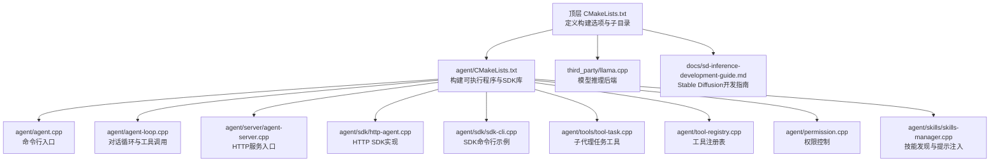
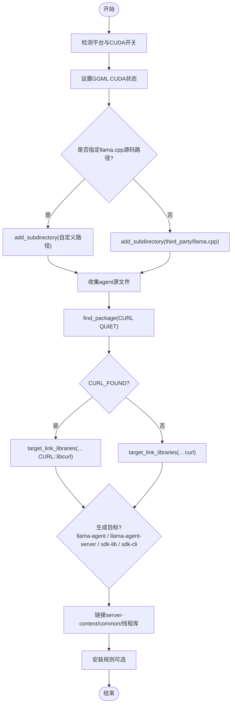
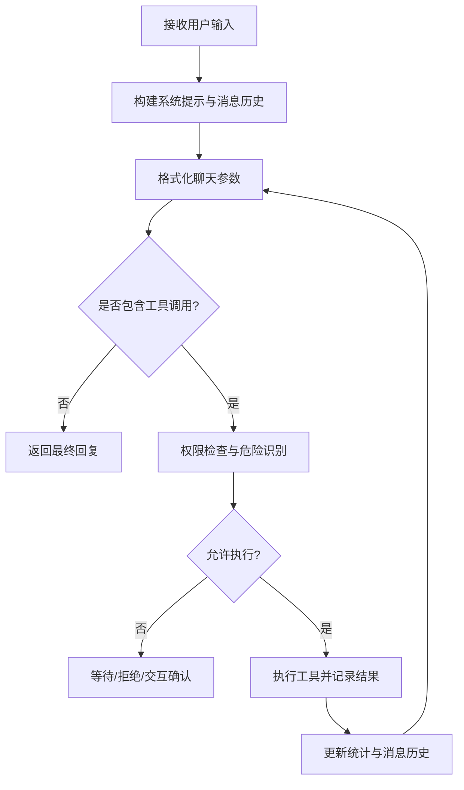
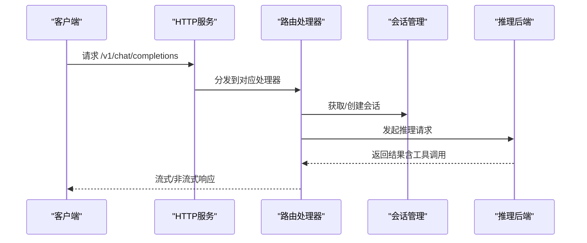
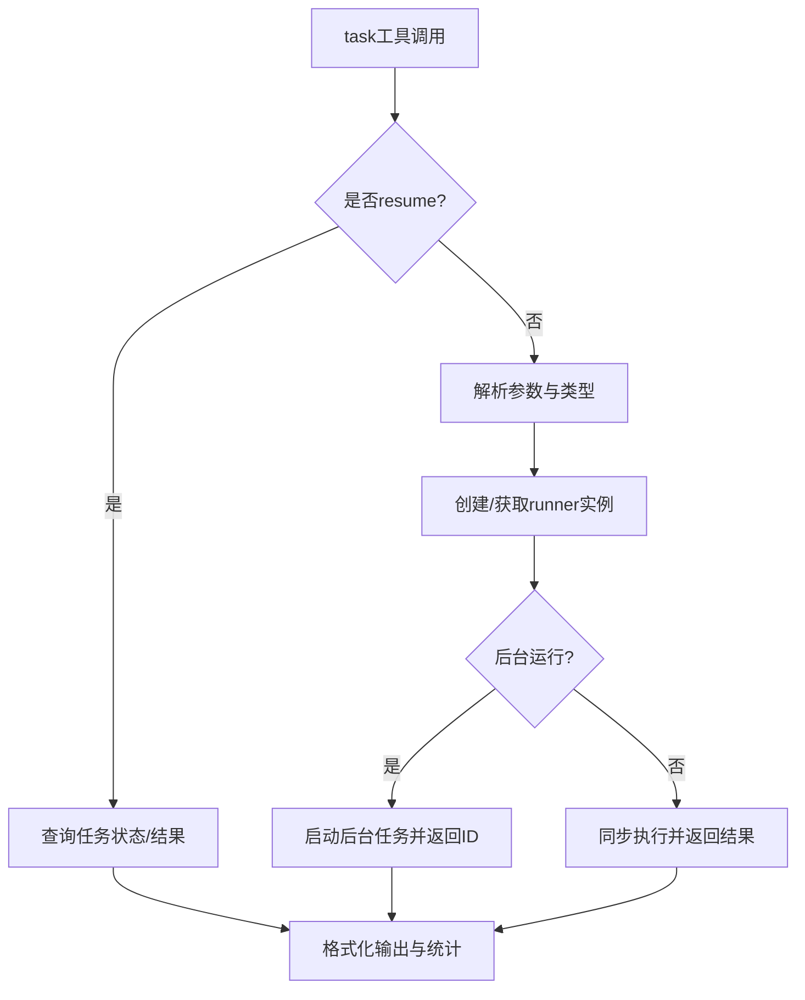
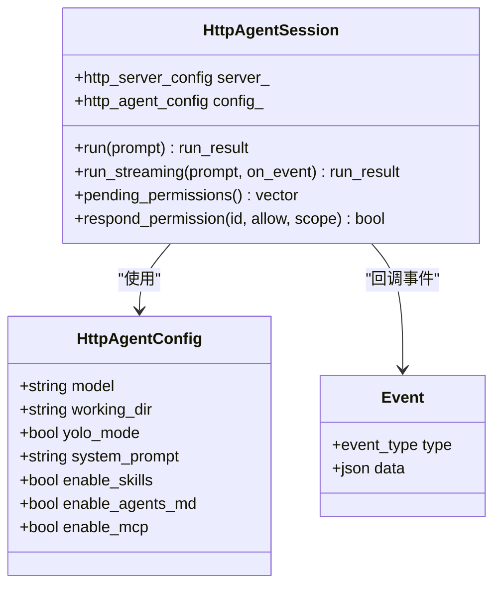
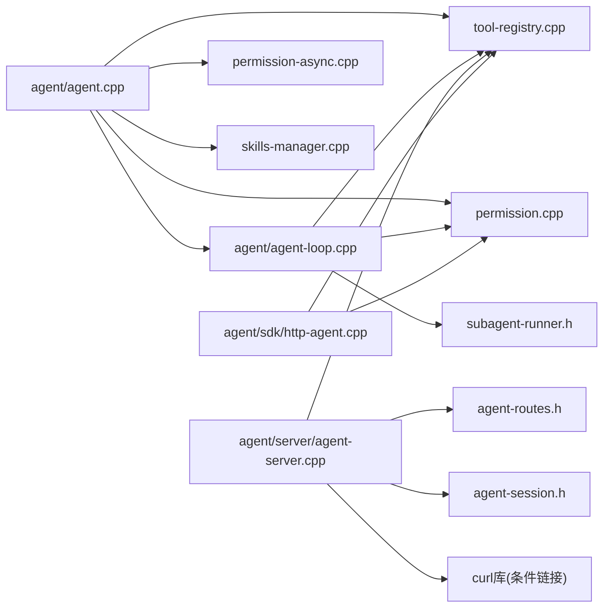

# 开发者指南

<cite>
**本文档引用的文件**
- [CMakeLists.txt](file://CMakeLists.txt)
- [agent/CMakeLists.txt](file://agent/CMakeLists.txt)
- [agent/agent.cpp](file://agent/agent.cpp)
- [agent/agent-loop.cpp](file://agent/agent-loop.cpp)
- [agent/server/agent-server.cpp](file://agent/server/agent-server.cpp)
- [agent/sdk/sdk-cli.cpp](file://agent/sdk/sdk-cli.cpp)
- [agent/sdk/http-agent.cpp](file://agent/sdk/http-agent.cpp)
- [agent/sdk/sdk-types.h](file://agent/sdk/sdk-types.h)
- [agent/tools/tool-task.cpp](file://agent/tools/tool-task.cpp)
- [agent/tool-registry.cpp](file://agent/tool-registry.cpp)
- [agent/permission.cpp](file://agent/permission.cpp)
- [agent/permission-async.cpp](file://agent/permission-async.cpp)
- [agent/skills/skills-manager.cpp](file://agent/skills/skills-manager.cpp)
- [SDKs/python/pyproject.toml](file://SDKs/python/pyproject.toml)
- [SDKs/go/go.mod](file://SDKs/go/go.mod)
- [SDKs/java/pom.xml](file://SDKs/java/pom.xml)
- [SDKs/rust/Cargo.toml](file://SDKs/rust/Cargo.toml)
- [SDKs/typescript/package.json](file://SDKs/typescript/package.json)
- [docs/sd-inference-development-guide.md](file://docs/sd-inference-development-guide.md)
</cite>

## 更新摘要
**变更内容**
- 新增Stable Diffusion推理开发相关内容，包括完整的SD2.x模型架构详解、GGML算子支持分析、模型格式转换、核心组件实现等
- 扩展构建系统文档，详细说明条件curl库链接配置，包括CURL::libcurl和传统curl的兼容性处理
- 增强权限与安全机制，完善对curl/wget远程代码执行的检测与防护

## 目录
1. [简介](#简介)
2. [项目结构](#项目结构)
3. [核心组件](#核心组件)
4. [架构总览](#架构总览)
5. [详细组件分析](#详细组件分析)
6. [Stable Diffusion推理开发](#stable-diffusion推理开发)
7. [依赖关系分析](#依赖关系分析)
8. [性能考虑](#性能考虑)
9. [故障排除指南](#故障排除指南)
10. [结论](#结论)
11. [附录](#附录)

## 简介
本指南面向开发者，帮助您完成环境搭建、编译配置、调试与扩展开发。内容涵盖构建系统（CMake）、依赖管理、多语言SDK（Python/Go/Java/Rust/TypeScript）、权限与安全机制、子代理（Subagent）能力、Stable Diffusion推理开发等内容。文档同时提供开发示例与最佳实践，确保从入门到进阶的完整体验。

## 项目结构
该项目采用模块化设计，核心在 agent 子目录，顶层通过 CMake 组织构建；SDKs 提供多语言客户端封装；third_party 集成 llama.cpp 及相关工具库；docs 目录包含Stable Diffusion推理开发指南等技术文档。



**图表来源**
- [CMakeLists.txt:1-44](file://CMakeLists.txt#L1-L44)
- [agent/CMakeLists.txt:1-216](file://agent/CMakeLists.txt#L1-L216)

**章节来源**
- [CMakeLists.txt:1-44](file://CMakeLists.txt#L1-L44)
- [agent/CMakeLists.txt:1-216](file://agent/CMakeLists.txt#L1-L216)

## 核心组件
- 构建系统与依赖
  - 顶层 CMakeLists 定义构建选项（CUDA 启用、llama.cpp 源码路径覆盖），并添加 agent 子目录。
  - agent/CMakeLists 负责生成可执行文件（llama-agent、llama-agent-server）、静态库（llama-agent-sdk-lib）与可执行SDK（llama-agent-sdk），并根据平台条件选择性编译工具与MCP支持。
  - **新增** 条件curl库链接配置，支持CURL::libcurl和传统curl的兼容性处理。
- 运行时核心
  - agent/agent.cpp：命令行交互入口，加载模型、初始化服务器上下文、启动推理线程、解析参数与命令、展示统计信息。
  - agent/agent-loop.cpp：对话主循环，负责构建系统提示、格式化聊天消息、调用推理后端、处理工具调用、权限校验与输出显示。
  - agent/server/agent-server.cpp：HTTP服务入口，提供 OpenAI 兼容接口、会话管理、音频ASR/TTS端点、MCP工具集成。
- 工具与权限
  - agent/tool-registry.cpp：统一注册与执行工具，支持过滤与受限模式。
  - agent/permission.cpp：权限策略（危险命令识别、外部路径检测、重复调用防护、curl/wget远程代码执行检测）、用户交互式确认。
  - agent/permission-async.cpp：异步权限管理，支持并发场景下的权限请求与响应处理。
  - agent/tools/tool-task.cpp：子代理任务工具，支持同步/异步后台任务、结果汇总与统计。
- 多语言SDK
  - agent/sdk/http-agent.cpp：HTTP SDK，封装请求构建、SSE流式事件、权限异步响应、工具调用执行。
  - agent/sdk/sdk-cli.cpp：SDK命令行示例，演示如何连接远程服务、发起会话、处理权限事件。
  - SDKs/python/go/java/rust/typescript：各语言包配置，便于在不同生态中快速集成。

**章节来源**
- [agent/agent.cpp:101-588](file://agent/agent.cpp#L101-L588)
- [agent/agent-loop.cpp:49-788](file://agent/agent-loop.cpp#L49-L788)
- [agent/server/agent-server.cpp:105-731](file://agent/server/agent-server.cpp#L105-L731)
- [agent/tool-registry.cpp:1-86](file://agent/tool-registry.cpp#L1-L86)
- [agent/permission.cpp:35-310](file://agent/permission.cpp#L35-L310)
- [agent/permission-async.cpp:25-224](file://agent/permission-async.cpp#L25-L224)
- [agent/tools/tool-task.cpp:71-257](file://agent/tools/tool-task.cpp#L71-L257)
- [agent/sdk/http-agent.cpp:44-800](file://agent/sdk/http-agent.cpp#L44-L800)
- [agent/sdk/sdk-cli.cpp:62-157](file://agent/sdk/sdk-cli.cpp#L62-L157)

## 架构总览
下图展示了从命令行或HTTP请求进入，到模型推理与工具执行的整体流程，以及SDK层的抽象。

```mermaid
sequenceDiagram
participant CLI as "命令行/SDK"
participant Agent as "agent/agent.cpp"
participant Loop as "agent/agent-loop.cpp"
participant Server as "agent/server/agent-server.cpp"
participant Model as "llama.cpp 推理后端"
participant Tools as "工具注册表/权限"
CLI->>Agent : 解析参数/读取提示
Agent->>Loop : 初始化会话与系统提示
alt 命令行模式
Agent->>Model : 加载模型/启动推理线程
Agent->>Loop : 进入主循环
else HTTP服务模式
Server->>Model : 加载模型/启动推理线程
Server->>Loop : 注册路由与会话管理
end
Loop->>Model : 生成补全含工具调用
Model-->>Loop : 返回文本与工具调用
Loop->>Tools : 权限检查/危险命令识别/curl安全检测
Tools-->>Loop : 允许/拒绝/交互确认
Loop->>Tools : 执行工具文件/命令/编辑等
Tools-->>Loop : 返回工具结果
Loop-->>CLI : 输出最终回复/统计信息
```

**图表来源**
- [agent/agent.cpp:101-588](file://agent/agent.cpp#L101-L588)
- [agent/agent-loop.cpp:333-480](file://agent/agent-loop.cpp#L333-L480)
- [agent/server/agent-server.cpp:256-426](file://agent/server/agent-server.cpp#L256-L426)

## 详细组件分析

### 构建系统与CMake配置
- 顶层配置
  - 启用导出编译命令（用于clangd/VSCode等IDE）。
  - 控制是否启用 CUDA（自动判断平台并在WSL/APPLE上禁用），并影响 ggml 的 CUDA 开关。
  - 支持覆盖 llama.cpp 源码目录，便于本地定制或版本切换。
- agent 子目录
  - 动态收集源文件列表，按平台条件选择性包含工具与MCP实现。
  - 生成多个目标：llama-agent（命令行）、llama-agent-server（HTTP服务）、llama-agent-sdk-lib（静态库）、llama-agent-sdk（命令行SDK）。
  - **增强** 条件curl库链接配置：使用 `find_package(CURL QUIET)` 检测curl库，优先使用现代CMake目标 `CURL::libcurl`，如未找到则回退到传统 `curl` 库。
  - 链接 server-context、common、线程库与第三方HTTP库（Windows需ws2_32）。



**图表来源**
- [CMakeLists.txt:11-39](file://CMakeLists.txt#L11-L39)
- [agent/CMakeLists.txt:11-61](file://agent/CMakeLists.txt#L11-L61)
- [agent/CMakeLists.txt:133-139](file://agent/CMakeLists.txt#L133-L139)
- [agent/CMakeLists.txt:150-207](file://agent/CMakeLists.txt#L150-L207)

**章节来源**
- [CMakeLists.txt:1-44](file://CMakeLists.txt#L1-L44)
- [agent/CMakeLists.txt:1-216](file://agent/CMakeLists.txt#L1-L216)

### 命令行入口与主循环
- 参数解析与信号处理：支持 --yolo、--no-skills、--no-agents-md、--max-iterations、--max-subagent-depth 等；注册SIGINT/SIGTERM处理，支持ESC中断生成。
- 模型加载与推理线程：加载模型后启动推理循环，支持MCP服务器发现与工具注册（Unix）。
- 技能与AGENTS.md：从项目与用户全局路径发现技能，注入系统提示；支持大型内容警告。
- 交互命令：/exit、/clear、/stats、/tools、/skills、/agents 等；单轮模式与统计展示。

```mermaid
sequenceDiagram
participant Main as "agent/agent.cpp main"
participant Params as "参数解析"
participant Server as "server_context"
participant Loop as "agent_loop"
participant MCP as "MCP管理器"
participant Skills as "技能管理器"
Main->>Params : 解析自定义标志
Main->>Server : 初始化/加载模型
Main->>Loop : 创建agent_loop实例
alt Unix平台
Main->>MCP : 发现配置/启动服务器/注册工具
end
Main->>Skills : 发现技能并生成提示段
Loop->>Loop : 主循环读取输入/生成/工具调用/显示
```

**图表来源**
- [agent/agent.cpp:101-380](file://agent/agent.cpp#L101-L380)
- [agent/agent.cpp:385-567](file://agent/agent.cpp#L385-L567)

**章节来源**
- [agent/agent.cpp:101-588](file://agent/agent.cpp#L101-L588)

### 对话循环与工具执行
- 系统提示构建：包含工具清单、使用指南、示例与项目上下文（AGENTS.md）与技能注入。
- 生成补全：格式化聊天参数，调用推理后端，支持流式与非流式两种模式。
- 工具调用：权限检查（文件路径、危险命令、重复调用、curl远程执行检测）、外部目录限制、交互确认；执行工具并记录耗时与输出。
- 统计与显示：累计输入/输出/缓存令牌数、生成耗时、子代理统计拆分。



**图表来源**
- [agent/agent-loop.cpp:311-480](file://agent/agent-loop.cpp#L311-L480)
- [agent/agent-loop.cpp:482-666](file://agent/agent-loop.cpp#L482-L666)

**章节来源**
- [agent/agent-loop.cpp:49-788](file://agent/agent-loop.cpp#L49-L788)

### HTTP服务与路由
- 路由注册：健康检查、模型列表、聊天补全、嵌入、槽位管理等 OpenAI 兼容端点；会话管理与权限查询。
- 会话管理：创建/获取/删除会话，消息历史与统计查询。
- 音频服务：ASR/TTS 端点占位（当前日志提示未实现），支持模型加载与初始化。
- MCP工具：Unix 平台加载 MCP 配置并注册工具。



**图表来源**
- [agent/server/agent-server.cpp:303-426](file://agent/server/agent-server.cpp#L303-L426)
- [agent/server/agent-server.cpp:428-599](file://agent/server/agent-server.cpp#L428-L599)

**章节来源**
- [agent/server/agent-server.cpp:105-731](file://agent/server/agent-server.cpp#L105-L731)

### 权限与安全机制
- 默认策略：Bash/文件写/编辑需要确认；读/Glob默认允许；外部目录访问需要确认。
- 危险命令识别：破坏性命令、提权、系统损坏、包管理器、Git强制推送等。
- **增强** curl/wget远程代码执行检测：识别 `curl | sh`、`curl | bash`、`wget | sh`、`wget | bash`、`curl -s | sh`、`wget -O - |` 等危险模式。
- 重复调用防护：检测连续相同工具调用，防止"永恒循环"。
- 项目根限制：仅允许在工作目录内操作，敏感文件名/扩展名识别。


**图表来源**
- [agent/permission.cpp:108-140](file://agent/permission.cpp#L108-L140)
- [agent/permission.cpp:142-197](file://agent/permission.cpp#L142-L197)
- [agent/permission.cpp:217-223](file://agent/permission.cpp#L217-L223)
- [agent/permission.cpp:306-310](file://agent/permission.cpp#L306-L310)

**章节来源**
- [agent/permission.cpp:35-310](file://agent/permission.cpp#L35-L310)
- [agent/permission-async.cpp:25-224](file://agent/permission-async.cpp#L25-L224)

### 子代理（Subagent）任务工具
- 任务类型：explore（只读探索）、plan（设计规划）、general（通用任务）、bash（仅命令执行）。
- 同步/异步：支持立即返回任务ID进行后台运行与后续查询。
- 统计聚合：将子代理的令牌用量合并到父会话统计中，支持"主代理=总计-子代理"的展示。



**图表来源**
- [agent/tools/tool-task.cpp:71-208](file://agent/tools/tool-task.cpp#L71-L208)

**章节来源**
- [agent/tools/tool-task.cpp:71-257](file://agent/tools/tool-task.cpp#L71-L257)

### 多语言SDK与集成
- Python/Go/Java/Rust/TypeScript 包配置：定义构建后端、依赖与打包方式。
- HTTP SDK：封装请求体构建、SSE事件解析、权限异步响应、工具执行与统计。
- SDK命令行：演示如何连接远程服务、发起会话、处理权限事件与流式输出。



**图表来源**
- [agent/sdk/http-agent.cpp:44-112](file://agent/sdk/http-agent.cpp#L44-L112)
- [agent/sdk/sdk-types.h:12-59](file://agent/sdk/sdk-types.h#L12-L59)

**章节来源**
- [SDKs/python/pyproject.toml:1-16](file://SDKs/python/pyproject.toml#L1-L16)
- [SDKs/go/go.mod:1-4](file://SDKs/go/go.mod#L1-L4)
- [SDKs/java/pom.xml:1-19](file://SDKs/java/pom.xml#L1-L19)
- [SDKs/rust/Cargo.toml:1-14](file://SDKs/rust/Cargo.toml#L1-L14)
- [SDKs/typescript/package.json:1-18](file://SDKs/typescript/package.json#L1-L18)
- [agent/sdk/http-agent.cpp:44-800](file://agent/sdk/http-agent.cpp#L44-L800)
- [agent/sdk/sdk-cli.cpp:62-157](file://agent/sdk/sdk-cli.cpp#L62-L157)

## Stable Diffusion推理开发

### 概述与目标
本指南详细介绍了在 GGML/llama.cpp 框架上实现 Stable Diffusion 2.x 模型的完整推理能力，包括：
- Text Encoder (CLIP ViT-L/14)
- UNet (Latent Diffusion Model)  
- VAE Decoder

### SD2.x 模型架构详解
Stable Diffusion 2.x 相比 SD1.x 的主要改进：
- Text Encoder：从 CLIP ViT-L/14 (OpenAI) 升级到 OpenCLIP ViT-H/14 或 ViT-bigG/14
- Text Embedding 维度：从 768 增加到 1024 (ViT-H) 或 1280 (ViT-bigG)
- 默认分辨率：保持 512x512 或支持 768x768
- UNet 结构：采用 v-prediction 目标
- VAE：相同结构但使用不同的权重

### GGML 算子支持分析
已支持的算子清单：
- **卷积类**：`GGML_OP_CONV_2D`、`GGML_OP_CONV_TRANSPOSE_2D`、`GGML_OP_CONV_2D_DW`、`GGML_OP_IM2COL`
- **归一化**：`GGML_OP_GROUP_NORM`、`GGML_OP_NORM`
- **注意力**：`GGML_OP_SOFT_MAX`、`GGML_OP_FLASH_ATTN_EXT`
- **激活函数**：`GGML_UNARY_OP_SILU`、`GGML_UNARY_OP_GELU`、`GGML_UNARY_OP_SIGMOID`
- **形状操作**：`GGML_OP_RESHAPE`、`GGML_OP_PERMUTE`、`GGML_OP_TRANSPOSE`、`GGML_OP_VIEW`
- **上下采样**：`GGML_OP_UPSCALE`、`GGML_OP_PAD`、`GGML_OP_POOL_2D`
- **时间步**：`GGML_OP_TIMESTEP_EMBEDDING`
- **基础运算**：`GGML_OP_ADD`、`GGML_OP_MUL`、`GGML_OP_SCALE`、`GGML_OP_MUL_MAT`

### 模型格式转换
支持 GGUF 格式，包含元信息和张量命名规范：
- 元信息：版本、分辨率、v-prediction 标志
- CLIP：隐藏维度、中间维度、注意力头数、层数、词汇表大小、最大位置嵌入
- UNet：输入输出通道、样本大小、交叉注意力维度、注意力头维度
- VAE：z 通道、输入输出通道、通道倍增、残差块数量

### 核心组件实现
- **CLIP Text Encoder**：实现 ViT-H/14 架构，包含 32 层 Transformer，支持快速 GELU 激活
- **UNet Denoiser**：实现 4 个下采样阶段的编码器-解码器结构，支持跨注意力
- **VAE Decoder**：实现 4 个上采样阶段的解码器，支持像素洗牌
- **Pipeline**：完整的推理流程，包括文本编码、扩散采样、VAE 解码

### 性能优化策略
- **内存优化**：使用 GroupNorm、Conv2D、时间步嵌入等算子的高效实现
- **计算优化**：支持 CUDA 后端加速，使用混合精度计算
- **采样优化**：实现 DPM-Solver++ 等高效采样器，减少采样步数

**章节来源**
- [docs/sd-inference-development-guide.md:1-1681](file://docs/sd-inference-development-guide.md#L1-L1681)

## 依赖关系分析
- 内部依赖
  - agent/agent.cpp 依赖 agent/agent-loop.cpp、tool-registry、permission、skills、subagent-display 等。
  - agent/agent-loop.cpp 依赖 server-context、tool-registry、permission、subagent-runner 等。
  - agent/server/agent-server.cpp 依赖 agent-routes、agent-session、tool-registry、subagent-display 等。
  - agent/sdk/http-agent.cpp 依赖 tool-registry、permission、prompt-builder、mcp-manager。
  - **新增** permission.cpp 和 permission-async.cpp 依赖标准库的字符串匹配功能。
- 外部依赖
  - llama.cpp 推理后端（通过 third_party/llama.cpp）。
  - 第三方HTTP库（cpp-httplib）。
  - **增强** curl库：条件链接配置，支持现代CMake目标和传统库的兼容性。
  - 平台库（Windows: ws2_32；Unix: 线程库）。



**图表来源**
- [agent/agent.cpp:1-588](file://agent/agent.cpp#L1-L588)
- [agent/agent-loop.cpp:1-800](file://agent/agent-loop.cpp#L1-L800)
- [agent/server/agent-server.cpp:1-731](file://agent/server/agent-server.cpp#L1-L731)
- [agent/sdk/http-agent.cpp:1-800](file://agent/sdk/http-agent.cpp#L1-L800)

**章节来源**
- [agent/agent.cpp:1-588](file://agent/agent.cpp#L1-L588)
- [agent/agent-loop.cpp:1-800](file://agent/agent-loop.cpp#L1-L800)
- [agent/server/agent-server.cpp:1-731](file://agent/server/agent-server.cpp#L1-L731)
- [agent/sdk/http-agent.cpp:1-800](file://agent/sdk/http-agent.cpp#L1-L800)

## 性能考虑
- 线程与并发
  - 命令行模式下推理在独立线程中运行，避免阻塞主线程。
  - 会话管理与HTTP服务模式下，合理设置 n_parallel 与 KV 统一策略以提升吞吐。
  - **新增** 异步权限管理支持高并发场景，避免权限检查阻塞。
- 缓存与统计
  - 使用 KV 缓存前缀共享（子代理继承基础系统提示）提升命中率。
  - 统计输入/输出/缓存令牌与生成耗时，便于定位瓶颈。
- 工具执行
  - 工具执行带超时控制与耗时统计，避免长时间阻塞。
  - 子代理统计拆分，便于区分主代理与子代理的资源消耗。
  - **增强** curl远程执行检测，防止恶意的远程代码下载执行。
- I/O与网络
  - HTTP SDK 支持流式SSE，降低首字节延迟；合理设置超时与重试策略。
  - **增强** 条件curl库链接，确保网络请求功能的可靠性和兼容性。

[本节为通用指导，无需特定文件引用]

## 故障排除指南
- 构建失败
  - CUDA 不可用：在 WSL 或 macOS 上默认禁用，可通过环境变量或选项显式开启。
  - llama.cpp 源码路径：若自定义路径不存在或缺少 CMakeLists，将导致 add_subdirectory 失败。
  - Windows 依赖：ws2_32 链接缺失会导致链接错误。
  - **新增** curl库缺失：当CURL::libcurl找不到时，系统会回退到传统curl库，如仍失败请检查系统curl开发包安装。
- 运行时问题
  - 权限被拒：检查危险命令模式、外部目录访问与重复调用防护；必要时使用 --yolo（不推荐）。
  - **增强** curl远程执行被拒：系统会拦截curl | sh、wget | bash等危险模式，需要明确授权或修改为安全的下载方式。
  - 工具执行异常：查看工具输出与错误信息；确认工作目录与文件路径正确。
  - 子代理深度限制：超过最大深度会报错，调整 --max-subagent-depth 或减少嵌套。
- HTTP服务
  - 健康检查失败：确认模型已加载成功，监听地址与端口无冲突。
  - ASR/TTS：当前端点为占位，需加载相应模型后方可使用。
  - **新增** 网络请求失败：检查curl库链接配置，确认网络访问权限。

**章节来源**
- [CMakeLists.txt:11-28](file://CMakeLists.txt#L11-L28)
- [agent/agent.cpp:272-288](file://agent/agent.cpp#L272-L288)
- [agent/permission.cpp:108-140](file://agent/permission.cpp#L108-L140)
- [agent/permission-async.cpp:25-38](file://agent/permission-async.cpp#L25-L38)
- [agent/tools/tool-task.cpp:77-82](file://agent/tools/tool-task.cpp#L77-L82)
- [agent/server/agent-server.cpp:513-517](file://agent/server/agent-server.cpp#L513-L517)

## 结论
本指南提供了从构建、运行到扩展开发的完整路径。通过理解CMake配置、对话循环与工具执行、权限与安全机制、Stable Diffusion推理开发、以及多语言SDK，您可以高效地在本地或服务端部署与扩展该系统，并在不同语言环境中快速集成。新增的Stable Diffusion开发指南为AI图像生成能力提供了完整的实现方案。

[本节为总结，无需特定文件引用]

## 附录

### 开发环境设置
- 必备工具
  - CMake 3.20+、C++17 支持编译器、Git、Python/Node/Go/Rust 环境（按需）。
  - **新增** curl开发库：用于HTTP请求和网络功能。
- 获取源码
  - 克隆仓库与子模块：确保 third_party/llama.cpp 可用。
- 配置与构建
  - 在构建目录执行：cmake .. && cmake --build . --config Release
  - 可选：-DLLAMA_CPP_AGENT_CUDA=ON（Linux）；-DLLAMA_CPP_SOURCE_DIR_OVERRIDE=/path（自定义llama.cpp路径）
  - **新增** curl库检测：系统会自动检测并配置curl库链接

**章节来源**
- [CMakeLists.txt:1-44](file://CMakeLists.txt#L1-L44)
- [agent/CMakeLists.txt:1-216](file://agent/CMakeLists.txt#L1-L216)

### 调试与性能分析
- 日志与显示
  - 使用 -v/-vv 设置详细级别；/stats 查看令牌与耗时统计。
- 中断与取消
  - Ctrl+C 或 ESC 中断生成；会话可清理/重置。
- 性能分析
  - 关注输入/输出令牌比、缓存命中、工具执行耗时；结合子代理统计拆分定位热点。
  - **新增** curl远程执行监控：通过权限日志查看curl/wget请求的拦截情况。

**章节来源**
- [agent/agent.cpp:385-567](file://agent/agent.cpp#L385-L567)
- [agent/agent-loop.cpp:716-788](file://agent/agent-loop.cpp#L716-L788)

### 扩展开发建议
- 新增工具
  - 在 agent/tools 下新增实现，注册到 tool-registry；注意权限与安全检查。
  - **新增** curl远程执行安全：新工具如需网络访问，应避免直接执行curl/wget命令，建议使用安全的HTTP客户端库。
- 新增子代理类型
  - 在 subagent-types 中定义类型与受限工具集；在 tool-task 中扩展调度逻辑。
- 新增SDK语言
  - 参考现有SDK包配置与HTTP SDK实现，保持与OpenAI兼容接口一致。
- **新增** Stable Diffusion集成
  - 参考docs/sd-inference-development-guide.md，实现新的AI图像生成能力。
  - 遵循现有的权限检查机制，确保模型文件和权重的安全访问。

**章节来源**
- [agent/tool-registry.cpp:11-21](file://agent/tool-registry.cpp#L11-L21)
- [agent/tools/tool-task.cpp:210-257](file://agent/tools/tool-task.cpp#L210-L257)
- [agent/permission.cpp:50-52](file://agent/permission.cpp#L50-L52)
- [agent/permission-async.cpp:27-28](file://agent/permission-async.cpp#L27-L28)
- [docs/sd-inference-development-guide.md:1-1681](file://docs/sd-inference-development-guide.md#L1-L1681)
- [SDKs/python/pyproject.toml:1-16](file://SDKs/python/pyproject.toml#L1-L16)
- [SDKs/go/go.mod:1-4](file://SDKs/go/go.mod#L1-L4)
- [SDKs/java/pom.xml:1-19](file://SDKs/java/pom.xml#L1-L19)
- [SDKs/rust/Cargo.toml:1-14](file://SDKs/rust/Cargo.toml#L1-L14)
- [SDKs/typescript/package.json:1-18](file://SDKs/typescript/package.json#L1-L18)