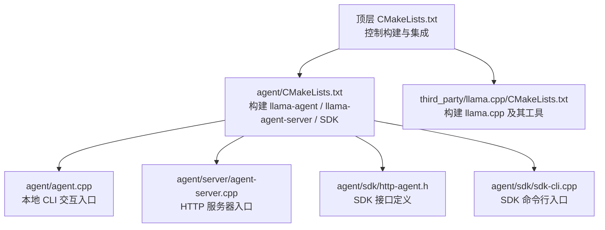
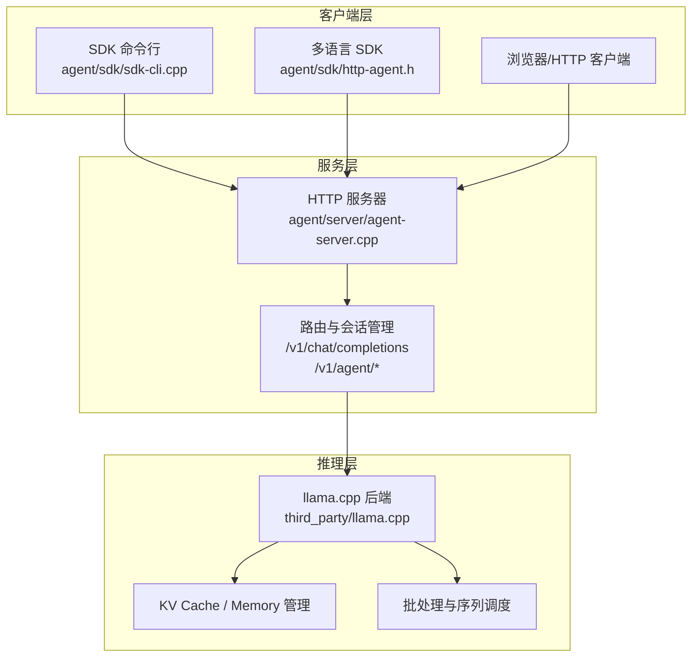
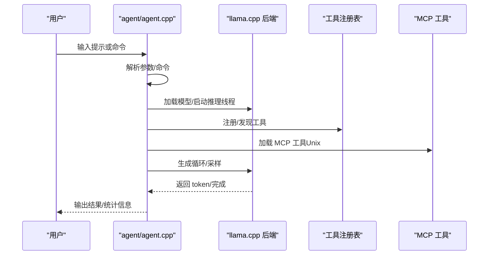
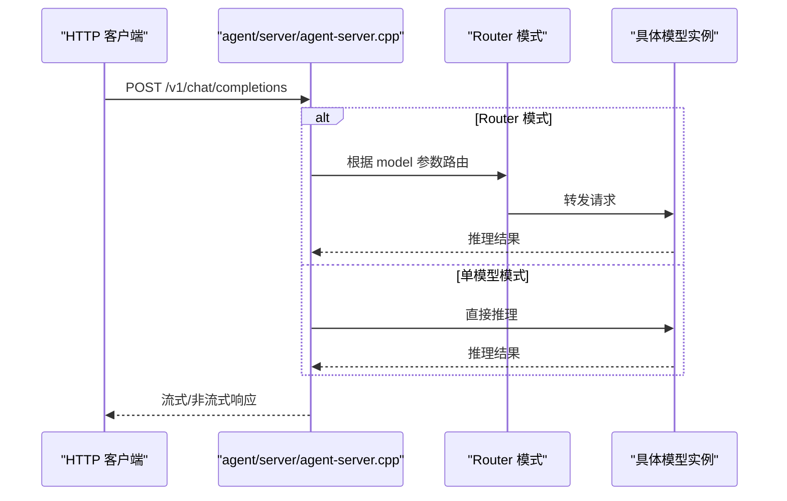
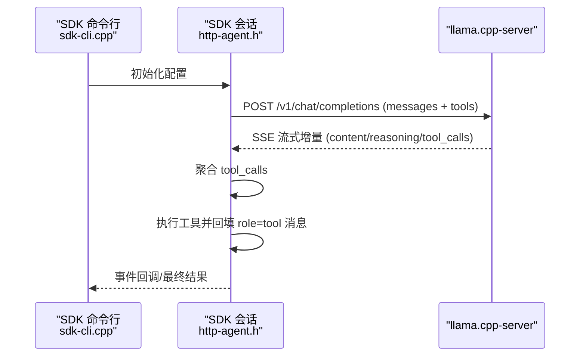
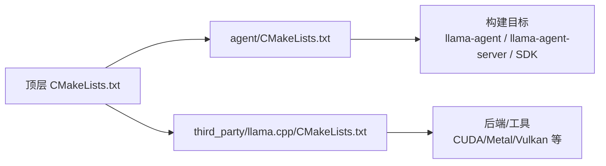

# 快速开始

<cite>
**本文引用的文件**
- [CMakeLists.txt](file://CMakeLists.txt)
- [agent/CMakeLists.txt](file://agent/CMakeLists.txt)
- [third_party/llama.cpp/CMakeLists.txt](file://third_party/llama.cpp/CMakeLists.txt)
- [agent/sdk/SDK.md](file://agent/sdk/SDK.md)
- [docs/llama-cpp-usage-guide.md](file://docs/llama-cpp-usage-guide.md)
- [docs/llama-cpp-parallel-request.md](file://docs/llama-cpp-parallel-request.md)
- [agent/sdk/http-agent.h](file://agent/sdk/http-agent.h)
- [agent/sdk/sdk-cli.cpp](file://agent/sdk/sdk-cli.cpp)
- [agent/server/agent-server.cpp](file://agent/server/agent-server.cpp)
- [agent/agent.cpp](file://agent/agent.cpp)
- [third_party/llama.cpp/README.md](file://third_party/llama.cpp/README.md)
- [third_party/llama.cpp/docs/install.md](file://third_party/llama.cpp/docs/install.md)
</cite>

## 目录
1. [简介](#简介)
2. [项目结构](#项目结构)
3. [核心组件](#核心组件)
4. [架构总览](#架构总览)
5. [详细组件分析](#详细组件分析)
6. [依赖分析](#依赖分析)
7. [性能考虑](#性能考虑)
8. [故障排除指南](#故障排除指南)
9. [结论](#结论)
10. [附录](#附录)

## 简介
本快速开始指南面向初学者，帮助你在本地从零搭建 llama.cpp-agent 并运行代理、启动 HTTP 服务器、使用命令行界面。内容涵盖：
- 系统要求与依赖安装
- 从源码编译项目（含 CMake 配置、llama.cpp 集成、CUDA 支持）
- 基本使用示例（运行代理、启动 HTTP 服务器、使用命令行）
- 常见问题与故障排除

## 项目结构
该项目采用“主工程 + 第三方 llama.cpp 子模块”的组织方式，顶层 CMake 控制构建流程，agent 子目录包含 CLI、HTTP 服务器、SDK 等组件，third_party/llama.cpp 提供推理后端与工具。

图表来源
- [CMakeLists.txt:1-44](file://CMakeLists.txt#L1-L44)
- [agent/CMakeLists.txt:1-209](file://agent/CMakeLists.txt#L1-L209)
- [third_party/llama.cpp/CMakeLists.txt:1-286](file://third_party/llama.cpp/CMakeLists.txt#L1-L286)

章节来源
- [CMakeLists.txt:1-44](file://CMakeLists.txt#L1-L44)
- [agent/CMakeLists.txt:1-209](file://agent/CMakeLists.txt#L1-L209)
- [third_party/llama.cpp/CMakeLists.txt:1-286](file://third_party/llama.cpp/CMakeLists.txt#L1-L286)

## 核心组件
- 本地 CLI 代理：agent/agent.cpp，提供交互式命令行体验，支持技能注入、AGENTS.md、MCP 工具等。
- HTTP 服务器：agent/server/agent-server.cpp，提供 OpenAI 兼容的 /v1/chat/completions 等端点，支持会话管理、工具、权限、子代理等。
- SDK：agent/sdk/，提供 HTTP 版 agent loop 的协议与实现，支持多语言绑定。
- llama.cpp 集成：通过顶层 CMake 将 third_party/llama.cpp 作为子项目集成，自动构建推理后端与工具。

章节来源
- [agent/agent.cpp:101-588](file://agent/agent.cpp#L101-L588)
- [agent/server/agent-server.cpp:105-731](file://agent/server/agent-server.cpp#L105-L731)
- [agent/sdk/SDK.md:1-467](file://agent/sdk/SDK.md#L1-L467)

## 架构总览
llama.cpp-agent 的运行时架构分为三层：
- 服务层：HTTP 服务器（/v1/chat/completions、/v1/agent/* 等），负责路由、会话管理、工具与权限控制。
- 推理层：llama.cpp 后端，负责模型加载、KV Cache、批处理与生成。
- 客户端层：SDK（CLI/多语言）或直接 HTTP 客户端，发起请求、接收流式响应、执行工具并回填消息。

图表来源
- [agent/server/agent-server.cpp:255-426](file://agent/server/agent-server.cpp#L255-L426)
- [docs/llama-cpp-parallel-request.md:1-594](file://docs/llama-cpp-parallel-request.md#L1-L594)

## 详细组件分析

### 本地 CLI 代理（agent/agent.cpp）
- 功能：提供交互式命令行体验，支持 /tools、/skills、/agents、/stats 等命令；支持 MCP 工具、技能注入、AGENTS.md、子代理等。
- 启动流程：解析参数、初始化后端、加载模型、启动推理线程、进入主循环。
- 关键特性：YOLO 模式（自动放行权限）、最大迭代次数控制、信号处理中断。

图表来源
- [agent/agent.cpp:101-588](file://agent/agent.cpp#L101-L588)

章节来源
- [agent/agent.cpp:101-588](file://agent/agent.cpp#L101-L588)

### HTTP 服务器（agent/server/agent-server.cpp）
- 功能：提供 OpenAI 兼容 API（/v1/chat/completions、/v1/agent/*），支持路由模式（Router）动态切换模型，支持会话管理、工具列表、权限、音频（ASR/TTS）等。
- 启动流程：解析参数、初始化 HTTP 与推理上下文、注册路由、启动 HTTP 服务、加载模型（或作为 Router）。
- 路由模式：未指定模型时作为 Router，将请求转发至对应子实例；支持 /models/load、/models/unload 等模型管理端点。

图表来源
- [agent/server/agent-server.cpp:255-426](file://agent/server/agent-server.cpp#L255-L426)

章节来源
- [agent/server/agent-server.cpp:105-731](file://agent/server/agent-server.cpp#L105-L731)

### SDK（agent/sdk/SDK.md、http-agent.h、sdk-cli.cpp）
- 协议：HTTP 版 agent loop，客户端维护会话（messages）、工具（tools）、权限策略，与服务端通过 /v1/chat/completions 交互。
- 事件流：TEXT_DELTA、REASONING_DELTA、TOOL_START/RESULT、PERMISSION_REQUIRED/RESOLVED、COMPLETED/ERROR 等。
- 命令行：llama-agent-sdk，支持 --url、--model、--prompt、--working-dir、--yolo、--no-stream、--no-skills、--no-agents-md、--no-mcp 等参数。

图表来源
- [agent/sdk/SDK.md:250-367](file://agent/sdk/SDK.md#L250-L367)
- [agent/sdk/sdk-cli.cpp:62-157](file://agent/sdk/sdk-cli.cpp#L62-L157)
- [agent/sdk/http-agent.h:56-121](file://agent/sdk/http-agent.h#L56-L121)

章节来源
- [agent/sdk/SDK.md:1-467](file://agent/sdk/SDK.md#L1-L467)
- [agent/sdk/sdk-cli.cpp:1-157](file://agent/sdk/sdk-cli.cpp#L1-L157)
- [agent/sdk/http-agent.h:1-121](file://agent/sdk/http-agent.h#L1-L121)

## 依赖分析
- CMake 配置：
  - 顶层 CMakeLists.txt 控制是否启用 CUDA（LLAMA_CPP_AGENT_CUDA），并将 third_party/llama.cpp 作为子项目集成。
  - agent/CMakeLists.txt 定义构建目标（llama-agent、llama-agent-server、llama-agent-sdk-lib、llama-agent-sdk），链接 server-context、common、线程库与 cpp-httplib。
  - third_party/llama.cpp/CMakeLists.txt 提供构建选项（LLAMA_BUILD_COMMON、LLAMA_BUILD_SERVER、LLAMA_BUILD_TOOLS 等）与后端支持（CUDA、Metal、Vulkan 等）。
- 运行时依赖：
  - llama.cpp 后端（推理引擎）
  - cpp-httplib（HTTP 服务器）
  - 线程库（POSIX pthread 或 Windows）

图表来源
- [CMakeLists.txt:11-42](file://CMakeLists.txt#L11-L42)
- [agent/CMakeLists.txt:52-147](file://agent/CMakeLists.txt#L52-L147)
- [third_party/llama.cpp/CMakeLists.txt:104-112](file://third_party/llama.cpp/CMakeLists.txt#L104-L112)

章节来源
- [CMakeLists.txt:1-44](file://CMakeLists.txt#L1-L44)
- [agent/CMakeLists.txt:1-209](file://agent/CMakeLists.txt#L1-L209)
- [third_party/llama.cpp/CMakeLists.txt:1-286](file://third_party/llama.cpp/CMakeLists.txt#L1-L286)

## 性能考虑
- 并行请求与批处理：llama.cpp 通过 Batch 与 Sequence 机制实现多用户并发请求，支持 Continuous Batching 与 KV Cache 共享，最大化硬件利用率。
- KV Cache 管理：合理设置 n_ctx、n_batch、n_seq_max，启用 kv_unified 可减少碎片化；必要时进行 context shift。
- 后端选择：根据硬件选择合适后端（CUDA/Metal/Vulkan），在 CMake 中开启相应选项以获得最佳性能。
- 生成参数：适当调整 n_threads、n_threads_batch、rope_scaling 等参数以平衡吞吐与延迟。

章节来源
- [docs/llama-cpp-parallel-request.md:1-594](file://docs/llama-cpp-parallel-request.md#L1-L594)
- [docs/llama-cpp-usage-guide.md:14-184](file://docs/llama-cpp-usage-guide.md#L14-L184)

## 故障排除指南
- 无法找到模型文件
  - 确认模型路径正确，或使用 Hugging Face 直接下载（llama.cpp 支持 -hf 选项）。
  - 参考：[third_party/llama.cpp/README.md:304-323](file://third_party/llama.cpp/README.md#L304-L323)
- HTTP 服务器启动失败
  - 检查端口占用与权限；确认已加载模型或处于 Router 模式。
  - 参考：[agent/server/agent-server.cpp:254-253](file://agent/server/agent-server.cpp#L254-L253)
- CUDA 相关问题
  - 确认已启用 LLAMA_CPP_AGENT_CUDA（默认在非 Apple/WSL 环境启用），检查 CUDA 驱动与版本兼容性。
  - 参考：[CMakeLists.txt:11-28](file://CMakeLists.txt#L11-L28)
- 权限与工具执行失败
  - 使用 SDK 的 PERMISSION_REQUIRED/RESOLVED 事件流进行交互；YOLO 模式可跳过权限校验（仅测试用途）。
  - 参考：[agent/sdk/SDK.md:160-175](file://agent/sdk/SDK.md#L160-L175)
- 并发与内存问题
  - 调整 n_ctx、n_batch、n_seq_max；启用 kv_unified；必要时进行 context shift。
  - 参考：[docs/llama-cpp-parallel-request.md:426-451](file://docs/llama-cpp-parallel-request.md#L426-L451)

章节来源
- [third_party/llama.cpp/README.md:304-323](file://third_party/llama.cpp/README.md#L304-L323)
- [agent/server/agent-server.cpp:254-253](file://agent/server/agent-server.cpp#L254-L253)
- [CMakeLists.txt:11-28](file://CMakeLists.txt#L11-L28)
- [agent/sdk/SDK.md:160-175](file://agent/sdk/SDK.md#L160-L175)
- [docs/llama-cpp-parallel-request.md:426-451](file://docs/llama-cpp-parallel-request.md#L426-L451)

## 结论
通过本指南，你可以在本地完成 llama.cpp-agent 的环境搭建与编译，运行本地 CLI 代理或启动 HTTP 服务器，并使用 SDK 进行开发。建议优先使用官方预构建版本或包管理器安装依赖，再按需从源码编译以启用特定后端（如 CUDA）。遇到问题时，优先检查模型路径、端口占用、CUDA 环境与权限配置。

## 附录

### 系统要求与依赖安装
- 包管理器安装（推荐）
  - Windows: winget
  - macOS/Linux: brew、macports、nix
  - 参考：[third_party/llama.cpp/docs/install.md:1-51](file://third_party/llama.cpp/docs/install.md#L1-L51)
- 源码安装（可选）
  - 参考：[third_party/llama.cpp/README.md:35-42](file://third_party/llama.cpp/README.md#L35-L42)

章节来源
- [third_party/llama.cpp/docs/install.md:1-51](file://third_party/llama.cpp/docs/install.md#L1-L51)
- [third_party/llama.cpp/README.md:35-42](file://third_party/llama.cpp/README.md#L35-L42)

### 从源码编译项目
- 步骤概览
  - 安装依赖（CMake、编译器、线程库、可选：CUDA/Metal/Vulkan）
  - 克隆仓库并初始化子模块
  - 配置 CMake（可选：-DLLAMA_CPP_AGENT_CUDA=ON）
  - 构建（cmake --build build）
- CMake 选项
  - LLAMA_CPP_AGENT_CUDA：启用 CUDA 后端（默认在非 Apple/WSL 环境启用）
  - LLAMA_CPP_SOURCE_DIR_OVERRIDE：覆盖 llama.cpp 源码目录
  - 参考：[CMakeLists.txt:11-34](file://CMakeLists.txt#L11-L34)
- 构建目标
  - llama-agent：本地 CLI
  - llama-agent-server：HTTP 服务器
  - llama-agent-sdk：SDK 命令行
  - 参考：[agent/CMakeLists.txt:52-147](file://agent/CMakeLists.txt#L52-L147)

章节来源
- [CMakeLists.txt:11-34](file://CMakeLists.txt#L11-L34)
- [agent/CMakeLists.txt:52-147](file://agent/CMakeLists.txt#L52-L147)

### 基本使用示例

#### 运行本地 CLI 代理
- 启动本地代理（加载模型并进入交互）
  - 参考：[agent/agent.cpp:101-588](file://agent/agent.cpp#L101-L588)
- 常用命令
  - /tools：列出可用工具
  - /skills：列出技能
  - /agents：列出 AGENTS.md 文件
  - /stats：查看统计信息
  - /clear：清空会话
  - /exit 或 /quit：退出
  - 参考：[agent/agent.cpp:386-534](file://agent/agent.cpp#L386-L534)

章节来源
- [agent/agent.cpp:101-588](file://agent/agent.cpp#L101-L588)
- [agent/agent.cpp:386-534](file://agent/agent.cpp#L386-L534)

#### 启动 HTTP 服务器
- 单模型模式
  - ./build/agent/llama-agent-server --host 127.0.0.1 --port 8080 -m /path/to/model.gguf
  - 参考：[agent/server/agent-server.cpp:284-292](file://agent/server/agent-server.cpp#L284-L292)
- 路由模式（动态切换模型）
  - ./build/agent/llama-agent-server --host 127.0.0.1 --port 8080 --models-dir /path/to/gguf_dir
  - /models/load、/models/unload 管理模型
  - /v1/chat/completions 请求中指定 model
  - 参考：[agent/server/agent-server.cpp:294-321](file://agent/server/agent-server.cpp#L294-L321)

章节来源
- [agent/server/agent-server.cpp:284-321](file://agent/server/agent-server.cpp#L284-L321)

#### 使用 SDK 命令行
- llama-agent-sdk --url http://127.0.0.1:8080 --model your-model-id --prompt "hello"
- 可选参数：--working-dir、--yolo、--no-stream、--no-skills、--no-agents-md、--no-mcp
- 参考：[agent/sdk/sdk-cli.cpp:62-157](file://agent/sdk/sdk-cli.cpp#L62-L157)

章节来源
- [agent/sdk/sdk-cli.cpp:62-157](file://agent/sdk/sdk-cli.cpp#L62-L157)