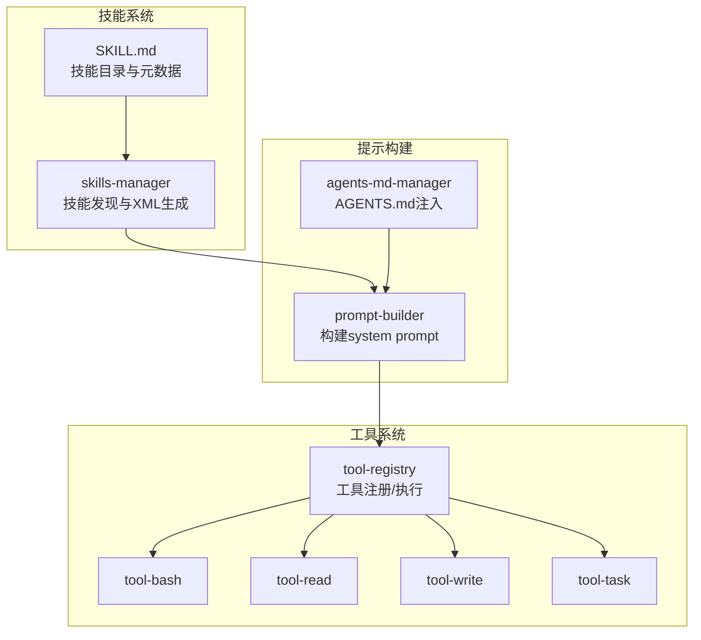
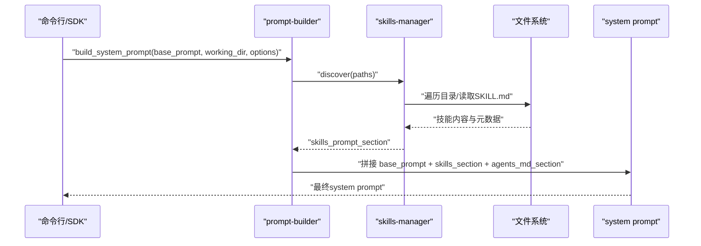
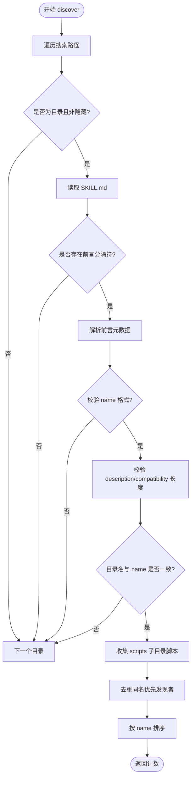
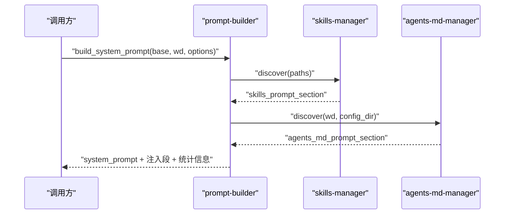
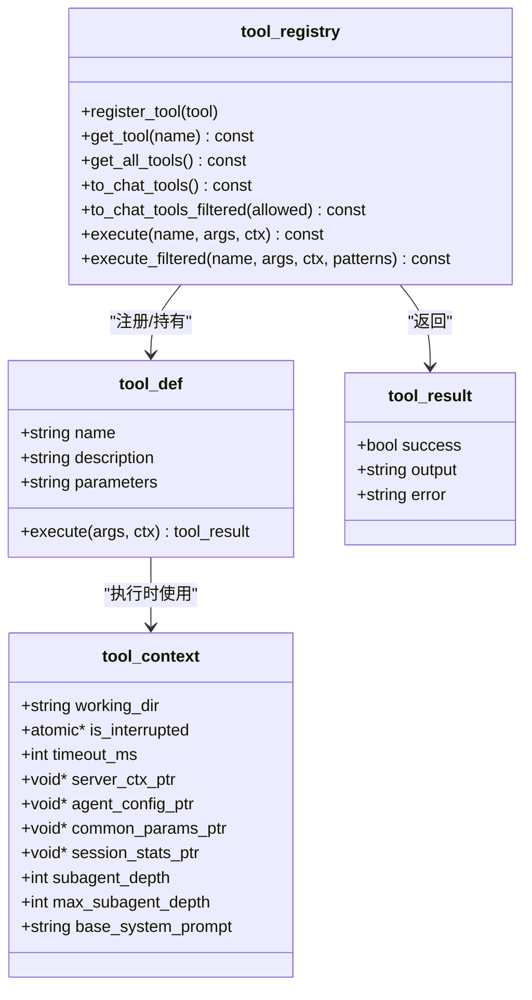
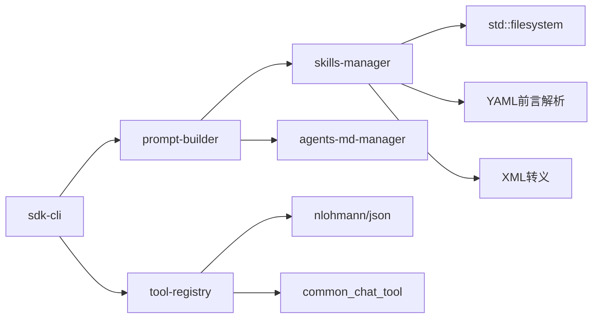

# 技能管理系统

<cite>
**本文引用的文件**
- [skills-manager.h](file://agent/skills/skills-manager.h)
- [skills-manager.cpp](file://agent/skills/skills-manager.cpp)
- [tool-registry.h](file://agent/tool-registry.h)
- [tool-registry.cpp](file://agent/tool-registry.cpp)
- [prompt-builder.h](file://agent/sdk/prompt-builder.h)
- [prompt-builder.cpp](file://agent/sdk/prompt-builder.cpp)
- [agents-md-manager.h](file://agent/agents-md/agents-md-manager.h)
- [agents-md-manager.cpp](file://agent/agents-md/agents-md-manager.cpp)
- [SDK.md](file://agent/sdk/SDK.md)
- [sdk-cli.cpp](file://agent/sdk/sdk-cli.cpp)
- [tool-bash.cpp](file://agent/tools/tool-bash.cpp)
- [tool-read.cpp](file://agent/tools/tool-read.cpp)
- [tool-write.cpp](file://agent/tools/tool-write.cpp)
- [tool-task.cpp](file://agent/tools/tool-task.cpp)
</cite>

## 目录
1. [简介](#简介)
2. [项目结构](#项目结构)
3. [核心组件](#核心组件)
4. [架构总览](#架构总览)
5. [详细组件分析](#详细组件分析)
6. [依赖关系分析](#依赖关系分析)
7. [性能考虑](#性能考虑)
8. [故障排查指南](#故障排查指南)
9. [结论](#结论)
10. [附录](#附录)

## 简介
本文件为技能管理系统的技术文档，围绕以下目标展开：
- 技能发现机制与 SKILL.md 格式规范
- 提示注入系统（system prompt 注入）
- 技能验证与加载流程
- 技能文件结构、元数据定义、技能注册流程
- 技能开发指南、自定义技能创建、技能组合使用
- 技能接口规范、加载策略、性能优化
- 技能相关问题与调试方法

系统采用 agentskills.io 规范，通过扫描技能目录、解析 SKILL.md 前言元数据、生成 XML 注入段，最终注入到系统提示词中，供大模型在推理过程中感知可用技能。

## 项目结构
技能管理相关模块主要分布在以下位置：
- 技能发现与注入：agent/skills
- 工具注册与执行：agent/tool-registry.*、agent/tools/*
- 提示构建与注入：agent/sdk/prompt-builder.*
- AGENTS.md 项目上下文注入：agent/agents-md/agents-md-manager.*

图表来源
- [skills-manager.cpp:240-288](file://agent/skills/skills-manager.cpp#L240-L288)
- [prompt-builder.cpp:32-76](file://agent/sdk/prompt-builder.cpp#L32-L76)
- [tool-registry.cpp:11-85](file://agent/tool-registry.cpp#L11-L85)

章节来源
- [skills-manager.h:26-63](file://agent/skills/skills-manager.h#L26-L63)
- [skills-manager.cpp:240-330](file://agent/skills/skills-manager.cpp#L240-L330)
- [prompt-builder.h:9-33](file://agent/sdk/prompt-builder.h#L9-L33)
- [prompt-builder.cpp:32-76](file://agent/sdk/prompt-builder.cpp#L32-L76)
- [tool-registry.h:58-103](file://agent/tool-registry.h#L58-L103)
- [tool-registry.cpp:11-85](file://agent/tool-registry.cpp#L11-L85)

## 核心组件
- 技能管理器（skills_manager）
  - 负责扫描技能目录、解析 SKILL.md 前言元数据、校验名称与长度、收集脚本清单、生成 XML 注入段
- 工具注册中心（tool_registry）
  - 统一注册与执行工具，支持过滤与受限执行（如 bash 白名单）
- 提示构建器（prompt_builder）
  - 组合 base prompt、技能注入段、AGENTS.md 注入段，形成最终 system prompt
- AGENTS.md 管理器（agents-md-manager）
  - 递归向上查找 AGENTS.md 文件，生成 XML 注入段

章节来源
- [skills-manager.h:11-63](file://agent/skills/skills-manager.h#L11-L63)
- [tool-registry.h:58-103](file://agent/tool-registry.h#L58-L103)
- [prompt-builder.h:9-33](file://agent/sdk/prompt-builder.h#L9-L33)
- [agents-md-manager.h:16-53](file://agent/agents-md/agents-md-manager.h#L16-L53)

## 架构总览
技能系统工作流如下：
- 初始化阶段：构建提示（prompt_builder）决定是否启用技能与 AGENTS.md 注入
- 发现阶段：skills_manager 遍历搜索路径，解析 SKILL.md，校验元数据，收集脚本
- 注入阶段：将技能 XML 注入到 system prompt 中
- 执行阶段：工具注册中心根据模型的 tool_calls 分发到具体工具执行

图表来源
- [prompt-builder.cpp:32-76](file://agent/sdk/prompt-builder.cpp#L32-L76)
- [skills-manager.cpp:240-288](file://agent/skills/skills-manager.cpp#L240-L288)

## 详细组件分析

### 技能发现与加载（skills-manager）
- 发现策略
  - 支持多个搜索路径：工作目录下的 .llama-agent/skills、用户配置目录下的 skills、以及额外路径
  - 遍历每个子目录，要求目录名与 SKILL.md 中 name 一致
  - 读取 UTF-8 编码的 SKILL.md，解析 YAML 风格前言（frontmatter）
- 元数据解析
  - 必填字段：name、description
  - 可选字段：license、compatibility、metadata（键值对）、allowed-tools（实验性）
  - scripts 子目录中的脚本文件名被收集（忽略隐藏文件）
- 校验规则
  - name 长度 1-64，仅小写字母、数字、连字符，不可开头/结尾为连字符，不可连续连字符
  - description 最大 1024 字符，compatibility 最大 500 字符
  - XML 特殊字符转义，确保注入安全
- 注入生成
  - 生成 <available_skills> XML，包含每个技能的 name/description/location/skill_dir/scripts/allowed_tools
  - 输出为空字符串表示未发现任何技能

图表来源
- [skills-manager.cpp:240-288](file://agent/skills/skills-manager.cpp#L240-L288)
- [skills-manager.cpp:96-186](file://agent/skills/skills-manager.cpp#L96-L186)
- [skills-manager.cpp:188-238](file://agent/skills/skills-manager.cpp#L188-L238)

章节来源
- [skills-manager.h:26-63](file://agent/skills/skills-manager.h#L26-L63)
- [skills-manager.cpp:45-78](file://agent/skills/skills-manager.cpp#L45-L78)
- [skills-manager.cpp:96-186](file://agent/skills/skills-manager.cpp#L96-L186)
- [skills-manager.cpp:188-238](file://agent/skills/skills-manager.cpp#L188-L238)
- [skills-manager.cpp:240-330](file://agent/skills/skills-manager.cpp#L240-L330)

### SKILL.md 格式规范
- 文件位置：每个技能目录下必须存在 SKILL.md
- 前言（frontmatter）：使用三横线分隔，支持以下键：
  - name：必填，符合技能名称规范
  - description：必填，1-1024 字符
  - license：可选
  - compatibility：可选，环境要求，最大 500 字符
  - metadata：可选的键值对（缩进式键值对）
  - allowed-tools：可选，实验性，空格分隔的工具名列表
- scripts 子目录：可选，放置脚本文件，将被收集到技能元数据中
- 目录名与 name 必须一致

章节来源
- [skills-manager.cpp:96-186](file://agent/skills/skills-manager.cpp#L96-L186)
- [skills-manager.cpp:210-218](file://agent/skills/skills-manager.cpp#L210-L218)

### 提示注入系统（prompt-builder）
- 默认配置目录
  - Windows：%APPDATA%\llama-agent
  - 其他：~/.llama-agent
- 搜索路径
  - working_dir/.llama-agent/skills
  - config_dir/skills
  - options.extra_skills_paths
- 注入顺序
  - base_prompt
  - skills_prompt_section（由 skills-manager 生成）
  - agents_md_prompt_section（由 agents-md-manager 生成）
- 输出
  - 返回最终 system_prompt、各注入段、搜索路径与计数

图表来源
- [prompt-builder.cpp:32-76](file://agent/sdk/prompt-builder.cpp#L32-L76)

章节来源
- [prompt-builder.h:9-33](file://agent/sdk/prompt-builder.h#L9-L33)
- [prompt-builder.cpp:10-24](file://agent/sdk/prompt-builder.cpp#L10-L24)
- [prompt-builder.cpp:32-76](file://agent/sdk/prompt-builder.cpp#L32-L76)

### AGENTS.md 注入（agents-md-manager）
- 查找范围：从 working_dir 向上递归至 git root，或仅 working_dir（非 git）
- 全局文件：可选包含 config_dir/AGENTS.md（最低优先级）
- 安全读取：二进制检测（前 8KB 包含空字节则视为二进制）
- XML 注入：生成 <project_context>... 的 XML，按深度排序，最深优先级最低

章节来源
- [agents-md-manager.h:16-53](file://agent/agents-md/agents-md-manager.h#L16-L53)
- [agents-md-manager.cpp:75-179](file://agent/agents-md/agents-md-manager.cpp#L75-L179)

### 工具注册与执行（tool-registry）
- 注册
  - 工具以 tool_def 结构注册，包含 name、description、parameters（JSON Schema 字符串）、execute 回调
  - 使用 REGISTER_TOOL 宏自动注册
- 执行
  - 支持全量执行与受限执行（bash 白名单模式）
  - 过滤工具集：to_chat_tools_filtered
- 工具示例
  - bash：执行 shell 命令，支持超时、输出截断、跨平台
  - read：读取文件，支持偏移与行数限制，敏感文件拦截
  - write：写入文件，自动创建父目录
  - task：派生子代理（subagent），支持同步/后台任务与结果回查

图表来源
- [tool-registry.h:44-103](file://agent/tool-registry.h#L44-L103)
- [tool-registry.cpp:11-85](file://agent/tool-registry.cpp#L11-L85)

章节来源
- [tool-registry.h:17-57](file://agent/tool-registry.h#L17-L57)
- [tool-registry.cpp:11-85](file://agent/tool-registry.cpp#L11-L85)
- [tool-bash.cpp:50-258](file://agent/tools/tool-bash.cpp#L50-L258)
- [tool-read.cpp:17-93](file://agent/tools/tool-read.cpp#L17-L93)
- [tool-write.cpp:10-57](file://agent/tools/tool-write.cpp#L10-L57)
- [tool-task.cpp:71-208](file://agent/tools/tool-task.cpp#L71-L208)

### SDK 与 CLI 集成
- SDK 协议
  - 与 llama-server 通过 OpenAI 兼容接口通信，支持流式响应（SSE）
  - 事件流包括 TEXT_DELTA、TOOL_START、TOOL_RESULT、PERMISSION_REQUIRED 等
- CLI
  - llama-agent-sdk：命令行工具，支持开关禁用 skills/AGENTS.md/MCP
  - 默认 system prompt 包含工具说明与指导原则

章节来源
- [SDK.md:1-467](file://agent/sdk/SDK.md#L1-L467)
- [sdk-cli.cpp:57-157](file://agent/sdk/sdk-cli.cpp#L57-L157)

## 依赖关系分析
- skills-manager 依赖文件系统进行目录遍历与文件读取，依赖正则/字符串处理进行 YAML 前言解析与 XML 转义
- prompt-builder 依赖 skills-manager 与 agents-md-manager，负责组装最终 system prompt
- tool-registry 依赖 chat.h（common_chat_tool 转换）与 nlohmann/json 进行参数校验与工具转换
- CLI 依赖 http-agent 会话封装，将事件流输出到标准输出

图表来源
- [skills-manager.cpp:14-14](file://agent/skills/skills-manager.cpp#L14-L14)
- [prompt-builder.cpp:3-4](file://agent/sdk/prompt-builder.cpp#L3-L4)
- [tool-registry.cpp:2-2](file://agent/tool-registry.cpp#L2-L2)

章节来源
- [skills-manager.cpp:1-14](file://agent/skills/skills-manager.cpp#L1-L14)
- [prompt-builder.cpp:1-4](file://agent/sdk/prompt-builder.cpp#L1-L4)
- [tool-registry.cpp:1-2](file://agent/tool-registry.cpp#L1-L2)

## 性能考虑
- 目录遍历与 I/O
  - 发现阶段对每个搜索路径进行目录遍历，建议合理设置搜索路径数量与层级，避免过深或过多目录
  - 脚本收集仅处理 scripts 子目录，忽略隐藏文件，减少无关文件处理
- 字符串与 XML 转义
  - escape_xml/escape_xml_attr 在生成注入段时进行字符转义，避免 XML 注入风险
- 工具执行
  - bash 工具支持超时与输出截断，防止长时间阻塞与内存膨胀
  - read/write 工具对长行与大文件进行截断与分页输出
- 提示长度控制
  - description/compatibility 有长度上限，避免 system prompt 过长导致 token 消耗过高

章节来源
- [skills-manager.cpp:80-94](file://agent/skills/skills-manager.cpp#L80-L94)
- [tool-bash.cpp:25-48](file://agent/tools/tool-bash.cpp#L25-L48)
- [tool-bash.cpp:142-236](file://agent/tools/tool-bash.cpp#L142-L236)
- [tool-read.cpp:14-15](file://agent/tools/tool-read.cpp#L14-L15)
- [tool-read.cpp:62-65](file://agent/tools/tool-read.cpp#L62-L65)

## 故障排查指南
- 技能未被发现
  - 检查 SKILL.md 是否存在于技能目录根部
  - 确认目录名与 SKILL.md 中 name 一致
  - 检查 name 是否满足规范（长度、字符、连字符规则）
  - 确认搜索路径是否正确（工作目录、配置目录、额外路径）
- 前言解析失败
  - 确认前言使用三横线分隔，键值对格式正确
  - 注意 metadata 键值对需缩进
- XML 注入异常
  - 检查 name/description 是否包含非法 XML 字符
  - 确认生成的 XML 是否被正确拼接到 system prompt
- 工具执行错误
  - bash：检查命令是否在白名单中（受限模式）、是否超时、输出是否过大
  - read/write：检查文件路径是否越界、是否为敏感文件、权限是否足够
- CLI 行为异常
  - 使用 --no-skills 或 --no-agents-md 排除注入影响
  - 检查 --working-dir 与实际工作目录是否一致

章节来源
- [skills-manager.cpp:96-186](file://agent/skills/skills-manager.cpp#L96-L186)
- [skills-manager.cpp:210-218](file://agent/skills/skills-manager.cpp#L210-L218)
- [tool-registry.cpp:49-85](file://agent/tool-registry.cpp#L49-L85)
- [tool-bash.cpp:50-258](file://agent/tools/tool-bash.cpp#L50-L258)
- [tool-read.cpp:17-93](file://agent/tools/tool-read.cpp#L17-L93)
- [tool-write.cpp:10-57](file://agent/tools/tool-write.cpp#L10-L57)
- [sdk-cli.cpp:57-157](file://agent/sdk/sdk-cli.cpp#L57-L157)

## 结论
技能管理系统遵循 agentskills.io 规范，通过严格的元数据校验、安全的 XML 注入与灵活的工具执行机制，实现了可发现、可验证、可组合的技能生态。结合 AGENTS.md 注入与 SDK 事件流，系统在本地运行环境下提供了强大的提示增强与自动化工具执行能力。建议在生产环境中合理规划技能目录结构、严格控制注入内容长度，并通过 CLI 开关进行可控的调试与验证。

## 附录

### 技能开发指南
- 目录结构
  - 每个技能一个目录，目录名即技能 name
  - 目录下放置 SKILL.md
  - 可选 scripts 子目录放置脚本
- SKILL.md 前言示例（键值）
  - name：必填，符合规范
  - description：必填，简述用途
  - license：可选
  - compatibility：可选，环境要求
  - metadata：可选键值对
  - allowed-tools：可选，工具名列表（空格分隔）
- 元数据校验
  - name 长度 1-64，仅小写字母、数字、连字符，不可开头/结尾为连字符，不可连续连字符
  - description 最大 1024 字符，compatibility 最大 500 字符
- 注入验证
  - 生成 XML 后检查是否包含 name/description/location/skill_dir/scripts/allowed_tools

章节来源
- [skills-manager.h:11-24](file://agent/skills/skills-manager.h#L11-L24)
- [skills-manager.cpp:45-78](file://agent/skills/skills-manager.cpp#L45-L78)
- [skills-manager.cpp:166-185](file://agent/skills/skills-manager.cpp#L166-L185)
- [skills-manager.cpp:290-330](file://agent/skills/skills-manager.cpp#L290-L330)

### 自定义技能创建步骤
- 创建目录：skills/<your_skill_name>
- 创建 SKILL.md：填写 name 与 description，必要时添加 metadata/allowed-tools
- 可选：在 scripts/ 下放置脚本文件
- 启动应用：确保搜索路径包含该目录
- 验证：检查 system prompt 中是否出现该技能

章节来源
- [skills-manager.cpp:240-288](file://agent/skills/skills-manager.cpp#L240-L288)
- [prompt-builder.cpp:44-62](file://agent/sdk/prompt-builder.cpp#L44-L62)

### 技能组合使用
- allowed-tools（实验性）：可在 SKILL.md 中声明允许使用的工具名列表
- tool-registry 支持 to_chat_tools_filtered，按集合过滤工具
- bash 白名单：在受限模式下，仅允许匹配白名单的命令执行

章节来源
- [skills-manager.cpp:156-163](file://agent/skills/skills-manager.cpp#L156-L163)
- [tool-registry.cpp:39-48](file://agent/tool-registry.cpp#L39-L48)
- [tool-registry.cpp:62-85](file://agent/tool-registry.cpp#L62-L85)

### 技能接口规范与加载策略
- 接口
  - discover：返回发现的技能数量
  - get_skills：返回技能元数据列表
  - generate_prompt_section：生成 XML 注入段
  - validate_name：校验技能名称
- 加载策略
  - 多路径搜索：工作目录优先，随后配置目录，最后额外路径
  - 去重：同名技能以首次发现为准
  - 排序：按 name 字典序排序，保证一致性

章节来源
- [skills-manager.h:26-63](file://agent/skills/skills-manager.h#L26-L63)
- [skills-manager.cpp:240-288](file://agent/skills/skills-manager.cpp#L240-L288)

### 配置模板与示例
- prompt-builder 配置选项
  - enable_skills：是否启用技能注入
  - extra_skills_paths：额外搜索路径
  - enable_agents_md：是否启用 AGENTS.md 注入
  - config_dir_override：覆盖默认配置目录
- CLI 示例
  - ./build/agent/llama-agent-sdk --url http://localhost:8080 --model MODEL --prompt "..."
  - 支持 --no-skills、--no-agents-md、--no-mcp 控制注入与 MCP

章节来源
- [prompt-builder.h:9-23](file://agent/sdk/prompt-builder.h#L9-L23)
- [sdk-cli.cpp:57-157](file://agent/sdk/sdk-cli.cpp#L57-L157)