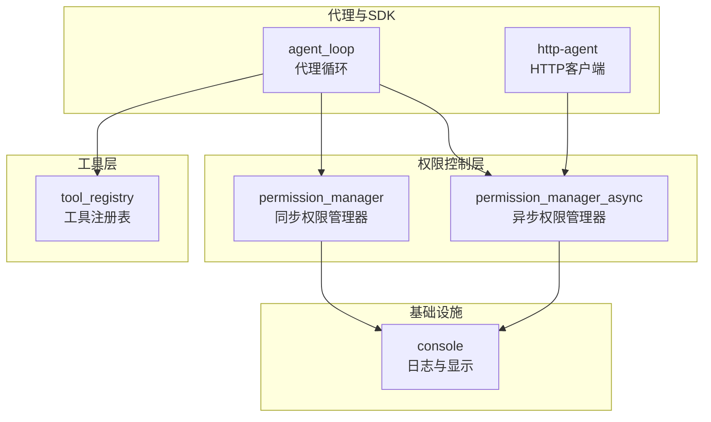
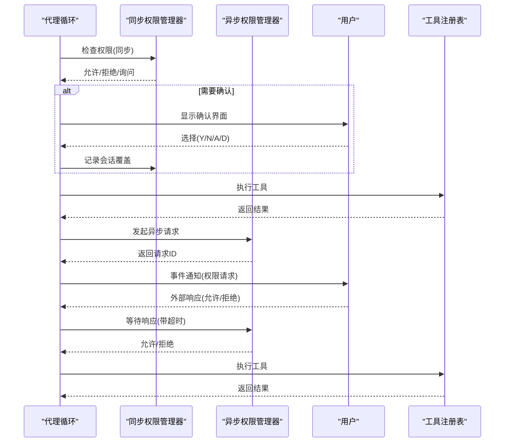
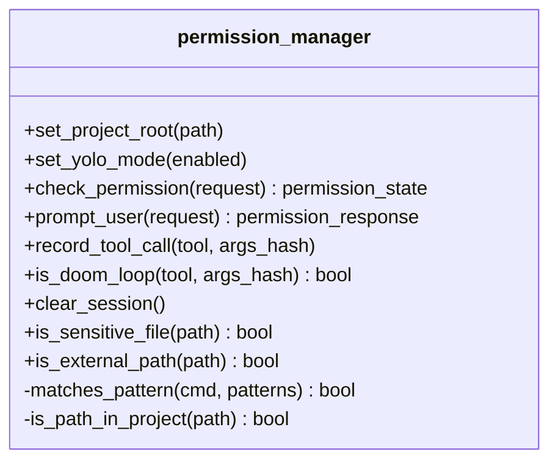
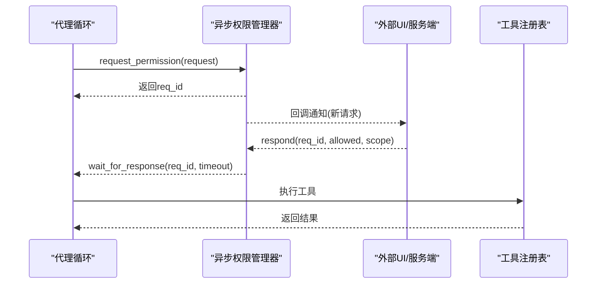
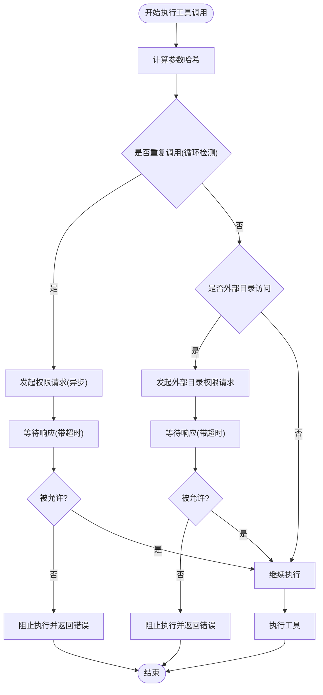
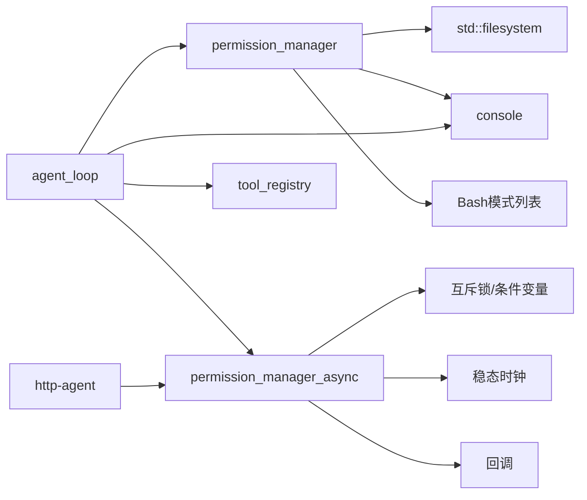

# 权限控制系统

<cite>
**本文档引用的文件**
- [agent/permission.h](file://agent/permission.h)
- [agent/permission.cpp](file://agent/permission.cpp)
- [agent/permission-async.h](file://agent/permission-async.h)
- [agent/permission-async.cpp](file://agent/permission-async.cpp)
- [agent/agent-loop.cpp](file://agent/agent-loop.cpp)
- [agent/tool-registry.h](file://agent/tool-registry.h)
- [agent/tool-registry.cpp](file://agent/tool-registry.cpp)
- [third_party/llama.cpp/common/console.h](file://third_party/llama.cpp/common/console.h)
- [sdk/http-agent.cpp](file://agent/sdk/http-agent.cpp)
</cite>

## 目录
1. [简介](#简介)
2. [项目结构](#项目结构)
3. [核心组件](#核心组件)
4. [架构总览](#架构总览)
5. [详细组件分析](#详细组件分析)
6. [依赖关系分析](#依赖关系分析)
7. [性能考虑](#性能考虑)
8. [故障排除指南](#故障排除指南)
9. [结论](#结论)
10. [附录](#附录)

## 简介
本文件系统性阐述权限控制系统的设计与实现，覆盖权限状态管理、用户交互确认、循环检测机制、路径验证与敏感文件识别、以及异步权限处理等核心能力。文档面向开发者与运维人员，提供从架构到实现细节的完整说明，并包含配置示例、安全最佳实践、常见问题排查与使用场景。

## 项目结构
权限控制相关代码主要位于 agent 子目录，围绕同步与异步两种模式展开：
- 同步权限管理器：负责本地交互式确认、默认策略、危险/安全命令匹配、项目根路径校验、敏感文件识别与循环检测。
- 异步权限管理器：提供非阻塞的请求-响应模型，支持回调通知、超时等待、会话级记忆与取消。
- 工具注册表：封装工具执行上下文与过滤逻辑（如只读模式下的 Bash 命令白名单）。
- 代理循环：在工具调用前后进行权限检查、危险标记、循环检测与外部路径校验。
- 控制台接口：统一的日志与显示控制，用于交互式提示与错误输出。

**图表来源**
- [agent/permission.h:40-101](file://agent/permission.h#L40-L101)
- [agent/permission-async.h:43-141](file://agent/permission-async.h#L43-L141)
- [agent/tool-registry.h:58-90](file://agent/tool-registry.h#L58-L90)
- [agent/agent-loop.cpp:550-749](file://agent/agent-loop.cpp#L550-L749)
- [sdk/http-agent.cpp:473-501](file://agent/sdk/http-agent.cpp#L473-L501)
- [third_party/llama.cpp/common/console.h:20-46](file://third_party/llama.cpp/common/console.h#L20-L46)

**章节来源**
- [agent/permission.h:1-102](file://agent/permission.h#L1-L102)
- [agent/permission-async.h:1-142](file://agent/permission-async.h#L1-L142)
- [agent/tool-registry.h:1-103](file://agent/tool-registry.h#L1-L103)
- [agent/agent-loop.cpp:550-749](file://agent/agent-loop.cpp#L550-L749)
- [sdk/http-agent.cpp:473-501](file://agent/sdk/http-agent.cpp#L473-L501)
- [third_party/llama.cpp/common/console.h:1-47](file://third_party/llama.cpp/common/console.h#L1-L47)

## 核心组件
- 权限状态与类型
  - 状态枚举：允许、询问、拒绝、会话级允许、会话级拒绝。
  - 类型枚举：Bash、文件读、文件写、文件编辑、通配符、外部目录。
- 请求与响应
  - 请求结构包含类型、工具名、描述、详情（命令或路径）、危险标记。
  - 响应枚举：一次允许、一次拒绝、总是允许、总是拒绝。
- 默认策略
  - 不同类型的默认行为（如 Bash 和外部目录默认“询问”，文件读默认“允许”等）。
- 模式匹配
  - 危险/安全 Bash 模式列表，用于自动判定是否需要用户确认。
- 路径与敏感文件
  - 项目根路径设置，判断路径是否在工作目录内。
  - 敏感文件名与扩展名识别，包括密钥、证书、凭证等。
- 循环检测
  - 记录最近多次相同工具调用，防止“永无止境”的重复调用。

**章节来源**
- [agent/permission.h:8-38](file://agent/permission.h#L8-L38)
- [agent/permission.h:40-101](file://agent/permission.h#L40-L101)
- [agent/permission.cpp:35-71](file://agent/permission.cpp#L35-L71)
- [agent/permission.cpp:77-85](file://agent/permission.cpp#L77-L85)
- [agent/permission.cpp:87-106](file://agent/permission.cpp#L87-L106)
- [agent/permission.cpp:230-304](file://agent/permission.cpp#L230-L304)
- [agent/permission.cpp:217-223](file://agent/permission.cpp#L217-L223)

## 架构总览
权限控制贯穿代理执行链路，分为同步与异步两条路径：
- 同步路径：代理循环直接调用同步权限管理器，阻塞等待用户输入。
- 异步路径：代理循环通过异步权限管理器发起请求，等待外部响应，支持超时与取消。

**图表来源**
- [agent/agent-loop.cpp:550-749](file://agent/agent-loop.cpp#L550-L749)
- [agent/agent-loop.cpp:1290-1391](file://agent/agent-loop.cpp#L1290-L1391)
- [agent/permission.cpp:108-140](file://agent/permission.cpp#L108-L140)
- [agent/permission.cpp:142-197](file://agent/permission.cpp#L142-L197)
- [agent/permission-async.cpp:124-144](file://agent/permission-async.cpp#L124-L144)
- [agent/permission-async.cpp:180-209](file://agent/permission-async.cpp#L180-L209)
- [agent/tool-registry.cpp:49-85](file://agent/tool-registry.cpp#L49-L85)

## 详细组件分析

### 同步权限管理器
- 职责
  - 维护默认策略与会话覆盖。
  - 匹配危险/安全 Bash 模式，决定是否需要确认。
  - 判断路径是否在项目根内，识别敏感文件。
  - 记录最近工具调用，检测循环。
- 关键流程
  - 权限检查：优先会话覆盖，再按类型默认值；Bash 命令根据模式列表判定。
  - 用户确认：显示请求详情与警告，读取单字符输入，支持“总是/拒绝总是/一次”等选项。
  - 循环检测：统计最近多次相同调用，超过阈值触发确认。

**图表来源**
- [agent/permission.h:40-101](file://agent/permission.h#L40-L101)
- [agent/permission.cpp:35-71](file://agent/permission.cpp#L35-L71)
- [agent/permission.cpp:77-106](file://agent/permission.cpp#L77-L106)
- [agent/permission.cpp:108-140](file://agent/permission.cpp#L108-L140)
- [agent/permission.cpp:142-197](file://agent/permission.cpp#L142-L197)
- [agent/permission.cpp:199-223](file://agent/permission.cpp#L199-L223)
- [agent/permission.cpp:230-304](file://agent/permission.cpp#L230-L304)
- [agent/permission.cpp:306-310](file://agent/permission.cpp#L306-L310)

**章节来源**
- [agent/permission.h:40-101](file://agent/permission.h#L40-L101)
- [agent/permission.cpp:35-71](file://agent/permission.cpp#L35-L71)
- [agent/permission.cpp:77-106](file://agent/permission.cpp#L77-L106)
- [agent/permission.cpp:108-140](file://agent/permission.cpp#L108-L140)
- [agent/permission.cpp:142-197](file://agent/permission.cpp#L142-L197)
- [agent/permission.cpp:199-223](file://agent/permission.cpp#L199-L223)
- [agent/permission.cpp:230-304](file://agent/permission.cpp#L230-L304)
- [agent/permission.cpp:306-310](file://agent/permission.cpp#L306-L310)

### 异步权限管理器
- 职责
  - 提供非阻塞的权限请求与响应模型。
  - 支持回调通知、超时等待、请求取消。
  - 维护会话覆盖与最近调用记录。
- 关键流程
  - 发起请求：生成唯一请求ID，存储待处理请求，触发回调。
  - 响应处理：接收外部响应，按作用域更新会话覆盖，唤醒等待线程。
  - 等待响应：带超时等待，支持取消与查询待处理请求。

**图表来源**
- [agent/permission-async.h:43-141](file://agent/permission-async.h#L43-L141)
- [agent/permission-async.cpp:124-144](file://agent/permission-async.cpp#L124-L144)
- [agent/permission-async.cpp:146-178](file://agent/permission-async.cpp#L146-L178)
- [agent/permission-async.cpp:180-209](file://agent/permission-async.cpp#L180-L209)
- [agent/agent-loop.cpp:1353-1378](file://agent/agent-loop.cpp#L1353-L1378)

**章节来源**
- [agent/permission-async.h:14-38](file://agent/permission-async.h#L14-L38)
- [agent/permission-async.h:43-141](file://agent/permission-async.h#L43-L141)
- [agent/permission-async.cpp:10-45](file://agent/permission-async.cpp#L10-L45)
- [agent/permission-async.cpp:124-178](file://agent/permission-async.cpp#L124-L178)
- [agent/permission-async.cpp:180-209](file://agent/permission-async.cpp#L180-L209)
- [agent/permission-async.cpp:236-264](file://agent/permission-async.cpp#L236-L264)

### 代理循环中的权限检查
- 流程要点
  - 在每次工具调用前计算参数哈希，检测是否为重复调用。
  - 若检测到循环，强制发起权限请求并等待外部响应。
  - 对外部目录访问进行额外确认（异步模式下）。
  - Bash 命令危险标记：包含特定模式则标记为危险。
  - 根据权限状态执行工具或返回错误信息。

**图表来源**
- [agent/agent-loop.cpp:555-583](file://agent/agent-loop.cpp#L555-L583)
- [agent/agent-loop.cpp:1315-1325](file://agent/agent-loop.cpp#L1315-L1325)
- [agent/agent-loop.cpp:1327-1343](file://agent/agent-loop.cpp#L1327-L1343)
- [agent/agent-loop.cpp:1345-1378](file://agent/agent-loop.cpp#L1345-L1378)

**章节来源**
- [agent/agent-loop.cpp:555-583](file://agent/agent-loop.cpp#L555-L583)
- [agent/agent-loop.cpp:1315-1325](file://agent/agent-loop.cpp#L1315-L1325)
- [agent/agent-loop.cpp:1327-1343](file://agent/agent-loop.cpp#L1327-L1343)
- [agent/agent-loop.cpp:1345-1378](file://agent/agent-loop.cpp#L1345-L1378)

### 工具注册表与只读模式
- 功能
  - 提供工具注册、查找、执行与过滤。
  - 只读模式下对 Bash 命令进行白名单过滤，仅允许特定模式的命令执行。
- 使用场景
  - 在受限环境中限制危险命令，结合权限系统形成双重保障。

**章节来源**
- [agent/tool-registry.h:58-90](file://agent/tool-registry.h#L58-L90)
- [agent/tool-registry.cpp:62-85](file://agent/tool-registry.cpp#L62-L85)

### HTTP 客户端中的权限处理
- 行为
  - 当访问外部文件需要权限时，等待异步权限响应。
  - 若超时或被拒绝，返回相应错误信息。
  - 支持取消未决请求。

**章节来源**
- [sdk/http-agent.cpp:473-501](file://agent/sdk/http-agent.cpp#L473-L501)

## 依赖关系分析
- 同步权限管理器依赖
  - 文件系统：绝对路径解析、目录前缀匹配。
  - 控制台：交互式日志与显示控制。
  - Bash 模式列表：危险/安全命令匹配。
- 异步权限管理器依赖
  - 线程同步：互斥锁、条件变量。
  - 时间：稳态时钟用于超时控制。
  - 回调：新请求通知。
- 代理循环依赖
  - 权限管理器：同步/异步两种模式。
  - 工具注册表：工具执行与过滤。
  - 控制台：日志与显示。

**图表来源**
- [agent/permission.cpp:34-34](file://agent/permission.cpp#L34-L34)
- [agent/permission.cpp:10-16](file://agent/permission.cpp#L10-L16)
- [agent/permission-async.cpp:1-8](file://agent/permission-async.cpp#L1-L8)
- [agent/permission-async.cpp:96-107](file://agent/permission-async.cpp#L96-L107)
- [agent/permission-async.cpp:133-141](file://agent/permission-async.cpp#L133-L141)
- [agent/agent-loop.cpp:567-583](file://agent/agent-loop.cpp#L567-L583)
- [sdk/http-agent.cpp:473-491](file://agent/sdk/http-agent.cpp#L473-L491)

**章节来源**
- [agent/permission.cpp:1-34](file://agent/permission.cpp#L1-L34)
- [agent/permission-async.cpp:1-8](file://agent/permission-async.cpp#L1-L8)
- [agent/agent-loop.cpp:567-583](file://agent/agent-loop.cpp#L567-L583)
- [sdk/http-agent.cpp:473-491](file://agent/sdk/http-agent.cpp#L473-L491)

## 性能考虑
- 模式匹配复杂度
  - Bash 模式匹配为 O(N*M)，其中 N 为模式数量，M 为命令长度。建议合理控制模式列表规模。
- 最近调用记录
  - 固定大小的向量维护最近 10 次调用，空间复杂度 O(1)，时间复杂度 O(1) 插入与 O(1) 查询。
- 异步等待
  - 等待响应采用条件变量与超时，避免无限阻塞；建议根据业务场景调整超时时间。
- 日志与显示
  - 控制台输出可能影响推理线程性能，应在专用线程中使用。

[本节为通用指导，无需列出具体文件来源]

## 故障排除指南
- 问题：权限请求超时
  - 现象：异步等待返回空值。
  - 排查：检查回调是否正确设置、外部响应是否到达、超时时间是否过短。
  - 处理：延长超时时间或检查外部服务状态。
- 问题：循环检测误报
  - 现象：正常重复调用被阻断。
  - 排查：确认参数哈希是否稳定、是否为同一工具与参数组合。
  - 处理：在必要时手动允许或调整工具参数。
- 问题：外部目录访问被拒绝
  - 现象：访问项目根外路径失败。
  - 排查：确认项目根设置、路径是否在工作目录内。
  - 处理：设置正确的项目根或提升权限。
- 问题：敏感文件被阻断
  - 现象：读取密钥、证书或凭证文件失败。
  - 排查：确认文件名/扩展名是否命中敏感列表。
  - 处理：将敏感文件移出项目根或在受控环境下执行。

**章节来源**
- [agent/permission-async.cpp:180-209](file://agent/permission-async.cpp#L180-L209)
- [agent/permission-async.cpp:226-235](file://agent/permission-async.cpp#L226-L235)
- [agent/agent-loop.cpp:1300-1312](file://agent/agent-loop.cpp#L1300-L1312)
- [agent/permission.cpp:230-304](file://agent/permission.cpp#L230-L304)

## 结论
该权限控制系统通过同步与异步双轨设计，兼顾了交互式体验与可编程集成；结合循环检测、路径验证与敏感文件识别，提供了多层次的安全保障。配合工具注册表的只读模式，可在受限环境中进一步降低风险。建议在生产环境启用外部目录与敏感文件检查，并根据业务场景调整超时与模式列表。

[本节为总结性内容，无需列出具体文件来源]

## 附录

### 权限类型与默认策略
- 类型定义
  - BASH：Bash 命令执行。
  - FILE_READ：文件读取。
  - FILE_WRITE：文件写入。
  - FILE_EDIT：文件编辑。
  - GLOB：通配符匹配。
  - EXTERNAL_DIR：访问项目根外路径。
- 默认策略
  - BASH：ASK
  - FILE_READ：ALLOW
  - FILE_WRITE：ASK
  - FILE_EDIT：ASK
  - GLOB：ALLOW
  - EXTERNAL_DIR：ASK

**章节来源**
- [agent/permission.h:16-23](file://agent/permission.h#L16-L23)
- [agent/permission.cpp:35-41](file://agent/permission.cpp#L35-L41)

### 权限检查流程规范
- 同步检查
  - 会话覆盖优先于默认策略。
  - Bash 命令按模式匹配决定是否需要确认。
  - 返回 ALLOW/DENY/ASK。
- 异步检查
  - 生成请求ID，存储待处理请求并触发回调。
  - 等待响应或超时，返回允许/拒绝。

**章节来源**
- [agent/permission.cpp:108-140](file://agent/permission.cpp#L108-L140)
- [agent/permission-async.cpp:89-122](file://agent/permission-async.cpp#L89-L122)
- [agent/permission-async.cpp:124-144](file://agent/permission-async.cpp#L124-L144)
- [agent/permission-async.cpp:180-209](file://agent/permission-async.cpp#L180-L209)

### 用户确认接口与交互
- 输入方式
  - 单字符读取，支持 y/n/a/d。
  - 输出确认界面，包含工具名、详情与危险标记。
- 会话覆盖
  - 选择“总是”或“拒绝总是”后，后续相同请求直接按选择执行。

**章节来源**
- [agent/permission.cpp:19-32](file://agent/permission.cpp#L19-L32)
- [agent/permission.cpp:142-197](file://agent/permission.cpp#L142-L197)

### 路径验证与沙箱
- 项目根设置
  - 设置后，所有路径转换为绝对路径并检查前缀匹配。
- 外部目录检测
  - 通过 is_external_path 判断是否在项目根内。
- 沙箱建议
  - 将项目根设为工作目录，限制文件系统访问范围。
  - 对外部目录访问强制异步确认。

**章节来源**
- [agent/permission.cpp:73-75](file://agent/permission.cpp#L73-L75)
- [agent/permission.cpp:87-106](file://agent/permission.cpp#L87-L106)
- [agent/permission.cpp:306-310](file://agent/permission.cpp#L306-L310)
- [agent/permission-async.cpp:47-50](file://agent/permission-async.cpp#L47-L50)
- [agent/permission-async.cpp:70-87](file://agent/permission-async.cpp#L70-L87)
- [agent/permission-async.cpp:280-282](file://agent/permission-async.cpp#L280-L282)

### 安全最佳实践
- 启用外部目录与敏感文件检查。
- 限制 Bash 命令白名单，避免危险模式。
- 使用异步权限处理，避免阻塞主线程。
- 合理设置超时，防止长时间等待。
- 在只读模式下使用工具注册表的过滤功能。

**章节来源**
- [agent/tool-registry.cpp:62-85](file://agent/tool-registry.cpp#L62-L85)
- [agent/agent-loop.cpp:1315-1325](file://agent/agent-loop.cpp#L1315-L1325)

### 使用场景与示例
- 场景一：交互式代理
  - 使用同步权限管理器，用户在终端确认每次危险操作。
- 场景二：API 服务
  - 使用异步权限管理器，通过回调与超时机制处理权限请求。
- 场景三：只读探索
  - 工具注册表过滤 Bash 命令，仅允许安全模式。

**章节来源**
- [agent/agent-loop.cpp:887-999](file://agent/agent-loop.cpp#L887-L999)
- [agent/tool-registry.cpp:62-85](file://agent/tool-registry.cpp#L62-L85)