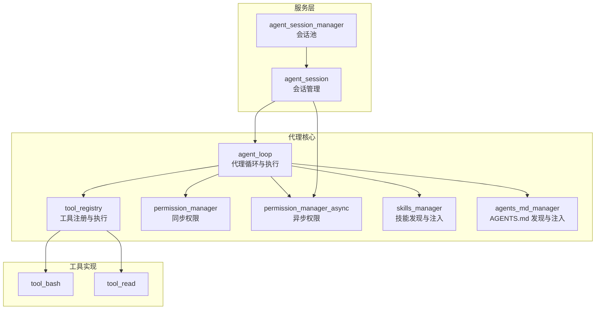
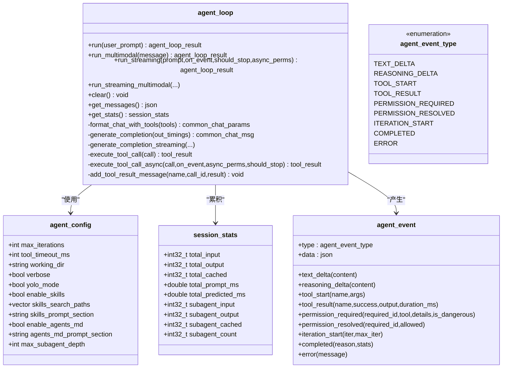
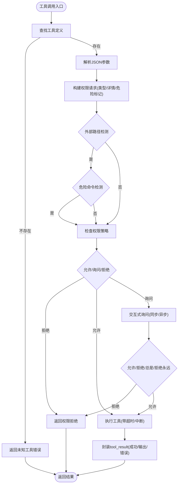
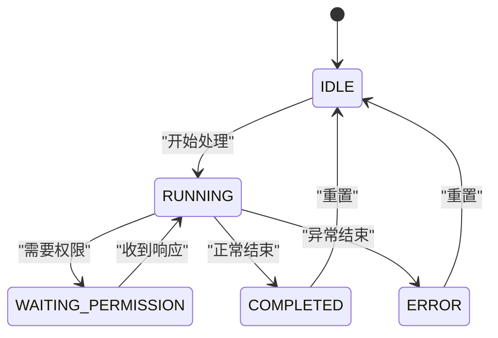
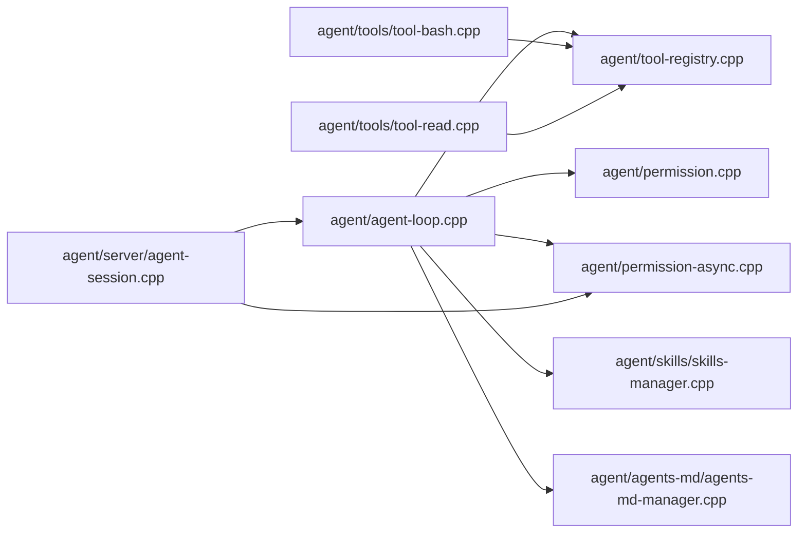

# 代理核心系统

<cite>
**本文引用的文件**
- [agent/agent-loop.h](file://agent/agent-loop.h)
- [agent/agent-loop.cpp](file://agent/agent-loop.cpp)
- [agent/agent.cpp](file://agent/agent.cpp)
- [agent/tool-registry.h](file://agent/tool-registry.h)
- [agent/tool-registry.cpp](file://agent/tool-registry.cpp)
- [agent/permission.h](file://agent/permission.h)
- [agent/permission.cpp](file://agent/permission.cpp)
- [agent/permission-async.h](file://agent/permission-async.h)
- [agent/permission-async.cpp](file://agent/permission-async.cpp)
- [agent/server/agent-session.h](file://agent/server/agent-session.h)
- [agent/server/agent-session.cpp](file://agent/server/agent-session.cpp)
- [agent/tools/tool-bash.cpp](file://agent/tools/tool-bash.cpp)
- [agent/tools/tool-read.cpp](file://agent/tools/tool-read.cpp)
- [agent/skills/skills-manager.h](file://agent/skills/skills-manager.h)
- [agent/skills/skills-manager.cpp](file://agent/skills/skills-manager.cpp)
- [agent/agents-md/agents-md-manager.h](file://agent/agents-md/agents-md-manager.h)
- [agent/agents-md/agents-md-manager.cpp](file://agent/agents-md/agents-md-manager.cpp)
</cite>

## 目录
1. [简介](#简介)
2. [项目结构](#项目结构)
3. [核心组件](#核心组件)
4. [架构总览](#架构总览)
5. [详细组件分析](#详细组件分析)
6. [依赖关系分析](#依赖关系分析)
7. [性能考量](#性能考量)
8. [故障排查指南](#故障排查指南)
9. [结论](#结论)
10. [附录](#附录)

## 简介
本文件面向“代理核心系统”的技术文档，聚焦 agent_loop 类的设计架构与实现细节，涵盖代理循环机制、会话状态管理、统计信息收集、事件系统、流式传输API、多模态支持、代理生命周期管理、权限与安全控制、工具系统集成、技能系统与 AGENTS.md 集成等内容。文档以循序渐进的方式呈现，既适合初学者快速上手，也为高级开发者提供深入的代码级参考。

## 项目结构
代理核心系统位于 agent/ 目录下，围绕 agent_loop 核心类展开，配合工具注册中心、权限管理器、会话管理层以及技能与 AGENTS.md 管理模块，形成可扩展、可流式的本地代理内核。



图示来源
- [agent/agent-loop.h:167-276](file://agent/agent-loop.h#L167-L276)
- [agent/tool-registry.h:58-90](file://agent/tool-registry.h#L58-L90)
- [agent/permission.h:40-101](file://agent/permission.h#L40-L101)
- [agent/permission-async.h:43-142](file://agent/permission-async.h#L43-L142)
- [agent/skills/skills-manager.h:28-63](file://agent/skills/skills-manager.h#L28-L63)
- [agent/agents-md/agents-md-manager.h:18-53](file://agent/agents-md/agents-md-manager.h#L18-L53)
- [agent/server/agent-session.h:65-145](file://agent/server/agent-session.h#L65-L145)

章节来源
- [agent/agent-loop.h:167-276](file://agent/agent-loop.h#L167-L276)
- [agent/server/agent-session.h:65-145](file://agent/server/agent-session.h#L65-L145)

## 核心组件
- agent_loop：代理主循环，负责消息构建、模型推理、工具调用、权限检查、事件流式输出、多模态支持、统计收集与生命周期管理。
- tool_registry：工具注册表，统一管理工具定义、参数模式、执行上下文与执行分发。
- permission_manager / permission_manager_async：权限策略与交互，支持同步阻塞与异步非阻塞两种模式，内置危险命令识别、外部路径检测、重复调用防护等。
- agent_session / agent_session_manager：会话抽象与会话池，提供并发安全的流式事件推送、权限响应、取消与清理。
- 技能系统与 AGENTS.md：按 agentskills.io 与 agents.md 规范发现并注入技能与项目上下文提示词，增强代理的领域适配能力。
- 工具实现样例：bash 与 read 等常用工具，演示工具注册、参数校验、权限判定与结果封装。

章节来源
- [agent/agent-loop.h:167-276](file://agent/agent-loop.h#L167-L276)
- [agent/tool-registry.h:58-90](file://agent/tool-registry.h#L58-L90)
- [agent/permission.h:40-101](file://agent/permission.h#L40-L101)
- [agent/permission-async.h:43-142](file://agent/permission-async.h#L43-L142)
- [agent/server/agent-session.h:65-145](file://agent/server/agent-session.h#L65-L145)
- [agent/skills/skills-manager.h:28-63](file://agent/skills/skills-manager.h#L28-L63)
- [agent/agents-md/agents-md-manager.h:18-53](file://agent/agents-md/agents-md-manager.h#L18-L53)

## 架构总览
代理核心采用“循环-工具-权限-会话”分层设计：
- 循环层（agent_loop）：驱动一次或多轮对话，解析模型输出中的工具调用，调度工具执行，并汇总统计。
- 工具层（tool_registry + 工具实现）：提供统一的工具接口与执行上下文，支持过滤执行（子代理只读模式）。
- 权限层（permission_*）：在工具执行前进行策略判定与用户交互，支持 YOLO 模式与会话级记忆。
- 会话层（agent_session*）：对外提供流式事件 API，支持多会话并发、权限异步响应、超时与取消。
- 上下文层（技能/AGENTS.md）：动态注入系统提示词，提升任务适配性与一致性。

```mermaid
sequenceDiagram
participant Client as "客户端"
participant Session as "agent_session"
participant Loop as "agent_loop"
participant Perm as "permission_manager_async"
participant Tools as "tool_registry"
participant Server as "server_context"
Client->>Session : "发送消息(文本/多模态)"
Session->>Loop : "run_streaming(..., on_event, should_stop, Perm)"
Loop->>Server : "提交推理任务(含工具描述)"
Server-->>Loop : "流式返回token/思考内容"
Loop-->>Session : "on_event(TEXT_DELTA/REASONING_DELTA)"
alt 需要工具
Loop->>Perm : "check_permission(request)"
alt 允许
Loop->>Tools : "execute(name, args, ctx)"
Tools-->>Loop : "tool_result"
Loop-->>Session : "on_event(TOOL_RESULT)"
else 需要授权
Loop-->>Session : "on_event(PERMISSION_REQUIRED)"
Client->>Session : "respond_permission(id, allow, scope)"
Session->>Perm : "respond(...)"
Perm-->>Loop : "继续执行"
end
end
Loop-->>Session : "on_event(COMPLETED/ERROR)"
Session-->>Client : "最终事件与结果"
```

图示来源
- [agent/server/agent-session.cpp:103-211](file://agent/server/agent-session.cpp#L103-L211)
- [agent/agent-loop.cpp:333-480](file://agent/agent-loop.cpp#L333-L480)
- [agent/permission-async.h:43-142](file://agent/permission-async.h#L43-L142)
- [agent/tool-registry.cpp:49-85](file://agent/tool-registry.cpp#L49-L85)

章节来源
- [agent/server/agent-session.cpp:103-211](file://agent/server/agent-session.cpp#L103-L211)
- [agent/agent-loop.cpp:333-480](file://agent/agent-loop.cpp#L333-L480)

## 详细组件分析

### agent_loop 设计与实现
- 构造与初始化
  - 支持主代理与子代理两种构造方式，子代理可限定工具集与 bash 前缀白名单，实现只读探索等场景。
  - 初始化任务默认参数（采样、推测解码、保留上下文、流式输出、逐 token 计时），并设置推理解析格式与工具调用解析开关。
  - 初始化工作目录、工具超时、权限管理器（YOLO 模式、项目根目录）、系统提示词（含工具说明、最佳实践、示例与 AGENTS.md/技能注入段落）。
- 运行流程
  - 文本/多模态输入 → 构建聊天模板 → 提交推理任务 → 流式接收 token 与思考内容 → 解析工具调用 → 执行工具 → 更新历史消息 → 统计计数 → 决策是否继续或结束。
  - 支持中断（ESC/Ctrl+C）与最大迭代次数限制；支持子代理嵌套与统计拆分。
- 事件系统
  - 定义事件类型与数据结构，提供便捷构造器，覆盖文本增量、思考增量、工具开始/结果、权限请求/已决、迭代开始、完成与错误。
  - 流式回调 on_event 在生成阶段与工具执行阶段被触发，便于前端实时渲染。
- 多模态支持
  - 接受 OpenAI 风格的消息对象（role/content），content 可为字符串或内容部件数组；支持图像/音频等媒体文件传入（经 base64 解码后传递给推理层）。
- 统计信息
  - session_stats 聚合输入/输出/缓存 token 数量与对应耗时，区分主代理与子代理贡献，便于成本与性能分析。



图示来源
- [agent/agent-loop.h:39-166](file://agent/agent-loop.h#L39-L166)
- [agent/agent-loop.h:167-276](file://agent/agent-loop.h#L167-L276)

章节来源
- [agent/agent-loop.h:39-166](file://agent/agent-loop.h#L39-L166)
- [agent/agent-loop.h:167-276](file://agent/agent-loop.h#L167-L276)

### 工具系统与权限控制
- 工具注册与执行
  - tool_registry 提供注册、查询、转换为聊天工具格式、执行与过滤执行（子代理只读模式）。
  - 工具定义包含名称、描述、JSON Schema 参数、执行函数指针；执行上下文包含工作目录、中断原子标志、超时、子代理深度与父上下文指针。
  - 示例工具 bash 与 read 展示了参数解析、路径处理、敏感文件保护、输出截断与退出码处理。
- 权限策略
  - 同步 permission_manager：基于类型与详情（如命令、文件路径）匹配默认策略，支持危险命令白名单/黑名单、外部路径检测、重复调用防护、会话记忆。
  - 异步 permission_manager_async：与会话层对接，支持 SSE 回调、请求队列、响应等待、会话作用域持久化与取消。
- 子代理与只读模式
  - 子代理通过 bash_patterns 白名单限制命令前缀，避免破坏性操作；工具调用通过回调向上报告，便于层级统计与审计。



图示来源
- [agent/agent-loop.cpp:482-666](file://agent/agent-loop.cpp#L482-L666)
- [agent/tool-registry.cpp:49-85](file://agent/tool-registry.cpp#L49-L85)
- [agent/permission.cpp:108-140](file://agent/permission.cpp#L108-L140)
- [agent/permission-async.cpp:89-122](file://agent/permission-async.cpp#L89-L122)

章节来源
- [agent/tool-registry.h:17-56](file://agent/tool-registry.h#L17-L56)
- [agent/tool-registry.cpp:49-85](file://agent/tool-registry.cpp#L49-L85)
- [agent/permission.h:40-101](file://agent/permission.h#L40-L101)
- [agent/permission.cpp:108-140](file://agent/permission.cpp#L108-L140)
- [agent/permission-async.h:43-142](file://agent/permission-async.h#L43-L142)
- [agent/permission-async.cpp:89-122](file://agent/permission-async.cpp#L89-L122)

### 会话状态管理与生命周期
- agent_session
  - 状态机：IDLE/RUNNING/WAITING_PERMISSION/COMPLETED/ERROR。
  - 生命周期：创建 → 发送消息 → 后台线程运行 → 事件回调 → 结束或错误 → 清理。
  - 并发安全：内部互斥保护结果缓存；原子标志控制中断；会话级权限管理器与后台线程协作。
  - 会话信息：创建时间、最后活跃时间、消息条数、统计信息。
- agent_session_manager
  - 会话池：创建、查询、删除、列表、清理空闲会话。
  - 模型信息：从 common_params 中提取别名或文件名。



图示来源
- [agent/server/agent-session.h:46-52](file://agent/server/agent-session.h#L46-L52)
- [agent/server/agent-session.cpp:103-211](file://agent/server/agent-session.cpp#L103-L211)

章节来源
- [agent/server/agent-session.h:65-145](file://agent/server/agent-session.h#L65-L145)
- [agent/server/agent-session.cpp:103-211](file://agent/server/agent-session.cpp#L103-L211)

### 事件系统与流式传输API
- 事件类型与数据
  - TEXT_DELTA/REASONING_DELTA：流式文本与思考内容增量。
  - TOOL_START/TOOL_RESULT：工具调用开始与结果，携带耗时。
  - PERMISSION_REQUIRED/PERMISSION_RESOLVED：权限请求与已决，支持危险标记。
  - ITERATION_START：每轮迭代开始。
  - COMPLETED/ERROR：完成与错误，携带原因与统计。
- 流式回调
  - run_streaming/run_streaming_multimodal 将事件通过回调 on_event 逐条推送，客户端可实时渲染。
  - should_stop 用于优雅取消，ESC/Ctrl+C 或会话 cancel 触发中断。

章节来源
- [agent/agent-loop.h:83-162](file://agent/agent-loop.h#L83-L162)
- [agent/agent-loop.cpp:333-480](file://agent/agent-loop.cpp#L333-L480)
- [agent/server/agent-session.cpp:103-211](file://agent/server/agent-session.cpp#L103-L211)

### 多模态支持
- 输入格式
  - OpenAI 风格消息对象，content 支持字符串或内容部件数组；媒体文件以原始缓冲区形式传入。
- 推理层集成
  - 将媒体文件与提示词一并提交至推理任务，保持与文本一致的流式事件体验。
- 应用场景
  - 图像/音频理解、多模态问答、代码与文档辅助等。

章节来源
- [agent/agent-loop.h:185-211](file://agent/agent-loop.h#L185-L211)
- [agent/agent-loop.cpp:355-366](file://agent/agent-loop.cpp#L355-L366)

### 代理配置参数与系统提示词注入
- agent_config 关键字段
  - max_iterations、tool_timeout_ms、working_dir、verbose、yolo_mode。
  - enable_skills/skills_search_paths/skills_prompt_section（agentskills.io）。
  - enable_agents_md/agents_md_prompt_section（agents.md）。
  - max_subagent_depth（子代理嵌套深度）。
- 系统提示词
  - 默认工具清单与使用规范、编辑策略、行为准则、示例与任务完成条件。
  - AGENTS.md 与技能注入段落拼接至系统提示词，增强项目上下文与技能可用性。

章节来源
- [agent/agent-loop.h:39-58](file://agent/agent-loop.h#L39-L58)
- [agent/agent-loop.cpp:107-248](file://agent/agent-loop.cpp#L107-L248)

### 技能系统与 AGENTS.md 集成
- 技能系统（agentskills.io）
  - 发现：从项目本地、用户全局与额外路径扫描技能目录，解析 SKILL.md 前言元数据，生成 XML 注入段落。
  - 校验：名称格式、描述长度、兼容性长度等。
- AGENTS.md（agents.md）
  - 发现：从工作目录向上遍历至 git 根，或包含用户全局 AGENTS.md；按深度排序，最近优先。
  - 注入：生成 XML 段落，包含相对路径与优先级标注。

章节来源
- [agent/skills/skills-manager.h:28-63](file://agent/skills/skills-manager.h#L28-L63)
- [agent/skills/skills-manager.cpp:240-330](file://agent/skills/skills-manager.cpp#L240-L330)
- [agent/agents-md/agents-md-manager.h:18-53](file://agent/agents-md/agents-md-manager.h#L18-L53)
- [agent/agents-md/agents-md-manager.cpp:75-176](file://agent/agents-md/agents-md-manager.cpp#L75-L176)

### 工具实现示例
- bash 工具
  - 参数：command（必填）、timeout（可选，默认继承 agent_config）。
  - 行为：跨平台执行命令，管道读取输出，超时/中断终止，行数截断与尾部摘要，退出码与超时标记。
- read 工具
  - 参数：file_path（必填）、offset（默认0）、limit（默认2000）。
  - 行为：相对路径转绝对路径，敏感文件拦截，逐行读取并编号输出，长行截断，统计总行数与范围提示。

章节来源
- [agent/tools/tool-bash.cpp:50-258](file://agent/tools/tool-bash.cpp#L50-L258)
- [agent/tools/tool-read.cpp:17-93](file://agent/tools/tool-read.cpp#L17-L93)

## 依赖关系分析



图示来源
- [agent/agent-loop.cpp:1-120](file://agent/agent-loop.cpp#L1-L120)
- [agent/server/agent-session.cpp:1-40](file://agent/server/agent-session.cpp#L1-L40)

章节来源
- [agent/agent-loop.cpp:1-120](file://agent/agent-loop.cpp#L1-L120)
- [agent/server/agent-session.cpp:1-40](file://agent/server/agent-session.cpp#L1-L40)

## 性能考量
- Token 统计与计时
  - 逐 token 计时与缓存命中统计，支持主代理与子代理拆分，便于成本分析与优化。
- 流式输出
  - 服务器端流式返回，前端即时渲染，降低感知延迟。
- 工具超时与中断
  - 工具执行超时与全局中断标志，避免长时间阻塞。
- 缓存前缀共享
  - 子代理系统提示词前缀复用，最大化 KV 缓存命中率，减少重复计算。
- 输出截断
  - 工具输出与日志输出截断，防止过大数据影响性能与稳定性。

章节来源
- [agent/agent-loop.cpp:719-731](file://agent/agent-loop.cpp#L719-L731)
- [agent/agent-loop.cpp:368-378](file://agent/agent-loop.cpp#L368-L378)
- [agent/tools/tool-bash.cpp:25-48](file://agent/tools/tool-bash.cpp#L25-L48)

## 故障排查指南
- 常见问题
  - 权限拒绝：检查 permission_manager 的默认策略与危险命令白名单；确认 YOLO 模式是否开启；查看会话级“总是/拒绝永远”记忆。
  - 外部路径访问：确认工作目录与项目根路径，避免越界访问。
  - 工具超时：调整 tool_timeout_ms 或优化工具逻辑；检查中断标志是否被设置。
  - 重复调用防护：出现“重复相同工具调用”提示时，确认是否为死循环，必要时调整策略或人工干预。
  - 多模态媒体：确保媒体文件正确解码为原始缓冲区，大小与格式符合预期。
- 诊断手段
  - 使用 /stats 查看会话统计；使用 /tools 列出可用工具；使用 /skills 与 /agents 查看注入内容。
  - 通过 on_event 的 COMPLETED/ERROR 事件定位失败原因与耗时分布。

章节来源
- [agent/agent.cpp:458-496](file://agent/agent.cpp#L458-L496)
- [agent/permission.cpp:217-223](file://agent/permission.cpp#L217-L223)
- [agent/permission-async.cpp:256-264](file://agent/permission-async.cpp#L256-L264)

## 结论
代理核心系统以 agent_loop 为核心，结合工具注册、权限控制、会话管理与上下文注入，构建了可扩展、可流式、可多模态的本地代理内核。通过事件驱动与统计聚合，系统在安全性与可观测性方面具备良好基础；通过子代理与只读模式，进一步增强了可控性与可审计性。建议在生产环境中启用权限记忆与会话清理策略，并结合统计指标持续优化工具链与提示词注入效果。

## 附录

### API 使用示例（路径指引）
- 创建会话并发送消息（文本）
  - 参考：[agent/server/agent-session.cpp:103-156](file://agent/server/agent-session.cpp#L103-L156)
- 发送多模态消息
  - 参考：[agent/server/agent-session.cpp:158-211](file://agent/server/agent-session.cpp#L158-L211)
- 处理流式事件
  - 参考：事件类型与构造器定义
    - [agent/agent-loop.h:83-162](file://agent/agent-loop.h#L83-L162)
- 管理会话状态与统计
  - 参考：
    - [agent/server/agent-session.h:45-62](file://agent/server/agent-session.h#L45-L62)
    - [agent/server/agent-session.cpp:91-101](file://agent/server/agent-session.cpp#L91-L101)
- 子代理与只读模式
  - 参考：
    - [agent/agent-loop.h:173-179](file://agent/agent-loop.h#L173-L179)
    - [agent/tool-registry.cpp:62-85](file://agent/tool-registry.cpp#L62-L85)