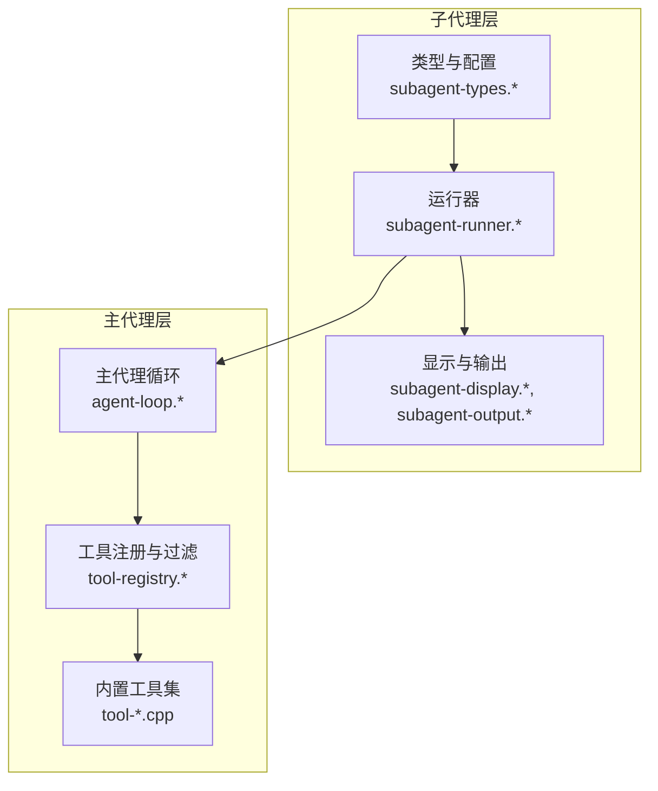
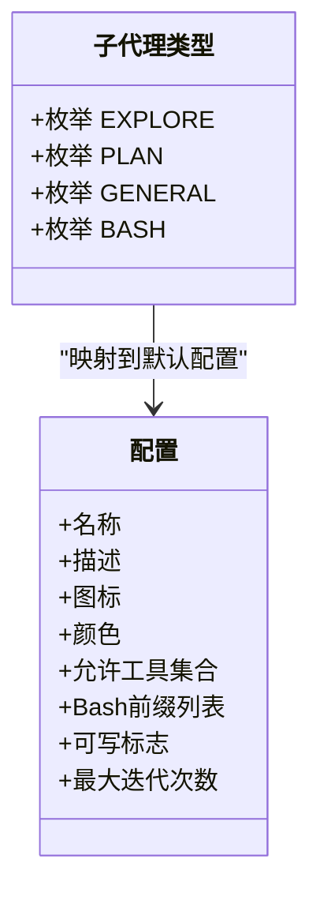
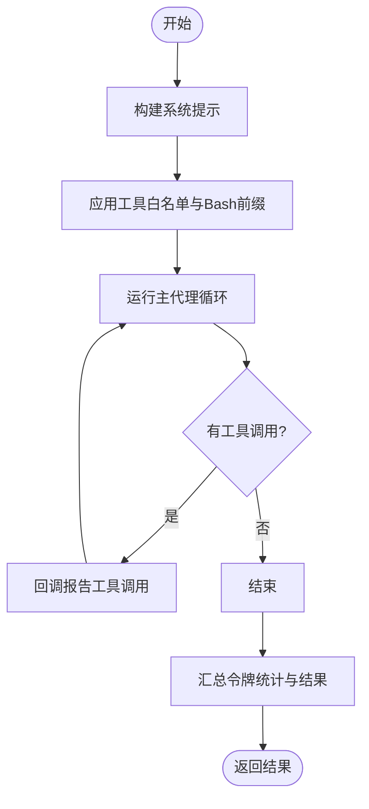
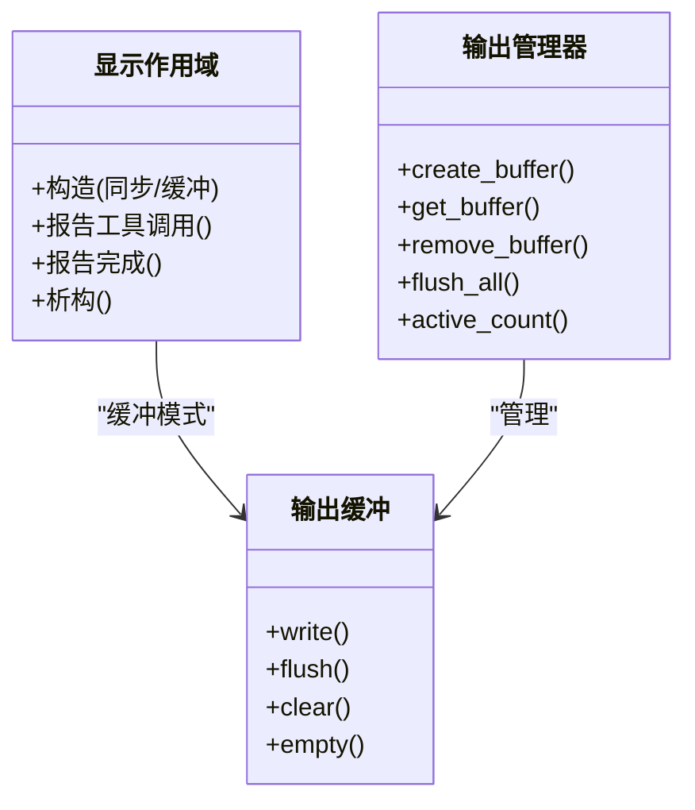
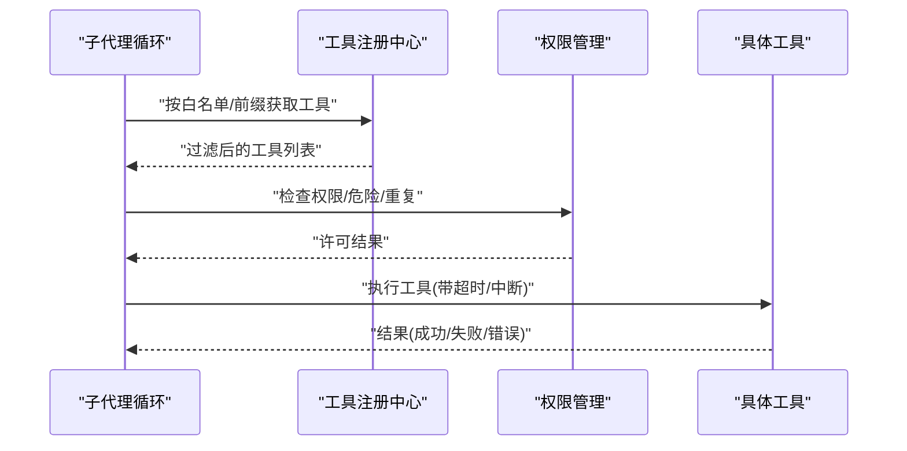
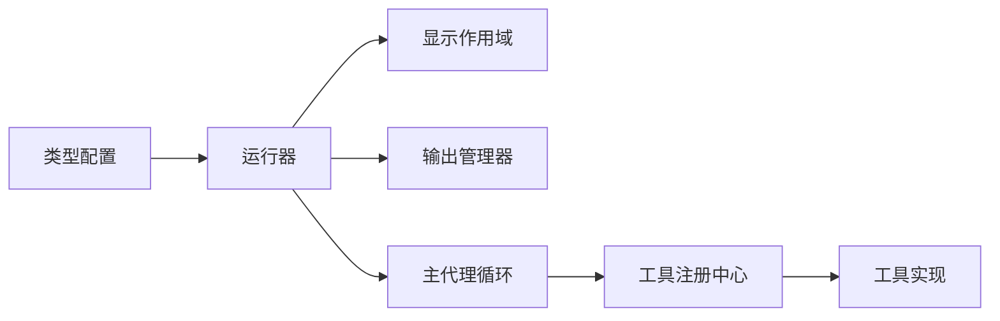

# 子代理系统

<cite>
**本文引用的文件**
- [agent/subagent/subagent-types.h](file://agent/subagent/subagent-types.h)
- [agent/subagent/subagent-types.cpp](file://agent/subagent/subagent-types.cpp)
- [agent/subagent/subagent-runner.h](file://agent/subagent/subagent-runner.h)
- [agent/subagent/subagent-runner.cpp](file://agent/subagent/subagent-runner.cpp)
- [agent/subagent/subagent-display.h](file://agent/subagent/subagent-display.h)
- [agent/subagent/subagent-display.cpp](file://agent/subagent/subagent-display.cpp)
- [agent/subagent/subagent-output.h](file://agent/subagent/subagent-output.h)
- [agent/subagent/subagent-output.cpp](file://agent/subagent/subagent-output.cpp)
- [agent/agent-loop.h](file://agent/agent-loop.h)
- [agent/agent-loop.cpp](file://agent/agent-loop.cpp)
- [agent/tool-registry.h](file://agent/tool-registry.h)
- [agent/tool-registry.cpp](file://agent/tool-registry.cpp)
- [agent/tools/tool-bash.cpp](file://agent/tools/tool-bash.cpp)
- [agent/tools/tool-glob.cpp](file://agent/tools/tool-glob.cpp)
- [agent/tools/tool-read.cpp](file://agent/tools/tool-read.cpp)
- [agent/tools/tool-write.cpp](file://agent/tools/tool-write.cpp)
- [agent/tools/tool-edit.cpp](file://agent/tools/tool-edit.cpp)
</cite>

## 目录
1. [引言](#引言)
2. [项目结构](#项目结构)
3. [核心组件](#核心组件)
4. [架构总览](#架构总览)
5. [详细组件分析](#详细组件分析)
6. [依赖关系分析](#依赖关系分析)
7. [性能考虑](#性能考虑)
8. [故障排查指南](#故障排查指南)
9. [结论](#结论)
10. [附录](#附录)

## 引言
本技术文档围绕子代理系统展开，系统性阐述子代理的架构设计、代理类型定义、执行策略配置、构造机制、工具过滤、系统提示定制、嵌套深度控制等核心能力，并结合探索型、规划型、通用型、Bash专用型等不同类型的特性与使用场景，给出可操作的配置与执行流程说明。同时，文档解释子代理与主代理之间的通信机制、事件传递、结果汇总与集成方式，并提供性能优化建议。

## 项目结构
子代理系统位于 agent/subagent 目录，核心由以下模块组成：
- 类型与配置：定义子代理类型、默认配置（工具白名单、最大迭代次数、Bash前缀限制等）
- 运行器：负责构建系统提示、过滤工具、启动子代理会话、管理后台任务、输出显示与统计
- 显示与输出缓冲：支持同步与异步两种输出模式，提供树形缩进可视化与原子刷新
- 工具注册与过滤：统一注册工具，按白名单与Bash前缀进行过滤执行
- 主代理循环：作为父级运行环境，注入基础系统提示、权限控制、令牌统计与事件流



图表来源
- [agent/subagent/subagent-types.h:1-36](file://agent/subagent/subagent-types.h#L1-L36)
- [agent/subagent/subagent-runner.h:1-114](file://agent/subagent/subagent-runner.h#L1-L114)
- [agent/subagent/subagent-display.h:1-88](file://agent/subagent/subagent-display.h#L1-L88)
- [agent/subagent/subagent-output.h:1-107](file://agent/subagent/subagent-output.h#L1-L107)
- [agent/agent-loop.h:1-276](file://agent/agent-loop.h#L1-L276)
- [agent/tool-registry.h:1-103](file://agent/tool-registry.h#L1-L103)
- [agent/tools/tool-bash.cpp:1-281](file://agent/tools/tool-bash.cpp#L1-L281)
- [agent/tools/tool-glob.cpp:1-181](file://agent/tools/tool-glob.cpp#L1-L181)
- [agent/tools/tool-read.cpp:1-120](file://agent/tools/tool-read.cpp#L1-L120)
- [agent/tools/tool-write.cpp:1-80](file://agent/tools/tool-write.cpp#L1-L80)
- [agent/tools/tool-edit.cpp:1-196](file://agent/tools/tool-edit.cpp#L1-L196)

章节来源
- [agent/subagent/subagent-types.h:1-36](file://agent/subagent/subagent-types.h#L1-L36)
- [agent/subagent/subagent-runner.h:1-114](file://agent/subagent/subagent-runner.h#L1-L114)
- [agent/subagent/subagent-display.h:1-88](file://agent/subagent/subagent-display.h#L1-L88)
- [agent/subagent/subagent-output.h:1-107](file://agent/subagent/subagent-output.h#L1-L107)
- [agent/agent-loop.h:1-276](file://agent/agent-loop.h#L1-L276)
- [agent/tool-registry.h:1-103](file://agent/tool-registry.h#L1-L103)

## 核心组件
- 子代理类型与配置
  - 定义四类子代理：探索型（只读）、规划型（仅文件浏览）、通用型（多步任务，含写入）、Bash专用型（仅命令执行）
  - 每类类型包含名称、描述、图标、颜色、允许工具白名单、Bash前缀列表、是否可写、最大迭代次数等配置
- 子代理运行器
  - 构建系统提示：继承主代理的基础提示，叠加类型专属规则与工具清单
  - 工具过滤：基于白名单与Bash前缀限制，确保只读或受限执行
  - 后台任务：支持非阻塞执行、任务状态查询、取消、清理
  - 输出显示：同步直接输出与缓冲输出两种模式，支持树形缩进与计时统计
- 显示与输出缓冲
  - 提供显示作用域RAII封装，自动处理缩进、图标、类型名、描述、工具调用记录与完成报告
  - 缓冲输出管理器，线程安全地收集与原子刷新输出
- 主代理循环与工具注册
  - 主代理维护基础系统提示与权限控制，子代理复用该提示以提升KV缓存命中率
  - 工具注册中心统一注册与执行，支持按白名单与Bash前缀过滤执行

章节来源
- [agent/subagent/subagent-types.cpp:12-62](file://agent/subagent/subagent-types.cpp#L12-L62)
- [agent/subagent/subagent-runner.cpp:29-118](file://agent/subagent/subagent-runner.cpp#L29-L118)
- [agent/subagent/subagent-display.cpp:38-197](file://agent/subagent/subagent-display.cpp#L38-L197)
- [agent/subagent/subagent-output.cpp:50-206](file://agent/subagent/subagent-output.cpp#L50-L206)
- [agent/agent-loop.cpp:83-104](file://agent/agent-loop.cpp#L83-L104)
- [agent/tool-registry.cpp:39-85](file://agent/tool-registry.cpp#L39-L85)

## 架构总览
子代理系统通过“运行器-显示-输出-主代理循环-工具注册”的协作实现：
- 运行器根据类型配置构建系统提示与工具白名单，创建子代理会话
- 子代理会话在主代理循环中运行，工具执行受白名单与Bash前缀限制
- 执行期间通过回调向父级显示作用域报告工具调用与耗时
- 结果汇总包括成功与否、最终响应、迭代次数、令牌统计与错误信息

```mermaid
sequenceDiagram
participant Caller as "调用方"
participant Runner as "子代理运行器"
participant Display as "显示作用域"
participant Loop as "主代理循环"
participant Registry as "工具注册中心"
Caller->>Runner : "提交子代理参数"
Runner->>Display : "创建显示作用域"
Runner->>Loop : "构建系统提示+工具白名单"
Loop->>Registry : "按白名单/前缀过滤工具"
Loop-->>Runner : "返回最终响应与统计"
Runner->>Display : "报告工具调用与耗时"
Runner-->>Caller : "返回结果(成功/失败/错误)"
```

图表来源
- [agent/subagent/subagent-runner.cpp:133-244](file://agent/subagent/subagent-runner.cpp#L133-L244)
- [agent/agent-loop.cpp:346-366](file://agent/agent-loop.cpp#L346-L366)
- [agent/tool-registry.cpp:39-85](file://agent/tool-registry.cpp#L39-L85)

## 详细组件分析

### 子代理类型与配置
- 类型枚举与配置结构体包含：名称、描述、图标、颜色、允许工具集合、Bash前缀列表、是否可写、最大迭代次数
- 默认配置覆盖四类典型场景：只读探索、架构规划、通用任务、命令执行
- 解析与名称映射函数用于字符串到类型的转换与回显



图表来源
- [agent/subagent/subagent-types.h:8-26](file://agent/subagent/subagent-types.h#L8-L26)
- [agent/subagent/subagent-types.cpp:12-62](file://agent/subagent/subagent-types.cpp#L12-L62)

章节来源
- [agent/subagent/subagent-types.h:1-36](file://agent/subagent/subagent-types.h#L1-L36)
- [agent/subagent/subagent-types.cpp:1-99](file://agent/subagent/subagent-types.cpp#L1-L99)

### 子代理运行器
- 参数与结果
  - 参数：类型、提示、简短描述
  - 结果：成功标志、输出、错误、迭代次数、工具调用摘要、令牌统计
- 同步与异步执行
  - 同步：直接控制台输出，阻塞直到完成
  - 异步：后台线程执行，返回任务ID；支持查询、取消、清理
- 系统提示构建
  - 继承主代理基础提示，叠加类型描述与工具清单，再附加行为准则
- 工具过滤与Bash前缀
  - 使用白名单与Bash前缀集合，确保只读或受限命令执行
- 输出显示与统计
  - 通过显示作用域记录工具调用与耗时，汇总令牌统计并报告完成



图表来源
- [agent/subagent/subagent-runner.cpp:133-244](file://agent/subagent/subagent-runner.cpp#L133-L244)
- [agent/agent-loop.cpp:346-366](file://agent/agent-loop.cpp#L346-L366)

章节来源
- [agent/subagent/subagent-runner.h:23-114](file://agent/subagent/subagent-runner.h#L23-L114)
- [agent/subagent/subagent-runner.cpp:1-388](file://agent/subagent/subagent-runner.cpp#L1-L388)

### 显示与输出缓冲
- 显示作用域
  - 支持同步直接输出与缓冲输出两种模式
  - 自动缩进、图标、类型名、描述渲染，工具调用与完成报告
- 输出缓冲
  - 单任务缓冲：收集片段并原子刷新到控制台
  - 管理器：线程安全地创建、获取、移除与刷新所有缓冲
- 原子输出保护
  - 输出守卫在多段输出时持有控制台互斥锁，避免交错



图表来源
- [agent/subagent/subagent-display.h:15-84](file://agent/subagent/subagent-display.h#L15-L84)
- [agent/subagent/subagent-display.cpp:199-246](file://agent/subagent/subagent-display.cpp#L199-L246)
- [agent/subagent/subagent-output.h:27-83](file://agent/subagent/subagent-output.h#L27-L83)
- [agent/subagent/subagent-output.cpp:50-206](file://agent/subagent/subagent-output.cpp#L50-L206)

章节来源
- [agent/subagent/subagent-display.h:1-88](file://agent/subagent/subagent-display.h#L1-L88)
- [agent/subagent/subagent-display.cpp:1-246](file://agent/subagent/subagent-display.cpp#L1-L246)
- [agent/subagent/subagent-output.h:1-107](file://agent/subagent/subagent-output.h#L1-L107)
- [agent/subagent/subagent-output.cpp:1-207](file://agent/subagent/subagent-output.cpp#L1-L207)

### 主代理循环与工具过滤
- 工具注册与过滤
  - 注册工具定义与JSON模式，支持全部工具与按白名单过滤
  - Bash过滤：检查命令是否匹配前缀列表，否则拒绝执行
- 子代理支持
  - 子代理构造传入白名单、Bash前缀、自定义系统提示、深度与回调
  - 复用主代理的基础系统提示，提升KV缓存复用
- 权限与安全
  - 文件外部路径检测、危险命令识别、重复调用防护、交互式许可



图表来源
- [agent/agent-loop.cpp:346-366](file://agent/agent-loop.cpp#L346-L366)
- [agent/tool-registry.cpp:62-85](file://agent/tool-registry.cpp#L62-L85)
- [agent/agent-loop.cpp:542-580](file://agent/agent-loop.cpp#L542-L580)

章节来源
- [agent/agent-loop.h:167-276](file://agent/agent-loop.h#L167-L276)
- [agent/agent-loop.cpp:1-800](file://agent/agent-loop.cpp#L1-L800)
- [agent/tool-registry.h:1-103](file://agent/tool-registry.h#L1-L103)
- [agent/tool-registry.cpp:1-86](file://agent/tool-registry.cpp#L1-L86)

### 不同类型子代理的特点与使用场景
- 探索型（EXPLORE）
  - 工具白名单：read、glob、bash（只读命令）
  - 行为准则：只读探索，禁止修改与破坏性命令
  - 场景：代码库探索、变更影响评估、审计扫描
- 规划型（PLAN）
  - 工具白名单：read、glob
  - 行为准则：理解现有结构，提供可执行计划
  - 场景：架构设计、重构方案、任务拆解
- 通用型（GENERAL）
  - 工具白名单：read、glob、write、edit、bash
  - 行为准则：多步任务，先读后写，目标化编辑
  - 场景：代码补全、修复、新增功能
- Bash专用型（BASH）
  - 工具白名单：bash
  - 行为准则：严格命令执行，谨慎且可验证
  - 场景：CI/CD脚本、构建测试、运维任务

章节来源
- [agent/subagent/subagent-types.cpp:12-62](file://agent/subagent/subagent-types.cpp#L12-L62)

### 子代理创建、配置与执行流程示例
- 创建步骤
  - 选择类型（解析字符串或直接指定）
  - 准备提示与简短描述
  - 可选：设置工作目录、工具超时、是否启用技能/agents.md
- 同步执行
  - 调用运行器同步方法，阻塞等待完成，直接输出到控制台
- 异步执行
  - 调用后台启动方法，获得任务ID
  - 循环查询完成状态，必要时取消任务
  - 获取结果并清理已完成任务
- 结果汇总
  - 成功/失败、最终响应、迭代次数、工具调用摘要、令牌统计

章节来源
- [agent/subagent/subagent-runner.h:70-92](file://agent/subagent/subagent-runner.h#L70-L92)
- [agent/subagent/subagent-runner.cpp:246-348](file://agent/subagent/subagent-runner.cpp#L246-L348)

### 子代理与主代理的通信与集成
- 通信机制
  - 子代理继承主代理的基础系统提示，共享KV缓存前缀，降低重复计算
  - 工具执行通过工具注册中心统一调度，支持白名单与Bash前缀过滤
  - 子代理执行期间通过回调向父级显示作用域报告工具调用与耗时
- 事件传递与结果汇总
  - 主代理循环维护会话统计（输入/输出/缓存令牌），子代理统计被纳入子代理子集
  - 结果结构包含停止原因、最终响应、迭代次数与错误信息
- 集成要点
  - 子代理深度控制：通过工具上下文中的深度与最大深度限制嵌套层级
  - 中断信号：共享中断标志，支持Ctrl+C等中断传播至子代理

章节来源
- [agent/agent-loop.cpp:83-104](file://agent/agent-loop.cpp#L83-L104)
- [agent/agent-loop.cpp:253-296](file://agent/agent-loop.cpp#L253-L296)
- [agent/tool-registry.cpp:62-85](file://agent/tool-registry.cpp#L62-L85)
- [agent/subagent/subagent-runner.cpp:173-244](file://agent/subagent/subagent-runner.cpp#L173-L244)

## 依赖关系分析
- 组件耦合
  - 运行器依赖类型配置、显示/输出模块、主代理循环与工具注册中心
  - 显示/输出模块相互独立，通过管理器与缓冲接口连接
  - 主代理循环与工具注册中心双向协作：前者提供上下文与权限，后者提供工具执行
- 外部依赖
  - 控制台输出与互斥锁用于原子输出
  - 文件系统与正则表达式用于工具实现（glob、read、write、edit）



图表来源
- [agent/subagent/subagent-types.cpp:12-62](file://agent/subagent/subagent-types.cpp#L12-L62)
- [agent/subagent/subagent-runner.cpp:1-388](file://agent/subagent/subagent-runner.cpp#L1-L388)
- [agent/subagent/subagent-display.cpp:1-246](file://agent/subagent/subagent-display.cpp#L1-L246)
- [agent/subagent/subagent-output.cpp:1-207](file://agent/subagent/subagent-output.cpp#L1-L207)
- [agent/agent-loop.cpp:1-800](file://agent/agent-loop.cpp#L1-L800)
- [agent/tool-registry.cpp:1-86](file://agent/tool-registry.cpp#L1-L86)

章节来源
- [agent/subagent/subagent-runner.h:1-114](file://agent/subagent/subagent-runner.h#L1-L114)
- [agent/subagent/subagent-display.h:1-88](file://agent/subagent/subagent-display.h#L1-L88)
- [agent/subagent/subagent-output.h:1-107](file://agent/subagent/subagent-output.h#L1-L107)
- [agent/agent-loop.h:1-276](file://agent/agent-loop.h#L1-L276)
- [agent/tool-registry.h:1-103](file://agent/tool-registry.h#L1-L103)

## 性能考虑
- KV缓存复用
  - 子代理系统提示以主代理基础提示为前缀，最大化KV缓存命中，减少重复token计算
- 输出原子化
  - 使用输出守卫与缓冲管理器，避免并发输出交错，保证日志一致性
- 工具执行优化
  - Bash工具实现支持超时与中断，防止长时间阻塞
  - glob工具限制结果数量，避免大规模遍历导致性能问题
- 并发与资源
  - 后台任务采用线程池与互斥锁管理，定期清理已完成任务，避免资源泄漏

章节来源
- [agent/agent-loop.cpp:83-104](file://agent/agent-loop.cpp#L83-L104)
- [agent/subagent/subagent-output.cpp:111-155](file://agent/subagent/subagent-output.cpp#L111-L155)
- [agent/tools/tool-bash.cpp:50-258](file://agent/tools/tool-bash.cpp#L50-L258)
- [agent/tools/tool-glob.cpp:104-155](file://agent/tools/tool-glob.cpp#L104-L155)
- [agent/subagent/subagent-runner.cpp:374-388](file://agent/subagent/subagent-runner.cpp#L374-L388)

## 故障排查指南
- 子代理未执行或立即退出
  - 检查类型配置的最大迭代次数与提示内容是否正确
  - 确认工具白名单是否包含所需工具
- Bash命令被拒绝
  - 确认命令是否匹配类型配置中的Bash前缀列表
  - 检查是否存在危险模式（如删除根目录、修改权限等）
- 输出错乱或丢失
  - 异步模式下使用输出管理器的刷新功能
  - 避免在多个线程中直接写控制台而不经守卫
- 超时与中断
  - 调整工具超时时间或在运行器中设置合理的最大迭代次数
  - 确保中断标志在父级与子级之间共享

章节来源
- [agent/subagent/subagent-runner.cpp:231-244](file://agent/subagent/subagent-runner.cpp#L231-L244)
- [agent/tool-registry.cpp:62-85](file://agent/tool-registry.cpp#L62-L85)
- [agent/tools/tool-bash.cpp:50-258](file://agent/tools/tool-bash.cpp#L50-L258)
- [agent/subagent/subagent-output.cpp:111-155](file://agent/subagent/subagent-output.cpp#L111-L155)

## 结论
子代理系统通过类型化配置、工具过滤、系统提示定制与嵌套深度控制，实现了对不同任务场景的安全、可控与高效执行。运行器与显示/输出模块的分离提供了清晰的职责边界，主代理循环与工具注册中心的协作确保了权限与性能的平衡。结合异步执行与KV缓存复用，系统在复杂工程任务中具备良好的扩展性与稳定性。

## 附录
- 关键数据结构与枚举
  - 子代理类型：EXPLORE、PLAN、GENERAL、BASH
  - 停止原因：COMPLETED、MAX_ITERATIONS、USER_CANCELLED、AGENT_ERROR
- 常用工具
  - bash：执行shell命令，支持超时与中断
  - glob：按模式查找文件，支持递归与排序
  - read：读取文件内容，带行号与截断
  - write：创建/覆盖文件
  - edit：精确文本替换，支持一次性替换全部

章节来源
- [agent/subagent/subagent-types.h:8-13](file://agent/subagent/subagent-types.h#L8-L13)
- [agent/agent-loop.h:31-36](file://agent/agent-loop.h#L31-L36)
- [agent/tools/tool-bash.cpp:25-258](file://agent/tools/tool-bash.cpp#L25-L258)
- [agent/tools/tool-glob.cpp:72-155](file://agent/tools/tool-glob.cpp#L72-L155)
- [agent/tools/tool-read.cpp:17-92](file://agent/tools/tool-read.cpp#L17-L92)
- [agent/tools/tool-write.cpp:10-56](file://agent/tools/tool-write.cpp#L10-L56)
- [agent/tools/tool-edit.cpp:69-163](file://agent/tools/tool-edit.cpp#L69-L163)