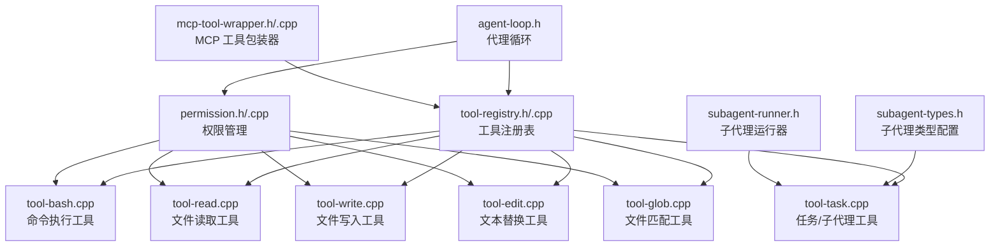
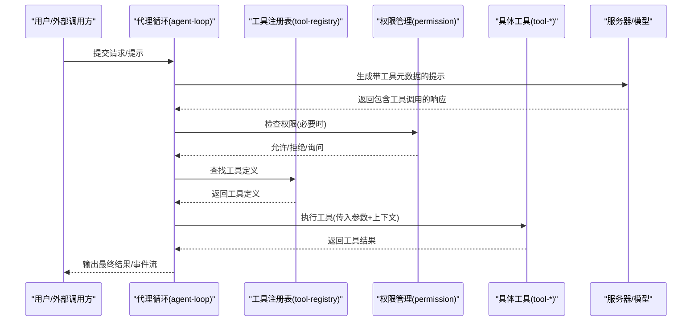
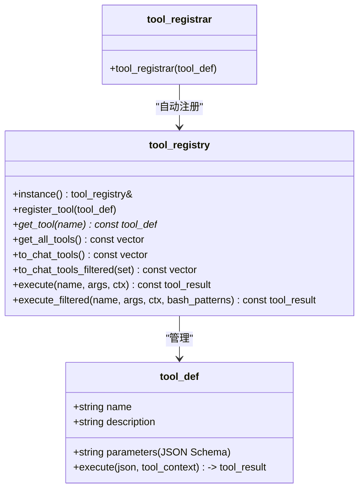
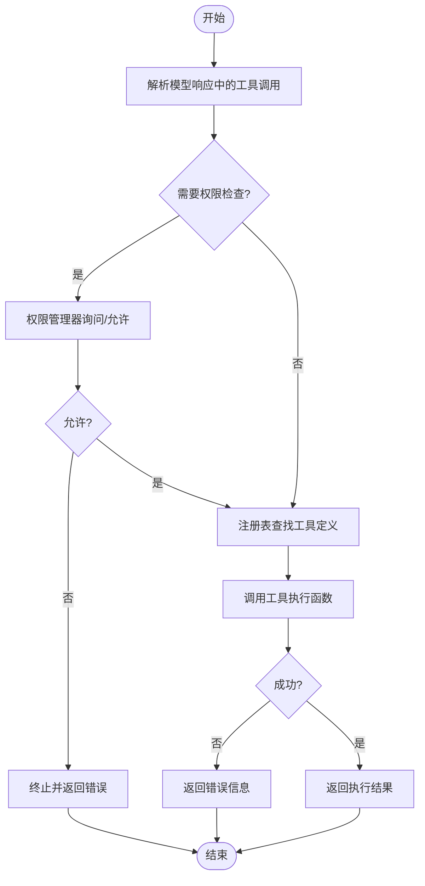
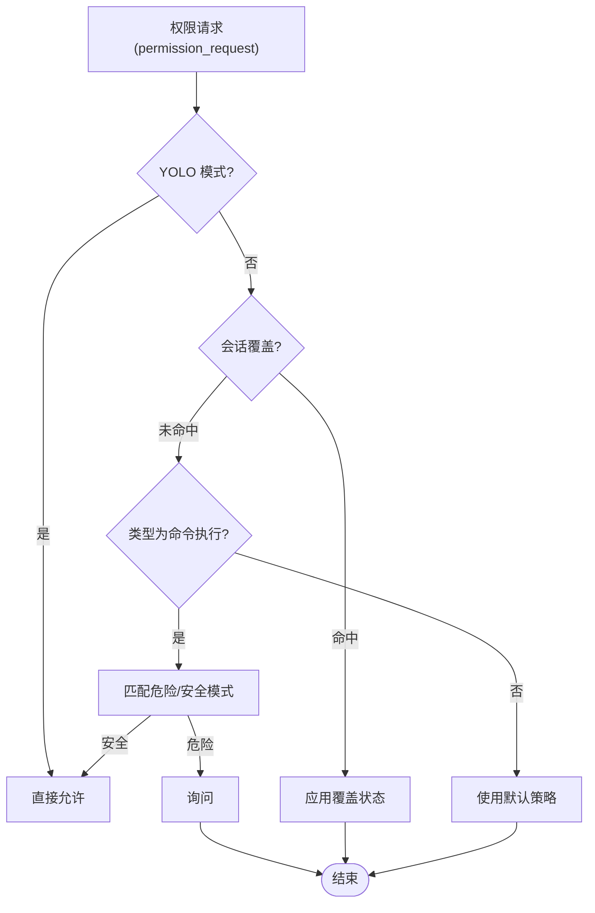
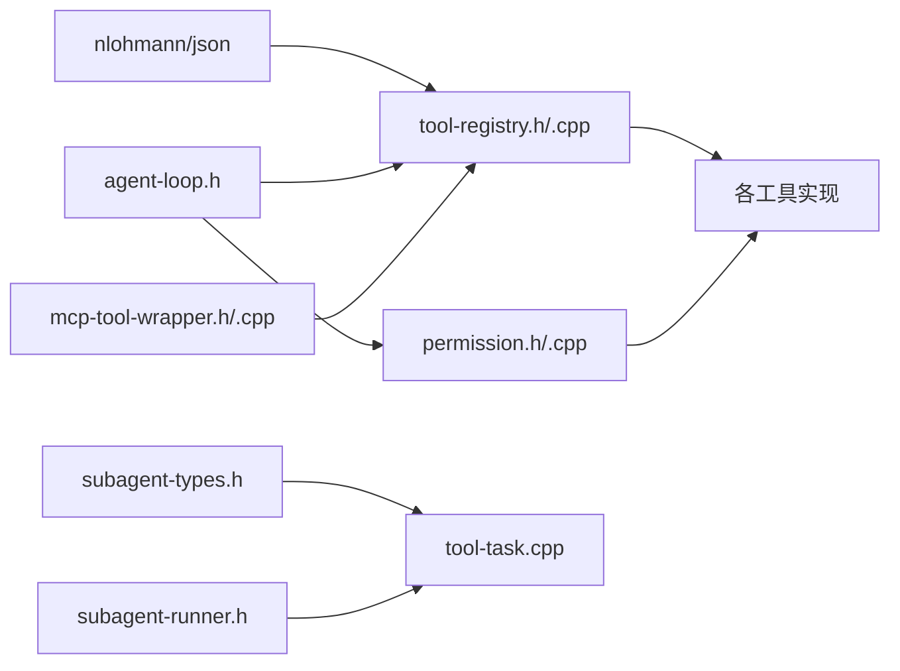

# 工具注册系统

<cite>
**本文档引用的文件**
- [tool-registry.h](file://agent/tool-registry.h)
- [tool-registry.cpp](file://agent/tool-registry.cpp)
- [tool-bash.cpp](file://agent/tools/tool-bash.cpp)
- [tool-edit.cpp](file://agent/tools/tool-edit.cpp)
- [tool-read.cpp](file://agent/tools/tool-read.cpp)
- [tool-write.cpp](file://agent/tools/tool-write.cpp)
- [tool-glob.cpp](file://agent/tools/tool-glob.cpp)
- [tool-task.cpp](file://agent/tools/tool-task.cpp)
- [permission.h](file://agent/permission.h)
- [permission.cpp](file://agent/permission.cpp)
- [agent-loop.h](file://agent/agent-loop.h)
- [subagent-types.h](file://agent/subagent/subagent-types.h)
- [subagent-runner.h](file://agent/subagent/subagent-runner.h)
- [mcp-tool-wrapper.cpp](file://agent/mcp/mcp-tool-wrapper.cpp)
- [mcp-tool-wrapper.h](file://agent/mcp/mcp-tool-wrapper.h)
</cite>

## 目录
1. [简介](#简介)
2. [项目结构](#项目结构)
3. [核心组件](#核心组件)
4. [架构总览](#架构总览)
5. [详细组件分析](#详细组件分析)
6. [依赖关系分析](#依赖关系分析)
7. [性能考虑](#性能考虑)
8. [故障排查指南](#故障排查指南)
9. [结论](#结论)
10. [附录](#附录)

## 简介
本文件为“工具注册系统”的综合技术文档，围绕以下目标展开：
- 工具注册机制与工具定义规范
- 工具元数据管理与参数校验
- 工具执行流程与执行上下文
- 工具分类体系（文件操作、命令执行、文本编辑、任务管理等）
- 权限控制与安全策略
- 工具结果处理与事件流
- 与代理循环、权限管理、MCP 工具集成方式

## 项目结构
工具注册系统位于 agent 子目录中，核心由工具注册表、具体工具实现、权限管理、子代理（任务）运行器以及 MCP 工具包装器组成。下图展示了与工具系统直接相关的模块关系。

图表来源
- [tool-registry.h:58-97](file://agent/tool-registry.h#L58-L97)
- [tool-registry.cpp:11-85](file://agent/tool-registry.cpp#L11-L85)
- [tool-bash.cpp:260-280](file://agent/tools/tool-bash.cpp#L260-L280)
- [tool-read.cpp:95-119](file://agent/tools/tool-read.cpp#L95-L119)
- [tool-write.cpp:59-79](file://agent/tools/tool-write.cpp#L59-L79)
- [tool-edit.cpp:166-195](file://agent/tools/tool-edit.cpp#L166-L195)
- [tool-glob.cpp:158-180](file://agent/tools/tool-glob.cpp#L158-L180)
- [tool-task.cpp:210-257](file://agent/tools/tool-task.cpp#L210-L257)
- [permission.h:40-101](file://agent/permission.h#L40-L101)
- [permission.cpp:34-140](file://agent/permission.cpp#L34-L140)
- [agent-loop.h:167-275](file://agent/agent-loop.h#L167-L275)
- [subagent-types.h:8-35](file://agent/subagent/subagent-types.h#L8-L35)
- [subagent-runner.h:64-113](file://agent/subagent/subagent-runner.h#L64-L113)
- [mcp-tool-wrapper.cpp:7-63](file://agent/mcp/mcp-tool-wrapper.cpp#L7-L63)

章节来源
- [tool-registry.h:1-103](file://agent/tool-registry.h#L1-L103)
- [tool-registry.cpp:1-86](file://agent/tool-registry.cpp#L1-L86)
- [agent-loop.h:1-276](file://agent/agent-loop.h#L1-L276)

## 核心组件
- 工具注册表（tool_registry）
  - 单例模式，负责工具的注册、查询、批量导出与执行
  - 提供过滤执行（如只读模式下的 bash 白名单）
- 工具定义（tool_def）
  - 包含名称、描述、JSON Schema 参数定义、执行函数指针
  - 可转换为通用聊天工具格式以适配模型提示
- 工具上下文（tool_context）
  - 传递工作目录、中断信号、超时、子代理深度限制、缓存前缀等
- 工具结果（tool_result）
  - 统一返回成功标志、输出内容、错误信息
- 工具自动注册宏（REGISTER_TOOL）
  - 在全局静态区构造 tool_registrar，触发自动注册

章节来源
- [tool-registry.h:17-56](file://agent/tool-registry.h#L17-L56)
- [tool-registry.h:58-97](file://agent/tool-registry.h#L58-L97)
- [tool-registry.cpp:11-85](file://agent/tool-registry.cpp#L11-L85)

## 架构总览
工具系统通过注册表集中管理所有工具，并在代理循环中被调用。权限管理贯穿工具执行前后，敏感文件与危险命令会被拦截或要求用户确认。子代理工具可派生新的受限代理以完成复杂任务。MCP 工具通过包装器动态注入到注册表中。

图表来源
- [agent-loop.h:235-243](file://agent/agent-loop.h#L235-L243)
- [tool-registry.cpp:49-60](file://agent/tool-registry.cpp#L49-L60)
- [permission.cpp:108-140](file://agent/permission.cpp#L108-L140)

## 详细组件分析

### 工具注册机制与 REGISTER_TOOL 宏
- 工具注册表采用单例，内部以名称映射存储 tool_def
- REGISTER_TOOL 宏在编译期创建一个静态 tool_registrar 实例，其构造函数会调用注册表的 register_tool，从而实现“声明即注册”
- 这种设计避免了手动集中式注册，降低遗漏风险，提升可维护性

图表来源
- [tool-registry.h:58-97](file://agent/tool-registry.h#L58-L97)
- [tool-registry.cpp:6-13](file://agent/tool-registry.cpp#L6-L13)
- [tool-registry.h:92-102](file://agent/tool-registry.h#L92-L102)

章节来源
- [tool-registry.h:92-102](file://agent/tool-registry.h#L92-L102)
- [tool-registry.cpp:6-13](file://agent/tool-registry.cpp#L6-L13)

### 工具元数据管理与参数验证
- 工具参数通过 JSON Schema 字符串定义，便于模型自动推断和校验
- 工具执行前通常进行参数存在性与基本合法性检查；部分工具还进行更严格的约束（如文件路径、替换范围等）

章节来源
- [tool-bash.cpp:264-278](file://agent/tools/tool-bash.cpp#L264-L278)
- [tool-read.cpp:99-116](file://agent/tools/tool-read.cpp#L99-L116)
- [tool-write.cpp:62-76](file://agent/tools/tool-write.cpp#L62-L76)
- [tool-edit.cpp:171-192](file://agent/tools/tool-edit.cpp#L171-L192)
- [tool-glob.cpp:163-177](file://agent/tools/tool-glob.cpp#L163-L177)

### 工具执行流程与上下文
- 代理循环根据模型输出解析工具调用，先经权限管理检查，再通过注册表查找工具定义，最后调用工具执行函数
- 工具执行上下文包含工作目录、超时、中断信号、子代理深度限制、共享系统提示前缀等，确保工具在受控环境中运行

图表来源
- [agent-loop.h:235-243](file://agent/agent-loop.h#L235-L243)
- [tool-registry.cpp:49-60](file://agent/tool-registry.cpp#L49-L60)
- [permission.cpp:108-140](file://agent/permission.cpp#L108-L140)

章节来源
- [agent-loop.h:235-243](file://agent/agent-loop.h#L235-L243)
- [tool-registry.cpp:49-60](file://agent/tool-registry.cpp#L49-L60)

### 工具分类体系与典型工具
- 文件操作类
  - read：按偏移与限制读取文件内容，支持长行截断与分页
  - write：创建/覆盖文件，自动创建父目录
  - edit：基于精确文本替换的编辑，支持多处替换或唯一定位
  - glob：递归匹配文件，支持通配符与排序
- 命令执行类
  - bash：跨平台命令执行，支持超时、输出截断、退出码与超时标记
- 任务管理类
  - task：派生子代理执行复杂任务，支持同步/后台模式、任务恢复、统计聚合

章节来源
- [tool-read.cpp:17-93](file://agent/tools/tool-read.cpp#L17-L93)
- [tool-write.cpp:10-57](file://agent/tools/tool-write.cpp#L10-L57)
- [tool-edit.cpp:69-164](file://agent/tools/tool-edit.cpp#L69-L164)
- [tool-glob.cpp:72-156](file://agent/tools/tool-glob.cpp#L72-L156)
- [tool-bash.cpp:50-258](file://agent/tools/tool-bash.cpp#L50-L258)
- [tool-task.cpp:71-208](file://agent/tools/tool-task.cpp#L71-L208)

### 权限控制与安全策略
- 权限状态与类型
  - 允许/询问/拒绝/会话级允许/会话级拒绝
  - 类型覆盖命令执行、文件读写、文件编辑、文件匹配、越界路径等
- 敏感文件检测
  - 对包含凭证、密钥、证书等特征的文件名/扩展名进行阻断
- 危险命令白名单/黑名单
  - 对破坏性、提权、远程执行、系统修改等命令进行严格管控
- 外部路径检查
  - 判断是否越出项目根目录
- 会话级覆盖与环路检测
  - 记录近期工具调用，防止重复/死循环

图表来源
- [permission.h:40-101](file://agent/permission.h#L40-L101)
- [permission.cpp:34-140](file://agent/permission.cpp#L34-L140)
- [permission.cpp:230-304](file://agent/permission.cpp#L230-L304)

章节来源
- [permission.h:8-101](file://agent/permission.h#L8-L101)
- [permission.cpp:34-140](file://agent/permission.cpp#L34-L140)
- [tool-read.cpp:42-45](file://agent/tools/tool-read.cpp#L42-L45)
- [tool-write.cpp:24-27](file://agent/tools/tool-write.cpp#L24-L27)
- [tool-edit.cpp:98-103](file://agent/tools/tool-edit.cpp#L98-L103)

### 工具结果处理与事件流
- 工具统一返回 tool_result，代理循环将其转为消息并加入对话历史
- 流式接口通过 agent_event 回调输出事件，包括文本增量、推理内容、工具开始/结果、权限请求/解决、迭代开始、完成、错误等

章节来源
- [tool-registry.h:36-41](file://agent/tool-registry.h#L36-L41)
- [agent-loop.h:96-162](file://agent/agent-loop.h#L96-L162)
- [agent-loop.h:245-248](file://agent/agent-loop.h#L245-L248)

### 与代理循环、权限管理的集成
- 代理循环在每次迭代中：
  - 格式化带工具元数据的提示
  - 生成模型回复并解析工具调用
  - 使用权限管理器决定是否放行
  - 通过注册表执行工具并汇总结果
- 子代理工具通过子代理运行器在受限工具集与系统提示下执行，同时将 token 统计回传给父会话

章节来源
- [agent-loop.h:224-243](file://agent/agent-loop.h#L224-L243)
- [tool-task.cpp:31-69](file://agent/tools/tool-task.cpp#L31-L69)
- [subagent-runner.h:64-113](file://agent/subagent/subagent-runner.h#L64-L113)

### MCP 工具集成
- MCP 工具包装器从 MCP 服务器管理器列举工具，动态构建 tool_def 并注册到注册表
- 执行时转发到 MCP 服务器，将返回内容转换为统一输出

章节来源
- [mcp-tool-wrapper.h:1-8](file://agent/mcp/mcp-tool-wrapper.h#L1-L8)
- [mcp-tool-wrapper.cpp:7-63](file://agent/mcp/mcp-tool-wrapper.cpp#L7-L63)

## 依赖关系分析
- 工具注册表依赖 JSON 库与通用聊天工具类型
- 具体工具依赖注册表头文件与权限管理
- 代理循环依赖注册表、权限管理、事件回调
- 子代理工具依赖子代理类型配置与运行器
- MCP 工具包装器依赖 MCP 服务器管理器

图表来源
- [tool-registry.h:3-15](file://agent/tool-registry.h#L3-L15)
- [tool-registry.cpp:1-5](file://agent/tool-registry.cpp#L1-L5)
- [agent-loop.h:3-23](file://agent/agent-loop.h#L3-L23)
- [mcp-tool-wrapper.cpp:1-6](file://agent/mcp/mcp-tool-wrapper.cpp#L1-L6)

章节来源
- [tool-registry.h:3-15](file://agent/tool-registry.h#L3-L15)
- [agent-loop.h:3-23](file://agent/agent-loop.h#L3-L23)
- [mcp-tool-wrapper.cpp:1-6](file://agent/mcp/mcp-tool-wrapper.cpp#L1-L6)

## 性能考虑
- 输出截断与行数限制：命令执行与文件读取均设置最大长度与行数，避免大输出拖慢系统
- 超时控制：命令执行与工具执行均支持毫秒级超时，防止长时间阻塞
- 非阻塞读取与轮询：命令执行在 Unix 下使用非阻塞管道与 waitpid 轮询，Windows 使用 PeekNamedPipe
- 子代理统计：子代理 token 使用被聚合到父会话统计中，便于整体性能监控

章节来源
- [tool-bash.cpp:25-258](file://agent/tools/tool-bash.cpp#L25-L258)
- [tool-read.cpp:14-93](file://agent/tools/tool-read.cpp#L14-L93)
- [tool-task.cpp:50-69](file://agent/tools/tool-task.cpp#L50-L69)

## 故障排查指南
- 工具未找到
  - 现象：返回未知工具错误
  - 排查：确认工具已通过 REGISTER_TOOL 正确注册，名称一致
- 参数缺失或非法
  - 现象：返回参数校验失败
  - 排查：对照工具 JSON Schema，确保必填字段齐全且类型正确
- 权限被拒绝
  - 现象：权限管理器拒绝或弹出询问
  - 排查：检查危险命令/敏感文件/越界路径；必要时启用会话级允许或调整默认策略
- 命令执行失败/超时
  - 现象：返回退出码、超时标记或异常
  - 排查：缩短超时、检查工作目录、确认命令可用性
- 子代理深度超限
  - 现象：无法派生更多子代理
  - 排查：调整最大嵌套深度配置或改用同步模式

章节来源
- [tool-registry.cpp:51-59](file://agent/tool-registry.cpp#L51-L59)
- [tool-bash.cpp:54-56](file://agent/tools/tool-bash.cpp#L54-L56)
- [tool-read.cpp:22-24](file://agent/tools/tool-read.cpp#L22-L24)
- [permission.cpp:108-140](file://agent/permission.cpp#L108-L140)
- [tool-task.cpp:77-82](file://agent/tools/tool-task.cpp#L77-L82)

## 结论
工具注册系统通过“声明即注册”的宏机制、统一的工具定义与执行接口、完善的权限与安全策略，实现了可扩展、可控、可观测的工具生态。结合代理循环、子代理与 MCP 工具包装器，系统能够灵活地处理从简单文件操作到复杂任务编排的多种场景。

## 附录

### 如何注册新工具（步骤指引）
- 定义工具执行函数：接收参数 JSON 与工具上下文，返回统一结果
- 构造 tool_def：填写名称、描述、JSON Schema 参数字符串、执行函数
- 使用 REGISTER_TOOL 宏在编译期注册

参考路径
- [tool-bash.cpp:260-280](file://agent/tools/tool-bash.cpp#L260-L280)
- [tool-read.cpp:95-119](file://agent/tools/tool-read.cpp#L95-L119)
- [tool-write.cpp:59-79](file://agent/tools/tool-write.cpp#L59-L79)
- [tool-edit.cpp:166-195](file://agent/tools/tool-edit.cpp#L166-L195)
- [tool-glob.cpp:158-180](file://agent/tools/tool-glob.cpp#L158-L180)
- [tool-task.cpp:210-257](file://agent/tools/tool-task.cpp#L210-L257)

### 工具参数定义规范（要点）
- 使用 JSON Schema 描述参数结构与必填项
- 对于复杂参数，建议提供清晰的描述与示例
- 必要时在工具执行函数内补充业务规则校验

参考路径
- [tool-bash.cpp:264-278](file://agent/tools/tool-bash.cpp#L264-L278)
- [tool-edit.cpp:171-192](file://agent/tools/tool-edit.cpp#L171-L192)
- [tool-read.cpp:99-116](file://agent/tools/tool-read.cpp#L99-L116)
- [tool-write.cpp:62-76](file://agent/tools/tool-write.cpp#L62-L76)
- [tool-glob.cpp:163-177](file://agent/tools/tool-glob.cpp#L163-L177)

### 工具执行上下文关键字段
- working_dir：工作目录
- is_interrupted：中断信号原子标志
- timeout_ms：默认超时时间
- server_ctx_ptr/agent_config_ptr/common_params_ptr/session_stats_ptr：父代理上下文指针
- subagent_depth/max_subagent_depth：子代理深度限制
- base_system_prompt：系统提示前缀（用于缓存复用）

参考路径
- [tool-registry.h:17-34](file://agent/tool-registry.h#L17-L34)

### 工具分类与访问控制
- 文件操作：read、write、edit、glob
- 命令执行：bash
- 任务管理：task（子代理）
- MCP 工具：通过包装器动态注入

参考路径
- [subagent-types.h:8-26](file://agent/subagent/subagent-types.h#L8-L26)
- [mcp-tool-wrapper.cpp:7-63](file://agent/mcp/mcp-tool-wrapper.cpp#L7-L63)