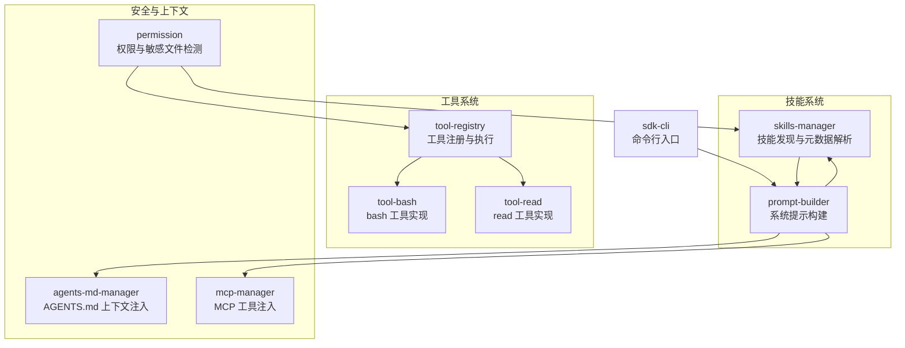
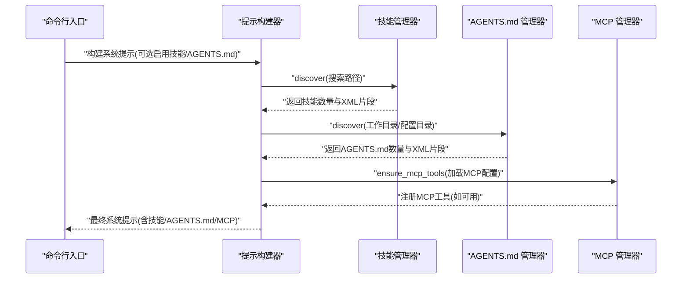
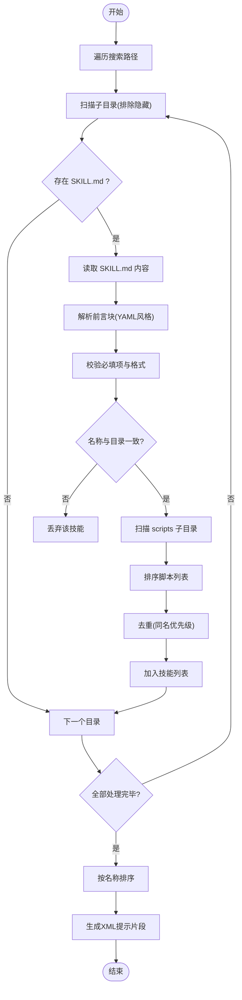
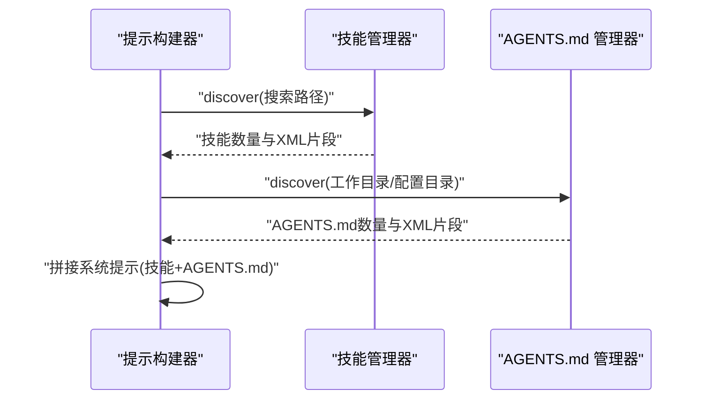
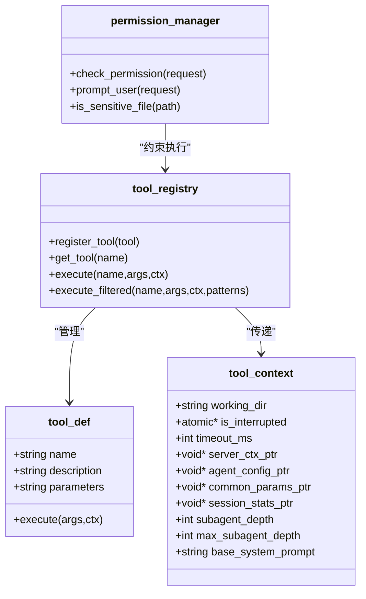
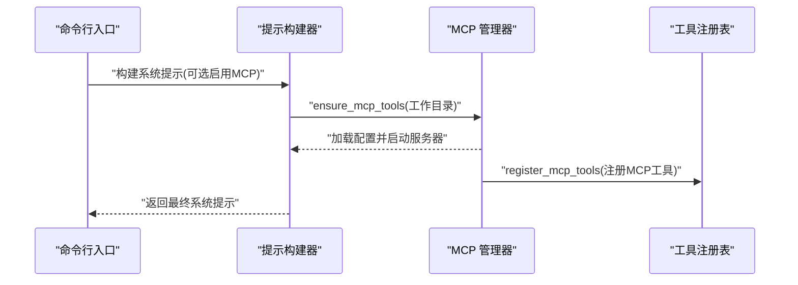
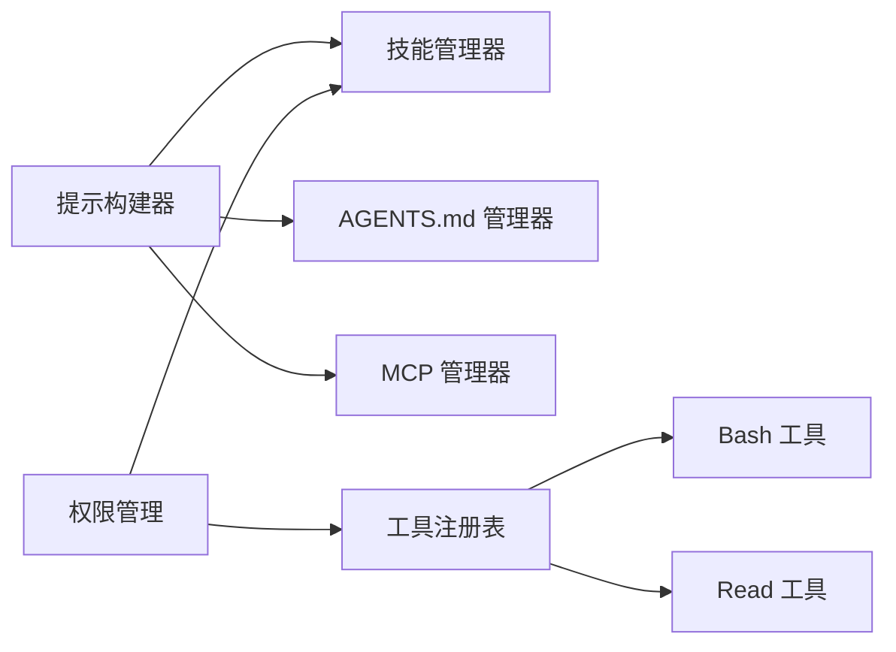

# 技能管理系统

<cite>
**本文引用的文件**
- [skills-manager.cpp](file://agent/skills/skills-manager.cpp)
- [skills-manager.h](file://agent/skills/skills-manager.h)
- [prompt-builder.cpp](file://agent/sdk/prompt-builder.cpp)
- [prompt-builder.h](file://agent/sdk/prompt-builder.h)
- [tool-registry.cpp](file://agent/tool-registry.cpp)
- [tool-registry.h](file://agent/tool-registry.h)
- [tool-bash.cpp](file://agent/tools/tool-bash.cpp)
- [tool-read.cpp](file://agent/tools/tool-read.cpp)
- [permission.cpp](file://agent/permission.cpp)
- [permission.h](file://agent/permission.h)
- [agents-md-manager.cpp](file://agent/agents-md/agents-md-manager.cpp)
- [agents-md-manager.h](file://agent/agents-md/agents-md-manager.h)
- [sdk-cli.cpp](file://agent/sdk/sdk-cli.cpp)
- [mcp-manager.cpp](file://agent/sdk/mcp-manager.cpp)
</cite>

## 目录
1. [简介](#简介)
2. [项目结构](#项目结构)
3. [核心组件](#核心组件)
4. [架构总览](#架构总览)
5. [详细组件分析](#详细组件分析)
6. [依赖关系分析](#依赖关系分析)
7. [性能考量](#性能考量)
8. [故障排查指南](#故障排查指南)
9. [结论](#结论)
10. [附录](#附录)

## 简介
本文件为“技能管理系统”的综合技术文档，聚焦以下目标：
- 技能发现机制与 SKILL.md 格式规范
- 技能加载流程与元数据管理
- 提示注入系统（Prompt Injection）
- 技能验证机制与冲突处理
- 技能搜索路径配置与优先级排序
- 技能与代理核心、工具系统的集成方式
- 扩展自定义技能的方法

该系统遵循 agentskills.io 规范，通过解析 SKILL.md 的 YAML 前言块提取元数据，扫描技能目录下的脚本文件，生成可用于系统提示的 XML 片段，并与工具注册表、权限控制、MCP 等模块协同工作。

## 项目结构
技能管理相关代码主要位于 agent/skills 与 agent/sdk 子目录中，同时与工具注册表、权限管理、AGENTS.md 管理器、MCP 管理器等模块协作。

图表来源
- [skills-manager.cpp:1-330](file://agent/skills/skills-manager.cpp#L1-L330)
- [prompt-builder.cpp:1-80](file://agent/sdk/prompt-builder.cpp#L1-L80)
- [tool-registry.cpp:1-86](file://agent/tool-registry.cpp#L1-L86)
- [tool-bash.cpp:1-281](file://agent/tools/tool-bash.cpp#L1-L281)
- [tool-read.cpp:1-120](file://agent/tools/tool-read.cpp#L1-L120)
- [permission.cpp:1-310](file://agent/permission.cpp#L1-L310)
- [agents-md-manager.cpp:1-179](file://agent/agents-md/agents-md-manager.cpp#L1-L179)
- [mcp-manager.cpp:1-48](file://agent/sdk/mcp-manager.cpp#L1-L48)
- [sdk-cli.cpp:1-157](file://agent/sdk/sdk-cli.cpp#L1-L157)

章节来源
- [skills-manager.cpp:1-330](file://agent/skills/skills-manager.cpp#L1-L330)
- [prompt-builder.cpp:1-80](file://agent/sdk/prompt-builder.cpp#L1-L80)
- [tool-registry.cpp:1-86](file://agent/tool-registry.cpp#L1-L86)
- [tool-bash.cpp:1-281](file://agent/tools/tool-bash.cpp#L1-L281)
- [tool-read.cpp:1-120](file://agent/tools/tool-read.cpp#L1-L120)
- [permission.cpp:1-310](file://agent/permission.cpp#L1-L310)
- [agents-md-manager.cpp:1-179](file://agent/agents-md/agents-md-manager.cpp#L1-L179)
- [mcp-manager.cpp:1-48](file://agent/sdk/mcp-manager.cpp#L1-L48)
- [sdk-cli.cpp:1-157](file://agent/sdk/sdk-cli.cpp#L1-L157)

## 核心组件
- 技能管理器（skills_manager）：负责扫描技能目录、解析 SKILL.md 前言块、校验名称与描述、收集脚本列表、生成系统提示片段。
- 提示构建器（prompt_builder）：根据配置决定是否启用技能与 AGENTS.md 上下文，组装系统提示。
- 工具注册表（tool_registry）：集中管理工具定义与执行，支持过滤与只读模式下的 Bash 命令白名单。
- 权限管理（permission）：提供默认策略、会话覆盖、危险/安全命令模式匹配、敏感文件检测。
- AGENTS.md 管理器（agents-md-manager）：向上遍历目录发现 AGENTS.md 文件，按深度排序并生成 XML 片段。
- MCP 管理器（mcp-manager）：在非 Windows 平台加载 MCP 配置并注入 MCP 工具。

章节来源
- [skills-manager.h:1-63](file://agent/skills/skills-manager.h#L1-L63)
- [prompt-builder.h:1-33](file://agent/sdk/prompt-builder.h#L1-L33)
- [tool-registry.h:1-103](file://agent/tool-registry.h#L1-L103)
- [permission.h:1-102](file://agent/permission.h#L1-L102)
- [agents-md-manager.h:1-53](file://agent/agents-md/agents-md-manager.h#L1-L53)
- [mcp-manager.cpp:1-48](file://agent/sdk/mcp-manager.cpp#L1-L48)

## 架构总览
技能系统通过提示构建器统一接入代理核心，按需注入技能与 AGENTS.md 上下文；技能发现与元数据解析由技能管理器完成；工具执行由工具注册表调度；权限管理贯穿工具调用链路；MCP 管理器在支持平台上动态注入外部工具。

图表来源
- [sdk-cli.cpp:62-157](file://agent/sdk/sdk-cli.cpp#L62-L157)
- [prompt-builder.cpp:32-76](file://agent/sdk/prompt-builder.cpp#L32-L76)
- [skills-manager.cpp:240-288](file://agent/skills/skills-manager.cpp#L240-L288)
- [agents-md-manager.cpp:75-142](file://agent/agents-md/agents-md-manager.cpp#L75-L142)
- [mcp-manager.cpp:12-34](file://agent/sdk/mcp-manager.cpp#L12-L34)

章节来源
- [sdk-cli.cpp:1-157](file://agent/sdk/sdk-cli.cpp#L1-L157)
- [prompt-builder.cpp:1-80](file://agent/sdk/prompt-builder.cpp#L1-L80)

## 详细组件分析

### 技能发现与 SKILL.md 解析
- 发现流程
  - 支持多个搜索路径，逐个目录扫描子目录（忽略隐藏目录）。
  - 每个子目录应包含 SKILL.md 文件，否则视为无效技能。
  - 解析前言块（YAML 风格），仅提取键值，不解析正文。
  - 校验技能名称与描述长度与格式，确保名称符合 agentskills.io 规范。
  - 校验技能名称与目录名一致。
  - 收集 scripts 子目录中的脚本（忽略隐藏文件），并排序以保证一致性。
  - 对重复名称（同名技能）采用“先发现者优先”的策略。
  - 最终按名称排序输出，保证稳定顺序。
- 元数据字段
  - 必填：name、description
  - 可选：license、compatibility、metadata（额外键值对）
  - 脚本与允许使用的工具列表用于后续提示注入与执行控制
- XML 提示注入
  - 将技能信息转为 XML 结构，包含 name、description、location/skill_dir、scripts、allowed_tools 等节点
  - 对特殊字符进行 XML 转义，避免注入风险

图表来源
- [skills-manager.cpp:240-288](file://agent/skills/skills-manager.cpp#L240-L288)
- [skills-manager.cpp:188-238](file://agent/skills/skills-manager.cpp#L188-L238)
- [skills-manager.cpp:96-186](file://agent/skills/skills-manager.cpp#L96-L186)
- [skills-manager.h:11-24](file://agent/skills/skills-manager.h#L11-L24)

章节来源
- [skills-manager.cpp:1-330](file://agent/skills/skills-manager.cpp#L1-L330)
- [skills-manager.h:1-63](file://agent/skills/skills-manager.h#L1-L63)

### SKILL.md 格式规范
- 前言块必须以三连字符开头与结尾，内容为 YAML 风格键值对或缩进的 metadata 区块
- 支持的顶层键包括：name、description、license、compatibility、allowed-tools 等
- metadata 下的键值对会被保存为通用键值对，便于扩展
- scripts 子目录中的脚本文件会被自动发现并排序
- 名称与目录名必须一致，且名称需满足 agentskills.io 的命名规则（长度、字符、连字符等）

章节来源
- [skills-manager.cpp:96-186](file://agent/skills/skills-manager.cpp#L96-L186)
- [skills-manager.h:11-24](file://agent/skills/skills-manager.h#L11-L24)

### 提示注入系统
- 启用条件
  - 通过 prompt_build_options 控制是否启用技能与 AGENTS.md
  - 支持覆盖配置目录与追加额外技能路径
- 注入顺序
  - 先注入技能 XML 片段，再注入 AGENTS.md XML 片段
  - 两者均在系统提示末尾追加，确保上下文顺序
- XML 结构
  - 技能：包含 name、description、location/skill_dir、scripts、allowed_tools
  - AGENTS.md：按深度从近到远排列，包含相对路径与内容

图表来源
- [prompt-builder.cpp:32-76](file://agent/sdk/prompt-builder.cpp#L32-L76)
- [skills-manager.cpp:290-329](file://agent/skills/skills-manager.cpp#L290-L329)
- [agents-md-manager.cpp:152-176](file://agent/agents-md/agents-md-manager.cpp#L152-L176)

章节来源
- [prompt-builder.cpp:1-80](file://agent/sdk/prompt-builder.cpp#L1-L80)
- [prompt-builder.h:1-33](file://agent/sdk/prompt-builder.h#L1-L33)
- [skills-manager.cpp:290-329](file://agent/skills/skills-manager.cpp#L290-L329)
- [agents-md-manager.cpp:152-176](file://agent/agents-md/agents-md-manager.cpp#L152-L176)

### 技能验证机制与冲突解决
- 名称验证
  - 长度限制与字符集限制（小写字母、数字、连字符）
  - 不允许以连字符开头或结尾，不允许连续连字符
  - XML 特殊字符禁止
- 描述与兼容性长度限制
  - 描述最大 1024 字符，兼容性最大 500 字符
- 冲突解决
  - 同名技能以“首次发现者”为准，后续同名技能被忽略
  - 脚本列表排序保证稳定性
- XML 安全
  - 对提示注入中的字符串进行 XML 转义，防止注入

章节来源
- [skills-manager.cpp:45-78](file://agent/skills/skills-manager.cpp#L45-L78)
- [skills-manager.cpp:166-185](file://agent/skills/skills-manager.cpp#L166-L185)
- [skills-manager.cpp:261-274](file://agent/skills/skills-manager.cpp#L261-L274)
- [skills-manager.cpp:80-94](file://agent/skills/skills-manager.cpp#L80-L94)

### 技能搜索路径配置与优先级排序
- 默认搜索路径
  - 当前工作目录下的 .llama-agent/skills
  - 用户配置目录下的 skills（平台相关）
  - 可通过选项追加额外路径
- 优先级与排序
  - 目录内技能按名称排序，保证稳定输出
  - AGENTS.md 按距离工作目录的深度排序，最近优先
- 路径有效性
  - 忽略不存在或不可访问的路径
  - 忽略隐藏目录与隐藏脚本文件

章节来源
- [prompt-builder.cpp:38-54](file://agent/sdk/prompt-builder.cpp#L38-L54)
- [skills-manager.cpp:240-288](file://agent/skills/skills-manager.cpp#L240-L288)
- [agents-md-manager.cpp:79-142](file://agent/agents-md/agents-md-manager.cpp#L79-L142)

### 技能与工具系统的集成
- 工具注册与执行
  - 工具以 tool_def 形式注册，支持 JSON Schema 参数定义
  - 工具注册表提供统一执行接口与过滤能力
- Bash 工具与只读模式
  - Bash 工具支持超时、输出截断、跨平台执行
  - 只读模式下对 Bash 命令进行白名单匹配，未匹配则拒绝
- 敏感文件保护
  - 读取工具与权限管理共同阻止敏感文件访问
  - 敏感文件名与扩展名模式预设，AWS/云凭证亦受保护

图表来源
- [tool-registry.h:44-56](file://agent/tool-registry.h#L44-L56)
- [tool-registry.cpp:49-86](file://agent/tool-registry.cpp#L49-L86)
- [tool-bash.cpp:50-258](file://agent/tools/tool-bash.cpp#L50-L258)
- [tool-read.cpp:17-93](file://agent/tools/tool-read.cpp#L17-L93)
- [permission.cpp:108-140](file://agent/permission.cpp#L108-L140)

章节来源
- [tool-registry.h:1-103](file://agent/tool-registry.h#L1-L103)
- [tool-registry.cpp:1-86](file://agent/tool-registry.cpp#L1-L86)
- [tool-bash.cpp:1-281](file://agent/tools/tool-bash.cpp#L1-L281)
- [tool-read.cpp:1-120](file://agent/tools/tool-read.cpp#L1-L120)
- [permission.cpp:1-310](file://agent/permission.cpp#L1-L310)

### 与代理核心、MCP 的集成
- 代理核心
  - 通过提示构建器将技能与 AGENTS.md 注入系统提示
  - 命令行入口支持禁用技能与 AGENTS.md，便于调试
- MCP 集成
  - 在非 Windows 平台加载 MCP 配置并启动服务器
  - 注册 MCP 工具到工具注册表，实现外部工具无缝接入

图表来源
- [sdk-cli.cpp:90-102](file://agent/sdk/sdk-cli.cpp#L90-L102)
- [prompt-builder.cpp:32-76](file://agent/sdk/prompt-builder.cpp#L32-L76)
- [mcp-manager.cpp:12-34](file://agent/sdk/mcp-manager.cpp#L12-L34)

章节来源
- [sdk-cli.cpp:1-157](file://agent/sdk/sdk-cli.cpp#L1-L157)
- [mcp-manager.cpp:1-48](file://agent/sdk/mcp-manager.cpp#L1-L48)

### 扩展自定义技能
- 目录结构
  - 在搜索路径下创建以技能名为目录名的子目录
  - 在目录内放置 SKILL.md（包含前言块与元数据）
  - 如需脚本，放入 scripts 子目录（隐藏文件将被忽略）
- 元数据建议
  - name 与目录名保持一致
  - description 清晰描述用途，长度不超过 1024
  - compatibility 可选，描述环境要求
  - allowed-tools 可选，限制技能可使用的工具集合
- 提示注入
  - 通过提示构建器启用技能后，系统提示将自动注入技能 XML 片段
  - 若需要更精细的上下文，可在 AGENTS.md 中补充项目指导

章节来源
- [skills-manager.cpp:188-238](file://agent/skills/skills-manager.cpp#L188-L238)
- [prompt-builder.cpp:44-62](file://agent/sdk/prompt-builder.cpp#L44-L62)

## 依赖关系分析
- 组件耦合
  - 提示构建器依赖技能管理器与 AGENTS.md 管理器，用于注入上下文
  - 技能管理器与工具注册表无直接耦合，但可通过 allowed-tools 字段间接影响工具选择
  - 权限管理贯穿工具执行链，对 Bash 与文件操作进行约束
- 外部依赖
  - 使用标准库文件系统与字符串处理
  - 使用 JSON 库进行参数与结果序列化
- 循环依赖
  - 未见循环依赖，模块职责清晰

图表来源
- [prompt-builder.cpp:32-76](file://agent/sdk/prompt-builder.cpp#L32-L76)
- [skills-manager.cpp:240-288](file://agent/skills/skills-manager.cpp#L240-L288)
- [tool-registry.cpp:1-86](file://agent/tool-registry.cpp#L1-L86)
- [tool-bash.cpp:1-281](file://agent/tools/tool-bash.cpp#L1-L281)
- [tool-read.cpp:1-120](file://agent/tools/tool-read.cpp#L1-L120)
- [permission.cpp:1-310](file://agent/permission.cpp#L1-L310)

章节来源
- [prompt-builder.cpp:1-80](file://agent/sdk/prompt-builder.cpp#L1-L80)
- [tool-registry.cpp:1-86](file://agent/tool-registry.cpp#L1-L86)
- [permission.cpp:1-310](file://agent/permission.cpp#L1-L310)

## 性能考量
- I/O 与扫描
  - 技能扫描与文件读取为 O(N) 级别，其中 N 为目录项数
  - 排序开销为 O(M log M)，M 为技能数量
- 输出截断
  - Bash 工具输出限制行数与字符数，避免过长响应影响性能
- 缓存机制
  - 当前实现未内置缓存；可通过上层应用在提示构建阶段复用已发现的技能列表以减少重复扫描

## 故障排查指南
- 技能未被发现
  - 检查 SKILL.md 是否存在且位于技能目录根部
  - 确认目录名与 name 字段一致
  - 排查搜索路径是否正确（工作目录、配置目录、追加路径）
- 提示注入异常
  - 检查 XML 片段是否被正确拼接到系统提示末尾
  - 确认未被其他模块覆盖或截断
- 工具执行失败
  - 查看工具返回的错误信息与退出码
  - 在只读模式下确认 Bash 命令是否命中白名单
- 敏感文件访问被阻断
  - 检查文件名或扩展名是否命中敏感模式
  - 使用只读模式或调整权限策略

章节来源
- [tool-registry.cpp:49-86](file://agent/tool-registry.cpp#L49-L86)
- [tool-bash.cpp:25-58](file://agent/tools/tool-bash.cpp#L25-L58)
- [permission.cpp:230-304](file://agent/permission.cpp#L230-L304)

## 结论
技能管理系统以 agentskills.io 规范为核心，结合提示构建器与 AGENTS.md 上下文，形成完整的本地化技能生态。通过严格的元数据校验、稳定的搜索与排序策略、安全的提示注入与权限控制，系统在易用性与安全性之间取得平衡。与工具注册表、MCP 管理器的协作进一步增强了扩展能力，便于用户快速构建与集成自定义技能。

## 附录
- 命令行使用
  - 支持禁用技能与 AGENTS.md，便于对比与调试
  - 支持流式与非流式输出
- MCP 配置
  - 在非 Windows 平台自动加载并启动 MCP 服务器，注册外部工具

章节来源
- [sdk-cli.cpp:57-157](file://agent/sdk/sdk-cli.cpp#L57-L157)
- [mcp-manager.cpp:12-34](file://agent/sdk/mcp-manager.cpp#L12-L34)