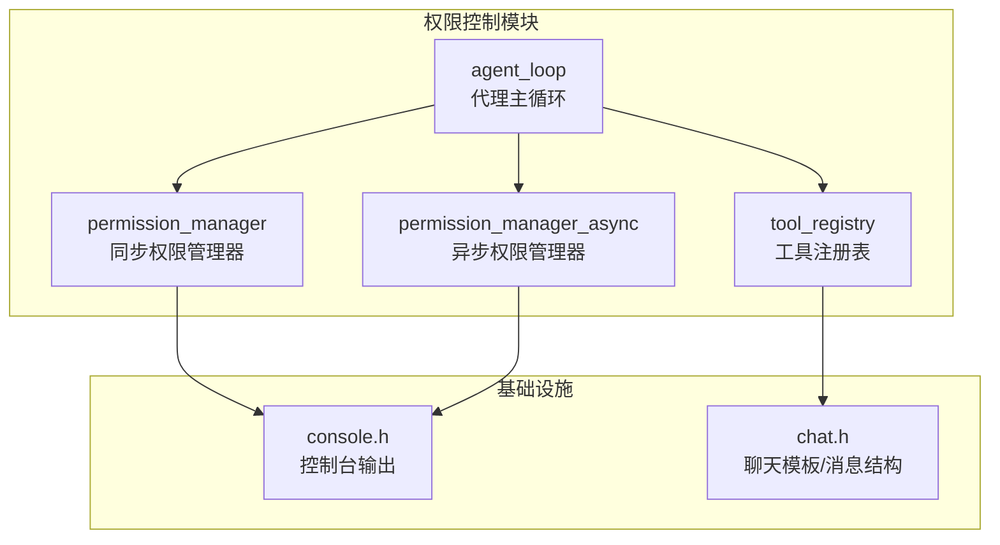
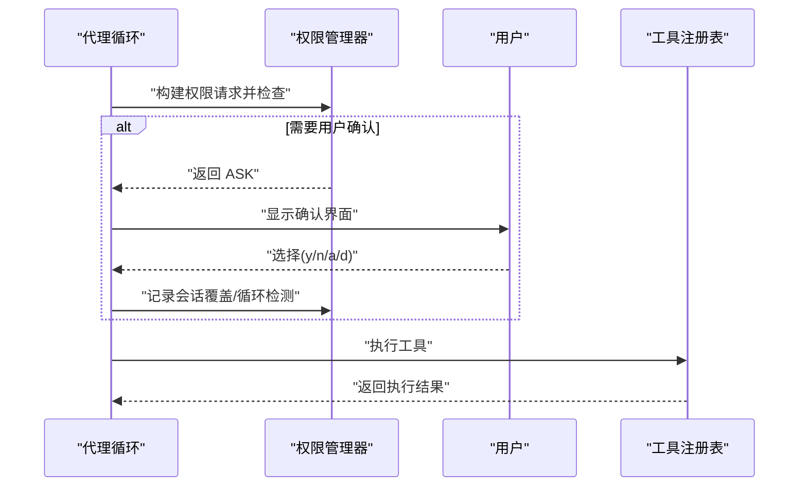
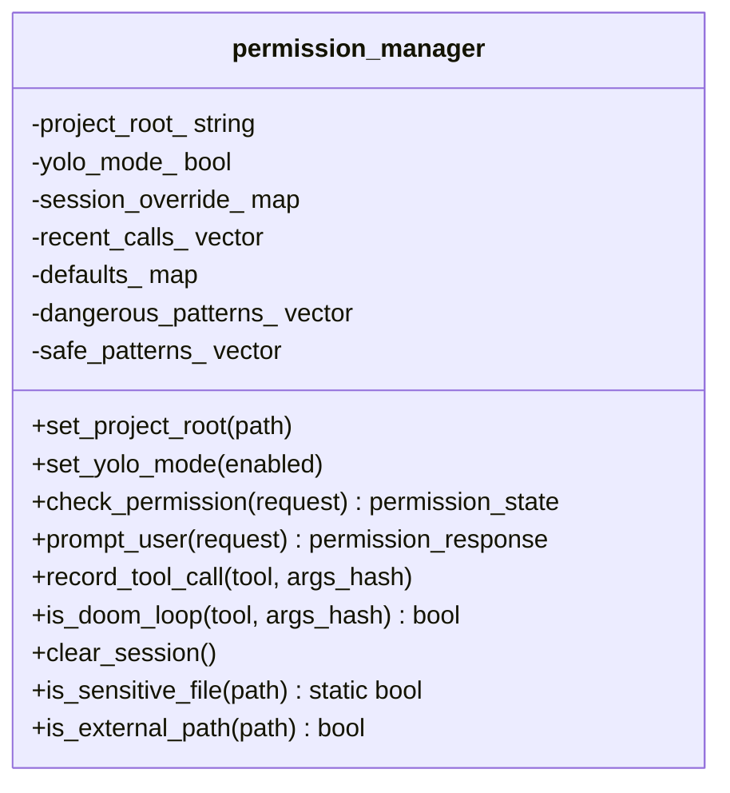
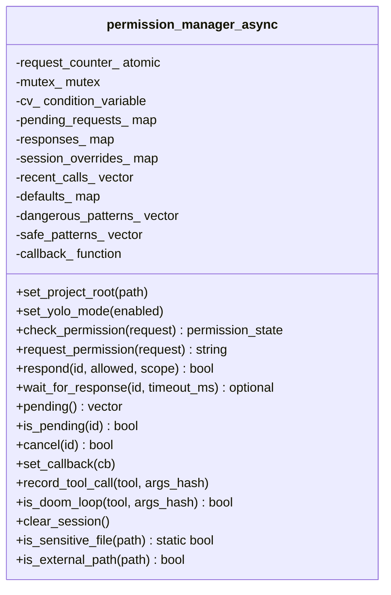
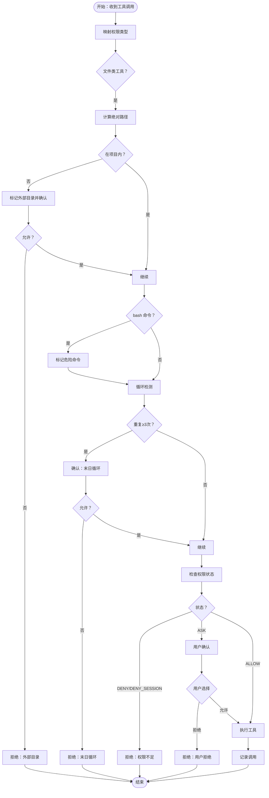
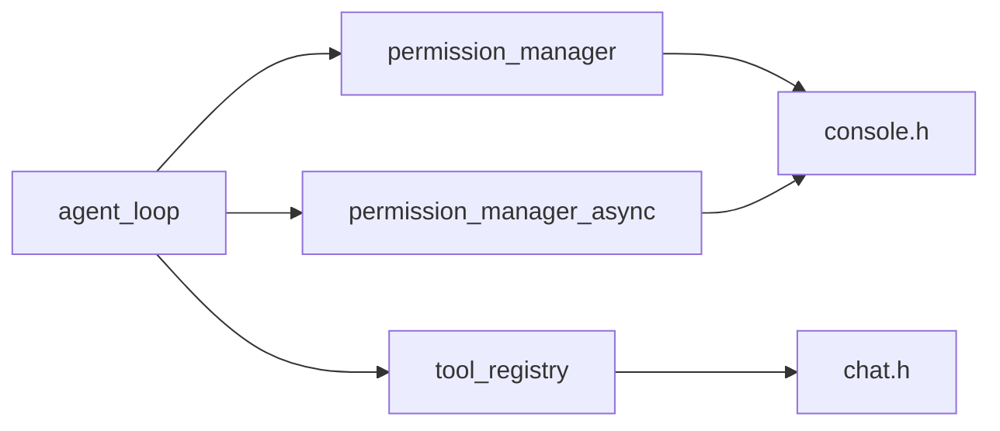

# 权限控制系统

<cite>
**本文档引用的文件**
- [permission.cpp](file://agent/permission.cpp)
- [permission.h](file://agent/permission.h)
- [permission-async.cpp](file://agent/permission-async.cpp)
- [permission-async.h](file://agent/permission-async.h)
- [agent-loop.cpp](file://agent/agent-loop.cpp)
- [agent-loop.h](file://agent/agent-loop.h)
- [tool-registry.cpp](file://agent/tool-registry.cpp)
- [tool-registry.h](file://agent/tool-registry.h)
- [console.h](file://third_party/llama.cpp/common/console.h)
- [chat.h](file://third_party/llama.cpp/common/chat.h)
</cite>

## 目录
1. [简介](#简介)
2. [项目结构](#项目结构)
3. [核心组件](#核心组件)
4. [架构总览](#架构总览)
5. [详细组件分析](#详细组件分析)
6. [依赖关系分析](#依赖关系分析)
7. [性能考虑](#性能考虑)
8. [故障排除指南](#故障排除指南)
9. [结论](#结论)
10. [附录](#附录)

## 简介
本文件为权限控制系统的技术文档，聚焦于权限管理架构、权限状态跟踪、用户交互确认流程、权限检查算法、循环检测机制、路径验证、沙箱隔离等安全特性。文档还涵盖权限配置选项、危险工具识别、用户确认界面、异步权限处理、与工具执行及代理循环的安全集成，以及在多线程环境下的并发安全保证。文中通过图示与代码片段路径帮助读者快速定位实现细节。

## 项目结构
权限控制相关代码主要位于 agent 子目录中，围绕同步与异步两种权限管理器展开，并与工具注册表、代理循环、控制台输出等模块协同工作。

**图表来源**
- [permission.cpp:35-310](file://agent/permission.cpp#L35-L310)
- [permission-async.cpp:10-283](file://agent/permission-async.cpp#L10-L283)
- [agent-loop.cpp:482-666](file://agent/agent-loop.cpp#L482-L666)
- [tool-registry.cpp:1-86](file://agent/tool-registry.cpp#L1-L86)
- [console.h:20-46](file://third_party/llama.cpp/common/console.h#L20-L46)
- [chat.h:169-173](file://third_party/llama.cpp/common/chat.h#L169-L173)

**章节来源**
- [permission.cpp:1-310](file://agent/permission.cpp#L1-L310)
- [permission-async.cpp:1-283](file://agent/permission-async.cpp#L1-L283)
- [agent-loop.cpp:1-800](file://agent/agent-loop.cpp#L1-L800)
- [tool-registry.cpp:1-86](file://agent/tool-registry.cpp#L1-L86)
- [console.h:1-47](file://third_party/llama.cpp/common/console.h#L1-L47)
- [chat.h:1-309](file://third_party/llama.cpp/common/chat.h#L1-L309)

## 核心组件
- 同步权限管理器（permission_manager）
  - 负责默认权限策略、危险/安全模式匹配、外部路径判断、敏感文件识别、会话覆盖、循环检测记录与判定、用户交互提示。
- 异步权限管理器（permission_manager_async）
  - 提供非阻塞权限请求、回调通知、响应等待与超时、挂起请求管理、会话覆盖、循环检测、并发安全（互斥锁与条件变量）。
- 工具注册表（tool_registry）
  - 维护工具定义、执行入口、过滤执行（如只读子代理的 bash 白名单）。
- 代理循环（agent_loop）
  - 在工具调用前进行权限检查、外部路径与循环检测、危险命令标记、用户确认、工具执行与结果回传。
- 控制台输出（console.h）
  - 提供日志、错误、提示等显示接口，用于用户交互确认界面。

**章节来源**
- [permission.h:40-101](file://agent/permission.h#L40-L101)
- [permission-async.h:43-141](file://agent/permission-async.h#L43-L141)
- [tool-registry.h:58-90](file://agent/tool-registry.h#L58-L90)
- [agent-loop.h:167-275](file://agent/agent-loop.h#L167-L275)
- [console.h:20-46](file://third_party/llama.cpp/common/console.h#L20-L46)

## 架构总览
权限控制贯穿“代理循环 → 工具执行 → 权限检查 → 用户确认 → 工具执行”的链路。同步版本直接阻塞等待用户输入；异步版本通过请求 ID 与回调实现非阻塞等待，适合流式 API 场景。

**图表来源**
- [agent-loop.cpp:567-666](file://agent/agent-loop.cpp#L567-L666)
- [permission.cpp:108-140](file://agent/permission.cpp#L108-L140)
- [permission.cpp:142-197](file://agent/permission.cpp#L142-L197)
- [tool-registry.cpp:49-86](file://agent/tool-registry.cpp#L49-L86)

## 详细组件分析

### 同步权限管理器（permission_manager）
- 默认权限策略
  - BASH: ASK
  - FILE_READ: ALLOW
  - FILE_WRITE: ASK
  - FILE_EDIT: ASK
  - GLOB: ALLOW
  - EXTERNAL_DIR: ASK
- 危险与安全模式匹配
  - 危险模式：包含破坏性命令、提权、远程执行、系统损坏、包管理器、Git 破坏性操作、进程控制等关键词。
  - 安全模式：常见安全命令前缀，直接允许。
- 外部路径与敏感文件
  - 通过项目根目录绝对路径前缀判断是否越界。
  - 敏感文件名与扩展名白名单，AWS/云凭证特征识别。
- 循环检测
  - 记录最近 10 次工具调用（含哈希），若相同工具与参数连续出现≥3次，判定为“末日循环”。
- 用户交互确认
  - 显示工具名称、详情、危险警告，支持 y（一次允许）、n（一次拒绝）、a（会话允许）、d（会话拒绝）。
- 会话覆盖
  - 将用户选择持久化到会话映射，键为工具名或工具名+详情，值为 ALLOW_SESSION/DENY_SESSION。

**图表来源**
- [permission.h:40-101](file://agent/permission.h#L40-L101)
- [permission.cpp:35-310](file://agent/permission.cpp#L35-L310)

**章节来源**
- [permission.cpp:34-71](file://agent/permission.cpp#L34-L71)
- [permission.cpp:87-106](file://agent/permission.cpp#L87-L106)
- [permission.cpp:108-140](file://agent/permission.cpp#L108-L140)
- [permission.cpp:142-197](file://agent/permission.cpp#L142-L197)
- [permission.cpp:199-228](file://agent/permission.cpp#L199-L228)
- [permission.cpp:230-304](file://agent/permission.cpp#L230-L304)
- [permission.cpp:306-310](file://agent/permission.cpp#L306-L310)

### 异步权限管理器（permission_manager_async）
- 请求模型
  - permission_request_async：包含唯一 ID、原始请求、创建时间。
  - permission_response_async：包含请求 ID、允许结果、作用域（一次性/会话）。
- 并发安全
  - 使用互斥锁保护内部状态；条件变量用于等待响应。
- 流程
  - request_permission：生成请求 ID，入队挂起请求，触发回调。
  - respond：写入响应、按会话作用域更新覆盖、通知等待者。
  - wait_for_response：带超时等待指定请求的响应。
  - pending/is_pending/cancel：查询/取消挂起请求。
  - clear_session：清理会话状态与挂起队列。
- 与同步版本共享规则
  - 默认策略、危险/安全模式、外部路径判断、敏感文件识别、循环检测逻辑复用。

**图表来源**
- [permission-async.h:43-141](file://agent/permission-async.h#L43-L141)
- [permission-async.cpp:10-283](file://agent/permission-async.cpp#L10-L283)

**章节来源**
- [permission-async.cpp:10-45](file://agent/permission-async.cpp#L10-L45)
- [permission-async.cpp:52-57](file://agent/permission-async.cpp#L52-L57)
- [permission-async.cpp:90-122](file://agent/permission-async.cpp#L90-L122)
- [permission-async.cpp:124-144](file://agent/permission-async.cpp#L124-L144)
- [permission-async.cpp:146-178](file://agent/permission-async.cpp#L146-L178)
- [permission-async.cpp:180-209](file://agent/permission-async.cpp#L180-L209)
- [permission-async.cpp:211-235](file://agent/permission-async.cpp#L211-L235)
- [permission-async.cpp:237-273](file://agent/permission-async.cpp#L237-L273)
- [permission-async.cpp:275-282](file://agent/permission-async.cpp#L275-L282)

### 代理循环中的权限检查与工具执行
- 权限类型映射
  - read/write/edit → 文件类权限
  - glob → 列举权限
  - bash → 命令执行权限
- 外部目录访问检查
  - 对文件类工具解析绝对路径，若越出工作目录则弹出确认。
- 危险命令标记
  - bash 命令包含特定关键词时标记为危险。
- 循环检测
  - 使用参数哈希记录最近调用，超过阈值触发确认。
- 权限决策
  - 若为 DENY/DENY_SESSION 直接拒绝；若为 ASK 弹出确认；否则允许。
- 执行与展示
  - 记录调用、显示工具名称与参数、执行工具、展示耗时与结果。

**图表来源**
- [agent-loop.cpp:482-666](file://agent/agent-loop.cpp#L482-L666)
- [permission.cpp:108-140](file://agent/permission.cpp#L108-L140)
- [permission.cpp:142-197](file://agent/permission.cpp#L142-L197)
- [permission.cpp:199-228](file://agent/permission.cpp#L199-L228)

**章节来源**
- [agent-loop.cpp:499-584](file://agent/agent-loop.cpp#L499-L584)
- [agent-loop.cpp:567-666](file://agent/agent-loop.cpp#L567-L666)

### 工具注册表与只读模式
- 工具注册与执行
  - 提供统一的工具执行入口，捕获异常并返回结果。
- 只读模式 bash 白名单
  - 子代理可限制 bash 命令前缀，未匹配则拒绝执行。

**章节来源**
- [tool-registry.cpp:11-29](file://agent/tool-registry.cpp#L11-L29)
- [tool-registry.cpp:49-86](file://agent/tool-registry.cpp#L49-L86)
- [tool-registry.h:58-90](file://agent/tool-registry.h#L58-L90)

### 用户确认界面与控制台输出
- 控制台显示
  - 支持不同显示类型（信息、提示、推理、错误等）。
- 权限确认界面
  - 展示工具名、详情、危险警告，等待单字符输入并回显。

**章节来源**
- [console.h:20-46](file://third_party/llama.cpp/common/console.h#L20-L46)
- [permission.cpp:142-197](file://agent/permission.cpp#L142-L197)

## 依赖关系分析
- 代理循环依赖权限管理器进行权限检查与用户确认。
- 工具注册表提供工具执行能力，受权限与只读模式约束。
- 控制台模块用于用户交互界面输出。
- 异步权限管理器与代理循环通过事件回调集成，支持流式 API。

**图表来源**
- [agent-loop.h:167-275](file://agent/agent-loop.h#L167-L275)
- [permission.h:40-101](file://agent/permission.h#L40-L101)
- [permission-async.h:43-141](file://agent/permission-async.h#L43-L141)
- [tool-registry.h:58-90](file://agent/tool-registry.h#L58-L90)
- [console.h:20-46](file://third_party/llama.cpp/common/console.h#L20-L46)
- [chat.h:169-173](file://third_party/llama.cpp/common/chat.h#L169-L173)

**章节来源**
- [agent-loop.h:167-275](file://agent/agent-loop.h#L167-L275)
- [permission.h:40-101](file://agent/permission.h#L40-L101)
- [permission-async.h:43-141](file://agent/permission-async.h#L43-L141)
- [tool-registry.h:58-90](file://agent/tool-registry.h#L58-L90)
- [console.h:20-46](file://third_party/llama.cpp/common/console.h#L20-L46)
- [chat.h:169-173](file://third_party/llama.cpp/common/chat.h#L169-L173)

## 性能考虑
- 同步权限管理器
  - 依赖标准输入阻塞等待，适用于 CLI 场景；在高并发或长轮询场景可能成为瓶颈。
- 异步权限管理器
  - 通过互斥锁与条件变量保证并发安全；等待响应使用超时避免无限阻塞。
- 工具执行
  - 代理循环对工具执行进行计时与截断输出，避免长时间阻塞与过量日志输出。
- 循环检测
  - 最近调用列表长度固定为 10，时间复杂度低，空间占用可控。

[本节为通用性能讨论，不直接分析具体文件]

## 故障排除指南
- 权限确认无响应
  - 检查控制台初始化与输入模式设置；确认用户输入字符是否正确。
  - 参考路径：[console.h:20-46](file://third_party/llama.cpp/common/console.h#L20-L46)
- 外部目录被拒绝
  - 确认工作目录设置与项目根路径；必要时调整权限策略或使用会话允许。
  - 参考路径：[permission.cpp:306-310](file://agent/permission.cpp#L306-L310)
- 末日循环误报
  - 检查参数哈希是否稳定；适当放宽阈值或临时禁用循环检测。
  - 参考路径：[permission.cpp:217-223](file://agent/permission.cpp#L217-L223)
- 异步请求未得到响应
  - 确认回调已设置；检查请求 ID 是否正确；查看挂起队列与响应队列状态。
  - 参考路径：[permission-async.cpp:124-144](file://agent/permission-async.cpp#L124-L144), [permission-async.cpp:180-209](file://agent/permission-async.cpp#L180-L209)

**章节来源**
- [console.h:20-46](file://third_party/llama.cpp/common/console.h#L20-L46)
- [permission.cpp:217-223](file://agent/permission.cpp#L217-L223)
- [permission-async.cpp:124-144](file://agent/permission-async.cpp#L124-L144)
- [permission-async.cpp:180-209](file://agent/permission-async.cpp#L180-L209)

## 结论
该权限控制系统通过同步与异步两种模式满足不同场景需求：CLI 场景采用同步阻塞确认，流式/服务端场景采用异步非阻塞等待。系统内置危险/安全模式匹配、外部路径与敏感文件识别、循环检测与会话覆盖机制，确保在工具执行前进行充分的安全评估与用户确认。代理循环与工具注册表的紧密协作，实现了从权限检查到工具执行的完整闭环，同时在多线程环境下通过互斥锁与条件变量保障并发安全。

[本节为总结性内容，不直接分析具体文件]

## 附录

### 权限检查流程示例（代码片段路径）
- 同步权限检查与用户确认
  - [permission_manager::check_permission:108-140](file://agent/permission.cpp#L108-L140)
  - [permission_manager::prompt_user:142-197](file://agent/permission.cpp#L142-L197)
- 异步权限请求与响应
  - [permission_manager_async::request_permission:124-144](file://agent/permission-async.cpp#L124-L144)
  - [permission_manager_async::respond:146-178](file://agent/permission-async.cpp#L146-L178)
  - [permission_manager_async::wait_for_response:180-209](file://agent/permission-async.cpp#L180-L209)

### 用户交互处理示例（代码片段路径）
- 控制台显示与输入
  - [console::set_display:23-23](file://third_party/llama.cpp/common/console.h#L23-L23)
  - [console::log:40-40](file://third_party/llama.cpp/common/console.h#L40-L40)
  - [permission_manager::prompt_user 输入读取:169-169](file://agent/permission.cpp#L169-L169)

### 权限状态管理示例（代码片段路径）
- 会话覆盖与循环检测
  - [permission_manager::record_tool_call:199-215](file://agent/permission.cpp#L199-L215)
  - [permission_manager::is_doom_loop:217-223](file://agent/permission.cpp#L217-L223)
  - [permission_manager_async::record_tool_call:237-254](file://agent/permission-async.cpp#L237-L254)
  - [permission_manager_async::is_doom_loop:256-264](file://agent/permission-async.cpp#L256-L264)

### 与工具执行、代理循环的集成示例（代码片段路径）
- 代理循环中的权限检查与执行
  - [agent_loop::execute_tool_call:482-666](file://agent/agent-loop.cpp#L482-L666)
- 工具注册与只读模式
  - [tool_registry::execute_filtered:62-86](file://agent/tool-registry.cpp#L62-L86)