# 核心架构设计

<cite>
**本文档引用的文件**
- [CMakeLists.txt](file://CMakeLists.txt)
- [agent.cpp](file://agent/agent.cpp)
- [agent-loop.cpp](file://agent/agent-loop.cpp)
- [tool-registry.cpp](file://agent/tool-registry.cpp)
- [skills-manager.cpp](file://agent/skills/skills-manager.cpp)
- [permission.cpp](file://agent/permission.cpp)
- [subagent-runner.cpp](file://agent/subagent/subagent-runner.cpp)
- [mcp-client.cpp](file://agent/mcp/mcp-client.cpp)
- [agent-server.cpp](file://agent/server/agent-server.cpp)
- [tool-bash.cpp](file://agent/tools/tool-bash.cpp)
- [tool-read.cpp](file://agent/tools/tool-read.cpp)
- [agents-md-manager.cpp](file://agent/agents-md/agents-md-manager.cpp)
- [sdk.py](file://SDKs/python/src/llama_agent_sdk/sdk.py)
- [sdk.go](file://SDKs/go/llamaagentsdk/sdk.go)
</cite>

## 目录
1. [引言](#引言)
2. [项目结构](#项目结构)
3. [核心组件](#核心组件)
4. [架构总览](#架构总览)
5. [详细组件分析](#详细组件分析)
6. [依赖关系分析](#依赖关系分析)
7. [性能考虑](#性能考虑)
8. [故障排除指南](#故障排除指南)
9. [结论](#结论)
10. [附录](#附录)

## 引言
本架构文档面向 llama.cpp-agent 的核心系统，聚焦于代理系统设计、工具注册机制、权限控制系统、技能管理架构与子代理系统等关键模块。文档从高层设计、架构模式与系统边界出发，解释组件交互、数据流与集成模式，并给出技术选型的权衡与约束条件。同时覆盖安全性、监控与灾难恢复等跨领域关注点，记录技术栈、第三方依赖与版本兼容性。

## 项目结构
项目采用分层与功能域结合的组织方式：
- 根目录：构建配置与顶层 CMake 集成
- agent 子目录：核心代理逻辑、工具系统、权限、技能、子代理、MCP、服务器路由与会话管理
- SDKs：多语言 SDK（Python、Go、TypeScript、Java），提供 HTTP 客户端能力
- third_party：外部依赖（llama.cpp、MiniMemory、ASR/TTS）

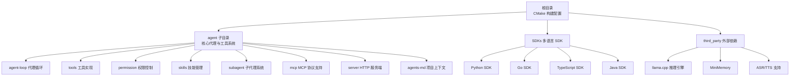

图表来源
- [CMakeLists.txt:1-44](file://CMakeLists.txt#L1-L44)
- [agent.cpp:101-588](file://agent/agent.cpp#L101-L588)

章节来源
- [CMakeLists.txt:1-44](file://CMakeLists.txt#L1-L44)
- [agent.cpp:101-588](file://agent/agent.cpp#L101-L588)

## 核心组件
- 代理主循环（agent-loop）：负责对话历史管理、推理生成、工具调用执行与权限校验，支持主代理与子代理两种运行模式
- 工具注册中心（tool-registry）：集中注册与分发工具定义，支持过滤执行（子代理只允许白名单工具）
- 权限管理器（permission）：基于类型与会话状态的细粒度权限控制，内置危险命令识别与“YOLO”模式
- 技能管理器（skills-manager）：解析 agentskills.io 规范的 SKILL.md，生成提示词段落注入到系统提示
- 子代理运行器（subagent-runner）：在受限工具集与 Bash 模式下运行专用任务，支持同步与后台模式
- MCP 客户端（mcp-client）：通过 Unix 进程与管道连接 MCP 服务器，动态发现与调用工具
- 服务器（agent-server）：HTTP API 服务端，提供会话管理、权限查询、工具列表与音频能力
- 项目上下文（agents-md-manager）：扫描 AGENTS.md 文件，按深度优先顺序生成项目上下文注入提示

章节来源
- [agent-loop.cpp:1-800](file://agent/agent-loop.cpp#L1-L800)
- [tool-registry.cpp:1-86](file://agent/tool-registry.cpp#L1-L86)
- [permission.cpp:1-310](file://agent/permission.cpp#L1-L310)
- [skills-manager.cpp:1-330](file://agent/skills/skills-manager.cpp#L1-L330)
- [subagent-runner.cpp:1-388](file://agent/subagent/subagent-runner.cpp#L1-L388)
- [mcp-client.cpp:1-364](file://agent/mcp/mcp-client.cpp#L1-L364)
- [agent-server.cpp:1-731](file://agent/server/agent-server.cpp#L1-L731)
- [agents-md-manager.cpp:1-179](file://agent/agents-md/agents-md-manager.cpp#L1-L179)

## 架构总览
系统采用“本地大模型 + 工具执行 + 权限控制 + 多语言 SDK + 可扩展协议”的混合架构：
- 本地推理引擎（llama.cpp）承载核心生成能力
- 工具系统以“工具注册中心 + 工具实现”解耦，支持 Bash、文件读写、编辑等
- 权限系统贯穿工具调用链，保障安全边界
- 子代理系统在受限模式下完成特定任务，避免越权
- MCP 协议桥接外部工具生态
- HTTP 服务端提供统一 API，多语言 SDK 提供客户端接入

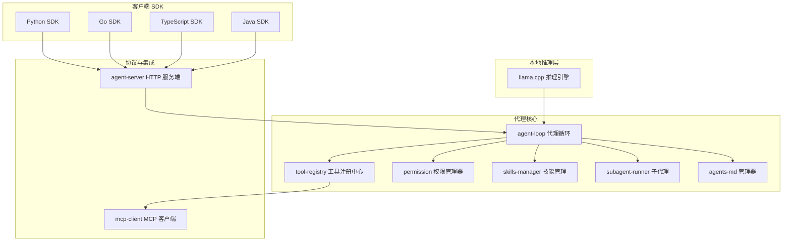

图表来源
- [agent-loop.cpp:1-800](file://agent/agent-loop.cpp#L1-L800)
- [tool-registry.cpp:1-86](file://agent/tool-registry.cpp#L1-L86)
- [permission.cpp:1-310](file://agent/permission.cpp#L1-L310)
- [skills-manager.cpp:1-330](file://agent/skills/skills-manager.cpp#L1-L330)
- [subagent-runner.cpp:1-388](file://agent/subagent/subagent-runner.cpp#L1-L388)
- [mcp-client.cpp:1-364](file://agent/mcp/mcp-client.cpp#L1-L364)
- [agent-server.cpp:1-731](file://agent/server/agent-server.cpp#L1-L731)
- [sdk.py:1-224](file://SDKs/python/src/llama_agent_sdk/sdk.py#L1-L224)
- [sdk.go:1-267](file://SDKs/go/llamaagentsdk/sdk.go#L1-L267)

## 详细组件分析

### 代理系统设计
- 主循环职责：维护消息历史、格式化聊天参数、生成补全、解析工具调用、执行工具并回填结果
- 子代理模式：通过构造函数注入受限工具集与 Bash 模式，限制破坏性操作；支持回调上报工具调用统计
- 终止条件：达到最大迭代次数、用户中断、错误发生
- 统计收集：累计输入/输出 token 数、缓存命中、预测耗时等

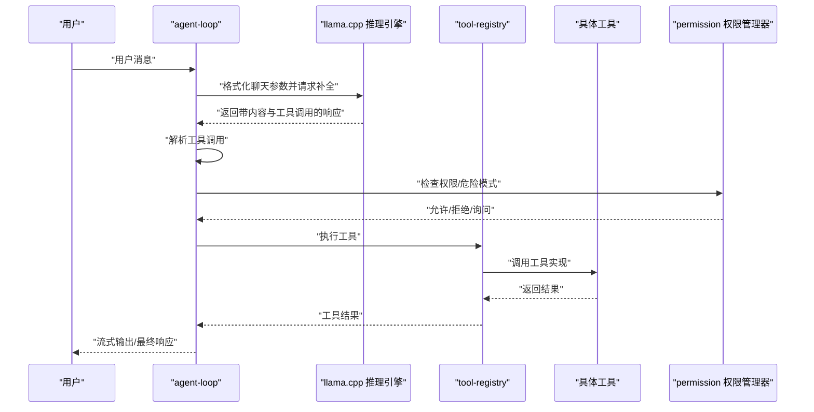

图表来源
- [agent-loop.cpp:695-788](file://agent/agent-loop.cpp#L695-L788)
- [tool-registry.cpp:49-86](file://agent/tool-registry.cpp#L49-L86)
- [permission.cpp:108-140](file://agent/permission.cpp#L108-L140)

章节来源
- [agent-loop.cpp:695-788](file://agent/agent-loop.cpp#L695-L788)
- [agent-loop.cpp:482-666](file://agent/agent-loop.cpp#L482-L666)

### 工具注册机制
- 注册中心：单例模式，提供注册、查找、过滤执行与转换为聊天工具的能力
- 工具实现：每个工具以固定签名实现，注册时绑定名称与参数 Schema
- 过滤执行：子代理仅允许白名单工具，Bash 命令可进一步按前缀模式过滤

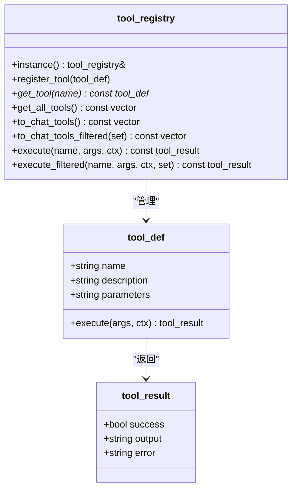

图表来源
- [tool-registry.cpp:6-86](file://agent/tool-registry.cpp#L6-L86)

章节来源
- [tool-registry.cpp:6-86](file://agent/tool-registry.cpp#L6-L86)

### 权限控制系统
- 类型化权限：针对 Bash、文件读写、Glob、外部目录等类型设定默认策略
- 会话覆盖：支持“允许一次/拒绝一次/总是允许/总是拒绝”
- 危险模式检测：内置危险命令前缀集合，敏感文件识别
- 循环检测：对重复相同工具调用进行防护
- YOLO 模式：一键放行所有操作（调试用途）

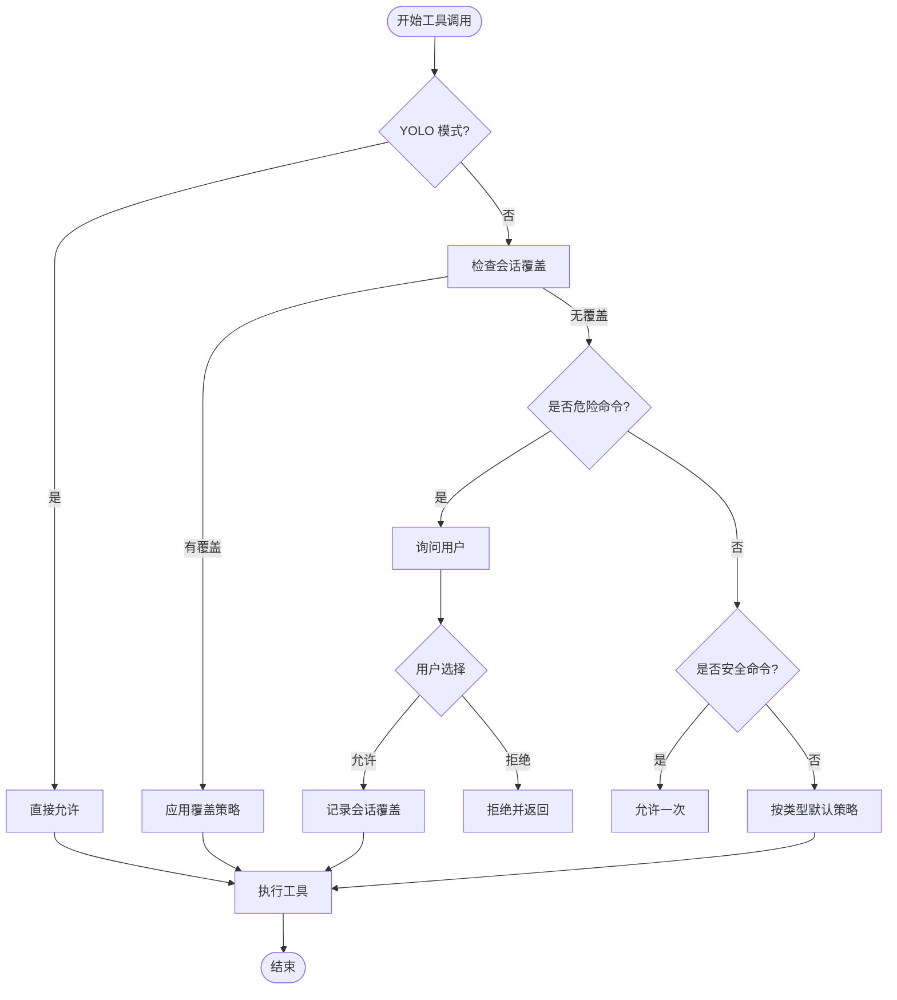

图表来源
- [permission.cpp:108-197](file://agent/permission.cpp#L108-L197)
- [permission.cpp:217-223](file://agent/permission.cpp#L217-L223)

章节来源
- [permission.cpp:108-197](file://agent/permission.cpp#L108-L197)
- [permission.cpp:217-223](file://agent/permission.cpp#L217-L223)

### 技能管理架构
- 规范：遵循 agentskills.io 的 SKILL.md 前言元数据与脚本目录约定
- 解析：提取 name/description/license/compatibility/allowed-tools 等字段，校验命名规范与长度
- 发现：在项目本地、用户全局路径与额外搜索路径中递归扫描
- 注入：将技能清单以 XML 片段形式注入系统提示，辅助代理选择合适技能

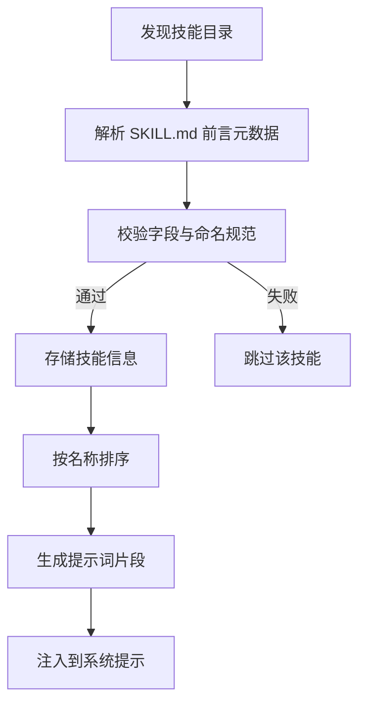

图表来源
- [skills-manager.cpp:240-288](file://agent/skills/skills-manager.cpp#L240-L288)
- [skills-manager.cpp:290-329](file://agent/skills/skills-manager.cpp#L290-L329)

章节来源
- [skills-manager.cpp:240-288](file://agent/skills/skills-manager.cpp#L240-L288)
- [skills-manager.cpp:290-329](file://agent/skills/skills-manager.cpp#L290-L329)

### 子代理系统
- 模式：探索（只读）、规划、通用、命令执行
- 限制：受限工具集与 Bash 前缀白名单，防止破坏性操作
- 并发：支持同步与后台模式，后台任务使用独立输出缓冲与线程池
- 统计：汇总子代理的 token 使用情况并回传给父代理

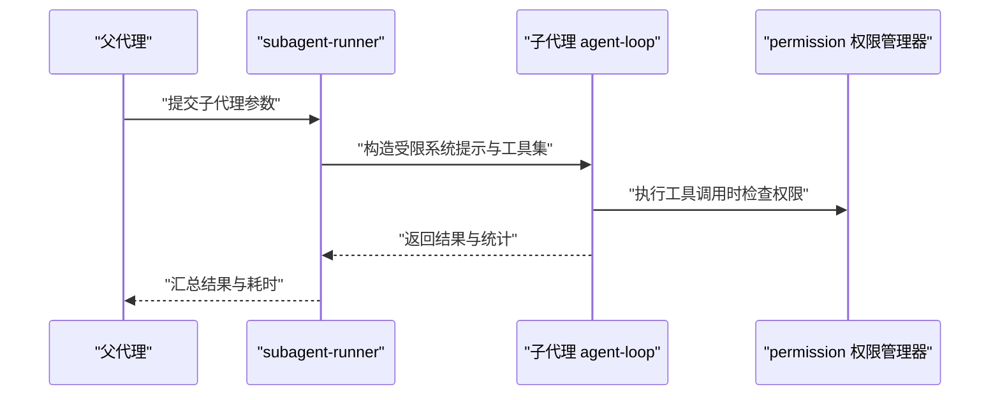

图表来源
- [subagent-runner.cpp:133-244](file://agent/subagent/subagent-runner.cpp#L133-L244)
- [agent-loop.cpp:253-296](file://agent/agent-loop.cpp#L253-L296)

章节来源
- [subagent-runner.cpp:133-244](file://agent/subagent/subagent-runner.cpp#L133-L244)
- [agent-loop.cpp:253-296](file://agent/agent-loop.cpp#L253-L296)

### MCP 工具集成
- 进程模型：fork/exec + 管道通信，支持非阻塞读取与超时控制
- 协议：JSON-RPC 2.0，初始化握手后发送 initialized 通知
- 工具发现：tools/list 获取工具清单，tools/call 调用工具
- 错误处理：超时、断开、解析错误均返回结构化错误信息

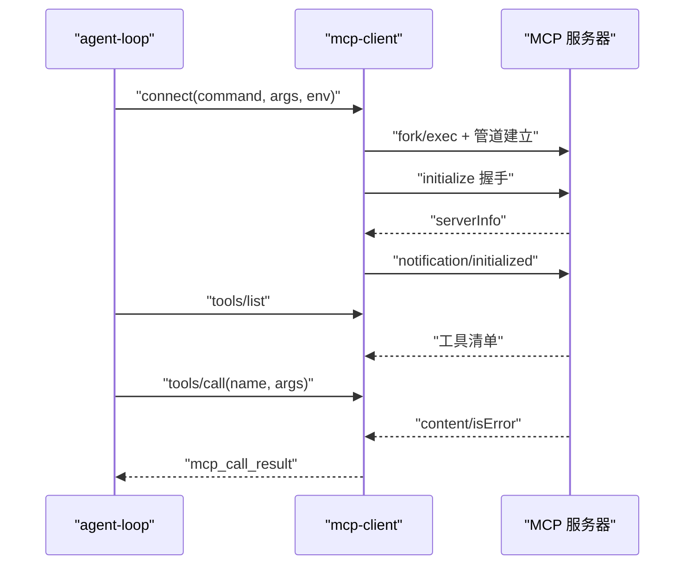

图表来源
- [mcp-client.cpp:21-122](file://agent/mcp/mcp-client.cpp#L21-L122)
- [mcp-client.cpp:134-192](file://agent/mcp/mcp-client.cpp#L134-L192)

章节来源
- [mcp-client.cpp:21-122](file://agent/mcp/mcp-client.cpp#L21-L122)
- [mcp-client.cpp:134-192](file://agent/mcp/mcp-client.cpp#L134-L192)

### 项目上下文与 AGENTS.md
- 发现策略：从工作目录向上遍历至 Git 根或文件系统根，收集 AGENTS.md
- 全局文件：在用户配置目录下查找全局 AGENTS.md，优先级最低
- 内容注入：按深度顺序拼接 XML 片段，作为系统提示的一部分

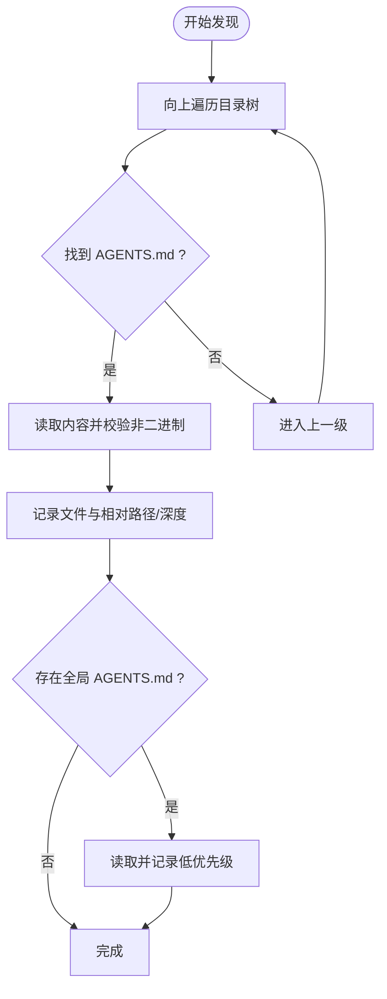

图表来源
- [agents-md-manager.cpp:79-142](file://agent/agents-md/agents-md-manager.cpp#L79-L142)
- [agents-md-manager.cpp:152-176](file://agent/agents-md/agents-md-manager.cpp#L152-L176)

章节来源
- [agents-md-manager.cpp:79-142](file://agent/agents-md/agents-md-manager.cpp#L79-L142)
- [agents-md-manager.cpp:152-176](file://agent/agents-md/agents-md-manager.cpp#L152-L176)

### 多语言 SDK 设计
- Python SDK：封装 HTTP 请求、SSE 流式解析、工具调用聚合
- Go SDK：提供会话结构体与流式处理，支持自定义头与超时
- 共同点：均支持系统提示注入、消息历史维护、流式增量输出与工具调用聚合

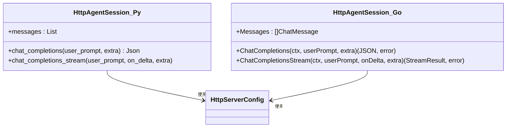

图表来源
- [sdk.py:102-224](file://SDKs/python/src/llama_agent_sdk/sdk.py#L102-L224)
- [sdk.go:38-267](file://SDKs/go/llamaagentsdk/sdk.go#L38-L267)

章节来源
- [sdk.py:102-224](file://SDKs/python/src/llama_agent_sdk/sdk.py#L102-L224)
- [sdk.go:38-267](file://SDKs/go/llamaagentsdk/sdk.go#L38-L267)

## 依赖关系分析
- 构建依赖：通过 CMake 将 llama.cpp 作为子模块引入，启用 HTTP 与服务器选项
- 运行时依赖：代理主循环依赖工具注册中心、权限管理器、技能与 AGENTS.md 管理器；服务器端依赖会话管理与路由；SDK 依赖 HTTP 服务端
- 第三方库：ASR/TTS 作为可选特性集成，MCP 仅在 Unix 平台启用

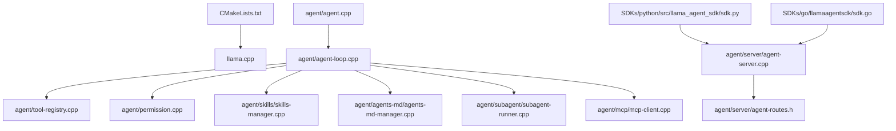

图表来源
- [CMakeLists.txt:30-43](file://CMakeLists.txt#L30-L43)
- [agent.cpp:101-588](file://agent/agent.cpp#L101-L588)
- [agent-server.cpp:105-731](file://agent/server/agent-server.cpp#L105-L731)

章节来源
- [CMakeLists.txt:30-43](file://CMakeLists.txt#L30-L43)
- [agent.cpp:101-588](file://agent/agent.cpp#L101-L588)
- [agent-server.cpp:105-731](file://agent/server/agent-server.cpp#L105-L731)

## 性能考虑
- KV 缓存复用：主代理与子代理共享基础系统提示，最大化提示缓存命中率，降低 token 成本
- 流式输出：SSE 流式传输与增量渲染，提升交互体验
- 输出截断：工具输出按行与字符数截断，避免内存膨胀与网络拥塞
- 并发与超时：子代理后台执行与工具超时控制，防止阻塞与资源泄露
- 线程与信号：主线程监听中断信号，子代理共享中断标志，确保快速响应

## 故障排除指南
- 权限相关
  - 症状：工具调用被拒绝
  - 排查：检查权限类型、会话覆盖、危险命令匹配与循环检测
  - 参考：[permission.cpp:108-197](file://agent/permission.cpp#L108-L197)
- 工具执行
  - 症状：Bash 执行超时或无输出
  - 排查：确认工作目录、超时设置、平台差异（Windows/Unix）
  - 参考：[tool-bash.cpp:50-258](file://agent/tools/tool-bash.cpp#L50-L258)
- MCP 连接
  - 症状：无法连接 MCP 服务器或超时
  - 排查：检查命令路径、环境变量、进程存活与 JSON-RPC 响应
  - 参考：[mcp-client.cpp:21-122](file://agent/mcp/mcp-client.cpp#L21-L122)
- 服务器健康
  - 症状：HTTP 5xx 或接口不可用
  - 排查：查看日志、模型加载状态、端口占用与异常包装
  - 参考：[agent-server.cpp:70-103](file://agent/server/agent-server.cpp#L70-L103)
- 子代理
  - 症状：子代理未完成或统计缺失
  - 排查：检查最大迭代次数、工具白名单、回调统计与后台任务清理
  - 参考：[subagent-runner.cpp:133-244](file://agent/subagent/subagent-runner.cpp#L133-L244)

章节来源
- [permission.cpp:108-197](file://agent/permission.cpp#L108-L197)
- [tool-bash.cpp:50-258](file://agent/tools/tool-bash.cpp#L50-L258)
- [mcp-client.cpp:21-122](file://agent/mcp/mcp-client.cpp#L21-L122)
- [agent-server.cpp:70-103](file://agent/server/agent-server.cpp#L70-L103)
- [subagent-runner.cpp:133-244](file://agent/subagent/subagent-runner.cpp#L133-L244)

## 结论
llama.cpp-agent 通过本地推理与工具执行的组合，构建了安全可控的智能代理系统。其核心优势在于：
- 清晰的权限边界与危险模式检测，保障系统安全
- 可插拔的工具体系与 MCP 协议扩展，增强生态兼容性
- 子代理与项目上下文注入，提升复杂任务的可管理性
- 多语言 SDK 与 HTTP 服务端，便于集成与二次开发

建议在生产环境中：
- 启用严格的权限策略与审计日志
- 对工具输出与模型输出进行容量与速率限制
- 在 CI/CD 中加入安全扫描与合规检查

## 附录
- 技术栈与版本兼容性
  - C++17/20（CMake ≥ 3.20）
  - llama.cpp（作为子模块引入，版本随仓库更新）
  - 多平台支持：Linux、macOS、Windows（MCP 仅 Unix）
  - 第三方：ASR/TTS（可选）、MiniMemory（可选）
- 关键配置项
  - CUDA 后端开关（受平台与环境变量影响）
  - 子代理最大深度、工具超时、迭代上限
  - AGENTS.md 与技能搜索路径
- API 与 SDK
  - OpenAI 兼容 /v1/* 接口
  - SSE 流式响应与工具调用聚合
  - Python/Go/TypeScript/Java SDK