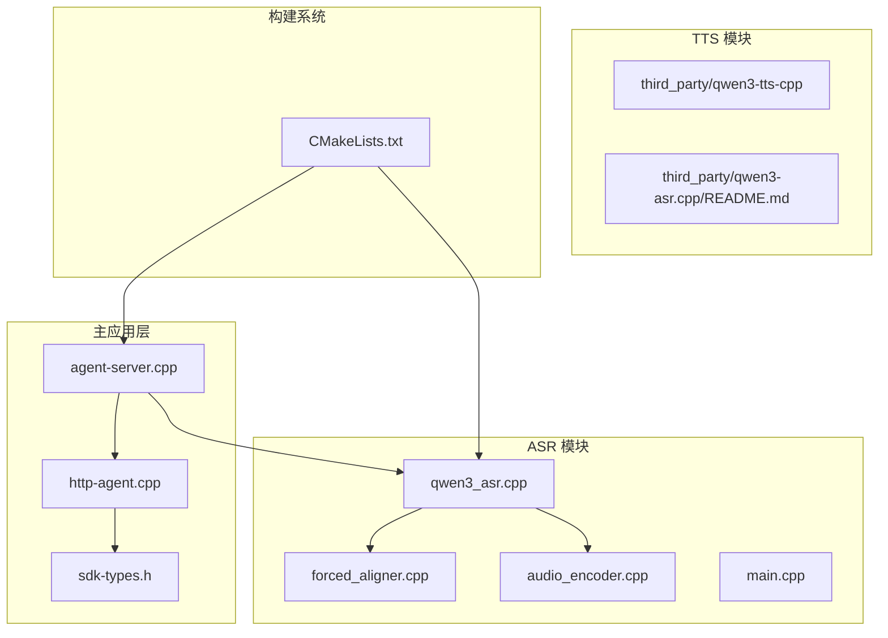
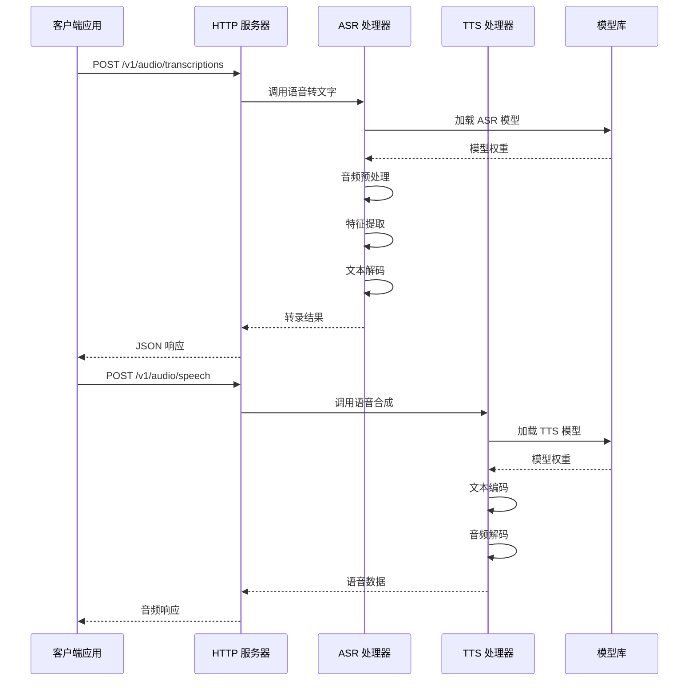
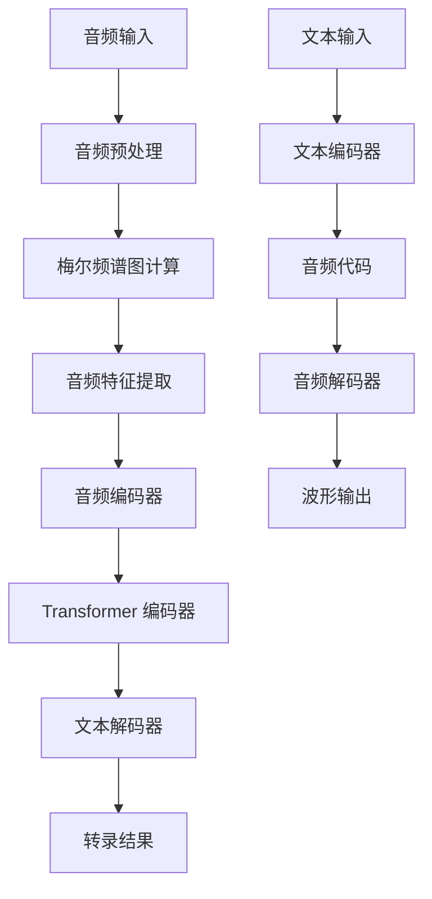
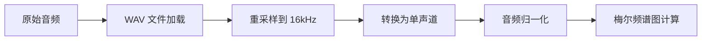
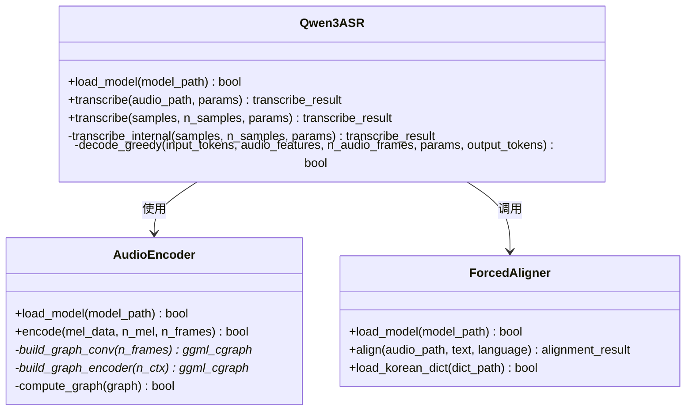
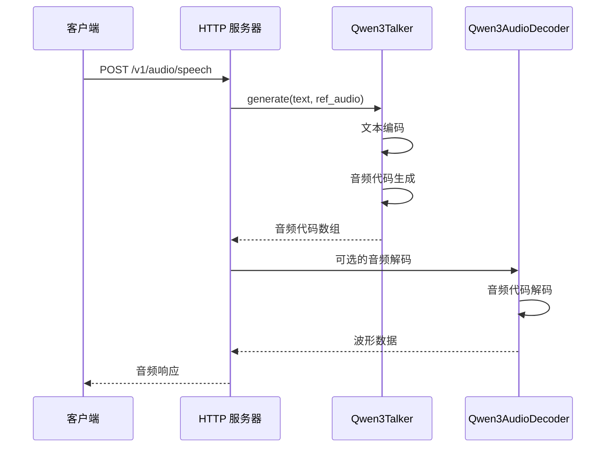
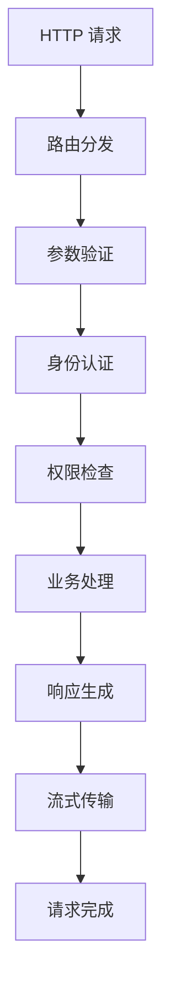
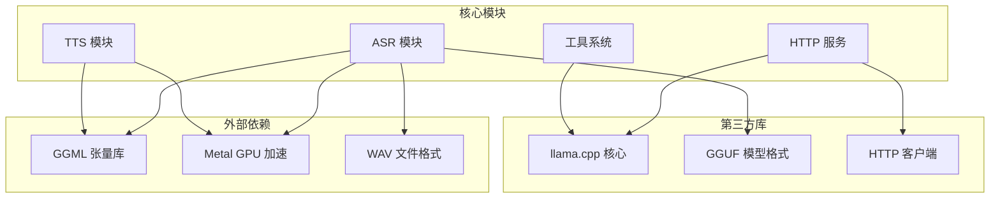
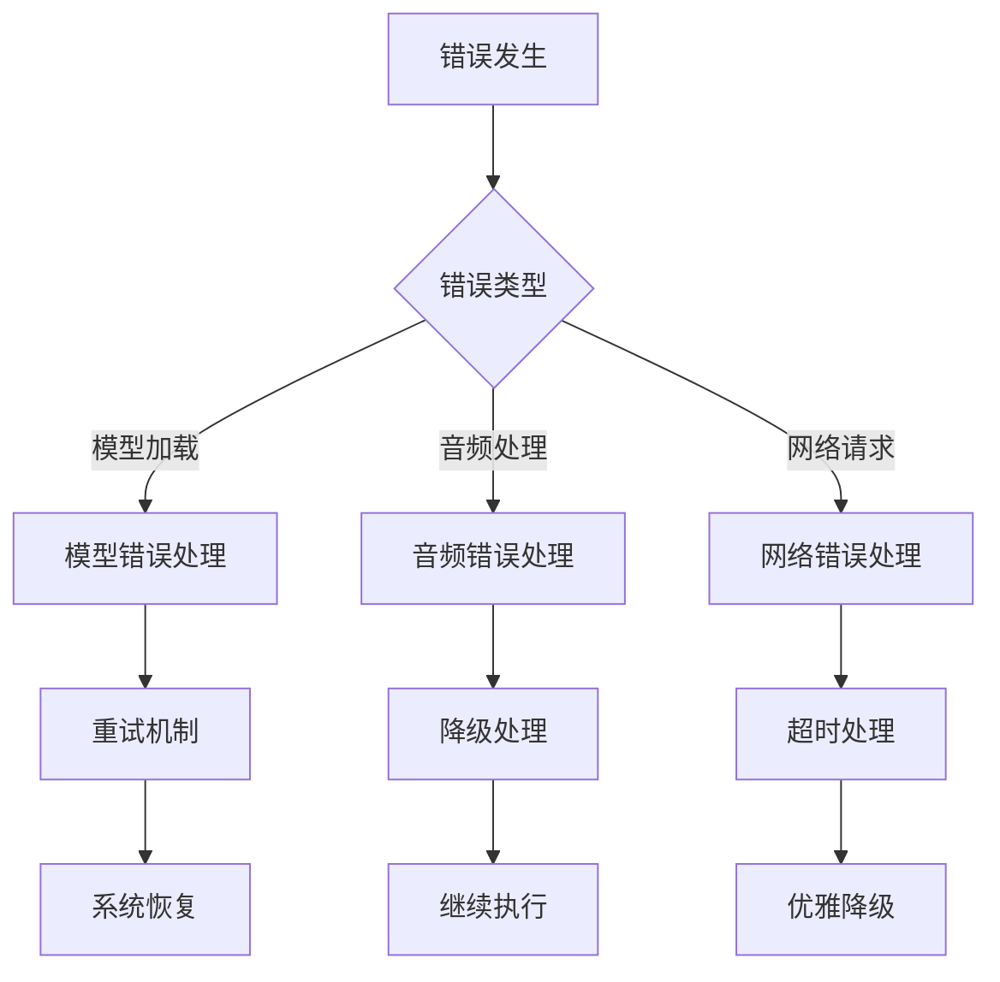

# ASR/TTS 语音处理集成

<cite>
**本文档引用的文件**
- [CMakeLists.txt](file://CMakeLists.txt)
- [agent-server.cpp](file://agent/server/agent-server.cpp)
- [http-agent.cpp](file://agent/sdk/http-agent.cpp)
- [sdk-types.h](file://agent/sdk/sdk-types.h)
- [qwen3_asr.cpp](file://third_party/qwen3-asr.cpp/src/qwen3_asr.cpp)
- [forced_aligner.cpp](file://third_party/qwen3-asr.cpp/src/forced_aligner.cpp)
- [audio_encoder.cpp](file://third_party/qwen3-asr.cpp/src/audio_encoder.cpp)
- [main.cpp](file://third_party/qwen3-asr.cpp/src/main.cpp)
- [README.md](file://third_party/qwen3-asr.cpp/README.md)
- [README.md](file://third_party/qwen3-tts-cpp/README.md)
</cite>

## 目录
1. [简介](#简介)
2. [项目结构](#项目结构)
3. [核心组件](#核心组件)
4. [架构概览](#架构概览)
5. [详细组件分析](#详细组件分析)
6. [依赖关系分析](#依赖关系分析)
7. [性能考虑](#性能考虑)
8. [故障排除指南](#故障排除指南)
9. [结论](#结论)

## 简介

本项目为 ASR/TTS 语音处理集成提供了完整的技术解决方案，基于 Qwen3 模型系列实现了高性能的自动语音识别（ASR）和文本转语音（TTS）功能。系统采用纯 C++ 实现，无需 Python 运行时环境，充分利用 GGML 张量库和 Metal GPU 加速，在 Apple Silicon 平台上实现了卓越的性能表现。

ASR 功能支持 30+ 种语言的语音转文字，具备强制对齐能力，可输出词级时间戳信息。TTS 功能提供高质量的语音合成，支持多种语音风格和情感表达。系统集成了完整的 HTTP API 接口，支持流式响应和异步处理。

## 项目结构

项目采用模块化设计，主要包含以下核心模块：



**图表来源**
- [CMakeLists.txt:1-44](file://CMakeLists.txt#L1-L44)
- [agent-server.cpp:105-731](file://agent/server/agent-server.cpp#L105-L731)
- [http-agent.cpp:1-817](file://agent/sdk/http-agent.cpp#L1-L817)

**章节来源**
- [CMakeLists.txt:1-44](file://CMakeLists.txt#L1-L44)
- [agent-server.cpp:105-731](file://agent/server/agent-server.cpp#L105-L731)

## 核心组件

### ASR 自动语音识别系统

ASR 系统基于 Qwen3-ASR 模型，实现了完整的语音转文字流水线：

- **音频预处理**: 支持 16kHz 单声道 PCM WAV 格式音频
- **梅尔频谱图计算**: 使用 vDSP/Accelerate 库实现 45x 性能提升
- **特征提取**: 3 层卷积神经网络提取音频特征
- **序列编码**: Transformer 编码器处理时序特征
- **文本解码**: 贪婪解码策略生成最终文本

### TTS 文本转语音系统

TTS 系统基于 Qwen3-TTS 模型，提供高质量语音合成：

- **文本编码**: 将输入文本转换为音频代码
- **语音合成**: 使用音频解码器生成波形数据
- **多模型架构**: Talker 模型负责文本到音频代码的转换，Tokenizer 模型负责音频代码到波形的解码

### HTTP 服务接口

系统提供完整的 HTTP API 接口：

- **POST /v1/audio/speech**: 生成语音
- **POST /v1/audio/transcriptions**: 语音转文字
- **流式响应**: 支持 SSE 流式传输
- **权限管理**: 集成工具调用权限控制系统

**章节来源**
- [qwen3_asr.cpp:1-309](file://third_party/qwen3-asr.cpp/src/qwen3_asr.cpp#L1-L309)
- [forced_aligner.cpp:1-800](file://third_party/qwen3-asr.cpp/src/forced_aligner.cpp#L1-L800)
- [audio_encoder.cpp:1-800](file://third_party/qwen3-asr.cpp/src/audio_encoder.cpp#L1-L800)
- [agent-server.cpp:428-497](file://agent/server/agent-server.cpp#L428-L497)

## 架构概览

系统采用分层架构设计，实现了 ASR/TTS 功能的无缝集成：



**图表来源**
- [agent-server.cpp:428-497](file://agent/server/agent-server.cpp#L428-L497)
- [qwen3_asr.cpp:44-149](file://third_party/qwen3-asr.cpp/src/qwen3_asr.cpp#L44-L149)

### 数据流架构



**图表来源**
- [audio_encoder.cpp:312-601](file://third_party/qwen3-asr.cpp/src/audio_encoder.cpp#L312-L601)
- [qwen3_asr.cpp:81-149](file://third_party/qwen3-asr.cpp/src/qwen3_asr.cpp#L81-L149)

## 详细组件分析

### ASR 核心处理流程

ASR 系统实现了完整的语音转文字处理管道：

#### 音频预处理阶段



**图表来源**
- [qwen3_asr.cpp:53-67](file://third_party/qwen3-asr.cpp/src/qwen3_asr.cpp#L53-L67)

#### 特征提取阶段

音频特征提取采用 3 层卷积神经网络：

1. **第一层卷积**: 3×3 卷积核，步长 2，填充 1
2. **第二层卷积**: 3×3 卷积核，步长 2，填充 1  
3. **第三层卷积**: 3×3 卷积核，步长 2，填充 1

每层卷积后应用 GELU 激活函数和层归一化。

#### 序列编码阶段



**图表来源**
- [audio_encoder.cpp:24-83](file://third_party/qwen3-asr.cpp/src/audio_encoder.cpp#L24-L83)
- [qwen3_asr.cpp:18-42](file://third_party/qwen3-asr.cpp/src/qwen3_asr.cpp#L18-L42)
- [forced_aligner.cpp:38-55](file://third_party/qwen3-asr.cpp/src/forced_aligner.cpp#L38-L55)

**章节来源**
- [audio_encoder.cpp:85-160](file://third_party/qwen3-asr.cpp/src/audio_encoder.cpp#L85-L160)
- [qwen3_asr.cpp:207-284](file://third_party/qwen3-asr.cpp/src/qwen3_asr.cpp#L207-L284)

### TTS 语音合成流程

TTS 系统采用双模型架构：



**图表来源**
- [agent-server.cpp:429-481](file://agent/server/agent-server.cpp#L429-L481)

### HTTP 服务集成

系统集成了完整的 HTTP 服务框架：

#### 请求处理流程



**图表来源**
- [http-agent.cpp:163-212](file://agent/sdk/http-agent.cpp#L163-L212)

**章节来源**
- [http-agent.cpp:300-365](file://agent/sdk/http-agent.cpp#L300-L365)
- [sdk-types.h:12-59](file://agent/sdk/sdk-types.h#L12-L59)

## 依赖关系分析

系统采用模块化依赖设计，各组件间耦合度低，便于维护和扩展：



**图表来源**
- [CMakeLists.txt:6-39](file://CMakeLists.txt#L6-L39)
- [agent-server.cpp:42-57](file://agent/server/agent-server.cpp#L42-L57)

### 构建系统配置

系统使用 CMake 进行构建管理，支持多种平台和配置选项：

- **CUDA 支持**: 可选的 CUDA 后端支持
- **Apple Silicon 优化**: 默认启用 Metal 加速
- **模型加载**: 支持 GGUF 格式的量化模型
- **性能优化**: 包含 Flash Attention 和 F16 KV 缓存

**章节来源**
- [CMakeLists.txt:11-28](file://CMakeLists.txt#L11-L28)
- [README.md:27-47](file://third_party/qwen3-asr.cpp/README.md#L27-L47)

## 性能考虑

### ASR 性能优化

ASR 系统实现了多项性能优化技术：

| 优化技术 | 描述 | 性能提升 |
|---------|------|----------|
| Flash Attention | 使用 `ggml_flash_attn_ext()` 实现快速解码 | 3.7x 速度提升 |
| Metal GPU 加速 | Apple Silicon 平台的 GPU 双后端调度 | 显著加速 |
| mmap 权重加载 | 零拷贝 GPU 传输 | 快速模型初始化 |
| F16 KV 缓存 | 半精度键值缓存减少内存带宽 | 降低内存占用 |
| vDSP/Accelerate | 梅尔频谱图计算 45x 性能提升 | 高效音频处理 |

### TTS 性能特性

TTS 系统当前处于开发阶段，具备以下性能特点：

- **Talker 模型**: 负责文本到音频代码的转换
- **Tokenizer 模型**: 负责音频代码到波形的解码（待实现）
- **多平台支持**: Windows、Linux、macOS 全平台编译
- **CUDA 支持**: 可选的 CUDA 加速支持

### 实时处理能力

系统支持实时语音处理：

- **流式响应**: SSE 流式传输支持
- **并发处理**: 多线程模型加载和推理
- **内存管理**: 智能内存分配和释放
- **错误恢复**: 完善的错误处理和恢复机制

**章节来源**
- [README.md:127-152](file://third_party/qwen3-asr.cpp/README.md#L127-L152)
- [README.md:5-17](file://third_party/qwen3-tts-cpp/README.md#L5-L17)

## 故障排除指南

### 常见问题及解决方案

#### 模型加载失败

**问题描述**: ASR/TTS 模型无法加载

**可能原因**:
- 模型文件路径错误
- 模型格式不兼容
- 权重文件损坏

**解决方案**:
1. 验证模型文件路径和权限
2. 确认模型格式为 GGUF
3. 重新下载或转换模型文件

#### 音频格式错误

**问题描述**: 音频文件无法正确处理

**可能原因**:
- 音频采样率不是 16kHz
- 非单声道音频
- 非 WAV 格式

**解决方案**:
```bash
ffmpeg -i input.mp3 -ar 16000 -ac 1 -c:a pcm_s16le output.wav
```

#### 性能问题

**问题描述**: 处理速度慢或内存占用过高

**优化建议**:
1. 使用量化模型（Q8_0）
2. 调整线程数量
3. 启用 Metal GPU 加速
4. 检查系统资源使用情况

#### API 错误处理

系统提供了完善的错误处理机制：



**图表来源**
- [agent-server.cpp:70-103](file://agent/server/agent-server.cpp#L70-L103)

**章节来源**
- [agent-server.cpp:70-103](file://agent/server/agent-server.cpp#L70-L103)
- [main.cpp:506-511](file://third_party/qwen3-asr.cpp/src/main.cpp#L506-L511)

## 结论

本项目成功实现了基于 Qwen3 模型的 ASR/TTS 语音处理集成，具备以下优势：

**技术优势**:
- 纯 C++ 实现，无 Python 依赖
- 高性能 GPU 加速，支持 Apple Silicon 和 CUDA
- 完整的 HTTP API 接口，支持流式处理
- 模块化设计，易于扩展和维护

**功能特性**:
- ASR 支持 30+ 种语言，具备强制对齐能力
- TTS 提供高质量语音合成，支持多模型架构
- 完善的错误处理和性能监控
- 跨平台支持，包括 Windows、Linux、macOS

**应用场景**:
- 实时语音助手
- 语音内容转录
- 多语言语音合成
- 智能客服系统

系统目前在 ASR 功能上已经完全可用，在 TTS 功能上处于开发完善阶段。通过合理的配置和优化，可以满足各种语音处理应用的需求。