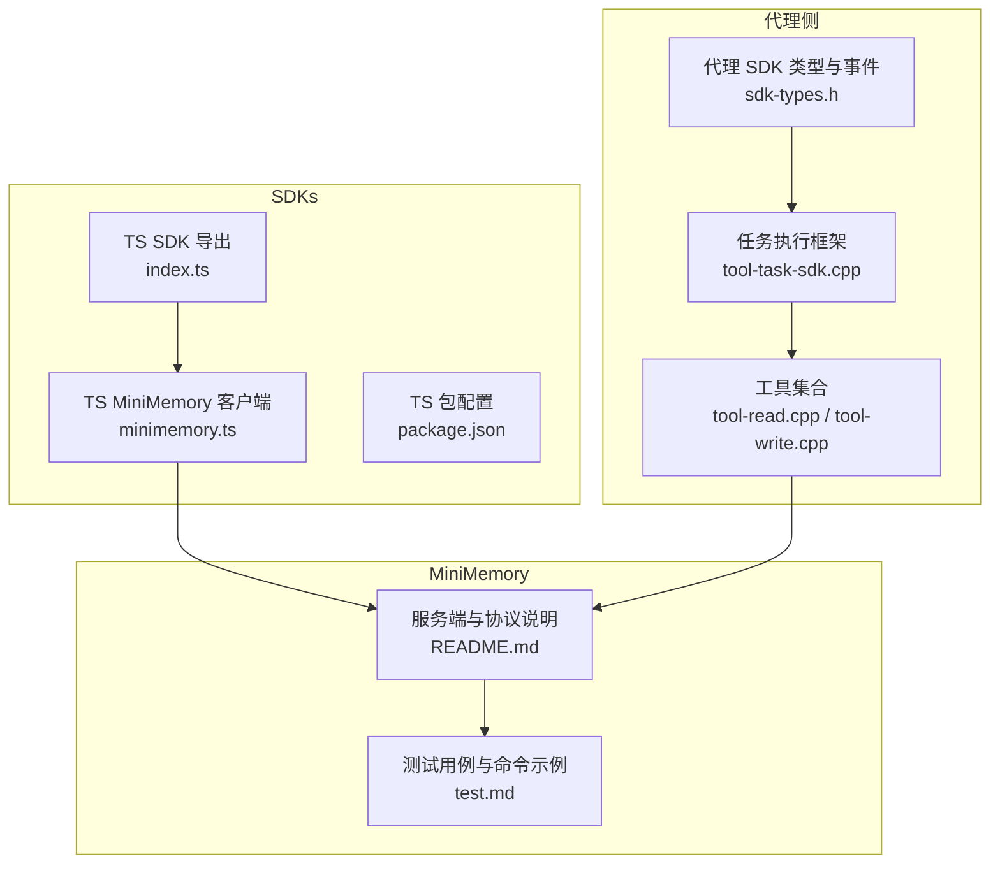
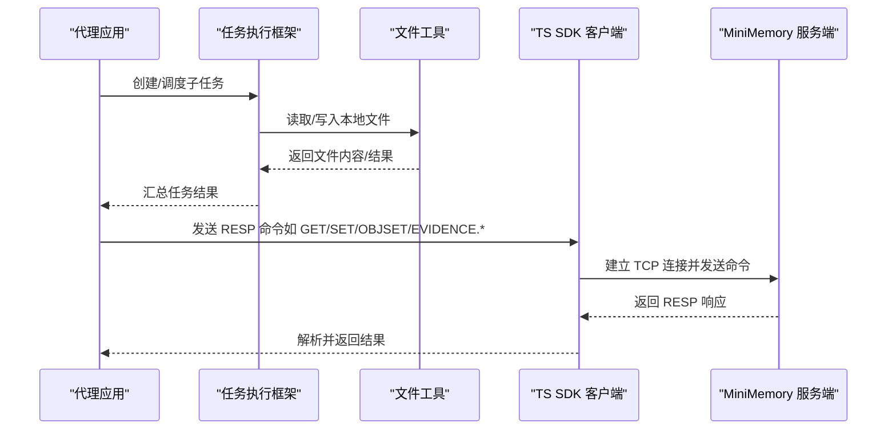
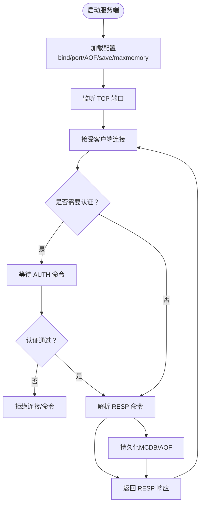
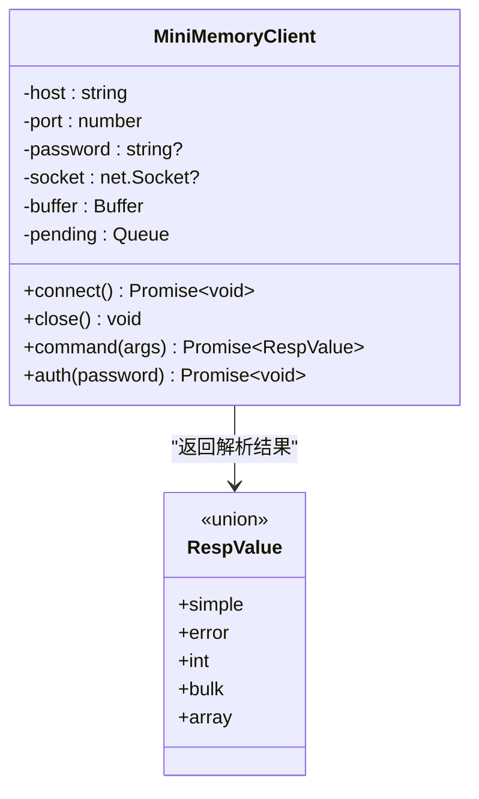
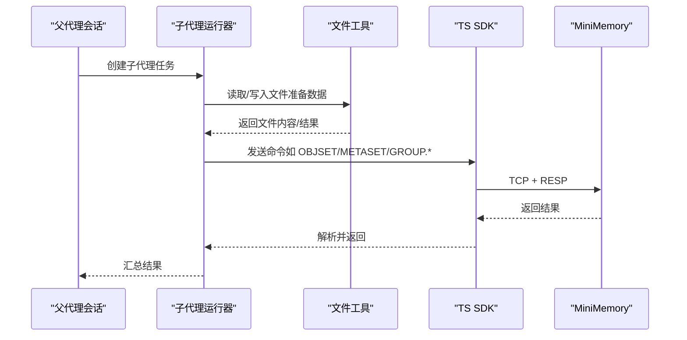
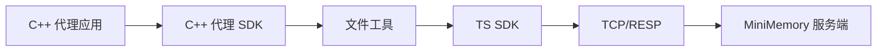

# MiniMemory 集成

<cite>
**本文引用的文件**
- [README.md](file://third_party/MiniMemory/README.md)
- [test.md](file://third_party/MiniMemory/test.md)
- [minimemory.ts](file://SDKs/typescript/src/minimemory.ts)
- [index.ts](file://SDKs/typescript/src/index.ts)
- [package.json](file://SDKs/typescript/package.json)
- [sdk-types.h](file://agent/sdk/sdk-types.h)
- [tool-task-sdk.cpp](file://agent/sdk/tool-task-sdk.cpp)
- [tool-read.cpp](file://agent/tools/tool-read.cpp)
- [tool-write.cpp](file://agent/tools/tool-write.cpp)
</cite>

## 目录
1. [简介](#简介)
2. [项目结构](#项目结构)
3. [核心组件](#核心组件)
4. [架构总览](#架构总览)
5. [详细组件分析](#详细组件分析)
6. [依赖分析](#依赖分析)
7. [性能考虑](#性能考虑)
8. [故障排除指南](#故障排除指南)
9. [结论](#结论)
10. [附录](#附录)

## 简介
本文件面向在 llama.cpp-agent 项目中集成 MiniMemory（类 Redis 的内存 KV 服务）的开发者，提供从集成方式、初始化流程、配置参数到使用方法的完整技术文档。内容涵盖内存分配策略、缓存机制、性能优化、最佳实践、故障排除以及与代理系统的交互方式、数据存储格式与生命周期管理等关键概念。

MiniMemory 提供 RESP 协议的命令接口，支持基础 KV、数据库选择、事务、过期时间、持久化（MCDB 快照 + AOF 追加日志）等能力，并提供嵌入式 C++ 客户端实现与多语言最小驱动，便于在 C++ 项目中直接复用。

## 项目结构
本项目中与 MiniMemory 相关的关键位置：
- third_party/MiniMemory：MiniMemory 服务端与客户端实现、配置模板与测试用例
- SDKs/typescript：TypeScript SDK，包含 RESP 解析与 MiniMemory 客户端封装
- agent/sdk：代理 SDK 类型定义与任务执行框架
- agent/tools：文件读写等工具，可作为与 MiniMemory 交互的数据来源或目标

**图表来源**
- [sdk-types.h:1-59](file://agent/sdk/sdk-types.h#L1-L59)
- [tool-task-sdk.cpp:1-358](file://agent/sdk/tool-task-sdk.cpp#L1-L358)
- [tool-read.cpp:1-120](file://agent/tools/tool-read.cpp#L1-L120)
- [tool-write.cpp:1-80](file://agent/tools/tool-write.cpp#L1-L80)
- [index.ts:218-221](file://SDKs/typescript/src/index.ts#L218-L221)
- [minimemory.ts:1-183](file://SDKs/typescript/src/minimemory.ts#L1-L183)
- [README.md:1-960](file://third_party/MiniMemory/README.md#L1-L960)
- [test.md:1-165](file://third_party/MiniMemory/test.md#L1-L165)

**章节来源**
- [README.md:1-960](file://third_party/MiniMemory/README.md#L1-L960)
- [test.md:1-165](file://third_party/MiniMemory/test.md#L1-L165)
- [index.ts:218-221](file://SDKs/typescript/src/index.ts#L218-L221)
- [minimemory.ts:1-183](file://SDKs/typescript/src/minimemory.ts#L1-L183)
- [sdk-types.h:1-59](file://agent/sdk/sdk-types.h#L1-L59)
- [tool-task-sdk.cpp:1-358](file://agent/sdk/tool-task-sdk.cpp#L1-L358)
- [tool-read.cpp:1-120](file://agent/tools/tool-read.cpp#L1-L120)
- [tool-write.cpp:1-80](file://agent/tools/tool-write.cpp#L1-L80)

## 核心组件
- MiniMemory 服务端与协议
  - 采用 RESP 协议，支持基础命令、数据库选择、事务、过期时间、持久化等
  - 提供配置模板与构建产物，支持 Windows/Linux/macOS
- TypeScript SDK
  - 提供 RESP 编码/解码与 MiniMemory 客户端封装，支持 AUTH、命令发送与异步响应解析
- 代理 SDK 与工具
  - 代理 SDK 定义事件类型与统计信息
  - 工具提供文件读写能力，可作为与 MiniMemory 交互的数据源/目标

**章节来源**
- [README.md:1-960](file://third_party/MiniMemory/README.md#L1-L960)
- [minimemory.ts:1-183](file://SDKs/typescript/src/minimemory.ts#L1-L183)
- [index.ts:218-221](file://SDKs/typescript/src/index.ts#L218-L221)
- [sdk-types.h:1-59](file://agent/sdk/sdk-types.h#L1-L59)
- [tool-read.cpp:1-120](file://agent/tools/tool-read.cpp#L1-L120)
- [tool-write.cpp:1-80](file://agent/tools/tool-write.cpp#L1-L80)

## 架构总览
下图展示 MiniMemory 在代理系统中的角色与交互路径：代理通过工具或任务框架读写文件，TS SDK 通过 TCP 与 MiniMemory 服务端通信，MiniMemory 以 RESP 协议处理命令并持久化数据。

**图表来源**
- [tool-task-sdk.cpp:1-358](file://agent/sdk/tool-task-sdk.cpp#L1-L358)
- [tool-read.cpp:1-120](file://agent/tools/tool-read.cpp#L1-L120)
- [tool-write.cpp:1-80](file://agent/tools/tool-write.cpp#L1-L80)
- [minimemory.ts:101-181](file://SDKs/typescript/src/minimemory.ts#L101-L181)
- [README.md:303-316](file://third_party/MiniMemory/README.md#L303-L316)

## 详细组件分析

### MiniMemory 服务端与协议
- 协议与兼容性
  - 仅支持数组形式命令，要求客户端按 RESP2 数组协议发送命令
  - 若配置 requirepass，业务命令前需先 AUTH，否则返回认证错误
- 命令能力
  - 基础 KV、数据库选择、事务、过期时间、键空间扫描、数值操作、持久化等
  - 图谱与证据检索增强命令，支持结构化邻居、边枚举、图谱检索与候选集裁剪
- 配置要点
  - bind/port、requirepass、AOF（appendonly、appendfilename、appendfsync）
  - 快照保存条件（save <seconds> <changes>）
  - 内存上限与淘汰策略（maxmemory、maxmemory-policy）

**图表来源**
- [README.md:35-71](file://third_party/MiniMemory/README.md#L35-L71)
- [README.md:303-316](file://third_party/MiniMemory/README.md#L303-L316)

**章节来源**
- [README.md:1-960](file://third_party/MiniMemory/README.md#L1-L960)
- [test.md:1-165](file://third_party/MiniMemory/test.md#L1-L165)

### TypeScript SDK：MiniMemory 客户端
- 功能特性
  - RESP 编码/解码：支持简单字符串、整数、批量字符串、数组
  - 异步命令调用：内部维护 socket 与缓冲区，按顺序处理响应
  - 认证：若配置密码，自动在连接后执行 AUTH
- 关键行为
  - connect() 建立连接并可选执行 AUTH
  - command(args) 发送命令并返回解析后的 RESP 值
  - close() 销毁连接并清理挂起的回调

**图表来源**
- [minimemory.ts:3-99](file://SDKs/typescript/src/minimemory.ts#L3-L99)
- [minimemory.ts:101-181](file://SDKs/typescript/src/minimemory.ts#L101-L181)

**章节来源**
- [minimemory.ts:1-183](file://SDKs/typescript/src/minimemory.ts#L1-L183)
- [index.ts:218-221](file://SDKs/typescript/src/index.ts#L218-L221)
- [package.json:1-18](file://SDKs/typescript/package.json#L1-L18)

### 代理 SDK 与工具：与 MiniMemory 的交互
- 代理 SDK 类型
  - 定义事件类型、统计信息与运行结果，便于在任务执行过程中记录 MiniMemory 使用情况
- 工具能力
  - 文件读写工具可用于准备/消费 MiniMemory 的输入输出（如 OBJSET 的数据、EVIDENCE 检索的标签/元数据）
- 任务执行框架
  - 支持子代理模式与后台任务，便于在复杂流程中编排 MiniMemory 的调用

**图表来源**
- [sdk-types.h:19-50](file://agent/sdk/sdk-types.h#L19-L50)
- [tool-task-sdk.cpp:30-142](file://agent/sdk/tool-task-sdk.cpp#L30-L142)
- [tool-read.cpp:17-93](file://agent/tools/tool-read.cpp#L17-L93)
- [tool-write.cpp:10-57](file://agent/tools/tool-write.cpp#L10-L57)
- [minimemory.ts:101-181](file://SDKs/typescript/src/minimemory.ts#L101-L181)

**章节来源**
- [sdk-types.h:1-59](file://agent/sdk/sdk-types.h#L1-L59)
- [tool-task-sdk.cpp:1-358](file://agent/sdk/tool-task-sdk.cpp#L1-L358)
- [tool-read.cpp:1-120](file://agent/tools/tool-read.cpp#L1-L120)
- [tool-write.cpp:1-80](file://agent/tools/tool-write.cpp#L1-L80)

## 依赖分析
- 语言与协议
  - 代理侧使用 C++（代理 SDK、工具）
  - TS SDK 通过 TCP 与 MiniMemory 服务端通信，遵循 RESP2 协议
- 组件耦合
  - TS SDK 与 MiniMemory 服务端通过网络耦合，协议层解耦
  - 代理工具与 TS SDK 通过命令语义耦合（如 OBJSET/METASET/EVIDENCE.*）
- 外部依赖
  - TS SDK 依赖 Node.js net 模块与 Buffer
  - 服务端依赖构建系统（CMake）与平台网络栈

**图表来源**
- [index.ts:218-221](file://SDKs/typescript/src/index.ts#L218-L221)
- [minimemory.ts:1-183](file://SDKs/typescript/src/minimemory.ts#L1-L183)
- [README.md:303-316](file://third_party/MiniMemory/README.md#L303-L316)

**章节来源**
- [index.ts:218-221](file://SDKs/typescript/src/index.ts#L218-L221)
- [minimemory.ts:1-183](file://SDKs/typescript/src/minimemory.ts#L1-L183)
- [README.md:303-316](file://third_party/MiniMemory/README.md#L303-L316)

## 性能考虑
- 内存管理与淘汰策略
  - 通过 maxmemory 与 maxmemory-policy 控制内存上限与淘汰策略（如 allkeys-lru）
  - 配合 save 条件与 AOF 策略（appendfsync）平衡一致性与吞吐
- 命令与序列化
  - RESP 数组命令开销低，建议批量命令与流水线化减少往返
  - 大对象（如 OBJSET）建议分片传输或压缩，降低网络与内存峰值
- 并发与连接
  - TS SDK 为单连接同步调用；高并发场景建议连接池或多连接并行
- 持久化与 IO
  - AOF everysec 在延迟与可靠性间折中；对写密集场景可评估 save 策略
- 图谱与检索
  - EVIDENCE.SEARCHF 支持图谱与标签/元数据裁剪，建议预建图谱与合理标签设计，减少候选集规模

**章节来源**
- [README.md:35-71](file://third_party/MiniMemory/README.md#L35-L71)
- [README.md:128-254](file://third_party/MiniMemory/README.md#L128-L254)
- [test.md:80-103](file://third_party/MiniMemory/test.md#L80-L103)

## 故障排除指南
- 认证失败
  - 现象：返回 NOAUTH 错误
  - 处理：确认 requirepass 配置与 AUTH 命令顺序
- 连接异常
  - 现象：connect failed 或 socket closed
  - 处理：检查 bind/port、防火墙、服务端启动日志与 resolved data paths
- 响应解析错误
  - 现象：TS SDK 抛出 bad resp 或解析中断
  - 处理：确认客户端与服务端 RESP2 兼容性，避免 inline 命令
- 命令未生效
  - 现象：GET/SCAN 等无结果或过期
  - 处理：检查数据库选择（SELECT）、过期时间（PEXPIRE/PTTL）、键空间操作（FLUSHDB/KEYS/SCAN）
- 持久化问题
  - 现象：重启后数据丢失
  - 处理：确认 AOF 文件路径与权限、SAVE 命令触发时机、快照路径解析规则

**章节来源**
- [README.md:35-71](file://third_party/MiniMemory/README.md#L35-L71)
- [README.md:303-316](file://third_party/MiniMemory/README.md#L303-L316)
- [test.md:2-103](file://third_party/MiniMemory/test.md#L2-L103)

## 结论
MiniMemory 为 llama.cpp-agent 提供了高性能、易集成的内存 KV 能力，配合 TS SDK 与代理工具，可在复杂任务中实现结构化数据的高效存储与检索。通过合理的配置与调优（内存上限、淘汰策略、持久化策略、图谱与检索），可满足大多数应用场景的性能与可靠性需求。建议在生产环境中结合监控与压测，持续优化命令序列与连接策略。

## 附录

### 集成步骤（概要）
- 在 CMake 中引入 MiniMemory（子模块或链接构建产物）
- 在代理应用中使用 TS SDK 通过 TCP 连接 MiniMemory 服务端
- 使用基础命令（PING/SET/GET/DEL）与图谱/证据检索命令（EVIDENCE.*）完成数据写入与查询
- 通过文件工具准备/消费数据，配合子代理任务框架编排复杂流程

**章节来源**
- [README.md:255-302](file://third_party/MiniMemory/README.md#L255-L302)
- [index.ts:218-221](file://SDKs/typescript/src/index.ts#L218-L221)
- [minimemory.ts:101-181](file://SDKs/typescript/src/minimemory.ts#L101-L181)
- [tool-task-sdk.cpp:1-358](file://agent/sdk/tool-task-sdk.cpp#L1-L358)