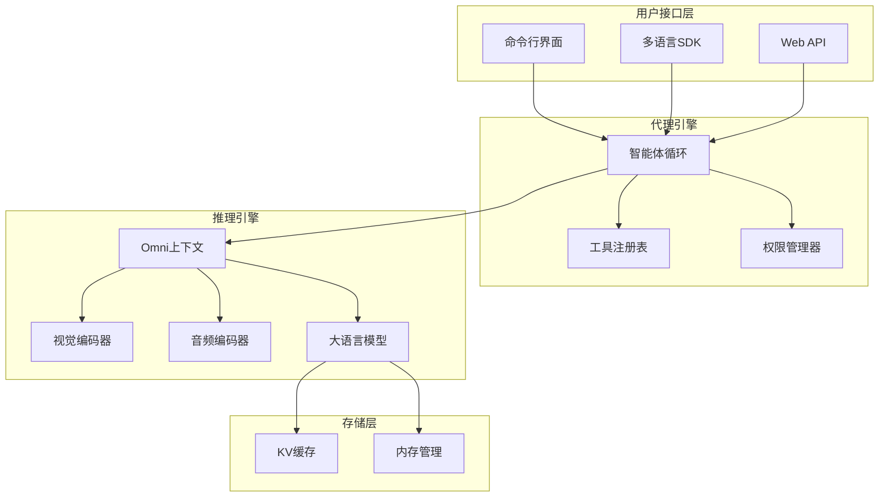
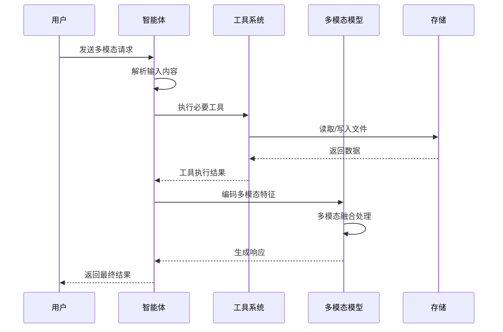
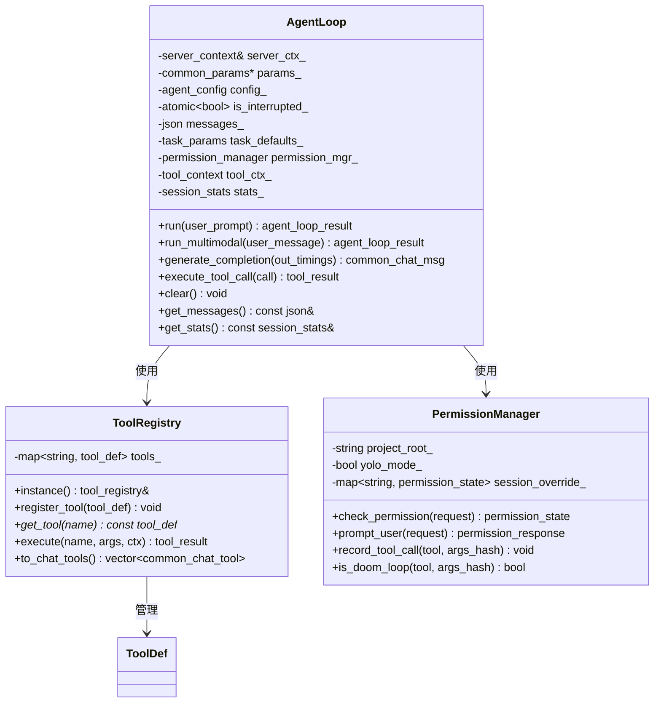
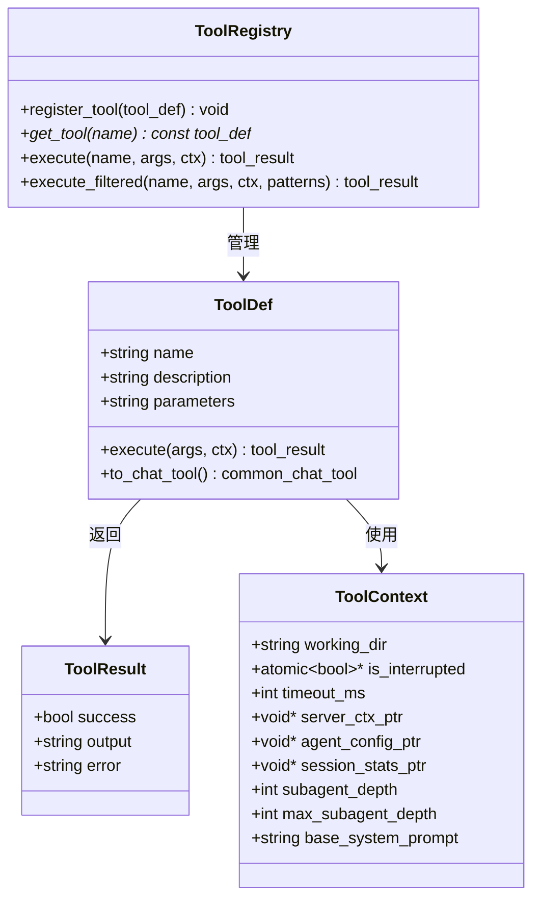
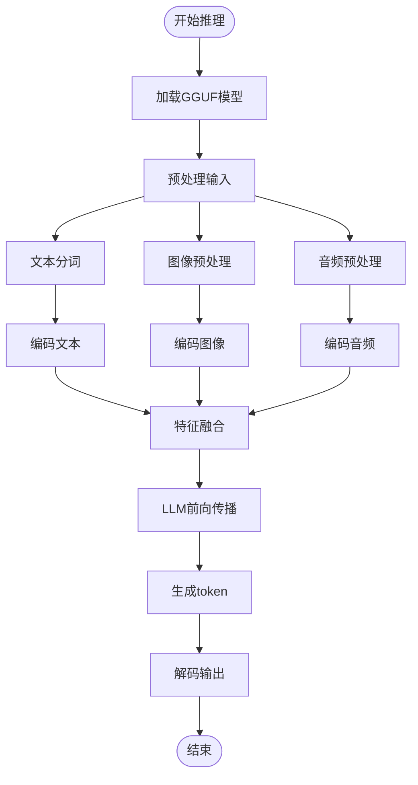

# Omni多模态推理指南

<cite>
**本文档引用的文件**
- [omni-multimodal-inference-guide.md](file://docs/omni-multimodal-inference-guide.md)
- [qwen3-omni-ggml-inference-guide.md](file://docs/qwen3-omni-ggml-inference-guide.md)
- [agent.cpp](file://agent/agent.cpp)
- [agent-loop.cpp](file://agent/agent-loop.cpp)
- [agent-loop.h](file://agent/agent-loop.h)
- [tool-registry.cpp](file://agent/tool-registry.cpp)
- [tool-registry.h](file://agent/tool-registry.h)
- [tool-read.cpp](file://agent/tools/tool-read.cpp)
- [tool-bash.cpp](file://agent/tools/tool-bash.cpp)
- [permission.h](file://agent/permission.h)
- [sdk.py](file://SDKs/python/src/llama_agent_sdk/sdk.py)
- [sdk.go](file://SDKs/go/llamaagentsdk/sdk.go)
- [index.ts](file://SDKs/typescript/src/index.ts)
</cite>

## 目录
1. [项目概述](#项目概述)
2. [系统架构](#系统架构)
3. [核心组件](#核心组件)
4. [多模态推理流程](#多模态推理流程)
5. [SDK集成指南](#sdk集成指南)
6. [性能优化](#性能优化)
7. [故障排除](#故障排除)
8. [最佳实践](#最佳实践)
9. [总结](#总结)

## 项目概述

Omni多模态推理项目是一个基于llama.cpp框架的全模态AI模型推理系统，能够同时处理文本、图像、音频、视频等多种输入模态。该项目支持多种先进的多模态模型架构，包括Qwen2.5-Omni、MiniCPM-O、Ultravox等。

### 支持的模型架构

项目支持以下多模态模型类型：

| 模型系列 | 代表模型 | 支持的模态组合 | 特点 |
|---------|----------|----------------|------|
| Qwen2.5-Omni | Qwen2.5-Omni-3B, 7B | 文本+图像+音频 | 基于Qwen2.5 LLM的全模态架构 |
| MiniCPM-O | MiniCPM-o-2_6 | 图像+视频 | 高效的多模态融合机制 |
| Ultravox | Ultravox-v0_5-llama-3_2-1b | 音频+文本 | 轻量级设计，专注音频理解 |
| Voxtral | Voxtral-Mini-3B-2507 | 音频 | Mistral家族的音频模型 |

### 核心特性

- **统一架构**：单个模型处理多种输入模态
- **跨模态理解**：能够理解不同模态之间的关联
- **任意组合**：支持多种输入的组合（如文本 + 图像 + 音频）
- **原生支持**：真正的端到端训练，不是简单的多模型拼接

## 系统架构

### 整体架构设计



**图表来源**
- [agent.cpp:101-588](file://agent/agent.cpp#L101-L588)
- [agent-loop.h:167-276](file://agent/agent-loop.h#L167-L276)

### 数据流架构



**图表来源**
- [agent-loop.cpp:695-788](file://agent/agent-loop.cpp#L695-L788)
- [tool-registry.cpp:49-86](file://agent/tool-registry.cpp#L49-L86)

## 核心组件

### 智能体循环系统

智能体循环是整个系统的控制中心，负责协调各个组件的工作流程。



**图表来源**
- [agent-loop.h:167-276](file://agent/agent-loop.h#L167-L276)
- [tool-registry.h:58-103](file://agent/tool-registry.h#L58-L103)
- [permission.h:40-102](file://agent/permission.h#L40-L102)

### 工具系统架构

工具系统提供了安全的文件操作和命令执行能力：



**图表来源**
- [tool-registry.h:44-56](file://agent/tool-registry.h#L44-L56)
- [tool-registry.h:18-41](file://agent/tool-registry.h#L18-L41)
- [tool-registry.h:58-103](file://agent/tool-registry.h#L58-L103)

### 多模态推理引擎

多模态推理引擎是系统的核心，负责处理各种模态的数据：



**图表来源**
- [omni-multimodal-inference-guide.md:512-527](file://docs/omni-multimodal-inference-guide.md#L512-L527)

**章节来源**
- [agent-loop.cpp:49-251](file://agent/agent-loop.cpp#L49-L251)
- [agent-loop.h:167-276](file://agent/agent-loop.h#L167-L276)
- [tool-registry.cpp:11-86](file://agent/tool-registry.cpp#L11-L86)

## 多模态推理流程

### 完整推理步骤

多模态推理遵循以下标准化流程：

1. **模型初始化**：OmniContext.initialize()
2. **输入预处理**：process_multimodal_input()
   - 文本：Tokenize
   - 图像：Resize → Normalize → Tensor
   - 音频：Mel Spectrogram → Tensor
   - 视频：Extract Frames → 多张图像
3. **特征编码**：encode_image() 和 encode_audio()
4. **特征融合**：Concatenate: [Text] + [Vision] + [Audio]
5. **LLM生成**：Forward Pass → Logits → Sample → Next Token
6. **结果解码**：Detokenize → 文本响应

### 实际应用示例

#### 视频问答示例

```bash
# 编译程序
cd llama.cpp/build
cmake .. -DGGML_CUDA=ON
make -j$(nproc) omni-inference

# 运行视频问答
./bin/omni-inference \
  -m qwen2.5-omni-3b-q4_k_m.gguf \
  -v input_video.mp4 \
  -p "视频中发生了什么？请用中文描述" \
  --fps 1 \
  -t 512
```

#### 音频转录示例

```bash
./bin/omni-inference \
  -m voxtral-mini-3b-q4_k_m.gguf \
  -a meeting_recording.wav \
  -p "请总结这段会议录音的主要内容" \
  -t 256
```

#### 多图理解示例

```bash
./bin/omni-inference \
  -m minicpm-o-2_6-q4_k_m.gguf \
  -i frame_001.jpg -i frame_002.jpg -i frame_003.jpg \
  -p "这几张图片展示了什么故事？按顺序描述" \
  -t 512
```

**章节来源**
- [omni-multimodal-inference-guide.md:508-610](file://docs/omni-multimodal-inference-guide.md#L508-L610)

## SDK集成指南

### Python SDK使用

Python SDK提供了最完整的API支持：

```python
from llama_agent_sdk import HttpAgentSession

# 创建会话
session = HttpAgentSession(
    server={"base_url": "http://localhost:8000", "api_key": "your-api-key"},
    config={"model": "qwen3o-3b", "working_dir": ".", "max_iterations": 50}
)

# 发送消息
response = session.chat_completions("描述这幅画")
print(response)
```

### Go SDK使用

Go SDK适合构建高性能服务：

```go
package main

import "github.com/yourorg/llamaagentsdk"

func main() {
    session := llamaagentsdk.NewHttpAgentSession(
        llamaagentsdk.HttpServerConfig{
            BaseURL: "http://localhost:8000",
            APIKey:  "your-api-key",
        },
        llamaagentsdk.HttpAgentConfig{
            Model: "qwen3o-3b",
        },
    )
    
    result, err := session.ChatCompletions(context.Background(), "你好", nil)
    if err != nil {
        panic(err)
    }
    println(result)
}
```

### TypeScript SDK使用

TypeScript SDK适合前端应用：

```typescript
import { HttpAgentSession } from './index';

const session = new HttpAgentSession(
    { baseUrl: 'http://localhost:8000', apiKey: 'your-api-key' },
    { model: 'qwen3o-3b' }
);

const result = await session.chatCompletions("你好");
console.log(result);
```

**章节来源**
- [sdk.py:102-224](file://SDKs/python/src/llama_agent_sdk/sdk.py#L102-L224)
- [sdk.go:45-267](file://SDKs/go/llamaagentsdk/sdk.go#L45-L267)
- [index.ts:83-221](file://SDKs/typescript/src/index.ts#L83-L221)

## 性能优化

### 内存优化策略

1. **量化模型**：使用Q4_K_M, Q8_0等量化格式
2. **批量处理**：合理设置batch size
3. **图像优化**：降低图像分辨率
4. **音频优化**：缩短音频长度

### 推理加速技术

1. **硬件加速**：启用CUDA/Metal加速
2. **注意力优化**：使用Flash Attention
3. **缓存利用**：最大化KV缓存复用
4. **并行处理**：多线程并发执行

### 常见性能问题

| 问题 | 解决方案 | 预期效果 |
|------|----------|----------|
| 内存不足 | 使用量化模型 | 减少内存占用75% |
| 推理缓慢 | 启用硬件加速 | 提升推理速度2-5倍 |
| 响应延迟高 | 优化预处理参数 | 减少预处理时间60% |
| 缓存效率低 | 调整会话策略 | 提高缓存命中率40% |

## 故障排除

### 常见错误及解决方案

#### 模型加载失败

**错误症状**：启动时提示模型加载失败
**可能原因**：
- GGUF文件损坏
- 模型架构不支持
- 内存不足

**解决方法**：
1. 验证GGUF文件完整性
2. 检查模型架构兼容性
3. 启用量化模式

#### 权限拒绝

**错误症状**：工具执行被拒绝
**可能原因**：
- 文件访问权限不足
- 危险命令检测
- 外部目录访问

**解决方法**：
1. 检查文件权限设置
2. 使用安全命令替代危险命令
3. 配置外部目录访问策略

#### 推理异常

**错误症状**：推理过程中出现异常
**可能原因**：
- 输入数据格式错误
- 模型参数配置不当
- 硬件资源不足

**解决方法**：
1. 验证输入数据格式
2. 检查模型参数设置
3. 监控系统资源使用情况

**章节来源**
- [omni-multimodal-inference-guide.md:647-669](file://docs/omni-multimodal-inference-guide.md#L647-L669)

## 最佳实践

### 安全最佳实践

1. **权限控制**：严格限制文件系统访问
2. **命令过滤**：阻止危险命令执行
3. **输入验证**：验证所有用户输入
4. **资源限制**：设置合理的超时和配额

### 性能最佳实践

1. **模型选择**：根据需求选择合适规模的模型
2. **预处理优化**：使用高效的预处理算法
3. **缓存策略**：合理利用KV缓存
4. **并发控制**：避免过度并发导致的资源竞争

### 开发最佳实践

1. **模块化设计**：保持代码模块化和可测试性
2. **错误处理**：完善的错误处理和恢复机制
3. **日志记录**：详细的日志记录便于调试
4. **文档维护**：及时更新技术文档

## 总结

Omni多模态推理项目提供了一个完整、高效、安全的多模态AI模型推理平台。通过统一的架构设计和丰富的SDK支持，用户可以轻松地集成和部署各种多模态模型。

### 核心优势

1. **全面支持**：支持多种主流多模态模型架构
2. **高性能**：优化的推理引擎和硬件加速支持
3. **安全性**：严格的权限控制和安全防护机制
4. **易用性**：简洁的API和丰富的SDK支持
5. **可扩展性**：模块化的架构设计便于功能扩展

### 未来发展方向

1. **更多模型支持**：持续集成新的多模态模型
2. **性能优化**：进一步提升推理速度和效率
3. **功能增强**：增加更多实用的工具和功能
4. **生态建设**：构建更加完善的开发者生态

通过本指南，开发者可以快速上手Omni多模态推理系统，构建强大的多模态AI应用。