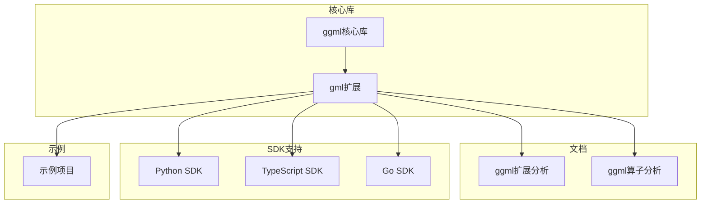
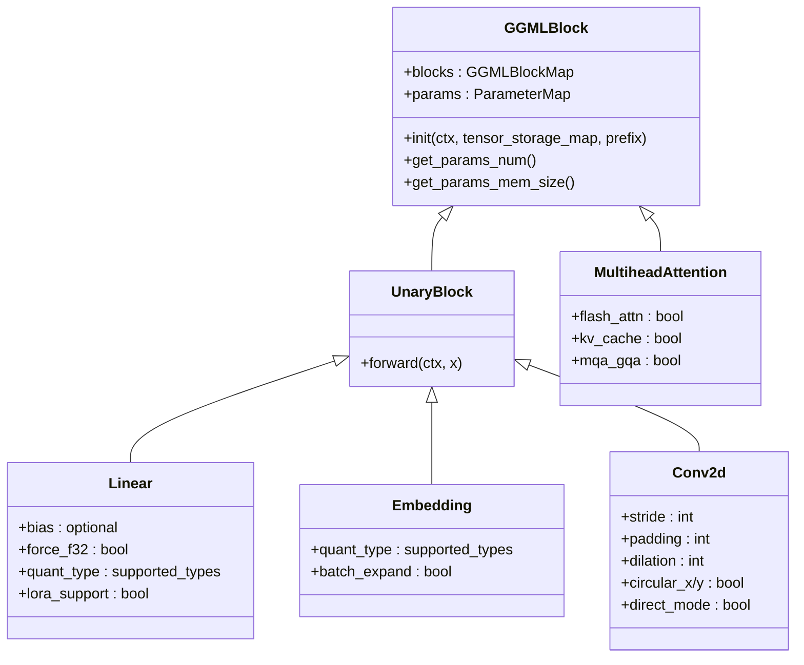
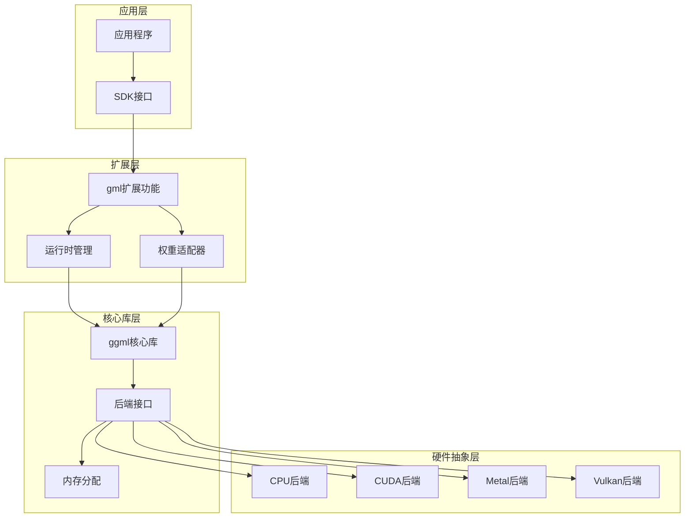
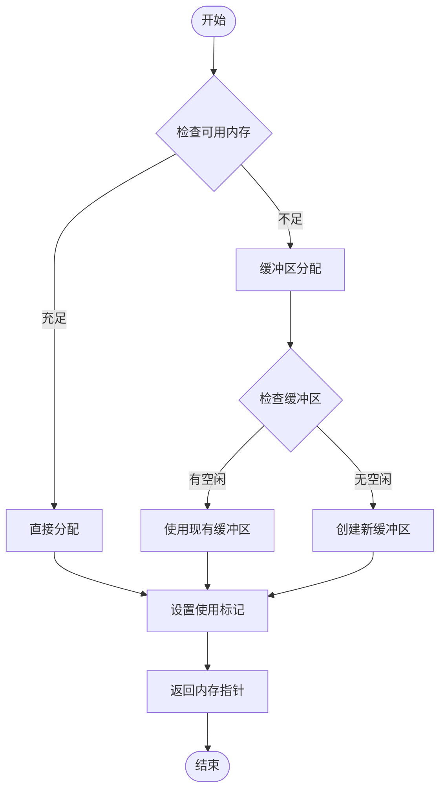
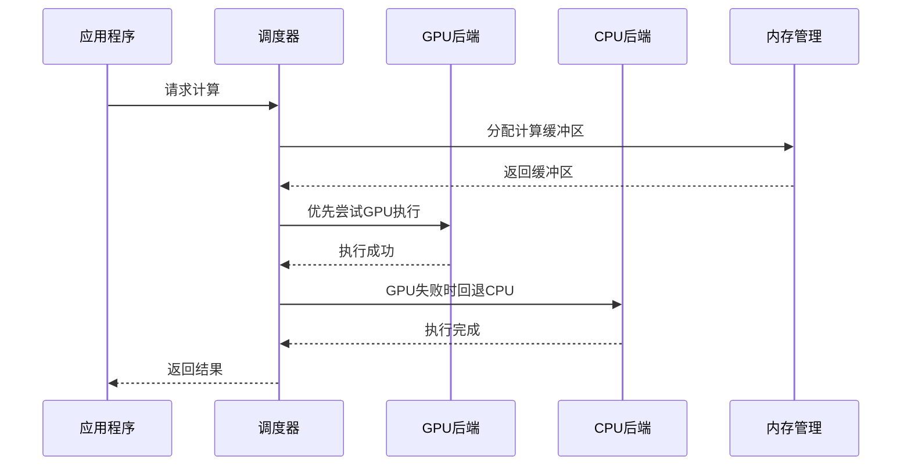
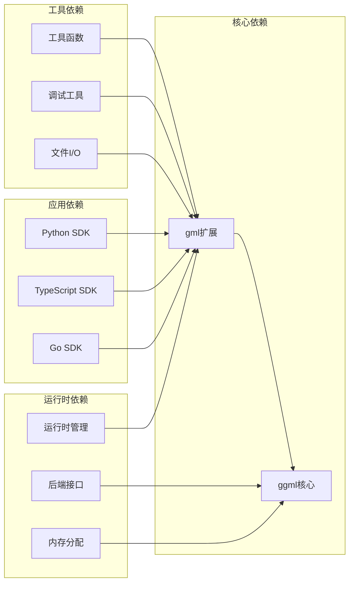

# ggml扩展研究

<cite>
**本文档引用的文件**
- [ggml的扩展.md](file://docs/ggml的扩展.md)
- [ggml-analysis.md](file://docs/ggml-analysis.md)
- [ggml.h](file://third_party/llama.cpp/ggml/include/ggml.h)
- [ggml-alloc.c](file://third_party/llama.cpp/ggml/src/ggml-alloc.c)
- [ggml-backend.h](file://third_party/llama.cpp/ggml/include/ggml-backend.h)
- [llama-graph.cpp](file://third_party/llama.cpp/src/llama-graph.cpp)
- [CMakeLists.txt](file://third_party/llama.cpp/CMakeLists.txt)
- [sdk.py](file://SDKs/python/src/llama_agent_sdk/sdk.py)
- [index.ts](file://SDKs/typescript/src/index.ts)
- [sdk.go](file://SDKs/go/llamaagentsdk/sdk.go)
</cite>

## 目录
1. [简介](#简介)
2. [项目结构](#项目结构)
3. [核心组件](#核心组件)
4. [架构概览](#架构概览)
5. [详细组件分析](#详细组件分析)
6. [依赖关系分析](#依赖关系分析)
7. [性能考虑](#性能考虑)
8. [故障排除指南](#故障排除指南)
9. [结论](#结论)

## 简介

本项目专注于对ggml库的扩展研究，重点分析了`ggml_extend.hpp`扩展文件的功能特性和实现原理。ggml是一个用于机器学习的张量运算库，支持多达4维的张量操作、自动微分、优化算法以及多种量化格式。该项目在基础ggml操作之上构建了更高级的抽象，为神经网络层的实现提供了更加简洁和高效的解决方案。

扩展功能涵盖了从基础工具函数到高级神经网络层封装的完整体系，包括张量代数扩展、LoRA支持、图像处理操作、注意力机制扩展、归一化操作、激活函数、卷积操作扩展以及运行时管理系统等核心功能模块。

## 项目结构

该项目采用模块化的组织方式，主要包含以下几个核心部分：



**图表来源**
- [ggml的扩展.md:1-771](file://docs/ggml的扩展.md#L1-L771)
- [ggml-analysis.md:1-804](file://docs/ggml-analysis.md#L1-L804)

**章节来源**
- [ggml的扩展.md:1-771](file://docs/ggml的扩展.md#L1-L771)
- [ggml-analysis.md:1-804](file://docs/ggml-analysis.md#L1-L804)

## 核心组件

### 基础工具函数

扩展文件提供了丰富的基础工具函数，主要包括：

#### 内存对齐工具
- `align_up_offset`: 计算内存对齐偏移量
- `align_up`: 计算对齐后的值

这些工具确保数据结构的内存布局满足硬件要求，为后续的张量操作提供基础保障。

#### 日志回调系统
- `ggml_log_callback_default`: 提供统一的日志处理回调，支持DEBUG、INFO、WARN、ERROR四个级别

**章节来源**
- [ggml的扩展.md:22-37](file://docs/ggml的扩展.md#L22-L37)

### 张量代数扩展

#### n-模张量-矩阵积
实现了张量沿着指定维度与矩阵的乘积操作，这是张量分解中的核心运算。该功能支持：
- 将第mode维交换到第0维
- 将4D张量转换为2D矩阵
- 执行标准的矩阵乘法
- 恢复为4D张量
- 还原维度顺序

应用场景包括Tucker分解、高阶SVD、张量神经网络等。

#### Kronecker积
实现了两个张量的Kronecker积（张量积），通过插值和逐元素乘法实现。数学表达式为：
```
[ne03,ne02,ne01,ne00] ⊗ [ne13,ne12,ne11,ne10] 
= [ne03*ne13, ne02*ne12, ne01*ne11, ne00*ne10]
```

应用包括LoKr分解、模型压缩等场景。

**章节来源**
- [ggml的扩展.md:38-86](file://docs/ggml的扩展.md#L38-L86)

### LoRA支持系统

#### LoRA权重合并
提供了将LoRA低秩权重合并回原始权重形状的功能，支持两种模式：

**模式1：全连接层（无lora_mid）**
```
ΔW = B × A
```
其中：
- A (lora_down): [rank, in_features]
- B (lora_up): [out_features, rank]
- ΔW: [out_features, in_features]

**模式2：卷积层（使用lora_mid - Tucker分解）**
```
ΔW ≈ G ×₃ A ×₄ B
```
其中：
- G (lora_mid): [3, 3, rank, rank]
- A (lora_down): [rank, C_in, 1, 1]
- B (lora_up): [rank, C_out, 1, 1]
- ΔW: [3, 3, C_out, C_in]

#### LoKr前向传播
实现了LoKr（Kronecker积分解）的前向计算，核心思想是使用Kronecker积分解进一步压缩参数量：
```
W ≈ (W1 ⊗ W2) × input
```

**章节来源**
- [ggml的扩展.md:87-135](file://docs/ggml的扩展.md#L87-L135)

### 图像处理操作

#### 图像张量转换
提供了完整的图像与张量之间的转换功能：
- `ggml_tensor_to_sd_image`: 将ggml张量转换为SD图像格式
- `sd_image_to_ggml_tensor`: 将SD图像转换为ggml张量
- `sd_image_f32_to_ggml_tensor`: 支持float32图像格式

特点包括自动处理数值范围缩放（[0,255] ↔ [0,1]）、支持多通道（RGB/RGBA）、支持视频帧（4D张量）。

#### 分块处理（Tiling）
实现了方形和非方形分块处理功能：
- `sd_tiling`: 方形分块处理
- `sd_tiling_non_square`: 非方形分块处理
- `sd_tiling_calc_tiles`: 计算最优分块参数

关键参数包括：
- `tile_size`: 分块大小
- `tile_overlap_factor`: 重叠比例（用于平滑融合）
- `circular_x/y`: 是否启用循环填充

融合算法使用smootherstep进行加权混合，避免块间边界。

**章节来源**
- [ggml的扩展.md:136-185](file://docs/ggml的扩展.md#L136-L185)

### 神经网络层封装

#### 面向对象设计
文件定义了完整的神经网络层类层次结构：



**图表来源**
- [ggml的扩展.md:187-241](file://docs/ggml的扩展.md#L187-L241)

#### 全连接层（Linear）
特性包括：
- 支持bias可选
- 强制float32精度选项
- 支持量化类型（Q4_0, Q5_0, Q8_0等）
- 集成LoRA支持

优化策略包括大数据量时的reshape以避免CUDA错误。

#### 嵌入层（Embedding）
特性包括：
- 支持量化类型（仅F16, Q8_0, Q5_1, Q50, Q41, Q4_0）
- 自动batch展开（解决ggml batch推理问题）

**章节来源**
- [ggml的扩展.md:204-241](file://docs/ggml的扩展.md#L204-L241)

### 注意力机制扩展

#### 增强的注意力机制
实现了高度优化的多头注意力机制，关键特性包括：

**Flash Attention支持**
```cpp
if (flash_attn && L_k % 256 != 0) {
    kv_pad = GGML_PAD(L_k, 256) - L_k;  // 对齐到256
}
```

- 自动检测是否可以使用Flash Attention
- 动态padding以匹配硬件要求
- 支持mask的Flash Attention

**KV Cache缩放**
```cpp
float kv_scale = 1.0f;  // 避免溢出
k = ggml_scale(ctx, k, kv_scale);
v = ggml_scale(ctx, v, kv_scale);
```

**多查询注意力（MQA/GQA）支持**
```cpp
n_kv_head = k->ne[0] / d_head;  // 可独立于q的头数
```

**两种实现路径**
- Flash Attention路径（优先）
- 标准Attention路径（fallback）

#### QKV拆分工具
提供了拆分序列数据和图像数据的QKV功能：
- `split_qkv`: 拆分序列数据的QKV [N, L, 3*C] → (Q, K, V)
- `split_image_qkv`: 拆分图像数据的QKV [N, 3*C, H, W] → (Q, K, V)

实现技巧使用view和permute避免数据复制。

**章节来源**
- [ggml的扩展.md:242-291](file://docs/ggml的扩展.md#L242-L291)

### 归一化操作

#### 层归一化（Layer Normalization）
公式为：
```
LN(x) = (x - mean) / std * weight + bias
```

特点包括可配置的eps（默认1e-5）和支持无weight/bias模式。

#### 组归一化（Group Normalization）
函数：`ggml_ext_group_norm` / `ggml_ext_group_norm_32`

特点包括默认32组（SD/XL标准配置）、自动reshape weight/bias为4D、eps=1e-6（不同于LN）。

#### RMS归一化（RMS Normalization）
公式为：
```
RMSNorm(x) = x / sqrt(mean(x²) + eps) * weight
```

应用包括Transformer架构（如LLaMA、Wan）。

**章节来源**
- [ggml的扩展.md:293-322](file://docs/ggml的扩展.md#L293-L322)

### 激活函数

#### 封装的激活函数
包括：
- `ggml_ext_silu_act`: SiLU（Swish）线性变体
- `ggml_ext_gelu`: GELU（高斯误差线性单元）
- `ggml_ext_gelu_quick`: Quick GELU（近似版本）

#### SiLU门控机制
实现SwiGLU等门控激活函数的流程：
1. 将输入沿channel维度分成两半
2. 一半经过SiLU激活
3. 两半相乘

**章节来源**
- [ggml的扩展.md:324-351](file://docs/ggml的扩展.md#L324-L351)

### 卷积操作扩展

#### 增强的2D卷积
函数：`ggml_ext_conv_2d`

增强功能包括：
- 自动scaling（用于量化）
- circular padding支持
- 直接/间接算法选择
- 偏置项自动reshape

#### 3D卷积封装
函数包括：
- `ggml_ext_conv_3d`: 标准3D卷积
- `ggml_ext_conv_3d_nx1x1`: 特殊的Nx1x1卷积（用于视频模型）

特性包括分离的circular_x/circular_y控制、智能处理circular与普通填充的组合。

**章节来源**
- [ggml的扩展.md:352-372](file://docs/ggml的扩展.md#L352-L372)

### 运行时管理系统

#### GGMLRunner核心类
提供了完整的模型推理生命周期管理，包括：

**多层级上下文管理**
- `params_ctx`: 参数张量上下文（可在CPU）
- `compute_ctx`: 计算图上下文
- `cache_ctx`: 缓存张量上下文
- `offload_ctx`: 卸载中间上下文

**内存管理**
参数分配：
- `alloc_params_buffer()`: 分配参数内存
- `free_params_buffer()`: 释放参数内存
- `get_params_buffer_size()`: 获取参数内存大小

计算图分配：
- `alloc_compute_buffer()`: 分配计算缓冲区
- `free_compute_buffer()`: 释放计算缓冲区

**异构计算支持**
参数卸载：
- `offload_params_to_runtime_backend()`: 参数从CPU→GPU
- `offload_params_to_params_backend()`: 参数从GPU→CPU

优势包括节省GPU显存、支持更大的模型、自动异步传输（CUDA/SYCL）。

**缓存系统**
API包括：
- `cache(name, tensor)`: 缓存张量
- `get_cache_tensor_by_name(name)`: 获取缓存张量
- `copy_cache_tensors_to_cache_buffer()`: 固化缓存

应用包括Cross-attention的KV cache、文本编码结果缓存、时间步嵌入缓存。

**计算执行**
完整流程包括：
1. 卸载参数到运行时后端
2. 分配计算缓冲区
3. 重置计算上下文
4. 构建计算图
5. 分配图内存
6. 设置输入数据
7. 执行计算
8. 同步结果
9. 更新缓存
10. 清理资源

**后端感知优化**
特性包括：
- CPU后端：设置线程数
- GPU后端：异步数据传输
- Vulkan特殊处理：batch限制

**章节来源**
- [ggml的扩展.md:373-470](file://docs/ggml的扩展.md#L373-L470)

## 架构概览

该项目的整体架构采用了分层设计，从底层的ggml核心库到上层的扩展功能，再到SDK支持层：



**图表来源**
- [ggml的扩展.md:471-771](file://docs/ggml的扩展.md#L471-L771)
- [ggml-analysis.md:537-596](file://docs/ggml-analysis.md#L537-L596)

## 详细组件分析

### 内存管理系统

#### 内存分配策略
扩展文件实现了多层次的内存管理策略：



**图表来源**
- [ggml-alloc.c:1125-1140](file://third_party/llama.cpp/ggml/src/ggml-alloc.c#L1125-L1140)

#### 内存优化技术
- 视图而非复制：使用`ggml_view_4d`创建视图，不复制数据
- 延迟分配：`params.no_alloc = true`先创建图，后统一分配
- 内存复用：`reset_compute_ctx()`重用计算上下文

**章节来源**
- [ggml的扩展.md:592-608](file://docs/ggml的扩展.md#L592-L608)

### 后端架构分析

#### 多后端支持
扩展文件支持所有ggml后端：
- CPU (ggml-cpu)
- CUDA (ggml-cuda)
- Metal (ggml-metal)
- Vulkan (ggml-vulkan)
- OpenCL (ggml-opencl)
- SYCL (ggml-sycl)

#### 后端调度器


**图表来源**
- [ggml-backend.h:241-268](file://third_party/llama.cpp/ggml/include/ggml-backend.h#L241-L268)

**章节来源**
- [ggml-analysis.md:537-596](file://docs/ggml-analysis.md#L537-L596)

### 量化类型系统

#### 支持的量化格式
扩展文件支持多种量化类型：
- 基础浮点类型：F32, F16, BF16
- 整数类型：I8, I16, I32, I64, F64
- Q-quants（传统量化）：Q4_0, Q4_1, Q5_0, Q5_1, Q8_0, Q8_1
- K-quants（优化量化）：Q2_K, Q3_K, Q4_K, Q5_K, Q6_K, Q8_K
- I-quants（重要性矩阵量化）：IQ1_S, IQ1_M, IQ2_XXS, IQ2_XS, IQ2_S, IQ3_XXS, IQ3_S, IQ4_NL, IQ4_XS
- 新型量化格式：TQ1_0, TQ2_0, MXFP4, NVFP4

#### 量化API
```cpp
// 初始化量化表
ggml_quantize_init(GGML_TYPE_Q4_K);

// 量化数据
size_t quantized_size = ggml_quantize_chunk(
    GGML_TYPE_Q4_K,    // 目标类型
    src_float_data,    // 源浮点数据
    dst_buffer,        // 目标缓冲区
    start_row,         // 起始行
    n_rows,            // 行数
    n_per_row,         // 每行元素数
    importance_matrix  // 重要性矩阵（可选）
);
```

**章节来源**
- [ggml-analysis.md:600-673](file://docs/ggml-analysis.md#L600-L673)

## 依赖关系分析

### 组件耦合分析



**图表来源**
- [CMakeLists.txt:175-186](file://third_party/llama.cpp/CMakeLists.txt#L175-L186)

### 外部依赖

项目对外部依赖的管理通过CMake配置实现：
- 使用系统提供的libggml时，通过`find_package(ggml REQUIRED)`查找
- 默认情况下编译内置的ggml库
- 支持多种构建选项和后端配置

**章节来源**
- [CMakeLists.txt:175-186](file://third_party/llama.cpp/CMakeLists.txt#L175-L186)

## 性能考虑

### 计算优化技术

#### 就地操作
- `ggml_scale_inplace`: 就地缩放操作
- `ggml_add_inplace`: 就地加法操作

#### 精度控制
- `ggml_mul_mat_set_prec`: 设置矩阵乘法精度
- 支持F32、F16、BF16等多种精度

#### 批量处理
```cpp
if (x->ne[2] * x->ne[3] > 1024) {
    // 大数据量时reshape以避免CUDA错误
}
```

### 并行化支持

#### 多线程支持
- `ggml_backend_cpu_set_n_threads`: 设置CPU后端线程数
- 自动利用多核处理器能力

#### 异步操作
- `ggml_backend_tensor_get_async`: 异步数据传输
- `ggml_backend_synchronize`: 同步操作

## 故障排除指南

### 常见问题诊断

#### 内存相关问题
1. **内存不足错误**
   - 检查`get_params_buffer_size()`返回的内存需求
   - 考虑使用参数卸载功能
   - 调整批处理大小

2. **CUDA错误**
   - 大数据量时自动触发reshape操作
   - 检查GPU显存使用情况
   - 考虑降低模型尺寸或增加显存

#### 性能问题
1. **计算速度慢**
   - 确认Flash Attention是否正常工作
   - 检查KV Cache是否正确使用
   - 验证量化设置是否合理

2. **内存泄漏**
   - 确保正确调用`free_params_buffer()`
   - 检查计算图是否正确释放
   - 验证缓存系统的使用

**章节来源**
- [ggml的扩展.md:436-458](file://docs/ggml的扩展.md#L436-L458)

## 结论

通过对ggml扩展功能的深入分析，可以看出该项目在以下几个方面具有显著优势：

### 技术创新点

1. **高级张量操作**：实现了n-模积、Kronecker积等高阶张量运算，为复杂的神经网络模型提供了强大的数学基础。

2. **LoRA/LoKr完整支持**：从权重合并到前向传播的完整LoRA支持，包括LoKr分解的进一步参数压缩。

3. **图像处理工具链**：提供了完整的图像张量转换、分块处理、掩码处理等功能，适用于稳定扩散等图像生成任务。

4. **神经网络层抽象**：采用面向对象的设计，提供了可组合的神经网络层，大大简化了模型构建过程。

5. **注意力机制优化**：实现了Flash Attention、KV Cache等性能优化技术，显著提升了注意力计算效率。

6. **运行时管理框架**：提供了完整的内存管理、缓存系统、异构计算支持，确保了系统的高效运行。

### 设计亮点

- **类型安全**：通过编译期类型检查确保代码安全性
- **零拷贝设计**：尽可能使用view操作避免数据复制
- **可扩展性**：易于添加新层和新操作的架构设计
- **性能导向**：多种优化技术的综合应用
- **易用性**：简洁的API设计降低了使用门槛

### 应用价值

该项目的扩展功能不仅为稳定扩散模型提供了强大的计算支持，更重要的是展示了一种将基础张量库扩展为完整机器学习框架的有效方法。其模块化设计、性能优化和易用性方面的平衡，为其他类似的深度学习库扩展提供了宝贵的参考经验。