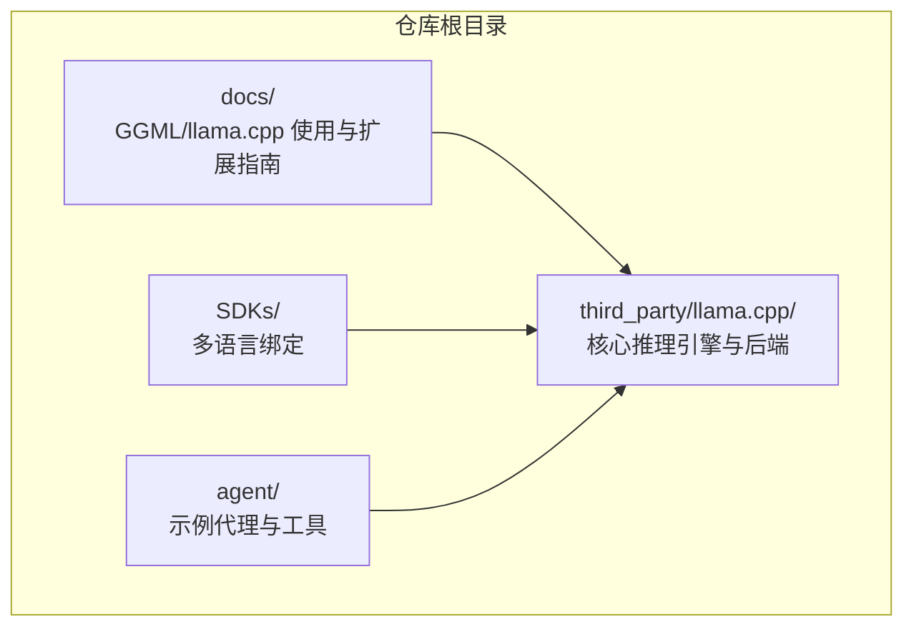
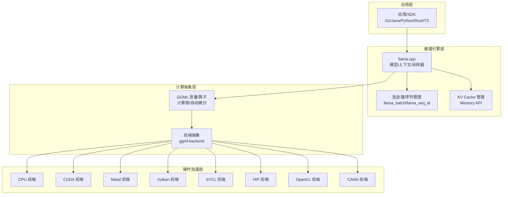
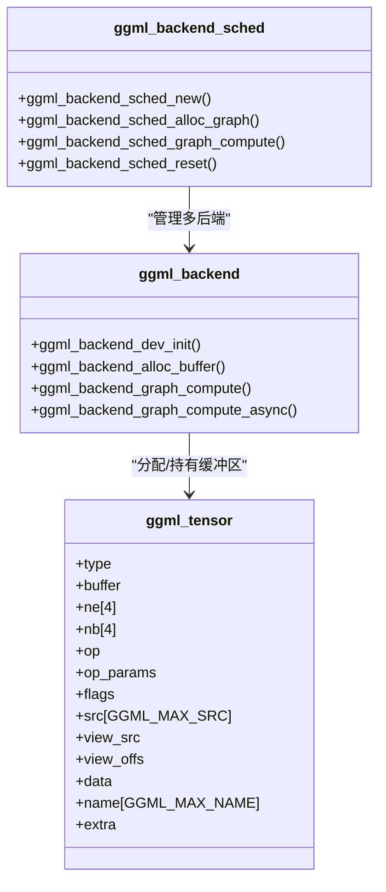
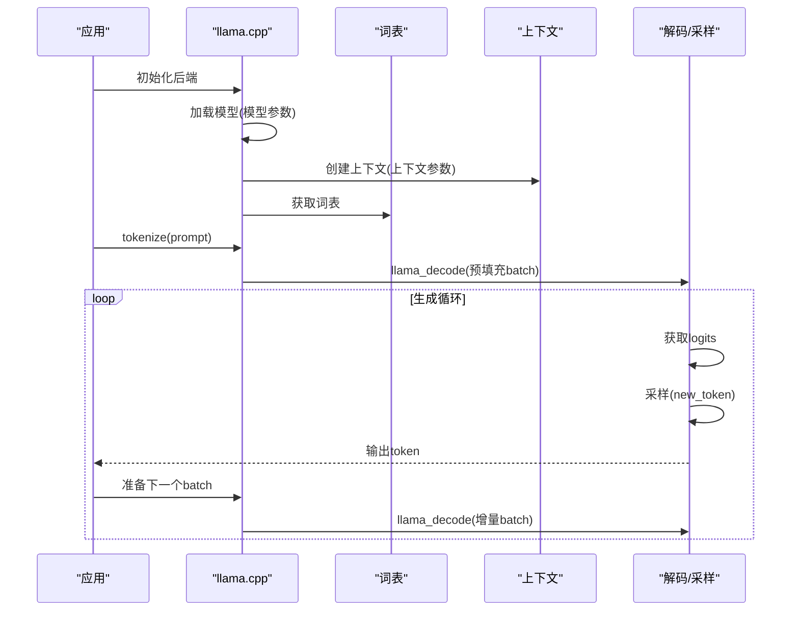
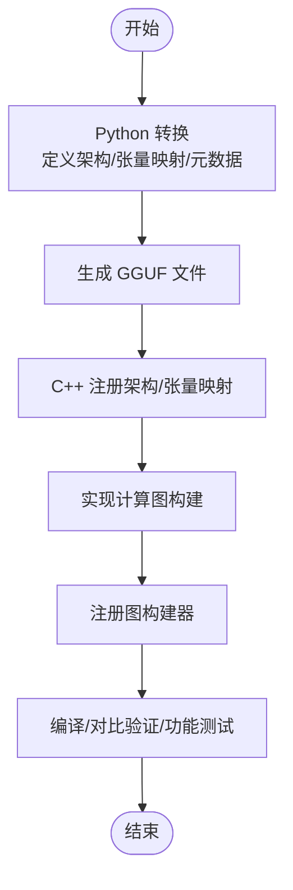
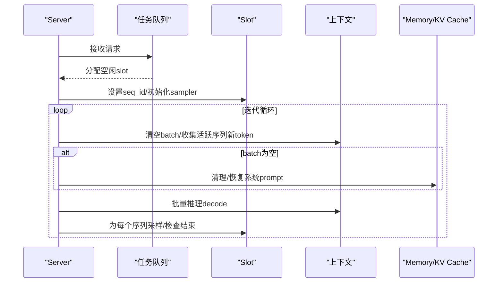
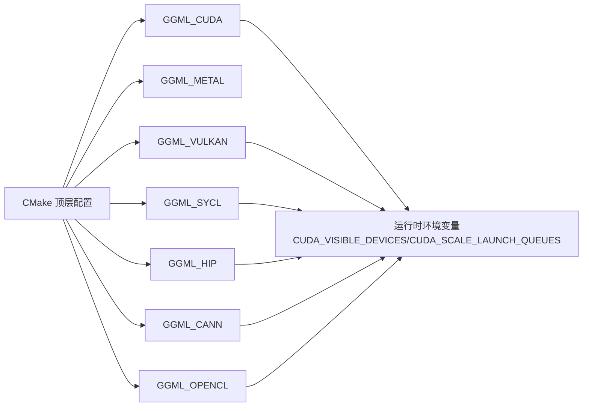

# 模型和硬件加速

<cite>
**本文引用的文件**
- [docs/ggml-analysis.md](file://docs/ggml-analysis.md)
- [docs/llama-cpp-usage-guide.md](file://docs/llama-cpp-usage-guide.md)
- [docs/llama-cpp-new-model-support.md](file://docs/llama-cpp-new-model-support.md)
- [docs/llama-cpp-parallel-request.md](file://docs/llama-cpp-parallel-request.md)
- [third_party/llama.cpp/README.md](file://third_party/llama.cpp/README.md)
- [third_party/llama.cpp/CMakeLists.txt](file://third_party/llama.cpp/CMakeLists.txt)
- [third_party/llama.cpp/docs/build.md](file://third_party/llama.cpp/docs/build.md)
- [third_party/llama.cpp/docs/install.md](file://third_party/llama.cpp/docs/install.md)
- [third_party/llama.cpp/include/llama.h](file://third_party/llama.cpp/include/llama.h)
- [third_party/llama.cpp/src/llama.cpp](file://third_party/llama.cpp/src/llama.cpp)
</cite>

## 目录
1. [简介](#简介)
2. [项目结构](#项目结构)
3. [核心组件](#核心组件)
4. [架构总览](#架构总览)
5. [详细组件分析](#详细组件分析)
6. [依赖分析](#依赖分析)
7. [性能考量](#性能考量)
8. [故障排查指南](#故障排查指南)
9. [结论](#结论)
10. [附录](#附录)

## 简介
本文件面向希望在多平台上集成并优化 llama.cpp 与 GGML 张量计算库的工程团队，系统阐述模型加载机制、硬件加速配置、量化与算子映射、并行请求处理、性能基准与资源监控、编译与运行时参数、兼容性与故障诊断等关键主题。文档同时提供面向不同硬件后端（CPU、CUDA、Metal、Vulkan、SYCL、HIP、CANN、OpenCL 等）的配置要点与调优建议，帮助读者快速落地高性能推理服务。

## 项目结构
仓库采用“第三方子模块 + 文档 + SDK”的组织方式：
- 第三方子模块：third_party/llama.cpp 提供核心推理引擎与 GGML 后端生态
- 文档：docs 下包含 GGML 算子分析、llama.cpp 使用指南、新模型支持、并行请求处理等专题文档
- SDK：SDKs 目录提供多语言绑定（Go/Java/Python/Rust/TypeScript），便于在应用中集成
- agent：示例代理与工具链，展示如何在实际业务中调用推理能力

**章节来源**
- [third_party/llama.cpp/README.md:1-120](file://third_party/llama.cpp/README.md#L1-L120)

## 核心组件
- GGML 张量计算库：提供多后端（CPU、CUDA、Metal、Vulkan、SYCL、OpenCL 等）张量运算、自动微分、优化器与量化支持，并通过计算图实现惰性求值与算子调度。
- llama.cpp 推理框架：基于 GGML 构建的 LLM 推理库，提供 C API、模型加载、上下文管理、采样器、批处理与并行解码、KV Cache 管理等能力。
- 模型与算子映射：将高层 Transformer/FFN/注意力等算子映射到 GGML 原子算子（如 ggml_mul_mat、ggml_rope、ggml_flash_attn_ext 等）。
- 并行请求处理：通过 Batch 与 Sequence 机制，将多用户请求打包到一个批次中进行并行推理，最大化 GPU/CPU 利用率。

**章节来源**
- [docs/ggml-analysis.md:14-50](file://docs/ggml-analysis.md#L14-L50)
- [docs/llama-cpp-usage-guide.md:14-76](file://docs/llama-cpp-usage-guide.md#L14-L76)
- [docs/llama-cpp-parallel-request.md:55-110](file://docs/llama-cpp-parallel-request.md#L55-L110)

## 架构总览
llama.cpp 的整体架构围绕“模型加载 → 上下文初始化 → 批处理与序列管理 → KV Cache → 算子计算图 → 后端执行”展开。GGML 提供统一的张量与算子抽象，llama.cpp 在其之上实现模型特定的前向图构建与推理流程；后端通过 ggml-backend 抽象层对接不同硬件。

**图表来源**
- [docs/llama-cpp-usage-guide.md:257-348](file://docs/llama-cpp-usage-guide.md#L257-L348)
- [third_party/llama.cpp/docs/build.md:275-296](file://third_party/llama.cpp/docs/build.md#L275-L296)

**章节来源**
- [docs/llama-cpp-usage-guide.md:257-348](file://docs/llama-cpp-usage-guide.md#L257-L348)
- [third_party/llama.cpp/docs/build.md:275-296](file://third_party/llama.cpp/docs/build.md#L275-L296)

## 详细组件分析

### GGML 张量与算子体系
- 核心数据结构：ggml_tensor 包含类型、形状、步长、源张量、视图信息、数据指针与额外后端字段；张量标志用于标记输入/输出/参数/损失/计算等属性。
- 算子分类：基础数学运算（加减乘除、平方、开方、对数、三角函数）、激活函数（ReLU、GELU、SiLU、ELU 等）、归一化（LayerNorm、RMSNorm、GroupNorm、L2Norm）、矩阵运算（矩阵乘法、外积、转置）、形状操作（重塑、视图、维度重排、连续化）、注意力相关（Softmax、RoPE、Flash Attention、注意力掩码）、卷积/池化、状态空间模型（SSM）与 RWKV 算子、GLU 门控线性单元、优化器与损失函数等。
- 后端架构：支持 CPU、CUDA、Metal、Vulkan、SYCL、OpenCL、RPC 等后端；通过 ggml_backend 接口创建设备、分配缓冲区、执行计算图与异步执行；调度器支持多后端、图大小感知、并行与算子卸载。
- 量化类型：支持 F32/F16/BF16/I8/I16/I32/I64/F64 以及多种 Q/K/I-quants 量化格式；提供量化初始化与量化 API，支持重要性矩阵（I-quants）。

**图表来源**
- [docs/ggml-analysis.md:55-90](file://docs/ggml-analysis.md#L55-L90)
- [docs/ggml-analysis.md:537-596](file://docs/ggml-analysis.md#L537-L596)

**章节来源**
- [docs/ggml-analysis.md:55-90](file://docs/ggml-analysis.md#L55-L90)
- [docs/ggml-analysis.md:94-396](file://docs/ggml-analysis.md#L94-L396)
- [docs/ggml-analysis.md:537-596](file://docs/ggml-analysis.md#L537-L596)
- [docs/ggml-analysis.md:600-672](file://docs/ggml-analysis.md#L600-L672)

### llama.cpp 推理 API 与算子映射
- API 概览：llama.h 提供模型加载、上下文初始化、批处理、采样器、解码、嵌入提取、内存管理等接口；核心结构包括 llama_model、llama_context、llama_vocab、llama_batch、llama_sampler。
- 算子映射：高层 Transformer 层（RMSNorm、Q/K/V 投影、RoPE、注意力、FFN SwiGLU、残差连接）映射到 GGML 算子（ggml_rms_norm、ggml_mul_mat、ggml_rope_ext、ggml_flash_attn_ext、ggml_silu、ggml_add 等）。
- 后端算子实现：每个 GGML 算子在不同后端有不同实现（例如 ggml_mul_mat 在 CUDA/Metal/Vulkan/SYCL 下分别由原生内核实现，Flash Attention 在 CUDA/Metal 下有专用内核）。

**图表来源**
- [docs/llama-cpp-usage-guide.md:80-184](file://docs/llama-cpp-usage-guide.md#L80-L184)

**章节来源**
- [docs/llama-cpp-usage-guide.md:14-76](file://docs/llama-cpp-usage-guide.md#L14-L76)
- [docs/llama-cpp-usage-guide.md:257-348](file://docs/llama-cpp-usage-guide.md#L257-L348)
- [third_party/llama.cpp/include/llama.h:61-120](file://third_party/llama.cpp/include/llama.h#L61-L120)

### 新模型支持与 GGUF 转换
- 流程概览：原始模型 → Python 转换 → GGUF 格式 → llama.cpp 推理执行；涉及架构枚举、张量名称映射、元数据写入、RoPE/注意力参数设置等。
- Python 端：定义 MODEL_ARCH、MODEL_TENSORS，设置 GGUF 参数（上下文长度、嵌入维度、层数、注意力头数、层归一化与 RoPE 参数等），执行转换与量化。
- C++ 端：在 src/llama-arch.h/.cpp 中注册新架构与张量名称映射，在 src/llama-model.cpp 中加载超参数与 RoPE 类型，在 models/ 目录实现计算图构建并在 llama-model.cpp 中注册图构建器。
- 验证与测试：编译测试、对比验证（PyTorch vs llama.cpp）、功能测试清单（基本推理、批处理、量化、Server、Perplexity）。

**图表来源**
- [docs/llama-cpp-new-model-support.md:7-25](file://docs/llama-cpp-new-model-support.md#L7-L25)
- [docs/llama-cpp-new-model-support.md:115-276](file://docs/llama-cpp-new-model-support.md#L115-L276)
- [docs/llama-cpp-new-model-support.md:279-594](file://docs/llama-cpp-new-model-support.md#L279-L594)

**章节来源**
- [docs/llama-cpp-new-model-support.md:7-25](file://docs/llama-cpp-new-model-support.md#L7-L25)
- [docs/llama-cpp-new-model-support.md:115-276](file://docs/llama-cpp-new-model-support.md#L115-L276)
- [docs/llama-cpp-new-model-support.md:279-594](file://docs/llama-cpp-new-model-support.md#L279-L594)

### 并行请求处理机制
- 核心数据结构：llama_batch（token、pos、seq_id、logits 等）、llama_seq_id（序列标识符）、上下文参数（n_ctx、n_batch、n_ubatch、n_seq_max）。
- 并行机制：Continuous Batching（迭代级调度）将多个用户请求合并到一个 batch 中，通过 KV Cache 隔离不同序列，支持动态批处理、分块处理与 logits 过滤。
- KV Cache 管理：提供删除、复制、保留、位置调整等 API，支持共享系统 prompt、上下文滑动等优化策略。
- Server 架构：Slot 管理、任务队列、状态机、更新循环与流式响应。

**图表来源**
- [docs/llama-cpp-parallel-request.md:10-53](file://docs/llama-cpp-parallel-request.md#L10-L53)
- [docs/llama-cpp-parallel-request.md:110-245](file://docs/llama-cpp-parallel-request.md#L110-L245)
- [docs/llama-cpp-parallel-request.md:247-324](file://docs/llama-cpp-parallel-request.md#L247-L324)

**章节来源**
- [docs/llama-cpp-parallel-request.md:55-110](file://docs/llama-cpp-parallel-request.md#L55-L110)
- [docs/llama-cpp-parallel-request.md:110-245](file://docs/llama-cpp-parallel-request.md#L110-L245)
- [docs/llama-cpp-parallel-request.md:247-324](file://docs/llama-cpp-parallel-request.md#L247-L324)

## 依赖分析
- 编译系统：CMake 顶层配置，支持多后端开关（GGML_CUDA、GGML_METAL、GGML_VULKAN、GGML_SYCL、GGML_HIP、GGML_CANN、GGML_OPENCL 等），并提供构建选项与环境变量控制。
- 运行时依赖：llama.cpp 通过 ggml-backend 抽象层对接不同硬件；支持动态加载后端库（GGML_BACKEND_DL）。
- 安装方式：提供 Homebrew、Winget、MacPorts、Nix 等预构建安装方式，便于快速试用与部署。

**图表来源**
- [third_party/llama.cpp/CMakeLists.txt:140-165](file://third_party/llama.cpp/CMakeLists.txt#L140-L165)
- [third_party/llama.cpp/docs/build.md:257-283](file://third_party/llama.cpp/docs/build.md#L257-L283)

**章节来源**
- [third_party/llama.cpp/CMakeLists.txt:140-165](file://third_party/llama.cpp/CMakeLists.txt#L140-L165)
- [third_party/llama.cpp/docs/build.md:257-283](file://third_party/llama.cpp/docs/build.md#L257-L283)
- [third_party/llama.cpp/docs/install.md:1-51](file://third_party/llama.cpp/docs/install.md#L1-L51)

## 性能考量
- 硬件后端选择：根据目标平台选择 Metal（Apple Silicon）、CUDA（NVIDIA）、Vulkan（跨平台 GPU）、SYCL（Intel GPU）、HIP（AMD GPU）、CANN（Ascend NPU）、OpenCL（Adreno GPU）等；可在同一二进制中构建多后端并通过 --device 选择。
- 量化策略：优先使用 F16/Mostly Q4/K-quants/I-quants 等量化格式降低显存占用与提升吞吐；注意量化精度与数值稳定性之间的平衡。
- 批处理与并行：合理设置 n_batch、n_seq_max、n_ubatch；启用 Continuous Batching 与 Flash Attention；对 KV Cache 使用合适的类型（type_k/type_v）与共享策略。
- 环境变量与编译选项：CUDA_SCALE_LAUNCH_QUEUES、GGML_CUDA_FORCE_CUBLAS_COMPUTE_32F/16F、Unified Memory 等；编译时可强制 MMQ/自定义内核或 cuBLAS；针对不同 GPU 架构设置 CMAKE_CUDA_ARCHITECTURES。
- 资源监控：通过 llama.cpp 的内存分解打印与设备内存查询接口监控显存/主机内存使用情况，结合日志级别进行调试。

**章节来源**
- [third_party/llama.cpp/docs/build.md:284-344](file://third_party/llama.cpp/docs/build.md#L284-L344)
- [docs/llama-cpp-parallel-request.md:416-451](file://docs/llama-cpp-parallel-request.md#L416-L451)
- [third_party/llama.cpp/src/llama.cpp:48-145](file://third_party/llama.cpp/src/llama.cpp#L48-L145)

## 故障排查指南
- 常见问题定位：
  - 张量形状不匹配：检查转换脚本中权重转置与张量命名映射是否正确。
  - 算子不支持：确认后端是否实现该算子，或使用等价算子替代；必要时启用 CPU 回退。
  - KV Cache 大小问题：减小上下文长度（n_ctx）或调整序列数量（n_seq_max）。
  - 位置编码问题：核对 RoPE 类型与频率参数，确保位置索引正确传递。
  - 注意力掩码问题：确保使用因果掩码（masked=true）。
- 日志与调试：通过 llama.cpp 的日志回调与内存分解打印定位资源瓶颈；使用 --list-devices 查看可用设备；在 Windows/Linux 上设置 CUDA_VISIBLE_DEVICES/HIP_VISIBLE_DEVICES 等环境变量隔离设备。
- 验证方法：使用 llama-eval-callback 导出中间结果并与 PyTorch 原始模型对比；运行功能测试清单覆盖基本推理、批处理、量化、Server、Perplexity 等场景。

**章节来源**
- [docs/llama-cpp-new-model-support.md:672-722](file://docs/llama-cpp-new-model-support.md#L672-L722)
- [third_party/llama.cpp/docs/build.md:757-765](file://third_party/llama.cpp/docs/build.md#L757-L765)
- [docs/llama-cpp-parallel-request.md:552-571](file://docs/llama-cpp-parallel-request.md#L552-L571)

## 结论
llama.cpp 与 GGML 的组合为多平台 LLM 推理提供了统一、高性能且可扩展的基础设施。通过清晰的算子抽象、灵活的后端选择、完善的量化与并行机制，以及系统化的模型支持流程，开发者可以快速在本地与云端部署稳定高效的推理服务。建议在生产环境中结合硬件特性与业务需求，制定合理的量化策略、批处理参数与后端配置，并建立完善的监控与故障排查流程。

## 附录

### 编译与运行时参数速查
- 编译选项（示例）
  - GGML_CUDA=ON：启用 CUDA 后端
  - GGML_METAL=ON：启用 Metal 后端（默认）
  - GGML_VULKAN=ON：启用 Vulkan 后端
  - GGML_SYCL=ON：启用 SYCL 后端（Intel GPU）
  - GGML_HIP=ON：启用 HIP 后端（AMD GPU）
  - GGML_CANN=ON：启用 CANN 后端（Ascend NPU）
  - GGML_OPENCL=ON：启用 OpenCL 后端（Adreno GPU）
  - GGML_BACKEND_DL=ON：启用后端动态加载
  - CMAKE_CUDA_ARCHITECTURES：指定 CUDA 架构（如 86/89）
- 运行时环境变量（示例）
  - CUDA_VISIBLE_DEVICES：隐藏/选择 GPU
  - CUDA_SCALE_LAUNCH_QUEUES：增大命令缓冲队列
  - GGML_CUDA_FORCE_CUBLAS_COMPUTE_32F/16F：强制 FP32/FP16 计算类型
  - GGML_CUDA_ENABLE_UNIFIED_MEMORY=1：启用统一内存（Linux）

**章节来源**
- [third_party/llama.cpp/CMakeLists.txt:140-165](file://third_party/llama.cpp/CMakeLists.txt#L140-L165)
- [third_party/llama.cpp/docs/build.md:257-283](file://third_party/llama.cpp/docs/build.md#L257-L283)